> **DEPRECATED (Issue #180)**: The recovery flow (DD-RECOVERY-002/003) has been deprecated.
> The existing DS remediation-history flow (ADR-055) provides historical context on signal re-arrival.
> This document is preserved for historical reference only.

---


# Step Failure Recovery Architecture

**Version**: 1.1
**Date**: November 15, 2025
**Status**: Updated - Service Naming Corrections

## Changelog

### Version 1.1 (2025-11-15)

**Service Naming Corrections**: Corrected "Workflow Engine" → "Remediation Execution Engine" per ADR-035.

**Changes**:
- Updated all references to use correct service naming
- Aligned terminology with authoritative ADR-035
- Maintained consistency with NAMING_CONVENTION_REMEDIATION_EXECUTION.md

---


**Document Version**: 1.1
**Date**: October 8, 2025 (Updated)
**Purpose**: Comprehensive design principles and architecture for handling workflow step execution failures and completing remediation
**Status**: ✅ **APPROVED & ALIGNED WITH SEQUENCE DIAGRAM**
**Confidence**: 95% (High confidence - validated against BR-WF-RECOVERY-* requirements and DD-001)

---

## 📚 **Related Documentation**

**Sequence Diagram**: [`PROPOSED_FAILURE_RECOVERY_SEQUENCE.md`](./PROPOSED_FAILURE_RECOVERY_SEQUENCE.md)
**Design Decision**: [DD-001 - Recovery Context Enrichment](./DESIGN_DECISIONS.md#dd-001-recovery-context-enrichment-alternative-2)
**Business Requirements**: BR-WF-RECOVERY-001 through BR-WF-RECOVERY-011

This architecture document provides the theoretical foundation and design principles. For the operational sequence and controller interactions, refer to the approved sequence diagram above. For the decision rationale on recovery context enrichment (Alternative 2), see DD-001.

---

## 🎯 **Executive Summary**

This document details the design principles, architecture patterns, and recovery mechanisms employed when a workflow step execution fails in the Kubernaut remediation system. The architecture implements a multi-layered, AI-enhanced recovery strategy that maximizes remediation success rates while maintaining system safety and stability.

### **Key Design Principles**

1. **Resilience Over Failure**: <10% workflow termination rate (BR-WF-541)
2. **AI-Enhanced Recovery**: HolmesGPT-powered failure investigation and recovery planning
3. **Learning-Based Adaptation**: Continuous improvement from execution outcomes (BR-ORCH-004)
4. **Graceful Degradation**: Multi-tier fallback strategy (HolmesGPT → LLM → Rule-based)
5. **Health-Aware Processing**: Dynamic workflow continuation decisions based on execution health

---

## 📊 **Failure Detection and Classification**

### **1. Failure Detection Hierarchy**

```mermaid
graph TD
    A[Workflow Step Execution] --> B{Execution Successful?}
    B -->|Yes| C[✅ Continue to Next Step]
    B -->|No| D[🔍 Failure Detection]

    D --> E[Classify Failure Type]
    E --> F{Failure Severity}

    F -->|Critical| G[🚨 Critical System Failure]
    F -->|High| H[⚠️ Recoverable Failure]
    F -->|Medium| I[🔧 Retry Candidate]
    F -->|Low| J[📝 Warning Only]

    G --> K[Immediate Termination Path]
    H --> L[AI-Enhanced Recovery Path]
    I --> M[Learning-Based Retry Path]
    J --> N[Continue with Warning]

    L --> O[HolmesGPT Investigation]
    M --> P[Adaptive Retry Strategy]

    O --> Q{Recovery Possible?}
    Q -->|Yes| R[Execute Recovery Workflow]
    Q -->|No| S[Alternative Execution Path]

    R --> T[Monitor Recovery Success]
    S --> T

    T --> U{Recovery Successful?}
    U -->|Yes| C
    U -->|No| V[Health-Based Decision]

    V --> W{Workflow Health > Threshold?}
    W -->|Yes| L
    W -->|No| K

    style G fill:#ff6b6b
    style L fill:#4ecdc4
    style O fill:#95e1d3
    style R fill:#a8e6cf
    style C fill:#c7f0bd
```



### **2. Failure Classification Matrix**

| **Failure Type** | **Severity** | **Immediate Action** | **Recovery Strategy** | **Business Requirement** |
|------------------|--------------|----------------------|------------------------|--------------------------|
| **Kubernetes API Error** | Medium | Retry with backoff | RBAC validation + retry | BR-REL-006 |
| **Resource Not Found** | High | Alternative resource lookup | Resource discovery + recreation | BR-REL-007 |
| **Timeout Expired** | High | Context analysis | Adjust timeout + retry | BR-WF-TIMEOUT-002 |
| **Permission Denied** | High | Escalate for approval | Manual intervention | BR-SEC-006 |
| **Resource Contention** | Medium | Queue for later | Load balancing + retry | BR-PERF-020 |
| **Critical System Failure** | Critical | Immediate termination | Alert operations team | BR-WF-CRITICAL-001 |
| **Network Partition** | Critical | Cluster failover | Multi-cluster recovery | BR-ORCH-018 |

---

## 🧠 **AI-Enhanced Failure Analysis**

### **1. HolmesGPT Investigation Flow**

```ascii
┌────────────────────────────────────────────────────────────────────┐
│                    AI-ENHANCED FAILURE ANALYSIS                    │
├────────────────────────────────────────────────────────────────────┤
│                                                                    │
│  Step 1: Failure Context Enrichment                               │
│  ┌──────────────────────────────────────────────────────────────┐ │
│  │ • Kubernetes cluster state snapshot                          │ │
│  │ • Prometheus metrics (15-minute window)                      │ │
│  │ • Related alert correlation                                  │ │
│  │ • Historical failure patterns                                │ │
│  │ • Resource utilization metrics                               │ │
│  └──────────────────────────────────────────────────────────────┘ │
│                              │                                     │
│                              ▼                                     │
│  Step 2: HolmesGPT Investigation                                  │
│  ┌──────────────────────────────────────────────────────────────┐ │
│  │ 🔍 INVESTIGATION ONLY (NOT EXECUTION)                        │ │
│  │                                                               │ │
│  │ Analysis Components:                                          │ │
│  │ • Root cause identification                                   │ │
│  │ • Pattern recognition from 1,247+ historical cases           │ │
│  │ • Resource dependency analysis                                │ │
│  │ • Recovery recommendation generation (3-5 options)            │ │
│  │ • Confidence scoring (target: ≥80%)                          │ │
│  │                                                               │ │
│  │ Investigation Result:                                         │ │
│  │   {                                                           │ │
│  │     "root_cause": "Resource contention + finalizer conflict", │ │
│  │     "recommendations": [                                      │ │
│  │       "force_delete_with_grace_period_0",                    │ │
│  │       "scale_down_resource_intensive_pods",                  │ │
│  │       "clear_stuck_finalizers"                               │ │
│  │     ],                                                        │ │
│  │     "confidence": 0.87,                                       │ │
│  │     "processing_time": "3.2s"                                │ │
│  │   }                                                           │ │
│  └──────────────────────────────────────────────────────────────┘ │
│                              │                                     │
│                              ▼                                     │
│  Step 3: Learning Pattern Update (BR-ORCH-004)                    │
│  ┌──────────────────────────────────────────────────────────────┐ │
│  │ • Update failure pattern database                             │ │
│  │ • Adjust success rate statistics (78% → 82%)                 │ │
│  │ • Refine confidence thresholds                                │ │
│  │ • Optimize retry delay calculations                           │ │
│  │ • Track pattern effectiveness (target: ≥75% accuracy)        │ │
│  └──────────────────────────────────────────────────────────────┘ │
│                              │                                     │
│                              ▼                                     │
│  Step 4: Recovery Decision Synthesis                              │
│  ┌──────────────────────────────────────────────────────────────┐ │
│  │ Decision Factors:                                             │ │
│  │ • AI recommendation confidence: 87%                           │ │
│  │ • Historical success rate: 82%                                │ │
│  │ • Workflow health score: 0.75 (can continue)                 │ │
│  │ • Business impact: MEDIUM                                     │ │
│  │ • Resource availability: Available                            │ │
│  │                                                               │ │
│  │ Decision: EXECUTE RECOVERY with AI-recommended action         │ │
│  └──────────────────────────────────────────────────────────────┘ │
└────────────────────────────────────────────────────────────────────┘
```

### **2. Graceful Degradation Strategy (V1)**

When HolmesGPT is unavailable, the system implements a multi-tier fallback:

```ascii
┌────────────────────────────────────────────────────────────────────┐
│                      GRACEFUL DEGRADATION FLOW                     │
├────────────────────────────────────────────────────────────────────┤
│                                                                    │
│  Tier 1: HolmesGPT Investigation (Primary)                         │
│  ┌──────────────────────────────────────────────────────────────┐ │
│  │ ✅ Available: Full AI-powered analysis                        │ │
│  │ • Confidence: 85-95%                                          │ │
│  │ • Processing: 2-5 seconds                                     │ │
│  │ • Context: Kubernetes + Prometheus enriched                  │ │
│  └──────────────────────────────────────────────────────────────┘ │
│                              │                                     │
│                              ▼ (Service Failure)                   │
│  Tier 2: LLM Direct Analysis (Secondary - V2)                     │
│  ┌──────────────────────────────────────────────────────────────┐ │
│  │ ⚡ Fallback: General AI analysis                             │ │
│  │ • Confidence: 75-85%                                          │ │
│  │ • Processing: 3-8 seconds                                     │ │
│  │ • Context: Reduced context window                             │ │
│  │ • Note: V2 feature (deferred)                                 │ │
│  └──────────────────────────────────────────────────────────────┘ │
│                              │                                     │
│                              ▼ (LLM Failure)                       │
│  Tier 3: Rule-Based Fallback (Tertiary - V1)                      │
│  ┌──────────────────────────────────────────────────────────────┐ │
│  │ 🔧 Last Resort: Pattern matching                             │ │
│  │ • Confidence: 60-70%                                          │ │
│  │ • Processing: <100ms                                          │ │
│  │ • Strategy: Alert severity + resource type heuristics         │ │
│  │ • Actions: Safe, conservative operations only                 │ │
│  └──────────────────────────────────────────────────────────────┘ │
│                                                                    │
└────────────────────────────────────────────────────────────────────┘
```

**Business Requirements**:
- BR-AI-014: Graceful degradation when AI services unavailable
- BR-REL-010: Support graceful degradation during partial system failures

---

## 🔄 **Recovery Execution Architecture**

### **1. Recovery Workflow Creation**

When a step fails, the system creates a **recovery workflow** that attempts to complete the remediation:

```go
// Recovery Workflow Creation
func (r *WorkflowExecutionReconciler) handleStepFailure(
    ctx context.Context,
    workflow *WorkflowExecution,
    failedStep *WorkflowStep,
    failure *StepFailure,
) error {

    // Step 1: AI-Enhanced Failure Analysis
    investigation, err := r.investigateFailure(ctx, workflow, failedStep, failure)
    if err != nil {
        // Fallback to rule-based analysis
        investigation = r.ruleBasedAnalysis(failure)
    }

    // Step 2: Learning Update (BR-ORCH-004)
    r.learnFromFailure(failure, investigation)

    // Step 3: Health Assessment (BR-WF-HEALTH-001)
    health := r.calculateWorkflowHealth(workflow)
    if health.CanContinue == false {
        return r.terminateWorkflow(ctx, workflow, "health_threshold_exceeded")
    }

    // Step 4: Recovery Decision
    decision := r.determineRecoveryAction(investigation, health, workflow.Spec.FailurePolicy)

    switch decision.Action {
    case "retry":
        return r.retryStepWithLearning(ctx, workflow, failedStep, decision)

    case "alternative_path":
        return r.executeAlternativePath(ctx, workflow, failedStep, investigation.Recommendations)

    case "recovery_workflow":
        return r.createRecoveryWorkflow(ctx, workflow, investigation.Recommendations)

    case "partial_success":
        return r.completePartialSuccess(ctx, workflow, health)

    case "terminate":
        return r.terminateWorkflow(ctx, workflow, decision.Reason)
    }

    return nil
}
```

### **2. Recovery Execution Patterns**

#### **Pattern A: Retry with Learning-Based Adjustment**

```ascii
Original Step Failed
         │
         ▼
┌────────────────────┐
│ Analyze Failure    │
│ Pattern            │
└────────┬───────────┘
         │
         ▼
┌────────────────────┐     ┌──────────────────┐     ┌─────────────────┐
│ Calculate Optimal  │────▶│ Adjust Step      │────▶│ Retry Execution │
│ Retry Delay        │     │ Parameters       │     │ (Enhanced)      │
└────────────────────┘     └──────────────────┘     └─────────────────┘
         │                           │                        │
         │                           │                        │
         ▼                           ▼                        ▼
    Base: 2s                  Timeout: 5m → 8m         MaxRetries: 2 → 3
    Learning: +1.5s           Resources: +20%          Priority: Normal → High
    Final: 3.5s               Confidence: Track        Monitor: Enhanced
```

**Business Requirements**:
- BR-WF-LEARNING-001: ≥80% confidence threshold for learning-based decisions
- BR-REL-007: Automatic retry with exponential backoff
- BR-WF-014: Action retry mechanisms with configurable strategies

#### **Pattern B: Alternative Execution Path**

When the primary remediation action fails, attempt alternative approaches:

```ascii
Primary Action Failed
         │
         ▼
┌────────────────────┐
│ HolmesGPT Analysis │
└────────┬───────────┘
         │
         ▼
┌───────────────────────────────────────────────────────────┐
│ Alternative Actions Ranked by Confidence:                 │
│                                                            │
│ 1. force_delete_with_grace_period_0    (confidence: 0.87) │
│ 2. scale_down_resource_intensive_pods  (confidence: 0.82) │
│ 3. clear_stuck_finalizers              (confidence: 0.78) │
└────────┬──────────────────────────────────────────────────┘
         │
         ▼
┌────────────────────┐     ┌──────────────────┐     ┌─────────────────┐
│ Validate Safety    │────▶│ Execute Alt #1   │────▶│ Monitor Success │
│ (Rego Policy)      │     │ via Kubernetes   │     │                 │
└────────────────────┘     │ Executor         │     └─────────────────┘
         │                 └──────────────────┘              │
         │                                                   │
         ▼ (Failed)                                         ▼ (Success)
┌────────────────────┐                              ┌─────────────────┐
│ Try Alt #2         │                              │ Update Learning │
└────────────────────┘                              │ Success Pattern │
                                                    └─────────────────┘
```

**Business Requirements**:
- BR-WF-RECOVERY-001: Generate recovery plans with multiple options
- BR-IWB-015: Identify and eliminate redundant or ineffective steps
- BR-WF-HOLMESGPT-003: Translate HolmesGPT recommendations into executable actions

#### **Pattern C: Recovery Workflow Creation**

For complex failures, create a new recovery workflow:

```go
// Recovery Workflow Structure
RecoveryWorkflow {
    ParentWorkflow: "original-workflow-id",
    Trigger: "step_3_failure",
    Strategy: "comprehensive_recovery",

    Steps: [
        {
            StepNumber: 1,
            Name: "diagnose_root_cause",
            Action: "investigate_cluster_state",
            Description: "Gather comprehensive diagnostic information"
        },
        {
            StepNumber: 2,
            Name: "clear_blocking_resources",
            Action: "force_delete_stuck_resources",
            DependsOn: [1],
            Description: "Clear resources blocking remediation"
        },
        {
            StepNumber: 3,
            Name: "retry_original_action",
            Action: "scale_deployment",  // Original failed action
            DependsOn: [2],
            Parameters: {
                // Enhanced parameters based on diagnosis
                replicas: 3,
                timeout: "8m",  // Extended timeout
                resource_requests: "increased"
            }
        },
        {
            StepNumber: 4,
            Name: "validate_recovery",
            Action: "health_check",
            DependsOn: [3],
            Description: "Confirm remediation success"
        }
    ],

    FailurePolicy: "partial_success_allowed",
    MaxRetries: 1,  // Recovery workflows get one attempt
    Timeout: "15m"
}
```

**Business Requirements**:
- BR-WF-RECOVERY-001: Recovery execution mode for salvageable workflows
- BR-WF-001: Execute complex multi-step remediation workflows reliably
- BR-WF-019: Preserve context across multiple remediation stages

---

## 📊 **Workflow Health Assessment**

### **1. Health Scoring Algorithm**

```go
// Health Assessment Implementation (BR-WF-HEALTH-001)
func (w *WorkflowHealthChecker) CalculateWorkflowHealth(
    workflow *WorkflowExecution,
) *WorkflowHealth {

    totalSteps := len(workflow.Spec.WorkflowDefinition.Steps)
    completedSteps := len(workflow.Status.CompletedSteps)
    failedSteps := len(workflow.Status.FailedSteps)
    criticalFailures := w.countCriticalFailures(workflow)

    // Base health score
    baseScore := float64(completedSteps) / float64(totalSteps)

    // Learning-based adjustments
    learningBoost := w.getLearningBasedHealthAdjustment(workflow)

    // Failure penalty
    failurePenalty := float64(failedSteps) * 0.15
    criticalPenalty := float64(criticalFailures) * 0.30

    // Final health score
    healthScore := baseScore + learningBoost - failurePenalty - criticalPenalty
    healthScore = math.Max(0.0, math.Min(1.0, healthScore))

    // Continuation decision
    canContinue := w.canWorkflowContinueBasedOnLearning(
        failedSteps,
        totalSteps,
        healthScore,
        workflow.Spec.FailurePolicy,
    )

    return &WorkflowHealth{
        TotalSteps:        totalSteps,
        CompletedSteps:    completedSteps,
        FailedSteps:       failedSteps,
        CriticalFailures:  criticalFailures,
        HealthScore:       healthScore,
        CanContinue:       canContinue,
        Recommendations:   w.generateRecommendations(workflow, healthScore),
        LastUpdated:       time.Now(),
    }
}
```

### **2. Health-Based Continuation Matrix**

| **Health Score** | **Failed Steps** | **Critical Failures** | **Decision** | **Action** |
|------------------|------------------|-----------------------|--------------|------------|
| **0.85 - 1.00** | 0-1 | 0 | ✅ CONTINUE | Full execution |
| **0.75 - 0.84** | 1-2 | 0 | ⚠️ CONTINUE | Enhanced monitoring |
| **0.60 - 0.74** | 2-3 | 0 | ⚠️ CONTINUE | Recovery required |
| **0.50 - 0.59** | 3-4 | 0-1 | 🔄 RECOVERY | Alternative paths |
| **0.40 - 0.49** | 4-5 | 1-2 | 🔄 PARTIAL | Accept partial success |
| **< 0.40** | 5+ | 2+ | ❌ TERMINATE | Unrecoverable |

**Business Requirements**:
- BR-WF-HEALTH-001: Real-time workflow health scoring
- BR-WF-541: Maintain <10% workflow termination rate
- BR-ORCH-004: Learn from execution failures

---

## 🎓 **Learning and Adaptation**

### **1. Failure Pattern Learning (BR-ORCH-004)**

```go
// Learning Framework Implementation
func (p *ProductionFailureHandler) learnFromFailure(
    failure *StepFailure,
    context *ExecutionContext,
) error {

    // Extract failure pattern
    pattern := &FailurePattern{
        ActionType:      failure.ActionType,
        ErrorCode:       failure.ErrorCode,
        ErrorMessage:    failure.ErrorMessage,
        ResourceType:    failure.ResourceType,
        ClusterState:    context.ClusterState,
        Severity:        classifySeverity(failure),
        Timestamp:       time.Now(),
    }

    // Update pattern database
    existingPattern, exists := p.patternDB.Find(pattern.Signature())
    if exists {
        // Update existing pattern statistics
        existingPattern.OccurrenceCount++
        existingPattern.LastSeen = time.Now()

        // Update success rate if recovery attempted
        if context.RecoveryAttempted {
            if context.RecoverySucceeded {
                existingPattern.SuccessfulRecoveries++
            }
            existingPattern.TotalRecoveryAttempts++
            existingPattern.SuccessRate = float64(existingPattern.SuccessfulRecoveries) /
                                          float64(existingPattern.TotalRecoveryAttempts)
        }

        // Update confidence if pattern now meets threshold
        if existingPattern.OccurrenceCount >= 10 {
            existingPattern.Confidence = calculateConfidence(existingPattern)
        }
    } else {
        // Create new pattern
        pattern.OccurrenceCount = 1
        pattern.FirstSeen = time.Now()
        pattern.LastSeen = time.Now()
        pattern.Confidence = 0.0  // Insufficient data
        p.patternDB.Store(pattern)
    }

    // Optimize retry strategies
    if existingPattern != nil && existingPattern.Confidence >= 0.80 {
        p.optimizeRetryStrategy(existingPattern)
    }

    return nil
}
```

### **2. Learning-Based Decision Making**

```ascii
┌────────────────────────────────────────────────────────────────────┐
│                    LEARNING-BASED DECISION FLOW                    │
├────────────────────────────────────────────────────────────────────┤
│                                                                    │
│  Failure Detected                                                  │
│         │                                                          │
│         ▼                                                          │
│  ┌─────────────────┐                                              │
│  │ Query Pattern   │◀───── Pattern Database                       │
│  │ Database        │       (1,247+ patterns)                      │
│  └────────┬────────┘                                              │
│           │                                                        │
│           ▼                                                        │
│  ┌─────────────────┐     ┌──────────────────┐                    │
│  │ Pattern Found?  │────▶│ Confidence ≥80%? │                    │
│  └────────┬────────┘     └────────┬─────────┘                    │
│           │                       │                                │
│           │ YES                   │ YES                            │
│           ▼                       ▼                                │
│  ┌─────────────────────────────────────┐                          │
│  │ Apply Learned Strategy:             │                          │
│  │ • Historical success rate: 82%      │                          │
│  │ • Optimal retry delay: 3.5s         │                          │
│  │ • Recommended action: Alt path #2   │                          │
│  │ • Resource adjustments: +20% memory │                          │
│  │ • Timeout extension: 5m → 8m        │                          │
│  └─────────────────┬───────────────────┘                          │
│                    │                                               │
│                    ▼                                               │
│           Execute with Confidence                                  │
│                                                                    │
│           │ NO (Confidence < 80%)                                  │
│           ▼                                                        │
│  ┌─────────────────────────────────────┐                          │
│  │ Use HolmesGPT Investigation         │                          │
│  │ (Fresh AI analysis required)        │                          │
│  └─────────────────────────────────────┘                          │
│                                                                    │
└────────────────────────────────────────────────────────────────────┘
```

**Business Requirements**:
- BR-WF-LEARNING-001: ≥80% confidence threshold
- BR-ORCH-001: Continuously optimize orchestration strategies
- BR-IWB-016: Learn from workflow execution outcomes

---

## 🚨 **Termination Decision Framework**

### **1. Termination Rate Management (BR-WF-541)**

```go
// Termination Rate Management (<10% target)
func (p *ProductionFailureHandler) ShouldTerminateWorkflow(
    workflow *WorkflowExecution,
    health *WorkflowHealth,
) (*TerminationDecision, error) {

    // Calculate current termination rate
    terminationRate := p.metricsCollector.GetTerminationRate(7 * 24 * time.Hour)

    // Learning-based adjustment
    learningAdjustment := p.getLearningBasedTerminationAdjustment(health)
    adjustedThreshold := 0.10 + learningAdjustment

    // Critical system failure check
    if p.isCriticalSystemFailure(workflow.Status.LastFailure) {
        return &TerminationDecision{
            ShouldTerminate: true,
            Reason:          "critical_system_failure",
            Severity:        "CRITICAL",
            Impact:          "Immediate termination required for system safety",
        }, nil
    }

    // Health-based decision
    if health.HealthScore < 0.40 {
        // Would termination push us over the 10% rate?
        if terminationRate < adjustedThreshold {
            return &TerminationDecision{
                ShouldTerminate: true,
                Reason:          "health_threshold_exceeded",
                Severity:        "HIGH",
                CurrentRate:     terminationRate,
                ThresholdRate:   adjustedThreshold,
            }, nil
        } else {
            // Try partial success instead of termination
            return &TerminationDecision{
                ShouldTerminate: false,
                Reason:          "termination_rate_limit_reached",
                AlternativeAction: "partial_success_completion",
                CurrentRate:     terminationRate,
                ThresholdRate:   adjustedThreshold,
            }, nil
        }
    }

    // Continue execution
    return &TerminationDecision{
        ShouldTerminate: false,
        Reason:          "workflow_can_continue",
        HealthScore:     health.HealthScore,
    }, nil
}
```

### **2. Partial Success Completion**

When termination would exceed the 10% rate, attempt partial success:

```ascii
Health Score < 0.40 (Termination Threshold)
                 │
                 ▼
        ┌────────────────┐
        │ Check Current  │
        │ Termination    │
        │ Rate: 9.1%     │
        └────────┬───────┘
                 │
                 ▼
        ┌────────────────────┐
        │ Rate + This        │
        │ = 9.8% < 10%       │
        │                    │
        │ ✅ CAN TERMINATE   │
        └────────────────────┘

        VS

        ┌────────────────────┐
        │ Rate + This        │
        │ = 10.3% > 10%      │
        │                    │
        │ ❌ CANNOT TERMINATE│
        └────────┬───────────┘
                 │
                 ▼
        ┌────────────────────┐
        │ PARTIAL SUCCESS    │
        │ MODE               │
        └────────┬───────────┘
                 │
                 ▼
        ┌──────────────────────────────────────┐
        │ Evaluate Completed Steps:            │
        │ • Steps 1-3: ✅ Successful          │
        │ • Step 4: ❌ Failed                 │
        │ • Steps 5-7: ⏸️ Not attempted       │
        │                                      │
        │ Business Value Delivered: 60%        │
        │ → Accept as partial success          │
        └──────────────────────────────────────┘
```

**Business Requirements**:
- BR-WF-541: <10% workflow termination rate
- BR-REL-010: Graceful degradation during partial system failures
- BR-ORCH-001: Self-optimizing orchestration strategies

---

## 🔄 **End-to-End Failure Recovery Sequence**

### **Complete Recovery Flow**

For the complete, approved recovery sequence showing controller interactions, refer to:

**📊 [PROPOSED_FAILURE_RECOVERY_SEQUENCE.md](./PROPOSED_FAILURE_RECOVERY_SEQUENCE.md)**

### **Key Recovery Flow Characteristics**

The approved recovery flow implements the following architecture patterns:

1. **Failure Detection**: WorkflowExecution Controller detects step failure and updates CRD status
2. **Recovery Coordination**: Remediation Orchestrator watches for failures and coordinates recovery
3. **AI-Enhanced Analysis**: AIAnalysis Controller queries Context API and HolmesGPT for recovery plan
4. **Recovery Execution**: New WorkflowExecution CRD created for recovery workflow
5. **Learning Integration**: Success/failure patterns stored in Data Storage for future optimization

### **Recovery Loop Prevention**

The system implements multiple safeguards to prevent infinite recovery loops:

- **Max Recovery Attempts**: 3 attempts maximum (4 total workflow executions)
- **Pattern Detection**: Same failure pattern twice → escalate to manual review
- **Termination Rate Monitoring**: BR-WF-541 requirement (<10% termination rate)
- **Health-Based Decisions**: Workflow health score determines continuation viability

### **Recovery Phase Transitions**

```ascii
RemediationRequest Phase Progression:

  Initial → Analyzing → Executing → [FAILURE] → Recovering
                                                     ↓
                                    [Recovery Success] → Completed ✅
                                                     ↓
                          [Max Attempts/Pattern] → Failed (escalate) ❌
```

### **Controller Responsibilities in Recovery**

| Controller | Recovery Role | Key Actions |
|------------|---------------|-------------|
| **WorkflowExecution** | Failure detection | Detects step failure, updates status to "failed" with complete context |
| **Remediation Orchestrator** | Recovery coordination | Watches failures, evaluates recovery viability, creates new AIAnalysis CRD |
| **AIAnalysis** | Recovery planning | Queries Context API, analyzes with HolmesGPT, provides alternative approach |
| **K8s Executor** | Action execution | Executes recovery actions with enhanced parameters |
| **Data Storage** | Learning system | Records patterns, success rates, maintains historical context |

---

## 📊 **Metrics and Monitoring**

### **Key Performance Indicators**

| **Metric** | **Target** | **Business Requirement** | **Purpose** |
|------------|------------|---------------------------|-------------|
| **Workflow Termination Rate** | <10% | BR-WF-541 | Ensure business continuity |
| **AI Confidence Threshold** | ≥80% | BR-WF-LEARNING-001 | Reliable learning decisions |
| **Recovery Success Rate** | >90% | BR-WF-RECOVERY-001 | Effective recovery strategies |
| **Learning Pattern Accuracy** | ≥75% | BR-WF-LEARNING-001 | Pattern recognition quality |
| **HolmesGPT Response Time** | <5s | BR-PERF-004 | Timely failure analysis |
| **Health Assessment Time** | <200ms | BR-WF-PERFORMANCE-001 | Real-time decision making |

### **Prometheus Metrics**

```prometheus
# Workflow termination rate
kubernaut_workflow_termination_rate{period="7d"} 0.082  # 8.2% (target: <10%)

# AI confidence distribution
kubernaut_ai_confidence_distribution{bucket="0.8-1.0"} 0.87  # 87% high confidence

# Recovery success rate
kubernaut_recovery_success_rate{strategy="ai_guided"} 0.923  # 92.3%

# Learning pattern accuracy
kubernaut_learning_pattern_accuracy 0.854  # 85.4%

# Failure handling latency
kubernaut_failure_analysis_duration_seconds{component="holmesgpt"} 3.2
```

---

## 🎯 **Success Criteria**

### **Operational Success**

- ✅ Workflow termination rate maintained below 10% (BR-WF-541)
- ✅ AI confidence threshold ≥80% for learning-based decisions (BR-WF-LEARNING-001)
- ✅ Recovery success rate >90% (BR-WF-RECOVERY-001)
- ✅ Pattern recognition accuracy ≥75% (BR-WF-LEARNING-001)
- ✅ Health assessment latency <200ms (BR-WF-PERFORMANCE-001)

### **Business Success**

- ✅ Remediation completion rate improves over time through learning
- ✅ Mean time to recovery (MTTR) decreases with pattern accumulation
- ✅ Operational overhead reduced through automated recovery
- ✅ System reliability maintained during AI service degradation
- ✅ Clear audit trail for all failure recovery decisions

---

## 🔗 **Related Documentation**

- [Resilient Workflow AI Sequence Diagram](RESILIENT_WORKFLOW_AI_SEQUENCE_DIAGRAM.md)
- [Resilience Patterns and Failure Handling](RESILIENCE_PATTERNS.md)
- [Remediation Execution Engine Requirements](../requirements/04_WORKFLOW_ENGINE_ORCHESTRATION.md)
- [CRD Data Flow Analysis](../analysis/CRD_DATA_FLOW_COMPREHENSIVE_SUMMARY.md)
- [WorkflowExecution Controller Implementation](../services/crd-controllers/03-workflowexecution/controller-implementation.md)
- [KubernetesExecutor Controller Implementation](../services/crd-controllers/04-kubernetesexecutor/controller-implementation.md)

---

**Status**: ✅ **APPROVED**
**Implementation**: V1 (HolmesGPT-only), V2 (Multi-tier AI with LLM fallback)
**Business Requirements Coverage**: 45+ requirements addressed
**Confidence Assessment**: 95%

**Justification**: This architecture is derived from authoritative service specifications, business requirements, and proven resilience patterns. The multi-layered approach (detection → AI analysis → learning → recovery → health assessment → decision) ensures maximum remediation success while maintaining system safety. The <10% termination rate requirement is achievable through partial success completion and learning-based optimization. V1 implementation with HolmesGPT provides solid foundation for V2 multi-tier AI enhancement.

