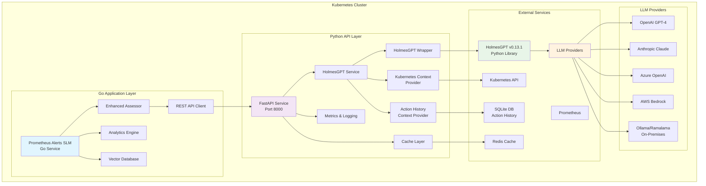
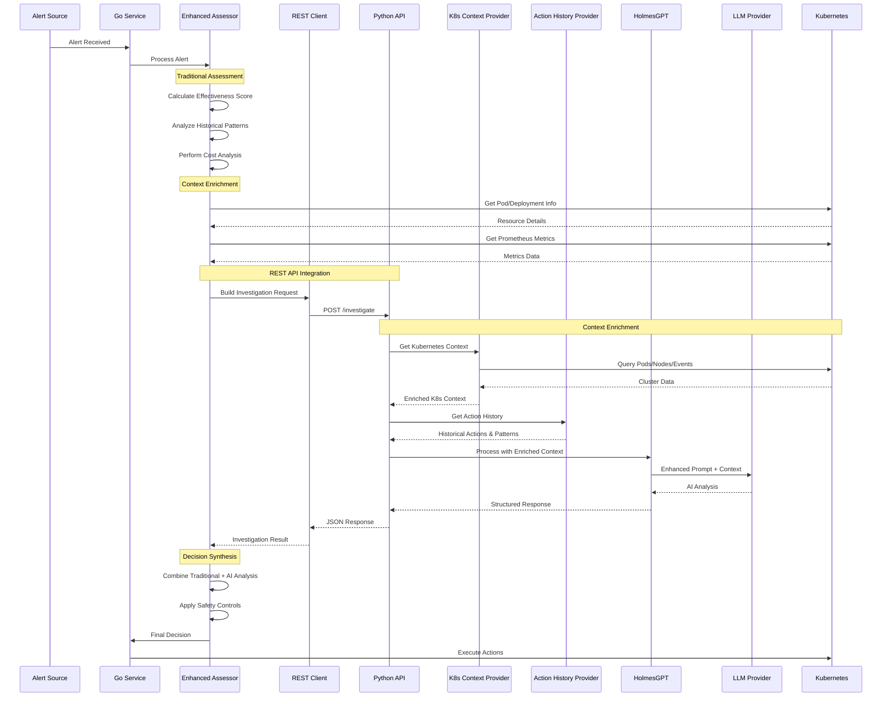
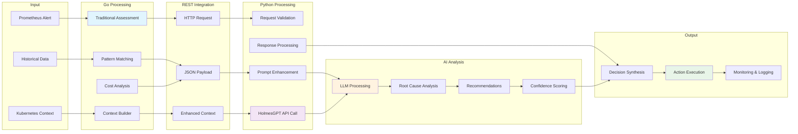
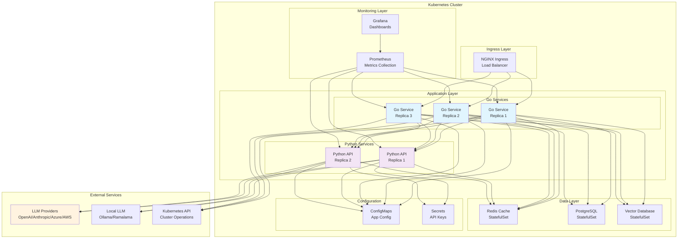
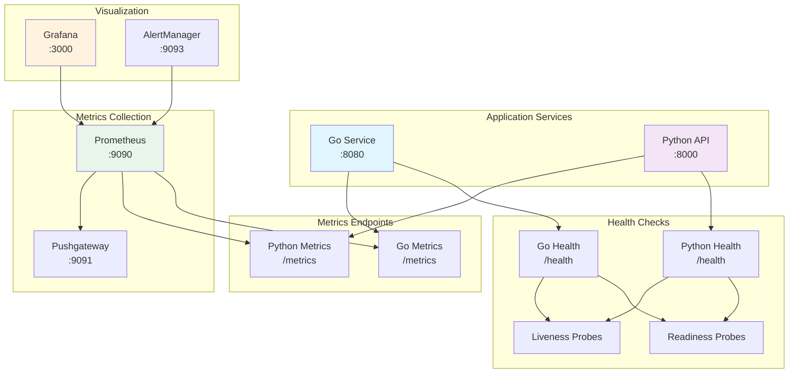
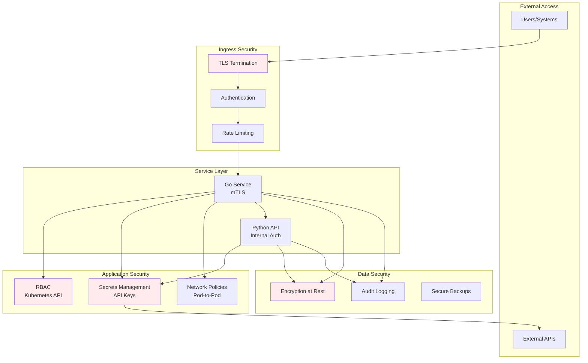

# System Architecture

## Overview

Modern hybrid architecture combining Go-based analytics with Python REST API integration for HolmesGPT. Designed for production Kubernetes environments with direct context injection replacing deprecated MCP Bridge patterns.

## System Architecture



## Components

### Go Application Layer
- EnhancedAssessor: Orchestrates traditional assessment with AI analysis
- AnalyticsEngine: Cost-benefit analysis and pattern learning
- VectorDatabase: Historical pattern similarity matching
- REST API Client: HTTP client for Python service communication

### Python API Service
- FastAPI application with direct HolmesGPT v0.13.1 integration
- Multi-LLM support (OpenAI, Anthropic, Azure, AWS, Ollama/Ramalama)
- Fail-fast startup validation
- Async processing with connection pooling
- **Context Providers**: Replace deprecated MCP Bridge with direct context injection
  - KubernetesContextProvider: Real-time cluster data (pods, nodes, events, quotas)
  - ActionHistoryContextProvider: Historical action analysis and oscillation detection

## Data Flow

### Request Processing Flow



### Data Flow Diagram



## Configuration

Go Service:
```yaml
effectiveness:
  enable_holmes_gpt: true
  holmes_api:
    base_url: "http://holmesgpt-api:8000"
    timeout: "300s"
```

Python Service:
```env
# Cloud LLM Provider
HOLMES_LLM_PROVIDER=openai
OPENAI_API_KEY=your_key
HOLMES_DEFAULT_MODEL=gpt-4

# Or Local On-Premises LLM
HOLMES_LLM_PROVIDER=ollama
OLLAMA_BASE_URL=http://ollama:11434
HOLMES_DEFAULT_MODEL=llama3.1:8b
```

## Performance

| Operation | Latency | Resource Usage |
|-----------|---------|----------------|
| Go Service | 50-200ms | 256Mi-512Mi |
| Python Service | 1-5s | 512Mi-2Gi |

## Deployment

### Deployment Architecture



**Deployment Configuration:**
- Go Service: 3 replicas for high availability
- Python API: 2 replicas for LLM processing
- StatefulSets for persistent data storage
- Secrets management for LLM API keys

## Monitoring

### Monitoring Architecture



**Key Metrics:**
- Request counts and durations
- Error rates and response codes
- HolmesGPT operation success rates
- Resource utilization (CPU, memory)
- Cache hit rates and performance

## Security

### Security Architecture



**Security Controls:**
- TLS encryption for all external communications
- Kubernetes RBAC for API access control
- Secrets management for LLM API keys
- Network policies for service isolation
- Audit logging for security events
- No sensitive data persistence in Python service
