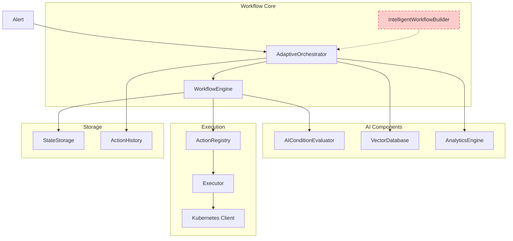
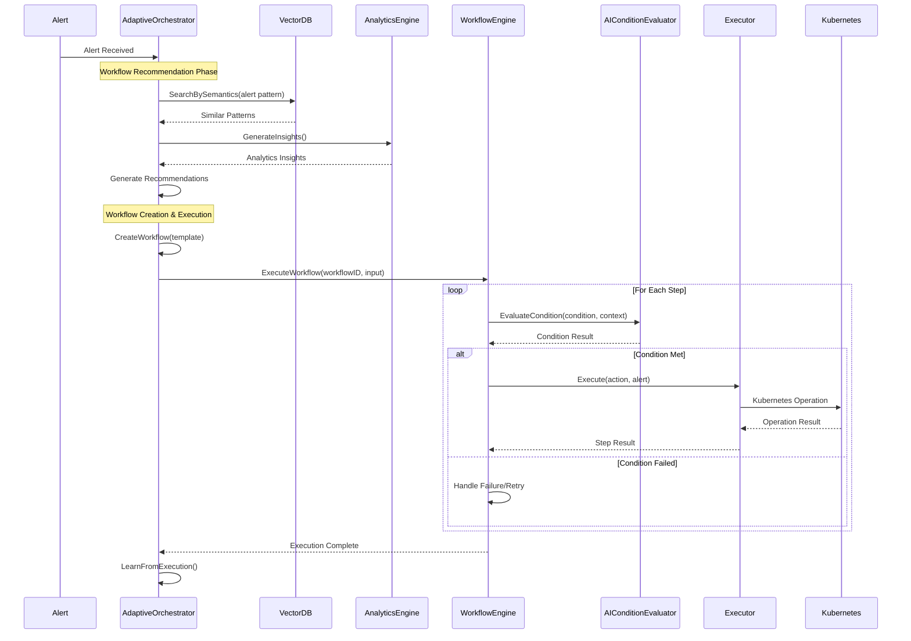
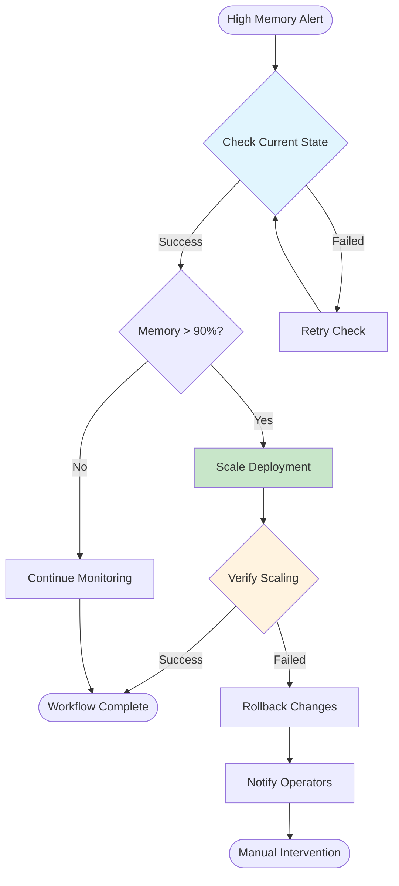
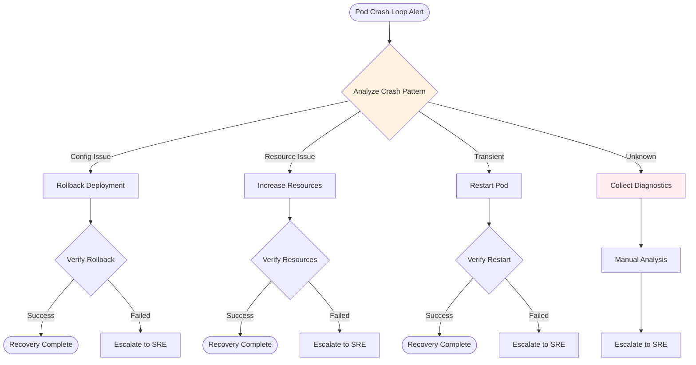
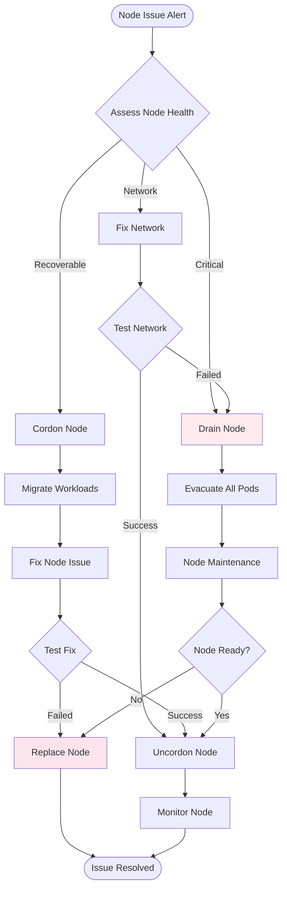
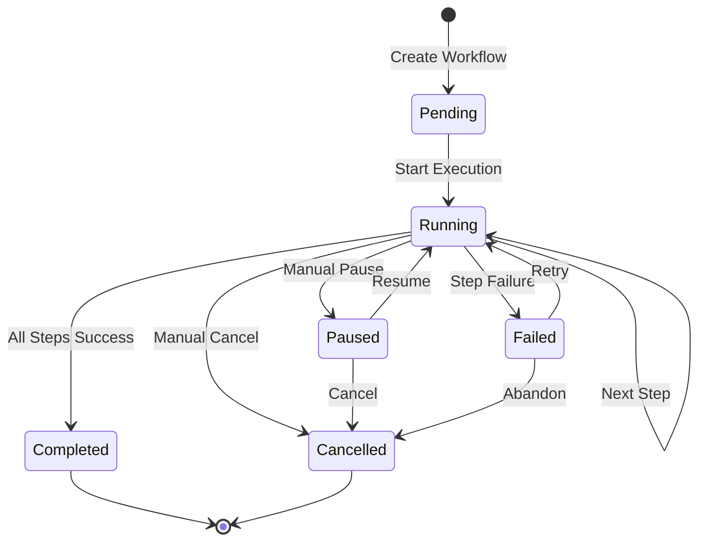

# Workflow Engine Documentation

## Overview

The Prometheus Alerts SLM workflow engine orchestrates complex, multi-step remediation processes for Kubernetes alerts. It combines AI-driven decision making with pattern-based learning to create adaptive, self-improving automation workflows.

## Architecture

The workflow system consists of several key components:



### Component Status

| Component | Status | Implementation |
|-----------|--------|----------------|
| **AdaptiveOrchestrator** | ✅ **Implemented** | [`pkg/effectiveness/orchestration/adaptive_orchestrator.go`](../pkg/effectiveness/orchestration/adaptive_orchestrator.go) |
| **WorkflowEngine** | ✅ **Implemented** | [`pkg/effectiveness/orchestration/workflow_engine.go`](../pkg/effectiveness/orchestration/workflow_engine.go) |
| **IntelligentWorkflowBuilder** | ❌ **Interface Only** | [`pkg/effectiveness/orchestration/interfaces.go:117-134`](../pkg/effectiveness/orchestration/interfaces.go) |
| **AIConditionEvaluator** | ✅ **Implemented** | [`pkg/effectiveness/orchestration/ai_condition_impl.go`](../pkg/effectiveness/orchestration/ai_condition_impl.go) |
| **ActionRegistry** | ✅ **Implemented** | [`pkg/executor/registry.go`](../pkg/executor/registry.go) |
| **Executor** | ✅ **Implemented** | [`pkg/executor/executor.go`](../pkg/executor/executor.go) |

## Workflow Execution Flow



## Workflow Template Structure

### Core Components

```go
// From pkg/effectiveness/orchestration/models.go:26-40
type WorkflowTemplate struct {
    ID          string                 `json:"id"`
    Name        string                 `json:"name"`
    Description string                 `json:"description"`
    Version     string                 `json:"version"`
    Steps       []*WorkflowStep        `json:"steps"`
    Conditions  []*WorkflowCondition   `json:"conditions"`
    Variables   map[string]interface{} `json:"variables"`
    Timeouts    *WorkflowTimeouts      `json:"timeouts"`
    Recovery    *RecoveryPolicy        `json:"recovery"`
    Tags        []string               `json:"tags"`
    CreatedBy   string                 `json:"created_by"`
    CreatedAt   time.Time              `json:"created_at"`
}
```

### Step Types

**Status: ✅ Fully Implemented** - [`pkg/effectiveness/orchestration/models.go:61-70`](../pkg/effectiveness/orchestration/models.go)

```go
const (
    StepTypeAction     StepType = "action"      // Execute specific action
    StepTypeCondition  StepType = "condition"  // Conditional logic evaluation
    StepTypeParallel   StepType = "parallel"   // Parallel execution
    StepTypeSequential StepType = "sequential" // Sequential execution
    StepTypeLoop       StepType = "loop"       // Iterative execution
    StepTypeWait       StepType = "wait"       // Wait/delay step
    StepTypeDecision   StepType = "decision"   // AI-driven decision point
    StepTypeSubflow    StepType = "subflow"    // Nested workflow
)
```

## Use Cases & Examples

### Use Case 1: High Memory Usage Response

**Implementation Status: ✅ Implemented** - Example from [`pkg/effectiveness/orchestration/adaptive_orchestrator_test.go:53-103`](../pkg/effectiveness/orchestration/adaptive_orchestrator_test.go)



**Workflow Template:**
```go
// Actual implementation from test suite
testWorkflowTemplate = &orchestration.WorkflowTemplate{
    ID:          "scale-application-workflow",
    Name:        "Scale Application Workflow",
    Description: "Workflow to scale application in response to high memory usage",
    Version:     "1.0.0",
    Steps: []*orchestration.WorkflowStep{
        {
            ID:   "check-current-state",
            Name: "Check Current Application State",
            Type: orchestration.StepTypeAction,
            Action: &orchestration.StepAction{
                Type: "kubernetes",
                Parameters: map[string]interface{}{
                    "action": "get_resource",
                },
                Target: &orchestration.ActionTarget{
                    Type:      "kubernetes",
                    Namespace: "production",
                    Resource:  "deployment",
                    Name:      "webapp",
                },
            },
            Timeout: 30 * time.Second,
        },
        {
            ID:           "scale-deployment",
            Name:         "Scale Deployment",
            Type:         orchestration.StepTypeAction,
            Dependencies: []string{"check-current-state"},
            Action: &orchestration.StepAction{
                Type: "kubernetes",
                Parameters: map[string]interface{}{
                    "action":   "scale_deployment",
                    "replicas": 3,
                },
            },
            Timeout: 60 * time.Second,
        },
    },
}
```

### Use Case 2: Pod Crash Loop Recovery

**Implementation Status: 🔄 Partially Implemented** - Actions exist in [`pkg/types/types.go:77-121`](../pkg/types/types.go), workflow template generation is manual



**Supported Actions:**
```go
// From pkg/types/types.go - All implemented
"restart_pod":         true,
"rollback_deployment": true,
"increase_resources":  true,
"collect_diagnostics": true,
"quarantine_pod":      true,
```

### Use Case 3: Node-Level Issues

**Implementation Status: ✅ Actions Implemented, 🔄 AI Workflow Generation Pending**



## AI-Driven Features

### 1. Condition Evaluation

**Status: ✅ Fully Implemented** - [`pkg/effectiveness/orchestration/ai_condition_impl.go`](../pkg/effectiveness/orchestration/ai_condition_impl.go)

The AI Condition Evaluator provides intelligent decision-making within workflows:

```go
// Example from ai_condition_impl.go:13-26
func (ace *DefaultAIConditionEvaluator) EvaluateMetricCondition(ctx context.Context, condition *WorkflowCondition, stepContext *StepContext) (*ConditionResult, error) {
    // AI-powered metric condition evaluation
    recommendation, err := ace.slmClient.AnalyzeAlert(ctx, stepContext.Alert)
    if err != nil {
        return ace.fallbackMetricEvaluation(condition, stepContext), nil
    }

    return ace.parseConditionResponse(recommendation, condition)
}
```

**Supported Condition Types:**
- `metric` - Metric-based evaluation
- `resource` - Resource state evaluation
- `time` - Time-based conditions
- `expression` - Custom expression evaluation
- `custom` - AI-driven custom logic

### 2. Pattern-Based Recommendations

**Status: ✅ Implemented** - [`pkg/effectiveness/orchestration/orchestrator_helpers.go:425-447`](../pkg/effectiveness/orchestration/orchestrator_helpers.go)

```go
func (dao *DefaultAdaptiveOrchestrator) patternToRecommendation(pattern *vector.ActionPattern, context *ActionContext) *WorkflowRecommendation {
    // Convert historical patterns to workflow recommendations
    executionCount := pattern.EffectivenessData.SuccessCount + pattern.EffectivenessData.FailureCount
    successRate := float64(pattern.EffectivenessData.SuccessCount) / math.Max(float64(executionCount), 1.0)
    confidence := successRate * math.Min(float64(executionCount)/10.0, 1.0)

    return &WorkflowRecommendation{
        WorkflowID:    fmt.Sprintf("pattern-%s", pattern.ID),
        Name:          fmt.Sprintf("%s for %s", pattern.ActionType, pattern.AlertName),
        Confidence:    confidence,
        Effectiveness: pattern.EffectivenessData.Score,
        // ...
    }
}
```

### 3. Dynamic Workflow Generation

**Status: ❌ Interface Only - Not Implemented**

The `IntelligentWorkflowBuilder` interface defines workflow generation capabilities but lacks implementation:

```go
// From pkg/effectiveness/orchestration/interfaces.go:117-134
type IntelligentWorkflowBuilder interface {
    // ❌ NOT IMPLEMENTED
    GenerateWorkflow(ctx context.Context, objective *WorkflowObjective) (*WorkflowTemplate, error)
    OptimizeWorkflowStructure(ctx context.Context, template *WorkflowTemplate) (*WorkflowTemplate, error)

    // ❌ NOT IMPLEMENTED
    FindWorkflowPatterns(ctx context.Context, criteria *PatternCriteria) ([]*WorkflowPattern, error)
    ApplyWorkflowPattern(ctx context.Context, pattern *WorkflowPattern, context *WorkflowContext) (*WorkflowTemplate, error)

    // ❌ NOT IMPLEMENTED
    ValidateWorkflow(ctx context.Context, template *WorkflowTemplate) (*ValidationReport, error)
    SimulateWorkflow(ctx context.Context, template *WorkflowTemplate, scenario *SimulationScenario) (*SimulationResult, error)
}
```

## Supported Actions

### Core Actions (25+ Types)

**Status: ✅ All Implemented** - [`pkg/executor/executor.go`](../pkg/executor/executor.go)

| Category | Actions | Implementation Status |
|----------|---------|----------------------|
| **Scaling & Resources** | `scale_deployment`, `increase_resources`, `update_hpa`, `scale_statefulset` | ✅ Complete |
| **Pod Lifecycle** | `restart_pod`, `quarantine_pod`, `rollback_deployment` | ✅ Complete |
| **Node Management** | `drain_node`, `cordon_node`, `migrate_workload` | ✅ Complete |
| **Storage** | `expand_pvc`, `cleanup_storage`, `backup_data`, `compact_storage` | ✅ Complete |
| **Network** | `update_network_policy`, `restart_network`, `reset_service_mesh` | ✅ Complete |
| **Database** | `failover_database`, `repair_database` | ✅ Complete |
| **Security** | `rotate_secrets`, `audit_logs` | ✅ Complete |
| **Diagnostics** | `collect_diagnostics`, `enable_debug_mode`, `create_heap_dump` | ✅ Complete |
| **Monitoring** | `notify_only` | ✅ Complete |

## Workflow Execution States



## Performance Characteristics

### Adaptive Learning

**Status: ✅ Implemented** - [`pkg/effectiveness/orchestration/orchestrator_helpers.go:334-418`](../pkg/effectiveness/orchestration/orchestrator_helpers.go)

```go
func (dao *DefaultAdaptiveOrchestrator) extractExecutionLearnings(execution *WorkflowExecution) []*WorkflowLearning {
    var learnings []*WorkflowLearning

    // Learn from execution duration
    if execution.Duration > 30*time.Minute {
        learning := &WorkflowLearning{
            Type:    LearningTypePerformance,
            Actions: []*LearningAction{{
                Type:   LearningActionTypeOptimizeWorkflow,
                Target: execution.WorkflowID,
            }},
        }
        learnings = append(learnings, learning)
    }

    return learnings
}
```

### Bottleneck Detection

**Status: ✅ Implemented** - [`pkg/effectiveness/orchestration/orchestrator_helpers.go:265-309`](../pkg/effectiveness/orchestration/orchestrator_helpers.go)

The system automatically identifies workflow bottlenecks:

```go
func (dao *DefaultAdaptiveOrchestrator) identifyBottlenecks(executions []*WorkflowExecution) []*Bottleneck {
    // Analyze step durations to identify bottlenecks
    // If step takes more than 30% of total workflow time, consider it a bottleneck
    if avgDuration > avgWorkflowDuration*30/100 {
        bottlenecks = append(bottlenecks, &Bottleneck{
            StepID:      stepID,
            Type:        BottleneckTypeLogical,
            Severity:    "warning",
            Impact:      float64(avgDuration) / float64(avgWorkflowDuration),
            Description: fmt.Sprintf("Step %s consumes %.1f%% of workflow execution time", stepID, percentage),
        })
    }
}
```

## Configuration

### Workflow Engine Configuration

```go
// From pkg/effectiveness/orchestration/workflow_engine.go:37-43
type WorkflowEngineConfig struct {
    DefaultStepTimeout    time.Duration `yaml:"default_step_timeout" default:"10m"`
    MaxRetryDelay         time.Duration `yaml:"max_retry_delay" default:"5m"`
    EnableStateRecovery   bool          `yaml:"enable_state_recovery" default:"true"`
    EnableDetailedLogging bool          `yaml:"enable_detailed_logging" default:"false"`
}
```

### Adaptive Orchestrator Configuration

```go
// From pkg/effectiveness/orchestration/adaptive_orchestrator.go:80-90
type AdaptiveOrchestratorConfig struct {
    MaxConcurrentExecutions int           `yaml:"max_concurrent_executions" default:"10"`
    EnableAdaptation        bool          `yaml:"enable_adaptation" default:"true"`
    EnableOptimization      bool          `yaml:"enable_optimization" default:"true"`
    MetricsCollection      bool          `yaml:"metrics_collection" default:"true"`
    AdaptationInterval     time.Duration `yaml:"adaptation_interval" default:"5m"`
    OptimizationInterval   time.Duration `yaml:"optimization_interval" default:"15m"`
}
```

## Development Roadmap

### Phase 1: Core Implementation ✅ Complete
- [x] Basic workflow execution engine
- [x] Action registry and executor
- [x] AI condition evaluation
- [x] Pattern-based recommendations
- [x] Performance analytics

### Phase 2: Advanced Features 🔄 In Progress
- [ ] **IntelligentWorkflowBuilder** implementation
- [ ] Dynamic workflow generation from objectives
- [ ] Workflow pattern discovery and application
- [ ] Advanced simulation capabilities
- [ ] Workflow validation and testing framework

### Phase 3: Enterprise Features ❌ Planned
- [ ] Multi-tenant workflow isolation
- [ ] Workflow versioning and rollback
- [ ] Advanced cost optimization
- [ ] Compliance and audit trails
- [ ] Workflow marketplace and sharing

## API Reference

### Creating and Executing Workflows

```go
// Create workflow from template
workflow, err := orchestrator.CreateWorkflow(ctx, template)

// Execute workflow with input
execution, err := orchestrator.ExecuteWorkflow(ctx, workflow.ID, input)

// Get execution status
status, err := orchestrator.GetWorkflowStatus(ctx, execution.ID)

// Get recommendations for alert context
recommendations, err := orchestrator.GetWorkflowRecommendations(ctx, alertContext)
```

### Workflow Adaptation

```go
// Apply adaptation rules
err := orchestrator.AdaptWorkflow(ctx, workflowID, adaptationRules)

// Optimize workflow performance
result, err := orchestrator.OptimizeWorkflow(ctx, workflowID)

// Learn from execution results
err := orchestrator.LearnFromExecution(ctx, execution)
```

## Testing

The workflow system includes comprehensive test coverage:

- **Unit Tests**: Individual component testing
- **Integration Tests**: End-to-end workflow execution
- **Performance Tests**: Load and stress testing
- **AI Tests**: Condition evaluation and learning validation

**Test Examples:**
- [`pkg/effectiveness/orchestration/adaptive_orchestrator_test.go`](../pkg/effectiveness/orchestration/adaptive_orchestrator_test.go) - Core orchestration tests
- [`pkg/effectiveness/orchestration/ai_condition_evaluator_test.go`](../pkg/effectiveness/orchestration/ai_condition_evaluator_test.go) - AI evaluation tests
- [`pkg/executor/executor_test.go`](../pkg/executor/executor_test.go) - Action execution tests

## Monitoring and Observability

### Metrics

The system exposes workflow execution metrics:
- Workflow execution duration
- Step success/failure rates
- AI condition evaluation accuracy
- Resource utilization patterns
- Learning effectiveness scores

### Logging

Structured logging with contextual information:
- Workflow execution traces
- Step-level execution details
- AI decision reasoning
- Performance bottleneck identification
- Error context and recovery actions

## Conclusion

The Prometheus Alerts SLM workflow engine provides a robust foundation for intelligent alert remediation. While core functionality is fully implemented, advanced features like dynamic workflow generation remain in development. The system's AI-driven adaptation and pattern learning capabilities make it well-suited for complex Kubernetes environments requiring autonomous operation.

For implementation details, refer to the source code in [`pkg/effectiveness/orchestration/`](../pkg/effectiveness/orchestration/) and related components.
