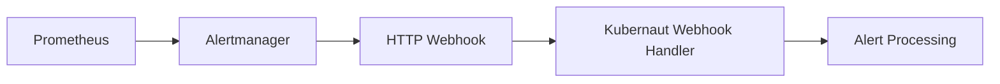
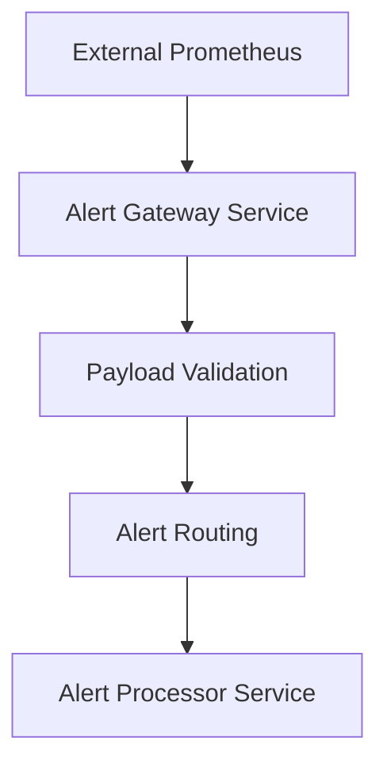
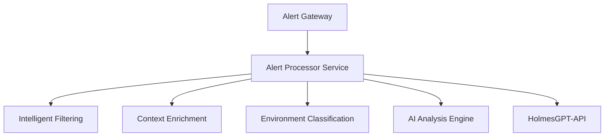
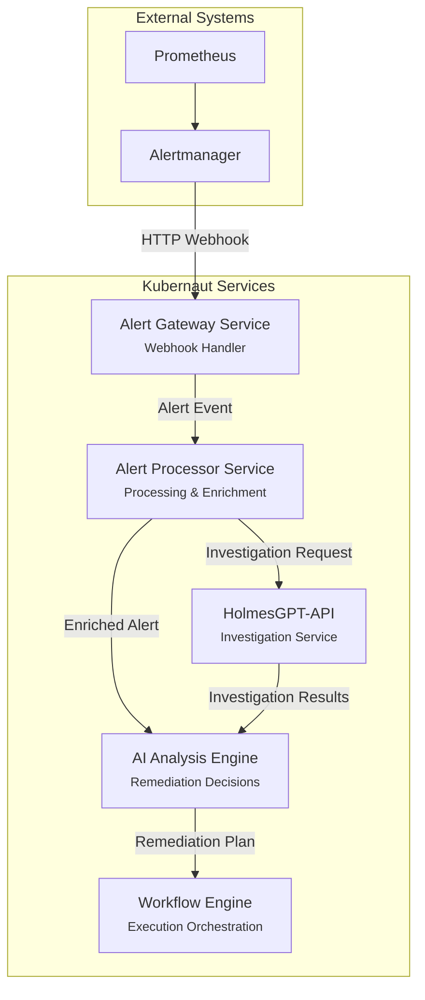
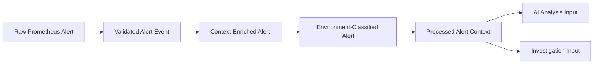
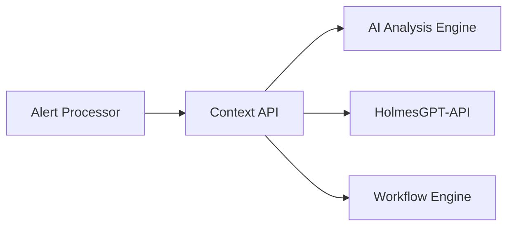

# Alert Concepts Clarification - Kubernaut Architecture

**Document Version**: 1.0
**Date**: January 2025
**Status**: Architecture Clarification
**Purpose**: Clarify the different alert-related concepts and data flows in Kubernaut

---

## ⚠️ TERMINOLOGY EVOLUTION NOTICE

**HISTORICAL CONTEXT**: This document uses **"Alert"** terminology extensively, reflecting the project's initial focus on Prometheus alerts. Kubernaut has evolved to support **multiple signal types** beyond just alerts.

### **Multi-Signal Architecture**

Kubernaut now processes:
- ✅ Prometheus Alerts (original focus)
- ✅ Kubernetes Events
- ✅ AWS CloudWatch Alarms
- ✅ Custom Webhooks
- ✅ Future Signal Sources

### **Current Terminology Standards**

| Historical Term | Current Term | Migration Status |
|----------------|--------------|------------------|
| Alert Event | Signal Event | ADR-015 Phase 1 |
| Alert Gateway Service | Signal Gateway Service | ADR-015 Phase 1 |
| Alert Processor Service | Signal Processor Service | ADR-015 Phase 1 |
| Alert Context | Signal Context | ADR-015 Phase 1 |

**References**:
- [ADR-015: Alert to Signal Naming Migration](../architecture/decisions/ADR-015-alert-to-signal-naming-migration.md)
- [Signal Type Definitions Design](../development/SIGNAL_TYPE_DEFINITIONS_DESIGN.md)
- [V1 Source of Truth Hierarchy](../V1_SOURCE_OF_TRUTH_HIERARCHY.md)

**⚠️ For Implementation**: Use Signal-prefixed types and interfaces as defined in `pkg/signal/`.

---

## 🎯 **EXECUTIVE SUMMARY**

In Kubernaut architecture, **"alert"** refers to different concepts depending on the context. This document clarifies the distinction between **alert events**, **alert services**, and **alert data flows** to eliminate confusion in architectural discussions.

---

## 📋 **ALERT CONCEPTS BREAKDOWN**

### **1. Alert Event (Data Entity)**
**Definition**: The actual alert data/payload received from monitoring systems

#### **Source & Structure**
- **Primary Source**: Prometheus Alertmanager via HTTP webhooks
- **Data Format**: JSON payload containing alert metadata, labels, annotations
- **Business Requirements**: BR-PA-001, BR-PA-002 (reception and validation)

#### **Alert Event Lifecycle**


#### **Alert Event Data Structure**
**Source**: BR-TYPE-001 (standardized alert and event data structures)
```json
{
  "receiver": "kubernaut-webhook",
  "status": "firing",
  "alerts": [
    {
      "status": "firing",
      "labels": {
        "alertname": "PodCrashLooping",
        "namespace": "production",
        "pod": "app-deployment-xyz"
      },
      "annotations": {
        "description": "Pod has been crash looping for 5 minutes",
        "severity": "critical"
      },
      "startsAt": "2025-01-29T10:00:00Z",
      "endsAt": "0001-01-01T00:00:00Z"
    }
  ]
}
```

### **2. Alert Gateway Service**
**Definition**: Service responsible for receiving and initial routing of alert events

#### **Service Identification**
- **Service Name**: Alert Gateway Service
- **Business Requirements**: BR-WH-001 to BR-WH-025 (Webhook Handler capabilities)
- **Primary Responsibility**: HTTP webhook processing for alert reception

#### **Key Capabilities**
- **Alert Reception**: Receives Prometheus alerts via HTTP webhooks (BR-PA-001)
- **Payload Validation**: Validates incoming alert payloads (BR-PA-002)
- **Request Handling**: Concurrent processing with high throughput (BR-WH-006)
- **Security**: Authentication, authorization, signature verification (BR-WH-004, BR-WH-005)

#### **Alert Gateway Data Flow**


### **3. Alert Processor Service**
**Definition**: Service responsible for intelligent processing and enrichment of alert events

#### **Service Identification**
- **Service Name**: Alert Processor Service
- **Business Requirements**: BR-SP-001 to BR-SP-050 (Alert processing pipeline)
- **Primary Responsibility**: Intelligent alert processing and filtering

#### **Key Capabilities**
- **Processing Pipeline**: Configurable filtering rules (BR-SP-001)
- **Context Enrichment**: Kubernetes cluster context, historical actions (BR-SP-011, BR-SP-012)
- **Environment Classification**: Namespace management and business priority (BR-SP-021 to BR-SP-030)
- **Intelligent Filtering**: AI-powered relevance scoring (BR-SP-007)

#### **Alert Processor Data Flow**


---

## 🔄 **ALERT DATA FLOW ARCHITECTURE**

### **Complete Alert Processing Flow**


### **Alert Event Transformation Pipeline**


---

## 📊 **SERVICE RESPONSIBILITIES MATRIX**

### **Alert-Related Services**

| Service | Primary Role | Alert Interaction | Business Requirements |
|---------|-------------|-------------------|---------------------|
| **Alert Gateway** | HTTP webhook reception | Receives raw alert events | BR-WH-001 to BR-WH-025 |
| **Alert Processor** | Processing & enrichment | Transforms alert events | BR-SP-001 to BR-SP-050 |
| **AI Analysis Engine** | Remediation decisions | Consumes processed alerts | BR-AI-001 to BR-AI-025 |
| **HolmesGPT-API** | Investigation service | Investigates alert context | BR-HAPI-001 to BR-HAPI-073 |
| **Workflow Engine** | Execution orchestration | Executes alert remediation | BR-WF-001 to BR-WF-100+ |

### **Alert Event States**

| State | Description | Location | Format |
|-------|-------------|----------|--------|
| **Raw Alert** | Original Prometheus webhook payload | Alert Gateway | JSON webhook payload |
| **Validated Alert** | Validated and sanitized alert | Alert Gateway | Structured alert event |
| **Enriched Alert** | Context-enriched with K8s/historical data | Alert Processor | Enhanced alert context |
| **Classified Alert** | Environment and priority classified | Alert Processor | Business-classified alert |
| **Analysis Input** | Prepared for AI analysis | AI Analysis Engine | AI-optimized context |
| **Investigation Input** | Prepared for HolmesGPT investigation | HolmesGPT-API | Investigation request |

---

## 🎯 **TERMINOLOGY CLARIFICATION**

### **When We Say "Alert" in Architecture Context**

#### **✅ Correct Usage**
- **"Alert Event"**: Refers to the data entity/payload
  - *Example*: "The alert event contains Kubernetes namespace information"
- **"Alert Gateway Service"**: Refers to the webhook handler service
  - *Example*: "The Alert Gateway Service validates incoming webhooks"
- **"Alert Processor Service"**: Refers to the processing service
  - *Example*: "The Alert Processor Service enriches alerts with context"
- **"Alert Processing Flow"**: Refers to the data transformation pipeline
  - *Example*: "The alert processing flow includes validation and enrichment"

#### **❌ Ambiguous Usage**
- **"Alert"** without context
  - *Ambiguous*: "The alert goes to HolmesGPT"
  - *Clear*: "The alert event is sent to HolmesGPT-API for investigation"
- **"Alert Gateway"** vs **"Alert Processor"**
  - *Ambiguous*: "The alert gateway processes alerts"
  - *Clear*: "The Alert Gateway Service receives webhooks, the Alert Processor Service processes alert events"

### **Service vs Data Entity Distinction**

#### **Services (Components that DO things)**
- **Alert Gateway Service**: Receives and validates webhook requests
- **Alert Processor Service**: Processes and enriches alert events
- **AI Analysis Engine**: Analyzes alert context for remediation decisions
- **HolmesGPT-API**: Investigates alert context for root cause analysis

#### **Data Entities (Things that ARE processed)**
- **Alert Event**: The actual alert data/payload
- **Alert Context**: Enriched alert with additional information
- **Investigation Request**: Alert data formatted for HolmesGPT investigation
- **Analysis Input**: Alert context prepared for AI analysis

---

## 🔄 **INTEGRATION PATTERNS**

### **Alert Event Routing Patterns**

#### **1. Parallel Processing Pattern**
```
Alert Event → Alert Processor → {
    ├── AI Analysis Engine (Remediation)
    └── HolmesGPT-API (Investigation)
}
```

#### **2. Sequential Processing Pattern**
```
Alert Event → Alert Processor → HolmesGPT-API → AI Analysis Engine → Workflow Engine
```

#### **3. Conditional Routing Pattern**
```
Alert Event → Alert Processor → {
    ├── Simple Alerts → AI Analysis Engine
    ├── Complex Alerts → HolmesGPT-API → AI Analysis Engine
    └── Investigation-Only → HolmesGPT-API
}
```

### **Context Sharing Patterns**

#### **Alert Context API Integration**


---

## 📋 **ARCHITECTURAL IMPLICATIONS**

### **Service Design Considerations**

#### **Alert Gateway Service**
- **Focus**: High-throughput webhook processing
- **Scalability**: Horizontal scaling for webhook volume
- **Reliability**: 99.9% availability requirement (BR-PA-001)
- **Security**: Authentication, rate limiting, payload validation

#### **Alert Processor Service**
- **Focus**: Intelligent processing and enrichment
- **Performance**: 5-second processing requirement (BR-PA-003)
- **Intelligence**: AI-powered filtering and classification
- **Integration**: Multiple context sources (K8s, historical data)

### **Data Flow Optimization**

#### **Alert Event Lifecycle Management**
- **Reception**: Fast webhook acknowledgment
- **Processing**: Asynchronous enrichment pipeline
- **Distribution**: Efficient routing to multiple consumers
- **Storage**: Persistent alert history for learning

#### **Context Optimization**
- **Caching**: Intelligent context caching (80%+ hit rates)
- **Compression**: Payload optimization for large contexts
- **Streaming**: Real-time context updates
- **Deduplication**: Efficient handling of duplicate alerts

---

## 🎯 **SUMMARY & RECOMMENDATIONS**

### **Key Clarifications**

1. **"Alert"** can refer to:
   - **Alert Event**: The data entity (JSON payload from Prometheus)
   - **Alert Gateway Service**: The webhook handler service
   - **Alert Processor Service**: The processing and enrichment service

2. **Alert Flow**: Alert Event → Alert Gateway → Alert Processor → {AI Analysis Engine, HolmesGPT-API}

3. **Service Boundaries**:
   - **Alert Gateway**: Reception and validation
   - **Alert Processor**: Processing and enrichment
   - **AI Analysis Engine**: Remediation decision-making
   - **HolmesGPT-API**: Investigation and root cause analysis

### **Architectural Recommendations**

1. **Use Precise Terminology**: Always specify "Alert Event" vs "Alert Gateway Service" vs "Alert Processor Service"
2. **Clear Service Boundaries**: Maintain distinct responsibilities for each alert-related service
3. **Efficient Data Flow**: Optimize alert event transformation pipeline for performance
4. **Context Sharing**: Use Context API for efficient alert context distribution

This clarification ensures consistent understanding of alert concepts across all architectural discussions and documentation.
