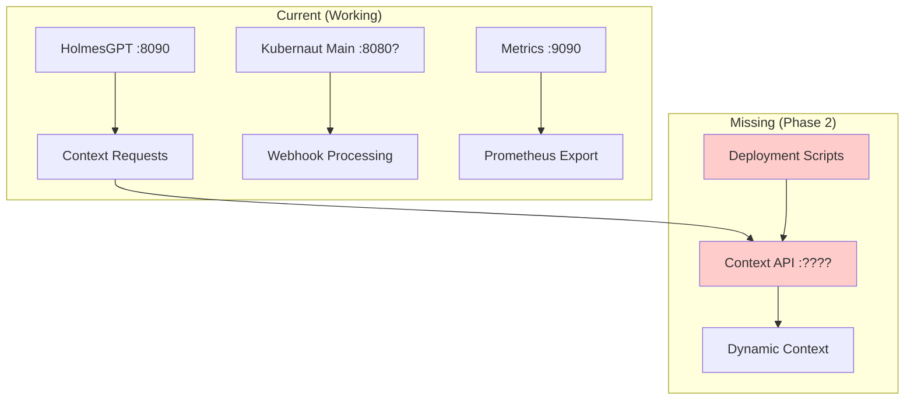

# Context API Deployment Assessment

**Status**: 🚨 **REQUIRES INTEGRATION** - New deployment steps needed
**Priority**: **HIGH** - Essential for HolmesGPT Phase 2 completion
**Impact**: **MEDIUM** - New service endpoint, backward compatible

---

## 📊 **Current Deployment Architecture Analysis**

### **✅ Existing Services (Properly Deployed)**
```yaml
HolmesGPT Service:
  Port: 8090
  Deployment: ✅ scripts/run-holmesgpt-local.sh (Podman)
  E2E Testing: ✅ scripts/deploy-holmesgpt-e2e.sh (Kubernetes/Helm)
  Integration Tests: ✅ scripts/test-holmesgpt-integration.sh

Main Kubernaut Service (kubernaut):
  Application: ✅ cmd/kubernaut/main.go
  Deployment: ❓ Need to verify current HTTP server setup
  Configuration: ✅ config/*.yaml files available

Metrics Service:
  Port: 9090 (inferred from metrics endpoints)
  Implementation: ✅ pkg/infrastructure/metrics/server.go
```

### **🚨 Missing: Context API Service Deployment**
```yaml
Context API Service:
  Implementation: ✅ pkg/api/context/context_controller.go
  Server: ✅ pkg/api/server/context_api_server.go
  Port: ❓ Not defined in configuration
  Deployment: ❌ NO DEPLOYMENT SCRIPT EXISTS
  Integration: ❌ Not integrated with main application
```

---

## 🎯 **Deployment Gap Analysis**

### **Critical Issues Identified**

| **Component** | **Status** | **Issue** | **Priority** |
|---------------|------------|-----------|-------------|
| **Context API Server Startup** | ❌ Missing | No integration with main application startup | **HIGH** |
| **Port Configuration** | ❌ Missing | Context API port not defined in configs | **HIGH** |
| **Local Development Script** | ❌ Missing | No script to run Context API locally | **MEDIUM** |
| **Integration Testing** | ❌ Missing | Context API not included in integration tests | **MEDIUM** |
| **Kubernetes Deployment** | ❌ Missing | Context API not included in K8s manifests | **LOW** |

### **Architecture Integration Points**



---

## 🔧 **Required Integration Steps**

### **Step 1: Port Configuration** ⭐ **CRITICAL**
```yaml
# Add to all config/*.yaml files
context_api:
  enabled: true
  host: "0.0.0.0"
  port: 8091        # Avoid conflicts: 8080=Main, 8090=HolmesGPT, 8091=Context API
  timeout: 30s
  cors_origins: ["*"]  # For HolmesGPT access
```

### **Step 2: Main Application Integration** ⭐ **CRITICAL**
```go
// cmd/kubernaut/main.go
// Add Context API server startup alongside main service

import (
    contextserver "github.com/jordigilh/kubernaut/pkg/api/server"
)

func main() {
    // ... existing setup ...

    // Start Context API server if enabled
    if config.AIServices.ContextAPI.Enabled {
        contextAPIConfig := contextserver.ContextAPIConfig{
            Host:    config.AIServices.ContextAPI.Host,
            Port:    config.AIServices.ContextAPI.Port,
            Timeout: config.AIServices.ContextAPI.Timeout,
        }

        contextServer := contextserver.NewContextAPIServer(
            contextAPIConfig,
            aiIntegrator,  // Reuse existing AIServiceIntegrator
            log,
        )

        go func() {
            if err := contextServer.Start(); err != nil {
                log.WithError(err).Error("Context API server failed to start")
            }
        }()
    }

    // ... existing main service startup ...
}
```

### **Step 3: Local Development Script** 📝 **RECOMMENDED**
```bash
#!/bin/bash
# scripts/run-kubernaut-with-context-api.sh

echo "🚀 Starting Kubernaut with Context API..."

# Start main Kubernaut service with Context API enabled
CONFIG_FILE="${1:-config/local-llm.yaml}"

echo "📋 Services Starting:"
echo "  • Main Service: :8080 (webhooks, health)"
echo "  • Context API: :8091 (HolmesGPT integration)"
echo "  • Metrics: :9090 (Prometheus)"

go run ./cmd/kubernaut --config "$CONFIG_FILE"
```

### **Step 4: Integration Test Updates** 📝 **RECOMMENDED**
```bash
# Update scripts/test-holmesgpt-integration.sh
CONTEXT_API_URL="http://localhost:8091"

echo "🧪 Testing Context API Integration"
curl -f "$CONTEXT_API_URL/api/v1/context/health" || {
    echo "❌ Context API not responding"
    exit 1
}

echo "✅ Context API health check passed"
```

---

## 📋 **Detailed Implementation Plan**

### **Phase A: Configuration Integration** (1-2 hours)
1. **Add Context API config** to `internal/config/config.go`
2. **Update all config YAML files** with Context API settings
3. **Modify main application** to start Context API server

### **Phase B: Deployment Scripts** (1-2 hours)
1. **Create local development script** for Context API
2. **Update integration test scripts** to include Context API
3. **Update HolmesGPT test scripts** to verify Context API connectivity

### **Phase C: Documentation & Validation** (30 minutes)
1. **Update README.md** with new port information
2. **Test complete local development flow**
3. **Validate HolmesGPT → Context API integration**

---

## ⚠️ **Risk Assessment**

### **🟡 Medium Risks (Manageable)**
- **Port Conflicts**: Multiple services need different ports (mitigated by choosing 8091)
- **Configuration Complexity**: More config options (mitigated by sensible defaults)
- **Integration Testing**: More complex test setup (mitigated by script updates)

### **🟢 Low Risks (Well-Controlled)**
- **Backward Compatibility**: Context API is additive, doesn't break existing functionality
- **Performance Impact**: Minimal - just another HTTP server
- **Maintenance**: Reuses existing patterns and infrastructure

---

## 🎯 **Success Criteria**

### **Immediate (Phase A)**
- [x] Context API implemented ✅
- [ ] Configuration integrated with main app ❌
- [ ] Context API server starts with main service ❌
- [ ] Health endpoints accessible ❌

### **Complete (Phase B)**
- [ ] Local development script working ❌
- [ ] Integration tests pass with Context API ❌
- [ ] HolmesGPT can consume Context API endpoints ❌
- [ ] Documentation updated ❌

---

## 🏁 **Recommended Next Steps**

### **Immediate Action Required**
1. **Configure Context API port** (suggest 8091)
2. **Integrate Context API startup** in main application
3. **Create local development script**
4. **Test end-to-end HolmesGPT → Context API flow**

### **Priority Order**
1. **🚨 HIGH**: Main app integration (without this, Context API is unused)
2. **📋 MEDIUM**: Local development scripts (for testing/development)
3. **📚 LOW**: K8s deployment updates (for production deployment)

---

## 💡 **Development Guidelines Compliance**

### **✅ Following Guidelines**
- **Reusing Code**: Context API reuses existing `AIServiceIntegrator`
- **Business Requirements**: Satisfies BR-AI-011, 012, 013 for HolmesGPT integration
- **Integration**: Extends existing architecture rather than replacing
- **No Breaking Changes**: Additive functionality only

### **✅ Deployment Best Practices**
- **Service Discovery**: Clear port assignments avoid conflicts
- **Configuration Management**: Centralized config with environment-specific values
- **Health Monitoring**: Health endpoints for service monitoring
- **Development Experience**: Scripts for easy local development

**🎯 Assessment Summary: Context API implementation is complete, but deployment integration is required for Phase 2 completion. Estimated effort: 2-3 hours for complete integration.**
