# ⚠️ **DEPRECATED** - Alert Processor Dual Routing Analysis

**Document Version**: 1.0
**Date**: January 2025
**Status**: **DEPRECATED** - Analysis Complete, Document Obsolete
**Purpose**: Explain why Alert Processor routes enriched alerts to both AI Analysis Engine and HolmesGPT-API

---

## 🚨 **DEPRECATION NOTICE**

**This document is DEPRECATED and should not be used for current development.**

- **Reason**: Analysis completed, routing patterns established in main architecture
- **Replacement**: See current service interactions in [KUBERNAUT_SERVICE_CATALOG.md](KUBERNAUT_SERVICE_CATALOG.md)
- **Current Status**: V1 architecture uses HolmesGPT-API as primary AI integration
- **Last Updated**: January 2025

**⚠️ Do not use this information for architectural decisions.**

---

---

## 🎯 **EXECUTIVE SUMMARY**

Based on comprehensive analysis of business requirements, the **Alert Processor Service** routes enriched alerts to **both** the **AI Analysis Engine** and **HolmesGPT-API** because they serve **complementary but distinct business purposes** with different capabilities, response times, and integration patterns required for comprehensive alert handling.

### **Key Finding**
The dual routing enables **parallel processing** for:
- **Immediate Remediation** (AI Analysis Engine → Workflow Engine)
- **Deep Investigation** (HolmesGPT-API → Investigation Reports)
- **Enhanced Decision-Making** (Investigation insights → AI Analysis refinement)

---

## 📋 **BUSINESS REQUIREMENTS ANALYSIS**

### **1. AI Analysis Engine - Remediation Focus**

#### **Primary Business Purpose**
**Source**: `docs/requirements/02_AI_MACHINE_LEARNING.md`

> "Provide intelligent decision-making capabilities for Kubernetes remediation, leveraging multiple LLM providers, historical learning, and advanced analytics to deliver autonomous, context-aware remediation actions."

#### **Core Capabilities & Requirements**

##### **Recommendation Provider (BR-AI-006 to BR-AI-010)**
- **BR-AI-006**: Generate **actionable remediation recommendations** based on alert context
- **BR-AI-007**: Rank recommendations by **effectiveness probability**
- **BR-AI-008**: Consider **historical success rates** in recommendation scoring
- **BR-AI-009**: Support **constraint-based recommendation filtering**
- **BR-AI-010**: Provide **recommendation explanations** with supporting evidence

##### **Analysis Provider (BR-AI-001 to BR-AI-005)**
- **BR-AI-001**: Provide **contextual analysis** of Kubernetes alerts and system state
- **BR-AI-002**: Support multiple analysis types (**diagnostic, predictive, prescriptive**)
- **BR-AI-003**: Generate **structured analysis results** with confidence scoring
- **BR-AI-004**: Correlate analysis results across **multiple data sources**
- **BR-AI-005**: Maintain **analysis history** for trend identification

##### **Workflow Integration (BR-WF-017 to BR-WF-024)**
- **BR-WF-017**: Process **AI-generated JSON workflow responses** with primary and secondary actions
- **BR-WF-018**: Execute **conditional action sequences** based on primary action outcomes
- **BR-WF-021**: Implement **dynamic monitoring** based on AI-defined success criteria
- **BR-WF-023**: Pass **parameters from AI responses** to action executors seamlessly

### **2. HolmesGPT-API - Investigation Focus**

#### **Primary Business Purpose**
**Source**: `docs/requirements/13_HOLMESGPT_REST_API_WRAPPER.md`

> "Create a standalone REST API server that wraps the HolmesGPT Python SDK to provide HTTP endpoints for AI-powered investigation capabilities"

#### **Core Capabilities & Requirements**

##### **Investigation Endpoints (BR-HAPI-001 to BR-HAPI-015)**
- **BR-HAPI-001**: Provide `/api/v1/investigate` POST endpoint for **alert investigation**
- **BR-HAPI-002**: Accept **alert context** (name, namespace, labels, annotations)
- **BR-HAPI-003**: Support **investigation priority levels** (low, medium, high, critical)
- **BR-HAPI-004**: Return **structured investigation results** with recommended actions
- **BR-HAPI-005**: Support **asynchronous investigation** with job tracking

##### **Context-Aware Analysis (BR-HAPI-011 to BR-HAPI-015)**
- **BR-HAPI-011**: Integrate with **Kubernaut Context API** for enhanced investigations
- **BR-HAPI-012**: Support **custom toolset configurations** per investigation
- **BR-HAPI-013**: Provide **context validation and enrichment**
- **BR-HAPI-014**: Cache **context data** for improved performance
- **BR-HAPI-015**: Support **parallel context gathering** from multiple sources

##### **HolmesGPT SDK Integration (BR-HAPI-026 to BR-HAPI-035)**
- **BR-HAPI-026**: Initialize **HolmesGPT SDK** with configurable LLM providers
- **BR-HAPI-031**: Load and configure **HolmesGPT toolsets** dynamically
- **BR-HAPI-032**: Support **custom toolset definitions** and extensions
- **BR-HAPI-033**: Provide **toolset validation** and capability discovery

---

## 🔄 **DUAL ROUTING BUSINESS JUSTIFICATION**

### **1. Complementary Capabilities**

#### **Speed vs. Depth Trade-off**

| Aspect | AI Analysis Engine | HolmesGPT-API |
|--------|-------------------|---------------|
| **Response Time** | 5-15 seconds (BR-PA-003) | 30-60 seconds (investigation depth) |
| **Primary Output** | Remediation recommendations | Investigation reports |
| **Business Focus** | Immediate action execution | Root cause analysis |
| **Integration** | Direct workflow execution | Investigation insights |

#### **Different Business Requirements Coverage**

**AI Analysis Engine Requirements**:
- **BR-PA-007**: Generate **contextual remediation recommendations**
- **BR-PA-008**: Consider **historical action effectiveness**
- **BR-PA-009**: Provide **confidence scoring** for remediation recommendations

**HolmesGPT-API Requirements**:
- **BR-HAPI-003**: Support **investigation priority levels**
- **BR-HAPI-004**: Return **structured investigation results**
- **BR-HAPI-011**: Integrate with **Context API** for enhanced investigations

### **2. Alert Complexity Classification**

#### **Investigation Complexity Assessment (BR-CONTEXT-016 to BR-CONTEXT-020)**
**Source**: `docs/requirements/10_AI_CONTEXT_ORCHESTRATION.md`

- **BR-CONTEXT-016**: Assess investigation complexity based on **alert characteristics** (severity, scope, dependencies)
- **BR-CONTEXT-018**: Classify alerts into **complexity tiers** (simple, moderate, complex, critical)
- **BR-CONTEXT-019**: Provide **minimum context guarantees** for each complexity tier
- **BR-CONTEXT-020**: Escalate to **higher context tiers** when initial analysis indicates insufficient context

#### **Routing Strategy Based on Complexity**


### **3. Fallback and Resilience Requirements**

#### **AI Service Availability (BR-AI-024)**
**Source**: `docs/requirements/02_AI_MACHINE_LEARNING.md`

- **BR-AI-024**: MUST provide **fallback mechanisms** when AI services are unavailable

#### **Dual Service Resilience Pattern**


### **4. Business Value Optimization**

#### **Parallel Processing Benefits**

##### **Time Optimization**
- **AI Analysis Engine**: Provides **immediate remediation** (5-15 seconds)
- **HolmesGPT-API**: Provides **deep investigation** (30-60 seconds) in parallel
- **Combined**: **Faster Mean Time To Remediation (MTTR)** while maintaining investigation depth

##### **Quality Enhancement**
- **AI Analysis**: Uses **historical success rates** (BR-AI-008) for proven remediation patterns
- **HolmesGPT Investigation**: Provides **root cause analysis** for complex or novel issues
- **Combined**: **Enhanced decision-making** through multiple AI perspectives

#### **Business Impact Metrics**

**Source**: Business requirements performance targets

| Metric | AI Analysis Engine | HolmesGPT-API | Combined Benefit |
|--------|-------------------|---------------|------------------|
| **Response Time** | 5-15 seconds | 30-60 seconds | Immediate + Deep analysis |
| **Accuracy** | 80%+ recommendation relevance | 95%+ investigation accuracy | Enhanced overall accuracy |
| **Coverage** | Known remediation patterns | Novel/complex scenarios | Comprehensive coverage |
| **Business Value** | Fast MTTR | Reduced future incidents | Optimal operational efficiency |

---

## 🎯 **ROUTING DECISION MATRIX**

### **When Both Services Are Needed**

#### **Scenario 1: Critical Production Alerts**
**Business Requirements**: BR-NOT-004 (SMS for critical alerts), BR-CONTEXT-034 (maximum context for critical alerts)

```
Critical Alert → Alert Processor → {
    ├── AI Analysis Engine (immediate remediation)
    └── HolmesGPT-API (comprehensive investigation)
}
```

**Justification**:
- **Immediate Action**: AI Analysis provides fast remediation to minimize business impact
- **Root Cause**: HolmesGPT provides deep investigation to prevent recurrence
- **Business Value**: Minimizes both immediate impact and future risk

#### **Scenario 2: Complex/Unknown Alert Patterns**
**Business Requirements**: BR-CONTEXT-018 (complexity classification), BR-CONTEXT-020 (escalation for insufficient context)

```
Complex Alert → Alert Processor → {
    ├── HolmesGPT-API (investigation first)
    └── AI Analysis Engine (informed remediation)
}
```

**Justification**:
- **Investigation Priority**: Unknown patterns require deep analysis before action
- **Informed Remediation**: Investigation results enhance AI Analysis decision-making
- **Learning**: Both services learn from novel scenarios for future improvement

#### **Scenario 3: High-Volume Alert Scenarios**
**Business Requirements**: BR-PA-004 (100+ concurrent requests), BR-WH-006 (high throughput)

```
High Volume → Alert Processor → {
    ├── AI Analysis Engine (bulk processing)
    └── HolmesGPT-API (selective investigation)
}
```

**Justification**:
- **Scalability**: AI Analysis handles bulk remediation efficiently
- **Quality**: HolmesGPT investigates representative samples for pattern identification
- **Resource Optimization**: Balanced load across both services

### **When Single Service Is Sufficient**

#### **Simple, Known Alerts**
```
Simple Alert → Alert Processor → AI Analysis Engine → Workflow Engine
```

#### **Investigation-Only Requests**
```
Investigation Request → Alert Processor → HolmesGPT-API → Investigation Report
```

---

## 📊 **INTEGRATION PATTERNS**

### **1. Parallel Processing Pattern (Primary)**


**Benefits**:
- ✅ **Fastest Response**: Immediate remediation while investigation proceeds
- ✅ **Comprehensive Coverage**: Both immediate action and root cause analysis
- ✅ **Enhanced Quality**: Investigation insights can refine ongoing remediation

### **2. Sequential Processing Pattern (Complex Alerts)**


**Benefits**:
- ✅ **Investigation-Informed**: Remediation decisions based on thorough investigation
- ✅ **Reduced Risk**: Lower chance of incorrect actions on complex scenarios
- ✅ **Learning**: AI Analysis learns from investigation insights

### **3. Conditional Routing Pattern (Intelligent)**

```mermaid
graph TB
    ALERT[Alert] --> CLASSIFIER[Complexity Assessment]

    CLASSIFIER --> SIMPLE[Simple]
    CLASSIFIER --> COMPLEX[Complex]
    CLASSIFIER --> CRITICAL[Critical]

    SIMPLE --> AI_ONLY[AI Analysis Engine Only]
    COMPLEX --> SEQUENTIAL[HolmesGPT → AI Analysis]
    CRITICAL --> PARALLEL[Both Services Parallel]
```



**Benefits**:
- ✅ **Resource Optimization**: Right service for right scenario
- ✅ **Performance Optimization**: Optimal response time per alert type
- ✅ **Cost Efficiency**: Efficient use of AI/investigation resources

---

## 🔍 **BUSINESS REQUIREMENTS EVIDENCE**

### **Explicit Dual Service Requirements**

#### **Investigation Provider Overlap (BR-AI-011 to BR-AI-015)**
**Source**: `docs/requirements/02_AI_MACHINE_LEARNING.md`

Both services provide investigation capabilities but with different approaches:

- **BR-AI-011**: MUST conduct intelligent alert investigation using historical patterns ✅ *Both HolmesGPT and LLM paths*
- **BR-AI-012**: MUST identify root cause candidates with supporting evidence ✅ *Both HolmesGPT and LLM paths*
- **BR-AI-013**: MUST correlate alerts across time windows and resource boundaries ✅ *Both HolmesGPT and LLM paths*

**Analysis**: The requirements explicitly acknowledge that **both services** provide investigation capabilities through different approaches (HolmesGPT SDK vs. internal LLM integration).

#### **Context Integration Requirements (BR-HAPI-011, BR-INTEGRATION-003)**

- **BR-HAPI-011**: HolmesGPT-API MUST integrate with **Kubernaut Context API**
- **BR-INTEGRATION-003**: MUST maintain compatibility with **LLM fallback mechanisms**

**Analysis**: Both services are designed to work with the same context infrastructure, indicating they're meant to operate together.

#### **Fallback Mechanism Requirements (BR-AI-024, BR-HOLMES-011)**

- **BR-AI-024**: AI Analysis Engine MUST provide **fallback mechanisms** when AI services unavailable
- **BR-HOLMES-011**: HolmesGPT MUST maintain **static context enrichment as fallback**

**Analysis**: Both services have fallback requirements, suggesting they're designed for redundancy and resilience.

### **Performance and Quality Requirements**

#### **Response Time Differentiation**
- **AI Analysis**: 5-second processing requirement (BR-PA-003)
- **HolmesGPT Investigation**: Asynchronous investigation with job tracking (BR-HAPI-005)

**Analysis**: Different response time requirements indicate they serve different use cases - immediate vs. thorough analysis.

#### **Quality and Accuracy Targets**
- **AI Analysis**: >80% recommendation relevance (BR-QUAL-002)
- **HolmesGPT**: >95% investigation accuracy (implied from investigation depth requirements)

**Analysis**: Different quality targets reflect different purposes - fast recommendations vs. thorough investigation.

---

## 🎯 **ARCHITECTURAL BENEFITS**

### **1. Comprehensive Alert Coverage**

#### **Alert Complexity Spectrum**
```
Simple Alerts ────────────── Complex Alerts ────────────── Critical Alerts
     │                           │                           │
AI Analysis Only        Both Services Required        Both Services Priority
```

**Business Value**:
- **Simple**: Fast, efficient remediation
- **Complex**: Thorough investigation + informed remediation
- **Critical**: Immediate action + comprehensive analysis

### **2. Resilience and Reliability**

#### **Service Availability Matrix**
| AI Analysis Engine | HolmesGPT-API | System Capability |
|-------------------|---------------|-------------------|
| ✅ Available | ✅ Available | **Full capability** |
| ✅ Available | ❌ Unavailable | **Remediation only** |
| ❌ Unavailable | ✅ Available | **Investigation + basic remediation** |
| ❌ Unavailable | ❌ Unavailable | **Fallback to manual** |

### **3. Performance Optimization**

#### **Resource Utilization**
- **AI Analysis Engine**: Optimized for **high-throughput remediation decisions**
- **HolmesGPT-API**: Optimized for **deep investigation quality**
- **Combined**: **Balanced resource allocation** across different workload types

#### **Cost Efficiency**
- **Fast Remediation**: Lower cost per alert for simple scenarios
- **Deep Investigation**: Higher cost but prevents expensive recurring incidents
- **Optimal Mix**: **Cost-effective balance** between speed and thoroughness

---

## 📋 **IMPLEMENTATION RECOMMENDATIONS**

### **1. Intelligent Routing Logic** ✅ **RECOMMENDED**

```go
type AlertRouter struct {
    complexityAssessor ComplexityAssessor
    aiAnalysisEngine   AIAnalysisEngine
    holmesGPTAPI      HolmesGPTAPI
}

func (r *AlertRouter) RouteAlert(alert *EnrichedAlert) error {
    complexity := r.complexityAssessor.Assess(alert)

    switch complexity {
    case Simple:
        return r.aiAnalysisEngine.ProcessAlert(alert)
    case Complex:
        // Sequential: Investigation → Remediation
        investigation := r.holmesGPTAPI.Investigate(alert)
        return r.aiAnalysisEngine.ProcessWithInvestigation(alert, investigation)
    case Critical:
        // Parallel: Both services simultaneously
        go r.holmesGPTAPI.Investigate(alert)
        return r.aiAnalysisEngine.ProcessAlert(alert)
    }
}
```

### **2. Context Sharing Infrastructure** ✅ **REQUIRED**

```go
type ContextAPI struct {
    alertContext    map[string]*AlertContext
    investigations  map[string]*Investigation
    recommendations map[string]*Recommendation
}

// Both services share context through Context API
func (c *ContextAPI) EnrichAlert(alert *Alert) *EnrichedAlert {
    // Shared enrichment logic for both services
}
```

### **3. Performance Monitoring** ✅ **ESSENTIAL**

```go
type DualServiceMetrics struct {
    AIAnalysisLatency    prometheus.Histogram
    HolmesGPTLatency    prometheus.Histogram
    CombinedAccuracy    prometheus.Gauge
    RoutingDecisions    prometheus.CounterVec
}
```

---

## 🔗 **CONCLUSION**

### **Why Dual Routing Is Required**

The Alert Processor routes enriched alerts to **both** AI Analysis Engine and HolmesGPT-API because:

1. **Complementary Capabilities**: Fast remediation vs. deep investigation
2. **Business Requirements**: Different response times and quality targets
3. **Alert Complexity**: Different services optimal for different alert types
4. **Resilience**: Fallback and redundancy for critical business operations
5. **Performance Optimization**: Balanced resource utilization and cost efficiency

### **Business Value Delivered**

- **⚡ Faster MTTR**: Immediate remediation while investigation proceeds
- **🔍 Better Quality**: Investigation insights enhance remediation decisions
- **🛡️ Higher Reliability**: Multiple AI perspectives and fallback mechanisms
- **💰 Cost Efficiency**: Right service for right scenario optimization
- **📈 Continuous Learning**: Both services learn from different data patterns

### **Architectural Pattern**

**Primary Pattern**: **Parallel Processing** with **Intelligent Routing**
- Simple alerts → AI Analysis Engine only
- Complex alerts → Sequential (HolmesGPT → AI Analysis)
- Critical alerts → Parallel (both services simultaneously)

This dual routing approach maximizes both **operational efficiency** and **investigation thoroughness** while maintaining **system resilience** and **cost optimization**.
