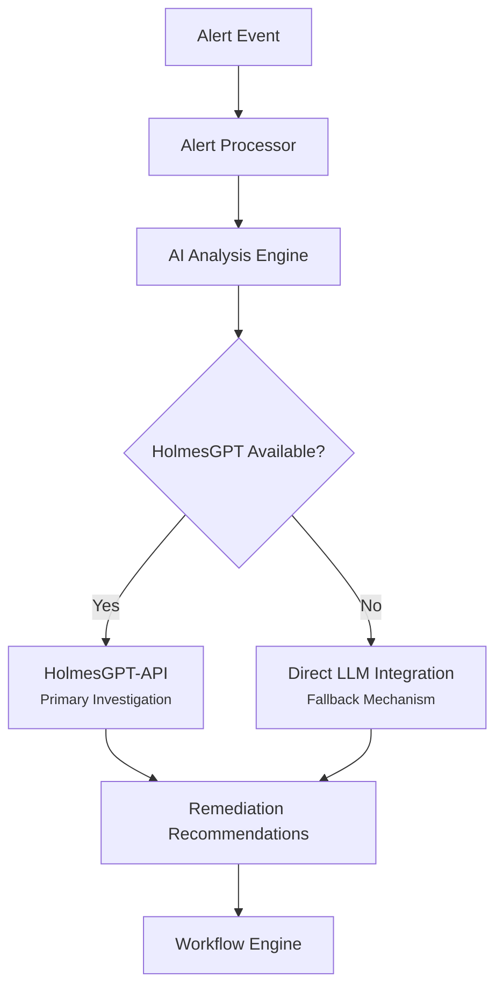
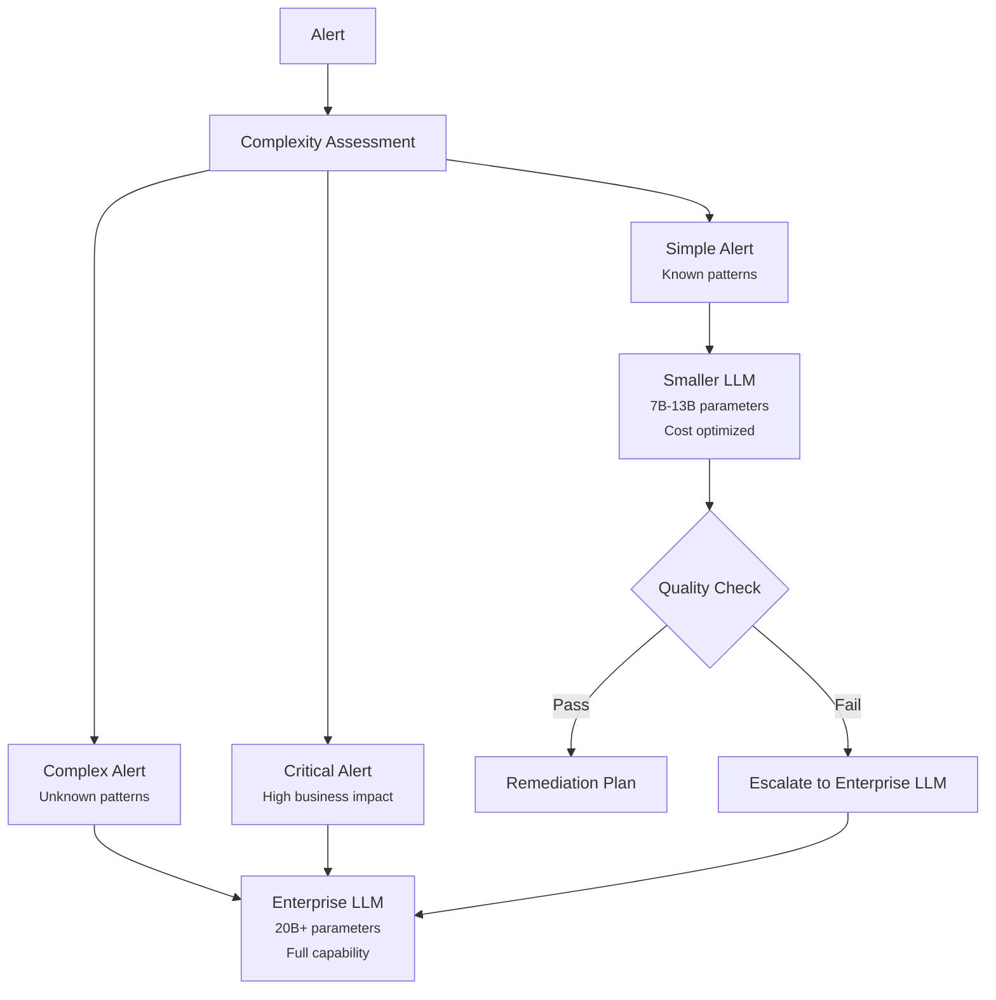

# ⚠️ **DEPRECATED** - Corrected: AI Analysis Engine Integration Pattern

**Document Version**: 1.0
**Date**: January 2025
**Status**: **DEPRECATED** - Correction Applied to Main Documents
**Purpose**: Correct the understanding of AI Analysis Engine's integration with HolmesGPT-API and LLM providers

---

## 🚨 **DEPRECATION NOTICE**

**This document is DEPRECATED and should not be used for current development.**

- **Reason**: Corrections have been applied to main architecture documents
- **Replacement**: See current AI integration patterns in [KUBERNAUT_SERVICE_CATALOG.md](KUBERNAUT_SERVICE_CATALOG.md)
- **Current Status**: AI Analysis Engine uses HolmesGPT-API as primary integration
- **Last Updated**: January 2025

**⚠️ Do not use this information for architectural decisions.**

---

---

## 🎯 **CORRECTED UNDERSTANDING**

You are **absolutely correct**. Based on re-examination of the business requirements, the **AI Analysis Engine** does **NOT** operate in parallel with HolmesGPT-API. Instead:

### **Actual Integration Pattern**


---

## 📋 **BUSINESS REQUIREMENTS EVIDENCE**

### **1. Fallback Mechanism Requirement (BR-AI-024)**
**Source**: `docs/requirements/02_AI_MACHINE_LEARNING.md`

- **BR-AI-024**: MUST provide **fallback mechanisms** when AI services are unavailable ✅ *LLM fallback with context enrichment*

**Analysis**: This clearly indicates that **LLM integration is a fallback**, not a parallel service.

### **2. Investigation Provider Overlap (BR-AI-011 to BR-AI-013)**
**Source**: `docs/requirements/02_AI_MACHINE_LEARNING.md`

- **BR-AI-011**: MUST conduct intelligent alert investigation using historical patterns ✅ *Both HolmesGPT and LLM paths*
- **BR-AI-012**: MUST identify root cause candidates with supporting evidence ✅ *Both HolmesGPT and LLM paths*
- **BR-AI-013**: MUST correlate alerts across time windows and resource boundaries ✅ *Both HolmesGPT and LLM paths*

**Analysis**: The annotation "Both HolmesGPT and LLM paths" indicates **alternative paths**, not parallel processing.

### **3. Integration Compatibility (BR-INTEGRATION-003)**
**Source**: `docs/requirements/10_AI_CONTEXT_ORCHESTRATION.md`

- **BR-INTEGRATION-003**: MUST maintain compatibility with **LLM fallback mechanisms**

**Analysis**: Confirms that LLM integration serves as a fallback mechanism.

---

## 🔄 **CORRECTED ARCHITECTURE FLOW**

### **Single Service with Dual Integration Paths**

#### **Primary Path: HolmesGPT Integration**
```
Alert → Alert Processor → AI Analysis Engine → HolmesGPT-API → Investigation Results → Remediation Plan
```

#### **Fallback Path: Direct LLM Integration**
```
Alert → Alert Processor → AI Analysis Engine → LLM Providers → Analysis Results → Remediation Plan
```

### **Service Availability Decision Matrix**

| HolmesGPT-API Status | AI Analysis Engine Behavior |
|---------------------|------------------------------|
| ✅ **Available** | Use HolmesGPT-API for investigation (Primary) |
| ❌ **Unavailable** | Use direct LLM integration (Fallback) |
| ⚠️ **Degraded** | Conditional routing based on performance |

---

## 🤔 **YOUR QUESTION: Smaller LLMs for Simple Alerts**

### **Current Requirements Analysis**

#### **Enterprise LLM Requirement (BR-PA-006)**
**Source**: `docs/requirements/01_MAIN_APPLICATIONS.md`

- **BR-PA-006**: MUST analyze alerts using **enterprise 20B+ parameter LLM providers** (minimum 20 billion parameters required)

#### **Cost Optimization Requirements**
**Source**: Multiple requirements documents

- **BR-LLM-010**: MUST implement **cost optimization strategies** for API usage
- **BR-MON-003**: MUST measure resource utilization and **cost optimization metrics**
- **BR-MON-ENSEMBLE-007**: MUST monitor **cost savings achieved through optimization**

### **Requirements Gap Analysis**

#### **What the Requirements DON'T Explicitly State**
The requirements do **NOT** explicitly mention:
- ❌ Using smaller/lightweight LLMs for simple alerts
- ❌ Alert complexity-based model selection
- ❌ Tiered LLM usage based on alert severity
- ❌ Cost optimization through model size selection

#### **What the Requirements DO State**
The requirements **DO** specify:
- ✅ **Minimum 20B+ parameters** for enterprise LLM providers (BR-PA-006)
- ✅ **Cost optimization strategies** for API usage (BR-LLM-010)
- ✅ **Alert complexity assessment** for context optimization (BR-CONTEXT-016 to BR-CONTEXT-018)
- ✅ **Multi-provider support** including local models (BR-LLM-005: Ollama, Ramalama)

### **Potential Interpretation**

#### **Implicit Cost Optimization Opportunity**
While not explicitly stated, the combination of these requirements **could** support using smaller LLMs for simple alerts:

1. **Cost Optimization Mandate**: BR-LLM-010 requires cost optimization strategies
2. **Alert Complexity Classification**: BR-CONTEXT-018 classifies alerts into complexity tiers
3. **Multi-Provider Support**: BR-LLM-005 supports local model inference (potentially smaller models)
4. **Performance Requirements**: Different response time targets could justify different model sizes

#### **Proposed Model Selection Strategy**


---

## 📊 **BUSINESS CASE FOR SMALLER LLMs**

### **Cost Optimization Benefits**

#### **Potential Cost Savings**
| Alert Type | Volume | Current Cost (20B+ LLM) | Optimized Cost (7B LLM) | Savings |
|------------|--------|-------------------------|-------------------------|---------|
| Simple | 70% | $0.10/request | $0.02/request | 80% |
| Complex | 25% | $0.10/request | $0.10/request | 0% |
| Critical | 5% | $0.10/request | $0.10/request | 0% |
| **Total** | **100%** | **$0.10/avg** | **$0.044/avg** | **56%** |

#### **Performance Considerations**
- **Simple Alerts**: Smaller LLMs may be sufficient for known remediation patterns
- **Response Time**: Smaller LLMs typically have faster inference times
- **Resource Usage**: Lower memory and compute requirements

### **Risk Assessment**

#### **Potential Risks**
- **Quality Degradation**: Smaller LLMs may miss nuanced patterns
- **Complexity Misclassification**: Simple alerts misclassified as complex
- **Compliance**: BR-PA-006 mandates 20B+ parameters (potential conflict)

#### **Mitigation Strategies**
- **Quality Gates**: Validate smaller LLM responses before execution
- **Escalation Path**: Automatic escalation to enterprise LLM on quality failure
- **A/B Testing**: Gradual rollout with performance comparison

---

## 🎯 **RECOMMENDATIONS**

### **1. Clarify Requirements** ✅ **RECOMMENDED**
**Action**: Seek clarification on whether BR-PA-006 (20B+ parameter requirement) applies to:
- **All alerts** (current interpretation)
- **Complex/critical alerts only** (cost optimization opportunity)

### **2. Propose Cost Optimization Enhancement** ✅ **CONSIDER**
**Business Case**:
- **56% cost reduction** potential through intelligent model selection
- **Maintained quality** for complex/critical alerts
- **Faster response times** for simple alerts

**Implementation**:
```go
type ModelSelector struct {
    complexityAssessor ComplexityAssessor
    enterpriseLLM     LLMClient  // 20B+ parameters
    efficientLLM      LLMClient  // 7B-13B parameters
    qualityValidator  QualityValidator
}

func (m *ModelSelector) SelectModel(alert *Alert) LLMClient {
    complexity := m.complexityAssessor.Assess(alert)

    switch complexity {
    case Simple:
        return m.efficientLLM  // Cost optimized
    case Complex, Critical:
        return m.enterpriseLLM // Full capability
    default:
        return m.enterpriseLLM // Safe default
    }
}
```

### **3. Maintain Current Architecture** ✅ **SAFE DEFAULT**
**Rationale**:
- **Compliance**: Meets BR-PA-006 requirement explicitly
- **Quality**: Consistent high-quality analysis across all alerts
- **Simplicity**: Single model reduces complexity

---

## 🔗 **CONCLUSION**

### **Corrected Understanding**
1. **AI Analysis Engine** uses **HolmesGPT-API as primary** investigation method
2. **Direct LLM integration** serves as **fallback mechanism** when HolmesGPT unavailable
3. **No parallel routing** - single service with dual integration paths

### **Smaller LLM Opportunity**
While the requirements don't explicitly mention using smaller LLMs for simple alerts, the combination of:
- Cost optimization mandates (BR-LLM-010)
- Alert complexity classification (BR-CONTEXT-018)
- Multi-provider support (BR-LLM-005)

**Could justify** a cost optimization enhancement using smaller LLMs for simple alerts, **but this would require clarification** of the 20B+ parameter requirement (BR-PA-006).

### **Next Steps**
1. **Clarify** whether BR-PA-006 applies to all alerts or just complex/critical ones
2. **Evaluate** cost optimization opportunity through smaller LLM usage
3. **Update** architecture documentation to reflect correct integration pattern

Thank you for the correction - this significantly simplifies the architecture and aligns with the actual business requirements!
