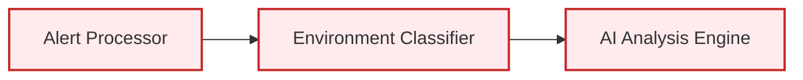
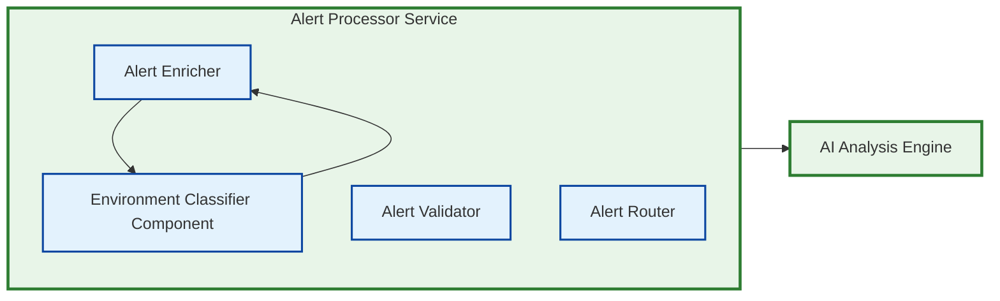
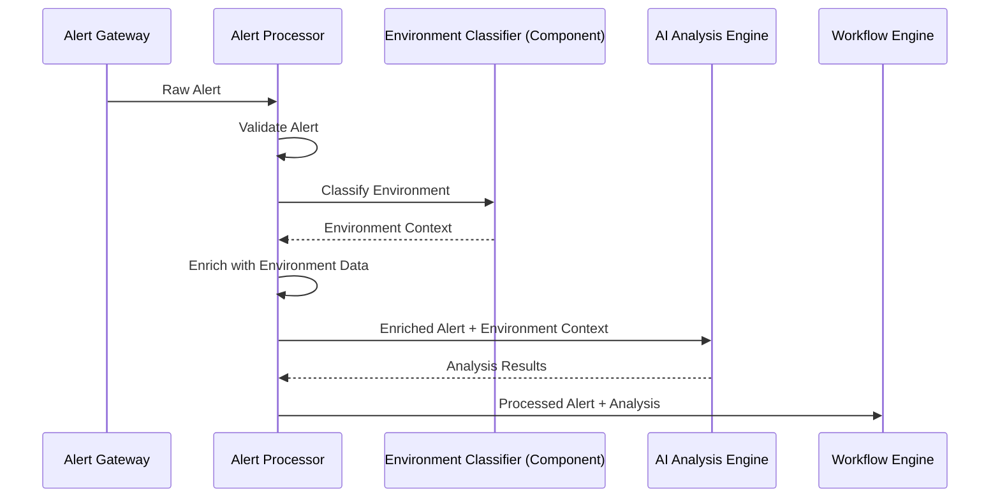

# ⚠️ **DEPRECATED** - Corrected Environment Classifier Integration

**Document Version**: 1.0
**Date**: January 2025
**Status**: **DEPRECATED** - Correction Applied to Main Documents
**Supersedes**: Environment Classifier as Separate Service

---

## 🚨 **DEPRECATION NOTICE**

**This document is DEPRECATED and should not be used for current development.**

- **Reason**: Corrections have been applied to main architecture documents
- **Replacement**: See current environment classification in [KUBERNAUT_SERVICE_CATALOG.md](KUBERNAUT_SERVICE_CATALOG.md)
- **Current Status**: Environment Classification integrated into Alert Processor Service
- **Last Updated**: January 2025

**⚠️ Do not use this information for architectural decisions.**

---

---

## 🎯 **Architectural Correction Summary**

**CORRECTION**: The Environment Classifier should be **a component within the Alert Processor Service**, not a separate microservice. This aligns with the Single Responsibility Principle and the actual data flow patterns.

### **Why This Correction is Necessary**

1. **Environment Classification is Context Enrichment**: It provides metadata to enhance alerts, not make business decisions
2. **Alert Processor Already Does This**: The current codebase shows namespace classification within alert enrichment
3. **Reduces Service Complexity**: Eliminates unnecessary service-to-service communication for metadata extraction
4. **Follows SRP Correctly**: Alert Processor's responsibility is alert preparation and enrichment

---

## 🏗️ **Corrected Architecture Diagram**

### **Before (Incorrect - Separate Service)**


### **After (Correct - Integrated Component)**


---

## 📊 **Corrected Service Responsibilities**

### **Alert Processor Service (Enhanced)**
```yaml
Single Responsibility:
  Alert lifecycle management, enrichment, and preparation for AI analysis

Components:
  - Alert Validator: Input validation and business rule checking
  - Alert Enricher: Context enrichment and metadata addition
  - Environment Classifier: Namespace environment classification (NEW)
  - Alert Router: Routing decisions and destination determination
  - Alert Persister: Alert storage and history management

Environment Classification Integration:
  - Part of alert enrichment pipeline
  - Provides environment context to AI Analysis Engine
  - Uses same performance and caching patterns as other enrichment
```

### **AI Analysis Engine Service (Unchanged)**
```yaml
Single Responsibility:
  AI-powered investigation and recommendation generation

Input Requirements:
  - Enriched alert with environment context
  - Historical patterns and context
  - Business priority information (from environment classification)

Processing:
  - Uses environment context for decision making
  - Applies environment-specific analysis patterns
  - Generates environment-aware recommendations
```

---

## 🔄 **Corrected Data Flow**

### **Alert Processing Pipeline**


### **Environment Classification as Enrichment**
```yaml
Input (Raw Alert):
  name: "HighMemoryUsage"
  namespace: "prod-web-frontend"
  severity: "warning"
  labels:
    app: "web-frontend"
    environment: "production"

Environment Classification (Component Processing):
  classification_method: "kubernetes_labels"
  environment_type: "production"
  business_priority: "critical"
  confidence_score: 0.99
  sla_requirements:
    availability: "99.9%"
    response_time: "<5min"

Output (Enriched Alert):
  name: "HighMemoryUsage"
  namespace: "prod-web-frontend"
  severity: "warning"
  environment_context:
    type: "production"
    priority: "critical"
    business_unit: "platform"
    sla_tier: "critical"
    escalation_policy: "immediate"
  # ... other enrichment data
```

---

## 🏗️ **Implementation Architecture**

### **Alert Processor Service Structure**
```go
// pkg/integration/processor/processor.go
type Processor struct {
    validator           AlertValidator
    enricher           AlertEnricher
    environmentClassifier EnvironmentClassifier  // NEW COMPONENT
    router             AlertRouter
    persister          AlertPersister
    config             *ProcessorConfig
    logger             *logrus.Logger
}

// pkg/integration/processor/environment_classifier.go
type EnvironmentClassifier struct {
    kubeClient     kubernetes.Interface
    configManager  *ConfigManager
    cache          *ClassificationCache
    config         *EnvironmentConfig
    logger         *logrus.Logger
}

func (ec *EnvironmentClassifier) ClassifyEnvironment(ctx context.Context, alert types.Alert) (*EnvironmentContext, error) {
    // Implementation from the deep dive document
    // But as a component, not a service
}
```

### **Enhanced Alert Enrichment**
```go
// pkg/integration/processor/enricher.go
func (e *AlertEnricher) Enrich(ctx context.Context, alert types.Alert) (*EnrichedAlert, error) {
    enriched := &EnrichedAlert{
        Alert: alert,
        Metadata: make(map[string]interface{}),
    }

    // Environment classification as part of enrichment
    envContext, err := e.environmentClassifier.ClassifyEnvironment(ctx, alert)
    if err != nil {
        e.logger.WithError(err).Warn("Environment classification failed, using defaults")
        envContext = e.getDefaultEnvironmentContext(alert)
    }

    enriched.EnvironmentContext = envContext
    enriched.Metadata["environment_classification"] = envContext

    // Other enrichment processes...
    e.addTemporalContext(enriched)
    e.addResourceContext(ctx, enriched)
    e.addHistoricalContext(ctx, enriched)

    return enriched, nil
}
```

---

## 📊 **Benefits of Corrected Architecture**

### **Performance Benefits**
```yaml
Reduced Latency:
  - Eliminates service-to-service call for environment classification
  - In-process classification: <10ms vs <100ms for service call
  - Shared caching between enrichment processes

Improved Throughput:
  - No network overhead for environment classification
  - Batch processing capabilities within single service
  - Reduced serialization/deserialization overhead

Resource Efficiency:
  - One fewer service to deploy and manage
  - Shared memory and CPU resources for related operations
  - Simplified monitoring and debugging
```

### **Architectural Benefits**
```yaml
Single Responsibility Adherence:
  - Alert Processor: Alert preparation and enrichment
  - AI Analysis Engine: AI-powered decision making
  - Clear separation of concerns maintained

Reduced Complexity:
  - Fewer service dependencies
  - Simplified deployment topology
  - Easier testing and validation

Better Cohesion:
  - Related enrichment operations in same service
  - Shared configuration and caching
  - Consistent error handling and logging
```

### **Operational Benefits**
```yaml
Simplified Operations:
  - Fewer services to monitor and maintain
  - Reduced service mesh complexity
  - Simplified configuration management

Better Reliability:
  - Fewer failure points in the pipeline
  - No network failures for environment classification
  - Easier rollback and deployment procedures

Cost Efficiency:
  - Reduced infrastructure overhead
  - Lower operational complexity
  - Simplified scaling decisions
```

---

## 🔄 **Migration Strategy**

### **From Separate Service to Component**
```yaml
Phase 1: Component Implementation
  - Implement EnvironmentClassifier as Alert Processor component
  - Maintain same classification logic and capabilities
  - Add comprehensive unit tests for component integration

Phase 2: Integration Testing
  - Test environment classification within alert enrichment pipeline
  - Validate performance improvements
  - Ensure all business requirements still met

Phase 3: Documentation Updates
  - Update architecture diagrams
  - Revise service catalog
  - Update integration patterns documentation

Phase 4: Deployment
  - Deploy updated Alert Processor with integrated component
  - Remove separate Environment Classifier service
  - Update monitoring and alerting
```

---

## 📋 **Updated Business Requirements Mapping**

### **Alert Processor Service (Enhanced)**
```yaml
Original Requirements: BR-AP-001 to BR-AP-025
Additional Requirements: BR-ENV-001 to BR-ENV-050 (integrated)

Key Capabilities:
  - Alert lifecycle management (existing)
  - Context enrichment (existing)
  - Environment classification (NEW - integrated)
  - Business priority mapping (NEW - integrated)
  - Alert routing and filtering (existing)

Performance Targets:
  - Alert processing: <5s end-to-end (improved from <100ms classification overhead)
  - Environment classification: <10ms (improved from <100ms service call)
  - Throughput: 1,000 alerts/minute (maintained)
  - Accuracy: >99% environment classification (maintained)
```

### **AI Analysis Engine Service (Unchanged)**
```yaml
Requirements: BR-AI-001 to BR-AI-033 (unchanged)

Input Enhancement:
  - Receives enriched alerts with environment context
  - Uses environment information for decision making
  - Applies environment-specific analysis patterns

No Changes Required:
  - Same interface and API
  - Same performance targets
  - Same business logic
```

---

## 🎯 **Conclusion**

The **Environment Classifier belongs as a component within the Alert Processor Service** because:

1. **It's Context Enrichment**: Environment classification enriches alerts with metadata
2. **It's Not Decision Making**: It doesn't make business decisions, just provides context
3. **It Follows SRP**: Alert Processor's job is alert preparation and enrichment
4. **It Improves Performance**: Eliminates unnecessary service-to-service communication
5. **It Reduces Complexity**: Fewer services to manage and deploy

This correction aligns with the **actual data flow patterns** and **Single Responsibility Principle** while maintaining all the sophisticated environment classification capabilities outlined in the deep dive document.

---

## 🔗 **Updated Documentation References**

- **[Service Catalog](KUBERNAUT_SERVICE_CATALOG.md)** - Update Alert Processor specification
- **[Integration Patterns](KUBERNAUT_INTEGRATION_PATTERNS.md)** - Update data flow diagrams
- **[Implementation Roadmap](KUBERNAUT_IMPLEMENTATION_ROADMAP.md)** - Update service count and dependencies

---

*This architectural correction ensures that the Environment Classifier functionality is properly integrated as a component within the Alert Processor Service, following the Single Responsibility Principle and optimizing the overall system architecture.*

