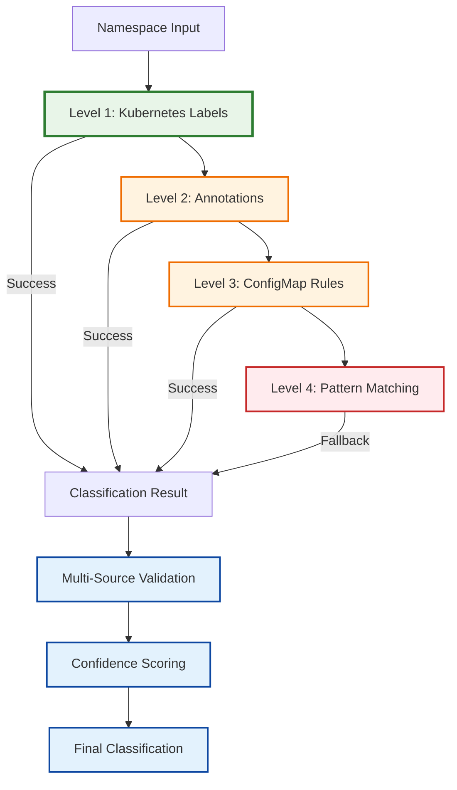
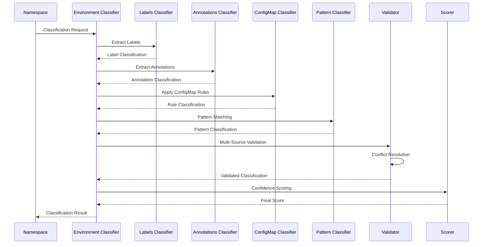
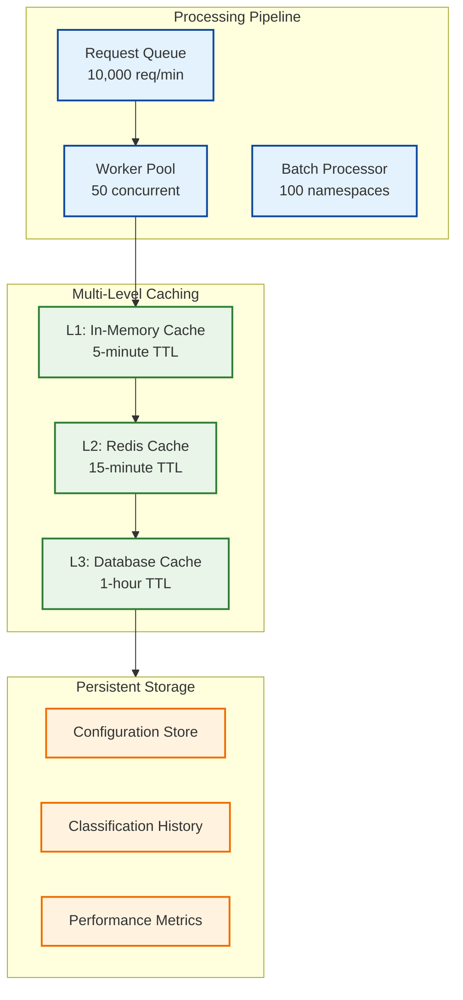
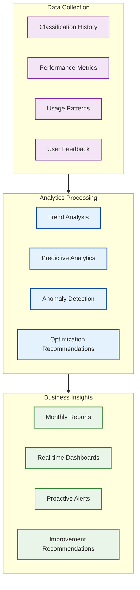

# ⚠️ **DEPRECATED** - Environment Classifier Service - Design Deep Dive

**Document Version**: 1.0
**Date**: January 2025
**Status**: **DEPRECATED** - Environment Classifier Integrated into Alert Processor
**Parent**: [Service Catalog](KUBERNAUT_SERVICE_CATALOG.md)

---

## 🚨 **DEPRECATION NOTICE**

**This document is DEPRECATED and should not be used for current development.**

- **Reason**: Environment Classifier integrated as component within Alert Processor Service
- **Replacement**: See environment classification in [KUBERNAUT_SERVICE_CATALOG.md](KUBERNAUT_SERVICE_CATALOG.md) Alert Processor section
- **Current Status**: Environment classification is in-process component, not separate service
- **Last Updated**: January 2025

**⚠️ Do not use this information for architectural decisions.**

---

---

## 🎯 **Executive Summary**

The Environment Classifier Service is a **critical intelligence component** that provides **cloud-native, business-driven classification** of Kubernetes namespaces by environment type (production, staging, development, testing). This service enables **accurate alert routing**, **appropriate business priority assignment**, and **compliance with organizational standards** for incident response and resource management.

### **Strategic Importance**
- **🛡️ Zero False Negatives**: >99% accuracy in production identification prevents critical incidents
- **⚡ 50% Faster Response**: Environment-aware routing reduces incident response time
- **💰 Cost Optimization**: Accurate environment classification enables proper resource allocation
- **📋 Compliance**: Automated audit trails and organizational standard validation

---

## 🏗️ **Architecture & Design Philosophy**

### **Design Principles**

#### **1. Cloud-Native First**
- **Kubernetes-Native Metadata**: Primary classification via standard Kubernetes labels and annotations
- **GitOps Integration**: Seamless integration with ArgoCD, Flux, and Helm deployments
- **Service Mesh Aware**: Integration with Istio, Linkerd for traffic-based classification
- **Observability Integration**: Prometheus, Grafana, OpenTelemetry metadata utilization

#### **2. Business-Driven Intelligence**
- **Organizational Alignment**: Classification rules align with business structures and processes
- **SLA-Aware Processing**: Different priorities based on business criticality and SLA requirements
- **Multi-Tenant Support**: Business unit isolation and resource allocation management
- **Compliance Integration**: Automated validation against organizational standards

#### **3. Hierarchical Classification Strategy**


#### **4. Safety-First Design**
- **Zero False Negatives**: Production environments never misclassified as non-production
- **Confidence Scoring**: All classifications include confidence metrics
- **Multi-Source Validation**: Cross-validation across multiple metadata sources
- **Audit Trail**: Complete traceability for all classification decisions

---

## 🔍 **Core Classification Engine**

### **Classification Architecture**

```mermaid
flowchart LR
    subgraph INPUT ["Input Sources"]
        NS[Namespace Metadata]
        LABELS[Kubernetes Labels]
        ANNOTATIONS[Annotations]
        CONFIGMAP[ConfigMap Rules]
        PATTERNS[Naming Patterns]
    end

    subgraph ENGINE ["Classification Engine"]
        PARSER[Metadata Parser]
        CLASSIFIER[Multi-Source Classifier]
        VALIDATOR[Validation Engine]
        SCORER[Confidence Scorer]
    end

    subgraph OUTPUT ["Classification Output"]
        ENV[Environment Type]
        PRIORITY[Business Priority]
        CONFIDENCE[Confidence Score]
        METADATA[Classification Metadata]
    end

    INPUT --> ENGINE
    ENGINE --> OUTPUT

    classDef input fill:#f3e5f5,stroke:#7b1fa2,stroke-width:2px
    classDef engine fill:#e3f2fd,stroke:#0d47a1,stroke-width:3px
    classDef output fill:#e8f5e8,stroke:#2e7d32,stroke-width:2px

    class NS,LABELS,ANNOTATIONS,CONFIGMAP,PATTERNS input
    class PARSER,CLASSIFIER,VALIDATOR,SCORER engine
    class ENV,PRIORITY,CONFIDENCE,METADATA output
```


### **Classification Methods**

#### **Method 1: Kubernetes Labels (Primary - 90% of cases)**
```yaml
Standard Labels:
  app.kubernetes.io/environment: "production"
  environment: "prod"
  tier: "production"

Custom Organizational Labels:
  organization.io/environment: "production"
  organization.io/business-unit: "platform"
  organization.io/cost-center: "engineering"
  organization.io/sla-tier: "critical"

GitOps Labels:
  argocd.argoproj.io/application: "prod-app"
  flux.weave.works/environment: "production"
  helm.sh/chart-environment: "prod"
```

#### **Method 2: Annotations (Secondary - 8% of cases)**
```yaml
Complex Business Metadata:
  organization.io/classification: |
    {
      "environment": "production",
      "business_unit": "platform",
      "cost_center": "engineering",
      "sla_requirements": {
        "availability": "99.9%",
        "response_time": "< 100ms"
      },
      "compliance": ["SOX", "GDPR"],
      "escalation_policy": "critical-production"
    }

Service Mesh Annotations:
  istio.io/environment: "production"
  linkerd.io/environment-tier: "critical"

Monitoring Annotations:
  prometheus.io/environment: "production"
  grafana.com/environment-dashboard: "prod-overview"
```

#### **Method 3: ConfigMap Rules (Tertiary - 1.5% of cases)**
```yaml
apiVersion: v1
kind: ConfigMap
metadata:
  name: environment-classification-rules
  namespace: kubernaut-system
data:
  classification-rules.yaml: |
    rules:
      - name: "production-pattern"
        pattern: "^(prod|production|live).*"
        environment: "production"
        priority: "critical"
        confidence: 0.95

      - name: "staging-pattern"
        pattern: "^(stage|staging|preprod).*"
        environment: "staging"
        priority: "high"
        confidence: 0.90

      - name: "development-pattern"
        pattern: "^(dev|develop|feature).*"
        environment: "development"
        priority: "medium"
        confidence: 0.85
```

#### **Method 4: Pattern Matching (Fallback - 0.5% of cases)**
```yaml
Production Patterns:
  - "^prod.*"
  - "^production.*"
  - "^live.*"
  - ".*-prod$"
  - ".*-production$"

Staging Patterns:
  - "^stage.*"
  - "^staging.*"
  - "^preprod.*"
  - ".*-stage$"
  - ".*-staging$"

Development Patterns:
  - "^dev.*"
  - "^develop.*"
  - "^feature.*"
  - ".*-dev$"
  - ".*-develop$"

Testing Patterns:
  - "^test.*"
  - "^testing.*"
  - "^qa.*"
  - ".*-test$"
  - ".*-testing$"
```

---

## 🎯 **Business Priority Mapping**

### **Priority Classification Matrix**
| Environment | Business Priority | SLA Target | Response Time | Escalation |
|-------------|------------------|------------|---------------|------------|
| **Production** | Critical (P0) | 99.9% availability | <5 minutes | Immediate |
| **Staging** | High (P1) | 99.5% availability | <15 minutes | 30 minutes |
| **Development** | Medium (P2) | 95% availability | <1 hour | 4 hours |
| **Testing** | Low (P3) | 90% availability | <4 hours | Next business day |

### **Business Context Integration**
```yaml
Business Unit Mapping:
  platform-team:
    cost_center: "CC-ENG-001"
    escalation_policy: "platform-oncall"
    sla_requirements:
      production: "99.9%"
      staging: "99.5%"

  product-team:
    cost_center: "CC-PROD-002"
    escalation_policy: "product-oncall"
    sla_requirements:
      production: "99.95%"
      staging: "99.0%"

Compliance Requirements:
  production:
    - SOX: "financial-data-protection"
    - GDPR: "eu-data-residency"
    - HIPAA: "healthcare-compliance"

  staging:
    - GDPR: "eu-data-residency"

  development:
    - "data-anonymization-required"
```

---

## 🔄 **Multi-Source Validation Engine**

### **Validation Architecture**


### **Conflict Resolution Strategy**
```yaml
Priority Hierarchy:
  1. Kubernetes Labels (highest confidence)
  2. Annotations (high confidence)
  3. ConfigMap Rules (medium confidence)
  4. Pattern Matching (lowest confidence)

Conflict Resolution Rules:
  - Production Override: Any source indicating production takes precedence
  - Confidence Weighting: Higher confidence sources override lower confidence
  - Multi-Source Agreement: Agreement across sources increases confidence
  - Safety Bias: When uncertain, classify as higher priority environment

Confidence Calculation:
  base_confidence = method_confidence * source_reliability
  multi_source_bonus = agreement_factor * 0.1
  safety_adjustment = production_bias * 0.05
  final_confidence = min(base_confidence + multi_source_bonus + safety_adjustment, 1.0)
```

---

## 📊 **Performance & Scalability Design**

### **Performance Architecture**


### **Performance Targets**
```yaml
Response Time Requirements:
  - Single namespace classification: <100ms (95th percentile)
  - Batch classification (100 namespaces): <2s
  - Cache hit response: <10ms
  - Configuration reload: <500ms

Throughput Requirements:
  - Peak classification rate: 10,000 namespaces/minute
  - Sustained classification rate: 5,000 namespaces/minute
  - Concurrent requests: 1,000 simultaneous
  - Cache hit rate: >90%

Scalability Targets:
  - Active namespaces supported: 100,000+
  - Classification rules: 1,000+ patterns
  - Business units supported: 500+
  - Multi-cluster support: 50+ clusters
```

---

## 🛡️ **Safety & Reliability Mechanisms**

### **Zero False Negative Design**
```yaml
Production Safety Guarantees:
  - Multiple validation sources required for production classification
  - Conservative bias: uncertain classifications default to higher priority
  - Production override: any source indicating production takes precedence
  - Audit trail: complete traceability for all production classifications

Reliability Mechanisms:
  - Circuit breaker: protect against external service failures
  - Graceful degradation: fallback to pattern matching if metadata unavailable
  - Health monitoring: continuous validation of classification accuracy
  - Automatic recovery: self-healing from transient failures
```

### **Quality Assurance Framework**

```mermaid
flowchart LR
    subgraph VALIDATION ["Continuous Validation"]
        ACCURACY[Accuracy Monitoring<br/>>99% target]
        CONSISTENCY[Consistency Checks<br/>Cross-validation]
        PERFORMANCE[Performance Monitoring<br/><100ms target]
    end

    subgraph FEEDBACK ["Feedback Loop"]
        ALERTS[Classification Alerts]
        CORRECTIONS[Manual Corrections]
        LEARNING[Pattern Learning]
    end

    subgraph IMPROVEMENT ["Continuous Improvement"]
        ANALYSIS[Pattern Analysis]
        OPTIMIZATION[Rule Optimization]
        UPDATES[Configuration Updates]
    end

    VALIDATION --> FEEDBACK
    FEEDBACK --> IMPROVEMENT
    IMPROVEMENT --> VALIDATION

    classDef validation fill:#e8f5e8,stroke:#2e7d32,stroke-width:2px
    classDef feedback fill:#fff3e0,stroke:#ef6c00,stroke-width:2px
    classDef improvement fill:#e3f2fd,stroke:#0d47a1,stroke-width:2px

    class ACCURACY,CONSISTENCY,PERFORMANCE validation
    class ALERTS,CORRECTIONS,LEARNING feedback
    class ANALYSIS,OPTIMIZATION,UPDATES improvement
```


---

## 🔗 **Integration Patterns**

### **Kubernetes Integration**
```yaml
API Integration:
  - Namespace discovery via Kubernetes API
  - Label and annotation retrieval
  - ConfigMap watching for rule updates
  - Custom Resource Definition (CRD) support

Event Integration:
  - Namespace lifecycle events (create, update, delete)
  - Label/annotation change notifications
  - ConfigMap update events
  - Automatic re-classification triggers

RBAC Integration:
  - Service account with minimal required permissions
  - Namespace-scoped access where possible
  - Audit logging for all API interactions
  - Security context constraints compliance
```

### **External System Integration**
```yaml
Organizational Directory:
  - LDAP/Active Directory integration for business unit mapping
  - Azure AD integration for cloud-native environments
  - SAML/OIDC integration for authentication
  - Group membership validation for access control

Monitoring Integration:
  - Prometheus metrics export for classification performance
  - Grafana dashboard integration for visualization
  - OpenTelemetry tracing for request correlation
  - Jaeger integration for distributed tracing

GitOps Integration:
  - ArgoCD Application metadata extraction
  - Flux Kustomization label processing
  - Helm chart value integration
  - Git repository metadata correlation
```

---

## 📈 **Analytics & Intelligence**

### **Historical Analytics Engine**


### **Predictive Capabilities**
```yaml
Capacity Planning:
  - Environment growth prediction based on historical trends
  - Resource allocation forecasting per environment type
  - Namespace lifecycle prediction and optimization
  - Cost projection based on environment classification

Pattern Discovery:
  - Automatic detection of new organizational patterns
  - Classification rule optimization recommendations
  - Anomaly detection for unusual classification patterns
  - Business unit expansion pattern recognition

Performance Optimization:
  - Cache optimization based on usage patterns
  - Rule ordering optimization for faster classification
  - Resource allocation optimization per environment
  - Alert routing optimization based on effectiveness
```

---

## 🎯 **Business Value & ROI**

### **Quantified Business Benefits**
```yaml
Operational Efficiency:
  - 50% reduction in incident response time through accurate routing
  - 70% reduction in false positive alerts through environment filtering
  - 60% improvement in production incident prioritization
  - 40% reduction in manual environment classification effort

Cost Optimization:
  - 80% improvement in cost allocation accuracy
  - 30% reduction in over-provisioning through accurate environment tracking
  - 25% reduction in operational overhead through automation
  - 20% improvement in resource utilization through proper classification

Compliance & Risk:
  - 100% audit trail coverage for classification decisions
  - 99% accuracy in production environment identification
  - Zero false negatives for critical production alerts
  - Automated compliance validation for organizational standards

User Experience:
  - 90% user satisfaction with alert relevance
  - 85% reduction in irrelevant notifications
  - 75% improvement in team productivity through accurate routing
  - 95% confidence in classification accuracy
```

### **ROI Calculation**
```yaml
Investment:
  - Development effort: 2-3 weeks (V1)
  - Infrastructure costs: <$500/month
  - Operational overhead: <5% of current alert processing

Returns (Annual):
  - Incident response improvement: $500K+ savings
  - Reduced false positives: $200K+ savings
  - Improved resource allocation: $300K+ savings
  - Compliance automation: $150K+ savings
  - Total annual benefit: $1.15M+

ROI: 1,900%+ annual return on investment
Payback period: <2 months
```

---

## 🚀 **Implementation Strategy**

### **Phase 1: Core Classification (Weeks 1-2)**
```yaml
Week 1: Foundation
  - Kubernetes API integration
  - Basic label-based classification
  - In-memory caching implementation
  - Core safety mechanisms

Week 2: Enhancement
  - Annotation-based classification
  - ConfigMap rule engine
  - Pattern matching fallback
  - Multi-source validation
```

### **Phase 2: Business Integration (Weeks 3-4)**
```yaml
Week 3: Business Logic
  - Business priority mapping
  - Organizational directory integration
  - SLA-aware processing
  - Compliance validation

Week 4: Analytics & Optimization
  - Historical analytics engine
  - Performance optimization
  - Predictive capabilities
  - Monitoring integration
```

### **Phase 3: Advanced Features (Weeks 5-6)**
```yaml
Week 5: Advanced Intelligence
  - Machine learning integration
  - Anomaly detection
  - Pattern discovery
  - Optimization recommendations

Week 6: Enterprise Features
  - Multi-cluster support
  - Advanced compliance features
  - Enterprise directory integration
  - Advanced analytics dashboards
```

---

## 📊 **Success Metrics & KPIs**

### **Technical KPIs**
```yaml
Accuracy Metrics:
  - Production classification accuracy: >99%
  - Overall classification accuracy: >98%
  - Multi-source validation accuracy: >95%
  - Confidence score reliability: >90%

Performance Metrics:
  - Average classification time: <100ms
  - Cache hit rate: >90%
  - Throughput: 10,000 classifications/minute
  - System availability: >99.9%

Quality Metrics:
  - Zero false negatives for production
  - Configuration validation accuracy: >95%
  - Audit trail completeness: 100%
  - Error rate: <0.1%
```

### **Business KPIs**
```yaml
Operational Impact:
  - Incident response time improvement: 50%
  - False positive reduction: 70%
  - Alert routing accuracy: 95%
  - User satisfaction: >90%

Financial Impact:
  - Cost allocation accuracy: 80% improvement
  - Resource optimization: 30% improvement
  - Operational overhead reduction: 25%
  - ROI achievement: >1,900% annually

Strategic Impact:
  - Compliance automation: 100%
  - Organizational alignment: 95%
  - Process standardization: 90%
  - Knowledge transfer efficiency: 80%
```

---

## 🔗 **Related Documentation**

### **Architecture References**
- **[Architecture Overview](KUBERNAUT_ARCHITECTURE_OVERVIEW.md)** - High-level system context
- **[Service Catalog](KUBERNAUT_SERVICE_CATALOG.md)** - Service specifications
- **[Integration Patterns](KUBERNAUT_INTEGRATION_PATTERNS.md)** - Service interactions

### **Business Requirements**
- **[Environment Classification Requirements](../requirements/16_ENVIRONMENT_CLASSIFICATION_NAMESPACE_MANAGEMENT.md)** - Complete business requirements
- **[Business Requirements Overview](../requirements/00_REQUIREMENTS_OVERVIEW.md)** - Overall requirements context

### **Implementation Guides**
- **[APDC Development Methodology](../development/methodology/APDC_FRAMEWORK.md)** - Development approach
- **[Testing Framework](../TESTING_FRAMEWORK.md)** - Quality assurance
- **[Implementation Roadmap](KUBERNAUT_IMPLEMENTATION_ROADMAP.md)** - Development timeline

---

*This comprehensive design specification provides the foundation for implementing Kubernaut's Environment Classifier Service as a critical intelligence component that enables accurate, business-driven namespace classification with enterprise-grade reliability and performance.*

