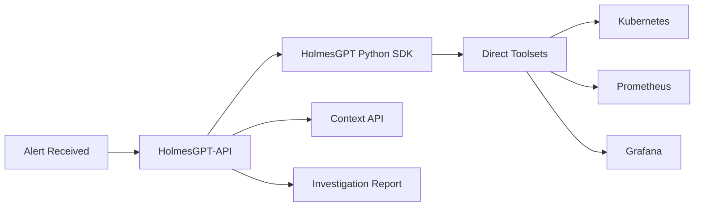
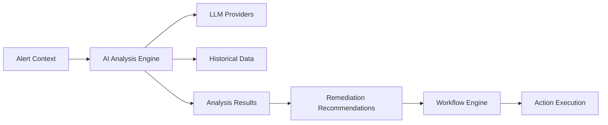
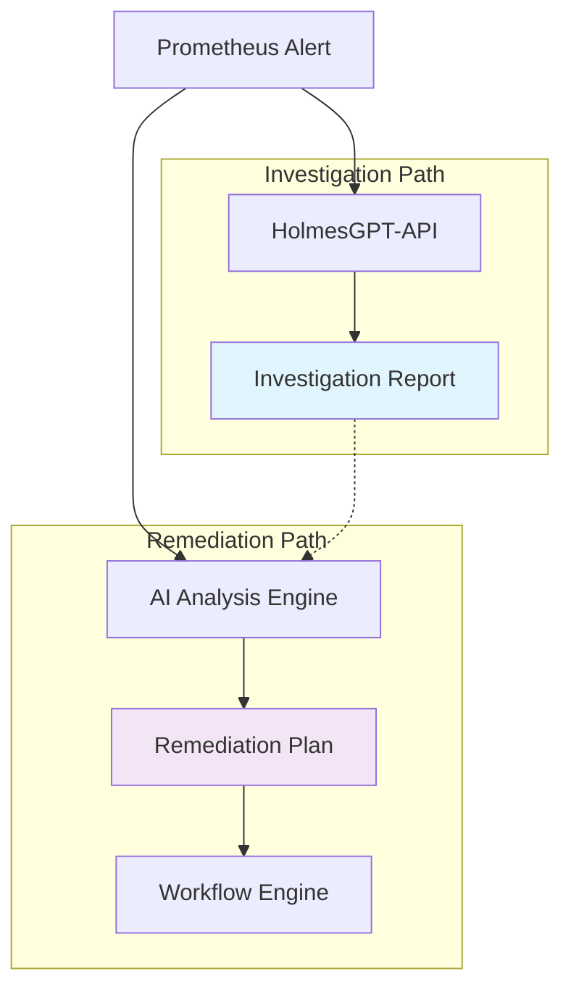
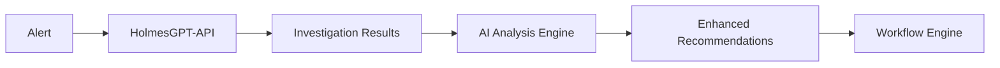

# ⚠️ **DEPRECATED** - HolmesGPT-API vs AI Analysis Engine - Relationship Triage

**Document Version**: 1.0
**Date**: January 2025
**Status**: **DEPRECATED** - Analysis Complete, Document Obsolete
**Purpose**: Clarify the distinct roles and integration patterns between HolmesGPT-API and AI Analysis Engine services

---

## 🚨 **DEPRECATION NOTICE**

**This document is DEPRECATED and should not be used for current development.**

- **Reason**: Relationship analysis completed, patterns established in main architecture
- **Replacement**: See current AI service relationships in [KUBERNAUT_SERVICE_CATALOG.md](KUBERNAUT_SERVICE_CATALOG.md)
- **Current Status**: AI Analysis Engine uses HolmesGPT-API as primary investigation service
- **Last Updated**: January 2025

**⚠️ Do not use this information for architectural decisions.**

---

---

## 🎯 **EXECUTIVE SUMMARY**

Based on comprehensive analysis of business requirements, **HolmesGPT-API** and **AI Analysis Engine** are **complementary but distinct services** with different responsibilities, data flows, and integration patterns within Kubernaut's architecture.

### **Key Finding**
- **HolmesGPT-API**: External investigation service with direct toolset access
- **AI Analysis Engine**: Internal Kubernaut business logic for remediation decision-making
- **Relationship**: Parallel AI capabilities serving different workflow stages

---

## 📋 **BUSINESS REQUIREMENTS ANALYSIS**

### **HolmesGPT-API Service Requirements**
**Source**: `docs/requirements/13_HOLMESGPT_REST_API_WRAPPER.md`

#### **Primary Business Purpose**
> "Create a standalone REST API server that wraps the HolmesGPT Python SDK to provide HTTP endpoints for AI-powered investigation capabilities"

#### **Key Business Requirements**
- **BR-HAPI-001 to BR-HAPI-015**: Investigation and chat endpoints
- **BR-HAPI-026 to BR-HAPI-030**: HolmesGPT SDK integration with multiple AI providers
- **BR-HAPI-031 to BR-HAPI-035**: Toolset management (Kubernetes, Prometheus, Grafana access)
- **BR-HAPI-069 to BR-HAPI-073**: Context API integration for enhanced investigations

#### **Core Capabilities**
1. **External Investigation Service**: Wraps external HolmesGPT Python SDK
2. **Direct Toolset Access**: Built-in access to Kubernetes, Prometheus, Grafana
3. **Multi-Provider AI**: OpenAI, Anthropic, Ollama integration
4. **Investigation Orchestration**: Manages investigation workflows and context gathering

### **AI Analysis Engine Service Requirements**
**Source**: `docs/requirements/02_AI_MACHINE_LEARNING.md`

#### **Primary Business Purpose**
> "Provide intelligent decision-making capabilities for Kubernetes remediation, leveraging multiple LLM providers, historical learning, and advanced analytics"

#### **Key Business Requirements**
- **BR-AI-001 to BR-AI-005**: Analysis Provider (contextual analysis, structured results)
- **BR-AI-006 to BR-AI-010**: Recommendation Provider (remediation recommendations)
- **BR-AI-011 to BR-AI-015**: Investigation Provider (alert investigation, root cause analysis)
- **BR-LLM-001 to BR-LLM-050**: LLM Integration Layer (multi-provider support)

#### **Core Capabilities**
1. **Internal Business Logic**: Kubernaut's native AI decision-making engine
2. **Remediation Focus**: Generates actionable remediation recommendations
3. **Historical Learning**: Learns from past remediation effectiveness
4. **Workflow Integration**: Directly integrated with Workflow Engine for execution

---

## 🔄 **SERVICE RELATIONSHIP ANALYSIS**

### **1. Distinct Service Boundaries**

#### **HolmesGPT-API: External Investigation Service**


**Characteristics**:
- **External Dependency**: Wraps external HolmesGPT SDK
- **Investigation Focus**: Specialized in alert investigation and root cause analysis
- **Direct Access**: Built-in toolsets for data source access
- **Standalone Operation**: Can operate independently of Kubernaut business logic

#### **AI Analysis Engine: Internal Decision Service**


**Characteristics**:
- **Internal Business Logic**: Core Kubernaut AI decision-making
- **Remediation Focus**: Specialized in generating actionable remediation plans
- **Historical Integration**: Learns from past remediation effectiveness
- **Workflow Integration**: Directly feeds Workflow Engine for execution

### **2. Data Flow Patterns**

#### **Investigation Flow (HolmesGPT-API)**
```
External Alert → HolmesGPT-API → Investigation → Context Enrichment → Investigation Report
```

#### **Remediation Flow (AI Analysis Engine)**
```
Alert Context → AI Analysis Engine → LLM Analysis → Remediation Recommendations → Workflow Execution
```

### **3. Integration Patterns**

#### **Parallel Operation Model**
Both services can operate in parallel for comprehensive alert handling:



#### **Sequential Integration Model**
HolmesGPT investigation can inform AI Analysis Engine decisions:



---

## 🎯 **KEY DISTINCTIONS**

### **1. Service Scope & Responsibility**

| Aspect | HolmesGPT-API | AI Analysis Engine |
|--------|---------------|-------------------|
| **Primary Role** | External investigation service | Internal remediation decision engine |
| **Business Focus** | Alert investigation & root cause analysis | Remediation recommendation & execution planning |
| **Data Sources** | Direct toolset access (K8s, Prometheus, Grafana) | Kubernaut context & historical data |
| **AI Integration** | HolmesGPT Python SDK + AI providers | Native LLM integration layer |
| **Output** | Investigation reports & insights | Actionable remediation recommendations |

### **2. Technical Architecture**

| Aspect | HolmesGPT-API | AI Analysis Engine |
|--------|---------------|-------------------|
| **Implementation** | Python REST API wrapper | Go-based business logic service |
| **Dependencies** | External HolmesGPT SDK | Internal Kubernaut components |
| **Deployment** | Standalone container service | Integrated Kubernaut service |
| **Scaling** | Independent horizontal scaling | Scales with Kubernaut core |
| **Configuration** | HolmesGPT toolset configuration | Kubernaut AI/LLM configuration |

### **3. Business Requirements Coverage**

#### **HolmesGPT-API Requirements**
- **Investigation Endpoints**: BR-HAPI-001 to BR-HAPI-015
- **SDK Integration**: BR-HAPI-026 to BR-HAPI-030
- **Toolset Management**: BR-HAPI-031 to BR-HAPI-035
- **Context Integration**: BR-HAPI-069 to BR-HAPI-073

#### **AI Analysis Engine Requirements**
- **Analysis Provider**: BR-AI-001 to BR-AI-005
- **Recommendation Provider**: BR-AI-006 to BR-AI-010
- **Investigation Provider**: BR-AI-011 to BR-AI-015 (overlaps with HolmesGPT)
- **LLM Integration**: BR-LLM-001 to BR-LLM-050

### **4. Overlapping Capabilities**

#### **Investigation Capabilities (BR-AI-011 to BR-AI-015)**
Both services provide investigation capabilities but with different approaches:

- **HolmesGPT-API**: Uses external HolmesGPT SDK with direct toolset access
- **AI Analysis Engine**: Uses internal LLM integration with Kubernaut context

**Resolution**: Both capabilities are valuable and complementary
- HolmesGPT provides deep, specialized investigation
- AI Analysis Engine provides Kubernaut-integrated investigation for remediation planning

---

## 🔗 **INTEGRATION STRATEGIES**

### **Strategy 1: Parallel Operation (Recommended)**
Both services operate independently, providing different perspectives:

**Benefits**:
- ✅ Specialized capabilities from each service
- ✅ Redundancy and reliability
- ✅ Independent scaling and optimization
- ✅ Clear service boundaries

**Use Cases**:
- Complex alerts requiring both investigation and immediate remediation
- High-priority incidents needing multiple AI perspectives
- Validation of remediation decisions through independent investigation

### **Strategy 2: Sequential Integration**
HolmesGPT investigation informs AI Analysis Engine decisions:

**Benefits**:
- ✅ Enhanced context for remediation decisions
- ✅ Leverages HolmesGPT's specialized investigation capabilities
- ✅ Improved remediation accuracy through investigation insights

**Use Cases**:
- Complex alerts requiring deep investigation before remediation
- Unknown or novel alert patterns
- High-risk environments requiring thorough analysis

### **Strategy 3: Conditional Routing**
Route alerts to appropriate service based on complexity and requirements:

**Routing Logic**:
- **Simple alerts** → AI Analysis Engine (direct remediation)
- **Complex alerts** → HolmesGPT-API (investigation) → AI Analysis Engine (remediation)
- **Investigation-only requests** → HolmesGPT-API
- **Remediation-only requests** → AI Analysis Engine

---

## 📊 **ARCHITECTURAL IMPACT ASSESSMENT**

### **Current Architecture Implications**

#### **Service Count Impact**
- **Current**: 14 distinct services (including both HolmesGPT-API and AI Analysis Engine)
- **Recommendation**: Maintain both services as distinct entities
- **Rationale**: Different business purposes, technical implementations, and integration patterns

#### **Integration Complexity**
- **Low Complexity**: Parallel operation with minimal integration
- **Medium Complexity**: Sequential integration with context sharing
- **High Complexity**: Conditional routing with intelligent decision logic

### **Performance Considerations**

#### **Resource Utilization**
- **HolmesGPT-API**: Python-based, external SDK dependencies
- **AI Analysis Engine**: Go-based, internal LLM integration
- **Combined**: Optimized resource allocation based on workload characteristics

#### **Response Time Targets**
- **HolmesGPT Investigation**: 30-60 seconds for comprehensive analysis
- **AI Analysis Recommendations**: 5-15 seconds for remediation decisions
- **Combined Workflow**: 35-75 seconds for investigation + remediation

---

## 🎯 **RECOMMENDATIONS**

### **1. Maintain Distinct Services** ✅ **RECOMMENDED**
Keep HolmesGPT-API and AI Analysis Engine as separate services with clear boundaries:

**Rationale**:
- Different business purposes (investigation vs. remediation)
- Different technical implementations (Python SDK vs. Go business logic)
- Different integration patterns (external toolsets vs. internal context)
- Different scaling characteristics and operational requirements

### **2. Implement Parallel Operation** ✅ **RECOMMENDED**
Design both services to operate in parallel for comprehensive alert handling:

**Implementation**:
- Alert Gateway routes alerts to both services simultaneously
- Context Orchestrator provides shared context to both services
- Workflow Engine can consume outputs from both services
- Monitoring tracks performance and effectiveness of both approaches

### **3. Enable Sequential Integration** ✅ **OPTIONAL**
Provide capability for HolmesGPT investigation to inform AI Analysis decisions:

**Implementation**:
- HolmesGPT-API investigation results can be passed to AI Analysis Engine
- Context API can store and retrieve investigation results
- AI Analysis Engine can incorporate investigation insights into remediation decisions

### **4. Update Architecture Documentation** ✅ **REQUIRED**
Clarify service relationships in architecture documentation:

**Updates Needed**:
- Service specifications clearly distinguish roles and responsibilities
- Integration patterns document parallel and sequential operation modes
- Data flow diagrams show distinct service boundaries and interactions
- Business requirements mapping shows coverage by each service

---

## 📋 **IMPLEMENTATION CHECKLIST**

### **Architecture Documentation Updates**
- [ ] Update service specifications to clarify distinct roles
- [ ] Add integration pattern documentation
- [ ] Update data flow diagrams
- [ ] Clarify business requirements coverage

### **Service Integration Design**
- [ ] Design parallel operation patterns
- [ ] Define context sharing mechanisms
- [ ] Specify routing and orchestration logic
- [ ] Plan monitoring and observability

### **Performance Optimization**
- [ ] Optimize resource allocation for both services
- [ ] Design caching strategies for shared context
- [ ] Plan scaling strategies for different workload patterns
- [ ] Define performance metrics and SLAs

---

## 🔗 **CONCLUSION**

**HolmesGPT-API** and **AI Analysis Engine** are **complementary services** that serve different aspects of Kubernaut's AI-driven remediation capabilities:

- **HolmesGPT-API**: Specialized external investigation service with direct toolset access
- **AI Analysis Engine**: Internal remediation decision engine with historical learning

**Recommended Approach**: Maintain both services as distinct entities with parallel operation capabilities and optional sequential integration for complex scenarios.

This approach maximizes the value of both specialized investigation capabilities and integrated remediation decision-making while maintaining clear service boundaries and operational flexibility.
