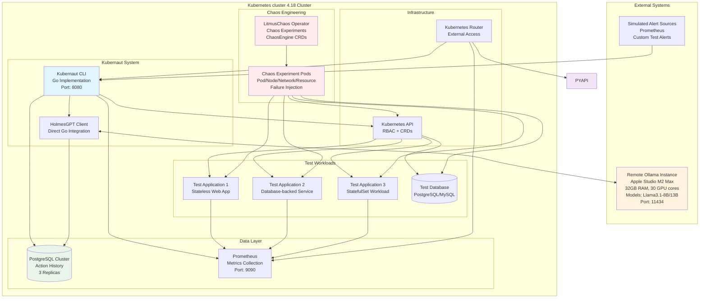
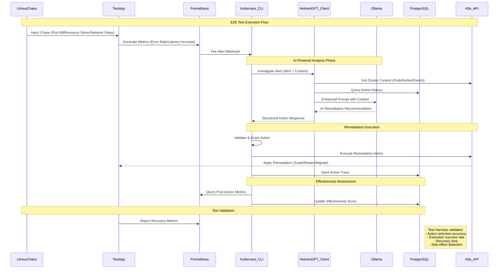

# Kubernaut End-to-End Testing Plan

**Document Version**: 1.0
**Date**: January 2025
**Status**: Planning Phase - Awaiting Approval
**Author**: AI Assistant

---

## Executive Summary

This document outlines a comprehensive end-to-end (e2e) testing strategy for **Kubernaut**, an intelligent Kubernetes remediation agent with LLM-powered decision making. The testing framework will validate kubernaut's ability to autonomously analyze alerts and execute sophisticated automated remediation actions across 25+ supported operations using chaos engineering principles.

### Testing Environment Overview

- **Platform**: Kind (Kubernetes in Docker) cluster
- **AI Backend**: HolmesGPT REST API (localhost:8090)
- **Data Storage**: PostgreSQL containers
- **Runtime**: Kubernaut services via Kubernetes deployments
- **Chaos Engineering**: LitmusChaos framework for controlled instability injection
- **Scope**: Comprehensive validation of all remediation categories and AI decision-making capabilities

---

## Infrastructure Requirements

### Kind Cluster

#### **Cluster Specifications**
| Component | Requirement | Purpose |
|-----------|-------------|---------|
| **Control Plane** | 1 node, 4 vCPU, 8GB RAM | Lightweight control plane |
| **Worker Nodes** | 3+ nodes, 2 vCPU, 4GB RAM each | Workload distribution and testing |
| **Storage** | Local path provisioner | Persistent storage for databases |
| **Network** | Calico or Kindnet | Network policy support |
| **Setup Time** | < 2 minutes | Fast cluster creation/teardown |

#### **Required Cluster Features**
- **RBAC**: Kubernetes RBAC for kubernaut operations
- **Custom Resource Definitions (CRDs)**: Support for Tekton and kubernaut workflows
- **Persistent Volumes**: Local path provisioner for databases
- **Port Forwarding**: Access to kubernaut services

### Remote Ollama Model Instance

#### **Ollama Infrastructure Requirements**
| Component | Specification | Notes |
|-----------|---------------|--------|
| **Hardware** | Apple Studio M2 Max | Dedicated AI inference workstation |
| **CPU/GPU** | M2 Max chip, 30 GPU cores | Apple Silicon optimized for LLM inference |
| **Memory** | 32GB Unified Memory | Sufficient for 7B-13B parameter models |
| **Storage** | 500GB+ SSD | Support for multiple model variants |
| **Network** | High-bandwidth connection to Kubernetes cluster | Minimize AI analysis latency |
| **OS** | macOS with Ollama native support | Apple Silicon optimized performance |

#### **Supported Models for Testing**
- **Llama 3.1 8B**: Primary testing model
- **Llama 3.1 13B**: Performance comparison baseline
- **Code Llama 7B**: Code-focused decision making
- **Mistral 7B**: Alternative model architecture testing

#### **Ollama Configuration (Apple Silicon Optimized)**
```bash
# Apple Studio M2 Max Ollama configuration
OLLAMA_HOST=0.0.0.0:11434
OLLAMA_MODELS_PATH=/opt/ollama/models
OLLAMA_NUM_PARALLEL=6  # Optimized for M2 Max performance cores
OLLAMA_MAX_LOADED_MODELS=3  # 32GB unified memory allows multiple models
OLLAMA_GPU_LAYERS=30  # Utilize all 30 GPU cores
OLLAMA_THREADS=12  # M2 Max CPU core optimization
OLLAMA_METAL=1  # Enable Apple Metal performance acceleration
```

### Local Database Instances

#### **PostgreSQL Configuration**
```yaml
# PostgreSQL deployment specs
spec:
  replicas: 3  # High availability
  resources:
    requests:
      cpu: "500m"
      memory: "2Gi"
    limits:
      cpu: "2000m"
      memory: "8Gi"
  storage:
    size: "100Gi"
    class: "gp3-csi"  # High performance storage

  # Database configuration
  postgresql.conf: |
    max_connections = 200
    shared_buffers = 2GB
    effective_cache_size = 6GB
    maintenance_work_mem = 512MB
    checkpoint_completion_target = 0.9
    wal_buffers = 16MB
```

#### **Required Database Schema**
- **Action History Tables**: Store remediation action outcomes
- **Effectiveness Metrics**: AI decision quality scoring
- **Alert History**: Complete audit trail of processed alerts
- **Pattern Storage**: Vector embeddings for pattern recognition (future)

---

## E2E Testing Architecture

### System Architecture Diagram



### Data Flow Architecture



---

## LitmusChaos Integration & Capabilities

### LitmusChaos Framework Overview

**LitmusChaos** is a cloud-native chaos engineering framework for Kubernetes that enables controlled failure injection to test system resilience. For kubernaut e2e testing, it provides:

#### **Core Capabilities**
1. **ChaosEngine**: Kubernetes CRD for defining chaos experiments
2. **ChaosExperiment**: Reusable experiment templates
3. **ChaosResult**: Detailed experiment outcome reporting
4. **ChaosHub**: Community library of 30+ predefined experiments
5. **Litmus Portal**: Web interface for experiment management (optional)

#### **Experiment Categories**
| Category | Experiments | Kubernaut Actions Triggered |
|----------|-------------|---------------------------|
| **Pod Chaos** | `pod-delete`, `pod-kill`, `pod-failure` | `restart_pod`, `scale_deployment`, `quarantine_pod` |
| **Node Chaos** | `node-drain`, `node-taint`, `kubelet-service-kill` | `drain_node`, `cordon_node`, `migrate_workload` |
| **Resource Chaos** | `pod-cpu-hog`, `pod-memory-hog`, `disk-fill` | `increase_resources`, `cleanup_storage`, `scale_deployment` |
| **Network Chaos** | `pod-network-delay`, `pod-network-loss`, `dns-chaos` | `restart_network`, `update_network_policy`, `collect_diagnostics` |
| **Storage Chaos** | `disk-loss`, `disk-fill` | `expand_pvc`, `backup_data`, `migrate_workload` |

### LitmusChaos Deployment Configuration

```yaml
# litmus-operator.yaml
apiVersion: apps/v1
kind: Deployment
metadata:
  name: litmus-operator
  namespace: litmus
spec:
  replicas: 1
  selector:
    matchLabels:
      name: litmus-operator
  template:
    metadata:
      labels:
        name: litmus-operator
    spec:
      serviceAccountName: litmus-operator
      containers:
      - name: litmus-operator
        image: litmuschaos/chaos-operator:3.10.0
        command:
        - chaos-operator
        env:
        - name: CHAOS_RUNNER_IMAGE
          value: "litmuschaos/chaos-runner:3.10.0"
        - name: WATCH_NAMESPACE
          value: ""
        - name: POD_NAME
          valueFrom:
            fieldRef:
              fieldPath: metadata.name
        - name: OPERATOR_NAME
          value: "litmus-operator"
```

---

## Comprehensive Test Scenarios

### Scenario Categories & Kubernaut Action Validation

#### **Category 1: Pod Lifecycle Management**

##### **Test Case 1.1: Pod Crash Loop Remediation**
```yaml
# ChaosEngine Configuration
apiVersion: litmuschaos.io/v1alpha1
kind: ChaosEngine
metadata:
  name: pod-crash-loop-test
spec:
  chaosServiceAccount: litmus-admin
  experiments:
  - name: pod-delete
    spec:
      components:
        env:
        - name: TOTAL_CHAOS_DURATION
          value: '60'
        - name: CHAOS_INTERVAL
          value: '10'
        - name: FORCE
          value: 'false'
```

**Expected Kubernaut Actions:**
- `restart_pod`: For simple crash scenarios
- `rollback_deployment`: If recent deployment correlation
- `collect_diagnostics`: For investigation
- `quarantine_pod`: If malicious activity suspected

**Success Criteria:**
- Alert triggered within 30 seconds of chaos injection
- Correct action selected based on alert context
- Pod recovery within 2 minutes
- Effectiveness score >0.8 for successful remediation

##### **Test Case 1.2: Resource Exhaustion Response**
```yaml
# Resource stress chaos experiment
apiVersion: litmuschaos.io/v1alpha1
kind: ChaosEngine
metadata:
  name: resource-exhaustion-test
spec:
  experiments:
  - name: pod-memory-hog
    spec:
      components:
        env:
        - name: MEMORY_CONSUMPTION
          value: '90'
        - name: TOTAL_CHAOS_DURATION
          value: '300'
```

**Expected Kubernaut Actions:**
- `increase_resources`: Primary response for OOMKilled alerts
- `scale_deployment`: If resource increase insufficient
- `migrate_workload`: For node-level resource constraints

#### **Category 2: Node-Level Resilience**

##### **Test Case 2.1: Node Failure Handling**
```yaml
apiVersion: litmuschaos.io/v1alpha1
kind: ChaosEngine
metadata:
  name: node-failure-test
spec:
  experiments:
  - name: node-drain
    spec:
      components:
        env:
        - name: TARGET_NODE
          value: 'worker-node-2'
```

**Expected Kubernaut Actions:**
- `drain_node`: Graceful workload evacuation
- `cordon_node`: Prevent new pod scheduling
- `migrate_workload`: Move critical services
- `collect_diagnostics`: Node health investigation

##### **Test Case 2.2: Kubelet Service Disruption**
```yaml
apiVersion: litmuschaos.io/v1alpha1
kind: ChaosEngine
metadata:
  name: kubelet-failure-test
spec:
  experiments:
  - name: kubelet-service-kill
    spec:
      components:
        env:
        - name: TOTAL_CHAOS_DURATION
          value: '180'
```

**Expected Kubernaut Actions:**
- `collect_diagnostics`: Primary investigation action
- `drain_node`: If kubelet remains unresponsive
- `restart_daemonset`: For kubelet-related DaemonSets

#### **Category 3: Network Resilience**

##### **Test Case 3.1: Network Partition Simulation**
```yaml
apiVersion: litmuschaos.io/v1alpha1
kind: ChaosEngine
metadata:
  name: network-partition-test
spec:
  experiments:
  - name: pod-network-loss
    spec:
      components:
        env:
        - name: NETWORK_PACKET_LOSS_PERCENTAGE
          value: '100'
        - name: TARGET_CONTAINER
          value: 'webapp'
```

**Expected Kubernaut Actions:**
- `restart_network`: CNI component restart
- `update_network_policy`: Network policy adjustment
- `migrate_workload`: Move to different network zone
- `collect_diagnostics`: Network troubleshooting

##### **Test Case 3.2: DNS Resolution Failure**
```yaml
apiVersion: litmuschaos.io/v1alpha1
kind: ChaosEngine
metadata:
  name: dns-failure-test
spec:
  experiments:
  - name: dns-chaos
    spec:
      components:
        env:
        - name: TARGET_HOSTNAMES
          value: 'kubernetes.default.svc.cluster.local'
```

**Expected Kubernaut Actions:**
- `restart_network`: CoreDNS restart
- `collect_diagnostics`: DNS configuration analysis
- `notify_only`: For external DNS dependencies

#### **Category 4: Storage & Data Persistence**

##### **Test Case 4.1: Disk Space Exhaustion**
```yaml
apiVersion: litmuschaos.io/v1alpha1
kind: ChaosEngine
metadata:
  name: disk-space-test
spec:
  experiments:
  - name: disk-fill
    spec:
      components:
        env:
        - name: FILL_PERCENTAGE
          value: '95'
        - name: TARGET_CONTAINER
          value: 'database'
```

**Expected Kubernaut Actions:**
- `cleanup_storage`: Log and temporary file cleanup
- `expand_pvc`: Persistent volume expansion
- `backup_data`: Emergency backup before cleanup
- `compact_storage`: Database compaction

##### **Test Case 4.2: Persistent Volume Failure**
```yaml
apiVersion: litmuschaos.io/v1alpha1
kind: ChaosEngine
metadata:
  name: pv-failure-test
spec:
  experiments:
  - name: disk-loss
    spec:
      components:
        env:
        - name: TARGET_CONTAINER
          value: 'postgres'
```

**Expected Kubernaut Actions:**
- `failover_database`: Database failover to replica
- `backup_data`: Immediate backup if possible
- `migrate_workload`: Move to node with available storage

#### **Category 5: Application-Level Chaos**

##### **Test Case 5.1: Database Connection Pool Exhaustion**
Custom chaos experiment for database-specific failures:

```yaml
apiVersion: litmuschaos.io/v1alpha1
kind: ChaosEngine
metadata:
  name: db-connection-chaos
spec:
  experiments:
  - name: custom-db-chaos
    spec:
      components:
        env:
        - name: CONNECTION_LIMIT
          value: '1'  # Severely limit connections
        - name: DURATION
          value: '180'
```

**Expected Kubernaut Actions:**
- `scale_deployment`: Scale down non-essential services
- `restart_pod`: Restart connection pool
- `repair_database`: Database maintenance operations

#### **Category 6: Security & Compliance**

##### **Test Case 6.1: Certificate Expiration Simulation**
```yaml
# Custom chaos for certificate rotation testing
apiVersion: v1
kind: Secret
metadata:
  name: expired-cert-test
type: kubernetes.io/tls
data:
  tls.crt: <expired-certificate>
  tls.key: <private-key>
```

**Expected Kubernaut Actions:**
- `rotate_secrets`: Certificate renewal
- `audit_logs`: Security event logging
- `collect_diagnostics`: TLS configuration analysis

### Advanced Scenario Combinations

#### **Multi-Vector Chaos: Cascade Failure Simulation**
```yaml
apiVersion: litmuschaos.io/v1alpha1
kind: ChaosEngine
metadata:
  name: cascade-failure-test
spec:
  experiments:
  - name: pod-delete
    spec:
      rank: 0  # Execute first
  - name: node-drain
    spec:
      rank: 1  # Execute after pod deletion
  - name: pod-network-delay
    spec:
      rank: 2  # Execute during recovery
```

**Success Criteria:**
- Kubernaut handles multiple simultaneous alerts
- Prioritizes actions based on severity
- Avoids conflicting remediation actions
- Maintains system stability throughout cascade

---

## Test Execution Framework

### Test Harness Architecture

```go
// E2E Test Framework Structure
type E2ETestSuite struct {
    KubernautCLI     *kubernaut.CLI
    LitmusOperator   *litmus.Operator
    OllamaClient     *ollama.Client
    PostgresDB       *postgres.DB
    PrometheusClient *prometheus.Client
    TestApps         []*testapp.Application
}

type TestScenario struct {
    Name              string
    ChaosExperiment   *v1alpha1.ChaosEngine
    ExpectedActions   []string
    SuccessCriteria   *TestCriteria
    Duration          time.Duration
    PreConditions     []PreCondition
    PostValidation    []ValidationCheck
}

type TestCriteria struct {
    AlertResponseTime    time.Duration  // <30s
    ActionExecutionTime  time.Duration  // <2m
    RecoveryTime        time.Duration  // <5m
    EffectivenessScore  float64        // >0.8
    SideEffectCount     int            // =0
}
```

### Automated Test Execution Pipeline

```yaml
# Test execution workflow
apiVersion: v1
kind: ConfigMap
metadata:
  name: e2e-test-pipeline
data:
  test-sequence: |
    phases:
    - name: "infrastructure-validation"
      tests:
        - kubernaut-health-check
        - ollama-connectivity-test
        - postgres-readiness-test
        - litmus-operator-status

    - name: "baseline-functionality"
      tests:
        - simple-alert-processing
        - basic-remediation-actions
        - ai-response-validation

    - name: "chaos-scenarios"
      tests:
        - pod-lifecycle-chaos
        - node-failure-chaos
        - network-resilience-chaos
        - storage-failure-chaos
        - resource-exhaustion-chaos

    - name: "advanced-scenarios"
      tests:
        - multi-vector-chaos
        - cascade-failure-recovery
        - ai-decision-quality
        - effectiveness-learning

    - name: "performance-validation"
      tests:
        - high-alert-volume-test
        - concurrent-remediation-test
        - resource-usage-analysis
```

### Success Metrics & KPIs

| Metric Category | Key Performance Indicator | Target Value |
|----------------|---------------------------|--------------|
| **Response Time** | Alert to Action Initiation | <30 seconds |
| **Accuracy** | Correct Action Selection Rate | >95% |
| **Execution** | Action Success Rate | >90% |
| **Recovery** | Service Recovery Time | <5 minutes |
| **Learning** | Effectiveness Score Improvement | >10% over test suite |
| **Reliability** | Zero False Positive Actions | 100% |
| **Performance** | Concurrent Alert Processing | 50+ alerts/minute |

### Test Environment Monitoring

```yaml
# Monitoring stack for e2e tests
apiVersion: v1
kind: ConfigMap
metadata:
  name: test-monitoring-config
data:
  prometheus.yml: |
    global:
      scrape_interval: 10s
      evaluation_interval: 10s

    rule_files:
    - "/etc/prometheus/kubernaut-test-rules.yml"

    scrape_configs:
    - job_name: 'kubernaut-cli'
      static_configs:
      - targets: ['kubernaut-cli:9090']

    - job_name: 'kubernaut-python-api'
      static_configs:
      - targets: ['kubernaut-api:8000']

    - job_name: 'test-applications'
      kubernetes_sd_configs:
      - role: pod
        namespaces:
          names:
          - e2e-test-apps
```

---

## Implementation Phases

### Phase 1: Infrastructure Setup (Week 1-2)
**Duration**: 10 business days
**Prerequisites**: Kubernetes cluster 4.18 cluster access, Ollama instance provisioning

#### **Deliverables:**
1. **Kubernetes cluster Cluster Configuration**
   - RBAC policies for kubernaut and LitmusChaos
   - Storage classes and persistent volume setup
   - Monitoring stack deployment (Prometheus + Grafana)
   - Network policies and service mesh configuration

2. **Ollama Deployment & Configuration (Apple Studio M2 Max)**
   - Apple Studio M2 Max setup with optimized macOS configuration
   - Model deployment leveraging 32GB unified memory and 30 GPU cores
   - Apple Metal acceleration enablement for enhanced performance
   - Network connectivity validation from Kind cluster
   - Performance baseline testing with Apple Silicon optimizations
   - Multi-model support utilizing M2 Max memory capacity

3. **Database Infrastructure**
   - PostgreSQL cluster deployment (3 replicas)
   - Action history schema initialization
   - Backup and recovery testing
   - Performance tuning and connection pooling

4. **LitmusChaos Installation**
   - Chaos operator deployment
   - ChaosExperiment library installation
   - RBAC permissions for chaos execution
   - Test experiment validation

### Phase 2: Test Framework Development (Week 3-4)
**Duration**: 10 business days
**Prerequisites**: Phase 1 completion, kubernaut source code access

#### **Deliverables:**
1. **Test Harness Implementation**
   - Go-based test framework using Ginkgo/Gomega
   - Automated test scenario execution
   - Metrics collection and validation
   - Result reporting and analysis

2. **Test Application Suite**
   - Stateless web applications (3 variants)
   - Database-backed services (PostgreSQL, MySQL)
   - StatefulSet workloads (Redis, Elasticsearch)
   - Microservices architecture samples

3. **Chaos Experiment Library**
   - Custom ChaosEngines for kubernaut-specific scenarios
   - Integration with existing LitmusChaos experiments
   - Parameterized experiment templates
   - Automated chaos injection workflows

4. **Monitoring & Observability**
   - Custom Prometheus metrics for test validation
   - Grafana dashboards for real-time monitoring
   - Alert rules for test failure detection
   - Log aggregation and analysis setup

### Phase 3: Basic Scenario Testing (Week 5-6)
**Duration**: 10 business days
**Prerequisites**: Phase 2 completion, kubernaut deployment

#### **Test Categories:**
1. **Pod Lifecycle Scenarios** (25 test cases)
   - Pod crash, OOMKilled, ImagePullBackOff scenarios
   - Resource exhaustion and memory pressure
   - Container startup and readiness probe failures

2. **Node Operations Testing** (15 test cases)
   - Node drain, cordon, and failure scenarios
   - Kubelet service disruption
   - Node resource exhaustion

3. **Network Resilience** (20 test cases)
   - Network partition and latency injection
   - DNS failure simulation
   - Service mesh disruption

4. **Storage Validation** (12 test cases)
   - Disk space exhaustion
   - Persistent volume failures
   - Database connection issues

### Phase 4: Advanced Scenario Testing (Week 7-8)
**Duration**: 10 business days
**Prerequisites**: Phase 3 completion with >90% success rate

#### **Advanced Test Categories:**
1. **Multi-Vector Chaos Scenarios**
   - Simultaneous pod and node failures
   - Network + storage failure combinations
   - Cascade failure recovery testing

2. **AI Decision Quality Validation**
   - Action selection accuracy measurement
   - Context understanding verification
   - Learning effectiveness assessment

3. **Performance & Scale Testing**
   - High-volume alert processing (100+ alerts/hour)
   - Concurrent remediation execution
   - Resource usage optimization validation

4. **Edge Case & Error Handling**
   - Ollama model unavailability scenarios
   - Database connection loss recovery
   - Kubernetes API server disruption

### Phase 5: Results Analysis & Documentation (Week 9-10)
**Duration**: 10 business days
**Prerequisites**: Phase 4 completion, comprehensive test data

#### **Final Deliverables:**
1. **Comprehensive Test Report**
   - Success/failure rates by scenario category
   - Performance benchmarks and KPI analysis
   - AI decision quality assessment
   - Recommendations for production deployment

2. **Kubernaut Enhancement Recommendations**
   - Identified improvement areas
   - Additional remediation actions needed
   - Performance optimization opportunities
   - Configuration best practices

3. **Production Readiness Assessment**
   - Security validation results
   - Scalability analysis
   - Operational requirements documentation
   - Rollout strategy recommendations

---

## Risk Assessment & Mitigation

### Identified Risks

| Risk Category | Risk Description | Impact | Probability | Mitigation Strategy |
|---------------|------------------|---------|-------------|-------------------|
| **Infrastructure** | Kind cluster instability during testing | High | Medium | Dedicated test cluster, automated backups |
| **AI/LLM** | Ollama model unavailability/latency | Medium | Low | Apple M2 Max dedicated hardware, multiple model support, Apple Metal acceleration |
| **Data** | PostgreSQL data corruption during chaos | High | Low | Frequent backups, replica validation |
| **Networking** | Network isolation preventing communication | High | Low | Multiple network paths, monitoring |
| **Resource** | Insufficient compute resources for large-scale tests | Medium | Medium | Resource monitoring, dynamic scaling |

### Success Prerequisites

1. **Technical Prerequisites**
   - Stable Kubernetes cluster 4.18 cluster with admin access
   - Reliable network connectivity to Ollama instance
   - Sufficient computational resources (48+ vCPU, 192+ GB RAM)
   - PostgreSQL cluster with backup/recovery capability

2. **Operational Prerequisites**
   - Dedicated testing timeframe (10 weeks)
   - Access to kubernaut source code and configuration
   - Chaos engineering expertise and safety procedures
   - Comprehensive monitoring and alerting setup

3. **Approval Prerequisites**
   - Stakeholder approval of testing approach and duration
   - Risk acceptance for controlled chaos engineering
   - Resource allocation confirmation
   - Success criteria agreement and documentation

---

## Conclusion

This comprehensive e2e testing plan provides a structured approach to validate kubernaut's intelligent remediation capabilities across all supported scenarios. The combination of controlled chaos engineering with LitmusChaos and comprehensive validation metrics will ensure kubernaut's production readiness.

### Expected Outcomes

1. **Validated Remediation Actions**: Complete testing of all 25+ kubernaut actions across realistic failure scenarios
2. **AI Decision Quality**: Quantitative assessment of LLM-powered decision making accuracy and effectiveness
3. **Production Confidence**: Data-driven confidence in kubernaut's ability to handle real-world Kubernetes operational challenges
4. **Optimization Recommendations**: Concrete suggestions for performance, reliability, and feature enhancements

### Next Steps

**⚠️ IMPLEMENTATION GATE**: This document requires stakeholder review and approval before proceeding with implementation. No development or infrastructure changes will be initiated until formal approval is received.

Upon approval, Phase 1 (Infrastructure Setup) will commence immediately with detailed project tracking and regular progress reporting.

---

**Document Status**: ✋ **AWAITING APPROVAL** - Implementation will begin upon stakeholder sign-off
