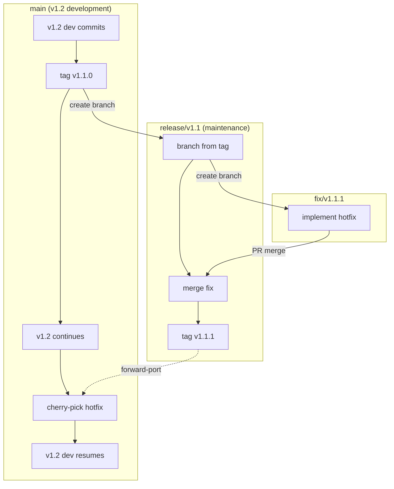
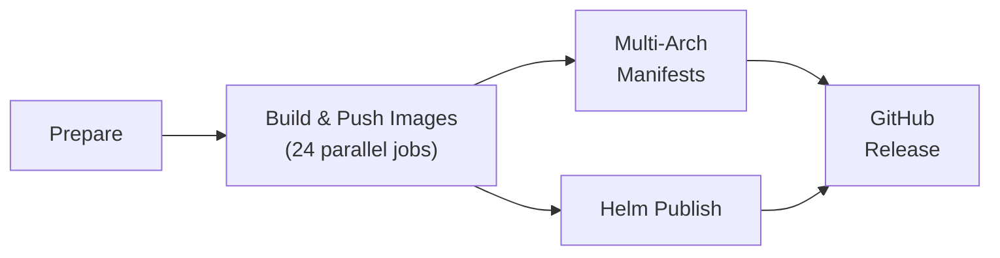

# Kubernaut Release Guide

This guide is the authoritative runbook for cutting Kubernaut releases. It covers
the full lifecycle: release candidates, GA promotion, hotfixes, and recovery
procedures.

**Source of truth for the CI pipeline**: [`.github/workflows/release.yml`](../../../.github/workflows/release.yml)

---

## Table of Contents

1. [Prerequisites](#prerequisites)
2. [Versioning Scheme](#versioning-scheme)
3. [Release Candidate (RC) Workflow](#release-candidate-rc-workflow)
4. [GA Release Workflow](#ga-release-workflow)
5. [Hotfix / Patch Release Workflow](#hotfix--patch-release-workflow)
6. [Release Pipeline Stages](#release-pipeline-stages)
7. [Verification Checklist](#verification-checklist)
8. [Milestone Closure](#milestone-closure)
9. [Recovery Procedures](#recovery-procedures)
10. [Appendix: Services and Build Details](#appendix-services-and-build-details)

---

## Prerequisites

Before performing any release, ensure:

- You have **push access** to the repository (tags are not blocked by branch protection).
- The GitHub Actions secrets `QUAY_ROBOT_USERNAME` and `QUAY_ROBOT_TOKEN` are set.
  Verify with:
  ```bash
  gh secret list --repo jordigilh/kubernaut
  ```
- You have `gh`, `helm`, and `skopeo` installed locally for verification steps.
- You are on an up-to-date `main` branch:
  ```bash
  git checkout main && git pull origin main
  ```

---

## Versioning Scheme

Kubernaut follows [Semantic Versioning](https://semver.org/):

| Format | Example | GitHub Release | `:latest` tag |
|--------|---------|----------------|---------------|
| `vMAJOR.MINOR.PATCH` | `v1.1.0` | Stable | Yes |
| `vMAJOR.MINOR.PATCH-rcN` | `v1.1.0-rc3` | Pre-release | No |
| `vMAJOR.MINOR.PATCH-alphaN` | `v1.2.0-alpha1` | Pre-release | No |

Key behaviors driven by the `is_prerelease` flag in the release workflow:

- **Pre-release tags** (`-rc`, `-alpha`, `-beta`): GitHub Release is marked as pre-release;
  images are **not** tagged as `:latest`.
- **Stable tags**: GitHub Release is marked as stable (shown as "Latest");
  images **are** tagged as `:latest`.

The `v` prefix is stripped for image tags and Helm chart versions
(e.g., git tag `v1.1.0` produces images tagged `1.1.0` and chart version `1.1.0`).

---

## Release Candidate (RC) Workflow

Use this workflow when shipping incremental pre-release builds for testing.

### Step 1: Create a fix branch

Branch from `main` with the naming convention `fix/vX.Y.Z-rcN`:

```bash
git checkout main && git pull origin main
git checkout -b fix/v1.1.0-rc5
```

### Step 2: Make changes, commit, push

Commit fixes in logical groups, then push and open a PR targeting `main`:

```bash
git push -u origin fix/v1.1.0-rc5
gh pr create --title "fix: v1.1.0-rc5" --body "..."
```

### Step 3: Merge the PR

Wait for CI (Lint + Test Suite Summary) to pass, then merge. **Do not delete the
branch yet** — you will need the merge commit SHA.

### Step 4: Tag the merge commit

Always tag the **merge commit on `main`**, not a branch commit:

```bash
git checkout main && git pull origin main
MERGE_SHA=$(git log --oneline -1 --format='%H')
git tag -a v1.1.0-rc5 "$MERGE_SHA" -m "v1.1.0-rc5"
git push origin v1.1.0-rc5
```

### Step 5: Monitor the release workflow

```bash
gh run list --workflow=release.yml --limit 1
gh run watch          # interactive monitoring
```

Or visit **Actions > Release** in the GitHub UI.

### Step 6: Verify

Follow the [Verification Checklist](#verification-checklist) — skip the `:latest`
tag check (RCs do not update `:latest`).

---

## GA Release Workflow

Use this workflow when promoting a tested RC to a stable release.

### Step 1: Verify all milestone issues are closed

```bash
gh issue list --milestone "vX.Y" --state open
```

If any issues remain open:
- **Already fixed**: close them with a comment linking the fixing commit.
- **Not fixed**: move them to the next milestone.

### Step 2: Create a release branch

```bash
git checkout main && git pull origin main
git checkout -b release/vX.Y.0
```

### Step 3: Bump Chart.yaml

Update `version` and `appVersion` to the GA version (remove any RC suffix):

```bash
# charts/kubernaut/Chart.yaml
version: X.Y.0
appVersion: "X.Y.0"
```

> **Why bump Chart.yaml here?** The release workflow uses `sed` to overwrite these
> fields from the git tag, but committing the correct version ensures the chart is
> accurate in the repository even outside of CI (e.g., `helm template` from a
> local checkout).

### Step 4: Stamp CHANGELOG.md

Replace the placeholder date with today's date:

```markdown
## [X.Y.0] - YYYY-MM-DD
```

Ensure the comparison link at the bottom of the file is correct:

```markdown
[X.Y.0]: https://github.com/jordigilh/kubernaut/compare/vPREVIOUS...vX.Y.0
```

### Step 5: Commit, push, and open PR

```bash
git add charts/kubernaut/Chart.yaml CHANGELOG.md
git commit -m "release: prepare v1.1.0 GA"
git push -u origin release/vX.Y.0
gh pr create --title "release: vX.Y.0 GA" --body "..."
```

### Step 6: Merge the PR

Wait for CI to pass, then merge. Record the merge commit SHA.

### Step 7: Tag the merge commit

```bash
git checkout main && git pull origin main
MERGE_SHA=$(git log --oneline -1 --format='%H')
git tag -a vX.Y.0 "$MERGE_SHA" -m "vX.Y.0"
git push origin vX.Y.0
```

### Step 8: Monitor the release workflow

```bash
gh run list --workflow=release.yml --limit 1
gh run watch
```

Expected duration: ~60–90 minutes (24 image builds + manifests + Helm + GitHub Release).

### Step 9: Verify

Follow the full [Verification Checklist](#verification-checklist), including
the `:latest` tag check (GA releases update `:latest`).

### Step 10: Close the milestone

See [Milestone Closure](#milestone-closure).

---

## Hotfix / Patch Release Workflow

Use this workflow for critical fixes against a released version (e.g., v1.1.1
fixing a bug in v1.1.0) while `main` has moved on to the next minor (v1.2).

### Branching model



Key concepts:
- The **tag** (`v1.1.0`) is the permanent reference point. No maintenance branch
  is needed until a hotfix is required.
- The **maintenance branch** (`release/v1.1`) is created from the tag only when
  the first hotfix is needed. Subsequent patches (v1.1.2, v1.1.3) reuse it.
- Fixes must be **forward-ported** to `main` so the next minor also includes them.

### Step 1: Create the maintenance branch (first patch only)

If `release/v1.1` does not already exist, create it from the GA tag:

```bash
git fetch origin
git checkout -b release/v1.1 v1.1.0
git push -u origin release/v1.1
```

For subsequent patches (v1.1.2+), just check out the existing branch:

```bash
git checkout release/v1.1 && git pull origin release/v1.1
```

### Step 2: Create a fix branch from the maintenance branch

```bash
git checkout -b fix/v1.1.1 release/v1.1
```

### Step 3: Apply the fix

If the fix already exists on `main`, cherry-pick it:

```bash
git cherry-pick <commit-sha>
```

If it conflicts, resolve manually. If the fix does not exist yet, implement it
directly on the fix branch following TDD.

### Step 4: Bump Chart.yaml and CHANGELOG

- `Chart.yaml`: set `version: 1.1.1` and `appVersion: "1.1.1"`
- `CHANGELOG.md`: add a `## [1.1.1] - YYYY-MM-DD` section **above** the
  `[1.1.0]` entry. Add the comparison link:
  ```markdown
  [1.1.1]: https://github.com/jordigilh/kubernaut/compare/v1.1.0...v1.1.1
  ```

### Step 5: Push and open PR targeting the maintenance branch

```bash
git push -u origin fix/v1.1.1
gh pr create --base release/v1.1 --title "fix: v1.1.1" --body "..."
```

> **Important**: the PR base is `release/v1.1`, not `main`.

### Step 6: Merge the PR

Wait for CI to pass, then merge. Record the merge commit SHA.

### Step 7: Tag the merge commit on the maintenance branch

```bash
git checkout release/v1.1 && git pull origin release/v1.1
MERGE_SHA=$(git log --oneline -1 --format='%H')
git tag -a v1.1.1 "$MERGE_SHA" -m "v1.1.1"
git push origin v1.1.1
```

This triggers the release workflow. Since `1.1.1` has no pre-release suffix, it is
treated as a stable release and `:latest` tags will be updated.

### Step 8: Monitor and verify

```bash
gh run list --workflow=release.yml --limit 1
gh run watch
```

Follow the full [Verification Checklist](#verification-checklist), including
`:latest` tags.

### Step 9: Forward-port the fix to `main`

This step ensures the next minor release (v1.2) also includes the hotfix:

```bash
git checkout main && git pull origin main
git cherry-pick <fix-commit-sha>
```

If the cherry-pick conflicts (e.g., the code around the fix has changed on `main`),
open a PR instead:

```bash
git checkout -b forward-port/v1.1.1 main
git cherry-pick --no-commit <fix-commit-sha>
# resolve conflicts
git commit -m "fix: forward-port v1.1.1 hotfix to main"
git push -u origin forward-port/v1.1.1
gh pr create --title "fix: forward-port v1.1.1 to main" --body "..."
```

> **Do not skip this step.** Without forward-porting, the fix will be missing from
> v1.2 and will regress when users upgrade.

---

## Release Pipeline Stages

The release workflow (`.github/workflows/release.yml`) has 5 stages:



### Stage 0: Prepare

Extracts version metadata from the git tag and sets outputs consumed by all
downstream jobs:
- `version` — semver without `v` prefix (e.g., `1.1.0`)
- `tag` — full git tag (e.g., `v1.1.0`)
- `build_date` — UTC timestamp
- `is_prerelease` — `true` if tag contains `-rc`, `-alpha`, or `-beta`

### Stage 1: Build & Push Images

Runs **24 parallel jobs**: 12 services x 2 architectures (amd64, arm64).

Each job:
1. Checks out code (with submodules)
2. Runs `make generate` for code generation
3. Installs QEMU (arm64 jobs only)
4. Logs in to Quay.io
5. Builds the image via `make image-build-<service>`
6. Pushes `quay.io/kubernaut-ai/<service>:<version>-<arch>`

Build strategy:
- **Go services (10)**: `CGO_ENABLED=0` cross-compilation via `GOARCH` (native speed).
  Builder: `ubi10/go-toolset`, runtime: `ubi10/ubi-minimal`.
- **Python (1)**: holmesgpt-api uses `ubi10/python-312`. Full QEMU for arm64.
- **Bash (1)**: must-gather uses `ubi10/ubi` with kubectl and jq. Full QEMU for arm64.

### Stage 2: Multi-Arch Manifests

After all 24 build jobs complete:
1. Creates manifest lists so a single tag resolves to the correct arch automatically.
2. **GA only** (`is_prerelease == false`): tags every image as `:latest`.

### Stage 3: Helm Chart Publish

1. Overwrites `Chart.yaml` with the release version (from git tag).
2. Syncs demo content from `kubernaut-demo-scenarios`.
3. Packages and pushes to `oci://quay.io/kubernaut-ai/charts`.

### Stage 4: GitHub Release

Creates a GitHub Release with auto-generated notes.
- **Pre-release tags**: marked as pre-release.
- **Stable tags**: marked as "Latest".

---

## Verification Checklist

Run these checks after the release workflow completes.

### Images (all releases)

Confirm all 12 images exist with the correct multi-arch manifest:

```bash
VERSION="1.1.0"  # adjust to your release
for svc in gateway signalprocessing aianalysis authwebhook \
           remediationorchestrator workflowexecution notification \
           datastorage effectivenessmonitor holmesgpt-api must-gather db-migrate; do
  echo -n "$svc: "
  skopeo inspect --raw docker://quay.io/kubernaut-ai/$svc:$VERSION \
    | python3 -c "import sys,json; m=json.load(sys.stdin); print(f'{len(m.get(\"manifests\",[]))} arch(es)')" \
    2>/dev/null || echo "MISSING"
done
```

Expected output: `2 arch(es)` for every service.

### Helm Chart (all releases)

```bash
helm show chart oci://quay.io/kubernaut-ai/charts/kubernaut --version $VERSION
```

Verify `version` and `appVersion` match.

### GitHub Release (all releases)

```bash
gh release view v$VERSION
```

Verify the release exists and the pre-release flag matches expectations.

### `:latest` tag (GA releases only)

```bash
for svc in gateway signalprocessing aianalysis authwebhook \
           remediationorchestrator workflowexecution notification \
           datastorage effectivenessmonitor holmesgpt-api must-gather db-migrate; do
  echo -n "$svc:latest -> "
  skopeo inspect docker://quay.io/kubernaut-ai/$svc:latest \
    | python3 -c "import sys,json; d=json.load(sys.stdin); print(d.get('Labels',{}).get('org.opencontainers.image.version','unknown'))" \
    2>/dev/null || echo "MISSING"
done
```

Expected output: every service reports the GA version (e.g., `1.1.0`).

### Install smoke test (optional)

```bash
helm install kubernaut oci://quay.io/kubernaut-ai/charts/kubernaut \
  --version $VERSION --namespace kubernaut-system --create-namespace --dry-run
```

---

## Milestone Closure

After a GA release ships and verification passes:

### 1. Verify all issues are closed

```bash
gh issue list --milestone "vX.Y" --state open
```

Close any remaining issues that were addressed, or move unresolved ones to the next
milestone.

### 2. Close the milestone

```bash
MILESTONE_NUMBER=$(gh api repos/jordigilh/kubernaut/milestones \
  --jq '.[] | select(.title=="vX.Y") | .number')
gh api --method PATCH repos/jordigilh/kubernaut/milestones/$MILESTONE_NUMBER \
  -f state=closed
```

### 3. Announce

Notify the team that the release is available. Include:
- GitHub Release link
- Helm install command
- Link to CHANGELOG entry

---

## Recovery Procedures

### Failed image build (one or more jobs)

Individual build failures do not block other services (`fail-fast: false`).

1. Identify the failed job(s) in the GitHub Actions run.
2. Check the logs for the root cause (QEMU issues, network timeouts, etc.).
3. Re-run only the failed job(s):
   ```bash
   gh run rerun <run-id> --failed
   ```

### Partial release (manifests created, Helm failed)

The `helm-publish` job depends on `build-image` but not on `create-manifests`.
If Helm publish fails:

1. Verify robot account permissions on Quay.io (`Creator` role required).
2. Re-run only the failed job:
   ```bash
   gh run rerun <run-id> --job <job-id>
   ```

### Tag conflict (release already exists)

If the GitHub Release creation fails because a release with the same tag already
exists (e.g., from a manual creation):

1. Delete the manually created release (**keep the tag**):
   ```bash
   gh release delete v1.1.0 --yes
   ```
2. Re-run only the "Create GitHub Release" job:
   ```bash
   gh run rerun <run-id> --job <job-id>
   ```

> **Do not** delete and re-push the tag. The tag must remain pointing at the original
> commit to ensure all images and the Helm chart reference the same commit SHA.

### Wrong commit tagged

If you tagged the wrong commit and the workflow has **not yet started**:

```bash
git tag -d v1.1.0
git push origin :refs/tags/v1.1.0
# Now tag the correct commit
git tag -a v1.1.0 <correct-sha> -m "v1.1.0"
git push origin v1.1.0
```

If the workflow **has already run**, you must also:
1. Delete the GitHub Release: `gh release delete v1.1.0 --yes`
2. Delete the tag remotely: `git push origin :refs/tags/v1.1.0`
3. Delete all pushed images for that version (via Quay.io UI or API).
4. Re-tag and re-push.

---

## Appendix: Services and Build Details

### Container Images (12 services)

All images are published to `quay.io/kubernaut-ai/<service>:<version>` as
multi-arch manifests (amd64 + arm64).

| # | Service | Language | Dockerfile |
|---|---------|----------|-----------|
| 1 | gateway | Go | `docker/gateway.Dockerfile` |
| 2 | signalprocessing | Go | `docker/signalprocessing-controller.Dockerfile` |
| 3 | aianalysis | Go | `docker/aianalysis.Dockerfile` |
| 4 | authwebhook | Go | `docker/authwebhook.Dockerfile` |
| 5 | remediationorchestrator | Go | `docker/remediationorchestrator-controller.Dockerfile` |
| 6 | workflowexecution | Go | `docker/workflowexecution-controller.Dockerfile` |
| 7 | notification | Go | `docker/notification-controller.Dockerfile` |
| 8 | datastorage | Go | `docker/data-storage.Dockerfile` |
| 9 | effectivenessmonitor | Go | `docker/effectivenessmonitor-controller.Dockerfile` |
| 10 | holmesgpt-api | Python | `holmesgpt-api/Dockerfile` |
| 11 | must-gather | Bash | `cmd/must-gather/Dockerfile` |
| 12 | db-migrate | Go | `docker/db-migrate.Dockerfile` |

`mock-llm` is **not** released — it is a test-only artifact.

### Helm Chart

Published to `oci://quay.io/kubernaut-ai/charts/kubernaut`. The chart's `version`
and `appVersion` are set from the git tag automatically during the release workflow.

Install with:

```bash
helm install kubernaut oci://quay.io/kubernaut-ai/charts/kubernaut --version <version>
```

### Version Injection

Every released image carries build-time version metadata:

1. The release workflow extracts `version`, `build_date`, and `github.sha` from
   the git tag.
2. These are passed as `APP_VERSION`, `GIT_COMMIT`, `BUILD_DATE` to
   `make image-build`.
3. The Makefile forwards them as `--build-arg` to each `podman build`.
4. **Go services**: injected via `-ldflags` into `internal/version` package
   (`Version`, `GitCommit`, `BuildDate`). Logged at startup.
5. **All images**: set as OCI labels (`org.opencontainers.image.version`,
   `org.opencontainers.image.revision`, `org.opencontainers.image.created`,
   `org.opencontainers.image.source`, `org.opencontainers.image.title`).

### Build Strategy

- **Go services**: `CGO_ENABLED=0` cross-compilation via `GOARCH`. Builder stage
  uses `ubi10/go-toolset`, runtime uses `ubi10/ubi-minimal`.
- **Python** (holmesgpt-api): `ubi10/python-312` for both builder and runtime.
- **must-gather**: `ubi10/ubi` base with kubectl and jq.
- **arm64 on amd64 runner**: QEMU user-space emulation. Go cross-compiles natively;
  QEMU handles the container base layer and non-Go build steps.

---

## Related

- [`.github/workflows/release.yml`](../../../.github/workflows/release.yml) — Release workflow source
- [`Makefile`](../../../Makefile) — `image-build`, `image-push`, `image-manifest` targets
- [`CHANGELOG.md`](../../../CHANGELOG.md) — Release history
- Issue [#80](https://github.com/jordigilh/kubernaut/issues/80) — Release: Helm chart creation, multi-arch images
- Issue [#257](https://github.com/jordigilh/kubernaut/issues/257) — Multi-arch image build + Helm OCI publish workflow
- Issue [#273](https://github.com/jordigilh/kubernaut/issues/273) — Standardize version injection and OCI labels
