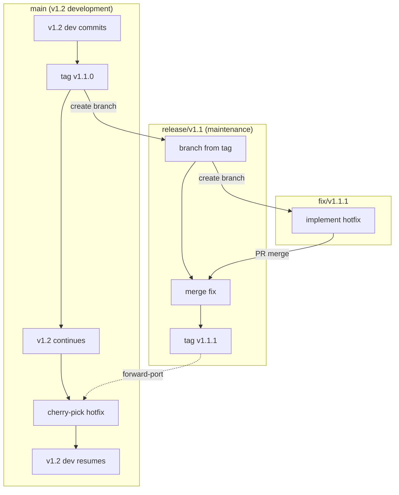

# Kubernaut Release Guide

This guide is the authoritative runbook for cutting Kubernaut releases. It covers
the full lifecycle: release candidates, GA promotion, hotfixes, and recovery
procedures.

**Source of truth for the CI pipeline**: [`.github/workflows/release.yml`](../../../.github/workflows/release.yml)

---

## Table of Contents

1. [Prerequisites](#prerequisites)
2. [Versioning Scheme](#versioning-scheme)
3. [Release Candidate (RC) Workflow](#release-candidate-rc-workflow)
4. [GA Release Workflow](#ga-release-workflow)
5. [Hotfix / Patch Release Workflow](#hotfix--patch-release-workflow)
6. [Database Migrations](#database-migrations)
7. [Release Pipeline Stages](#release-pipeline-stages)
8. [Verification Checklist](#verification-checklist)
9. [Milestone Closure](#milestone-closure)
10. [Recovery Procedures](#recovery-procedures)
11. [Appendix: Services and Build Details](#appendix-services-and-build-details)

---

## Prerequisites

Before performing any release, ensure:

- You have **push access** to the repository (tags are not blocked by branch protection).
- The GitHub Actions secrets `QUAY_ROBOT_USERNAME` and `QUAY_ROBOT_TOKEN` are set.
  Verify with:
  ```bash
  gh secret list --repo jordigilh/kubernaut
  ```
- You have `gh`, `helm`, and `skopeo` installed locally for verification steps.
- You are on an up-to-date `main` branch:
  ```bash
  git checkout main && git pull origin main
  ```

---

## Versioning Scheme

Kubernaut follows [Semantic Versioning](https://semver.org/):

| Format | Example | GitHub Release | `:latest` tag |
|--------|---------|----------------|---------------|
| `vMAJOR.MINOR.PATCH` | `v1.1.0` | Stable | Yes |
| `vMAJOR.MINOR.PATCH-rcN` | `v1.1.0-rc3` | Pre-release | No |
| `vMAJOR.MINOR.PATCH-alphaN` | `v1.2.0-alpha1` | Pre-release | No |

Key behaviors driven by the `is_prerelease` flag in the release workflow:

- **Pre-release tags** (`-rc`, `-alpha`, `-beta`): GitHub Release is marked as pre-release;
  images are **not** tagged as `:latest`.
- **Stable tags**: GitHub Release is marked as stable (shown as "Latest");
  images **are** tagged as `:latest`.

The `v` prefix is stripped for image tags and Helm chart versions
(e.g., git tag `v1.1.0` produces images tagged `1.1.0` and chart version `1.1.0`).

### Chart Version vs App Version

The Helm chart has two independent version fields:

- **`version`** (chart packaging version) — tracked in the `CHART_VERSION` file at repo root.
  Bumped for any chart change (values, templates, schema) regardless of operator changes.
- **`appVersion`** (operator binary version) — tracked in the `VERSION` file at repo root.
  Bumped only for operator/Go code changes.

**When to bump each:**

| Change type | `VERSION` | `CHART_VERSION` | Tag | Workflow |
|-------------|-----------|-----------------|-----|----------|
| Operator release | Bump | Bump (match) | `v1.5.0` | `release.yml` (full) |
| Chart-only fix | No change | Bump | `chart-v1.4.1` | `chart-release.yml` (chart only) |

`make sync-version` reads both files and propagates them to `Chart.yaml` independently.

---

## Release Candidate (RC) Workflow

Use this workflow when shipping incremental pre-release builds for testing.

### Step 1: Create a fix branch

Branch from `main` with the naming convention `fix/vX.Y.Z-rcN`:

```bash
git checkout main && git pull origin main
git checkout -b fix/v1.1.0-rc5
```

### Step 2: Make changes, commit, push

Commit fixes in logical groups, then push and open a PR targeting `main`:

```bash
git push -u origin fix/v1.1.0-rc5
gh pr create --title "fix: v1.1.0-rc5" --body "..."
```

### Step 3: Merge the PR

Wait for CI (Lint + Test Suite Summary) to pass, then merge. **Do not delete the
branch yet** — you will need the merge commit SHA.

### Step 4: Tag the merge commit

Always tag the **merge commit on `main`**, not a branch commit:

```bash
git checkout main && git pull origin main
MERGE_SHA=$(git log --oneline -1 --format='%H')
git tag -a v1.1.0-rc5 "$MERGE_SHA" -m "v1.1.0-rc5"
git push origin v1.1.0-rc5
```

### Step 5: Monitor the release workflow

```bash
gh run list --workflow=release.yml --limit 1
gh run watch          # interactive monitoring
```

Or visit **Actions > Release** in the GitHub UI.

### Step 6: Verify

Follow the [Verification Checklist](#verification-checklist) — skip the `:latest`
tag check (RCs do not update `:latest`).

---

## GA Release Workflow

Use this workflow when promoting a tested RC to a stable release.

### Step 1: Verify all milestone issues are closed

```bash
gh issue list --milestone "vX.Y" --state open
```

If any issues remain open:
- **Already fixed**: close them with a comment linking the fixing commit.
- **Not fixed**: move them to the next milestone.

### Step 2: Create a release branch

```bash
git checkout main && git pull origin main
git checkout -b release/vX.Y.0
```

### Step 3: Bump version files

Update both `VERSION` and `CHART_VERSION` at repo root to the GA version:

```bash
echo "X.Y.0" > VERSION
echo "X.Y.0" > CHART_VERSION
```

Then run `make sync-version` to propagate to `Chart.yaml` (sets `version` from
`CHART_VERSION` and `appVersion` from `VERSION`).

> **Why bump here?** The release workflow overwrites these fields from the git tag
> and `CHART_VERSION` file, but committing the correct values ensures the chart is
> accurate in the repository even outside of CI (e.g., `helm template` from a
> local checkout).

### Step 4: Stamp CHANGELOG.md

Replace the placeholder date with today's date:

```markdown
## [X.Y.0] - YYYY-MM-DD
```

Ensure the comparison link at the bottom of the file is correct:

```markdown
[X.Y.0]: https://github.com/jordigilh/kubernaut/compare/vPREVIOUS...vX.Y.0
```

### Step 5: Commit, push, and open PR

```bash
git add charts/kubernaut/Chart.yaml CHANGELOG.md
git commit -m "release: prepare v1.1.0 GA"
git push -u origin release/vX.Y.0
gh pr create --title "release: vX.Y.0 GA" --body "..."
```

### Step 6: Merge the PR

Wait for CI to pass, then merge. Record the merge commit SHA.

### Step 7: Tag the merge commit

```bash
git checkout main && git pull origin main
MERGE_SHA=$(git log --oneline -1 --format='%H')
git tag -a vX.Y.0 "$MERGE_SHA" -m "vX.Y.0"
git push origin vX.Y.0
```

### Step 8: Monitor the release workflow

```bash
gh run list --workflow=release.yml --limit 1
gh run watch
```

Expected duration: budget at least 90 minutes — 28 image builds, CVE scans,
two rounds of Helm smoke tests, signing/attestation, SLSA provenance, and the
GitHub Release all have to complete in sequence or in gated parallel. This
number is a floor, not a measured average; treat it as "don't panic before
this," not an SLA.

### Step 9: Verify

Follow the full [Verification Checklist](#verification-checklist), including
the `:latest` tag check (GA releases update `:latest`).

### Step 10: Close the milestone

See [Milestone Closure](#milestone-closure).

---

## Hotfix / Patch Release Workflow

Use this workflow for critical fixes against a released version.

### Branching model


```mermaid
flowchart TD
  subgraph mainBranch ["main (v1.2 development)"]
    M1["v1.2 dev commits"] --> M2["tag v1.1.0"]
    M2 --> M3["v1.2 continues"]
    M3 --> M4["cherry-pick hotfix"]
    M4 --> M5["v1.2 dev resumes"]
  end

  subgraph maintBranch ["release/v1.1 (maintenance)"]
    R1["branch from tag"] --> R2["merge fix"]
    R2 --> R3["tag v1.1.1"]
  end

  subgraph fixBranch ["fix/v1.1.1"]
    F1["implement hotfix"]
  end

  M2 -- "create branch" --> R1
  R1 -- "create branch" --> F1
  F1 -- "PR merge" --> R2
  R3 -. "forward-port" .-> M4
```

Key concepts:
- The **tag** (`v1.1.0`) is the permanent reference point. No maintenance branch
  is needed until a hotfix is required.
- The **maintenance branch** (`release/v1.1`) is created from the tag only when
  the first hotfix is needed. Subsequent patches (v1.1.2, v1.1.3) reuse it.
- Fixes must be **forward-ported** to `main` so the next minor also includes them.

### Step 1: Create the maintenance branch (first patch only)

If `release/vX.Y` does not already exist, create it from the GA tag — **not**
from `main`, which may have diverged significantly since the tag was cut:

```bash
git fetch --tags origin
git checkout -b release/vX.Y vX.Y.0
git push -u origin release/vX.Y
```

If `release/vX.Y` already exists (from a previous patch), skip this step and
pull it instead: `git checkout release/vX.Y && git pull origin release/vX.Y`.

### Step 1a: Add Dependabot coverage (first patch only)

Dependabot's `target-branch` option does not support wildcards
([dependabot/dependabot-core#6890](https://github.com/dependabot/dependabot-core/issues/6890)
is still open), so `.github/dependabot.yml` cannot express "all `release/**`
branches" the way `ci-pipeline.yml`/`codeql.yml` do. Each actively maintained
maintenance branch needs its own explicit `updates:` block per ecosystem
(gomod, github-actions, docker).

When you create a new `release/vX.Y` maintenance branch (Step 1 above), add
three new blocks to `.github/dependabot.yml` — copy the existing
`release/v1.5` blocks and change `target-branch` and the commit-message
suffix to match the new branch (e.g. `deps(vX.Y)`).

When a maintenance branch stops receiving patches (superseded by a newer
minor, or end-of-support), remove its three blocks from `dependabot.yml` in
the same PR that declares it retired — leaving stale blocks around just
generates PRs against a branch nobody merges.

Note: any `updates:` entry with a non-default `target-branch` is excluded
from Dependabot's security-update PRs (those always target the default
branch, `main`), so maintenance branches only get scheduled version updates
via this config, not the separate security-alert flow.

### Step 2: Create the fix branch from the maintenance branch

```bash
git checkout release/vX.Y
git checkout -b fix/vX.Y.Z
```

### Step 3: Cherry-pick or implement the fix

If the fix already exists as a commit on `main` (e.g., landed there first),
try to cherry-pick it:

```bash
git cherry-pick <commit-sha>
```

If the maintenance branch has diverged structurally from `main` (moved/renamed
files, refactors that postdate the tag), the cherry-pick will conflict or
silently apply against the wrong code shape. In that case, hand-port the fix:
re-implement the same behavioral change directly against the code as it exists
on the maintenance branch, following TDD. Always diff the result conceptually
against the original commit to confirm the fix is equivalent in intent.

### Step 4: Bump Chart.yaml and CHANGELOG

Update `Chart.yaml` to the patch version. Add a CHANGELOG entry under a new
`## [X.Y.Z]` section above the previous release.

### Step 5: PR, merge, tag

Open the PR against the **maintenance branch** (`release/vX.Y`), not `main`.
Otherwise follow the same PR → merge → tag flow as the
[GA Release Workflow](#ga-release-workflow), substituting the patch version.
Once merged and tagged, forward-port the fix to `main` (via cherry-pick or a
follow-up PR) unless it already originated there.

---

## Database Migrations

Kubernaut uses [Goose](https://github.com/pressly/goose) for database migrations
(DD-012). The Helm `post-install`/`post-upgrade` hook runs `goose up` to apply
pending migrations. This section documents the release-time steps that keep the
migration chain clean.

### Minor Release: Squash Dev Incrementals

During development, schema changes are added as numbered goose files in
`migrations/` (e.g., `002_add_foo.sql`, `003_alter_bar.sql`). At release time,
squash them into a single delta file.

**Procedure** (performed on the release branch before tagging):

1. **Identify dev incrementals** — all migration files added since the last release
   baseline. For example, if `001_v1_schema.sql` was the v1.0 baseline:
   ```bash
   ls migrations/  # identify 002_*, 003_*, etc.
   ```

2. **Create the squashed delta file** — combine the Up sections of all dev
   incrementals into a single file named `002_vX.Y_schema.sql`:
   ```bash
   # Example for v1.2:
   # Combine 002 + 003 into a single 002_v1.2_schema.sql
   # Ensure -- +goose Up / -- +goose Down sections are correct
   ```
   The Up section should contain all DDL from the dev incrementals in order.
   The Down section should reverse them in reverse order.

3. **Archive the originals**:
   ```bash
   mkdir -p migrations/vX.Y-dev-archived
   mv migrations/002_add_service_account_name.sql migrations/vX.Y-dev-archived/
   mv migrations/003_capitalize_catalog_status.sql migrations/vX.Y-dev-archived/
   ```

4. **Validate the chain**:
   ```bash
   # Against a fresh database:
   goose -dir migrations postgres "$GOOSE_DBSTRING" up
   goose -dir migrations postgres "$GOOSE_DBSTRING" status

   # Against an existing database (upgrade path):
   # goose will skip already-applied versions and apply only the new squashed file
   ```

5. **Commit** the squashed file and archive in the release PR.

**Why squash?** Fresh installs apply fewer files. The `migrations/` root stays
compact. The archived originals preserve development history.

**Safety**: Existing databases that applied the original dev incrementals
individually will not re-apply the squashed file — goose skips already-applied
version numbers regardless of file content changes. The upgrade path is safe.

### Major Release: Create Baseline (Future)

At a major version boundary (e.g., v1.x → v2.0), consolidate all migrations into
a single baseline file for fresh installs:

```
migrations/
  001_v1_schema.sql          # kept for v1.x → v2.0 upgrade path
  002_v1.2_schema.sql        # kept for upgrade path
  baseline_v2_schema.sql     # fresh-install-only: full schema at v2.0
```

The Helm migration hook will detect fresh vs. upgrade by checking for the
`goose_db_version` table:
- **Fresh install**: apply baseline only (no version tracking needed)
- **Upgrade**: apply only pending numbered migrations via `goose up`

> This detection logic is scaffolded in the migration job template but not active
> until the first major release that introduces a baseline file.

### Key Rules

1. **Never modify an already-applied migration** — always add a new file
2. **Squash at release time** — dev incrementals become a single delta per minor
3. **Baseline at major version** — consolidate for fresh installs
4. **Archive, don't delete** — originals go to `migrations/vX.Y-dev-archived/`
5. **Validate both paths** — test fresh install and upgrade before tagging

### Reference

- Design decision: [DD-012](../../architecture/decisions/DD-012-goose-database-migration-management.md)
- Migration files: [`migrations/`](../../../migrations/)
- Helm hook: [`charts/kubernaut/templates/hooks/migration-job.yaml`](../../../charts/kubernaut/templates/hooks/migration-job.yaml)

---

## Release Pipeline Stages

The release workflow (`.github/workflows/release.yml`) is a lot more than
build-and-publish at this point — CVE scanning, Helm smoke tests, Cosign
signing, and SLSA provenance all gate the release now, not just the image
builds:

0. **Prepare** — extract version metadata from the tag.
1. **Build & Push Images** — 28 jobs (14 services × 2 arch).
2. **Security Scan** — Trivy + SBOM, one job per image per arch.
3. **Helm Smoke Test** — Kind cluster, both TLS modes, amd64 images only.
4. **Multi-Arch Manifests** — needs stage 1 (both arches) + stage 3; tags `:latest` on GA.
5. **Sign & Attest / SLSA Provenance** — needs stage 4 + stage 2 (both arches).
6. **Helm Chart Publish** — needs stage 1 (both arches) + stage 3; runs in parallel with stage 5.
7. **GitHub Release** — needs everything above; attaches SBOMs and provenance bundles.

Security scanning and Helm smoke tests both gate the release: a failing scan
or smoke test blocks the GitHub Release from being created.

### Stage 0: Prepare

Extracts version metadata from the git tag and sets outputs consumed by all
downstream jobs:
- `version` — semver without `v` prefix (e.g., `1.1.0`)
- `tag` — full git tag (e.g., `v1.1.0`)
- `build_date` — UTC timestamp
- `is_prerelease` — `true` if tag contains `-rc`, `-alpha`, or `-beta`

### Stage 1: Build & Push Images

**28 parallel jobs**: 14 services x 2 architectures (amd64, arm64).

Each job:
1. Checks out code (with submodules)
2. Runs `make generate` for code generation
3. Logs in to Quay.io
4. Builds the image and pushes `quay.io/kubernaut-ai/<service>:<version>-<arch>`

Three build paths, depending on the service:
- **12 Go services** (everything except `must-gather` and `db-migrate`): no
  QEMU on either arch. amd64 builds the full multi-stage Dockerfile
  (`docker/<service>.Dockerfile`, `ubi10/go-toolset` → `ubi10/ubi-minimal`);
  arm64 cross-compiles the binary natively (`GOARCH=arm64`, no emulation) and
  drops it into a `scratch` runtime image (`docker/<service>.runtime.Dockerfile`)
  — that's why arm64 builds for these are minutes, not tens of minutes.
- **must-gather** (Bash) and **db-migrate** (shell/goose CLI): still need QEMU
  on arm64 — there's no Go binary to cross-compile around, so the arm64 image
  is built under full user-space emulation.

### Stage 2: Security Scan (Trivy + SBOM)

Runs once per image per arch (28 jobs, same matrix as the build stage), after
that arch's build completes. Each job:
1. Scans the pushed image with Trivy — a CRITICAL/HIGH CVE with a fix
   available blocks the release. `must-gather` has a standing, time-bound
   `.trivyignore` for kubectl CVEs with no upstream fix yet (DD-PLATFORM-003).
2. Generates a CycloneDX SBOM, uploaded as a workflow artifact for the
   sign-and-attest and release stages to pick up later.

### Stage 3: Helm Smoke Test

Depends only on the amd64 build (arm64 keeps building in parallel and isn't
blocked by this). Spins up a Kind cluster, pulls the amd64 images, and runs
the full Helm smoke test suite twice — once with hook-based TLS, once with
cert-manager — since both are supported install modes and #334 burned us
once for only covering the default. A failing smoke test blocks the release.

### Stage 4: Multi-Arch Manifests

Needs both build stages *and* the smoke tests to pass. For each service:
1. Creates a manifest list so a single tag resolves to the correct arch automatically.
2. **GA only** (`is_prerelease == false`): tags the manifest as `:latest`.

### Stage 5: Sign & Attest / SLSA Provenance

Needs the manifests plus both security-scan stages. Two jobs run per service:
- **Cosign sign & attest**: keyless-signs the amd64 image, arm64 image, and
  the manifest list (GitHub OIDC, no stored keys), then attests each arch's
  SBOM against its own digest.
- **SLSA provenance**: generates SLSA v1.0 Build L3 provenance via an
  isolated reusable workflow (`slsa-provenance.yml`), run as a separate job so
  its OIDC signer identity can't be influenced by this workflow — that's what
  makes it Build L3 (non-falsifiable) instead of self-asserted Build L2
  (issue #1109).

### Stage 6: Helm Chart Publish

Runs in parallel with signing/provenance (same dependencies: both build
stages + smoke tests).

1. Reads chart version from `CHART_VERSION` and app version from the git tag.
2. Overwrites `Chart.yaml`'s `version` and `appVersion` accordingly.
3. Packages and pushes to `oci://quay.io/kubernaut-ai/charts`.

For chart-only releases (tag `chart-v*`), a separate `chart-release.yml`
workflow handles publishing without building container images.

### Stage 7: GitHub Release

Needs smoke tests, manifests, Helm publish, both security scans,
sign-and-attest, and provenance — i.e. everything above has to pass first.
Creates the GitHub Release with auto-generated notes, then downloads and
attaches every SBOM and SLSA provenance bundle as release assets (required by
OpenSSF Scorecard's Signed-Releases check — signatures need to be attached to
the release itself, not just pushed alongside the image in the registry).
- **Pre-release tags**: marked as pre-release.
- **Stable tags**: marked as "Latest".

---

## Verification Checklist

Run these checks after the release workflow completes.

### Images (all releases)

Confirm all 14 images exist with the correct multi-arch manifest:

```bash
VERSION="1.1.0"  # adjust to your release
for svc in gateway signalprocessing aianalysis authwebhook \
           remediationorchestrator workflowexecution notification \
           datastorage effectivenessmonitor kubernautagent apifrontend \
           fleetmetadatacache must-gather db-migrate; do
  echo -n "$svc: "
  skopeo inspect --raw docker://quay.io/kubernaut-ai/$svc:$VERSION \
    | python3 -c "import sys,json; m=json.load(sys.stdin); print(f'{len(m.get(\"manifests\",[]))} arch(es)')" \
    2>/dev/null || echo "MISSING"
done
```

Expected output: `2 arch(es)` for every service.

### Signatures, SBOMs, and provenance (all releases)

The release workflow's `sign-and-attest` and `provenance` jobs already fail
the run if signing or attestation breaks, so this is a spot-check, not the
primary gate:

```bash
VERSION="1.1.0"  # adjust to your release
cosign verify quay.io/kubernaut-ai/gateway:$VERSION \
  --certificate-identity-regexp "https://github.com/jordigilh/kubernaut" \
  --certificate-oidc-issuer https://token.actions.githubusercontent.com

gh release view v$VERSION --json assets --jq '.assets[].name' | grep -c '\.cdx\.json$'      # SBOMs
gh release view v$VERSION --json assets --jq '.assets[].name' | grep -c '\.sigstore\.json$'  # SLSA provenance
```

Expect 28 SBOMs (14 services × 2 arch) and 14 provenance bundles (one per
service — the provenance job covers the manifest list, not each arch
separately) attached to the release.

### Helm Chart (all releases)

```bash
helm show chart oci://quay.io/kubernaut-ai/charts/kubernaut --version $CHART_VERSION
```

Verify `version` matches `CHART_VERSION` and `appVersion` matches `VERSION`.
For operator releases these are the same; for chart-only releases they may differ.

### GitHub Release (all releases)

```bash
gh release view v$VERSION
```

Verify the release exists and the pre-release flag matches expectations.

### `:latest` tag (GA releases only)

```bash
for svc in gateway signalprocessing aianalysis authwebhook \
           remediationorchestrator workflowexecution notification \
           datastorage effectivenessmonitor kubernautagent apifrontend \
           fleetmetadatacache must-gather db-migrate; do
  echo -n "$svc:latest -> "
  skopeo inspect docker://quay.io/kubernaut-ai/$svc:latest \
    | python3 -c "import sys,json; d=json.load(sys.stdin); print(d.get('Labels',{}).get('org.opencontainers.image.version','unknown'))" \
    2>/dev/null || echo "MISSING"
done
```

Expected output: every service reports the GA version (e.g., `1.1.0`).

### Install smoke test (optional)

```bash
helm install kubernaut oci://quay.io/kubernaut-ai/charts/kubernaut \
  --version $VERSION --namespace kubernaut-system --create-namespace --dry-run
```

---

## Milestone Closure

After a GA release ships and verification passes:

### 1. Verify all issues are closed

```bash
gh issue list --milestone "vX.Y" --state open
```

Close any remaining issues that were addressed, or move unresolved ones to the next
milestone.

### 2. Close the milestone

```bash
MILESTONE_NUMBER=$(gh api repos/jordigilh/kubernaut/milestones \
  --jq '.[] | select(.title=="vX.Y") | .number')
gh api --method PATCH repos/jordigilh/kubernaut/milestones/$MILESTONE_NUMBER \
  -f state=closed
```

### 3. Announce

Notify the team that the release is available. Include:
- GitHub Release link
- Helm install command
- Link to CHANGELOG entry

---

## Recovery Procedures

### Failed image build (one or more jobs)

Individual build failures do not block other services (`fail-fast: false`).

1. Identify the failed job(s) in the GitHub Actions run.
2. Check the logs for the root cause (QEMU issues, network timeouts, etc.).
3. Re-run only the failed job(s):
   ```bash
   gh run rerun <run-id> --failed
   ```

### Partial release (manifests created, Helm failed)

The `helm-publish` job depends on `build-image` but not on `create-manifests`.
If Helm publish fails:

1. Verify robot account permissions on Quay.io (`Creator` role required).
2. Re-run only the failed job:
   ```bash
   gh run rerun <run-id> --job <job-id>
   ```

### Tag conflict (release already exists)

If the GitHub Release creation fails because a release with the same tag already
exists (e.g., from a manual creation):

1. Delete the manually created release (**keep the tag**):
   ```bash
   gh release delete v1.1.0 --yes
   ```
2. Re-run only the "Create GitHub Release" job:
   ```bash
   gh run rerun <run-id> --job <job-id>
   ```

> **Do not** delete and re-push the tag. The tag must remain pointing at the original
> commit to ensure all images and the Helm chart reference the same commit SHA.

### Wrong commit tagged

If you tagged the wrong commit and the workflow has **not yet started**:

```bash
git tag -d v1.1.0
git push origin :refs/tags/v1.1.0
# Now tag the correct commit
git tag -a v1.1.0 <correct-sha> -m "v1.1.0"
git push origin v1.1.0
```

If the workflow **has already run**, you must also:
1. Delete the GitHub Release: `gh release delete v1.1.0 --yes`
2. Delete the tag remotely: `git push origin :refs/tags/v1.1.0`
3. Delete all pushed images for that version (via Quay.io UI or API).
4. Re-tag and re-push.

---

## Appendix: Services and Build Details

### Container Images (14 services)

All images are published to `quay.io/kubernaut-ai/<service>:<version>` as
multi-arch manifests (amd64 + arm64).

| # | Service | Language | Dockerfile |
|---|---------|----------|-----------|
| 1 | gateway | Go | `docker/gateway.Dockerfile` |
| 2 | signalprocessing | Go | `docker/signalprocessing-controller.Dockerfile` |
| 3 | aianalysis | Go | `docker/aianalysis.Dockerfile` |
| 4 | authwebhook | Go | `docker/authwebhook.Dockerfile` |
| 5 | remediationorchestrator | Go | `docker/remediationorchestrator-controller.Dockerfile` |
| 6 | workflowexecution | Go | `docker/workflowexecution-controller.Dockerfile` |
| 7 | notification | Go | `docker/notification-controller.Dockerfile` |
| 8 | datastorage | Go | `docker/data-storage.Dockerfile` |
| 9 | effectivenessmonitor | Go | `docker/effectivenessmonitor-controller.Dockerfile` |
| 10 | kubernautagent | Go | `docker/kubernautagent.Dockerfile` |
| 11 | apifrontend | Go | `docker/apifrontend.Dockerfile` |
| 12 | fleetmetadatacache | Go | `docker/fleetmetadatacache.Dockerfile` |
| 13 | must-gather | Bash | `cmd/must-gather/Dockerfile` |
| 14 | db-migrate | Shell (goose CLI) | `docker/db-migrate.Dockerfile` |

`kubernautagent` was rewritten from Python to native Go (ADR-027, issue #433)
— if you're looking for the old `kubernaut-agent`/Python image, it no longer
exists. `apifrontend` (API Frontend) and `fleetmetadatacache` (FMC — caches
cluster metadata from the MCP Gateway into Valkey and serves scope queries
over REST, per ADR-068) were added later and were never added to this table.

`mock-llm` is **not** released — it is a test-only artifact.

### Helm Chart

Published to `oci://quay.io/kubernaut-ai/charts/kubernaut`. The chart's `version`
is set from the `CHART_VERSION` file and `appVersion` from the git tag (operator
releases) or `VERSION` file (chart-only releases). These may differ when a
chart-only fix is shipped independently of an operator release.

Install with:

```bash
helm install kubernaut oci://quay.io/kubernaut-ai/charts/kubernaut --version <version>
```

### Version Injection

Every released image carries build-time version metadata:

1. The release workflow extracts `version`, `build_date`, and `github.sha` from
   the git tag.
2. These are passed as `APP_VERSION`, `GIT_COMMIT`, `BUILD_DATE` to
   `make image-build`.
3. The Makefile forwards them as `--build-arg` to each `podman build`.
4. **Go services**: injected via `-ldflags` into `internal/version` package
   (`Version`, `GitCommit`, `BuildDate`). Logged at startup.
5. **All images**: set as OCI labels (`org.opencontainers.image.version`,
   `org.opencontainers.image.revision`, `org.opencontainers.image.created`,
   `org.opencontainers.image.source`, `org.opencontainers.image.title`).

### Build Strategy

- **Go services (12)**: `CGO_ENABLED=0` cross-compilation via `GOARCH`, no QEMU
  needed on either arch. Builder stage uses `ubi10/go-toolset`, runtime is
  `ubi10/ubi-minimal` for the amd64 build and `scratch` for the arm64 fast path
  (binary is cross-compiled natively, then dropped into a `scratch` image —
  see `docker/*.runtime.Dockerfile`).
- **must-gather** and **db-migrate**: still need QEMU on arm64 (shell/bash
  base images, not something `go build -o` alone can cross-compile around).
- **arm64 QEMU path**: user-space emulation for those two only. Everything
  else cross-compiles natively — no QEMU involved.

---

## Related

- [`.github/workflows/release.yml`](../../../.github/workflows/release.yml) — Operator release workflow (tag `v*`)
- [`.github/workflows/chart-release.yml`](../../../.github/workflows/chart-release.yml) — Chart-only release workflow (tag `chart-v*`)
- [`.github/workflows/slsa-provenance.yml`](../../../.github/workflows/slsa-provenance.yml) — Isolated SLSA Build L3 provenance workflow
- [`Makefile`](../../../Makefile) — `image-build`, `image-push`, `image-manifest` targets
- [`CHANGELOG.md`](../../../CHANGELOG.md) — Release history
- Issue [#80](https://github.com/jordigilh/kubernaut/issues/80) — Release: Helm chart creation, multi-arch images
- Issue [#257](https://github.com/jordigilh/kubernaut/issues/257) — Multi-arch image build + Helm OCI publish workflow
- Issue [#273](https://github.com/jordigilh/kubernaut/issues/273) — Standardize version injection and OCI labels
- Issue [#569](https://github.com/jordigilh/kubernaut/issues/569) — Helm smoke tests gating the release
- Issue [#1315](https://github.com/jordigilh/kubernaut/issues/1315) — Trivy CVE scanning + SBOM generation
- Issue [#1109](https://github.com/jordigilh/kubernaut/issues/1109) — SLSA Build L3 provenance
