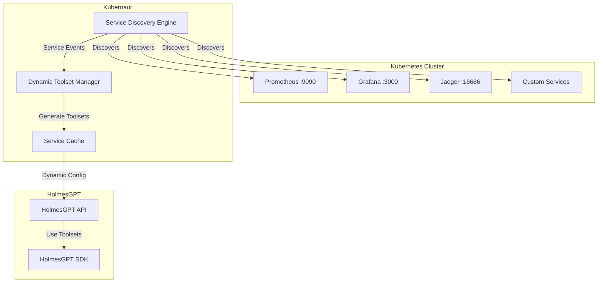

# Dynamic Toolset Configuration

**Feature Status**: ✅ Implemented
**Business Requirements**: BR-HOLMES-016 through BR-HOLMES-030
**Version**: 1.0.0

## Overview

The Dynamic Toolset Configuration feature automatically discovers services deployed in your Kubernetes cluster and dynamically configures HolmesGPT toolsets based on what's actually available. This eliminates manual toolset configuration and ensures HolmesGPT investigations leverage all available observability and monitoring tools.

## Key Benefits

- **🔄 Zero Configuration**: Automatically adapts to your cluster environment
- **⚡ Real-Time Updates**: Toolsets update automatically when services are deployed/removed
- **🎯 Context-Aware**: Only enables toolsets for services that are actually running
- **📊 Better Investigations**: Access to service-specific tools like Grafana dashboards and Jaeger traces
- **🛡️ Fault Tolerant**: Graceful fallback to baseline toolsets if discovery fails

## Supported Services

### Well-Known Services (Auto-Detection)
- **Prometheus** - Metrics querying, alerting rules, time series analysis
- **Grafana** - Dashboard access, data source queries, visualization
- **Jaeger** - Distributed tracing, service dependencies, latency analysis
- **Elasticsearch** - Log searching, pattern analysis, full-text search

### Custom Services
Services can be marked for discovery using annotations:

```yaml
apiVersion: v1
kind: Service
metadata:
  name: custom-monitoring
  annotations:
    kubernaut.io/toolset: "custom-metrics"
    kubernaut.io/endpoints: "metrics:8080,logs:3100"
    kubernaut.io/capabilities: "custom_metrics,log_analysis"
spec:
  ports:
  - name: metrics
    port: 8080
  - name: logs
    port: 3100
```

## Architecture



## Installation

### 1. Deploy with Dynamic Toolsets

```bash
# Deploy the dynamic toolset configuration
kubectl apply -f deploy/dynamic-toolset-deployment.yaml

# Verify deployment
kubectl get pods -n kubernaut-system
kubectl get svc -n kubernaut-system
```

### 2. Configure Service Discovery

Create or update your configuration:

```yaml
# config/dynamic-toolset-config.yaml
service_discovery:
  enabled: true
  discovery_interval: "5m"
  namespaces:
    - "monitoring"
    - "observability"
    - "kube-system"

holmesgpt:
  dynamic_toolsets:
    enabled: true
    update_interval: "30s"
```

### 3. Verify Service Discovery

```bash
# Check discovered services
curl http://kubernaut-dynamic-toolsets:8080/api/v1/service-discovery

# Check available toolsets
curl http://kubernaut-context-api:8091/api/v1/toolsets

# Get toolset statistics
curl http://kubernaut-context-api:8091/api/v1/toolsets/stats
```

## Usage Examples

### Basic Investigation with Auto-Discovery

```bash
# HolmesGPT will automatically use available toolsets
curl -X POST http://holmesgpt-api:8080/api/v1/investigate \
  -H "Content-Type: application/json" \
  -d '{
    "alert_name": "HighCPUUsage",
    "namespace": "production",
    "context": {
      "resource_type": "deployment",
      "resource_name": "web-app"
    }
  }'
```

If Prometheus is discovered, HolmesGPT will automatically:
- Query CPU metrics: `rate(container_cpu_usage_seconds_total[5m])`
- Check resource limits and requests
- Analyze historical usage patterns

If Grafana is available, it will:
- Reference relevant dashboards
- Suggest visualization URLs
- Cross-reference with existing alerts

### Interactive Chat with Dynamic Tools

```bash
curl -X POST http://holmesgpt-api:8080/api/v1/chat \
  -H "Content-Type: application/json" \
  -d '{
    "message": "Why is my application slow?",
    "session_id": "troubleshooting-123",
    "namespace": "production",
    "include_context": true
  }'
```

Response will leverage discovered services:
- **Prometheus**: Query application metrics
- **Jaeger**: Analyze trace latency
- **Grafana**: Reference performance dashboards
- **Elasticsearch**: Search application logs

### Force Toolset Refresh

```bash
# Manually refresh service discovery
curl -X POST http://kubernaut-context-api:8091/api/v1/toolsets/refresh

# Get updated toolset list
curl http://kubernaut-context-api:8091/api/v1/toolsets
```

## Configuration Reference

### Service Discovery Patterns

```yaml
service_discovery:
  service_patterns:
    prometheus:
      enabled: true
      priority: 80
      selectors:
        - app.kubernetes.io/name: prometheus
        - app: prometheus
      service_names: ["prometheus", "prometheus-server"]
      required_ports: [9090]
      capabilities:
        - "query_metrics"
        - "alert_rules"
        - "time_series"
      health_check:
        endpoint: "/api/v1/status/buildinfo"
        timeout: "2s"
        retries: 3
```

### Custom Service Detection

```yaml
# Service annotation example
metadata:
  annotations:
    kubernaut.io/toolset: "vector-database"
    kubernaut.io/endpoints: "query:8080,admin:8081"
    kubernaut.io/capabilities: "vector_search,similarity_analysis"
    kubernaut.io/health-endpoint: "/health"
```

### Toolset Templates

```yaml
holmesgpt:
  dynamic_toolsets:
    templates:
      prometheus:
        description: "Prometheus metrics analysis tools for ${service_name}"
        tools:
          - name: "prometheus_query"
            description: "Execute PromQL queries"
            command: "curl -s '${endpoint}/api/v1/query?query=${query}'"
            parameters:
              - name: "query"
                description: "PromQL expression"
                type: "string"
                required: true
```

## Monitoring and Observability

### Key Metrics

The feature exposes several metrics for monitoring:

```promql
# Service discovery metrics
kubernaut_service_discovery_total{service_type="prometheus",status="success"}
kubernaut_toolset_configurations_active{service_type="grafana"}
kubernaut_service_health_check_duration_seconds{service="jaeger-query"}

# Performance metrics
kubernaut_toolset_update_propagation_seconds
kubernaut_service_discovery_cache_hit_ratio
```

### Health Checks

```bash
# Check service integration health
curl http://kubernaut-context-api:8091/api/v1/health

# Response example
{
  "healthy": true,
  "service_discovery_healthy": true,
  "toolset_manager_healthy": true,
  "total_toolsets": 5,
  "enabled_toolsets": 4,
  "discovered_services": 3,
  "available_services": 2
}
```

### Troubleshooting

#### Service Not Discovered

1. **Check service labels and ports**:
```bash
kubectl get svc -n monitoring prometheus-server -o yaml
```

2. **Verify RBAC permissions**:
```bash
kubectl auth can-i get services --as=system:serviceaccount:kubernaut-system:kubernaut-service-discovery
```

3. **Check discovery logs**:
```bash
kubectl logs -n kubernaut-system deployment/kubernaut-dynamic-toolsets
```

#### Toolset Not Generated

1. **Check service health**:
```bash
curl http://prometheus:9090/api/v1/status/buildinfo
```

2. **Verify service discovery cache**:
```bash
curl http://kubernaut-context-api:8091/api/v1/service-discovery
```

3. **Force toolset refresh**:
```bash
curl -X POST http://kubernaut-context-api:8091/api/v1/toolsets/refresh
```

## Performance Characteristics

| Operation | Target | Typical Performance |
|-----------|--------|-------------------|
| Service Discovery | < 5s | Initial cluster scan |
| Toolset Updates | < 30s | Configuration propagation |
| Health Checks | < 2s | Per-service validation |
| Cache Hit Rate | > 90% | Repeated toolset queries |

## Security Considerations

### RBAC Requirements

The service discovery requires these permissions:

```yaml
rules:
- apiGroups: [""]
  resources: ["services", "endpoints", "namespaces"]
  verbs: ["get", "list", "watch"]
- apiGroups: ["apps"]
  resources: ["deployments", "statefulsets"]
  verbs: ["get", "list", "watch"]
```

### Network Security

- Service discovery respects NetworkPolicies
- Health checks use internal cluster networking
- No external network access required

### Data Privacy

- Service metadata is cached temporarily
- No service data content is stored
- Health check responses are not persisted

## Advanced Features

### A/B Testing

Enable gradual rollout of dynamic toolsets:

```yaml
ab_testing:
  enabled: true
  rollout_percentage: 50  # 50% of investigations use dynamic toolsets

  toolset_rollout:
    prometheus: 100  # Fully enabled
    grafana: 75     # 75% rollout
    jaeger: 50      # 50% rollout
```

### Custom Resource Definitions

Define custom service patterns via CRDs:

```yaml
apiVersion: kubernaut.io/v1
kind: ServicePattern
metadata:
  name: custom-vector-db
spec:
  serviceType: "vector-database"
  priority: 45
  selectors:
    - app.kubernetes.io/name: vector-db
  capabilities:
    - "vector_search"
    - "similarity_analysis"
```

### Multi-Cluster Support

Configure discovery across multiple clusters:

```yaml
service_discovery:
  clusters:
    - name: "production"
      kubeconfig: "/etc/kubeconfig/prod"
      namespaces: ["monitoring", "observability"]
    - name: "staging"
      kubeconfig: "/etc/kubeconfig/staging"
      namespaces: ["monitoring"]
```

## Migration Guide

### From Static Toolsets

1. **Backup current configuration**:
```bash
kubectl get configmap kubernaut-config -o yaml > backup.yaml
```

2. **Enable dynamic discovery**:
```yaml
holmesgpt:
  dynamic_toolsets:
    enabled: true
```

3. **Monitor toolset changes**:
```bash
kubectl logs -f deployment/kubernaut-dynamic-toolsets | grep "toolset"
```

4. **Verify investigations work**:
```bash
# Test investigation with dynamic toolsets
curl -X POST .../investigate -d '{"alert_name": "TestAlert"}'
```

## FAQ

**Q: What happens if service discovery fails?**
A: The system falls back to baseline toolsets (Kubernetes, internet) ensuring investigations can still proceed.

**Q: Can I disable discovery for specific services?**
A: Yes, set `enabled: false` in the service pattern configuration.

**Q: How often does service discovery run?**
A: Configurable via `discovery_interval` (default: 5 minutes) plus real-time watch events.

**Q: Does this work with service mesh?**
A: Yes, it discovers services through Kubernetes API regardless of service mesh.

**Q: Can I add custom toolsets?**
A: Yes, use the `kubernaut.io/toolset` annotation on services or define custom ServicePattern CRDs.

## Related Documentation

- [Architecture Document](../architecture/DYNAMIC_TOOLSET_CONFIGURATION_ARCHITECTURE.md)
- [Business Requirements](../requirements/10_AI_CONTEXT_ORCHESTRATION.md)
- [HolmesGPT Integration Guide](../development/HOLMESGPT_INTEGRATION.md)
- [Deployment Guide](../deployment/README.md)
