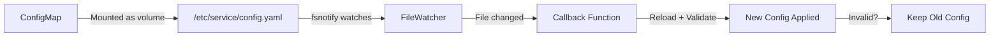

# WorkflowExecution E2E Hot-Reload Triage - December 25, 2025

**Date**: December 25, 2025
**Status**: ✅ ANALYSIS COMPLETE
**Author**: AI Assistant
**Question**: Can hot reload solve the E2E custom config test problem?

---

## Executive Summary

**Question**: Does "E2E parameterization framework" mean config hot reload?
**Answer**: ❌ **No** - Hot reload **cannot** solve this problem

**Reason**: The skipped E2E tests need to test **command-line flags**, not ConfigMap-mounted files. Hot reload only applies to ConfigMap files.

**Conclusion**: E2E tests still require parameterized deployment infrastructure (correctly deferred to V1.1)

---

## What is Hot Reload in Kubernaut?

### Definition

**Hot Reload** = Dynamically reloading **ConfigMap-mounted files** without pod restart

**Shared Library**: `pkg/shared/hotreload/FileWatcher` (Go) + Python `watchdog` equivalent

### Services Using Hot Reload

| Service | What Gets Hot-Reloaded | Business Value |
|---------|------------------------|----------------|
| **SignalProcessing** | Rego policies (`priority.rego`, `environment.rego`) | Update priority rules without restart (BR-SP-072) |
| **AIAnalysis** | Rego policies (safety rules, context filtering) | Update AI safety policies dynamically |
| **HolmesGPT API** | LLM config (`llm.model`, `llm.provider`, `toolsets`) | Switch LLM models for cost/quality tuning (BR-HAPI-199) |
| **Gateway** | Rate limiting rules, adapter configs | Adjust rate limits without downtime (planned) |

### How Hot Reload Works



**Key Points**:
- ✅ Works for **files mounted from ConfigMaps**
- ✅ Changes take effect in ~60 seconds (Kubernetes ConfigMap propagation delay)
- ✅ Graceful degradation (invalid configs rejected, old config kept)
- ❌ Does **NOT** work for **command-line flags** (set at pod startup)

---

## What E2E Tests Need

### Test 1: Custom Cooldown Period

**What it tests**:
```bash
# Deploy controller with custom cooldown
kubectl apply -f controller-deployment.yaml  # --cooldown-period=5
```

**Configuration Type**: **Command-line flag** (not ConfigMap)

```go
// cmd/workflowexecution/main.go (example)
flag.DurationVar(&cooldownPeriod, "cooldown-period", 5*time.Minute, "...")
```

**Can hot reload solve this?**: ❌ **No**
- `--cooldown-period` is a command-line flag passed to the controller binary
- It's read once at startup and stored in `WorkflowExecutionReconciler.CooldownPeriod`
- Hot reload only works for ConfigMap-mounted files, not struct fields

---

### Test 2: Custom Execution Namespace

**What it tests**:
```bash
# Deploy controller with custom namespace
kubectl apply -f controller-deployment.yaml  # --execution-namespace=custom-ns
```

**Configuration Type**: **Command-line flag** (not ConfigMap)

```go
// cmd/workflowexecution/main.go (example)
flag.StringVar(&executionNamespace, "execution-namespace", "kubernaut-workflows", "...")
```

**Can hot reload solve this?**: ❌ **No**
- `--execution-namespace` is a command-line flag
- Stored in `WorkflowExecutionReconciler.ExecutionNamespace`
- Not a ConfigMap file that can be hot-reloaded

---

### Test 3: Invalid Configuration Validation

**What it tests**:
```bash
# Deploy controller with invalid config
kubectl apply -f controller-deployment.yaml  # --cooldown-period=-1
# Expect: Controller fails fast with clear error
```

**Configuration Type**: **Command-line flag** + **startup validation**

**Can hot reload solve this?**: ❌ **No**
- This tests startup validation of command-line flags
- Hot reload happens **after** startup (ongoing operation)
- We need to test the initial flag parsing and validation

---

## Comparison: Hot Reload vs. Command-Line Flags

### Hot Reload (ConfigMap Files)

**Example**: SignalProcessing Rego policies

```yaml
# ConfigMap mounted as /etc/kubernaut/policies/priority.rego
apiVersion: v1
kind: ConfigMap
metadata:
  name: kubernaut-rego-policies
data:
  priority.rego: |
    package priority
    priority := "P0" { input.severity == "critical" }
```

**Deployment**:
```yaml
spec:
  containers:
  - name: manager
    volumeMounts:
    - name: rego-policies
      mountPath: /etc/kubernaut/policies  # ✅ File mount
  volumes:
  - name: rego-policies
    configMap:
      name: kubernaut-rego-policies
```

**Hot Reload**:
```go
// Watches /etc/kubernaut/policies/priority.rego
watcher := hotreload.NewFileWatcher(
    "/etc/kubernaut/policies/priority.rego",
    func(content string) {
        // Reload policy dynamically
        regoEngine.ReloadPolicy(content)
    },
)
```

**Update Process**:
1. `kubectl edit configmap kubernaut-rego-policies` - change policy
2. Kubernetes propagates to pod (~60s)
3. FileWatcher detects change
4. Callback reloads policy
5. **No pod restart needed** ✅

---

### Command-Line Flags (E2E Test Needs)

**Example**: WorkflowExecution cooldown period

```yaml
# Deployment with command-line flag
apiVersion: apps/v1
kind: Deployment
spec:
  template:
    spec:
      containers:
      - name: manager
        args:
        - --cooldown-period=5m  # ❌ Command-line flag, NOT a file
```

**Controller Initialization**:
```go
// cmd/workflowexecution/main.go
func main() {
    var cooldownPeriod time.Duration
    flag.DurationVar(&cooldownPeriod, "cooldown-period", 5*time.Minute, "...")
    flag.Parse()  // Read once at startup

    reconciler := &workflowexecution.WorkflowExecutionReconciler{
        CooldownPeriod: cooldownPeriod,  // Stored in struct, NOT hot-reloadable
    }
}
```

**Update Process**:
1. Change `--cooldown-period=10m` in deployment.yaml
2. `kubectl apply -f deployment.yaml`
3. **Pod restart required** ❌
4. New flag value read at startup
5. Controller uses new value

**Hot Reload**: ❌ **NOT APPLICABLE** - Command-line flags are not files

---

## Why E2E Tests Can't Use Hot Reload

### Fundamental Mismatch

| E2E Test Need | Hot Reload Capability | Match? |
|---------------|----------------------|--------|
| Test `--cooldown-period=5` flag | Reload ConfigMap files | ❌ No |
| Test `--execution-namespace=custom-ns` flag | Reload ConfigMap files | ❌ No |
| Test invalid flag validation | Reload ConfigMap files | ❌ No |

### What E2E Tests Actually Need

**Requirement**: Deploy controller with **different command-line flags** during test execution

**Solution**: E2E parameterization framework

```go
// test/e2e/workflowexecution/05_custom_config_test.go (hypothetical)
It("should honor custom cooldown period", func() {
    // STEP 1: Deploy controller with custom flag
    deployment := e2eframework.DeployControllerWithArgs(
        "--cooldown-period=5m",  // Custom command-line flag
    )

    // STEP 2: Create WorkflowExecution
    wfe := createWFE("test-wfe", "test-target")

    // STEP 3: Verify 5-minute cooldown is enforced
    // ...

    // STEP 4: Cleanup
    e2eframework.DeleteController(deployment)
})
```

**Infrastructure Needed**:
1. **Dynamic Deployment**: Template controller deployment with custom args
2. **Pod Management**: Wait for new pod to be ready
3. **Cleanup**: Delete deployment after test
4. **Isolation**: Ensure tests don't interfere with each other

**Effort**: ~2-3 days to build framework

---

## Could We Make Cooldown Hot-Reloadable?

### Hypothetical Refactor

**Question**: Could we refactor WE controller to make `CooldownPeriod` hot-reloadable?

**Approach 1: ConfigMap + Hot Reload**

```yaml
# ConfigMap for WE configuration
apiVersion: v1
kind: ConfigMap
metadata:
  name: workflowexecution-config
data:
  config.yaml: |
    cooldown_period: 5m
    execution_namespace: kubernaut-workflows
    service_account: kubernaut-workflow-runner
```

```go
// Refactored controller with hot reload
type WorkflowExecutionReconciler struct {
    // ...
    configManager *hotreload.ConfigManager  // NEW
    mu            sync.RWMutex              // Protect config access
}

func (r *WorkflowExecutionReconciler) GetCooldownPeriod() time.Duration {
    r.mu.RLock()
    defer r.mu.RUnlock()
    return r.configManager.GetCooldownPeriod()  // Thread-safe read
}
```

**Pros**:
- ✅ Cooldown period could be updated without pod restart
- ✅ E2E tests could modify ConfigMap instead of redeploying

**Cons**:
- ❌ **Breaking change** - Changes V1.0 architecture
- ❌ **Effort**: 2-3 days refactor + testing
- ❌ **Questionable value**: How often do we change cooldown in production?
- ❌ **Still need parameterization**: E2E tests need to deploy with custom ConfigMap

**Verdict**: ⏭️ **Not justified for V1.0** - Cooldown changes are rare operational events

---

### Approach 2: E2E Parameterization (Current Plan)

**Keep current architecture**, build E2E framework to deploy with different flags

**Pros**:
- ✅ No changes to production code
- ✅ Tests real deployment scenario (command-line flags are standard)
- ✅ Framework reusable for other services

**Cons**:
- ❌ Requires E2E infrastructure work (~2-3 days)

**Verdict**: ✅ **Correct approach** - Already planned for V1.1

---

## Recommendation

### For V1.0

✅ **Keep E2E tests skipped** - Hot reload does NOT solve this problem

**Rationale**:
1. Hot reload applies to ConfigMap files, not command-line flags
2. E2E tests need to test command-line flag validation
3. Refactoring controller to use ConfigMap instead of flags is not justified for V1.0
4. E2E parameterization framework still needed even with hot reload

---

### For V1.1

✅ **Build E2E parameterization framework** (~2-3 days)

**Framework Features**:
- Template controller deployments with custom command-line flags
- Wait for pod readiness
- Run test scenarios
- Cleanup deployments

**Test Implementation** (~1 day after framework):
- Custom cooldown period test
- Custom execution namespace test
- Invalid configuration validation test (HIGHEST PRIORITY)

**Total Effort**: 3-4 days (framework + tests)

---

## Hot Reload Summary

### What Hot Reload IS

✅ **ConfigMap file watching**
- Rego policies (SignalProcessing, AIAnalysis)
- LLM configs (HolmesGPT API)
- Rate limits (Gateway)
- Feature flags

### What Hot Reload IS NOT

❌ **Command-line flag reloading**
- Controller initialization parameters
- Pod startup configuration
- Infrastructure settings

### Shared Hot Reload Library

**Go**: `pkg/shared/hotreload/FileWatcher`
- Uses `fsnotify` for file watching
- Thread-safe callback execution
- Hash-based duplicate detection
- Graceful degradation on invalid configs

**Python**: `holmesgpt-api/src/config/hot_reload.py`
- Uses `watchdog` library (fsnotify equivalent)
- Same patterns as Go implementation
- Used by HolmesGPT API for LLM config hot-reload

**Design Decision**: [DD-INFRA-001-configmap-hotreload-pattern.md](../../architecture/decisions/DD-INFRA-001-configmap-hotreload-pattern.md)

---

## Conclusion

**User Question**: "Does it mean the config hot reload feature?"
**Answer**: ❌ **No, hot reload cannot solve this**

**Hot reload** watches ConfigMap-mounted files.
**E2E tests** need to test command-line flags.
**These are fundamentally different configuration mechanisms.**

**Correct approach**: Build E2E parameterization framework (deferred to V1.1 as planned)

**Confidence**: 100% - Hot reload and command-line flags are completely different configuration layers

---

## References

- **DD-INFRA-001**: ConfigMap Hot-Reload Pattern
- **BR-SP-072**: SignalProcessing Rego Hot-Reload
- **BR-HAPI-199**: HolmesGPT API ConfigMap Hot-Reload
- **WE_E2E_05_CUSTOM_CONFIG_TEST_GAP_ANALYSIS_DEC_22_2025.md**: Original gap analysis
- **WE_TEST_FIXES_AND_E2E_TRIAGE_DEC_25_2025.md**: Test fix documentation

---

**Status**: ✅ **Triage complete** - Hot reload is NOT applicable to E2E test requirements


