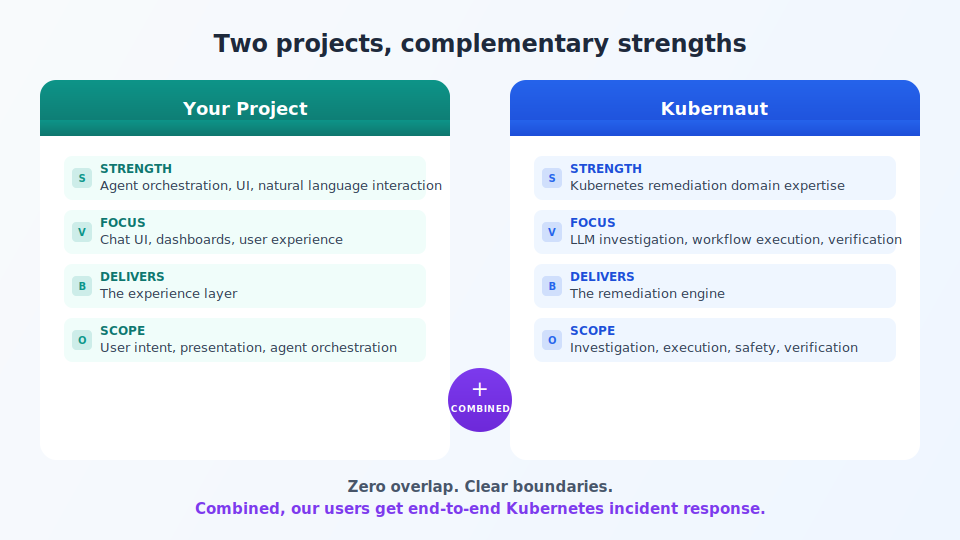

## We solve the same problem from different angles

<!-- Speaker notes:
Your platform owns the experience — UX, branding, orchestration.
Kubernaut owns the Kubernetes remediation engine — investigation, execution, verification.
Neither replaces the other. Together, the user gets something neither can deliver alone.
-->

---

[< Previous: Title](00-title.md) | [Deck Index](../kubernaut-integration-partner-deck.md) | [Next: Domain depth >](02-domain-depth.md)
