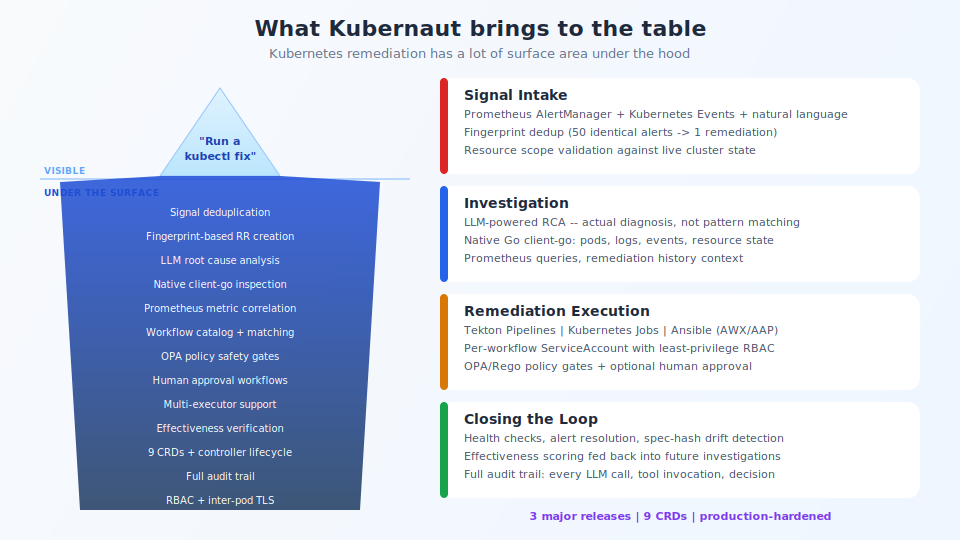

## What Kubernetes remediation actually requires

<!-- Speaker notes:
Remediation is a deep domain built over 3 major releases: signal intake with deduplication,
LLM-powered root cause analysis, workflow execution (Tekton, K8s Jobs, Ansible),
safety controls (OPA, RBAC, approval gates), effectiveness verification, and full audit trail.
-->

---

[< Previous: Complementary strengths](01-complementary-strengths.md) | [Deck Index](../kubernaut-integration-partner-deck.md) | [Next: Chat UI mockup >](03-chat-ui-mockup.md)
