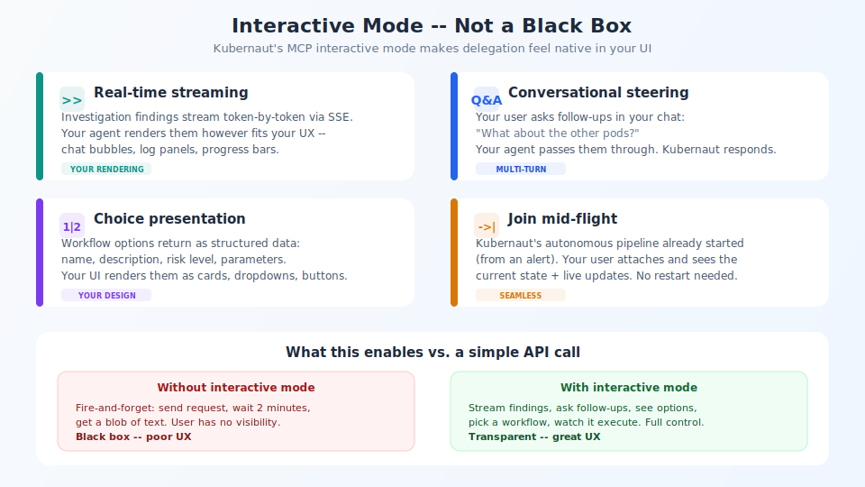

## Interactive mode — not a black box

<!-- Speaker notes:
Real-time streaming: findings arrive token-by-token via SSE.
Conversational steering: users ask follow-ups, Kubernaut's LLM responds in context.
Choice presentation: workflow options return as structured data — your UI renders them.
Join mid-flight: attach to an already-running autonomous investigation.
-->

---

[< Previous: Sequence diagram](04-sequence-diagram.md) | [Deck Index](../kubernaut-integration-partner-deck.md) | [Next: Ownership split >](06-ownership-split.md)
