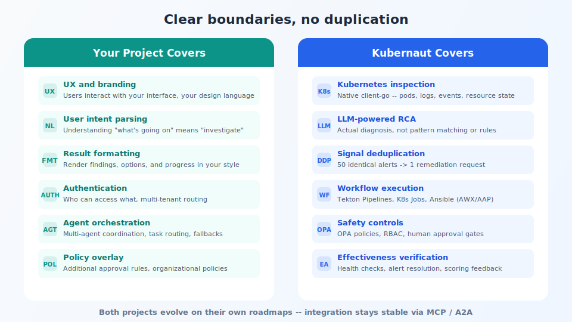

## What each side owns

<!-- Speaker notes:
Your platform: UX, intent parsing, formatting, auth, multi-tenant routing, policy overlay.
Kubernaut: K8s inspection, LLM RCA, deduplication, workflow execution, safety, audit trail.
-->

---

[< Previous: Interactive mode](05-interactive-mode.md) | [Deck Index](../kubernaut-integration-partner-deck.md) | [Next: Protocols >](07-protocols.md)
