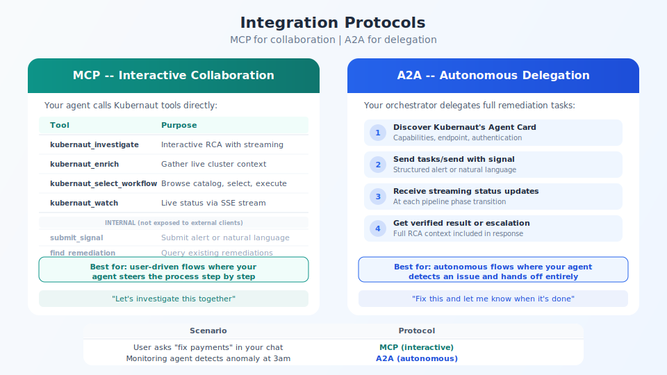

## Integration protocols: MCP vs A2A

<!-- Speaker notes:
MCP for interactive, user-driven flows — your agent calls kubernaut_investigate, enrich, select_workflow, watch.
A2A for autonomous, fire-and-forget — your orchestrator delegates via Agent Card and tracks task lifecycle.
submit_signal and find_remediation are internal tools, not exposed to external clients.
-->

---

[< Previous: Ownership split](06-ownership-split.md) | [Deck Index](../kubernaut-integration-partner-deck.md) | [Next: Natural language >](08-natural-language.md)
