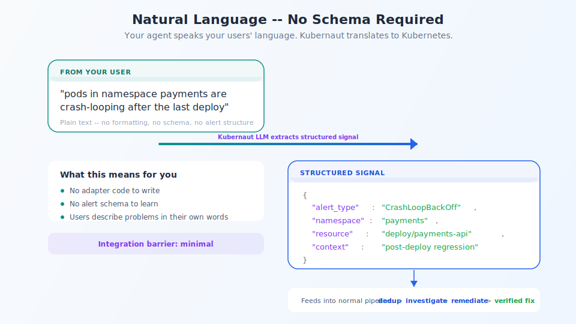

## Natural language — no schema required

<!-- Speaker notes:
Your agent sends plain text: "pods in payments are crash-looping after the last deploy."
Kubernaut's LLM extracts alert type, namespace, resource, and context.
Your agent speaks your users' language. Kubernaut translates to Kubernetes.
-->

---

[< Previous: Protocols](07-protocols.md) | [Deck Index](../kubernaut-integration-partner-deck.md) | [Next: Architecture >](09-architecture.md)
