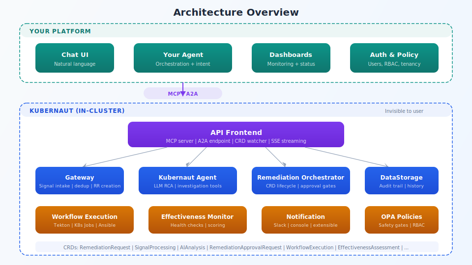

## Architecture overview

<!-- Speaker notes:
API Frontend hosts MCP server + A2A endpoint. Behind it: Gateway (signal dedup),
Kubernaut Agent (LLM RCA), Remediation Orchestrator (CRD lifecycle),
Workflow Execution, Effectiveness Monitor, Notification Service. All in-cluster.
-->

---

[< Previous: Natural language](08-natural-language.md) | [Deck Index](../kubernaut-integration-partner-deck.md) | [Next: Demo flow >](10-demo-flow.md)
