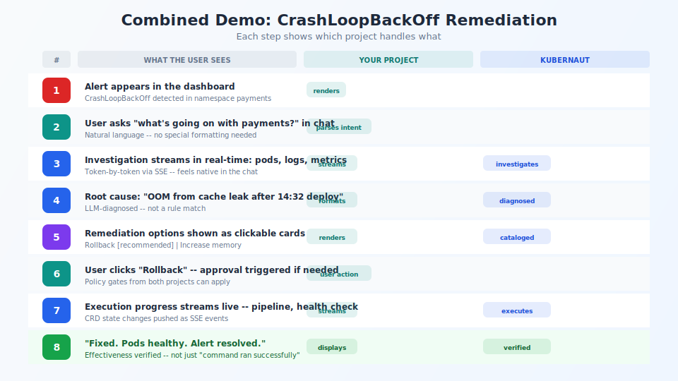

## What a joint demo looks like

<!-- Speaker notes:
Scenario: CrashLoopBackOff after a bad deploy.
Alert in your UI, user asks "what's going on?", investigation streams live,
root cause displayed, remediation options as cards, user clicks Rollback,
execution streams, "Fixed. Pods healthy." Your platform drives the experience.
-->

---

[< Previous: Architecture](09-architecture.md) | [Deck Index](../kubernaut-integration-partner-deck.md) | [Next: Next steps >](11-next-steps.md)
