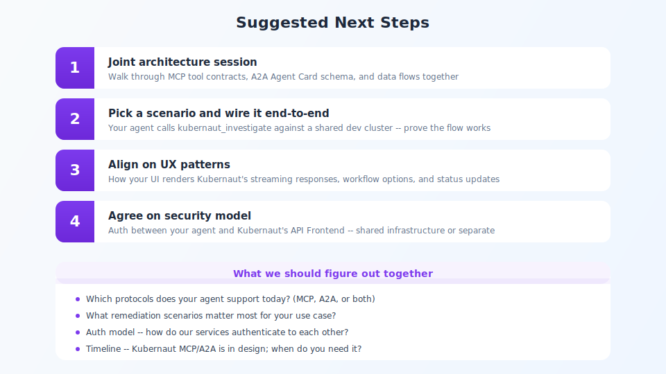

## Next steps

<!-- Speaker notes:
1. Technical deep-dive — MCP tool contracts and A2A Agent Card schema.
2. Proof of concept — your agent calls kubernaut_investigate against a test cluster.
3. UX alignment — how your UI renders Kubernaut's streaming responses.
4. Security model — auth between your agent and Kubernaut's API Frontend.
We provide: dev cluster, sample alert scenarios, MCP/A2A documentation.
We need from you: protocol support, auth model, a test scenario.
-->

---

[< Previous: Demo flow](10-demo-flow.md) | [Deck Index](../kubernaut-integration-partner-deck.md) | [Next: Existing personas >](13-personas-existing.md)
