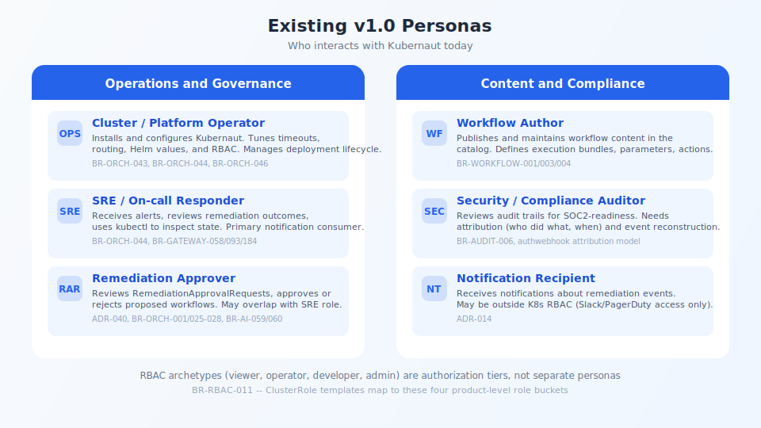

## Existing v1.0 Personas

<!-- Speaker notes:
Six personas already served by Kubernaut today:
- Cluster/Platform Operator: installs, configures, manages deployment lifecycle
- SRE/On-call Responder: receives alerts, reviews outcomes, primary notification consumer
- Remediation Approver: reviews and decides on RemediationApprovalRequests
- Workflow Author: publishes and maintains workflow catalog content
- Security/Compliance Auditor: reviews audit trails for SOC2-readiness, needs full attribution
- Notification Recipient: receives events via Slack/PagerDuty, may lack K8s RBAC
RBAC archetypes (viewer, operator, developer, admin) are authorization tiers, not separate personas.
-->

---

[< Previous: Next steps](11-next-steps.md) | [Deck Index](../kubernaut-integration-partner-deck.md) | [Next: Integration personas >](14-personas-integration.md)
