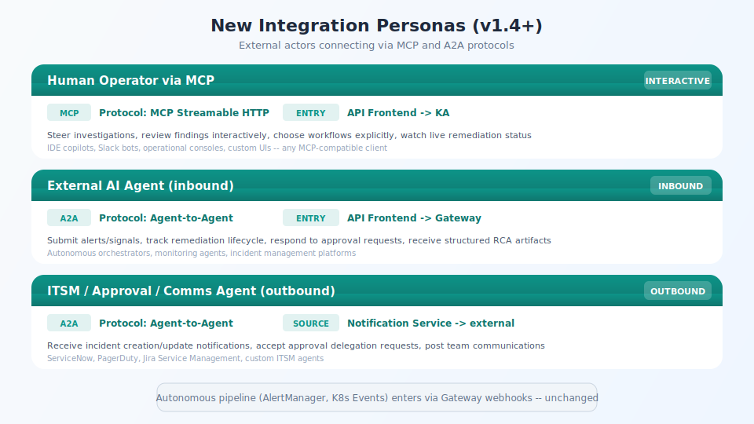

## New Integration Personas

<!-- Speaker notes:
Three new persona categories introduced for external integration:
- Human Operator via MCP: interactive sessions through any MCP-compatible client
  (IDE copilots, Slack bots, consoles). Steers investigations, reviews findings, selects workflows.
- External AI Agent (inbound A2A): autonomous orchestrators submit signals, track lifecycle,
  respond to approvals. Fire-and-forget delegation.
- ITSM/Comms Agent (outbound A2A): receives incident notifications, approval delegation,
  team communications. ServiceNow, PagerDuty, Jira SM.
The autonomous pipeline (AlertManager, K8s Events via Gateway webhooks) is unchanged.
-->

---

[< Previous: Existing personas](13-personas-existing.md) | [Deck Index](../kubernaut-integration-partner-deck.md) | [Next: Interaction boundaries >](15-personas-boundaries.md)
