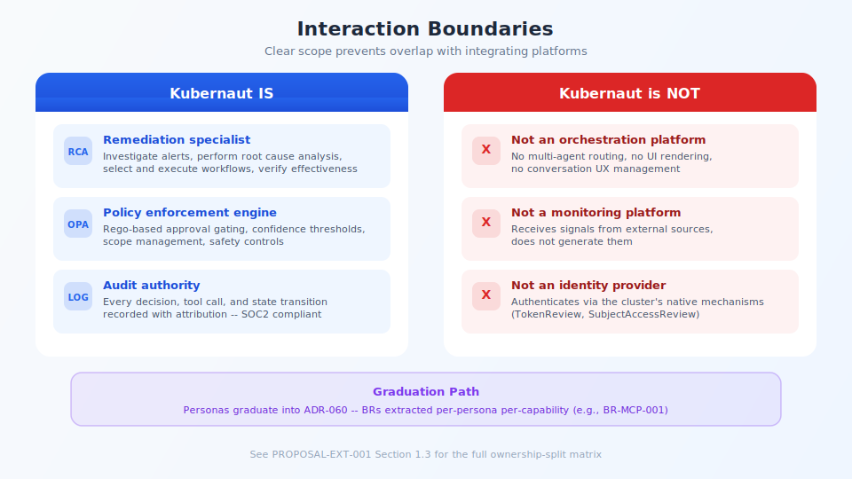

## Interaction Boundaries

<!-- Speaker notes:
Kubernaut IS: remediation specialist, policy enforcement engine, audit authority.
Kubernaut is NOT: not an orchestration platform, not a monitoring platform, not an identity provider.
This clear scope prevents overlap with integrating platforms.
Graduation path: personas become ADR-060, BRs extracted per-persona per-capability.
See also the ownership-split slide for the detailed responsibility matrix.
-->

---

[< Previous: Integration personas](14-personas-integration.md) | [Deck Index](../kubernaut-integration-partner-deck.md) | [Next: Closing >](12-closing.md)
