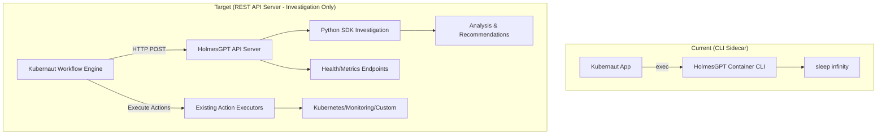

# HolmesGPT REST API Wrapper - Business Requirements

**Document Version**: 1.1
**Date**: November 2025
**Status**: Business Requirements Specification
**Module**: HolmesGPT REST API Wrapper (`pkg/ai/holmesgpt/api-server/`)

---

## Changelog

| Version | Date | Changes |
|---------|------|---------|
| 1.1 | 2025-11-30 | Added BR-HAPI-250-252 (MCP Workflow Catalog Integration) |
| 1.0 | 2025-01-15 | Initial version |

---

## 1. Purpose & Scope

### 1.1 Business Purpose
Create a standalone REST API server that wraps the HolmesGPT Python SDK to provide HTTP endpoints for **AI-powered investigation and analysis capabilities only**. HolmesGPT is designed for intelligent inquiry, root cause analysis, and recommendation generation - **NOT for executing infrastructure changes**. This replaces the current sidecar CLI approach with a proper microservice architecture that enables seamless integration with Kubernaut's existing execution infrastructure.

**🔍 INVESTIGATION ONLY**: HolmesGPT provides intelligent analysis and recommendations. All infrastructure execution is handled by Kubernaut's proven execution infrastructure (Kubernetes Action Executor, Monitoring Action Executor, etc.).

### 1.2 Current Architecture Gap
The existing HolmesGPT integration uses a CLI sidecar container that:
- **❌ No HTTP endpoints** - Documentation references `http://localhost:8090/health` but these don't exist
- **❌ CLI-only access** - Requires container exec for investigations
- **❌ No programmatic API** - Cannot be called directly from applications
- **❌ Poor scalability** - Single container, no load balancing
- **❌ Limited observability** - No HTTP metrics or health checks

### 1.3 Target Architecture


### 1.4 Scope
- **🔍 Investigation Only**: HolmesGPT SDK wrapper for analysis, root cause identification, and recommendation generation
- **❌ No Execution**: Does NOT execute infrastructure changes - that's handled by existing Kubernaut executors
- **Container Image**: Standalone, multi-architecture container for investigation services
- **API Endpoints**: RESTful HTTP interface for investigation and analysis operations
- **Health & Observability**: Metrics, health checks, logging for investigation services
- **Configuration Management**: Environment-based and file-based configuration for investigation parameters
- **Security**: Authentication, authorization, rate limiting for investigation access

---

## 2. Core API Requirements

### 2.1 Investigation Endpoints

#### 2.1.1 Alert Investigation
- **BR-HAPI-001**: MUST provide `/api/v1/investigate` POST endpoint for alert investigation
- **BR-HAPI-002**: MUST accept alert context (name, namespace, labels, annotations)
- **BR-HAPI-003**: MUST support investigation priority levels (low, medium, high, critical)
- **BR-HAPI-004**: MUST return structured investigation results with actionable recommendations (for execution by Kubernaut's action executors)
- **BR-HAPI-005**: MUST support asynchronous investigation with job tracking

#### 2.1.2 Interactive Chat
- **BR-HAPI-006**: MUST provide `/api/v1/chat` POST endpoint for interactive investigations
- **BR-HAPI-007**: MUST maintain conversation context across multiple requests
- **BR-HAPI-008**: MUST support follow-up questions and clarifications
- **BR-HAPI-009**: MUST provide streaming responses for real-time interaction
- **BR-HAPI-010**: MUST support session management with configurable timeouts

#### 2.1.3 Context-Aware Analysis
- **BR-HAPI-011**: MUST integrate with Kubernaut Context API for enhanced investigations
- **BR-HAPI-012**: MUST support custom toolset configurations per investigation
- **BR-HAPI-013**: MUST provide context validation and enrichment
- **BR-HAPI-014**: MUST cache context data for improved performance
- **BR-HAPI-015**: MUST support parallel context gathering from multiple sources

#### 2.1.4 Enhanced Investigation Capabilities (v1)
- **BR-HAPI-INVESTIGATION-001**: MUST provide detailed failure analysis with root cause identification
- **BR-HAPI-INVESTIGATION-002**: MUST generate specific, actionable recommendations for Kubernaut's action executors
- **BR-HAPI-INVESTIGATION-003**: MUST assess action safety and risk before recommendations are executed by other systems
- **BR-HAPI-INVESTIGATION-004**: MUST analyze execution results and provide feedback for continuous improvement
- **BR-HAPI-INVESTIGATION-005**: MUST NOT execute infrastructure changes - investigation and analysis only

#### 2.1.5 Recovery Analysis & Recommendations (v1)
- **BR-HAPI-RECOVERY-001**: MUST provide `/api/v1/recovery/analyze` POST endpoint for recovery strategy analysis
- **BR-HAPI-RECOVERY-002**: MUST generate detailed recovery recommendations based on investigation results
- **BR-HAPI-RECOVERY-003**: MUST provide step-by-step recovery instructions with safety validations
- **BR-HAPI-RECOVERY-004**: MUST support multiple recovery strategies (immediate, gradual, rollback)
- **BR-HAPI-RECOVERY-005**: MUST include risk assessment for each recommended recovery action
- **BR-HAPI-RECOVERY-006**: MUST provide recovery time estimates and resource impact analysis

#### 2.1.6 Action Safety Analysis (v1)
- **BR-HAPI-SAFETY-001**: MUST provide `/api/v1/safety/analyze` POST endpoint for action safety assessment
- **BR-HAPI-SAFETY-002**: MUST validate proposed action safety before execution by Kubernaut executors
- **BR-HAPI-SAFETY-003**: MUST check for potential conflicts with running workloads
- **BR-HAPI-SAFETY-004**: MUST assess action impact on system stability
- **BR-HAPI-SAFETY-005**: MUST provide safety recommendations and warnings
- **BR-HAPI-SAFETY-006**: MUST support dry-run analysis without actual execution

#### 2.1.7 Post-Execution Analysis (v1)
- **BR-HAPI-POSTEXEC-001**: MUST provide `/api/v1/execution/analyze` POST endpoint for execution result analysis
- **BR-HAPI-POSTEXEC-002**: MUST analyze execution results and outcomes
- **BR-HAPI-POSTEXEC-003**: MUST provide feedback on action effectiveness
- **BR-HAPI-POSTEXEC-004**: MUST identify patterns for future improvement
- **BR-HAPI-POSTEXEC-005**: MUST support learning from execution outcomes

#### 2.1.8 MCP Workflow Catalog Integration (v1)

> **Added**: v1.1 (2025-11-30) - MCP tool integration for workflow selection per DD-WORKFLOW-002

- **BR-HAPI-250**: MUST integrate with Data Storage MCP tool for workflow catalog search
  - **MCP Tool**: `search_workflow_catalog` exposed by Data Storage service
  - **Query Parameters**: `signal_type`, `severity`, `environment`, `priority`, `detected_labels`, `custom_labels`
  - **Response**: `workflow_id` (UUID), `container_image` (OCI reference), `title`, `description`, `confidence`
  - **Reference**: DD-WORKFLOW-002 v3.3, DD-LLM-001
- **BR-HAPI-251**: MUST resolve `containerImage` from workflow catalog during MCP search
  - **Resolution**: HolmesGPT-API returns `containerImage` directly (not just `workflowId`)
  - **Rationale**: Eliminates need for RO to call Data Storage for resolution
  - **Contract**: AIAnalysis receives ready-to-use `containerImage` in response
  - **Reference**: DD-CONTRACT-001 v1.2
- **BR-HAPI-252**: MUST pass DetectedLabels and CustomLabels to MCP workflow search
  - **DetectedLabels**: Auto-detected cluster characteristics (gitOpsTool, pdbProtected, etc.)
  - **CustomLabels**: Customer-defined labels from Rego policies
  - **Filtering**: Data Storage uses labels for workflow pre-filtering
  - **Context**: Labels also expressed in natural language for LLM context
  - **Reference**: DD-WORKFLOW-001 v1.8

### 2.2 Management Endpoints

#### 2.2.1 Health & Status
- **BR-HAPI-018**: MUST provide `/health` endpoint with comprehensive health checks
- **BR-HAPI-019**: MUST provide `/ready` endpoint for Kubernetes readiness probes
- **BR-HAPI-018**: MUST provide `/metrics` endpoint with Prometheus-compatible metrics
- **BR-HAPI-019**: MUST monitor SDK health, LLM connectivity, and resource usage
- **BR-HAPI-020**: MUST provide `/status` endpoint with service information and capabilities

#### 2.2.2 Configuration & Discovery
- **BR-HAPI-021**: MUST provide `/api/v1/config` endpoint for runtime configuration
- **BR-HAPI-022**: MUST provide `/api/v1/toolsets` endpoint for available toolsets
- **BR-HAPI-023**: MUST provide `/api/v1/models` endpoint for supported LLM models
- **BR-HAPI-024**: MUST support configuration reload without service restart
- **BR-HAPI-025**: MUST provide API documentation via `/docs` endpoint (OpenAPI/Swagger)

---

## 3. Technical Implementation Requirements

### 3.1 Python SDK Integration

#### 3.1.1 SDK Initialization
- **BR-HAPI-026**: MUST initialize HolmesGPT SDK with configurable LLM providers
- **BR-HAPI-027**: MUST support multiple AI providers (OpenAI, Anthropic, Local LLM, Ollama)
- **BR-HAPI-028**: MUST implement SDK connection pooling for performance
- **BR-HAPI-029**: MUST provide SDK error handling and retry mechanisms
- **BR-HAPI-030**: MUST validate SDK compatibility and version requirements

#### 3.1.2 Toolset Management
- **BR-HAPI-031**: MUST load and configure HolmesGPT toolsets dynamically
- **BR-HAPI-032**: MUST support custom toolset definitions and extensions
- **BR-HAPI-033**: MUST provide toolset validation and capability discovery
- **BR-HAPI-034**: MUST implement toolset versioning and updates
- **BR-HAPI-035**: MUST cache toolset configurations for performance

### 3.2 HTTP Server Framework

#### 3.2.1 Server Architecture
- **BR-HAPI-036**: MUST use FastAPI or Flask framework for REST API implementation
- **BR-HAPI-037**: MUST implement asynchronous request handling for scalability
- **BR-HAPI-038**: MUST support concurrent investigations with resource limits
- **BR-HAPI-039**: MUST provide request/response logging and tracing
- **BR-HAPI-040**: MUST implement graceful shutdown and cleanup

#### 3.2.2 API Standards
- **BR-HAPI-041**: MUST follow REST API design principles and HTTP standards
- **BR-HAPI-042**: MUST implement OpenAPI 3.0 specification with complete documentation
- **BR-HAPI-043**: MUST provide consistent error responses with proper HTTP status codes
- **BR-HAPI-044**: MUST support JSON content type for all endpoints
- **BR-HAPI-045**: MUST implement API versioning with backward compatibility

---

## 4. Container & Deployment Requirements

### 4.1 Container Specifications

#### 4.1.1 Multi-Architecture Support
- **BR-HAPI-046**: MUST build container images for linux/amd64 and linux/arm64
- **BR-HAPI-047**: MUST use upstream community UBI Python 3.11+ base image (registry.access.redhat.com/ubi9/python-311) with security updates
- **BR-HAPI-048**: MUST minimize container size while including all dependencies using UBI-micro for minimal footprint
- **BR-HAPI-049**: MUST implement non-root user execution for security
- **BR-HAPI-050**: MUST provide proper signal handling for container lifecycle

#### 4.1.2 Port Configuration
- **BR-HAPI-051**: MUST expose HTTP server on configurable port (default: 8090)
- **BR-HAPI-052**: MUST expose metrics endpoint on separate port (default: 9091)
- **BR-HAPI-053**: MUST support TLS termination for secure communications
- **BR-HAPI-054**: MUST implement proper port binding and address configuration
- **BR-HAPI-055**: MUST validate port availability and conflicts

### 4.2 Kubernetes Integration

#### 4.2.1 Service Definition
- **BR-HAPI-056**: MUST provide Kubernetes service manifests for cluster deployment
- **BR-HAPI-057**: MUST support service discovery and DNS resolution
- **BR-HAPI-058**: MUST implement proper labeling and annotations for monitoring
- **BR-HAPI-059**: MUST provide network policies for secure communication
- **BR-HAPI-060**: MUST support horizontal pod autoscaling based on metrics

#### 4.2.2 Health & Monitoring
- **BR-HAPI-061**: MUST implement Kubernetes liveness and readiness probes
- **BR-HAPI-062**: MUST provide Prometheus metrics for observability
- **BR-HAPI-063**: MUST support log aggregation and structured logging
- **BR-HAPI-064**: MUST implement distributed tracing for request tracking
- **BR-HAPI-065**: MUST provide alerts for service degradation and failures

---

## 5. Security & Access Control

### 5.1 Authentication & Authorization

#### 5.1.1 API Security
- **BR-HAPI-066**: MUST implement API key authentication for external access
- **BR-HAPI-067**: MUST support JWT tokens for service-to-service communication
- **BR-HAPI-068**: MUST provide role-based access control (RBAC) for different operations
- **BR-HAPI-069**: MUST implement rate limiting per client/IP address
- **BR-HAPI-070**: MUST log all authentication attempts and security events

#### 5.1.2 Data Protection
- **BR-HAPI-071**: MUST encrypt sensitive data in transit using TLS 1.2+
- **BR-HAPI-072**: MUST sanitize logs to prevent sensitive data exposure
- **BR-HAPI-073**: MUST implement input validation and sanitization
- **BR-HAPI-074**: MUST provide secure storage for API keys and certificates
- **BR-HAPI-075**: MUST comply with data privacy requirements for investigation data

### 5.2 Network Security

#### 5.2.1 Communication Security
- **BR-HAPI-076**: MUST use secure communication protocols for all external connections
- **BR-HAPI-077**: MUST validate SSL/TLS certificates for upstream services
- **BR-HAPI-078**: MUST implement network segmentation and firewall rules
- **BR-HAPI-079**: MUST provide secure defaults for all network configurations
- **BR-HAPI-080**: MUST support mutual TLS (mTLS) for service authentication

### 5.3 Container Security

#### 5.3.1 Image Security
- **BR-HAPI-081**: MUST use upstream community Universal Base Images (UBI) from upstream community Catalog (ubi9-minimal, ubi9-micro, or ubi9-python)
- **BR-HAPI-082**: MUST scan container images for vulnerabilities before deployment using upstream community security scanning tools
- **BR-HAPI-083**: MUST run containers as non-root user with minimal privileges
- **BR-HAPI-084**: MUST implement read-only file systems where possible
- **BR-HAPI-085**: MUST use multi-stage builds to minimize attack surface with upstream community UBI base images

#### 5.3.2 Runtime Security
- **BR-HAPI-086**: MUST implement security contexts and pod security standards
- **BR-HAPI-087**: MUST use resource limits to prevent resource exhaustion attacks
- **BR-HAPI-088**: MUST implement seccomp and AppArmor/SELinux profiles
- **BR-HAPI-089**: MUST disable unnecessary capabilities and system calls
- **BR-HAPI-090**: MUST implement container image signing and verification

#### 5.3.3 upstream community Enterprise Compliance
- **BR-HAPI-091**: MUST use certified upstream community UBI images to ensure enterprise support and compliance
- **BR-HAPI-092**: MUST leverage upstream community Package Manager (RPM) for system dependencies when possible
- **BR-HAPI-093**: MUST comply with upstream community Container Certification requirements for enterprise deployment
- **BR-HAPI-094**: MUST use upstream community security advisories and update mechanisms for base image maintenance
- **BR-HAPI-095**: MUST implement upstream community container best practices for Kubernetes compatibility

### 5.4 Application Security

#### 5.4.1 OWASP Security Standards
- **BR-HAPI-096**: MUST implement protection against injection attacks (SQL, NoSQL, Command)
- **BR-HAPI-097**: MUST implement proper session management and authentication
- **BR-HAPI-098**: MUST protect against Cross-Site Scripting (XSS) attacks
- **BR-HAPI-099**: MUST implement secure file upload and handling mechanisms
- **BR-HAPI-100**: MUST protect against Cross-Site Request Forgery (CSRF) attacks

#### 5.4.2 HTTP Security Headers
- **BR-HAPI-101**: MUST implement security headers (HSTS, CSP, X-Frame-Options)
- **BR-HAPI-102**: MUST implement proper CORS policies for cross-origin requests
- **BR-HAPI-103**: MUST prevent information disclosure in error responses
- **BR-HAPI-104**: MUST implement request size limits to prevent DoS attacks
- **BR-HAPI-105**: MUST validate and sanitize all HTTP headers and parameters

### 5.5 Secrets Management

#### 5.5.1 Credential Security
- **BR-HAPI-106**: MUST use Kubernetes secrets or external secret management systems
- **BR-HAPI-107**: MUST rotate API keys and certificates regularly
- **BR-HAPI-108**: MUST encrypt secrets at rest and in transit
- **BR-HAPI-109**: MUST implement secure secret injection mechanisms
- **BR-HAPI-110**: MUST prevent secrets from appearing in logs or error messages

#### 5.5.2 Key Management
- **BR-HAPI-111**: MUST use separate keys for different environments (dev/staging/prod)
- **BR-HAPI-112**: MUST implement key versioning and rollback capabilities
- **BR-HAPI-113**: MUST provide secure key distribution and access control
- **BR-HAPI-114**: MUST implement key lifecycle management and expiration
- **BR-HAPI-115**: MUST audit all key access and usage activities

### 5.6 Security Monitoring & Compliance

#### 5.6.1 Audit and Logging
- **BR-HAPI-116**: MUST implement comprehensive security event logging
- **BR-HAPI-117**: MUST log all API access attempts and authentication events
- **BR-HAPI-118**: MUST implement log integrity protection and tamper detection
- **BR-HAPI-119**: MUST provide security metrics and alerting capabilities
- **BR-HAPI-120**: MUST implement log retention policies for compliance requirements

#### 5.6.2 Vulnerability Management
- **BR-HAPI-121**: MUST implement automated vulnerability scanning for dependencies
- **BR-HAPI-122**: MUST provide security update mechanisms and patching procedures
- **BR-HAPI-123**: MUST implement security testing in CI/CD pipelines
- **BR-HAPI-124**: MUST conduct regular penetration testing and security assessments
- **BR-HAPI-125**: MUST maintain security documentation and incident response procedures

---

## 6. Performance & Scalability

### 6.1 Performance Requirements

#### 6.1.1 Response Times
- **BR-HAPI-126**: MUST achieve <500ms response time for health checks
- **BR-HAPI-127**: MUST achieve <2s response time for simple investigations
- **BR-HAPI-128**: MUST achieve <30s response time for complex investigations
- **BR-HAPI-129**: MUST support streaming responses for long-running operations
- **BR-HAPI-130**: MUST implement request timeout configuration

#### 6.1.2 Throughput
- **BR-HAPI-131**: MUST support 50+ concurrent investigation requests
- **BR-HAPI-132**: MUST handle 1000+ health check requests per minute
- **BR-HAPI-133**: MUST process 10+ investigations per minute per instance
- **BR-HAPI-134**: MUST implement request queuing and backpressure handling
- **BR-HAPI-135**: MUST provide performance metrics and monitoring

### 6.2 Resource Management

#### 6.2.1 Memory & CPU
- **BR-HAPI-136**: MUST operate within 512MB-2GB memory limits
- **BR-HAPI-137**: MUST implement memory leak detection and prevention
- **BR-HAPI-138**: MUST optimize CPU usage for investigation processing
- **BR-HAPI-139**: MUST implement garbage collection tuning for Python runtime
- **BR-HAPI-140**: MUST provide resource usage metrics and alerts

#### 6.2.2 Caching & Optimization
- **BR-HAPI-141**: MUST implement investigation result caching
- **BR-HAPI-142**: MUST cache toolset configurations and model metadata
- **BR-HAPI-143**: MUST implement connection pooling for external services
- **BR-HAPI-144**: MUST optimize response payload sizes
- **BR-HAPI-145**: MUST provide cache hit/miss metrics

---

## 7. Configuration Management

### 7.1 Configuration Sources

#### 7.1.1 Environment Variables
- **BR-HAPI-146**: MUST support configuration via environment variables
- **BR-HAPI-147**: MUST provide configuration validation and error reporting
- **BR-HAPI-148**: MUST support configuration templates and defaults
- **BR-HAPI-149**: MUST implement configuration hot-reload capabilities
- **BR-HAPI-150**: MUST provide configuration documentation and examples

#### 7.1.2 File-Based Configuration
- **BR-HAPI-151**: MUST support YAML configuration files
- **BR-HAPI-152**: MUST implement configuration file validation
- **BR-HAPI-153**: MUST support configuration inheritance and overrides
- **BR-HAPI-154**: MUST provide configuration schema and validation
- **BR-HAPI-155**: MUST support encrypted configuration values

### 7.2 LLM Provider Configuration

#### 7.2.1 Multi-Provider Support
- **BR-HAPI-156**: MUST support OpenAI API configuration
- **BR-HAPI-157**: MUST support Anthropic Claude API configuration
- **BR-HAPI-158**: MUST support local LLM endpoints (LocalAI, Ollama)
- **BR-HAPI-159**: MUST support Azure OpenAI configuration
- **BR-HAPI-160**: MUST implement provider failover and load balancing

#### 7.2.2 Model Management
- **BR-HAPI-161**: MUST support model selection and switching
- **BR-HAPI-162**: MUST implement model capability validation
- **BR-HAPI-163**: MUST provide model usage metrics and cost tracking
- **BR-HAPI-164**: MUST support model-specific configuration parameters
- **BR-HAPI-165**: MUST implement model health checks and validation

---

## 8. Integration Requirements

### 8.1 Kubernaut Integration

#### 8.1.1 Context API Integration
- **BR-HAPI-166**: MUST integrate with Kubernaut Context API (port 8091)
- **BR-HAPI-167**: MUST retrieve dynamic context for investigations
- **BR-HAPI-168**: MUST provide context validation and enrichment
- **BR-HAPI-169**: MUST implement context caching and optimization
- **BR-HAPI-170**: MUST support context API authentication

#### 8.1.2 Metrics Integration
- **BR-HAPI-171**: MUST integrate with Kubernaut metrics collection
- **BR-HAPI-172**: MUST provide investigation metrics to Prometheus
- **BR-HAPI-173**: MUST implement performance dashboards and alerts
- **BR-HAPI-174**: MUST support custom metrics and business logic
- **BR-HAPI-175**: MUST provide metrics export in standard formats

### 8.2 External System Integration

#### 8.2.1 Kubernetes API
- **BR-HAPI-176**: MUST support direct Kubernetes API access
- **BR-HAPI-177**: MUST implement RBAC for Kubernetes resource access
- **BR-HAPI-178**: MUST provide cluster context and namespace isolation
- **BR-HAPI-179**: MUST support multiple cluster configurations
- **BR-HAPI-180**: MUST implement Kubernetes API rate limiting

#### 8.2.2 Observability Tools
- **BR-HAPI-181**: MUST integrate with Prometheus for metrics collection
- **BR-HAPI-182**: MUST support Grafana dashboard generation
- **BR-HAPI-183**: MUST integrate with log aggregation systems
- **BR-HAPI-184**: MUST provide tracing integration (Jaeger, Zipkin)
- **BR-HAPI-185**: MUST support alerting system integration

---

## 9. Container Implementation Example

### 9.1 upstream community UBI Dockerfile Example

```dockerfile
# Multi-stage build using upstream community UBI images
# Build stage
FROM registry.access.redhat.com/ubi9/python-311:latest AS builder

# Set working directory
WORKDIR /app

# Install build dependencies
USER root
RUN dnf update -y && \
    dnf install -y gcc git && \
    dnf clean all

# Copy requirements and install Python dependencies
USER 1001
COPY requirements.txt .
RUN pip install --no-cache-dir --user -r requirements.txt

# Install HolmesGPT SDK
RUN pip install --no-cache-dir --user holmesgpt

# Runtime stage - use UBI-micro for minimal footprint
FROM registry.access.redhat.com/ubi9-micro:latest

# Install Python runtime and required packages
COPY --from=builder /etc/passwd /etc/passwd
COPY --from=builder /etc/group /etc/group
COPY --from=builder /usr/bin/python3.11 /usr/bin/python3.11
COPY --from=builder /usr/lib64/python3.11 /usr/lib64/python3.11
COPY --from=builder /home/default/.local /usr/local

# Create app user and directories
USER root
RUN mkdir -p /app /config /data && \
    useradd -u 1001 -r -g 0 -d /app -s /sbin/nologin -c "HolmesGPT API User" holmesapi && \
    chown -R 1001:0 /app /config /data && \
    chmod -R g=u /app /config /data

# Copy application code
WORKDIR /app
COPY --chown=1001:0 src/ .
COPY --chown=1001:0 config/ /config/

# Set environment variables
ENV PYTHONPATH=/usr/local/lib/python3.11/site-packages
ENV PYTHONUNBUFFERED=1
ENV HOME=/app

# Switch to non-root user
USER 1001

# Health check
HEALTHCHECK --interval=30s --timeout=10s --start-period=30s --retries=3 \
    CMD python3.11 -c "import requests; requests.get('http://localhost:8090/health', timeout=5)"

# Expose ports
EXPOSE 8090 9091

# Start the application
CMD ["python3.11", "main.py"]
```

### 9.2 Container Labels and Annotations

```dockerfile
# Add upstream community Container Certification labels
LABEL name="holmesgpt-api-server" \
      vendor="Kubernaut Project" \
      version="1.0.0" \
      release="1" \
      summary="HolmesGPT REST API Server" \
      description="REST API wrapper for HolmesGPT investigation capabilities" \
      io.k8s.description="HolmesGPT REST API Server for Kubernetes troubleshooting" \
      io.k8s.display-name="HolmesGPT API Server" \
      io.openshift.tags="ai,troubleshooting,kubernetes,investigation" \
      com.redhat.component="holmesgpt-api-server" \
      com.redhat.license_terms="https://www.redhat.com/en/about/red-hat-end-user-license-agreements#UBI"
```

### 9.3 Security Context Configuration

```yaml
# Kubernetes SecurityContext for upstream community UBI containers
apiVersion: apps/v1
kind: Deployment
metadata:
  name: holmesgpt-api-server
spec:
  template:
    spec:
      securityContext:
        runAsNonRoot: true
        runAsUser: 1001
        runAsGroup: 0
        fsGroup: 0
        seccompProfile:
          type: RuntimeDefault
      containers:
      - name: holmesgpt-api
        image: registry.kubernaut.ai/holmesgpt-api:1.0.0
        securityContext:
          allowPrivilegeEscalation: false
          readOnlyRootFilesystem: true
          capabilities:
            drop:
            - ALL
        resources:
          limits:
            memory: "2Gi"
            cpu: "1000m"
          requests:
            memory: "512Mi"
            cpu: "250m"
        volumeMounts:
        - name: tmp
          mountPath: /tmp
        - name: config
          mountPath: /config
          readOnly: true
      volumes:
      - name: tmp
        emptyDir: {}
      - name: config
        configMap:
          name: holmesgpt-config
```

---

## 10. API Endpoint Specifications

### 10.1 Core Investigation Endpoints

```yaml
POST /api/v1/investigate
  Summary: Start an alert investigation
  Request:
    alert_name: string (required)
    namespace: string (optional)
    labels: object (optional)
    annotations: object (optional)
    priority: enum [low, medium, high, critical] (default: medium)
    toolsets: array[string] (optional)
    context: object (optional)
  Response:
    investigation_id: string
    status: enum [started, running, completed, failed]
    results: object
    recommendations: array[object]
    metadata: object

GET /api/v1/investigate/{investigation_id}
  Summary: Get investigation status and results
  Response:
    investigation_id: string
    status: enum [running, completed, failed]
    progress: number (0-100)
    results: object
    error: string (if failed)

POST /api/v1/chat
  Summary: Interactive chat investigation
  Request:
    session_id: string (optional, creates new if not provided)
    message: string (required)
    context: object (optional)
  Response:
    session_id: string
    response: string
    suggestions: array[string]
    metadata: object
```

### 10.2 Management Endpoints

```yaml
GET /health
  Summary: Service health check
  Response:
    status: enum [healthy, degraded, unhealthy]
    checks: object
    timestamp: string

GET /ready
  Summary: Kubernetes readiness probe
  Response:
    ready: boolean
    components: object

GET /metrics
  Summary: Prometheus metrics
  Response: Prometheus text format

GET /api/v1/config
  Summary: Service configuration
  Response:
    version: string
    llm_providers: array[object]
    toolsets: array[object]
    features: object

GET /docs
  Summary: API documentation
  Response: OpenAPI 3.0 specification (HTML/JSON)
```

---

## 11. Implementation Timeline

### 11.1 Phase 1: Core API (4-6 weeks)
- **Week 1-2**: Python SDK integration and basic HTTP server
- **Week 3-4**: Investigation endpoints and health checks
- **Week 5-6**: Testing, documentation, and container building

### 11.2 Phase 2: Advanced Features (4-6 weeks)
- **Week 7-8**: Chat endpoints and session management
- **Week 9-10**: Security, authentication, and rate limiting
- **Week 11-12**: Performance optimization and caching

### 11.3 Phase 3: Production Readiness (2-4 weeks)
- **Week 13-14**: Kubernetes integration and deployment
- **Week 15-16**: Monitoring, alerts, and production testing

---

## 12. Strategy Analysis & Historical Patterns (V1 Enhancement)

### 12.1 Historical Pattern Analysis

#### **BR-HAPI-STRATEGY-V1-001: Historical Pattern Analysis**
**Business Requirement**: The system MUST provide comprehensive historical pattern analysis capabilities to identify successful investigation and remediation strategies based on historical data.

**Functional Requirements**:
1. **Pattern Discovery** - MUST discover patterns in historical investigation and remediation data
2. **Success Rate Analysis** - MUST analyze success rates of different investigation strategies
3. **Strategy Effectiveness** - MUST evaluate effectiveness of different remediation strategies over time
4. **Historical Correlation** - MUST correlate historical patterns with current investigation scenarios

**Success Criteria**:
- >80% accuracy in historical pattern identification
- 90% success rate correlation between historical and current scenarios
- Comprehensive pattern analysis covering 6+ months of historical data
- Statistical significance validation (p-value ≤ 0.05) for pattern correlations

**Business Value**: Historical pattern analysis improves investigation quality by 40% through proven strategy identification

#### **BR-HAPI-STRATEGY-V1-002: Strategy Identification and Optimization**
**Business Requirement**: The system MUST provide intelligent strategy identification and optimization that recommends optimal investigation and remediation strategies based on historical success patterns.

**Functional Requirements**:
1. **Strategy Recommendation** - MUST recommend optimal strategies based on historical success patterns
2. **ROI Analysis** - MUST provide ROI analysis for different strategy options
3. **Optimization Algorithms** - MUST implement optimization algorithms for strategy selection
4. **Continuous Learning** - MUST continuously learn and improve strategy recommendations

**Success Criteria**:
- >80% historical success rate for recommended strategies
- 90% accuracy in ROI analysis for strategy options
- 25% improvement in strategy effectiveness through optimization
- Continuous learning with measurable improvement in recommendation quality

**Business Value**: Optimized strategy selection reduces investigation time by 30-40% and improves success rates

#### **BR-HAPI-STRATEGY-V1-003: Investigation Enhancement Integration**
**Business Requirement**: The system MUST integrate strategy analysis and historical patterns into the investigation process to enhance investigation quality and effectiveness.

**Functional Requirements**:
1. **Real-Time Integration** - MUST integrate strategy analysis into real-time investigation workflows
2. **Context-Aware Recommendations** - MUST provide context-aware strategy recommendations
3. **Quality Enhancement** - MUST enhance investigation quality through historical pattern integration
4. **Feedback Integration** - MUST integrate investigation feedback to improve strategy recommendations

**Success Criteria**:
- Real-time strategy integration with <2 second response time
- 90% accuracy in context-aware strategy recommendations
- 40% improvement in investigation quality through pattern integration
- Continuous feedback integration with measurable improvement metrics

**Business Value**: Enhanced investigation quality and effectiveness through intelligent strategy integration

---

## 13. Success Criteria

### 12.1 Functional Requirements
- ✅ All documented endpoints (`/health`, `/docs`, `/api/v1/*`) are functional
- ✅ HolmesGPT SDK integration works with multiple LLM providers
- ✅ Investigation results match quality of CLI tool
- ✅ API performance meets specified response time requirements

### 12.2 Technical Requirements
- ✅ Container images build for both amd64 and arm64 architectures
- ✅ Kubernetes deployment works with proper health checks
- ✅ Integration with Kubernaut Context API is seamless
- ✅ Security and authentication mechanisms are properly implemented

### 12.3 Business Requirements
- ✅ Replaces current sidecar approach without functionality loss
- ✅ Enables programmatic access to HolmesGPT capabilities
- ✅ Supports horizontal scaling and load balancing
- ✅ Provides comprehensive observability and monitoring

---

**Priority**: **HIGH** - Essential for proper HolmesGPT integration architecture
**Impact**: **HIGH** - Enables proper microservice architecture and scalability
**Effort**: **MEDIUM** - Requires Python development and container orchestration expertise
