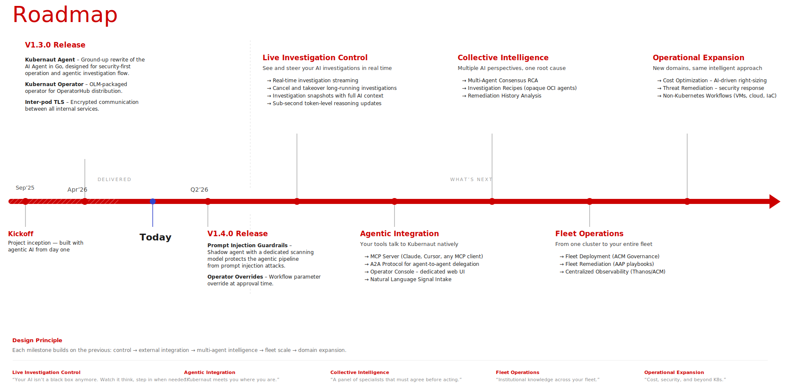

# Kubernaut Roadmap

Each milestone builds on the previous: **control** → **external integration** → **multi-agent intelligence** → **fleet scale** → **domain expansion**. See [#818](https://github.com/jordigilh/kubernaut/issues/818) for the full vision.

  

---

## v1.4 — Operator Overrides and Platform Hardening (current)

- **Prompt injection guardrails** — Shadow agent with a dedicated scanning model to protect the agentic pipeline against prompt injection attacks ([#601](https://github.com/jordigilh/kubernaut/issues/601))
- **Operator workflow/parameter override** — Operators can override workflow selection and parameters during RAR approval, with authwebhook validation ([#594](https://github.com/jordigilh/kubernaut/issues/594))
- **PagerDuty and Microsoft Teams** — New notification delivery channels alongside Slack and console ([#60](https://github.com/jordigilh/kubernaut/issues/60), [#593](https://github.com/jordigilh/kubernaut/issues/593))
- **Unified monitoring config** — Single `monitoring:` Helm block replacing per-component Prometheus/AlertManager keys, with OCP auto-detection ([#463](https://github.com/jordigilh/kubernaut/issues/463))
- **NetworkPolicies** — Default-deny network policies for all services based on the traffic matrix ([#285](https://github.com/jordigilh/kubernaut/issues/285))

Track progress on the [v1.4 milestone](https://github.com/jordigilh/kubernaut/milestone/5).

---

## Live Investigation Control

*See and steer your AI investigations in real time.* ([#822](https://github.com/jordigilh/kubernaut/issues/822))

- **Real-time investigation streaming** — Sub-second token-level reasoning updates streamed to the operator
- **Cancel and takeover** — Interrupt long-running investigations and take manual control
- **Investigation snapshots** — Full AI context captured at any point for audit and replay

---

## Agentic Integration

*Your tools talk to Kubernaut natively.*

- **MCP Server** — Investigate, enrich, and select workflows through any MCP-compatible interface — Claude, Cursor, Slack bots, or custom UIs ([#703](https://github.com/jordigilh/kubernaut/issues/703))
- **A2A Protocol** — External AI agents delegate remediation to Kubernaut and track task lifecycle via the [Agent-to-Agent](https://a2aproject.github.io/A2A/latest/specification/) standard ([#705](https://github.com/jordigilh/kubernaut/issues/705))
- **Kubernaut Console** — Web-based operator dashboard with chat UI, live remediation streaming, and workflow selection ([#713](https://github.com/jordigilh/kubernaut/issues/713))
- **Natural language signal intake** — Trigger investigations by describing the problem in plain text; Kubernaut extracts a structured signal and runs the full pipeline ([#714](https://github.com/jordigilh/kubernaut/issues/714))

  

---

## Collective Intelligence

*Multiple AI perspectives, one root cause.*

- **Multi-agent consensus RCA** — Ensemble investigation with independent LLM agents from different model families; a consolidator validates agreement and cross-examines on divergence ([#648](https://github.com/jordigilh/kubernaut/issues/648))
- **Investigation Prompt Bundles** — Operators inject SOPs into the investigation pipeline via Goose recipes packaged as OCI artifacts ([#711](https://github.com/jordigilh/kubernaut/issues/711))
- **Remediation history analysis** — LLM-driven review of past RCA and remediation chains to improve future investigation accuracy ([#842](https://github.com/jordigilh/kubernaut/issues/842))

---

## Fleet Operations

*From one cluster to your entire fleet.* ([#54](https://github.com/jordigilh/kubernaut/issues/54))

Single hub deployment manages remediations across multiple clusters using three purpose-built paths: K8s MCP for investigation, ACM for SA provisioning, and AAP for execution — with RHBK (Keycloak) JWT authentication.

- **Multi-cluster investigation** — KA investigates remote clusters via MCP with RHBK JWT authentication — cluster-agnostic RCA from a single hub
- **Fleet remediation** — AAP executes remediation playbooks on remote clusters with ephemeral SAs provisioned by ACM ManifestWork
- **Centralized observability** — Aggregated remediation metrics and audit trails across the fleet via Thanos and ACM Observability
- **Zero-footprint remote clusters** — Only an MCP server pod and existing ACM klusterlet on each managed cluster — no CRDs, no controllers

---

## Operational Expansion

*New domains, same intelligent approach.*

- **Cost optimization** — LLM-driven FinOps investigation and resource remediation using signals from Red Hat Cost Management (Koku), Kubecost, OpenCost, and VPA ([#555](https://github.com/jordigilh/kubernaut/issues/555))
- **Threat remediation** — LLM-driven investigation and response for security and compliance signals from Red Hat Advanced Cluster Security (RHACS), Falco, Trivy, and OPA ([#554](https://github.com/jordigilh/kubernaut/issues/554))
- **Non-Kubernetes workflows** — `targetSystem` field enables execution against external systems (VMs, cloud APIs, IaC) with EA evolution for unverifiable outcomes ([#739](https://github.com/jordigilh/kubernaut/issues/739))
