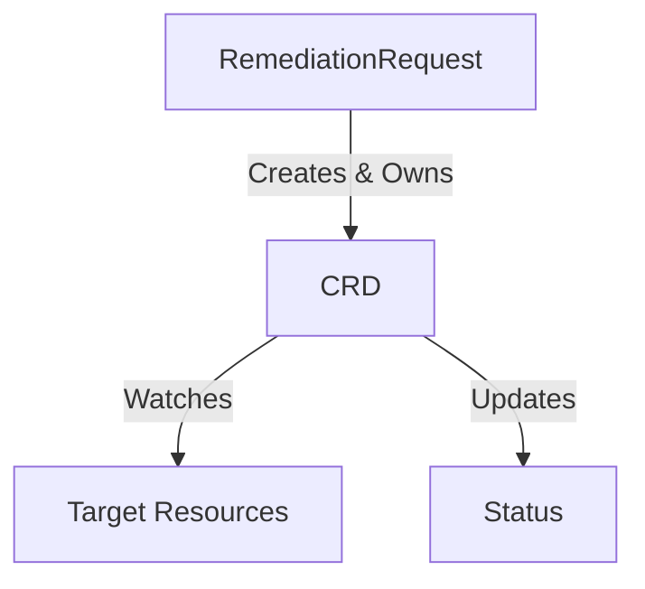
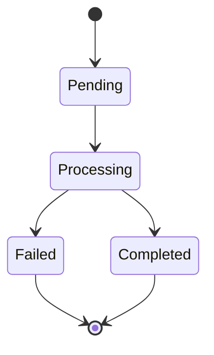
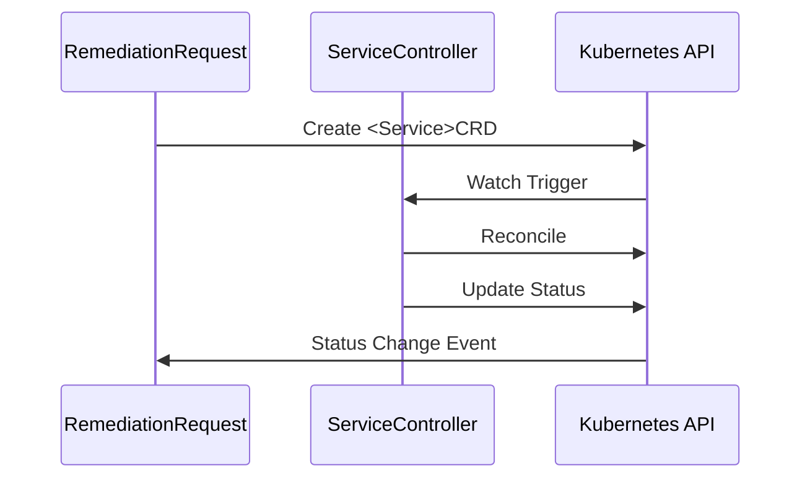

# Service Documentation Guide (V3.1)

**Status**: ✅ **CURRENT**
**Date**: 2025-11-19
**Version**: 3.1 (Parent guide with Implementation Plan Template integration)

**Replaces**: `archive/SERVICE_TEMPLATE_CREATION_PROCESS.md` (monolithic single-file approach)

---

## 🎯 **Quick Start**

### **Creating a New Service?**

**Step 1: Implementation** - Follow the day-by-day implementation process:
- 📘 [SERVICE_IMPLEMENTATION_PLAN_TEMPLATE.md](./SERVICE_IMPLEMENTATION_PLAN_TEMPLATE.md)
- 11-12 days, APDC-TDD methodology, integration-first testing
- Includes complete code examples, EOD templates, production readiness

**Step 2: Documentation** - Use this guide to structure your documentation:
- Copy from existing similar service (Services 1-5 are complete)
- Follow the standard document structure below
- Validate against quality checklist

**Quick Reference**:
- **For implementation**: Use [Implementation Plan Template](./SERVICE_IMPLEMENTATION_PLAN_TEMPLATE.md)
- **For documentation**: Use existing services as templates (see Reference Services below)

---

## 📚 **Reference Services (Complete Examples)**

### **Service 1: Remediation Processor** (`01-signalprocessing/`)
**Use as template for**: Services that process/enrich data

**Directory**: `docs/services/crd-controllers/01-signalprocessing/`

**Structure**:
```
01-signalprocessing/
├── overview.md                  # Main document with CRD schema
├── security-configuration.md    # RBAC, NetworkPolicy, Secrets
├── observability-logging.md     # Structured logging, tracing
├── metrics-slos.md              # Prometheus metrics, SLI/SLO
├── testing-strategy.md          # Unit/Integration/E2E tests
├── finalizers-lifecycle.md      # Cleanup coordination
├── controller-implementation.md # Reconciliation loop
└── data-handling-architecture.md # Audit & database patterns
```

**Key Patterns**:
- Data enrichment
- External HTTP service integration (Context Service)
- Classification logic
- Routing decisions

---

### **Service 2: AI Analysis** (`02-aianalysis/`)
**Use as template for**: Services with AI/ML integration

**Directory**: `docs/services/crd-controllers/02-aianalysis/`

**Key Patterns**:
- HolmesGPT AI provider integration
- Rego policy evaluation (Open Policy Agent)
- Child CRD management (AIApprovalRequest)
- Approval workflows (auto vs. manual)

**Special Files**:
- `ai-holmesgpt-approval.md` - AI provider and approval patterns
- `reconciliation-phases.md` - Multi-phase state machine

---

### **Service 3: Workflow Execution** (`03-workflowexecution/`)
**Use as template for**: Services that orchestrate multi-step processes

**Directory**: `docs/services/crd-controllers/03-workflowexecution/`

**Key Patterns**:
- Step orchestration
- Dependency resolution (DAG)
- Child CRD creation (KubernetesExecution)
- Parallel vs. sequential execution

**Special Files**:
- `orchestration-patterns.md` - Step coordination
- `dependency-resolution.md` - DAG execution

---

### **Service 4: Kubernetes Executor** (`04-kubernetesexecutor/`)
**Use as template for**: Services that execute actions via Kubernetes

**Directory**: `docs/services/crd-controllers/04-kubernetesexecutor/`

**Key Patterns**:
- Native Kubernetes Jobs for execution
- Per-action RBAC isolation
- Dry-run validation
- kubectl command execution
- GitOps-aware remediation

**Special Files**:
- `action-catalog.md` - Predefined action definitions
- `job-execution-patterns.md` - Job creation and monitoring

---

### **Service 5: Alert Remediation (Remediation Orchestrator)** (`05-remediationorchestrator/`)
**Use as template for**: Central orchestrators that coordinate multiple services

**Directory**: `docs/services/crd-controllers/05-remediationorchestrator/`

**Key Patterns**:
- Central orchestration (4 child CRDs)
- Phase timeout detection
- Cascade deletion management
- Cross-CRD status watching
- Escalation logic

**Special Files**:
- `orchestration-architecture.md` - Central coordination patterns
- `child-crd-management.md` - Multi-child CRD lifecycle

---

## 📋 **Standard Document Structure**

**📘 Implementation Note**: These documents are created during implementation following the [SERVICE_IMPLEMENTATION_PLAN_TEMPLATE.md](./SERVICE_IMPLEMENTATION_PLAN_TEMPLATE.md). See "Implementation Process" section below.

---

### **Required Documents** (All Services):

1. **`overview.md`** - Main document
   - **Version tracking** (version, last updated, status, changelog)
   - **Table of Contents** with deep anchor links
   - Service purpose and business requirements
   - CRD schema (TypeMeta, ObjectMeta, Spec, Status)
   - Architecture diagram (Mermaid)
   - Integration points
   - Phase/state machine diagram
   - **Phase-based implementation status** (if phased rollout)

2. **`BUSINESS_REQUIREMENTS.md`** - BR catalog ⭐ **NEW**
   - Master list of ALL business requirements
   - BR numbering, description, priority
   - Implementation status and test coverage
   - Deprecated/moved BR tracking
   - Links to implementation files and tests

3. **`BR_MAPPING.md`** - Test-BR traceability ⭐ **NEW** (Required for services with >10 BRs)
   - Maps umbrella BRs → sub-BRs → test files
   - Resolves BR numbering inconsistencies
   - Shows test coverage by BR
   - Essential for auditing and compliance

4. **`implementation-checklist.md`** - APDC-TDD phased checklist
   - **APDC phase breakdown** (Analysis → Plan → Do → Check)
   - **Time estimates per phase** (realistic hours/days)
   - **Critical path identification**
   - Phase-specific validation commands
   - Definition of Done criteria
   - **Template**: [SERVICE_IMPLEMENTATION_PLAN_TEMPLATE.md](./SERVICE_IMPLEMENTATION_PLAN_TEMPLATE.md)

5. **`security-configuration.md`**
   - ServiceAccount definition
   - ClusterRole with least-privilege RBAC
   - NetworkPolicy for ingress/egress
   - Secret management (Projected Volume pattern)
   - Security context (non-root, read-only filesystem)

6. **`observability-logging.md`**
   - Structured logging patterns
   - Correlation ID propagation
   - OpenTelemetry/Jaeger integration
   - Secret sanitization in logs
   - Debugging guidelines

7. **`metrics-slos.md`**
   - Service Level Indicators (SLIs)
   - Service Level Objectives (SLOs)
   - Prometheus metrics (Counter, Histogram, Gauge)
   - Grafana dashboard JSON
   - Alert rules (PromQL)

8. **`testing-strategy.md`**
   - Defense-in-depth testing approach
   - Unit tests (70%+ coverage, fake K8s client)
   - Integration tests (>50% coverage, real K8s API)
   - E2E tests (<10% coverage, complete workflows)
   - **Integration-first testing order** (Day 8: integration tests BEFORE unit tests)
   - **Table-driven testing patterns** (DescribeTable for 25-40% code reduction)
   - Code examples with **complete imports**
   - **Reference**: [Integration-First Testing Strategy](./SERVICE_IMPLEMENTATION_PLAN_TEMPLATE.md#day-8-integration-first-testing)

9. **`finalizers-lifecycle.md`** (CRD controllers only)
   - Finalizer naming convention
   - Cleanup logic
   - CRD lifecycle (create, update, delete)
   - Owner reference management
   - Cascade deletion patterns

10. **`controller-implementation.md`** (CRD controllers only)
    - Reconciliation loop logic
    - Phase transitions
    - Requeue strategies
    - Error handling patterns
    - Status update best practices

### **Optional Documents** (Service-Specific):

- **`COMMON_PITFALLS.md`** ⭐ **NEW** - Create when 5+ pitfalls identified
  - Documented common mistakes with business impact
  - Code examples (BAD vs. GOOD)
  - Automated detection commands
  - Prevention strategies
- `data-handling-architecture.md` - Database integration, audit patterns
- `integration-points.md` - External service dependencies
- `reconciliation-phases.md` - Detailed phase/state machine
- `action-catalog.md` - Action definitions (for executor services)
- `orchestration-patterns.md` - Step coordination (for workflow services)
- `child-crd-management.md` - Multi-child CRD patterns (for orchestrators)

---

## 🏛️ **Critical Architectural Patterns**

**These 8 patterns are MANDATORY for all CRD controllers** (from `MULTI_CRD_RECONCILIATION_ARCHITECTURE.md`)

### 1. Owner References & Cascade Deletion

**Pattern**: All child CRDs must be owned by their parent (e.g., `RemediationRequest` owns all service CRDs)

```go
import "sigs.k8s.io/controller-runtime/pkg/controller/controllerutil"

// Set owner reference for automatic cascade deletion
if err := controllerutil.SetControllerReference(&parentCRD, &childCRD, r.Scheme); err != nil {
    return ctrl.Result{}, fmt.Errorf("failed to set owner reference: %w", err)
}
```

**Purpose**: Automatic cleanup when parent is deleted (24h retention policy)

**Documentation**: Include in `finalizers-lifecycle.md`

---

### 2. Finalizers for Cleanup Coordination

**Pattern**: Use finalizers to ensure cleanup happens before CRD deletion

```go
const FinalizerName = "service.kubernaut.io/crd-cleanup"

func (r *Reconciler) reconcileDelete(ctx context.Context, crd *v1.ServiceCRD) (ctrl.Result, error) {
    if !controllerutil.ContainsFinalizer(crd, FinalizerName) {
        return ctrl.Result{}, nil
    }

    // Perform cleanup (persist audit, cleanup external resources)
    if err := r.cleanup(ctx, crd); err != nil {
        return ctrl.Result{}, err
    }

    // Remove finalizer to allow deletion
    controllerutil.RemoveFinalizer(crd, FinalizerName)
    return ctrl.Result{}, r.Update(ctx, crd)
}
```

**Purpose**: Persist audit trail to database before CRD deletion

**Documentation**: Include in `finalizers-lifecycle.md`

---

### 3. Watch-Based Status Coordination

**Pattern**: Parent CRDs watch child CRD status changes for coordination

```go
// In main.go setup
if err := c.Watch(
    &source.Kind{Type: &v1.ChildCRD{}},
    handler.EnqueueRequestsFromMapFunc(r.findParentForChild),
    predicate.ResourceVersionChangedPredicate{},
); err != nil {
    return err
}

func (r *Reconciler) findParentForChild(obj client.Object) []reconcile.Request {
    childCRD := obj.(*v1.ChildCRD)
    return []reconcile.Request{
        {NamespacedName: types.NamespacedName{
            Name:      childCRD.Spec.ParentRef.Name,
            Namespace: childCRD.Namespace,
        }},
    }
}
```

**Purpose**: Real-time parent-child coordination without polling

**Documentation**: Include in `controller-implementation.md`

---

### 4. Phase Timeout Detection & Escalation

**Pattern**: Detect stuck phases and escalate after timeout

```go
func (r *Reconciler) checkPhaseTimeout(crd *v1.ServiceCRD) bool {
    if crd.Status.PhaseStartTime.IsZero() {
        return false
    }

    elapsed := time.Since(crd.Status.PhaseStartTime.Time)
    timeout := r.getPhaseTimeout(crd.Status.Phase)

    return elapsed > timeout
}

func (r *Reconciler) handleTimeout(ctx context.Context, crd *v1.ServiceCRD) error {
    crd.Status.Phase = "Failed"
    crd.Status.Message = fmt.Sprintf("Phase %s exceeded timeout", crd.Status.Phase)

    // Emit event for visibility
    r.Recorder.Event(crd, "Warning", "PhaseTimeout", crd.Status.Message)

    return r.Status().Update(ctx, crd)
}
```

**Purpose**: Prevent stuck workflows, ensure timely escalation

**Documentation**: Include in `controller-implementation.md`

---

### 5. Event Emission for Visibility

**Pattern**: Emit Kubernetes events for all significant state changes

```go
import "k8s.io/client-go/tools/record"

// In reconciler struct
type Reconciler struct {
    client.Client
    Scheme   *runtime.Scheme
    Recorder record.EventRecorder  // Add this
}

// Emit events for visibility
r.Recorder.Event(crd, "Normal", "PhaseTransition",
    fmt.Sprintf("Transitioned from %s to %s", oldPhase, newPhase))

r.Recorder.Event(crd, "Warning", "ProcessingError",
    fmt.Sprintf("Failed to process: %v", err))

r.Recorder.Event(crd, "Normal", "Completed",
    "Processing completed successfully")
```

**Purpose**: Debugging, audit trail, user visibility

**Documentation**: Include in `observability-logging.md`

---

### 6. Optimized Requeue Strategy

**Pattern**: Use exponential backoff for transient errors, immediate requeue for phase transitions

```go
func (r *Reconciler) Reconcile(ctx context.Context, req ctrl.Request) (ctrl.Result, error) {
    // ... get CRD ...

    switch crd.Status.Phase {
    case "Processing":
        if err := r.process(ctx, crd); err != nil {
            if isTransientError(err) {
                // Exponential backoff for transient errors
                backoff := time.Duration(math.Pow(2, float64(crd.Status.RetryCount))) * time.Second
                return ctrl.Result{RequeueAfter: backoff}, nil
            }
            return ctrl.Result{}, err  // Permanent error
        }

        // Phase transition: immediate requeue
        crd.Status.Phase = "Completed"
        return ctrl.Result{Requeue: true}, r.Status().Update(ctx, crd)
    }
}
```

**Purpose**: Efficient resource usage, fast phase transitions

**Documentation**: Include in `controller-implementation.md`

---

### 7. Cross-CRD Reference Validation

**Pattern**: Validate parent CRD references exist before processing

```go
func (r *Reconciler) validateParentReference(ctx context.Context, crd *v1.ServiceCRD) error {
    parentRef := crd.Spec.ParentRef
    if parentRef == nil {
        return fmt.Errorf("missing parent reference")
    }

    parent := &v1.ParentCRD{}
    key := types.NamespacedName{
        Name:      parentRef.Name,
        Namespace: crd.Namespace,
    }

    if err := r.Get(ctx, key, parent); err != nil {
        if apierrors.IsNotFound(err) {
            return fmt.Errorf("parent CRD not found: %s", parentRef.Name)
        }
        return err
    }

    // Validate parent is in valid state
    if parent.Status.Phase == "Failed" {
        return fmt.Errorf("parent CRD is in failed state")
    }

    return nil
}
```

**Purpose**: Data integrity, prevent orphaned CRDs

**Documentation**: Include in `controller-implementation.md`

---

### 8. Controller-Specific Metrics

**Pattern**: Every controller must expose standard metrics

```go
import (
    "github.com/prometheus/client_golang/prometheus"
    "github.com/prometheus/client_golang/prometheus/promauto"
)

var (
    ReconciliationTotal = promauto.NewCounterVec(prometheus.CounterOpts{
        Name: "kubernaut_service_reconciliation_total",
        Help: "Total reconciliations by result",
    }, []string{"result"})  // success, error, requeue

    ReconciliationDuration = promauto.NewHistogramVec(prometheus.HistogramOpts{
        Name:    "kubernaut_service_reconciliation_duration_seconds",
        Help:    "Reconciliation duration by phase",
        Buckets: []float64{0.1, 0.5, 1.0, 2.5, 5.0, 10.0},
    }, []string{"phase"})

    PhaseTransitionsTotal = promauto.NewCounterVec(prometheus.CounterOpts{
        Name: "kubernaut_service_phase_transitions_total",
        Help: "Phase transitions by from/to phase",
    }, []string{"from_phase", "to_phase"})
)
```

**Purpose**: Observability, SLO tracking, debugging

**Documentation**: Include in `metrics-slos.md`

---

## ⚠️ **CRITICAL: BEHAVIOR & CORRECTNESS TESTING PROTOCOL** ⚠️

**🚨 READ THIS BEFORE WRITING ANY TEST CODE 🚨**

This protocol applies to **ALL services** (CRD controllers, Gateway, Data Storage, etc.)

### The Problem: Implementation-Focused Testing Anti-Pattern

**Common Mistake**: Writing tests that validate HOW the system works instead of WHAT it does.

**Example of BAD Test (Implementation-Focused)**:
```go
// ❌ BAD: Tests internal state and implementation details
It("should buffer alerts in Redis", func() {
    signal := &types.NormalizedSignal{...}
    aggregator.BufferFirstAlert(ctx, signal)

    // Testing Redis keys directly (implementation detail)
    bufferKey := "alert:buffer:prod-api:PodCrashLooping"
    bufferSize, _ := redisClient.LLen(ctx, bufferKey).Result()
    Expect(bufferSize).To(Equal(1))  // Checking exact buffer size

    // Testing internal TTL values (implementation detail)
    ttl, _ := redisClient.TTL(ctx, bufferKey).Result()
    Expect(ttl).To(BeNumerically("~", 60*time.Second, 5*time.Second))
})
```

**Why This is Bad**:
- ❌ Tightly coupled to Redis implementation
- ❌ Test breaks if we switch from Redis to PostgreSQL
- ❌ Tests HOW (Redis keys, TTL) instead of WHAT (business behavior)
- ❌ No clear business value being validated

**Example of GOOD Test (Behavior-Focused)**:
```go
// ✅ GOOD: Tests business behavior and correctness
It("should delay aggregation when storm threshold not reached", func() {
    // BUSINESS SCENARIO: Single pod crashes in prod-api
    signal := &types.NormalizedSignal{
        Namespace: "prod-api",
        AlertName: "PodCrashLooping",
        Resource: types.ResourceIdentifier{
            Kind: "Pod",
            Name: "payment-api-1",
        },
    }

    // BEHAVIOR: System accepts alert but delays aggregation
    _, shouldAggregate, err := aggregator.BufferFirstAlert(ctx, signal)

    // CORRECTNESS: Alert accepted, aggregation not triggered
    Expect(err).ToNot(HaveOccurred(), "System should accept first alert")
    Expect(shouldAggregate).To(BeFalse(), "System should delay aggregation below threshold")

    // BUSINESS OUTCOME: No CRD created yet (cost savings from delayed AI analysis)
    // This validates BR-GATEWAY-016: Buffer alerts before aggregation
})
```

**Why This is Good**:
- ✅ Tests WHAT the system does (delays aggregation)
- ✅ Tests through public API (BufferFirstAlert)
- ✅ Survives implementation changes (Redis → PostgreSQL)
- ✅ Clear business scenario and outcome
- ✅ Links to business requirement (BR-XXX)

---

### MANDATORY Test Structure Template

**Every test MUST follow this structure**:

```go
Context("when [BUSINESS SCENARIO]", func() {
    It("should [BUSINESS BEHAVIOR]", func() {
        // BUSINESS SCENARIO: [Describe real-world situation]
        // Example: "5 pods crash in rapid succession (storm detected)"

        // Setup: [Prepare test data]
        signal := &types.NormalizedSignal{...}

        // BEHAVIOR: [What does the system do?]
        // Example: "System buffers alerts until threshold is reached"
        result, err := systemUnderTest.DoSomething(ctx, signal)

        // CORRECTNESS: [Are the results correct?]
        // ❌ AVOID: Expect(result).ToNot(BeNil())
        // ❌ AVOID: Expect(internalState.buffer).To(HaveLen(5))
        // ❌ AVOID: Expect(redisClient.Get(ctx, "key")).To(Equal("value"))
        // ✅ GOOD: Expect(shouldAggregate).To(BeTrue())
        Expect(err).ToNot(HaveOccurred(), "System should [behavior]")
        Expect(result.ShouldAggregate).To(BeTrue(), "Aggregation should trigger at threshold")

        // BUSINESS OUTCOME: [What business value was validated?]
        // Example: "Cost savings: 5 alerts → 1 AI analysis (BR-GATEWAY-016)"
    })
})
```

---

### FORBIDDEN Testing Anti-Patterns

**Reference**: `.cursor/rules/08-testing-anti-patterns.mdc`

#### 1. NULL-TESTING (Weak Assertions)
```go
// ❌ BAD: Weak assertions that don't validate business logic
Expect(result).ToNot(BeNil())
Expect(list).ToNot(BeEmpty())
Expect(count).To(BeNumerically(">", 0))

// ✅ GOOD: Specific business assertions
Expect(result.Status).To(Equal("aggregated"))
Expect(result.AlertCount).To(Equal(5))
Expect(result.CostSavings).To(BeNumerically(">", 0.8))
```

#### 2. IMPLEMENTATION TESTING (Internal State)
```go
// ❌ BAD: Testing internal state and storage keys
Expect(aggregator.internalBuffer).To(HaveLen(5))
Expect(redisClient.Get(ctx, "alert:buffer:*")).To(Exist())
Expect(aggregator.windowStartTime).To(Equal(expectedTime))

// ✅ GOOD: Testing public API behavior
Expect(shouldAggregate).To(BeTrue())
Expect(windowID).ToNot(BeEmpty())
Expect(aggregatedCount).To(Equal(5))
```

#### 3. STATIC DATA TESTING (No Business Context)
```go
// ❌ BAD: Testing hardcoded values without context
Expect(result).To(Equal("success"))
Expect(status).To(Equal(200))

// ✅ GOOD: Testing business outcomes with context
Expect(result.Status).To(Equal("aggregated"), "Should aggregate when threshold reached")
Expect(response.StatusCode).To(Equal(202), "Should return Accepted for buffered alerts")
```

#### 4. LIBRARY TESTING (Framework Behavior)
```go
// ❌ BAD: Testing if Redis/K8s client works
It("should store data in Redis", func() {
    redisClient.Set(ctx, "key", "value", 0)
    val, _ := redisClient.Get(ctx, "key").Result()
    Expect(val).To(Equal("value"))
})

// ✅ GOOD: Testing business logic that uses Redis
It("should buffer alerts for storm aggregation", func() {
    _, shouldAggregate, err := aggregator.BufferFirstAlert(ctx, signal)
    Expect(err).ToNot(HaveOccurred())
    Expect(shouldAggregate).To(BeFalse(), "Should delay aggregation below threshold")
})
```

---

### Self-Review Checklist (MANDATORY After Writing Tests)

**Before committing tests, answer these questions**:

1. ❓ **Did I test WHAT the system does, or HOW it does it?**
   - ❌ If I tested Redis keys, buffer internals, TTL values → **REFACTOR**
   - ✅ If I tested business behavior and outcomes → **GOOD**

2. ❓ **Can I change the implementation (e.g., Redis → PostgreSQL) without breaking tests?**
   - ❌ If tests would break → **TOO COUPLED, REFACTOR**
   - ✅ If tests would still pass → **GOOD**

3. ❓ **Does each test have a clear business scenario?**
   - ❌ If test name is "should buffer alerts" → **TOO VAGUE**
   - ✅ If test name is "should delay aggregation when storm threshold not reached" → **GOOD**

4. ❓ **Are assertions specific and meaningful?**
   - ❌ If using `ToNot(BeNil())`, `ToNot(BeEmpty())`, `> 0` → **NULL-TESTING**
   - ✅ If using specific business values → **GOOD**

5. ❓ **Does each test link to a business requirement?**
   - ❌ If no BR-XXX reference → **MISSING BUSINESS CONTEXT**
   - ✅ If test validates BR-XXX-YYY → **GOOD**

---

### Automated Detection Commands

**Run before committing**:
```bash
# Detect NULL-TESTING anti-pattern
find test/ -name "*_test.go" -exec grep -H -n "ToNot(BeEmpty())\|ToNot(BeNil())\|BeNumerically(\">.*0)" {} \;

# Detect implementation testing (accessing internal state)
find test/ -name "*_test.go" -exec grep -H -n "\.internal\|\.buffer\|\.state\|redisClient\.\(Get\|Set\|LLen\|TTL\)" {} \;

# Detect missing BR references
find test/ -name "*_test.go" -exec grep -L "BR-" {} \;
```

**See Also**: `.cursor/rules/10-testing-behavior-correctness.mdc` (workspace rule for AI enforcement)

---

## 🚀 **Step-by-Step Process**

### **Step 1: Choose Reference Service** (5 minutes)

Pick the service most similar to yours:
- **Data processing?** → Use Service 1 (Remediation Processor)
- **AI/ML integration?** → Use Service 2 (AI Analysis)
- **Multi-step orchestration?** → Use Service 3 (Workflow Execution)
- **Action execution?** → Use Service 4 (Kubernetes Executor)
- **Central orchestrator?** → Use Service 5 (Alert Remediation)

### **Step 2: Copy Directory Structure** (10 minutes)

```bash
# Navigate to crd-controllers directory
cd docs/services/crd-controllers/

# Copy reference service directory
cp -r 01-signalprocessing/ 06-<new-service>/

# Or use ../development/templates/CRD_SERVICE_SPECIFICATION_TEMPLATE.md to understand structure
```

### **Step 3: Adapt Content** (Variable time)

For each document in the new directory:

1. **`overview.md`**:
   - Update service name and purpose
   - Define CRD schema (Spec, Status fields)
   - Update architecture diagram
   - Adjust integration points

2. **`security-configuration.md`**:
   - Update ServiceAccount name
   - Adjust RBAC permissions for service-specific needs
   - Update NetworkPolicy rules

3. **`observability-logging.md`**:
   - Update log field examples
   - Adjust correlation ID patterns
   - Update service-specific log queries

4. **`metrics-slos.md`**:
   - Define service-specific SLIs
   - Set appropriate SLO targets
   - Create Prometheus metrics
   - Define Grafana panels

5. **`testing-strategy.md`**:
   - Adjust coverage targets (70% unit, >50% integration, <10% E2E)
   - **Include Mermaid decision flowchart** for test level selection (HIGH priority for CRD controllers + Gateway)
   - **Add Test Level Selection guidelines** (when to use Unit/Integration/E2E)
   - **Include 5 Maintainability Decision Criteria** (mock complexity, readability, fragility, real value, maintenance cost)
   - **Add Realistic vs. Exhaustive Testing** section with service-specific requirement analysis
   - **Use DescribeTable (Go) or pytest.mark.parametrize (Python)** for state-based testing
   - **Include Anti-Patterns section** (over-extended tests, wrong level, redundant coverage)
   - Update test examples for service logic with service-specific scenarios
   - Ensure **complete imports** in all code snippets
   - Map tests to business requirements

6. **`finalizers-lifecycle.md`**:
   - Update finalizer naming (`<service>.kubernaut.io/<crd>-cleanup`)
   - Define service-specific cleanup logic
   - Update owner reference examples

7. **`controller-implementation.md`**:
   - Define service-specific reconciliation phases
   - Update requeue strategies
   - Adjust error handling patterns

### **Step 4: Add Visual Diagrams** (30 minutes)

Use Mermaid for diagrams in `overview.md`:

**Architecture Diagram**:


**State Machine Diagram**:


**Sequence Diagram**:


### **Step 5: Validate Documentation** (20 minutes)

**Checklist**:
- [ ] All required documents present (7 minimum)
- [ ] CRD schema complete (no `map[string]interface{}`)
- [ ] All code examples have complete imports
- [ ] Visual diagrams included in overview
- [ ] Cross-document links work
- [ ] Business requirements mapped (BR-XXX-YYY)
- [ ] Metrics follow Prometheus naming conventions
- [ ] Testing strategy aligns with `03-testing-strategy.mdc`
- [ ] Security follows least-privilege principle
- [ ] No fictional code references

### **Step 6: Cross-Reference Update** (10 minutes)

Update these documents to reference new service:
- `ENHANCEMENTS_COMPLETE_SUMMARY.md` - Add to service list
- `../development/templates/CRD_SERVICE_SPECIFICATION_TEMPLATE.md` - Update if pattern changes
- Parent/sibling service docs - Add integration references

---

## 🔨 **Implementation Process**

**BEFORE creating documentation, implement the service following the structured plan:**

### **Use the Implementation Plan Template**

📘 **[SERVICE_IMPLEMENTATION_PLAN_TEMPLATE.md](./SERVICE_IMPLEMENTATION_PLAN_TEMPLATE.md)**

**What it provides**:
- ✅ **12-day implementation timeline** with daily breakdown
- ✅ **APDC-TDD methodology** (Analysis → Plan → Do → Check)
- ✅ **Integration-first testing strategy** (5 critical tests on Day 8)
- ✅ **Table-driven testing patterns** (38% code reduction)
- ✅ **60+ complete code examples** (zero TODO placeholders)
- ✅ **Error handling philosophy template** (280 lines)
- ✅ **BR coverage matrix methodology** (97%+ target)
- ✅ **Production readiness checklist** (109-point assessment)
- ✅ **3 complete EOD templates** (Days 1, 4, 7)
- ✅ **Confidence assessment methodology** (evidence-based calculation)

**Timeline Overview**:
| Phase | Days | Focus | Deliverables |
|-------|------|-------|--------------|
| **Foundation** | 1 | Types, interfaces, K8s client | Package structure, interfaces |
| **Core Logic** | 2-6 | Business logic components | All components implemented |
| **Integration** | 7 | Server, API, metrics | Complete service |
| **Testing** | 8-10 | Integration + Unit tests | 70%+ coverage |
| **Finalization** | 11-12 | E2E, docs, production readiness | Ready for deployment |

**Key Methodologies**:

#### **APDC-TDD Phases**
1. **Analysis** (5-15 min): Comprehensive context understanding
2. **Plan** (10-20 min): Detailed implementation strategy
3. **Do** (Variable): RED → GREEN → REFACTOR with integration
4. **Check** (5-10 min): Comprehensive validation

#### **Integration-First Testing** ⭐
- **Day 8 Morning**: 5 critical integration tests (validates architecture)
- **Day 8-9 Afternoon**: Unit tests (fills in details)
- **Day 10**: E2E tests (validates complete workflows)

**Why integration-first?**
- Catches architectural issues 2 days earlier
- Validates component interactions before details
- Provides confidence for unit test implementation

#### **Table-Driven Testing** ⭐
- Use `DescribeTable` (Ginkgo) for multiple similar scenarios
- 25-40% less test code
- Easier to add new test cases (just add Entry)
- Better test organization and readability

**Example**:
```go
DescribeTable("should handle various scenarios",
    func(input InputType, expected OutputType) {
        result, err := component.Method(input)
        Expect(err).ToNot(HaveOccurred())
        Expect(result).To(Equal(expected))
    },
    Entry("scenario 1", input1, output1),
    Entry("scenario 2", input2, output2),
    Entry("scenario 3", input3, output3),
)
```

### **Documentation During Implementation**

**Create these documents as you implement** (not after):

**Day 1 EOD**: `implementation/phase0/01-day1-complete.md`
- Foundation setup, architecture decisions, confidence assessment

**Day 4 EOD**: `implementation/phase0/02-day4-midpoint.md`
- Midpoint review, components complete, blockers, velocity

**Day 6 EOD**: `implementation/design/ERROR_HANDLING_PHILOSOPHY.md`
- Error classification, retry strategy, circuit breakers

**Day 7 EOD**: `implementation/phase0/03-day7-complete.md`
- Integration ready, metrics implemented, test infrastructure ready

**Day 9 EOD**: `implementation/testing/BR_COVERAGE_MATRIX.md`
- BR-to-test mapping, coverage calculation, gap analysis

**Day 11**: All standard documentation (see "Standard Document Structure" above)

**Day 12**: `implementation/00-HANDOFF-SUMMARY.md`
- Executive summary, architecture, key decisions, lessons learned

### **After Implementation: Finalize Documentation**

Once implementation is complete (Day 12), use this guide to:
1. ✅ Validate all required documents are present
2. ✅ Ensure documentation follows standard structure
3. ✅ Add visual diagrams (Mermaid)
4. ✅ Complete quality checklist
5. ✅ Update cross-references

**See "Step-by-Step Process" above for detailed documentation guidance.**

---

## 📊 **Metrics Implementation Guidance**

### Standard Metrics for All Services

**Every service must implement these core metrics** using `promauto` for automatic registration:

```go
package service

import (
    "github.com/prometheus/client_golang/prometheus"
    "github.com/prometheus/client_golang/prometheus/promauto"
)

var (
    // Counter: Total entities processed
    EntitiesProcessedTotal = promauto.NewCounterVec(prometheus.CounterOpts{
        Name: "kubernaut_service_entities_processed_total",
        Help: "Total number of entities processed by service",
    }, []string{"status", "namespace"})  // status: success, error

    // Histogram: Processing duration by phase
    ProcessingDuration = promauto.NewHistogramVec(prometheus.HistogramOpts{
        Name:    "kubernaut_service_processing_duration_seconds",
        Help:    "Duration of processing operations by phase",
        Buckets: []float64{0.1, 0.5, 1.0, 2.5, 5.0, 10.0, 30.0},
    }, []string{"phase"})

    // Gauge: Current active processing
    ActiveProcessingGauge = promauto.NewGauge(prometheus.GaugeOpts{
        Name: "kubernaut_service_active_processing",
        Help: "Number of entities currently being processed",
    })

    // Counter: Errors by type and phase
    ErrorsTotal = promauto.NewCounterVec(prometheus.CounterOpts{
        Name: "kubernaut_service_errors_total",
        Help: "Total errors encountered during processing",
    }, []string{"error_type", "phase"})
)
```

### Prometheus Naming Conventions

- **Prefix**: `kubernaut_<service>_`
- **Suffix**: `_total` (counters), `_seconds` (histograms/summaries)
- **Labels**: Use lowercase with underscores (e.g., `error_type`, `from_phase`)

### Grafana Dashboard Queries

**Standard queries for all services**:

```promql
# Processing rate (entities/sec)
rate(kubernaut_service_entities_processed_total[5m])

# Processing duration by phase (p95)
histogram_quantile(0.95, rate(kubernaut_service_processing_duration_seconds_bucket[5m]))

# Error rate by phase
rate(kubernaut_service_errors_total[5m]) / rate(kubernaut_service_entities_processed_total[5m])

# Active processing queue depth
kubernaut_service_active_processing

# Success rate (percentage)
sum(rate(kubernaut_service_entities_processed_total{status="success"}[5m])) /
sum(rate(kubernaut_service_entities_processed_total[5m])) * 100
```

**Documentation**: Include in `metrics-slos.md`

---

## 💾 **Database Integration & Dual Audit System**

### Dual Audit Architecture

**All services must implement dual audit** (from `MULTI_CRD_RECONCILIATION_ARCHITECTURE.md`):

1. **CRDs**: Real-time execution state + 24-hour review window
2. **Database**: Long-term compliance + post-mortem analysis

### Audit Data Persistence Pattern

```go
type ServiceReconciler struct {
    client.Client
    Scheme         *runtime.Scheme
    BusinessLogic  BusinessComponent
    AuditStorage   storage.AuditStorageClient  // Database client
}

func (r *ServiceReconciler) reconcileCompleted(ctx context.Context, crd *v1.ServiceCRD) (ctrl.Result, error) {
    // Persist audit trail to database BEFORE CRD cleanup
    auditRecord := &storage.ServiceAudit{
        RemediationID:    crd.Spec.RemediationRef.Name,
        EntityID:         crd.Spec.EntityID,
        ProcessingPhases: r.buildPhaseAudit(crd),
        CompletedAt:      time.Now(),
        Status:           "completed",
        Metadata:         crd.Spec.Metadata,
    }

    if err := r.AuditStorage.StoreServiceAudit(ctx, auditRecord); err != nil {
        r.Log.Error(err, "Failed to store audit")
        AuditStorageErrorsTotal.WithLabelValues("store_failed").Inc()
        // Don't fail reconciliation - audit is best-effort
    } else {
        AuditStorageSuccessTotal.Inc()
    }

    return ctrl.Result{}, nil
}
```

### Audit Schema Template

```go
type ServiceAudit struct {
    ID               string          `json:"id" db:"id"`
    RemediationID    string          `json:"remediation_id" db:"remediation_id"`
    EntityID         string          `json:"entity_id" db:"entity_id"`
    ProcessingPhases []ProcessingPhase `json:"processing_phases"`

    // Service-specific results
    Phase1Results    interface{} `json:"phase1_results"`
    Phase2Results    interface{} `json:"phase2_results"`

    // Metadata
    CompletedAt time.Time `json:"completed_at" db:"completed_at"`
    Status      string    `json:"status" db:"status"`
    ErrorMessage string   `json:"error_message,omitempty"`
}
```

### Audit Metrics

```go
var (
    AuditStorageSuccessTotal = promauto.NewCounter(prometheus.CounterOpts{
        Name: "kubernaut_service_audit_storage_success_total",
        Help: "Total successful audit storage operations",
    })

    AuditStorageErrorsTotal = promauto.NewCounterVec(prometheus.CounterOpts{
        Name: "kubernaut_service_audit_storage_errors_total",
        Help: "Total audit storage errors by type",
    }, []string{"error_type"})

    AuditStorageDuration = promauto.NewHistogram(prometheus.HistogramOpts{
        Name:    "kubernaut_service_audit_storage_duration_seconds",
        Help:    "Duration of audit storage operations",
        Buckets: []float64{0.01, 0.05, 0.1, 0.25, 0.5, 1.0},
    })
)
```

**Database Service**: Data Storage Service (Port 8085)

**Documentation**: Include in `data-handling-architecture.md`

---

## ⚠️ **Common Pitfalls to Avoid**

### CRD Controller Pitfalls

1. **Missing Owner References**
   - ❌ **Problem**: Child CRDs not owned by parent → orphaned CRDs after parent deletion
   - ✅ **Solution**: Always use `controllerutil.SetControllerReference()` when creating child CRDs
   - **Impact**: CRDs accumulate, namespace pollution, cleanup failures

2. **Finalizer Cleanup Failures**
   - ❌ **Problem**: Removing finalizer before audit persistence → data loss
   - ✅ **Solution**: Persist audit to database BEFORE removing finalizer
   - **Impact**: Compliance violations, lost audit trail

3. **Event Emission Gaps**
   - ❌ **Problem**: No events for significant state changes → debugging difficulties
   - ✅ **Solution**: Emit events for: phase transitions, errors, completions
   - **Impact**: Poor observability, difficult troubleshooting

4. **Phase Timeout Detection Missing**
   - ❌ **Problem**: No timeout detection → stuck workflows
   - ✅ **Solution**: Implement timeout checks with escalation logic
   - **Impact**: Workflows hang indefinitely, resource waste

5. **Inefficient Requeue Strategy**
   - ❌ **Problem**: Immediate requeue on all errors → API server overload
   - ✅ **Solution**: Use exponential backoff for transient errors
   - **Impact**: Performance degradation, rate limiting

6. **Cross-CRD Reference Validation Missing**
   - ❌ **Problem**: No parent reference validation → orphaned child CRDs
   - ✅ **Solution**: Validate parent exists and is in valid state
   - **Impact**: Data integrity issues, orphaned resources

7. **Incomplete Metrics**
   - ❌ **Problem**: Missing standard metrics → no observability
   - ✅ **Solution**: Implement all 8 standard metrics (see Pattern #8)
   - **Impact**: Cannot track SLOs, difficult debugging

8. **Watch-Based Coordination Missing**
   - ❌ **Problem**: Polling for child status → inefficient, delayed
   - ✅ **Solution**: Use Kubernetes watches for real-time coordination
   - **Impact**: Slow response times, resource waste

### Testing Pitfalls

9. **NULL-TESTING Anti-Pattern**
   - ❌ **Problem**: Weak assertions (`ToNot(BeNil())`, `> 0`)
   - ✅ **Solution**: Use specific business assertions (see Testing Protocol above)
   - **Impact**: Tests pass but don't validate business logic

10. **Implementation Testing**
    - ❌ **Problem**: Testing internal state instead of behavior
    - ✅ **Solution**: Test through public API, validate business outcomes
    - **Impact**: Brittle tests, breaks on refactoring

---

## 📊 **Service Status Tracking**

| # | Service Name | CRD Name | Directory | Status | Documents |
|---|-------------|----------|-----------|--------|-----------|
| 1 | Remediation Processor | RemediationProcessing | `01-signalprocessing/` | ✅ 100% | 8 files |
| 2 | AI Analysis | AIAnalysis | `02-aianalysis/` | ✅ 100% | 9 files |
| 3 | Workflow Execution | WorkflowExecution | `03-workflowexecution/` | ✅ 100% | 8 files |
| 4 | Kubernetes Executor | KubernetesExecution | `04-kubernetesexecutor/` | ✅ 100% | 8 files |
| 5 | Alert Remediation | RemediationRequest | `05-remediationorchestrator/` | ✅ 100% | 9 files |
| 6 | Notification Service | N/A (stateless) | `../stateless/06-notification/` | ✅ 100% | 7 files |
| 7-11 | Future Services | TBD | TBD | 🔴 TODO | - |

**Total Documentation**: 9,469 lines across 78 files

---

## 🎯 **Quality Standards & Detailed Checklist**

All service documentation must meet these standards. Use this comprehensive 40-point checklist before finalizing documentation:

### **Content Completeness** (14 items)

- [ ] Service name, port, CRD name documented
- [ ] Business requirements (BR-XXX-YYY) listed and mapped
- [ ] CRD Design document linked (if exists)
- [ ] All 7 required documents present (overview, security, observability, metrics, testing, finalizers, controller)
- [ ] Optional documents included where applicable
- [ ] All 8 architectural patterns documented (owner refs, finalizers, watches, timeouts, events, requeue, validation, metrics)
- [ ] CRD schema specification complete (no `map[string]interface{}`)
- [ ] Controller implementation with all phases documented
- [ ] Prometheus metrics (8+ metrics minimum)
- [ ] Testing strategy (Unit/Integration/E2E) with coverage targets
- [ ] Database integration documented (dual audit system)
- [ ] Dependencies listed (external services, database, existing code)
- [ ] RBAC configuration provided
- [ ] Implementation checklist complete

### **Architecture Compliance** (12 items)

- [ ] References `MULTI_CRD_RECONCILIATION_ARCHITECTURE.md`
- [ ] References `.cursor/rules/03-testing-strategy.mdc`
- [ ] References CRD design document (if exists)
- [ ] Owner references pattern included
- [ ] Finalizers pattern included
- [ ] Watch-based coordination explained
- [ ] Timeout detection included
- [ ] Event emission included
- [ ] Optimized requeue strategy included
- [ ] Cross-CRD validation included
- [ ] Controller metrics included
- [ ] Dual audit system included

### **Code Examples** (8 items)

- [ ] All code examples use correct package names
- [ ] No fictional file paths referenced
- [ ] All code examples have complete imports
- [ ] Existing code verified before referencing
- [ ] Test examples use Ginkgo/Gomega (or pytest for Python)
- [ ] Test examples map to business requirements (BR-XXX)
- [ ] Test examples follow behavior/correctness protocol
- [ ] Metrics examples use `promauto`

### **Documentation Quality** (8 items)

- [ ] Clear section headers with consistent formatting
- [ ] Code blocks properly formatted with language tags
- [ ] Tables properly aligned
- [ ] Visual diagrams included (Mermaid)
- [ ] No misleading claims or outdated information
- [ ] Effort estimates realistic and justified
- [ ] Cross-document links work correctly
- [ ] Follows behavior/correctness testing protocol

### **High-Level Standards**

**Completeness**:
- ✅ All required documents present
- ✅ All code examples executable (complete imports)
- ✅ All diagrams clear and accurate
- ✅ All cross-references valid

**Accuracy**:
- ✅ No fictional code references
- ✅ All type definitions complete (no `map[string]interface{}`)
- ✅ All metrics follow Prometheus conventions
- ✅ All RBAC follows least-privilege

**Consistency**:
- ✅ Directory structure matches template
- ✅ Naming conventions consistent
- ✅ Testing strategy aligns with rule
- ✅ Security patterns consistent
- ✅ All 8 architectural patterns implemented

**Maintainability**:
- ✅ Focused documents (not monolithic)
- ✅ Clear separation of concerns
- ✅ Easy to navigate
- ✅ Well-organized subdirectories

---

## 🔗 **Key Reference Documents**

**Implementation & Templates**:
- 📘 **[SERVICE_IMPLEMENTATION_PLAN_TEMPLATE.md](./SERVICE_IMPLEMENTATION_PLAN_TEMPLATE.md)** - ⭐ **Day-by-day implementation guide** (11-12 days, APDC-TDD, integration-first testing)
- [`CRD Service Specification Template`](../development/templates/CRD_SERVICE_SPECIFICATION_TEMPLATE.md) - Template structure reference
- `.cursor/rules/03-testing-strategy.mdc` - Testing framework rules
- `.cursor/rules/00-core-development-methodology.mdc` - TDD methodology

**Architecture**:
- `MULTI_CRD_RECONCILIATION_ARCHITECTURE.md` - CRD patterns
- `../architecture/decisions/005-owner-reference-architecture.md` - Owner reference patterns
- `APPROVED_MICROSERVICES_ARCHITECTURE.md` - Overall system architecture

**Validation & Planning**:
- `VALIDATION_EXECUTION_REPORT.md` - Validation results
- `APPROVED_ENHANCEMENTS_PLAN.md` - Enhancement roadmap
- `TEST_MIGRATION_STRATEGY.md` - Test migration approach

**Summary Documents**:
- `ENHANCEMENTS_COMPLETE_SUMMARY.md` - Overall project status
- `PHASE_1_TESTING_DOCS_COMPLETE.md` - Testing documentation status

---

## 💡 **Pro Tips**

### **Copy Smart, Not Hard**:
- Start with the most similar service
- Copy entire directory, then adapt
- Preserve structure, update content

### **Visual Diagrams Matter**:
- Add diagrams early (helps clarify architecture)
- Use Mermaid (renders in Markdown)
- Keep diagrams simple and focused

### **Complete Imports Always**:
- Every Go code snippet must have imports
- Include package declaration
- Show all dependencies explicitly

### **Defense-in-Depth Testing**:
- Intentional overlap is good (safety-critical)
- Unit: 70%+, Integration: >50%, E2E: <10%
- Total >130% is expected and correct

### **Cross-Document Consistency**:
- Keep terminology consistent
- Use same CRD field names everywhere
- Align security patterns across services

---

## 📅 **Estimated Effort**

### **Implementation Effort** (See [Implementation Plan Template](./SERVICE_IMPLEMENTATION_PLAN_TEMPLATE.md))
- **Total**: 11-12 days (88-96 hours)
- **Day 1**: Foundation (8h)
- **Days 2-6**: Core implementation (40h)
- **Day 7**: Integration (8h)
- **Days 8-10**: Testing (24h)
- **Days 11-12**: Documentation + Production readiness (16h)

### **Documentation Effort** (This Guide)
| Activity | Time (per service) |
|----------|-------------------|
| Choose reference service | 5 min |
| Copy directory structure | 10 min |
| Adapt overview.md | 2-3 hours |
| Adapt security-configuration.md | 1-2 hours |
| Adapt observability-logging.md | 1-2 hours |
| Adapt metrics-slos.md | 2-3 hours |
| Adapt testing-strategy.md | 3-4 hours |
| Adapt finalizers-lifecycle.md | 1 hour |
| Adapt controller-implementation.md | 2-3 hours |
| Add visual diagrams | 30 min |
| Validate documentation | 20 min |
| Update cross-references | 10 min |
| **TOTAL** | **12-18 hours** |

**Note**: Documentation is created **during** implementation (Days 1-12), not as a separate phase.

**Confidence**: 90% (Based on services 1-5 completion)

---

## ✅ **Success Criteria**

Documentation is complete when:
1. ✅ All required documents present and adapted
2. ✅ All code snippets have complete imports
3. ✅ Visual diagrams included in overview
4. ✅ Cross-references validated
5. ✅ Quality checklist passed
6. ✅ Testing strategy aligns with `03-testing-strategy.mdc`
7. ✅ No `map[string]interface{}` in type definitions
8. ✅ Security follows least-privilege principle

---

## 📚 **Enhanced Testing Strategy Reference**

**All 11 services now include comprehensive testing guidance** (as of October 2025):

### **Core Testing Strategy Rule**
- [03-testing-strategy.mdc](mdc:.cursor/rules/03-testing-strategy.mdc) - Foundational testing strategy with pyramid approach and defense-in-depth

### **Service-Specific Testing Strategies with Full Mermaid Diagrams**

**CRD Controllers** (HIGH priority):
1. [01-signalprocessing/testing-strategy.md](mdc:docs/services/crd-controllers/01-signalprocessing/testing-strategy.md) - Alert classification testing
2. [02-aianalysis/testing-strategy.md](mdc:docs/services/crd-controllers/02-aianalysis/testing-strategy.md) - AI/ML and Rego policy testing
3. [03-workflowexecution/testing-strategy.md](mdc:docs/services/crd-controllers/03-workflowexecution/testing-strategy.md) - Orchestration and dependency testing
4. [04-kubernetesexecutor/testing-strategy.md](mdc:docs/services/crd-controllers/04-kubernetesexecutor/testing-strategy.md) - Action validation and Job testing
5. [05-remediationorchestrator/testing-strategy.md](mdc:docs/services/crd-controllers/05-remediationorchestrator/testing-strategy.md) - CRD lifecycle testing

**Gateway Service** (HIGH priority):
6. [gateway-service/testing-strategy.md](mdc:docs/services/stateless/gateway-service/testing-strategy.md) - HTTP routing and webhook testing

**Stateless Services** (MEDIUM priority):
7. [context-api/testing-strategy.md](mdc:docs/services/stateless/context-api/testing-strategy.md) - Query and caching testing
8. [data-storage/testing-strategy.md](mdc:docs/services/stateless/data-storage/testing-strategy.md) - Vector DB and persistence testing
9. [holmesgpt-api/testing-strategy.md](mdc:docs/services/stateless/holmesgpt-api/testing-strategy.md) - LLM and prompt testing (Python)
10. [notification-service/testing-strategy.md](mdc:docs/services/stateless/notification-service/testing-strategy.md) - Multi-channel notification testing
11. [dynamic-toolset/testing-strategy.md](mdc:docs/services/stateless/dynamic-toolset/testing-strategy.md) - Service discovery testing

### **What Each Service Contains**
Each service testing strategy includes:
- **🗺️ Mermaid Decision Flowchart** - Visual guide for test level selection (Unit/Integration/E2E)
- **📋 Test Level Selection Guidelines** - When to use each test level with service-specific examples
- **🧭 5 Maintainability Decision Criteria** - Questions to ask before writing unit tests:
  1. Mock Complexity (>N lines?)
  2. Readability (understandable in 2 minutes?)
  3. Fragility (breaks on internal changes?)
  4. Real Value (testing logic vs. infrastructure?)
  5. Maintenance Cost (which level costs less?)
- **🎯 Realistic vs. Exhaustive Testing** - Requirement-driven coverage with:
  - Business requirement analysis (BR-XXX-YYY)
  - Requirement dimensions matrix
  - DescribeTable (Go) or pytest.mark.parametrize (Python) examples
  - Decision criteria: Is this test necessary?
- **⚠️ Anti-Patterns to AVOID** - Three critical anti-patterns:
  1. Over-Extended Unit Tests (excessive mocking)
  2. Wrong Test Level (testing infrastructure in unit tests)
  3. Redundant Coverage (same test at multiple levels)

### **Key Testing Patterns**
- **Go Services**: Use Ginkgo `DescribeTable` for state-based testing (10/11 services)
- **Python Service**: Use `@pytest.mark.parametrize` for parametrized testing (HolmesGPT API)
- **Service-Specific Examples**: All examples tailored to each service's domain
- **Maintainability-First**: Prioritize simplicity and maintainability over exhaustive coverage

---

**Document Status**: ✅ **CURRENT**
**Last Updated**: 2025-11-19 (Hierarchical Update: Established parent-child relationship with Implementation Plan Template)
**Version**: 3.1
**Maintained By**: Development Team

**Previous Version**: 3.0 (Comprehensive Update)
**Archived Template**: `archive/SERVICE_TEMPLATE_CREATION_PROCESS.md` (deprecated, deleted)

**Changes in v3.1**:
- ⭐ **Added "Implementation Process" section** with Implementation Plan Template references
- ⭐ **Updated Quick Start** with implementation-first workflow (Step 1: Implementation → Step 2: Documentation)
- Added implementation timeline and APDC-TDD methodology overview
- Enhanced cross-references to SERVICE_IMPLEMENTATION_PLAN_TEMPLATE.md throughout
- Updated estimated effort to distinguish implementation (11-12 days) vs. documentation (12-18 hours) time
- Clarified that documentation is created **during** implementation, not as separate phase
- Added integration-first testing and table-driven testing references

**Changes in v3.0**:
- Added "Critical Architectural Patterns" (8 mandatory patterns)
- Added "Metrics Implementation Guidance" (Prometheus + Grafana)
- Added "Database Integration & Dual Audit System"
- Added "Common Pitfalls to Avoid" (10 pitfalls)
- Expanded "Quality Standards" with detailed 40-point checklist
- Added "Behavior & Correctness Testing Protocol" (comprehensive)

