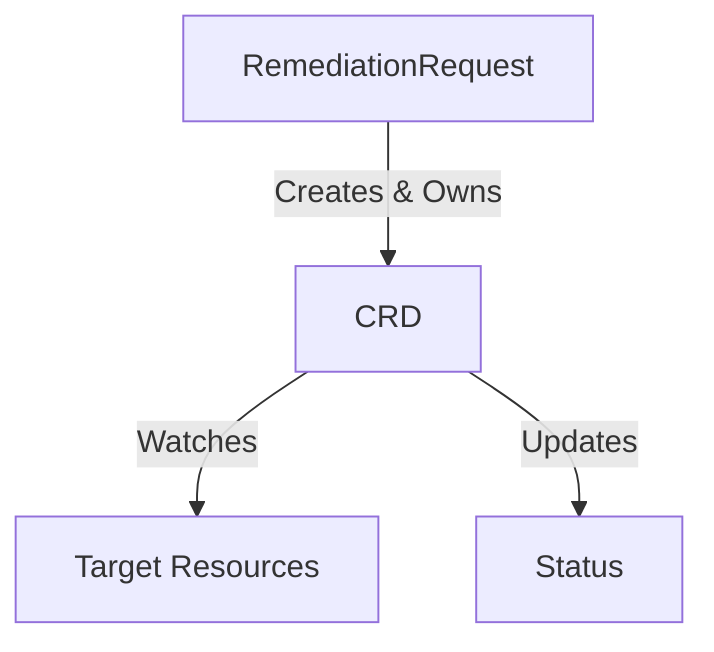
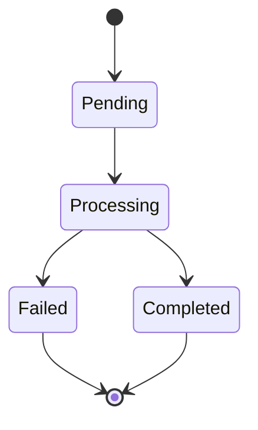
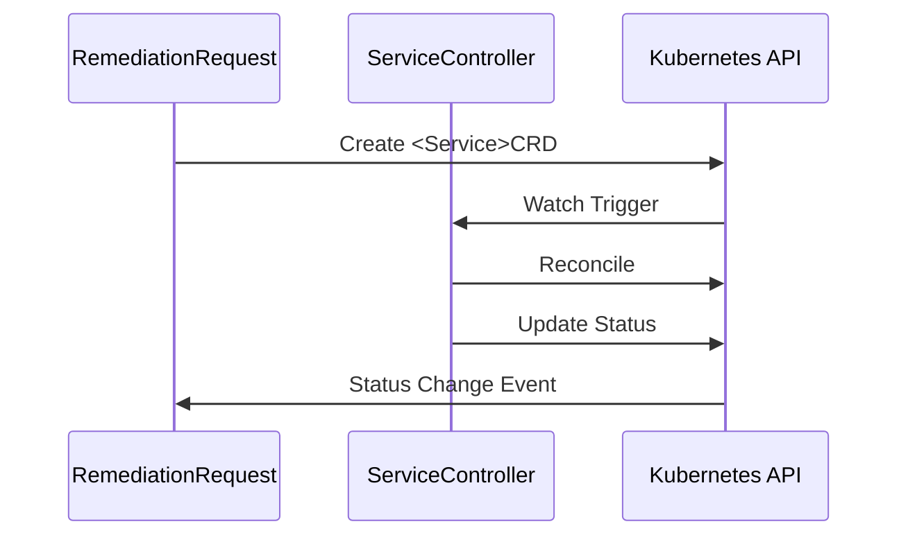

# Service Documentation Guide (V2)

**Status**: ✅ **CURRENT**
**Date**: 2025-01-15
**Version**: 2.0 (Subdirectory-based multi-document architecture)

**Replaces**: `archive/SERVICE_TEMPLATE_CREATION_PROCESS.md` (monolithic single-file approach)

---

## 🎯 **Quick Start**

Creating documentation for a new service? **Use existing services as templates!**

All 5 CRD services (1-5) are **complete** and follow the same structure. Copy and adapt from the most similar service.

---

## 📚 **Reference Services (Complete Examples)**

### **Service 1: Remediation Processor** (`01-signalprocessing/`)
**Use as template for**: Services that process/enrich data

**Directory**: `docs/services/crd-controllers/01-signalprocessing/`

**Structure**:
```
01-signalprocessing/
├── overview.md                  # Main document with CRD schema
├── security-configuration.md    # RBAC, NetworkPolicy, Secrets
├── observability-logging.md     # Structured logging, tracing
├── metrics-slos.md              # Prometheus metrics, SLI/SLO
├── testing-strategy.md          # Unit/Integration/E2E tests
├── finalizers-lifecycle.md      # Cleanup coordination
├── controller-implementation.md # Reconciliation loop
└── data-handling-architecture.md # Audit & database patterns
```

**Key Patterns**:
- Data enrichment
- External HTTP service integration (Context Service)
- Classification logic
- Routing decisions

---

### **Service 2: AI Analysis** (`02-aianalysis/`)
**Use as template for**: Services with AI/ML integration

**Directory**: `docs/services/crd-controllers/02-aianalysis/`

**Key Patterns**:
- HolmesGPT AI provider integration
- Rego policy evaluation (Open Policy Agent)
- Child CRD management (AIApprovalRequest)
- Approval workflows (auto vs. manual)

**Special Files**:
- `ai-holmesgpt-approval.md` - AI provider and approval patterns
- `reconciliation-phases.md` - Multi-phase state machine

---

### **Service 3: Workflow Execution** (`03-workflowexecution/`)
**Use as template for**: Services that orchestrate multi-step processes

**Directory**: `docs/services/crd-controllers/03-workflowexecution/`

**Key Patterns**:
- Step orchestration
- Dependency resolution (DAG)
- Child CRD creation (KubernetesExecution)
- Parallel vs. sequential execution

**Special Files**:
- `orchestration-patterns.md` - Step coordination
- `dependency-resolution.md` - DAG execution

---

### **Service 4: Kubernetes Executor** (`04-kubernetesexecutor/`)
**Use as template for**: Services that execute actions via Kubernetes

**Directory**: `docs/services/crd-controllers/04-kubernetesexecutor/`

**Key Patterns**:
- Native Kubernetes Jobs for execution
- Per-action RBAC isolation
- Dry-run validation
- kubectl command execution
- GitOps-aware remediation

**Special Files**:
- `action-catalog.md` - Predefined action definitions
- `job-execution-patterns.md` - Job creation and monitoring

---

### **Service 5: Alert Remediation (Remediation Orchestrator)** (`05-remediationorchestrator/`)
**Use as template for**: Central orchestrators that coordinate multiple services

**Directory**: `docs/services/crd-controllers/05-remediationorchestrator/`

**Key Patterns**:
- Central orchestration (4 child CRDs)
- Phase timeout detection
- Cascade deletion management
- Cross-CRD status watching
- Escalation logic

**Special Files**:
- `orchestration-architecture.md` - Central coordination patterns
- `child-crd-management.md` - Multi-child CRD lifecycle

---

## 📋 **Standard Document Structure**

### **Required Documents** (All Services):

1. **`overview.md`** - Main document
   - Service purpose and business requirements
   - CRD schema (TypeMeta, ObjectMeta, Spec, Status)
   - Architecture diagram (Mermaid)
   - Integration points
   - Phase/state machine diagram

2. **`security-configuration.md`**
   - ServiceAccount definition
   - ClusterRole with least-privilege RBAC
   - NetworkPolicy for ingress/egress
   - Secret management (Projected Volume pattern)
   - Security context (non-root, read-only filesystem)

3. **`observability-logging.md`**
   - Structured logging patterns
   - Correlation ID propagation
   - OpenTelemetry/Jaeger integration
   - Secret sanitization in logs
   - Debugging guidelines

4. **`metrics-slos.md`**
   - Service Level Indicators (SLIs)
   - Service Level Objectives (SLOs)
   - Prometheus metrics (Counter, Histogram, Gauge)
   - Grafana dashboard JSON
   - Alert rules (PromQL)

5. **`testing-strategy.md`**
   - Defense-in-depth testing approach
   - Unit tests (70%+ coverage, fake K8s client)
   - Integration tests (>50% coverage, real K8s API)
   - E2E tests (<10% coverage, complete workflows)
   - Code examples with **complete imports**

6. **`finalizers-lifecycle.md`**
   - Finalizer naming convention
   - Cleanup logic
   - CRD lifecycle (create, update, delete)
   - Owner reference management
   - Cascade deletion patterns

7. **`controller-implementation.md`**
   - Reconciliation loop logic
   - Phase transitions
   - Requeue strategies
   - Error handling patterns
   - Status update best practices

### **Optional Documents** (Service-Specific):

- `data-handling-architecture.md` - Database integration, audit patterns
- `integration-points.md` - External service dependencies
- `reconciliation-phases.md` - Detailed phase/state machine
- `action-catalog.md` - Action definitions (for executor services)
- `orchestration-patterns.md` - Step coordination (for workflow services)
- `child-crd-management.md` - Multi-child CRD patterns (for orchestrators)

---

## 🚀 **Step-by-Step Process**

### **Step 1: Choose Reference Service** (5 minutes)

Pick the service most similar to yours:
- **Data processing?** → Use Service 1 (Remediation Processor)
- **AI/ML integration?** → Use Service 2 (AI Analysis)
- **Multi-step orchestration?** → Use Service 3 (Workflow Execution)
- **Action execution?** → Use Service 4 (Kubernetes Executor)
- **Central orchestrator?** → Use Service 5 (Alert Remediation)

### **Step 2: Copy Directory Structure** (10 minutes)

```bash
# Navigate to crd-controllers directory
cd docs/services/crd-controllers/

# Copy reference service directory
cp -r 01-signalprocessing/ 06-<new-service>/

# Or use ../development/templates/CRD_SERVICE_SPECIFICATION_TEMPLATE.md to understand structure
```

### **Step 3: Adapt Content** (Variable time)

For each document in the new directory:

1. **`overview.md`**:
   - Update service name and purpose
   - Define CRD schema (Spec, Status fields)
   - Update architecture diagram
   - Adjust integration points

2. **`security-configuration.md`**:
   - Update ServiceAccount name
   - Adjust RBAC permissions for service-specific needs
   - Update NetworkPolicy rules

3. **`observability-logging.md`**:
   - Update log field examples
   - Adjust correlation ID patterns
   - Update service-specific log queries

4. **`metrics-slos.md`**:
   - Define service-specific SLIs
   - Set appropriate SLO targets
   - Create Prometheus metrics
   - Define Grafana panels

5. **`testing-strategy.md`**:
   - Adjust coverage targets (70% unit, >50% integration, <10% E2E)
   - **Include Mermaid decision flowchart** for test level selection (HIGH priority for CRD controllers + Gateway)
   - **Add Test Level Selection guidelines** (when to use Unit/Integration/E2E)
   - **Include 5 Maintainability Decision Criteria** (mock complexity, readability, fragility, real value, maintenance cost)
   - **Add Realistic vs. Exhaustive Testing** section with service-specific requirement analysis
   - **Use DescribeTable (Go) or pytest.mark.parametrize (Python)** for state-based testing
   - **Include Anti-Patterns section** (over-extended tests, wrong level, redundant coverage)
   - Update test examples for service logic with service-specific scenarios
   - Ensure **complete imports** in all code snippets
   - Map tests to business requirements

6. **`finalizers-lifecycle.md`**:
   - Update finalizer naming (`<service>.kubernaut.io/<crd>-cleanup`)
   - Define service-specific cleanup logic
   - Update owner reference examples

7. **`controller-implementation.md`**:
   - Define service-specific reconciliation phases
   - Update requeue strategies
   - Adjust error handling patterns

### **Step 4: Add Visual Diagrams** (30 minutes)

Use Mermaid for diagrams in `overview.md`:

**Architecture Diagram**:


**State Machine Diagram**:


**Sequence Diagram**:


### **Step 5: Validate Documentation** (20 minutes)

**Checklist**:
- [ ] All required documents present (7 minimum)
- [ ] CRD schema complete (no `map[string]interface{}`)
- [ ] All code examples have complete imports
- [ ] Visual diagrams included in overview
- [ ] Cross-document links work
- [ ] Business requirements mapped (BR-XXX-YYY)
- [ ] Metrics follow Prometheus naming conventions
- [ ] Testing strategy aligns with `03-testing-strategy.mdc`
- [ ] Security follows least-privilege principle
- [ ] No fictional code references

### **Step 6: Cross-Reference Update** (10 minutes)

Update these documents to reference new service:
- `ENHANCEMENTS_COMPLETE_SUMMARY.md` - Add to service list
- `../development/templates/CRD_SERVICE_SPECIFICATION_TEMPLATE.md` - Update if pattern changes
- Parent/sibling service docs - Add integration references

---

## 📊 **Service Status Tracking**

| # | Service Name | CRD Name | Directory | Status | Documents |
|---|-------------|----------|-----------|--------|-----------|
| 1 | Remediation Processor | RemediationProcessing | `01-signalprocessing/` | ✅ 100% | 8 files |
| 2 | AI Analysis | AIAnalysis | `02-aianalysis/` | ✅ 100% | 9 files |
| 3 | Workflow Execution | WorkflowExecution | `03-workflowexecution/` | ✅ 100% | 8 files |
| 4 | Kubernetes Executor | KubernetesExecution | `04-kubernetesexecutor/` | ✅ 100% | 8 files |
| 5 | Alert Remediation | RemediationRequest | `05-remediationorchestrator/` | ✅ 100% | 9 files |
| 6 | Notification Service | N/A (stateless) | `../stateless/06-notification/` | ✅ 100% | 7 files |
| 7-11 | Future Services | TBD | TBD | 🔴 TODO | - |

**Total Documentation**: 9,469 lines across 78 files

---

## 🎯 **Quality Standards**

All service documentation must meet these standards:

### **Completeness**:
- ✅ All required documents present
- ✅ All code examples executable (complete imports)
- ✅ All diagrams clear and accurate
- ✅ All cross-references valid

### **Accuracy**:
- ✅ No fictional code references
- ✅ All type definitions complete (no `map[string]interface{}`)
- ✅ All metrics follow Prometheus conventions
- ✅ All RBAC follows least-privilege

### **Consistency**:
- ✅ Directory structure matches template
- ✅ Naming conventions consistent
- ✅ Testing strategy aligns with rule
- ✅ Security patterns consistent

### **Maintainability**:
- ✅ Focused documents (not monolithic)
- ✅ Clear separation of concerns
- ✅ Easy to navigate
- ✅ Well-organized subdirectories

---

## 🔗 **Key Reference Documents**

**Templates & Guides**:
- [`CRD Service Specification Template`](../development/templates/CRD_SERVICE_SPECIFICATION_TEMPLATE.md) - Template structure reference
- `.cursor/rules/03-testing-strategy.mdc` - Testing framework rules
- `.cursor/rules/00-core-development-methodology.mdc` - TDD methodology

**Architecture**:
- `MULTI_CRD_RECONCILIATION_ARCHITECTURE.md` - CRD patterns
- `../architecture/decisions/005-owner-reference-architecture.md` - Owner reference patterns
- `APPROVED_MICROSERVICES_ARCHITECTURE.md` - Overall system architecture

**Validation & Planning**:
- `VALIDATION_EXECUTION_REPORT.md` - Validation results
- `APPROVED_ENHANCEMENTS_PLAN.md` - Enhancement roadmap
- `TEST_MIGRATION_STRATEGY.md` - Test migration approach

**Summary Documents**:
- `ENHANCEMENTS_COMPLETE_SUMMARY.md` - Overall project status
- `PHASE_1_TESTING_DOCS_COMPLETE.md` - Testing documentation status

---

## 💡 **Pro Tips**

### **Copy Smart, Not Hard**:
- Start with the most similar service
- Copy entire directory, then adapt
- Preserve structure, update content

### **Visual Diagrams Matter**:
- Add diagrams early (helps clarify architecture)
- Use Mermaid (renders in Markdown)
- Keep diagrams simple and focused

### **Complete Imports Always**:
- Every Go code snippet must have imports
- Include package declaration
- Show all dependencies explicitly

### **Defense-in-Depth Testing**:
- Intentional overlap is good (safety-critical)
- Unit: 70%+, Integration: >50%, E2E: <10%
- Total >130% is expected and correct

### **Cross-Document Consistency**:
- Keep terminology consistent
- Use same CRD field names everywhere
- Align security patterns across services

---

## 📅 **Estimated Effort**

| Activity | Time (per service) |
|----------|-------------------|
| Choose reference service | 5 min |
| Copy directory structure | 10 min |
| Adapt overview.md | 2-3 hours |
| Adapt security-configuration.md | 1-2 hours |
| Adapt observability-logging.md | 1-2 hours |
| Adapt metrics-slos.md | 2-3 hours |
| Adapt testing-strategy.md | 3-4 hours |
| Adapt finalizers-lifecycle.md | 1 hour |
| Adapt controller-implementation.md | 2-3 hours |
| Add visual diagrams | 30 min |
| Validate documentation | 20 min |
| Update cross-references | 10 min |
| **TOTAL** | **12-18 hours** |

**Confidence**: 90% (Based on services 1-5 completion)

---

## ✅ **Success Criteria**

Documentation is complete when:
1. ✅ All required documents present and adapted
2. ✅ All code snippets have complete imports
3. ✅ Visual diagrams included in overview
4. ✅ Cross-references validated
5. ✅ Quality checklist passed
6. ✅ Testing strategy aligns with `03-testing-strategy.mdc`
7. ✅ No `map[string]interface{}` in type definitions
8. ✅ Security follows least-privilege principle

---

## 📚 **Enhanced Testing Strategy Reference**

**All 11 services now include comprehensive testing guidance** (as of October 2025):

### **Core Testing Strategy Rule**
- [03-testing-strategy.mdc](mdc:.cursor/rules/03-testing-strategy.mdc) - Foundational testing strategy with pyramid approach and defense-in-depth

### **Service-Specific Testing Strategies with Full Mermaid Diagrams**

**CRD Controllers** (HIGH priority):
1. [01-signalprocessing/testing-strategy.md](mdc:docs/services/crd-controllers/01-signalprocessing/testing-strategy.md) - Alert classification testing
2. [02-aianalysis/testing-strategy.md](mdc:docs/services/crd-controllers/02-aianalysis/testing-strategy.md) - AI/ML and Rego policy testing
3. [03-workflowexecution/testing-strategy.md](mdc:docs/services/crd-controllers/03-workflowexecution/testing-strategy.md) - Orchestration and dependency testing
4. [04-kubernetesexecutor/testing-strategy.md](mdc:docs/services/crd-controllers/04-kubernetesexecutor/testing-strategy.md) - Action validation and Job testing
5. [05-remediationorchestrator/testing-strategy.md](mdc:docs/services/crd-controllers/05-remediationorchestrator/testing-strategy.md) - CRD lifecycle testing

**Gateway Service** (HIGH priority):
6. [gateway-service/testing-strategy.md](mdc:docs/services/stateless/gateway-service/testing-strategy.md) - HTTP routing and webhook testing

**Stateless Services** (MEDIUM priority):
7. [context-api/testing-strategy.md](mdc:docs/services/stateless/context-api/testing-strategy.md) - Query and caching testing
8. [data-storage/testing-strategy.md](mdc:docs/services/stateless/data-storage/testing-strategy.md) - Vector DB and persistence testing
9. [holmesgpt-api/testing-strategy.md](mdc:docs/services/stateless/holmesgpt-api/testing-strategy.md) - LLM and prompt testing (Python)
10. [notification-service/testing-strategy.md](mdc:docs/services/stateless/notification-service/testing-strategy.md) - Multi-channel notification testing
11. [dynamic-toolset/testing-strategy.md](mdc:docs/services/stateless/dynamic-toolset/testing-strategy.md) - Service discovery testing

### **What Each Service Contains**
Each service testing strategy includes:
- **🗺️ Mermaid Decision Flowchart** - Visual guide for test level selection (Unit/Integration/E2E)
- **📋 Test Level Selection Guidelines** - When to use each test level with service-specific examples
- **🧭 5 Maintainability Decision Criteria** - Questions to ask before writing unit tests:
  1. Mock Complexity (>N lines?)
  2. Readability (understandable in 2 minutes?)
  3. Fragility (breaks on internal changes?)
  4. Real Value (testing logic vs. infrastructure?)
  5. Maintenance Cost (which level costs less?)
- **🎯 Realistic vs. Exhaustive Testing** - Requirement-driven coverage with:
  - Business requirement analysis (BR-XXX-YYY)
  - Requirement dimensions matrix
  - DescribeTable (Go) or pytest.mark.parametrize (Python) examples
  - Decision criteria: Is this test necessary?
- **⚠️ Anti-Patterns to AVOID** - Three critical anti-patterns:
  1. Over-Extended Unit Tests (excessive mocking)
  2. Wrong Test Level (testing infrastructure in unit tests)
  3. Redundant Coverage (same test at multiple levels)

### **Key Testing Patterns**
- **Go Services**: Use Ginkgo `DescribeTable` for state-based testing (10/11 services)
- **Python Service**: Use `@pytest.mark.parametrize` for parametrized testing (HolmesGPT API)
- **Service-Specific Examples**: All examples tailored to each service's domain
- **Maintainability-First**: Prioritize simplicity and maintainability over exhaustive coverage

---

**Document Status**: ✅ **CURRENT**
**Last Updated**: 2025-10-07 (Enhanced Testing Strategy Added)
**Version**: 2.1
**Maintained By**: Development Team

**Previous Version**: `archive/SERVICE_TEMPLATE_CREATION_PROCESS.md` (archived)

