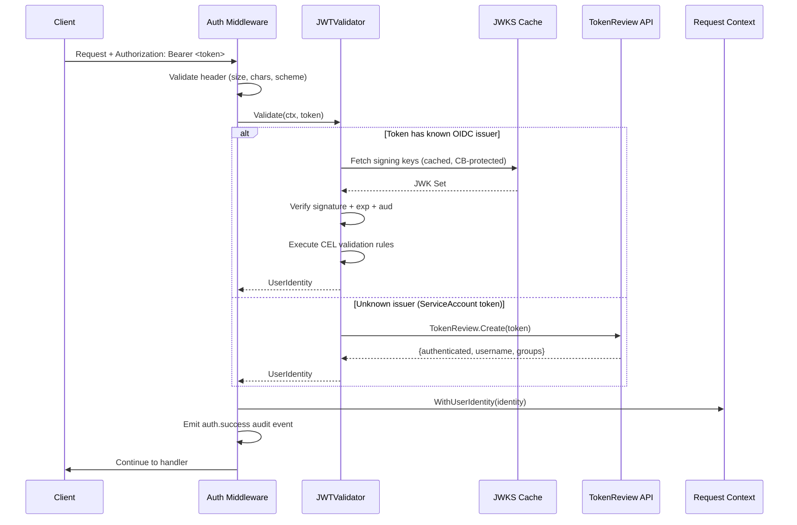
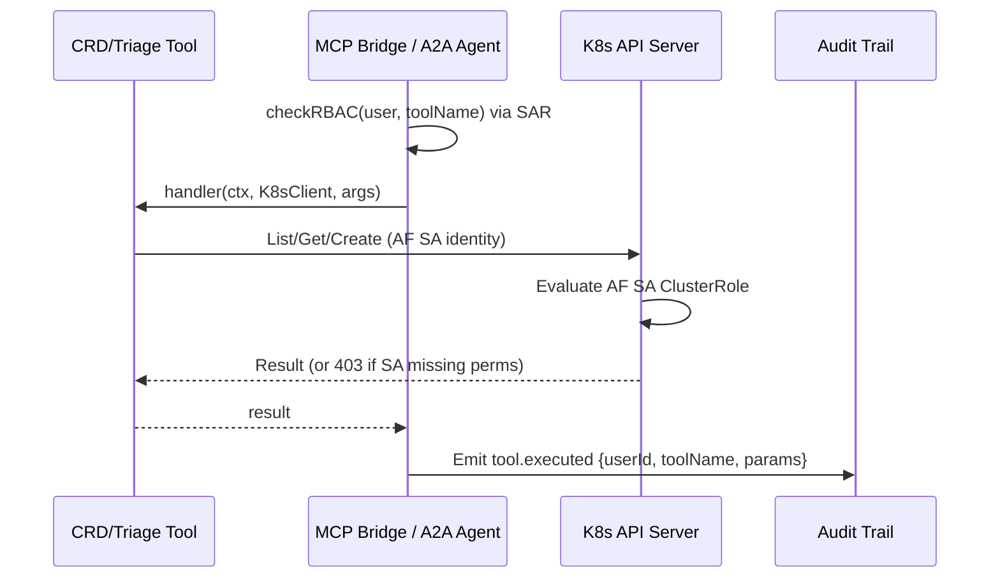

# Authentication and RBAC Model

**Service:** kubernaut-apifrontend
**NIST Controls:** AC-2, AC-3, AC-6, IA-2, IA-5, IA-8
**Source of truth:** `pkg/apifrontend/auth/sar.go`, `charts/kubernaut/values.yaml` (persona ClusterRoles)
**Last updated:** 2026-05-21

---

## 1. Authentication Flow

Every request to the API Frontend must carry a valid Bearer token. The authentication pipeline validates the token through a multi-stage process.



### Validation Stages

| Stage | Code Location | Failure Mode |
|-------|--------------|--------------|
| Body size enforcement | `middleware.go` L45 | 413 if > 1MB |
| Header sanitization | `security.ValidateHeaderValue` | 400 if control chars |
| Bearer scheme check | `middleware.go` L71-78 | 401 if non-Bearer |
| OIDC signature verification | `jwt.go` JWTValidator.Validate | 401 if signature invalid |
| Expiry validation | Claims.exp check | 401 `token_expired` |
| Audience validation | Claims.aud vs configured audiences | 401 `invalid_audience` |
| CEL rule evaluation | Compiled CEL programs per provider | 401 `cel_rule_failed` |
| TokenReview fallback | `tokenreview.go` K8s API call | 401 if not authenticated |

### JWKS Caching and Circuit Breaker

The `JWKSCache` fetches provider signing keys with:
- In-memory cache with TTL refresh
- Circuit breaker to prevent cascading failures if the OIDC provider is down
- Fail-open semantics: if cache has valid keys and circuit is open, validation continues with cached keys (see ADR-016)

---

## 2. RBAC Model (SAR-based, v1.5+)

> **ADR**: [ADR-021](../adr/ADR-021-sar-based-tool-authorization.md)
> **Breaking change from v1.4**: The file-based `rbac_roles.yaml` has been removed.
> Authorization is now enforced via Kubernetes SubjectAccessReview (SAR).

After authentication, tool-level access control is enforced via Kubernetes
SubjectAccessReview (SAR) calls. The model is **fail-closed**: SAR errors or
denials result in tool rejection and an audit event.

### How It Works

1. The AF extracts `username` and `groups` from the authenticated JWT token.
2. On every `tools/call`, the AF performs a SAR check:
   ```yaml
   verb:     use
   group:    kubernaut.ai
   resource: tools
   name:     <toolName>
   ```
3. The Kubernetes RBAC engine evaluates the request against ClusterRoles and
   ClusterRoleBindings.
4. Results are cached for `sarCacheTTL` (default 30s) to reduce API server load.

### `tools/list` Is Unfiltered

Per [ADR-020](../adr/ADR-020-mcp-bridge-rbac-runtime.md), `tools/list` always
returns all registered tools regardless of caller identity. Authorization is
enforced only at `tools/call` execution time to eliminate TOCTOU races.

### Persona ClusterRoles

The Helm chart ships pre-built ClusterRoles for each persona. Bind them to
OIDC groups via ClusterRoleBindings.

| Persona | ClusterRole | Tool Count |
|---------|-------------|-----------|
| `sre` | `kubernaut-tool-sre` | 19 |
| `ai-orchestrator` | `kubernaut-tool-ai-orchestrator` | 15 |
| `observability` | `kubernaut-tool-observability` | 8 |
| `l3-audit` | `kubernaut-tool-l3-audit` | 6 |
| `cicd` | `kubernaut-tool-cicd` | 3 |
| `remediation-approver` | `kubernaut-tool-remediation-approver` | 4 |

### Enforcement Code Paths

| Path | Code | Description |
|------|------|-------------|
| MCP Bridge | `handler/mcp_bridge.go:checkRBAC()` | Calls `ToolAuthorizer.Check()` |
| A2A Agent | `agent/root.go:newRBACGuard()` | BeforeToolCallback delegates to `ToolAuthorizer` |

### Fail-Closed Guarantees

| Condition | Result |
|-----------|--------|
| No UserIdentity in context | DENY |
| No Authorizer configured | DENY (panic at startup) |
| SAR API call fails | DENY + log error |
| SAR returns `allowed: false` | DENY + audit event |
| Empty user or tool name | DENY + error |

### Configuration

```yaml
rbac:
  sarCacheTTL: 30s   # TTL for SAR result cache (0 = no cache)
```

### Example ClusterRoleBinding

```yaml
apiVersion: rbac.authorization.k8s.io/v1
kind: ClusterRoleBinding
metadata:
  name: kubernaut-tool-sre-binding
roleRef:
  apiGroup: rbac.authorization.k8s.io
  kind: ClusterRole
  name: kubernaut-tool-sre
subjects:
  - kind: Group
    name: platform-sre        # OIDC group from JWT
    apiGroup: rbac.authorization.k8s.io
```

---

## 3. K8s Client Model: Unified AF ServiceAccount (ADR-022)

> **ADR**: [ADR-022](../adr/ADR-022-af-sa-unified-security-model.md)
> **Supersedes**: ADR-018 (impersonation risk acceptance), OIDC-direct mode (#1226)

All K8s API calls made by AF use the **AF pod ServiceAccount** regardless of
entry point (MCP or A2A). User identity is preserved in the application audit
trail via tool callbacks, not via K8s impersonation headers.

### K8s Client Flow



### Security Properties

- MCP RBAC (SAR-based) is the application-level access control gate
- Users never need K8s RBAC for kubernaut CRDs
- AF SA is the sole K8s identity for all tool operations
- User attribution is maintained via audit events (`tool.executed` with `UserID`)
- Impersonation headers are explicitly stripped by auth middleware (SEC-12)

---

## 4. Kubernetes RBAC (ClusterRole)

The Kustomize-managed ClusterRole (`deploy/apifrontend/base/02-rbac.yaml`) grants the AF ServiceAccount:

| API Group | Resources | Verbs | Purpose |
|-----------|-----------|-------|---------|
| `kubernaut.ai` | remediationrequests | get, list, watch, create, update, patch | CRD lifecycle (cancel, watch) |
| `kubernaut.ai` | remediationapprovalrequests | get, list, create, update, patch | Approval workflow |
| `kubernaut.ai` | remediationapprovalrequests/status | get, update, patch | Approval status updates |
| `kubernaut.ai` | signalprocessings, investigationsessions | get, list, watch, create, update, patch, delete | Session lifecycle |
| `kubernaut.ai` | */status | get, update, patch | Status subresource updates |
| (core) | events | get, list, create, patch | Triage reads + event creation |
| (core) | pods, replicationcontrollers | get, list | Triage tool reads |
| `apps` | deployments, statefulsets, replicasets, daemonsets | get, list | Workload triage |
| `batch` | jobs, cronjobs | get, list | Job triage |
| `authentication.k8s.io` | tokenreviews | create | JWT fallback validation |
| `authorization.k8s.io` | subjectaccessreviews | create | Authorization checks |

---

## 4.1 External Dependency Authentication: Prometheus

The severity triage pipeline (`internal/severity/triage.go`) queries Prometheus via HTTP for alert and rule data. This uses **service identity** authentication, not end-user impersonation:

| Property | Value |
|----------|-------|
| Client scope | AF ServiceAccount (not user impersonation) |
| Auth mechanism | Bearer token from SA projected volume (`prometheus.bearerTokenFile`) |
| TLS | Optional custom CA file (`prometheus.tlsCaFile`) for mTLS environments |
| Rationale | Prometheus metrics/rules are cluster-wide data; user-scoped access is not applicable |
| NIST | AC-6 (least privilege): AF only needs read access to `/api/v1/{alerts,rules,query}` |

This is distinct from the internal triage tools (`kubectl_get`, `kubectl_list`, `kubectl_list_events`) which use AF's ServiceAccount. Access to these tools is gated by MCP RBAC at the tool level — if a user has permission to invoke `kubernaut_investigate`, AF investigates on their behalf using its own SA.

---

## 5. Credential Lifecycle

| Credential | Type | Rotation | Storage |
|-----------|------|----------|---------|
| OIDC signing keys | JWKS (RS256/ES256) | Auto-refreshed from provider `.well-known/jwks.json` | In-memory cache |
| AF ServiceAccount token | K8s projected volume | Auto-rotated by kubelet (1h default) | tmpfs mount |
| User JWT | OIDC token | Short-lived (provider-configured, typically 5-60min) | Not stored; validated per-request |

---

## 6. Related ADRs

| ADR | Title | Relevance |
|-----|-------|-----------|
| ADR-013 | JWT Forwarding to KA | Original JWT forwarded byte-identical to downstream services |
| ADR-016 | JWKS Fail-Open Rationale | When circuit breaker opens, cached keys allow validation to continue |
| ADR-018 | Impersonation Risk Acceptance | **Superseded by ADR-022** |
| ADR-022 | AF SA Unified Security Model | All K8s operations use AF SA; MCP RBAC is the application-level gate |

---

*Source files: `pkg/apifrontend/auth/middleware.go`, `pkg/apifrontend/auth/jwt.go`, `pkg/apifrontend/auth/tokenreview.go`, `pkg/apifrontend/auth/dynamic_impersonation.go`, `deploy/apifrontend/base/02-rbac.yaml`*
