## Overview

> **📋 Design Decision: DD-001 - Recovery Context Enrichment**
> **Alternative 2**: RemediationProcessing enriches ALL contexts (monitoring + business + recovery)
> **Status**: ✅ Approved Design | **Confidence**: 95%
> **See**: [DESIGN_DECISIONS.md#dd-001](../../../architecture/DESIGN_DECISIONS.md#dd-001-recovery-context-enrichment-alternative-2)

> **📋 Design Decision: DD-HOLMESGPT-009 - Ultra-Compact JSON Format**
> **Impact on RemediationProcessor**: Enriched context prepared by this service is consumed by AIAnalysis Controller, which formats it as self-documenting JSON for HolmesGPT API calls
> **Status**: ✅ Approved Design | **Benefit**: 60% token reduction in downstream AI analysis
> **See**: [DD-HOLMESGPT-009](../../../architecture/decisions/DD-HOLMESGPT-009-Ultra-Compact-JSON-Format.md)

---

**Purpose**: Alert enrichment, environment classification, and recovery context integration with Kubernetes context enrichment.

**Core Responsibilities**:
1. Enrich alerts with comprehensive Kubernetes context (pods, deployments, nodes)
2. **Enrich recovery attempts with historical failure context from Context API** (DD-001: Alternative 2 - BR-WF-RECOVERY-011)
3. Classify environment tier (production, staging, development) with business criticality
4. Validate alert completeness and readiness for AI analysis
5. Update status for RemediationRequest controller to trigger next phase

**V1 Scope - Enrichment, Classification & Recovery Context**:
- Dual enrichment providers (DD-001):
  - **Context Service**: Monitoring & business context (always)
  - **Context API**: Recovery context (ONLY for recovery attempts - Alternative 2)
- Environment classification with fallback heuristics
- Basic alert validation
- **Targeting data ONLY** (namespace, resource kind/name, Kubernetes context ~8KB)
- **NO log/metric storage in CRD** (HolmesGPT fetches via toolsets dynamically)
- **Recovery enrichment with FRESH monitoring + business + recovery contexts** (DD-001: Alternative 2 - BR-WF-RECOVERY-011)
- No multi-source data aggregation (except recovery Context API)

**Future V2 Enhancements** (Out of Scope):
- Multi-source context discovery (additional Context Service providers)
- Advanced correlation across related resources
- Predictive environment classification using ML
- Cross-cluster context enrichment

**Note**: Logs/metrics/traces are NEVER stored in CRDs. HolmesGPT fetches these dynamically using toolsets (`kubernetes`, `prometheus`, `grafana`).

**Downstream Format Impact (DD-HOLMESGPT-009)**: The enriched context prepared by RemediationProcessor is consumed by AIAnalysis Controller, which converts it to **self-documenting JSON format** for HolmesGPT API calls. This achieves:
- ✅ **60% token reduction** (~730 → ~180 tokens per investigation)
- ✅ **$1,980/year cost savings** in LLM API costs
- ✅ **150ms latency improvement** per AI analysis
- ✅ **98% parsing accuracy maintained**

While RemediationProcessor doesn't directly call HolmesGPT, its enrichment quality directly impacts downstream token efficiency.

**Key Architectural Decisions**:
- CRD-based state management (not HTTP polling)
- **Single-phase synchronous processing** (fast operations ~3 seconds total)
- Degraded mode operation when Context Service unavailable
- 24-hour retention aligned with RemediationRequest lifecycle
- **Does NOT create AIAnalysis CRD** (RemediationRequest controller responsibility)
- No duplicate detection (Gateway Service responsibility)

---

## Business Requirements Coverage

**RemediationProcessor** implements alert processing and enrichment for Kubernetes remediation:

### V1 Scope: Alert Processing (BR-AP-001 to BR-AP-062)

**Range**: BR-AP-001 to BR-AP-180
**V1 Active**: BR-AP-001 to BR-AP-062 (22 BRs total)
**V2 Reserved**: BR-AP-063 to BR-AP-180 (multi-source context, advanced correlation)

**V1 Business Requirements Breakdown**:

#### Core Alert Processing (BR-AP-001 to BR-AP-050)
**Count**: 16 BRs
**Focus**: Alert ingestion, validation, transformation, and Kubernetes context enrichment

**Primary Functions**:
- Alert validation and completeness checks
- Kubernetes context retrieval and enrichment
- Alert transformation and normalization
- Resource targeting data extraction
- Status updates for downstream controllers

#### Environment Classification (BR-AP-051 to BR-AP-053)
**Count**: 3 BRs (migrated from BR-ENV-*)
**Focus**: Environment tier classification with business criticality

**Migrated BRs**:
- BR-AP-051: Environment detection from namespace labels (was BR-ENV-001)
- BR-AP-052: Environment validation and classification (was BR-ENV-009)
- BR-AP-053: Environment-specific configuration loading (was BR-ENV-050)

**Rationale**: Gateway Service set precedent by migrating BR-ENV-* → BR-GATEWAY-051 to 053.
RemediationProcessor followed the same pattern for consistency.

#### Alert Enrichment (BR-AP-060 to BR-AP-062)
**Count**: 3 BRs (migrated from BR-ALERT-*)
**Focus**: Alert enrichment, correlation, and timeout handling

**Migrated BRs**:
- BR-AP-060: Alert enrichment with K8s context (was BR-ALERT-003)
- BR-AP-061: Alert correlation and deduplication (was BR-ALERT-005)
- BR-AP-062: Alert timeout and escalation handling (was BR-ALERT-006)

**Rationale**: BR-ALERT-* was shared between RemediationProcessor and RemediationOrchestrator.
RemediationProcessor is the primary owner (first controller in the pipeline handling alert processing).

### V2 Expansion (BR-AP-063 to BR-AP-180)

**Reserved for Future**:
- Multi-source context discovery (additional Context Service providers)
- Advanced correlation across related Kubernetes resources
- Predictive environment classification using machine learning
- Cross-cluster context enrichment
- Intelligent alert grouping and prioritization

---

## Service Configuration

### Port Configuration
- **Port 9090**: Metrics endpoint
- **Port 8080**: Health probes (follows kube-apiserver pattern)
- **Endpoint**: `/metrics`
- **Format**: Prometheus text format
- **Authentication**: Kubernetes TokenReviewer API (validates ServiceAccount tokens)
  - **See**: [METRICS_AUTHENTICATION.md](../METRICS_AUTHENTICATION.md) for complete implementation examples

### ServiceAccount
- **Name**: `remediation-processor-sa`
- **Namespace**: `kubernaut-system`
- **Purpose**: Controller authentication and authorization

### Notes
- CRD controllers do not expose REST APIs
- Health checks (`/healthz`, `/readyz`) are for Kubernetes liveness/readiness probes
- Metrics endpoint requires valid Kubernetes ServiceAccount token

---

## 📊 Visual Architecture

### Architecture Diagram
```mermaid
graph TB
    subgraph "Remediation Processor Service"
        AP[RemediationProcessing CRD]
        Controller[RemediationProcessingReconciler]
        Enricher[Context Enricher]
        Classifier[Environment Classifier]
    end

    subgraph "External Services"
        CS[Context Service<br/>Port 8080<br/>Monitoring + Business]
        CTXAPI[Context API<br/>Recovery Context<br/>Alternative 2]
        AR[RemediationRequest CRD<br/>Parent]
    end

    subgraph "Data Sources"
        K8S[Kubernetes API]
        DB[Data Storage Service]
    end

    AR -->|Creates & Owns| AP
    Controller -->|Watches| AP
    Controller -->|Fetch Context| CS
    Controller -->|Fetch Recovery<br/>Context (if recovery)| CTXAPI
    CS -->|Query| K8S
    Controller -->|Classify Environment| Classifier
    Controller -->|Enrich Alert| Enricher
    Controller -->|Update Status| AP
    AP -->|Triggers| AR
    Controller -->|Audit Trail| DB

    style AP fill:#e1f5ff
    style Controller fill:#fff4e1
    style AR fill:#ffe1e1
```

### Sequence Diagram - Enrichment Flow (Initial & Recovery)


### State Machine - Reconciliation Phases (Initial & Recovery)

```mermaid
stateDiagram-v2
    [*] --> Pending
    Pending --> Enriching: Reconcile triggered
    Enriching --> Classifying: Context enriched
    Enriching --> Degraded: Context Service unavailable
    Classifying --> Completed: Environment classified
    Degraded --> Completed: Fallback to alert labels
    Completed --> [*]: RemediationRequest proceeds

    note right of Enriching
        ALWAYS:
        • Fetch monitoring context (FRESH!)
        • Fetch business context (FRESH!)

        IF isRecoveryAttempt:
        • Query Context API (Alternative 2)
        • Fetch recovery context (FRESH!)
        • All contexts same timestamp!

        Timeout: 5s total
    end note

    note right of Classifying
        Analyze namespace, labels
        Classify: prod/staging/dev
        Timeout: 2s
    end note

    note right of Degraded
        Context Service unavailable:
        • Use alert labels as fallback

        Recovery + Context API failed:
        • Build minimal recovery context
        • From failedWorkflowRef
        • ContextQuality = "degraded"
    end note
```


---

## 🔄 Deduplication & Alert Storm Handling

**⚠️ CRITICAL ARCHITECTURE NOTE**: Duplicate alert handling is a **Gateway Service responsibility**, NOT Remediation Processor.

### Responsibility Separation

```
┌─────────────────────────────────────────────────────────────────┐
│ Gateway Service (Port 8080) - DUPLICATE DETECTION               │
├─────────────────────────────────────────────────────────────────┤
│ 1. Receives webhook alert from Prometheus/Grafana              │
│ 2. Generates alert fingerprint (hash of content)               │
│ 3. Checks for existing RemediationRequest CRD by fingerprint     │
│ 4. If DUPLICATE:                                                │
│    ├── Updates RemediationRequest.Status.DuplicateAlerts counter │
│    ├── Checks escalation criteria (environment-based)          │
│    ├── Emits Kubernetes event for visibility                   │
│    └── Escalates if alert storm detected (5+ or 3 in 5 min)    │
│ 5. If FIRST OCCURRENCE:                                         │
│    └── Creates new RemediationRequest CRD → triggers processing  │
└─────────────────────────────────────────────────────────────────┘

┌─────────────────────────────────────────────────────────────────┐
│ Remediation Processor (CRD Controller) - ALERT ENRICHMENT            │
├─────────────────────────────────────────────────────────────────┤
│ 1. Receives RemediationProcessing CRD (already deduplicated)         │
│ 2. NO duplicate checking - Gateway handled it                  │
│ 3. Enriches alert with Kubernetes context                      │
│ 4. Classifies environment (production/staging/dev)             │
│ 5. Routes to AI Analysis service                               │
│                                                                 │
│ Exposes:                                                        │
│   - Port 8080: /health, /ready (no auth)                       │
│   - Port 9090: /metrics (with auth filter)                     │
└─────────────────────────────────────────────────────────────────┘
```

### Alert Storm Escalation Thresholds (BR-AP-062)

Environment-based escalation criteria from Gateway Service:

| Environment | Absolute Threshold | Frequency Threshold | Escalation Channels | Urgency |
|------------|-------------------|---------------------|--------------------|---------|
| **Production** | 5+ duplicates | 3 duplicates in 5 min | Slack: #production-oncall<br>Email: sre-team, eng-manager | IMMEDIATE |
| **Staging** | 8+ duplicates | 5 duplicates in 10 min | Slack: #platform-team<br>Email: platform-team | NORMAL |
| **Development** | 10+ duplicates | 8 duplicates in 15 min | Slack: #dev-team | LOW (business hours) |

### Business Requirements Coverage

| Requirement | Implementation | Service |
|------------|---------------|---------|
| **BR-WH-008** | Fingerprint-based duplicate detection | Gateway Service |
| **BR-AP-060** | Alert suppression to reduce noise | Gateway Service |
| **BR-AP-061** | Alert correlation and grouping | Gateway Service |
| **BR-AP-062** | Alert storm escalation procedures | Gateway Service |
| **BR-AP-052** | Business criticality preservation | Gateway Service |
| **BR-AP-031** | Environment-specific priority routing | Remediation Processor |

### Duplicate Handling Flow

```go
// Gateway Service - Duplicate Detection
func (g *GatewayService) HandleWebhook(ctx, payload) error {
    fingerprint := extractFingerprint(payload)

    existingRemediation, _ := g.findExistingRemediation(ctx, fingerprint)

    if existingRemediation != nil {
        // DUPLICATE - Update metadata and check escalation
        existingRemediation.Status.DuplicateAlerts.Count++
        existingRemediation.Status.DuplicateAlerts.LastSeenAt = metav1.Now()

        if g.shouldEscalate(existingRemediation) {
            g.escalateDuplicateAlerts(ctx, existingRemediation)
        }

        return g.updateRemediation(ctx, existingRemediation)
    }

    // FIRST OCCURRENCE - Create RemediationRequest CRD
    return g.createRemediation(ctx, payload, fingerprint)
}

// Remediation Processor - NO Duplicate Checking
func (r *RemediationProcessingReconciler) Reconcile(ctx, req) (ctrl.Result, error) {
    // RemediationProcessing CRD only exists for non-duplicate alerts
    // Focus on enrichment, classification, and routing

    switch ap.Status.Phase {
    case "enriching":
        enrichment := r.enricher.Enrich(ctx, ap.Spec.Alert)
        // ... continue processing
    }
}
```

### Migration Note

**Existing Code Location**: `pkg/alert/components.go` contains `AlertDeduplicatorImpl`

**Required Action**:
- ✅ Fingerprint generation logic is reusable for Gateway Service
- ❌ Current implementation lacks RemediationRequest CRD integration
- ❌ Current implementation lacks escalation logic
- ❌ Current implementation lacks environment-based thresholds

**Recommendation**: Move and enhance `AlertDeduplicatorImpl` to Gateway Service with full duplicate handling and escalation logic.

---

## Package Structure

**Implemented Structure**: `{cmd,pkg,internal}/remediationprocessor/`

Following Go idioms and codebase patterns (`testutil`, `holmesgpt`), the Remediation Processor service uses a descriptive package name:

```
cmd/remediationprocessor/     → Main application entry point
  └── main.go

pkg/remediationprocessor/     → Business logic (PUBLIC API)
  ├── service.go             → RemediationProcessor Service interface
  ├── implementation.go      → Service implementation
  ├── components.go          → Processing components
  └── types.go              → Type-safe result types

internal/controller/          → CRD controller (INTERNAL)
  └── remediationprocessing_controller.go
```

**Migration Complete**: Package migrated from `pkg/alert/` → `pkg/remediationprocessor/` for naming consistency.

---

## Development Methodology

**Mandatory Process**: Follow APDC-Enhanced TDD workflow per [.cursor/rules/00-core-development-methodology.mdc](../../../.cursor/rules/00-core-development-methodology.mdc)

### APDC-TDD Workflow

```
┌─────────────────────────────────────────────────────────────┐
│ ANALYSIS → PLAN → DO-RED → DO-GREEN → DO-REFACTOR → CHECK  │
└─────────────────────────────────────────────────────────────┘
```

**ANALYSIS** (5-15 min): Comprehensive context understanding
  - Search existing implementations (`codebase_search "AlertProcessor implementations"`)
  - Identify reusable components in `pkg/alert/` (1,103 lines to migrate)
  - Map business requirements (BR-AP-001 to BR-AP-050, BR-AP-051 to BR-AP-053)
  - Identify integration points in `cmd/`

**PLAN** (10-20 min): Detailed implementation strategy
  - Define TDD phase breakdown (RED → GREEN → REFACTOR)
  - Plan integration points (RemediationProcessing controller in cmd/remediationprocessor/)
  - Establish success criteria (enrichment <2s, classification <500ms, total <5s)
  - Identify risks (Context Service unavailability → degraded mode)

**DO-RED** (10-15 min): Write failing tests FIRST
  - Unit tests defining business contract (70%+ coverage target)
  - Use FAKE K8s client (`sigs.k8s.io/controller-runtime/pkg/client/fake`)
  - Mock ONLY Context Service HTTP calls (use `pkg/testutil/mocks`)
  - Use REAL environment classification business logic
  - Map tests to business requirements (BR-AP-XXX)

**DO-GREEN** (15-20 min): Minimal implementation
  - Define RemediationProcessingReconciler interface to make tests compile
  - Minimal code to pass tests (basic enrichment, classification)
  - **MANDATORY integration in cmd/remediationprocessor/** (controller startup)
  - Add owner references to RemediationRequest CRD

**DO-REFACTOR** (20-30 min): Enhance with sophisticated logic
  - **NO new types/interfaces/files** (enhance existing controller methods)
  - Add sophisticated enrichment algorithms and classification heuristics
  - Maintain integration with RemediationRequest orchestration
  - Add degraded mode fallback and performance optimization

**CHECK** (5-10 min): Validation and confidence assessment
  - Business requirement verification (BR-AP-001 to BR-AP-050 addressed)
  - Integration confirmation (controller in cmd/remediationprocessor/)
  - Test coverage validation (70%+ unit, 20% integration, 10% E2E)
  - Performance validation (total processing <5s)
  - Confidence assessment: 85% (high confidence, see Migration Effort section)

**AI Assistant Checkpoints**: See [.cursor/rules/10-ai-assistant-behavioral-constraints.mdc](../../../.cursor/rules/10-ai-assistant-behavioral-constraints.mdc)
  - **Checkpoint A**: Type Reference Validation (read RemediationProcessing CRD types before referencing)
  - **Checkpoint B**: Test Creation Validation (reuse existing test patterns)
  - **Checkpoint C**: Business Integration Validation (verify cmd/remediationprocessor/ integration)
  - **Checkpoint D**: Build Error Investigation (complete dependency analysis for migration)

### Quick Decision Matrix

| Starting Point | Required Phase | Reference |
|----------------|---------------|-----------|
| **New CRD controller** | Full APDC workflow | Controller pattern is new |
| **Enhance existing service** | ANALYSIS → PLAN → DO-REFACTOR | Existing code is well-understood |
| **Fix enrichment bugs** | ANALYSIS → DO-RED → DO-REFACTOR | Understand enrichment context first |
| **Add classification tests** | DO-RED only | Write tests for classification logic |

**Testing Strategy Reference**: [.cursor/rules/03-testing-strategy.mdc](../../../.cursor/rules/03-testing-strategy.mdc)
  - Unit Tests (70%+): test/unit/remediationprocessor/ - Fake K8s client, mock Context Service
  - Integration Tests (20%): test/integration/remediationprocessor/ - Real K8s (KIND), real Context Service
  - E2E Tests (10%): test/e2e/remediationprocessor/ - Complete signal-to-remediation workflow

---

## Reconciliation Architecture

## Summary

**Alert Processing Service - V1 Design Specification (98% Complete)**

### Core Purpose
Alert enrichment, environment classification, and validation service that bridges webhook reception and AI analysis through CRD-based state management.

### Key Architectural Decisions
1. **Single-Phase Synchronous Processing** - Fast operations (~3 seconds) execute in single reconciliation loop (no multi-phase complexity)
2. **CRD-based State Management** - RemediationProcessing CRD with owner references for cascade deletion
3. **RemediationRequest Orchestration** - Central controller creates RemediationProcessing and watches for completion to create AIAnalysis
4. **Degraded Mode Operation** - Context Service unavailability triggers fallback to alert labels
5. **Duplicate Detection Delegation** - Gateway Service responsibility (BR-WH-008), not Remediation Processor

### Integration Model
```
Gateway Service → RemediationRequest CRD → RemediationProcessing CRD (this service)
                                       ↓
           RemediationProcessing enriches (monitoring + business + recovery contexts)
                                       ↓
                      RemediationProcessing.status.phase = "completed"
                                       ↓
                      RemediationRequest watches status
                                       ↓
            RemediationRequest copies enrichment data → creates AIAnalysis CRD
                                       ↓
                   AIAnalysis has ALL contexts (Alternative 2)
```

### V1 Scope Boundaries
**Included**:
- Dual enrichment providers:
  - Context Service (monitoring + business contexts)
  - Context API (recovery context for recovery attempts only - Alternative 2)
- Environment classification with fallback heuristics
- Basic alert validation
- Recovery enrichment with FRESH contexts (BR-WF-RECOVERY-011)
- Audit trail persistence

**Excluded** (V2):
- Multi-source data aggregation
- Advanced resource correlation
- Predictive ML classification
- Cross-cluster enrichment

### Business Requirements Coverage
- **BR-AP-001 to BR-AP-050**: Alert processing and enrichment logic
- **BR-AP-051 to BR-AP-053**: Environment classification (integrated)
- **BR-AP-060 to BR-AP-062**: Alert enrichment, correlation, timeout handling
- **BR-WF-RECOVERY-011**: Recovery context enrichment from Context API (Alternative 2)
- **BR-AP-021**: Alert lifecycle state tracking
- **BR-WH-008**: Duplicate detection (Gateway Service, not Remediation Processor)

### Implementation Status
- **Package Migration**: Complete - migrated from `pkg/alert/` to `pkg/remediationprocessor/`
- **CRD Controller**: New implementation following controller-runtime patterns
- **Database Schema**: Audit table design complete
- **Next Steps**: Controller implementation and integration testing

### Next Steps
1. ✅ **Approved Design Specification** (98% complete)
2. ✅ **Package Migration Complete**: `pkg/alert/` → `pkg/remediationprocessor/`
3. **CRD Schema Definition**: RemediationProcessing API types
4. **Controller Implementation**: Single-phase reconciliation logic
5. **Integration Testing**: With RemediationRequest controller and Context Service

### Critical Success Factors
- Single-phase processing simplicity (no unnecessary state machine)
- Degraded mode resilience when Context Service unavailable
- Proper owner references for cascade deletion
- RemediationRequest orchestration (does NOT create AIAnalysis directly)
- Audit trail completeness for compliance

**Design Specification Status**: Production-Ready (98% Confidence)
