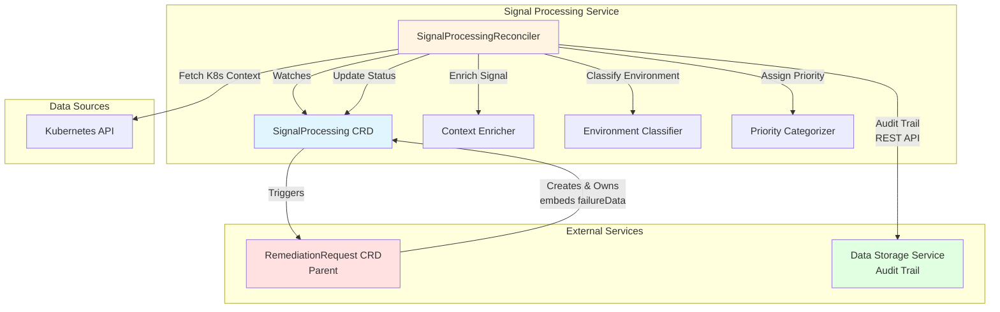
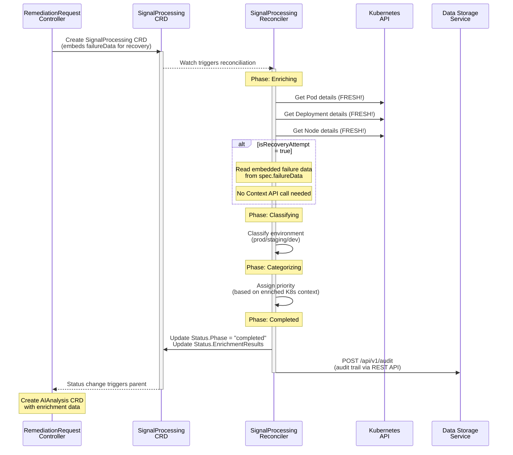
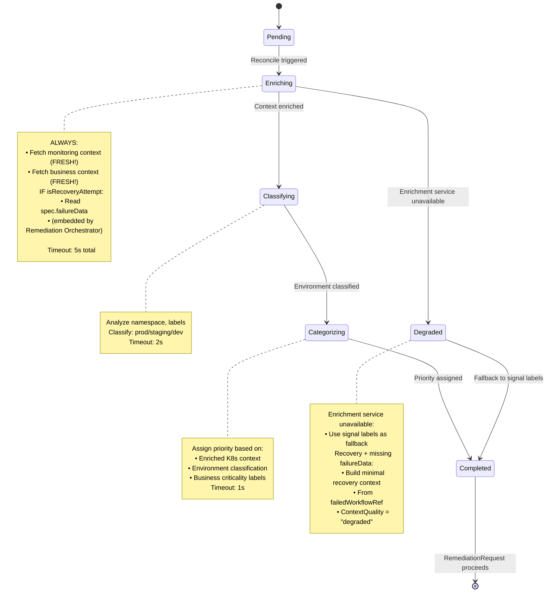

## Overview

> **📋 Changelog**
> | Version | Date | Changes | Reference |
> |---------|------|---------|-----------|
> | v1.5 | 2025-11-30 | Updated to DD-WORKFLOW-001 v1.6 (snake_case API fields, DetectedLabels wildcard support) | [HANDOFF_REQUEST_REGO_LABEL_EXTRACTION.md](HANDOFF_REQUEST_REGO_LABEL_EXTRACTION.md) v3.1, [DD-WORKFLOW-001 v1.6](../../../architecture/decisions/DD-WORKFLOW-001-mandatory-label-schema.md) |
> | v1.4 | 2025-11-30 | Updated to DD-WORKFLOW-001 v1.4 (5 mandatory labels, risk_tolerance customer-derived) | [HANDOFF_REQUEST_REGO_LABEL_EXTRACTION.md](HANDOFF_REQUEST_REGO_LABEL_EXTRACTION.md) v3.0, [DD-WORKFLOW-001 v1.4](../../../architecture/decisions/DD-WORKFLOW-001-mandatory-label-schema.md) |
> | v1.3 | 2025-11-30 | Added DetectedLabels (V1.0) and CustomLabels (V1.0) for workflow filtering | [HANDOFF_REQUEST_REGO_LABEL_EXTRACTION.md](HANDOFF_REQUEST_REGO_LABEL_EXTRACTION.md) v2.0 |
> | v1.2 | 2025-11-28 | Performance targets updated (<5s), graceful shutdown, parallel testing, retry strategy | [DD-007](../../../architecture/decisions/DD-007-kubernetes-aware-graceful-shutdown.md), [DD-TEST-002](../../../architecture/decisions/DD-TEST-002-parallel-test-execution-standard.md), [ADR-019](../../../architecture/decisions/ADR-019-holmesgpt-circuit-breaker-retry-strategy.md) |
> | v1.1 | 2025-11-27 | Service rename: RemediationProcessing → SignalProcessing | [DD-SIGNAL-PROCESSING-001](../../../architecture/decisions/DD-SIGNAL-PROCESSING-001-service-rename.md) |
> | v1.1 | 2025-11-27 | Context API deprecated: Recovery context embedded by Remediation Orchestrator | [DD-CONTEXT-006](../../../architecture/decisions/DD-CONTEXT-006-CONTEXT-API-DEPRECATION.md) |
> | v1.1 | 2025-11-27 | Categorization consolidated in Signal Processing | [DD-CATEGORIZATION-001](../../../architecture/decisions/DD-CATEGORIZATION-001-gateway-signal-processing-split-assessment.md) |
> | v1.0 | 2025-01-15 | Initial design specification | - |

> **📋 Design Decision: DD-001 - Recovery Context Enrichment**
> **Status**: ✅ Approved Design | **Confidence**: 95%
> **UPDATE (2025-11-11)**: Signal Processing no longer queries Context API for historical recovery data. Remediation Orchestrator embeds current failure data from WorkflowExecution CRD in `spec.failureData`.
> **See**: [DD-001](../../../architecture/decisions/DD-001-recovery-context-enrichment.md), [DD-CONTEXT-006](../../../architecture/decisions/DD-CONTEXT-006-CONTEXT-API-DEPRECATION.md)

> **📋 Design Decision: DD-HOLMESGPT-009 - Ultra-Compact JSON Format**
> **Impact on Signal Processing**: Enriched context prepared by this service is consumed by AIAnalysis Controller, which formats it as self-documenting JSON for HolmesGPT API calls
> **Status**: ✅ Approved Design | **Benefit**: 60% token reduction in downstream AI analysis
> **See**: [DD-HOLMESGPT-009](../../../architecture/decisions/DD-HOLMESGPT-009-Ultra-Compact-JSON-Format.md)

> **📋 Design Decision: DD-CATEGORIZATION-001 - Categorization Consolidation**
> **Impact**: All categorization (environment classification + priority assignment) consolidated in Signal Processing
> **Rationale**: Richer Kubernetes context available after enrichment enables more accurate categorization
> **Gateway Behavior**: Sets placeholder values; Signal Processing performs final categorization
> **See**: [DD-CATEGORIZATION-001](../../../architecture/decisions/DD-CATEGORIZATION-001-gateway-signal-processing-split-assessment.md)

> **📋 Design Decision: Label Detection Architecture (v1.4)**
> **Impact**: Signal Processing now populates DetectedLabels (V1.0) and CustomLabels (V1.0)
> **Purpose**: Provide structured labels for workflow filtering via HolmesGPT-API
> **Label Taxonomy**: 5 mandatory labels (DD-WORKFLOW-001 v1.6) + Customer-Derived Labels (Rego) + DetectedLabels
> **See**: [HANDOFF_REQUEST_REGO_LABEL_EXTRACTION.md](HANDOFF_REQUEST_REGO_LABEL_EXTRACTION.md) v3.0, [DD-WORKFLOW-004 v2.1](../../../architecture/decisions/DD-WORKFLOW-004-hybrid-weighted-label-scoring.md)

---

**Purpose**: Signal enrichment, environment classification, priority assignment, label detection, and context integration with Kubernetes context enrichment.

**Core Responsibilities**:
1. Enrich signals with comprehensive Kubernetes context (pods, deployments, nodes)
2. **Read recovery context from embedded failure data** (provided by Remediation Orchestrator in `spec.failureData`)
3. Classify environment tier (production, staging, development) with business criticality
4. **Assign priority based on enriched K8s context** ([DD-CATEGORIZATION-001](../../../architecture/decisions/DD-CATEGORIZATION-001-gateway-signal-processing-split-assessment.md))
5. **Detect cluster characteristics** (GitOps, PDB, HPA, etc.) → `DetectedLabels` (V1.0)
6. **Extract custom labels via Rego policies** (team, region, etc.) → `CustomLabels` (V1.0)
7. Validate signal completeness and readiness for AI analysis
8. Update status for RemediationRequest controller to trigger next phase

**V1 Scope - Enrichment, Classification, Categorization & Label Detection**:
- **Kubernetes Context Enrichment**: Fetch monitoring & business context from K8s API
- **Recovery Context**: Read embedded failure data from `spec.failureData` (provided by Remediation Orchestrator)
- **Environment Classification**: Classify environment with fallback heuristics
- **Priority Assignment**: Categorize priority after K8s context enrichment ([DD-CATEGORIZATION-001](../../../architecture/decisions/DD-CATEGORIZATION-001-gateway-signal-processing-split-assessment.md))
- **DetectedLabels (V1.0)**: Auto-detect cluster characteristics (GitOps, PDB, HPA, etc.)
- **CustomLabels (V1.0)**: Extract user-defined labels via Rego policies (team, region, etc.)
- Basic signal validation
- **Targeting data ONLY** (namespace, resource kind/name, Kubernetes context ~8KB)
- **NO log/metric storage in CRD** (HolmesGPT fetches via toolsets dynamically)

**Context API DEPRECATED** ([DD-CONTEXT-006](../../../architecture/decisions/DD-CONTEXT-006-CONTEXT-API-DEPRECATION.md)):
- Signal Processing NO LONGER queries Context API for recovery context
- Remediation Orchestrator embeds current failure data from WorkflowExecution CRD
- This simplifies architecture and eliminates external dependency for recovery

**Future V2 Enhancements** (Out of Scope):
- Multi-source context discovery (additional Context Service providers)
- Advanced correlation across related resources
- Predictive environment classification using ML
- Cross-cluster context enrichment

**Note**: Logs/metrics/traces are NEVER stored in CRDs. HolmesGPT fetches these dynamically using toolsets (`kubernetes`, `prometheus`, `grafana`).

**Downstream Format Impact (DD-HOLMESGPT-009)**: The enriched context prepared by Signal Processing is consumed by AIAnalysis Controller, which converts it to **self-documenting JSON format** for HolmesGPT API calls. This achieves:
- ✅ **60% token reduction** (~730 → ~180 tokens per investigation)
- ✅ **$1,980/year cost savings** in LLM API costs
- ✅ **150ms latency improvement** per AI analysis
- ✅ **98% parsing accuracy maintained**

While Signal Processing doesn't directly call HolmesGPT, its enrichment quality directly impacts downstream token efficiency.

**Key Architectural Decisions**:
- CRD-based state management (not HTTP polling)
- **Single-phase synchronous processing** (fast operations <5 seconds total)
- Degraded mode operation when enrichment services unavailable
- 24-hour retention aligned with RemediationRequest lifecycle
- **Does NOT create AIAnalysis CRD** (RemediationRequest controller responsibility)
- No duplicate detection (Gateway Service responsibility)
- **All categorization consolidated** in Signal Processing ([DD-CATEGORIZATION-001](../../../architecture/decisions/DD-CATEGORIZATION-001-gateway-signal-processing-split-assessment.md))
- **Audit writes via Data Storage Service REST API** ([ADR-032](../../../architecture/decisions/ADR-032-data-access-layer-isolation.md))
- **Graceful shutdown** following [DD-007](../../../architecture/decisions/DD-007-kubernetes-aware-graceful-shutdown.md)
- **K8s requeue for retry** (no circuit breaker needed for internal deps - see [ADR-019](../../../architecture/decisions/ADR-019-holmesgpt-circuit-breaker-retry-strategy.md))

---

## Business Requirements Coverage

**Signal Processing** implements signal processing and enrichment for Kubernetes remediation:

### V1 Scope: Signal Processing (BR-SP-001 to BR-SP-075)

**Range**: BR-SP-001 to BR-SP-180
**V1 Active**: BR-SP-001 to BR-SP-075 (25 BRs total)
**V2 Reserved**: BR-SP-076 to BR-SP-180 (multi-source context, advanced correlation)

**V1 Business Requirements Breakdown**:

#### Core Signal Processing (BR-SP-001 to BR-SP-050)
**Count**: 16 BRs
**Focus**: Signal ingestion, validation, transformation, and Kubernetes context enrichment

**Primary Functions**:
- Signal validation and completeness checks
- Kubernetes context retrieval and enrichment
- Signal transformation and normalization
- Resource targeting data extraction
- Status updates for downstream controllers

#### Environment Classification (BR-SP-051 to BR-SP-053)
**Count**: 3 BRs (migrated from BR-ENV-*)
**Focus**: Environment tier classification with business criticality

**Migrated BRs**:
- BR-SP-051: Environment detection from namespace labels (was BR-ENV-001)
- BR-SP-052: Environment validation and classification (was BR-ENV-009)
- BR-SP-053: Environment-specific configuration loading (was BR-ENV-050)

**Rationale**: Gateway Service set precedent by migrating BR-ENV-* → BR-GATEWAY-051 to 053.
Signal Processing followed the same pattern for consistency.

#### Signal Enrichment (BR-SP-060 to BR-SP-062)
**Count**: 3 BRs (migrated from BR-ALERT-*)
**Focus**: Signal enrichment, correlation, and timeout handling

**Migrated BRs**:
- BR-SP-060: Signal enrichment with K8s context (was BR-ALERT-003)
- BR-SP-061: Signal correlation and deduplication (was BR-ALERT-005)
- BR-SP-062: Signal timeout and escalation handling (was BR-ALERT-006)

**Rationale**: BR-ALERT-* was shared between Signal Processing and RemediationOrchestrator.
Signal Processing is the primary owner (first controller in the pipeline handling signal processing).

#### Priority Categorization (BR-SP-070 to BR-SP-075)
**Count**: 6 BRs (consolidated from Gateway per [DD-CATEGORIZATION-001](../../../architecture/decisions/DD-CATEGORIZATION-001-gateway-signal-processing-split-assessment.md))
**Focus**: Priority assignment after K8s context enrichment

**Consolidated BRs**:
- BR-SP-070: Priority assignment based on enriched namespace context
- BR-SP-071: Business criticality scoring using K8s labels
- BR-SP-072: SLA requirement derivation from environment classification
- BR-SP-073: Workload type priority weighting
- BR-SP-074: Resource impact severity calculation
- BR-SP-075: Priority override based on annotation rules

**Rationale**: Gateway sets placeholder priority; Signal Processing has richer K8s context for accurate categorization.

### V2 Expansion (BR-SP-076 to BR-SP-180)

**Reserved for Future**:
- Multi-source context discovery (additional Context Service providers)
- Advanced correlation across related Kubernetes resources
- Predictive environment classification using machine learning
- Cross-cluster context enrichment
- Intelligent signal grouping and prioritization

---

## Service Configuration

### Port Configuration
- **Port 9090**: Metrics endpoint
- **Port 8080**: Health probes (follows kube-apiserver pattern)
- **Endpoint**: `/metrics`
- **Format**: Prometheus text format
- **Authentication**: Kubernetes TokenReviewer API (validates ServiceAccount tokens)
  - **See**: [METRICS_AUTHENTICATION.md](../METRICS_AUTHENTICATION.md) for complete implementation examples

### ServiceAccount
- **Name**: `signal-processing-sa`
- **Namespace**: `kubernaut-system`
- **Purpose**: Controller authentication and authorization

### Notes
- CRD controllers do not expose REST APIs
- Health checks (`/healthz`, `/readyz`) are for Kubernetes liveness/readiness probes
- Metrics endpoint requires valid Kubernetes ServiceAccount token

---

## 📊 Visual Architecture

### Architecture Diagram


**Note**: Context API removed per [DD-CONTEXT-006](../../../architecture/decisions/DD-CONTEXT-006-CONTEXT-API-DEPRECATION.md). Recovery context is now embedded by Remediation Orchestrator in `spec.failureData`.

### Sequence Diagram - Enrichment Flow (Initial & Recovery)


### State Machine - Reconciliation Phases (Initial & Recovery)


---

## 🔄 Deduplication & Signal Storm Handling

**⚠️ CRITICAL ARCHITECTURE NOTE**: Duplicate signal handling is a **Gateway Service responsibility**, NOT Signal Processing.

### Responsibility Separation

```
┌─────────────────────────────────────────────────────────────────┐
│ Gateway Service (Port 8080) - DUPLICATE DETECTION               │
├─────────────────────────────────────────────────────────────────┤
│ 1. Receives webhook signal from Prometheus/Grafana              │
│ 2. Generates signal fingerprint (hash of content)               │
│ 3. Checks for existing RemediationRequest CRD by fingerprint    │
│ 4. If DUPLICATE:                                                │
│    ├── Updates RemediationRequest.Status.DuplicateSignals count │
│    ├── Checks escalation criteria (environment-based)           │
│    ├── Emits Kubernetes event for visibility                    │
│    └── Escalates if signal storm detected (5+ or 3 in 5 min)   │
│ 5. If FIRST OCCURRENCE:                                         │
│    └── Creates new RemediationRequest CRD → triggers processing │
│ 6. Sets PLACEHOLDER priority (Signal Processing will finalize) │
└─────────────────────────────────────────────────────────────────┘

┌─────────────────────────────────────────────────────────────────┐
│ Signal Processing (CRD Controller) - SIGNAL ENRICHMENT          │
├─────────────────────────────────────────────────────────────────┤
│ 1. Receives SignalProcessing CRD (already deduplicated)        │
│ 2. NO duplicate checking - Gateway handled it                  │
│ 3. Enriches signal with Kubernetes context                     │
│ 4. Classifies environment (production/staging/dev)             │
│ 5. ASSIGNS FINAL PRIORITY (DD-CATEGORIZATION-001)              │
│ 6. Routes to AI Analysis service                               │
│                                                                 │
│ Exposes:                                                        │
│   - Port 8080: /health, /ready (no auth)                       │
│   - Port 9090: /metrics (with auth filter)                     │
└─────────────────────────────────────────────────────────────────┘
```

### Signal Storm Escalation Thresholds (BR-SP-062)

Environment-based escalation criteria from Gateway Service:

| Environment | Absolute Threshold | Frequency Threshold | Escalation Channels | Urgency |
|------------|-------------------|---------------------|--------------------|---------|
| **Production** | 5+ duplicates | 3 duplicates in 5 min | Slack: #production-oncall<br>Email: sre-team, eng-manager | IMMEDIATE |
| **Staging** | 8+ duplicates | 5 duplicates in 10 min | Slack: #platform-team<br>Email: platform-team | NORMAL |
| **Development** | 10+ duplicates | 8 duplicates in 15 min | Slack: #dev-team | LOW (business hours) |

### Business Requirements Coverage

| Requirement | Implementation | Service |
|------------|---------------|---------|
| **BR-WH-008** | Fingerprint-based duplicate detection | Gateway Service |
| **BR-SP-060** | Signal suppression to reduce noise | Gateway Service |
| **BR-SP-061** | Signal correlation and grouping | Gateway Service |
| **BR-SP-062** | Signal storm escalation procedures | Gateway Service |
| **BR-SP-052** | Business criticality preservation | Gateway Service |
| **BR-SP-031** | Environment-specific priority routing | Signal Processing |
| **BR-SP-070-075** | Priority assignment after K8s enrichment | Signal Processing ([DD-CATEGORIZATION-001](../../../architecture/decisions/DD-CATEGORIZATION-001-gateway-signal-processing-split-assessment.md)) |

### Duplicate Handling Flow

```go
// Gateway Service - Duplicate Detection
func (g *GatewayService) HandleWebhook(ctx, payload) error {
    fingerprint := extractFingerprint(payload)

    existingRemediation, _ := g.findExistingRemediation(ctx, fingerprint)

    if existingRemediation != nil {
        // DUPLICATE - Update metadata and check escalation
        existingRemediation.Status.DuplicateSignals.Count++
        existingRemediation.Status.DuplicateSignals.LastSeenAt = metav1.Now()

        if g.shouldEscalate(existingRemediation) {
            g.escalateDuplicateSignals(ctx, existingRemediation)
        }

        return g.updateRemediation(ctx, existingRemediation)
    }

    // FIRST OCCURRENCE - Create RemediationRequest CRD with placeholder priority
    return g.createRemediation(ctx, payload, fingerprint)
}

// Signal Processing - NO Duplicate Checking, ASSIGNS FINAL PRIORITY
func (r *SignalProcessingReconciler) Reconcile(ctx, req) (ctrl.Result, error) {
    // SignalProcessing CRD only exists for non-duplicate signals
    // Focus on enrichment, classification, categorization, and routing

    switch sp.Status.Phase {
    case "enriching":
        enrichment := r.enricher.Enrich(ctx, sp.Spec.Signal)
        // ... continue processing
    case "classifying":
        classification := r.classifier.Classify(ctx, sp.Spec.Signal)
        // ... continue processing
    case "categorizing":
        // Assign final priority based on enriched K8s context (DD-CATEGORIZATION-001)
        priority := r.categorizer.AssignPriority(ctx, enrichment, classification)
        // ... continue processing
    }
}
```

### Migration Note

**Existing Code Location**: `pkg/signal/components.go` contains `SignalDeduplicatorImpl`

**Required Action**:
- ✅ Fingerprint generation logic is reusable for Gateway Service
- ❌ Current implementation lacks RemediationRequest CRD integration
- ❌ Current implementation lacks escalation logic
- ❌ Current implementation lacks environment-based thresholds

**Recommendation**: Move and enhance `SignalDeduplicatorImpl` to Gateway Service with full duplicate handling and escalation logic.

---

## Package Structure

**Implemented Structure**: `{cmd,pkg,internal}/signalprocessing/`

Following Go idioms and codebase patterns (`testutil`, `holmesgpt`), the Signal Processing service uses a descriptive package name:

```
cmd/signalprocessing/     → Main application entry point
  └── main.go

pkg/signalprocessing/     → Business logic (PUBLIC API)
  ├── service.go             → SignalProcessing Service interface
  ├── implementation.go      → Service implementation
  ├── components.go          → Processing components
  └── types.go              → Type-safe result types

internal/controller/          → CRD controller (INTERNAL)
  └── signalprocessing_controller.go
```

**Migration Complete**: Package migrated from `pkg/remediationprocessing/` → `pkg/signalprocessing/` for naming consistency per [DD-SIGNAL-PROCESSING-001](../../../architecture/decisions/DD-SIGNAL-PROCESSING-001-service-rename.md).

---

## Development Methodology

**Mandatory Process**: Follow APDC-Enhanced TDD workflow per [.cursor/rules/00-core-development-methodology.mdc](../../../.cursor/rules/00-core-development-methodology.mdc)

### APDC-TDD Workflow

```
┌─────────────────────────────────────────────────────────────┐
│ ANALYSIS → PLAN → DO-RED → DO-GREEN → DO-REFACTOR → CHECK  │
└─────────────────────────────────────────────────────────────┘
```

**ANALYSIS** (5-15 min): Comprehensive context understanding
  - Search existing implementations (`codebase_search "SignalProcessing implementations"`)
  - Identify reusable components in `pkg/signalprocessing/`
  - Map business requirements (BR-SP-001 to BR-SP-075)
  - Identify integration points in `cmd/`

**PLAN** (10-20 min): Detailed implementation strategy
  - Define TDD phase breakdown (RED → GREEN → REFACTOR)
  - Plan integration points (SignalProcessing controller in cmd/signalprocessing/)
  - Establish success criteria (enrichment <2s, classification <500ms, categorization <500ms, total <5s)
  - Identify risks (enrichment service unavailability → degraded mode)

**DO-RED** (10-15 min): Write failing tests FIRST
  - Unit tests defining business contract (70%+ coverage target)
  - Use FAKE K8s client (`sigs.k8s.io/controller-runtime/pkg/client/fake`)
  - Mock ONLY external HTTP calls (use `pkg/testutil/mocks`)
  - Use REAL environment classification business logic
  - Map tests to business requirements (BR-SP-XXX)

**DO-GREEN** (15-20 min): Minimal implementation
  - Define SignalProcessingReconciler interface to make tests compile
  - Minimal code to pass tests (basic enrichment, classification, categorization)
  - **MANDATORY integration in cmd/signalprocessing/** (controller startup)
  - Add owner references to RemediationRequest CRD

**DO-REFACTOR** (20-30 min): Enhance with sophisticated logic
  - **NO new types/interfaces/files** (enhance existing controller methods)
  - Add sophisticated enrichment algorithms and classification heuristics
  - Maintain integration with RemediationRequest orchestration
  - Add degraded mode fallback and performance optimization

**CHECK** (5-10 min): Validation and confidence assessment
  - Business requirement verification (BR-SP-001 to BR-SP-075 addressed)
  - Integration confirmation (controller in cmd/signalprocessing/)
  - Test coverage validation (70%+ unit, 20% integration, 10% E2E)
  - Performance validation (total processing <5s)
  - Confidence assessment: 85% (high confidence, see Migration Effort section)

**AI Assistant Checkpoints**: See [.cursor/rules/10-ai-assistant-behavioral-constraints.mdc](../../../.cursor/rules/10-ai-assistant-behavioral-constraints.mdc)
  - **Checkpoint A**: Type Reference Validation (read SignalProcessing CRD types before referencing)
  - **Checkpoint B**: Test Creation Validation (reuse existing test patterns)
  - **Checkpoint C**: Business Integration Validation (verify cmd/signalprocessing/ integration)
  - **Checkpoint D**: Build Error Investigation (complete dependency analysis for migration)

### Quick Decision Matrix

| Starting Point | Required Phase | Reference |
|----------------|---------------|-----------|
| **New CRD controller** | Full APDC workflow | Controller pattern is new |
| **Enhance existing service** | ANALYSIS → PLAN → DO-REFACTOR | Existing code is well-understood |
| **Fix enrichment bugs** | ANALYSIS → DO-RED → DO-REFACTOR | Understand enrichment context first |
| **Add classification tests** | DO-RED only | Write tests for classification logic |

**Testing Strategy Reference**: [.cursor/rules/03-testing-strategy.mdc](../../../.cursor/rules/03-testing-strategy.mdc)
  - Unit Tests (70%+): test/unit/signalprocessing/ - Fake K8s client, mock external HTTP
  - Integration Tests (20%): test/integration/signalprocessing/ - Real K8s (KIND), real enrichment
  - E2E Tests (10%): test/e2e/signalprocessing/ - Complete signal-to-remediation workflow

---

## Reconciliation Architecture

## Summary

**Signal Processing Service - V1 Design Specification (98% Complete)**

### Core Purpose
Signal enrichment, environment classification, priority assignment, and validation service that bridges webhook reception and AI analysis through CRD-based state management.

### Key Architectural Decisions
1. **Single-Phase Synchronous Processing** - Fast operations (~3 seconds) execute in single reconciliation loop (no multi-phase complexity)
2. **CRD-based State Management** - SignalProcessing CRD with owner references for cascade deletion
3. **RemediationRequest Orchestration** - Central controller creates SignalProcessing and watches for completion to create AIAnalysis
4. **Degraded Mode Operation** - Enrichment service unavailability triggers fallback to signal labels
5. **Duplicate Detection Delegation** - Gateway Service responsibility (BR-WH-008), not Signal Processing
6. **Categorization Consolidation** - All categorization in Signal Processing after K8s enrichment ([DD-CATEGORIZATION-001](../../../architecture/decisions/DD-CATEGORIZATION-001-gateway-signal-processing-split-assessment.md))
7. **Context API Deprecated** - Recovery context embedded by Remediation Orchestrator ([DD-CONTEXT-006](../../../architecture/decisions/DD-CONTEXT-006-CONTEXT-API-DEPRECATION.md))
8. **Data Access Layer Isolation** - Audit writes via Data Storage Service REST API ([ADR-032](../../../architecture/decisions/ADR-032-data-access-layer-isolation.md))

### Integration Model
```
Gateway Service → RemediationRequest CRD → SignalProcessing CRD (this service)
                                       ↓
           SignalProcessing enriches (monitoring + business contexts)
                                       ↓
           SignalProcessing reads embedded failureData (for recovery)
                                       ↓
           SignalProcessing classifies environment
                                       ↓
           SignalProcessing assigns final priority (DD-CATEGORIZATION-001)
                                       ↓
                      SignalProcessing.status.phase = "completed"
                                       ↓
                      RemediationRequest watches status
                                       ↓
            RemediationRequest copies enrichment data → creates AIAnalysis CRD
```

### V1 Scope Boundaries
**Included**:
- Kubernetes context enrichment (monitoring + business contexts)
- Recovery context from embedded failureData (provided by Remediation Orchestrator)
- Environment classification with fallback heuristics
- Priority assignment based on enriched K8s context ([DD-CATEGORIZATION-001](../../../architecture/decisions/DD-CATEGORIZATION-001-gateway-signal-processing-split-assessment.md))
- Basic signal validation
- Audit trail persistence via Data Storage Service REST API ([ADR-032](../../../architecture/decisions/ADR-032-data-access-layer-isolation.md))

**Excluded** (V2):
- Multi-source data aggregation
- Advanced resource correlation
- Predictive ML classification
- Cross-cluster enrichment

**Deprecated**:
- Context API queries for recovery context ([DD-CONTEXT-006](../../../architecture/decisions/DD-CONTEXT-006-CONTEXT-API-DEPRECATION.md))

### Business Requirements Coverage
- **BR-SP-001 to BR-SP-050**: Signal processing and enrichment logic
- **BR-SP-051 to BR-SP-053**: Environment classification (integrated)
- **BR-SP-060 to BR-SP-062**: Signal enrichment, correlation, timeout handling
- **BR-SP-070 to BR-SP-075**: Priority categorization after K8s enrichment ([DD-CATEGORIZATION-001](../../../architecture/decisions/DD-CATEGORIZATION-001-gateway-signal-processing-split-assessment.md))
- **BR-SP-021**: Signal lifecycle state tracking
- **BR-WH-008**: Duplicate detection (Gateway Service, not Signal Processing)

### Implementation Status
- **Package Migration**: Complete - migrated to `pkg/signalprocessing/`
- **CRD Controller**: New implementation following controller-runtime patterns
- **Database Schema**: Audit via Data Storage Service REST API
- **Next Steps**: Controller implementation and integration testing

### Next Steps
1. ✅ **Approved Design Specification** (98% complete)
2. ✅ **Package Migration Complete**: `pkg/remediationprocessing/` → `pkg/signalprocessing/`
3. **CRD Schema Definition**: SignalProcessing API types
4. **Controller Implementation**: Single-phase reconciliation logic
5. **Integration Testing**: With RemediationRequest controller and enrichment services

### Critical Success Factors
- Single-phase processing simplicity (no unnecessary state machine)
- Degraded mode resilience when enrichment services unavailable
- Proper owner references for cascade deletion
- RemediationRequest orchestration (does NOT create AIAnalysis directly)
- Audit trail completeness via Data Storage Service REST API
- All categorization consolidated in Signal Processing

**Design Specification Status**: Production-Ready (98% Confidence)
