## Testing Strategy

> **📋 Changelog**
> | Version | Date | Changes | Reference |
> |---------|------|---------|-----------|
> | v1.3 | 2025-11-30 | Added label detection test scenarios (OwnerChain, DetectedLabels, CustomLabels) | [DD-WORKFLOW-001 v1.8](../../../architecture/decisions/DD-WORKFLOW-001-mandatory-label-schema.md), [HANDOFF v3.2](HANDOFF_REQUEST_REGO_LABEL_EXTRACTION.md) |
> | v1.2 | 2025-11-28 | Added ADR-004, DD-TEST-002 refs, fixed test paths, updated coverage targets | [ADR-004](../../../architecture/decisions/ADR-004-fake-kubernetes-client.md), [DD-TEST-002](../../../architecture/decisions/DD-TEST-002-parallel-test-execution-standard.md) |
> | v1.1 | 2025-11-27 | Service rename: SignalProcessing | [DD-SIGNAL-PROCESSING-001](../../../architecture/decisions/DD-SIGNAL-PROCESSING-001-service-rename.md) |
> | v1.1 | 2025-11-27 | Terminology: Alert → Signal | [ADR-015](../../../architecture/decisions/ADR-015-alert-to-signal-naming-migration.md) |
> | v1.0 | 2025-01-15 | Initial testing strategy | - |

**Testing Framework Reference**: [.cursor/rules/03-testing-strategy.mdc](../../../.cursor/rules/03-testing-strategy.mdc)

### Defense-in-Depth Testing Approach

Following Kubernaut's defense-in-depth testing strategy:

| Test Type | Target Coverage | Focus | Confidence |
|-----------|----------------|-------|------------|
| **Unit Tests** | 70%+ | Controller logic, reconciliation phases, business rules | 85-90% |
| **Integration Tests** | >50% | CRD interactions, K8s API integration, cross-component flows | 80-85% |
| **E2E Tests** | <10% | Complete remediation flow, real cluster scenarios | 90-95% |

**Standard Methodology**: Unit → Integration → E2E (per [ADR-005](../../../architecture/decisions/ADR-005-integration-test-coverage.md))

**Parallel Execution**: 4 concurrent processes for all test tiers (per [DD-TEST-002](../../../architecture/decisions/DD-TEST-002-parallel-test-execution-standard.md))

**Rationale**: CRD controllers require high integration test coverage (>50%) to validate Kubernetes API interactions, CRD lifecycle management, and watch-based coordination patterns that cannot be adequately tested in unit tests alone.

### Unit Tests (Primary Coverage Layer)

**Test Directory**: [test/unit/](../../../test/unit/)
**Service Tests**: Create `test/unit/signalprocessing/controller_test.go`
**Coverage Target**: 70%+ of business requirements (BR-SP-001 to BR-SP-050)
**Confidence**: 85-90%
**Execution**: `make test`

**Testing Strategy**: Use fake K8s client for compile-time API safety. Mock ONLY external HTTP services (Context Service, AI services). Use REAL business logic components.

**Rationale for Fake K8s Client**:
- ✅ **Compile-Time API Safety**: K8s API changes/deprecations caught at build time, not runtime
- ✅ **Type-Safe CRD Handling**: Schema changes validated by compiler
- ✅ **Real K8s Errors**: `apierrors.IsNotFound()`, `apierrors.IsConflict()` behavior
- ✅ **Acceptable Speed**: ~0.8s execution (worth the trade-off for production safety)
- ✅ **Upgrade Protection**: Breaking API changes explicit, not hidden

**Test File Structure** (aligned with package name `signalprocessing`):
```
test/unit/signalprocessing/           # Signal Processing unit tests
├── controller_test.go               # Main controller reconciliation tests
├── enricher_test.go                 # K8s enrichment phase tests
├── classifier_test.go               # Environment classification tests
├── categorizer_test.go              # Priority categorization tests
├── retry_test.go                    # Retry strategy tests
├── ownerchain_test.go               # ⭐ NEW: Owner chain builder tests
├── detected_labels_test.go          # ⭐ NEW: DetectedLabels detection tests
├── custom_labels_test.go            # ⭐ NEW: CustomLabels Rego tests
└── suite_test.go                    # Ginkgo test suite setup

test/integration/signalprocessing/    # Signal Processing integration tests
├── controller_integration_test.go   # CRD lifecycle tests
├── rego_policy_test.go              # Rego policy integration tests
├── label_detection_integration_test.go  # ⭐ NEW: Label detection with real K8s
└── suite_test.go                    # Integration test suite setup

test/e2e/signalprocessing/            # Signal Processing E2E tests
├── e2e_test.go                      # Complete workflow tests
├── labels_e2e_test.go               # ⭐ NEW: Label detection E2E
└── suite_test.go                    # E2E test suite setup
```

### Label Detection Test Scenarios (DD-WORKFLOW-001 v1.8) ⭐ NEW

**Reference**: [implementation-checklist.md](./implementation-checklist.md) Phase 3.25

#### OwnerChain Unit Tests

| TC ID | Input | Expected Outcome | BR |
|-------|-------|------------------|-----|
| TC-OC-001 | Pod owned by ReplicaSet owned by Deployment | Chain: Pod→RS→Deployment (3 entries) | BR-SP-100 |
| TC-OC-002 | StatefulSet Pod | Chain: Pod→StatefulSet (2 entries) | BR-SP-100 |
| TC-OC-003 | DaemonSet Pod | Chain: Pod→DaemonSet (2 entries) | BR-SP-100 |
| TC-OC-004 | Node (cluster-scoped) | Chain entry with empty namespace | BR-SP-100 |
| TC-OC-005 | Orphan Pod (no owner) | Chain: Pod only (1 entry) | BR-SP-100 |
| TC-OC-006 | Max depth reached (10 levels) | Chain truncated at 10 | BR-SP-100 |

```go
// test/unit/signalprocessing/ownerchain_test.go
var _ = Describe("OwnerChain Builder", func() {
    Context("when pod has Deployment owner chain", func() {
        It("should build Pod→RS→Deployment chain", func() {
            // Given: Pod owned by ReplicaSet owned by Deployment
            pod := createTestPod("web-app-xyz", "default",
                withOwnerRef("ReplicaSet", "web-app-abc", true))
            rs := createTestReplicaSet("web-app-abc", "default",
                withOwnerRef("Deployment", "web-app", true))
            deploy := createTestDeployment("web-app", "default")
            
            client := fake.NewClientBuilder().
                WithObjects(pod, rs, deploy).
                Build()
            
            builder := ownerchain.NewBuilder(client, logr.Discard())
            
            // When
            chain, err := builder.Build(ctx, "default", "Pod", "web-app-xyz")
            
            // Then
            Expect(err).ToNot(HaveOccurred())
            Expect(chain).To(HaveLen(3))
            Expect(chain[0].Kind).To(Equal("Pod"))
            Expect(chain[1].Kind).To(Equal("ReplicaSet"))
            Expect(chain[2].Kind).To(Equal("Deployment"))
        })
    })
})
```

#### DetectedLabels Unit Tests

| TC ID | Input | Expected Outcome | BR |
|-------|-------|------------------|-----|
| TC-DL-001 | ArgoCD-annotated Deployment | `gitOpsManaged: true, gitOpsTool: "argocd"` | BR-SP-101 |
| TC-DL-002 | Flux-labeled Deployment | `gitOpsManaged: true, gitOpsTool: "flux"` | BR-SP-101 |
| TC-DL-003 | Deployment with PDB | `pdbProtected: true` | BR-SP-101 |
| TC-DL-004 | Deployment with HPA | `hpaEnabled: true` | BR-SP-101 |
| TC-DL-005 | StatefulSet Pod | `stateful: true` | BR-SP-101 |
| TC-DL-006 | Helm-managed Deployment | `helmManaged: true` | BR-SP-101 |
| TC-DL-007 | Namespace with NetworkPolicy | `networkIsolated: true` | BR-SP-101 |
| TC-DL-008 | PSS namespace (restricted) | `podSecurityLevel: "restricted"` | BR-SP-101 |
| TC-DL-009 | Istio-injected Pod | `serviceMesh: "istio"` | BR-SP-101 |

```go
// test/unit/signalprocessing/detected_labels_test.go
var _ = Describe("DetectedLabels", func() {
    Context("GitOps detection", func() {
        It("should detect ArgoCD from annotations", func() {
            // Given: Deployment with ArgoCD annotation
            deploy := createTestDeployment("web-app", "default",
                withAnnotation("argocd.argoproj.io/instance", "my-app"))
            
            k8sCtx := &signalprocessingv1.KubernetesContext{
                DeploymentDetails: &signalprocessingv1.DeploymentDetails{
                    Annotations: deploy.Annotations,
                },
            }
            
            detector := detection.NewLabelDetector(fakeClient, logr.Discard())
            
            // When
            labels := detector.DetectLabels(ctx, k8sCtx)
            
            // Then
            Expect(labels.GitOpsManaged).To(BeTrue())
            Expect(labels.GitOpsTool).To(Equal("argocd"))
        })
    })
})
```

#### CustomLabels/Rego Unit Tests

| TC ID | Input | Expected Outcome | BR |
|-------|-------|------------------|-----|
| TC-CL-001 | Rego extracts `team` from ns label | `{"kubernaut.io": ["team=payments"]}` | BR-SP-102 |
| TC-CL-002 | Rego sets risk-tolerance | `{"kubernaut.io": ["risk-tolerance=high"]}` | BR-SP-102 |
| TC-CL-003 | Rego sets constraint | `{"constraint.kubernaut.io": ["cost-constrained"]}` | BR-SP-102 |
| TC-CL-004 | Policy tries to set `signal-type` | Label stripped (security wrapper) | BR-SP-103 |
| TC-CL-005 | Policy tries to set `severity` | Label stripped (security wrapper) | BR-SP-103 |
| TC-CL-006 | Empty policy | Empty map returned | BR-SP-102 |
| TC-CL-007 | Policy evaluation error | Empty map returned (non-fatal) | BR-SP-102 |

```go
// test/unit/signalprocessing/custom_labels_test.go
var _ = Describe("CustomLabels Rego", func() {
    Context("security wrapper", func() {
        It("should block customer override of mandatory labels", func() {
            // Given: Policy that tries to set signal-type
            policy := `
                package signalprocessing.labels
                labels["kubernaut.io/signal-type"] = "hacked"
                labels["kubernaut.io/team"] = "payments"
            `
            
            engine := rego.NewEngine(fakeClient, logr.Discard())
            engine.SetTestPolicy(policy)
            
            input := &rego.Input{
                Namespace: rego.NamespaceContext{Name: "default"},
            }
            
            // When
            customLabels, err := engine.EvaluatePolicy(ctx, input)
            
            // Then
            Expect(err).ToNot(HaveOccurred())
            Expect(customLabels).ToNot(HaveKey("kubernaut.io/signal-type")) // Blocked
            Expect(customLabels["kubernaut.io"]).To(ContainElement("team=payments")) // Allowed
        })
    })
})
```

**K8s Client Mandate** (per [ADR-004](../../../architecture/decisions/ADR-004-fake-kubernetes-client.md)):

| Test Tier | MANDATORY Interface | Package |
|-----------|---------------------|---------|
| **Unit Tests** | **Fake K8s Client** | `sigs.k8s.io/controller-runtime/pkg/client/fake` |
| **Integration** | Real K8s API (envtest) | `sigs.k8s.io/controller-runtime/pkg/client` |
| **E2E** | Real K8s API (KIND) | `sigs.k8s.io/controller-runtime/pkg/client` |

**❌ FORBIDDEN**: Custom `MockK8sClient` implementations
**✅ APPROVED**: `fake.NewClientBuilder()` for all unit tests

```go
package signalprocessing

import (
    . "github.com/onsi/ginkgo/v2"
    . "github.com/onsi/gomega"
    "context"
    "time"

    remediationv1 "github.com/jordigilh/kubernaut/api/remediation/v1"
    processingv1 "github.com/jordigilh/kubernaut/api/signalprocessing/v1"
    "github.com/jordigilh/kubernaut/internal/controller"
    "github.com/jordigilh/kubernaut/pkg/processor/environment"
    "github.com/jordigilh/kubernaut/pkg/testutil"
    "github.com/jordigilh/kubernaut/pkg/testutil/mocks"

    v1 "k8s.io/api/core/v1"
    metav1 "k8s.io/apimachinery/pkg/apis/meta/v1"
    "k8s.io/apimachinery/pkg/runtime"
    "sigs.k8s.io/controller-runtime/pkg/client"
    "sigs.k8s.io/controller-runtime/pkg/client/fake"
)

var _ = Describe("BR-SP-001: Alert Processing Controller", func() {
    var (
        // Fake K8s client for compile-time API safety
        fakeK8sClient      client.Client
        scheme             *runtime.Scheme

        // Mock ONLY external HTTP services
        mockContextService *mocks.MockContextService

        // Use REAL business logic components
        classifier         *environment.Classifier
        reconciler         *controller.SignalProcessingReconciler
        ctx                context.Context
    )

    BeforeEach(func() {
        ctx = context.Background()

        // Minimal scheme: Only types needed for these tests
        scheme = runtime.NewScheme()
        _ = v1.AddToScheme(scheme)
        _ = processingv1.AddToScheme(scheme)

        // Fake K8s client with compile-time API safety
        fakeK8sClient = fake.NewClientBuilder().
            WithScheme(scheme).
            Build()

        // Mock external HTTP service (NOT K8s)
        mockContextService = mocks.NewMockContextService()

        // Use REAL business logic
        classifier = environment.NewClassifier(testutil.NewTestConfig())

        reconciler = &controller.SignalProcessingReconciler{
            Client:         fakeK8sClient,
            Scheme:         scheme,
            ContextService: mockContextService,
            Classifier:     classifier, // Real business logic
        }
    })

    Context("BR-SP-010: Alert Enrichment Phase", func() {
        It("should enrich alert with kubernetes context and transition to classifying", func() {
            // Setup test alert
            ap := &processingv1.SignalProcessing{
                ObjectMeta: metav1.ObjectMeta{
                    Name:              "test-alert-high-memory",
                    Namespace:         "default",
                    CreationTimestamp: metav1.Now(),
                },
                Spec: processingv1.SignalProcessingSpec{
                    Alert: processingv1.Alert{
                        Fingerprint: "mem-pressure-prod-123",
                        Namespace:   "production",
                        Severity:    "critical",
                        Labels: map[string]string{
                            "alertname": "HighMemoryUsage",
                        },
                    },
                    EnrichmentConfig: processingv1.EnrichmentConfig{
                        ContextSources:     []string{"kubernetes", "historical"},
                        ContextDepth:       "detailed",
                        HistoricalLookback: "24h",
                    },
                },
            }

            // Create SignalProcessing CRD in fake K8s (compile-time safe)
            Expect(fakeK8sClient.Create(ctx, ap)).To(Succeed())

            // Mock Context Service response with structured data
            // ✅ TYPE SAFE - Uses structured types instead of map[string]interface{}
            mockContextService.On("GetContext", ctx, ap.Spec.Alert).Return(
                processingv1.EnrichmentResults{
                    KubernetesContext: &processingv1.KubernetesContext{
                        Namespace: "production",
                        PodDetails: &processingv1.PodDetails{
                            Name:         "webapp-789",
                            Phase:        "Running",
                            RestartCount: 0,
                            Containers: []processingv1.ContainerStatus{
                                {Name: "webapp", Image: "webapp:v1.2.3", Ready: true, State: "running"},
                            },
                        },
                        DeploymentDetails: &processingv1.DeploymentDetails{
                            Name:              "webapp",
                            Replicas:          5,
                            ReadyReplicas:     5,
                            AvailableReplicas: 5,
                        },
                    },
                    HistoricalContext: &processingv1.HistoricalContext{
                        PreviousAlerts:        3,
                        LastAlertTimestamp:    "2024-01-15T10:30:00Z",
                        ResolutionSuccessRate: 0.85,
                    },
                    EnrichmentQuality: 0.92,
                },
                nil,
            )

            // Execute reconciliation
            result, err := reconciler.Reconcile(ctx, testutil.NewReconcileRequest(ap))

            // Validate business outcomes
            Expect(err).ToNot(HaveOccurred())
            Expect(result.Requeue).To(BeTrue(), "should requeue for next phase")
            Expect(ap.Status.Phase).To(Equal("classifying"))
            Expect(ap.Status.EnrichmentResults.EnrichmentQuality).To(BeNumerically(">", 0.9))
            Expect(ap.Status.EnrichmentResults.KubernetesContext).To(HaveKey("podCount"))

            // Verify Context Service was called exactly once
            mockContextService.AssertNumberOfCalls(GinkgoT(), "GetContext", 1)
        })

        It("BR-SP-011: should handle context service failures with degraded mode", func() {
            ap := testutil.NewSignalProcessing("test-alert-degraded", "default")

            mockK8sClient.On("Get", ctx, client.ObjectKeyFromObject(ap), ap).Return(nil)

            // Simulate Context Service failure
            mockContextService.On("GetContext", ctx, ap.Spec.Alert).Return(
                processingv1.EnrichmentResults{},
                errors.New("context service timeout"),
            )

            // Execute reconciliation
            result, err := reconciler.Reconcile(ctx, testutil.NewReconcileRequest(ap))

            // Validate error handling
            Expect(err).To(HaveOccurred())
            Expect(result.RequeueAfter).To(Equal(30 * time.Second))

            // Verify metrics recorded
            // Note: Metrics validation would check ErrorsTotal counter increment
        })
    })

    Context("BR-SP-020: Environment Classification Phase", func() {
        It("should classify production environment with high confidence", func() {
            // Setup alert with production indicators
            ap := &processingv1.SignalProcessing{
                ObjectMeta: metav1.ObjectMeta{
                    Name:      "test-prod-classification",
                    Namespace: "default",
                },
                Spec: processingv1.SignalProcessingSpec{
                    Alert: processingv1.Alert{
                        Namespace: "prod-webapp",
                        Labels: map[string]string{
                            "environment": "production",
                            "tier":        "critical",
                        },
                    },
                    EnvironmentClassification: processingv1.EnvironmentClassificationConfig{
                        ClassificationSources: []string{"labels", "namespace-pattern"},
                        ConfidenceThreshold:   0.8,
                    },
                },
                Status: processingv1.SignalProcessingStatus{
                    Phase: "classifying",
                    EnrichmentResults: processingv1.EnrichmentResults{
                        KubernetesContext: &processingv1.KubernetesContext{
                            Namespace: "prod-webapp",
                            NamespaceLabels: map[string]string{
                                "environment": "production",
                            },
                        },
                    },
                },
            }

            mockK8sClient.On("Get", ctx, client.ObjectKeyFromObject(ap), ap).Return(nil)
            mockK8sClient.On("Status().Update", ctx, ap).Return(nil)

            // Execute reconciliation with REAL classifier
            result, err := reconciler.Reconcile(ctx, testutil.NewReconcileRequest(ap))

            // Validate REAL business logic classification
            Expect(err).ToNot(HaveOccurred())
            Expect(result.Requeue).To(BeTrue())
            Expect(ap.Status.Phase).To(Equal("routing"))
            Expect(ap.Status.EnvironmentClassification.Environment).To(Equal("production"))
            Expect(ap.Status.EnvironmentClassification.Confidence).To(BeNumerically(">", 0.8))
            Expect(ap.Status.EnvironmentClassification.BusinessPriority).To(Equal("P0"))
            Expect(ap.Status.EnvironmentClassification.SLARequirement).To(Equal("5m"))
        })

        It("BR-SP-021: should classify staging environment with medium priority", func() {
            ap := testutil.NewSignalProcessingWithPhase("test-staging", "default", "classifying")
            ap.Spec.Alert.Namespace = "staging-api"
            ap.Spec.Alert.Labels = map[string]string{"environment": "staging"}

            mockK8sClient.On("Get", ctx, client.ObjectKeyFromObject(ap), ap).Return(nil)
            mockK8sClient.On("Status().Update", ctx, ap).Return(nil)

            result, err := reconciler.Reconcile(ctx, testutil.NewReconcileRequest(ap))

            Expect(err).ToNot(HaveOccurred())
            Expect(ap.Status.EnvironmentClassification.Environment).To(Equal("staging"))
            Expect(ap.Status.EnvironmentClassification.BusinessPriority).To(Equal("P2"))
        })
    })

    Context("BR-SP-030: Routing Decision Phase", func() {
        It("should create AIAnalysis CRD and mark processing complete", func() {
            ap := testutil.NewSignalProcessingWithPhase("test-routing", "default", "routing")
            ap.Spec.Signal.Fingerprint = "route-test-456"
            ap.Status.EnvironmentClassification = processingv1.EnvironmentClassification{
                Environment:      "production",
                BusinessPriority: "P0",
            }

            mockK8sClient.On("Get", ctx, client.ObjectKeyFromObject(ap), ap).Return(nil)
            mockK8sClient.On("Create", ctx, mock.MatchedBy(func(obj client.Object) bool {
                aiAnalysis, ok := obj.(*aianalysisv1.AIAnalysis)
                return ok && strings.Contains(aiAnalysis.Name, "ai-analysis-")
            })).Return(nil)
            mockK8sClient.On("Status().Update", ctx, ap).Return(nil)

            result, err := reconciler.Reconcile(ctx, testutil.NewReconcileRequest(ap))

            // Validate terminal state
            Expect(err).ToNot(HaveOccurred())
            Expect(result.Requeue).To(BeFalse(), "terminal state should not requeue")
            Expect(ap.Status.Phase).To(Equal("completed"))
            Expect(ap.Status.ProcessingTime).ToNot(BeEmpty())

            // Verify AIAnalysis CRD creation
            mockK8sClient.AssertCalled(GinkgoT(), "Create", ctx, mock.Anything)
        })

        It("BR-SP-031: should handle duplicate AIAnalysis CRD gracefully", func() {
            ap := testutil.NewSignalProcessingWithPhase("test-duplicate", "default", "routing")

            mockK8sClient.On("Get", ctx, client.ObjectKeyFromObject(ap), ap).Return(nil)
            mockK8sClient.On("Create", ctx, mock.Anything).Return(errors.NewAlreadyExists(
                schema.GroupResource{Group: "aianalysis.kubernaut.io", Resource: "aianalyses"},
                "ai-analysis-duplicate",
            ))
            mockK8sClient.On("Status().Update", ctx, ap).Return(nil)

            result, err := reconciler.Reconcile(ctx, testutil.NewReconcileRequest(ap))

            // Should succeed even if CRD already exists
            Expect(err).ToNot(HaveOccurred())
            Expect(ap.Status.Phase).To(Equal("completed"))
        })
    })

    Context("BR-SP-040: Performance and Metrics", func() {
        It("should complete full processing cycle within performance targets", func() {
            startTime := time.Now()

            ap := testutil.NewSignalProcessing("perf-test", "default")

            // Mock all phases
            mockK8sClient.On("Get", ctx, mock.Anything, mock.Anything).Return(nil)
            mockK8sClient.On("Status().Update", ctx, mock.Anything).Return(nil)
            mockK8sClient.On("Create", ctx, mock.Anything).Return(nil)
            mockContextService.On("GetContext", ctx, mock.Anything).Return(
                testutil.NewEnrichmentResults(), nil,
            )

            // Execute all phases
            for ap.Status.Phase != "completed" {
                _, err := reconciler.Reconcile(ctx, testutil.NewReconcileRequest(ap))
                Expect(err).ToNot(HaveOccurred())
            }

            processingDuration := time.Since(startTime)

            // Validate performance target: total < 5s
            Expect(processingDuration).To(BeNumerically("<", 5*time.Second))
        })
    })
})
```

### Integration Tests (Component Interaction Layer)

**Test Directory**: [test/integration/](../../../test/integration/)
**Service Tests**: Create `test/integration/signalprocessing/integration_test.go`
**Coverage Target**: 20% of business requirements
**Confidence**: 80-85%
**Execution**: `make test-integration-kind` (local) or `make test-integration-kind-ci` (CI)

**Strategy**: Test CRD interactions with real Kubernetes API server in KIND cluster.

**Test File Structure** (aligned with package name `signalprocessing`):
```
test/integration/
├── signalprocessing/                 # Matches pkg/signalprocessing/
│   ├── integration_test.go         # CRD lifecycle and interaction tests
│   ├── crd_phase_transitions_test.go  # Phase state machine tests
│   ├── context_service_integration_test.go  # Real Context Service calls
│   └── suite_test.go               # Integration test suite setup
└── ...
```

**Migration Note**: Rename `test/integration/alert_processing/` → `test/integration/signalprocessing/` to match package structure.

```go
var _ = Describe("BR-INTEGRATION-AP-001: Alert Processing CRD Integration", func() {
    var (
        k8sClient client.Client
        ctx       context.Context
        namespace string
    )

    BeforeEach(func() {
        ctx = context.Background()
        namespace = testutil.CreateTestNamespace(k8sClient)
    })

    AfterEach(func() {
        testutil.CleanupNamespace(k8sClient, namespace)
    })

    It("should process alert through all phases with real K8s CRD operations", func() {
        // Create RemediationRequest CRD (parent)
        alertRemediation := testutil.NewRemediationRequest("integration-test", namespace)
        Expect(k8sClient.Create(ctx, alertRemediation)).To(Succeed())

        // Create SignalProcessing CRD
        alertProcessing := testutil.NewSignalProcessing("integration-alert", namespace)
        alertProcessing.Spec.RemediationRequestRef = testutil.ObjectRefFrom(alertRemediation)
        Expect(k8sClient.Create(ctx, alertProcessing)).To(Succeed())

        // Wait for controller to process through phases
        Eventually(func() string {
            err := k8sClient.Get(ctx, client.ObjectKeyFromObject(alertProcessing), alertProcessing)
            if err != nil {
                return ""
            }
            return alertProcessing.Status.Phase
        }, "30s", "1s").Should(Equal("completed"))

        // Validate final state
        Expect(alertProcessing.Status.EnrichmentResults).ToNot(BeNil())
        Expect(alertProcessing.Status.EnvironmentClassification.Environment).ToNot(BeEmpty())

        // Verify AIAnalysis CRD was created
        aiAnalysisList := &aianalysisv1.AIAnalysisList{}
        Expect(k8sClient.List(ctx, aiAnalysisList, client.InNamespace(namespace))).To(Succeed())
        Expect(aiAnalysisList.Items).To(HaveLen(1))
    })
})
```

### E2E Tests (End-to-End Workflow Layer)

**Test Directory**: [test/e2e/](../../../test/e2e/)
**Service Tests**: Create `test/e2e/signalprocessing/e2e_test.go`
**Coverage Target**: 10% of critical business workflows
**Confidence**: 90-95%
**Execution**: `make test-e2e-kind` (KIND) or `make test-e2e-ocp` (Kubernetes)

**Test File Structure** (aligned with package name `signalprocessing`):
```
test/e2e/
├── signalprocessing/                 # Matches pkg/signalprocessing/
│   ├── e2e_test.go                 # End-to-end workflow tests
│   ├── production_alert_flow_test.go  # Production alert processing
│   ├── staging_alert_flow_test.go     # Staging alert processing
│   └── suite_test.go               # E2E test suite setup
└── ...
```

**Migration Note**: Create new `test/e2e/signalprocessing/` directory to match package structure.

```go
var _ = Describe("BR-E2E-AP-001: Complete Alert Processing Workflow", func() {
    It("should process production alert from webhook to AI analysis", func() {
        // Send webhook alert
        alertPayload := testutil.NewPrometheusSignal("HighMemoryUsage", "production")
        response := testutil.SendWebhookSignal(gatewayURL, alertPayload)
        Expect(response.StatusCode).To(Equal(200))

        // Wait for complete processing pipeline
        Eventually(func() bool {
            aiAnalyses := &aianalysisv1.AIAnalysisList{}
            k8sClient.List(ctx, aiAnalyses, client.MatchingLabels{
                "alert-fingerprint": alertPayload.Fingerprint,
            })
            return len(aiAnalyses.Items) > 0
        }, "60s", "2s").Should(BeTrue())

        // Validate end-to-end business outcome
        // Verify alert was enriched, classified, and routed correctly
    })
})
```

### Test Coverage Requirements

**Business Requirement Mapping**:
- **BR-SP-001 to BR-SP-015**: Alert enrichment logic (Unit + Integration)
- **BR-SP-016 to BR-SP-030**: Environment classification (Unit + Integration)
- **BR-SP-031 to BR-SP-045**: Routing decisions (Unit + Integration)
- **BR-SP-046 to BR-SP-050**: Error handling and resilience (Unit + E2E)

### Mock Usage Decision Matrix

| Component | Unit Tests | Integration | E2E | Justification |
|-----------|------------|-------------|-----|---------------|
| **Kubernetes API** | **FAKE K8S CLIENT** (`sigs.k8s.io/controller-runtime/pkg/client/fake`) | REAL (KIND) | REAL (OCP/KIND) | Compile-time API safety, type-safe CRD handling, detect API deprecations at build time |
| **Context Service HTTP** | **CUSTOM MOCK** (`pkg/testutil/mocks`) | REAL | REAL | External HTTP service dependency - controlled test data |
| **Environment Classifier** | REAL | REAL | REAL | Core business logic |
| **SignalProcessing CRD** | **FAKE K8S CLIENT** | REAL | REAL | Kubernetes resource - type-safe testing |
| **Metrics Recording** | REAL | REAL | REAL | Business observability |

**Terminology**:
- **FAKE K8S CLIENT**: In-memory K8s API server (`fake.NewClientBuilder()`) - provides compile-time type safety
- **CUSTOM MOCK**: Test doubles from `pkg/testutil/mocks` for external HTTP services
- **REAL**: Actual implementation (business logic or live external service)

---

## 🎯 Test Level Selection: Maintainability First

**Principle**: Prioritize maintainability and simplicity when choosing between unit, integration, and e2e tests.

### Decision Framework

```mermaid
flowchart TD
    Start[New Test Scenario] --> Question1{Can test with<br/>simple mocks?<br/>&lt;20 lines setup}

    Question1 -->|Yes| Question2{Testing business<br/>logic or<br/>infrastructure?}
    Question1 -->|No| Integration[Integration Test]

    Question2 -->|Business Logic| Question3{Test readable<br/>and maintainable?}
    Question2 -->|Infrastructure| Integration

    Question3 -->|Yes| Unit[Unit Test]
    Question3 -->|No| Integration

    Unit --> Validate1[✅ Use Unit Test]
    Integration --> Validate2{Complete user<br/>journey across<br/>services?}

    Validate2 -->|Yes| E2E[E2E Test]
    Validate2 -->|No| Validate3[✅ Use Integration Test]

    E2E --> Validate4[✅ Use E2E Test]

    style Unit fill:#90EE90
    style Integration fill:#87CEEB
    style E2E fill:#FFB6C1
```



### Test at Unit Level WHEN

- ✅ Scenario can be tested with **simple external mocks** (Context Service HTTP mock)
- ✅ Focus is on **business logic validation** (enrichment algorithms, classification rules, routing decisions)
- ✅ Setup is **straightforward** (< 20 lines of mock configuration)
- ✅ Test remains **readable and maintainable** with mocking

**SignalProcessing Unit Test Examples**:
- Alert enrichment business rules
- Environment classification algorithms (production vs staging vs dev)
- Routing decision logic
- Phase transition validation (pending → enriching → classifying → routing → completed)
- Error handling and retry logic

---

### Move to Integration Level WHEN

- ✅ Scenario requires **CRD watch-based coordination** (SignalProcessing → AIAnalysis creation)
- ✅ Validating **real Kubernetes API behavior** (CRD lifecycle, status updates, owner references)
- ✅ Unit test would require **excessive mocking** (>50 lines of K8s client mock setup)
- ✅ Integration test is **simpler to understand** and maintain
- ✅ Testing **real Context Service HTTP integration** (not just business logic)

**SignalProcessing Integration Test Examples**:
- Complete CRD reconciliation loop with real K8s API
- Owner reference cascade behavior (RemediationRequest → SignalProcessing)
- Status watch patterns and phase transitions in real cluster
- Context Service HTTP integration with real service (monitoring + business contexts)
- **Context API HTTP integration for recovery attempts (Alternative 2 - BR-WF-RECOVERY-011)**:
  - Recovery enrichment: `isRecoveryAttempt = true` triggers Context API query
  - Dual enrichment validation: Both Context Service (monitoring/business) AND Context API (recovery) called
  - Temporal consistency: All contexts captured at same timestamp
  - Graceful degradation: Context API unavailable → fallback to `failedWorkflowRef`
- Child CRD creation (SignalProcessing → AIAnalysis)

---

### Move to E2E Level WHEN

- ✅ Testing **complete alert-to-analysis journey** (Webhook → Gateway → SignalProcessing → AIAnalysis)
- ✅ Validating **cross-service workflow** spanning multiple CRD controllers
- ✅ Lower-level tests **cannot reproduce realistic scenarios** (e.g., timing-based race conditions)

**SignalProcessing E2E Test Examples**:
- Complete alert processing pipeline (end-to-end)
- Multi-service coordination (Gateway → SignalProcessing → AIAnalysis → WorkflowExecution)
- Production-like failure scenarios (Context Service timeout → degraded mode → recovery)

---

## 🧭 Maintainability Decision Criteria

**Ask these 5 questions before implementing a unit test:**

### 1. Mock Complexity
**Question**: Will mock setup be >30 lines?
- ✅ **YES** → Consider integration test
- ❌ **NO** → Unit test acceptable

**SignalProcessing Example**:
```go
// ❌ COMPLEX: 60+ lines of CRD watch mock setup
mockK8sClient.On("Watch", ...).Return(complexWatchMock)
mockK8sClient.On("List", ...).Return(complexListMock)
// ... 50+ more lines of watch event mocking
// BETTER: Integration test with real K8s watch behavior
```

---

### 2. Readability
**Question**: Would a new developer understand this test in 2 minutes?
- ✅ **YES** → Unit test is good
- ❌ **NO** → Consider higher test level

**SignalProcessing Example**:
```go
// ✅ READABLE: Clear business logic test
It("should classify production alert with high confidence", func() {
    alert := testutil.NewProductionSignal()
    classification := classifier.Classify(alert)
    Expect(classification.Environment).To(Equal("production"))
    Expect(classification.Confidence).To(BeNumerically(">", 0.8))
})
```

---

### 3. Fragility
**Question**: Does test break when internal implementation changes?
- ✅ **YES** → Move to integration test (testing implementation, not behavior)
- ❌ **NO** → Unit test is appropriate

**SignalProcessing Example**:
```go
// ❌ FRAGILE: Breaks if we change internal phase transition logic
Expect(reconciler.internalPhaseCounter).To(Equal(3))

// ✅ STABLE: Tests business behavior, not implementation
Expect(ap.Status.Phase).To(Equal("completed"))
```

---

### 4. Real Value
**Question**: Is this testing business logic or infrastructure interaction?
- **Business Logic** → Unit test
- **Infrastructure** → Integration test

**SignalProcessing Decision**:
- **Unit**: Environment classification rules (business logic)
- **Integration**: CRD status update propagation (infrastructure)

---

### 5. Maintenance Cost
**Question**: How much effort to maintain this vs integration test?
- **Lower cost** → Choose that option

**SignalProcessing Example**:
- **Unit test with 80-line K8s mock**: HIGH maintenance (breaks on K8s API changes)
- **Integration test with real K8s**: LOW maintenance (automatically adapts to API changes)

---

## 🎯 Realistic vs. Exhaustive Testing

**Principle**: Test realistic combinations necessary to validate business requirements - not more, not less.

### SignalProcessing: Requirement-Driven Coverage

**Business Requirement Analysis** (BR-SP-001 to BR-SP-050):

| Input Dimension | Realistic Values | Test Strategy |
|---|---|---|
| **Alert Severity** | critical, high, warning, info | Test distinct behaviors, not all combinations |
| **Environment** | production, staging, dev | Test classification algorithm for each |
| **Namespace Patterns** | prod-*, staging-*, dev-* | Test pattern matching logic |
| **Context Depth** | detailed, standard, minimal | Test enrichment quality differences |

**Total Possible Combinations**: 4 × 3 × 3 × 3 = 108 combinations
**Distinct Business Behaviors**: 12 behaviors (per BR-SP-001 to BR-SP-050)
**Tests Needed**: ~20 tests (covering 12 distinct behaviors with boundaries)

---

### ✅ DO: Test Distinct Business Behaviors Using DescribeTable

**BEST PRACTICE**: Use Ginkgo's `DescribeTable` to reduce code duplication and maintenance cost.

```go
// ✅ GOOD: Tests distinct classification behaviors using data table
// Benefits: Single test function, easy to add cases, clear test matrix
var _ = Describe("BR-SP-020: Environment Classification", func() {
    DescribeTable("Environment classification with distinct behaviors",
        func(namespace string, labels map[string]string, expectedEnv string, expectedPriority string, expectedSLA string, minConfidence float64) {
            // Single test function handles all classification scenarios
            alert := testutil.NewSignal(namespace, labels)
            classification := classifier.Classify(alert)

            Expect(classification.Environment).To(Equal(expectedEnv))
            Expect(classification.BusinessPriority).To(Equal(expectedPriority))
            Expect(classification.SLARequirement).To(Equal(expectedSLA))
            Expect(classification.Confidence).To(BeNumerically(">=", minConfidence))
        },
        // BR-SP-020.1: Explicit production label → P0 priority, 5min SLA, 90%+ confidence
        Entry("explicit production label with high confidence",
            "prod-webapp",
            map[string]string{"environment": "production"},
            "production", "P0", "5m", 0.90),

        // BR-SP-020.2: Namespace pattern matching → P0 priority, 5min SLA, 85%+ confidence
        // DISTINCT behavior: pattern-based vs. label-based classification
        Entry("prod-* namespace pattern with high confidence",
            "prod-api-service",
            map[string]string{},
            "production", "P0", "5m", 0.85),

        // BR-SP-021: Staging → P2 priority, 30min SLA, 85%+ confidence
        // DISTINCT from production: different priority and SLA
        Entry("staging environment with medium priority",
            "staging-webapp",
            map[string]string{"environment": "staging"},
            "staging", "P2", "30m", 0.85),

        // BR-SP-022: Dev → P3 priority, 2h SLA, 80%+ confidence
        // DISTINCT from staging: lower priority, relaxed SLA
        Entry("dev environment with low priority",
            "dev-test",
            map[string]string{"environment": "dev"},
            "dev", "P3", "2h", 0.80),
    )
})
```

**Why DescribeTable is Better Here**:
- ✅ 4 test cases with single function (vs. 4 separate It blocks)
- ✅ Change classification logic once, all tests benefit
- ✅ Clear matrix showing all environment types covered
- ✅ Easy to add new environment types (just add Entry)
- ✅ Lower maintenance cost (single assertion logic)

---

### ❌ DON'T: Test Redundant Combinations

```go
// ❌ BAD: Redundant tests that validate SAME classification logic
It("should classify prod-webapp-1 namespace", func() {})
It("should classify prod-webapp-2 namespace", func() {})
It("should classify prod-webapp-3 namespace", func() {})
It("should classify prod-api-1 namespace", func() {})
It("should classify prod-api-2 namespace", func() {})
// All 5 tests validate SAME pattern-matching business logic
// BETTER: One test with representative pattern, one with boundary case

// ❌ BAD: Exhaustive cartesian product
It("should handle critical alert in production with detailed context", func() {})
It("should handle critical alert in production with standard context", func() {})
It("should handle critical alert in production with minimal context", func() {})
It("should handle critical alert in staging with detailed context", func() {})
// ... 104 more combinations
// These don't test DISTINCT business behaviors - they test implementation variations
```

---

### Decision Criteria: Is This Test Necessary?

Ask these 4 questions:

1. **Does this test validate a distinct business requirement aspect?**
   - ✅ YES: Production classification → P0 priority (BR-SP-020)
   - ❌ NO: Prod-webapp-1 vs prod-webapp-2 (same pattern matching)

2. **Does this combination actually occur in production scenarios?**
   - ✅ YES: Critical alert in production namespace
   - ❌ NO: Critical alert with impossible namespace pattern

3. **Would this test catch a bug the other tests wouldn't catch?**
   - ✅ YES: Boundary test (confidence threshold exactly 0.8)
   - ❌ NO: Testing 15 different namespace variations of same pattern

4. **Is this testing business behavior or implementation variation?**
   - ✅ Business: Environment classification affects routing decision
   - ❌ Implementation: Internal classification algorithm call count

**If answer is "NO" to all 4 questions** → Skip the test, it adds maintenance cost without value

---

### SignalProcessing Test Coverage Example with DescribeTable

**BR-SP-020: Environment Classification (8 distinct behaviors)**

**ANALYSIS**: 3 environments × 3 namespace patterns × 2 label types = 18 possible combinations
**REQUIREMENT ANALYSIS**: Only 8 distinct behaviors per BR-SP-020
**TEST STRATEGY**: Use DescribeTable for maintainable coverage of 8 behaviors + 2 boundary conditions

```go
Describe("BR-SP-020: Environment Classification", func() {
    // Using DescribeTable reduces maintenance cost significantly
    // Single test function, 10 Entry() lines vs. 10 separate It() blocks with duplicated logic

    DescribeTable("Classification behaviors and boundaries",
        func(namespace string, labels map[string]string, expectedEnv string, expectedPriority string, minConfidence float64, shouldSucceed bool) {
            alert := testutil.NewSignal(namespace, labels)
            classification, err := classifier.Classify(alert)

            if shouldSucceed {
                Expect(err).ToNot(HaveOccurred())
                Expect(classification.Environment).To(Equal(expectedEnv))
                Expect(classification.BusinessPriority).To(Equal(expectedPriority))
                Expect(classification.Confidence).To(BeNumerically(">=", minConfidence))
            } else {
                Expect(err).To(HaveOccurred())
            }
        },
        // Behavior 1: Explicit production label → High confidence (95%)
        Entry("explicit production label with 95%+ confidence",
            "prod-webapp", map[string]string{"environment": "production"},
            "production", "P0", 0.95, true),

        // Behavior 2: Namespace pattern matching → Medium-high confidence (85%)
        Entry("prod-* namespace pattern with 85%+ confidence",
            "prod-api", map[string]string{},
            "production", "P0", 0.85, true),

        // Behavior 3: Ambiguous namespace → Meets minimum threshold (70%)
        Entry("ambiguous namespace at minimum confidence boundary",
            "webapp-prod", map[string]string{"env": "production"},
            "production", "P0", 0.70, true),

        // Behavior 4: Staging environment → Different priority/SLA
        Entry("staging environment with P2 priority",
            "staging-api", map[string]string{"environment": "staging"},
            "staging", "P2", 0.85, true),

        // Behavior 5: Dev environment → Lowest priority
        Entry("dev environment with P3 priority",
            "dev-test", map[string]string{"environment": "dev"},
            "dev", "P3", 0.80, true),

        // Behavior 6: Unknown namespace → Safe defaults
        Entry("unclassifiable namespace with default values",
            "unknown-service", map[string]string{},
            "unknown", "P3", 0.50, true),

        // Behavior 7: Missing labels → Degraded mode operation
        Entry("missing labels handled gracefully",
            "service-123", nil,
            "unknown", "P3", 0.50, true),

        // Behavior 8: Below confidence threshold → Rejection
        Entry("classification below 0.7 confidence is rejected",
            "amb-service", map[string]string{"env": "prod?"},
            "", "", 0.0, false),

        // Boundary test 1: Exactly at confidence threshold
        Entry("classification exactly at 0.7 confidence boundary (accepted)",
            "prod-maybe", map[string]string{"environment": "production"},
            "production", "P0", 0.70, true),

        // Boundary test 2: Just below confidence threshold
        Entry("classification at 0.69 confidence boundary (rejected)",
            "unclear-prod", map[string]string{"env": "production?"},
            "", "", 0.0, false),
    )

    // Result: 10 Entry() lines cover 8 distinct behaviors + 2 boundaries
    // NOT testing all 18 combinations - only those defining distinct requirements
    // Coverage: 100% of business requirements, not 100% of combinations
    // Maintenance: Single test function means changes apply to all cases
})
```

**Benefits of This Approach**:
- ✅ **10 test cases in ~12 lines** (vs. ~150 lines with separate It blocks)
- ✅ **Single assertion logic** - change once, all tests benefit
- ✅ **Clear coverage matrix** - easy to see all behaviors tested
- ✅ **Easy to extend** - add new Entry() for new requirements
- ✅ **Lower maintenance cost** - 90% less code to maintain

---

## ⚠️ Anti-Patterns to AVOID

### ❌ NULL-TESTING (Forbidden)

```go
// BAD: Weak assertions
Expect(result).ToNot(BeNil())
Expect(count).To(BeNumerically(">", 0))
```

### ✅ BUSINESS OUTCOME TESTING (Required)

```go
// GOOD: Business-meaningful validations
Expect(classification.Environment).To(Equal("production"))
Expect(classification.Confidence).To(BeNumerically(">", 0.8))
Expect(classification.BusinessPriority).To(Equal("P0"))
```

---

### ❌ IMPLEMENTATION TESTING (Forbidden)

```go
// BAD: Testing internal implementation
Expect(reconciler.callCount).To(Equal(3))
```

### ✅ BEHAVIOR TESTING (Required)

```go
// GOOD: Testing business behavior
Expect(ap.Status.Phase).To(Equal("completed"))
Expect(ap.Status.ProcessingTime).To(MatchRegexp(`\d+(\.\d+)?[ms]`))
```

---

### ❌ OVER-EXTENDED UNIT TESTS (New - Forbidden)

**Problem**: Excessive mocking (>50 lines) makes tests unmaintainable

```go
// ❌ BAD: 80+ lines of mock setup in unit test
var _ = Describe("Complex CRD Watch Scenario", func() {
    BeforeEach(func() {
        // 80+ lines of complex K8s watch event mocking
        mockK8sClient.On("Watch", ...).Return(complexWatcher)
        mockWatcher.On("ResultChan").Return(eventChan)
        // ... 70+ more lines of watch event setup
        // THIS SHOULD BE AN INTEGRATION TEST
    })
})
```

**Solution**: Move to integration test with real Kubernetes API

```go
// ✅ GOOD: Integration test with real K8s watch behavior
var _ = Describe("BR-INTEGRATION-AP-010: CRD Watch Coordination", func() {
    It("should watch AIAnalysis CRD creation events", func() {
        // 15 lines with real K8s API - much clearer
        Expect(k8sClient.Create(ctx, aiAnalysis)).To(Succeed())

        Eventually(func() bool {
            return remediationProcessing.Status.Phase == "completed"
        }).Should(BeTrue())
    })
})
```

**Threshold**: If mock setup >30 lines OR total test >50 lines → Consider integration test

---

### ❌ WRONG TEST LEVEL (New - Forbidden)

**Problem**: Testing infrastructure behavior in unit tests

```go
// ❌ BAD: Testing CRD watch propagation in unit test
It("should propagate status updates through CRD watches", func() {
    // Complex mocking of K8s watch mechanism
    // Infrastructure behavior - belongs in integration test
})
```

**Solution**: Use integration test for infrastructure behavior

```go
// ✅ GOOD: Integration test for CRD infrastructure
It("should propagate status updates through CRD watches", func() {
    // Test with real K8s API - validates actual watch behavior
})
```

---

### ❌ REDUNDANT COVERAGE (New - Forbidden)

**Problem**: Testing same business logic at multiple levels without added value

```go
// ❌ BAD: Testing exact same classification logic at all 3 levels
// Unit test: environment classification algorithm
// Integration test: environment classification algorithm (duplicate)
// E2E test: environment classification algorithm (duplicate)
// NO additional value from integration/e2e coverage
```

**Solution**: Test business logic in unit tests, test INTEGRATION in integration tests

```go
// ✅ GOOD: Each level tests distinct aspect
// Unit test: Classification algorithm correctness
// Integration test: Classification + CRD status update coordination
// E2E test: Classification + routing + AIAnalysis creation (complete workflow)
// Each level adds unique value
```

---

### Anti-Patterns to AVOID

**❌ NULL-TESTING** (Forbidden):
```go
// BAD: Weak assertions
Expect(result).ToNot(BeNil())
Expect(count).To(BeNumerically(">", 0))
```

**✅ BUSINESS OUTCOME TESTING** (Required):
```go
// GOOD: Business-meaningful validations
Expect(classification.Environment).To(Equal("production"))
Expect(classification.Confidence).To(BeNumerically(">", 0.8))
Expect(classification.BusinessPriority).To(Equal("P0"))
```

**❌ IMPLEMENTATION TESTING** (Forbidden):
```go
// BAD: Testing internal implementation
Expect(reconciler.callCount).To(Equal(3))
```

**✅ BEHAVIOR TESTING** (Required):
```go
// GOOD: Testing business behavior
Expect(ap.Status.Phase).To(Equal("completed"))
Expect(ap.Status.ProcessingTime).To(MatchRegexp(`\d+(\.\d+)?[ms]`))
```

