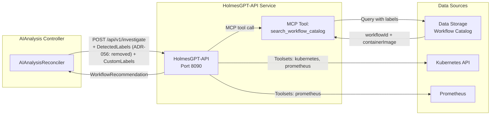

# AI Analysis Service - HolmesGPT Integration & Approval Policies

**Version**: v2.0
**Last Updated**: 2025-11-30
**Status**: ✅ V1.0 Scope Defined

---

## Changelog

| Version | Date | Changes | Reference |
|---------|------|---------|-----------|
| v2.0 | 2025-11-30 | **REGENERATED**: Fixed SignalProcessing naming; V1.0 approval signaling (no AIApprovalRequest CRD); Removed legacy phases; Reference to REGO_POLICY_EXAMPLES.md for input schema | DD-WORKFLOW-001 v1.8 |
| v1.1 | 2025-10-16 | Added toolset management | - |
| v1.0 | 2025-10-15 | Initial specification | - |

---

## HolmesGPT-API Integration (V1.0)

### Architecture Overview



### Key Integration Points

| Aspect | V1.0 Approach |
|--------|---------------|
| **AI Provider** | HolmesGPT-API only (single provider) |
| **Workflow Selection** | MCP tool: `search_workflow_catalog` |
| **Labels for Filtering** | DetectedLabels (ADR-056: removed from EnrichmentResults) + CustomLabels passed to HolmesGPT-API |
| **Toolsets** | System-wide configuration (kubernetes, prometheus) |
| **No LLM Config in CRD** | ❌ `HolmesGPTConfig` removed from AIAnalysis.spec |

### Investigation Request (V1.0)

```go
// Sent to HolmesGPT-API
type InvestigationRequest struct {
    SignalContext      SignalContextInput     `json:"signalContext"`
    KubernetesContext  *KubernetesContext     `json:"kubernetesContext,omitempty"`

    // Labels for workflow filtering (DD-WORKFLOW-001 v1.8)
    DetectedLabels     *DetectedLabels        `json:"detectedLabels,omitempty"`  // ADR-056: removed from EnrichmentResults
    CustomLabels       map[string][]string    `json:"customLabels,omitempty"`
    OwnerChain         []OwnerChainEntry      `json:"ownerChain,omitempty"`     // ADR-055: removed from EnrichmentResults

    // Recovery context
    IsRecoveryAttempt  bool                   `json:"isRecoveryAttempt,omitempty"`
    PreviousExecutions []PreviousExecution    `json:"previousExecutions,omitempty"`
}
```

### Investigation Response

```go
// Received from HolmesGPT-API
type InvestigationResponse struct {
    InvestigationID        string                  `json:"investigationId"`
    Status                 string                  `json:"status"`
    WorkflowRecommendation *WorkflowRecommendation `json:"workflowRecommendation"`
    InvestigationSummary   string                  `json:"investigationSummary"`
    RootCauseAnalysis      string                  `json:"rootCauseAnalysis"`
}

type WorkflowRecommendation struct {
    WorkflowID     string            `json:"workflowId"`     // UUID from catalog
    ContainerImage string            `json:"containerImage"` // OCI reference (BR-AI-075)
    Parameters     map[string]string `json:"parameters"`
    Confidence     float64           `json:"confidence"`     // 0.0-1.0
    Reasoning      string            `json:"reasoning"`
}
```

---

## HolmesGPT Toolsets

### Toolset Architecture

**Architectural Principle**: HolmesGPT fetches logs/metrics **dynamically** using built-in toolsets. SignalProcessing provides **enrichment data** that AIAnalysis passes through.

### V1.0 Toolsets

| Toolset | Status | Capabilities | Usage |
|---------|--------|--------------|-------|
| **kubernetes** | ✅ | Pod logs, K8s events, resource status | PRIMARY - Real-time cluster data |
| **prometheus** | ✅ | Query metrics, PromQL queries | PRIMARY - Metrics context |
| **grafana** | ✅ | Dashboard panels, visualizations | Optional |

### What AIAnalysis Provides (Targeting Data)

```yaml
# From spec.enrichmentResults (copied from SignalProcessing)
enrichmentResults:
  kubernetesContext:
    namespace: "production"
    podDetails:
      name: "payment-api-7d8f9c6b5-x2j4k"
      phase: "Running"
      restartCount: 5
    deploymentDetails:
      name: "payment-api"
      replicas: 3
```

### What HolmesGPT Toolsets Fetch (Real-Time)

```python
# HolmesGPT uses kubernetes toolset
kubernetes_toolset.get_pod_logs(
    namespace="production",
    pod_name="payment-api-7d8f9c6b5-x2j4k",
    container="api",
    tail_lines=500  # Fresh, real-time logs
)

# HolmesGPT uses prometheus toolset
prometheus_toolset.query_metrics(
    query='container_memory_usage_bytes{pod="payment-api-7d8f9c6b5-x2j4k"}',
    time_range="1h"
)
```

---

## Rego Approval Policies (V1.0)

### V1.0 Approval Flow

**Important**: V1.0 uses **approval signaling**, not a separate AIApprovalRequest CRD.

```
AIAnalysis Controller
    ↓
Evaluate Rego Policy
    ↓
Set status.approvalRequired = true/false
    ↓
Transition to Completed
    ↓
RO watches status.phase == "Completed"
    ↓
If approvalRequired:
    RO → Notification Service → Operators
Else:
    RO → Create WorkflowExecution
```

### Rego Policy Storage

**ConfigMap**: `ai-approval-policies` in `kubernaut-system`

### Policy Input Schema

**See**: [REGO_POLICY_EXAMPLES.md](./REGO_POLICY_EXAMPLES.md) for complete input schema and examples.

```go
// Rego policy input (per REGO_POLICY_EXAMPLES.md v1.2)
type ApprovalPolicyInput struct {
    Confidence          float64             `json:"confidence"`
    Environment         string              `json:"environment"`
    Severity            string              `json:"severity"`
    ActionType          string              `json:"action_type"`
    DetectedLabels      *DetectedLabelsInput `json:"detected_labels,omitempty"`
    CustomLabels        map[string][]string `json:"custom_labels,omitempty"`
    IsRecoveryAttempt   bool                `json:"is_recovery_attempt"`
    RecoveryAttemptNumber int               `json:"recovery_attempt_number"`
}

// DetectedLabelsInput uses snake_case per DD-WORKFLOW-001 v1.6
type DetectedLabelsInput struct {
    GitOpsManaged           bool   `json:"git_ops_managed,omitempty"`
    GitOpsTool              string `json:"git_ops_tool,omitempty"`
    PDBProtected            bool   `json:"pdb_protected,omitempty"`
    StatefulWorkload        bool   `json:"stateful_workload,omitempty"`
    HPAEnabled              bool   `json:"hpa_enabled,omitempty"`
    ResourceQuotaConstrained bool  `json:"resource_quota_constrained,omitempty"`
}
```

### Example Rego Policy (V1.0)

```rego
package aianalysis.approval

default decision = "MANUAL_APPROVAL_REQUIRED"

# Auto-approve if high confidence in non-production
decision = "AUTO_APPROVE" {
    input.confidence >= 0.8
    input.environment != "production"
}

# Auto-approve GitOps-managed + high confidence
decision = "AUTO_APPROVE" {
    input.confidence >= 0.85
    input.detected_labels.git_ops_managed == true
}

# Auto-approve PDB-protected (safe to restart)
decision = "AUTO_APPROVE" {
    input.confidence >= 0.8
    input.detected_labels.pdb_protected == true
    input.action_type != "drain_node"
}

# Always require approval in production with low confidence
decision = "MANUAL_APPROVAL_REQUIRED" {
    input.confidence < 0.8
    input.environment == "production"
}

# Always require approval for recovery attempts
decision = "MANUAL_APPROVAL_REQUIRED" {
    input.is_recovery_attempt == true
}
```

### Controller Integration

```go
func (r *AIAnalysisReconciler) evaluateApprovalPolicy(
    ctx context.Context,
    aiAnalysis *aianalysisv1.AIAnalysis,
) (string, error) {
    // Build policy input (snake_case for Rego)
    input := rego.ApprovalPolicyInput{
        Confidence:  aiAnalysis.Status.SelectedWorkflow.Confidence,
        Environment: aiAnalysis.Spec.SignalContext.Environment,
        Severity:    aiAnalysis.Spec.SignalContext.Severity,
        ActionType:  "workflow_execution",
    }

    // Add labels if available
    if aiAnalysis.Spec.EnrichmentResults != nil {
        if dl := aiAnalysis.Spec.EnrichmentResults.DetectedLabels; dl != nil {  // ADR-056: removed from EnrichmentResults
            input.DetectedLabels = &rego.DetectedLabelsInput{
                GitOpsManaged:    dl.GitOpsTool != "",
                GitOpsTool:       dl.GitOpsTool,
                PDBProtected:     dl.PDBProtected,
                StatefulWorkload: dl.StatefulWorkload,
                HPAEnabled:       dl.HPAEnabled,
            }
        }
        input.CustomLabels = aiAnalysis.Spec.EnrichmentResults.CustomLabels
    }

    // Recovery context
    input.IsRecoveryAttempt = aiAnalysis.Spec.IsRecoveryAttempt
    input.RecoveryAttemptNumber = aiAnalysis.Spec.RecoveryAttemptNumber

    return r.RegoEvaluator.Evaluate(ctx, input)
}
```

---

## V1.0 Output (for RO Consumption)

### Status Fields

```yaml
status:
  phase: "Completed"

  selectedWorkflow:
    workflowId: "wf-memory-increase-v2"
    containerImage: "ghcr.io/kubernaut/workflows/memory-increase:v2.1.0"
    parameters:
      targetDeployment: "payment-api"
      memoryIncrease: "512Mi"
    confidence: 0.87
    reasoning: "Historical success rate 92% for OOM scenarios"

  # V1.0: Signaling only - RO handles notification
  approvalRequired: true
  approvalReason: "Confidence below 80% threshold in production"

  investigationSummary: "OOMKilled due to memory leak"
```

### RO Behavior

| `approvalRequired` | RO Action |
|--------------------|-----------|
| `false` | Create WorkflowExecution CRD immediately |
| `true` | Create notification via Notification Service, wait for operator |

---

## V1.1 Enhancement (Deferred)

**Not in V1.0**: `AIApprovalRequest` CRD for explicit approval workflow

**V1.1 will add**:
- `AIApprovalRequest` CRD with RBAC-secured approval
- Approval timeout handling
- Multi-approver support
- Approval audit trail

---

## Metrics

### HolmesGPT-API Metrics

```go
var (
    holmesGPTRequestDuration = prometheus.NewHistogramVec(
        prometheus.HistogramOpts{
            Name:    "kubernaut_holmesgpt_request_duration_seconds",
            Help:    "Duration of HolmesGPT-API requests",
            Buckets: []float64{1, 5, 10, 30, 60},
        },
        []string{"endpoint", "status"},
    )

    holmesGPTWorkflowConfidence = prometheus.NewHistogramVec(
        prometheus.HistogramOpts{
            Name:    "kubernaut_holmesgpt_workflow_confidence",
            Help:    "Confidence scores for recommended workflows",
            Buckets: []float64{0.5, 0.6, 0.7, 0.8, 0.9, 0.95},
        },
        []string{"environment"},
    )
)
```

### Approval Policy Metrics

```go
var (
    approvalDecisionCount = prometheus.NewCounterVec(
        prometheus.CounterOpts{
            Name: "kubernaut_aianalysis_approval_decisions_total",
            Help: "Total approval decisions by type",
        },
        []string{"decision", "environment"},  // AUTO_APPROVE, MANUAL_APPROVAL_REQUIRED
    )

    approvalRequiredRate = prometheus.NewGaugeVec(
        prometheus.GaugeOpts{
            Name: "kubernaut_aianalysis_approval_required_rate",
            Help: "Rate of recommendations requiring manual approval",
        },
        []string{"environment"},
    )
)
```

---

## Error Handling

### HolmesGPT-API Errors

| Error | Retry | Action |
|-------|-------|--------|
| Connection timeout | 3 attempts | Exponential backoff (1s, 2s, 4s) |
| Investigation timeout (60s) | No | Mark as Failed |
| No workflow found | No | Mark as Failed |
| Invalid response | No | Mark as Failed |

### Rego Policy Errors

| Error | Action |
|-------|--------|
| Policy not found | Default to MANUAL_APPROVAL_REQUIRED |
| Evaluation error | Log error, default to MANUAL_APPROVAL_REQUIRED |

---

## Related Documents

| Document | Purpose |
|----------|---------|
| [REGO_POLICY_EXAMPLES.md](./REGO_POLICY_EXAMPLES.md) | **AUTHORITATIVE** - Policy input schema, examples |
| [Controller Implementation](./controller-implementation.md) | Reconciler logic |
| [Integration Points](./integration-points.md) | Service integration |
| [DD-WORKFLOW-001](../../../architecture/decisions/DD-WORKFLOW-001-mandatory-label-schema.md) | Label schema |
| [HANDOFF_REQUEST_HOLMESGPT_API_RECOVERY_PROMPT.md](./HANDOFF_REQUEST_HOLMESGPT_API_RECOVERY_PROMPT.md) | HolmesGPT-API team handoff |
