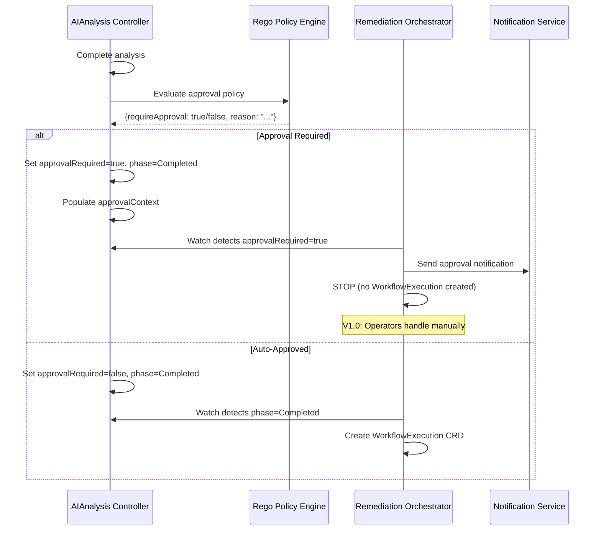

## CRD Schema Specification

> **📋 Changelog**
> | Version | Date | Changes | Reference |
> |---------|------|---------|-----------|
> | **v2.7** | 2025-12-10 | **SCHEMA UPDATE**: Removed `TokensUsed` from status - LLM token tracking is HAPI's responsibility; HAPI exposes `holmesgpt_llm_token_usage_total` Prometheus metric; AIAnalysis correlates via `InvestigationID` | DD-COST-001 |
> | v2.6 | 2025-12-09 | **V1.0 COMPLIANCE AUDIT**: Identified gaps: API Group code mismatch (code uses `.io`, should be `.ai` per DD-CRD-001); Status fields not populated (InvestigationID, Conditions); Recovery fields not passed to HAPI; Timeout should be spec field not annotation | [NOTICE_AIANALYSIS_V1_COMPLIANCE_GAPS.md](../../../handoff/NOTICE_AIANALYSIS_V1_COMPLIANCE_GAPS.md), [DD-CRD-001](../../../architecture/decisions/DD-CRD-001-api-group-domain-selection.md) |
> | v2.5 | 2025-12-05 | **SCHEMA UPDATE**: Added `AlternativeWorkflows []AlternativeWorkflow` to status for audit/operator context (NOT for automatic execution); Per HolmesGPT-API team: Alternatives are for CONTEXT, not EXECUTION | [AIANALYSIS_TO_HOLMESGPT_API_TEAM.md](../../../handoff/AIANALYSIS_TO_HOLMESGPT_API_TEAM.md) |
> | v2.4 | 2025-12-03 | **SCHEMA UPDATE**: Removed `podSecurityLevel` from DetectedLabels (9→8 fields) per DD-WORKFLOW-001 v2.2; PSP deprecated in K8s 1.21, PSS is namespace-level | [DD-WORKFLOW-001 v2.2](../../../architecture/decisions/DD-WORKFLOW-001-mandatory-label-schema.md), [NOTICE](../../../handoff/NOTICE_PODSECURITYLEVEL_REMOVED.md) |
> | v2.3 | 2025-12-02 | **SCHEMA UPDATE**: Added `FailedDetections []string` to DetectedLabels per DD-WORKFLOW-001 v2.1; Detection failure handling with enum validation | [DD-WORKFLOW-001 v2.1](../../../architecture/decisions/DD-WORKFLOW-001-mandatory-label-schema.md) |
> | v2.2 | 2025-12-02 | **GAP FIXES**: Environment/BusinessPriority changed to free-text; RiskTolerance/BusinessCategory removed; EnrichmentQuality removed; Updated SignalContextInput to match Go types | [RO_CONTRACT_GAPS.md](../../../handoff/AIANALYSIS_TO_RO_TEAM.md) |
> | v2.1 | 2025-12-02 | Added `TargetInOwnerChain` and `Warnings` fields to status (from HolmesGPT-API response) | [AIANALYSIS_TO_HOLMESGPT_API_TEAM.md](../../../handoff/AIANALYSIS_TO_HOLMESGPT_API_TEAM.md) |
> | v2.0 | 2025-11-30 | **REGENERATED**: Complete schema from Go types; Added DetectedLabels, CustomLabels, OwnerChain; Removed businessContext, investigationScope, HistoricalContext; Updated PreviousExecutions to slice; V1.0 approval flow clarification | [DD-WORKFLOW-001 v1.8](../../../architecture/decisions/DD-WORKFLOW-001-mandatory-label-schema.md), [DD-RECOVERY-002](../../../architecture/decisions/DD-RECOVERY-002-direct-aianalysis-recovery-flow.md) |
> | v1.0 | 2025-11-28 | Initial CRD schema | - |

**Source of Truth**: `api/aianalysis/v1alpha1/aianalysis_types.go`

**API Group**: `kubernaut.ai/v1alpha1` (unified API group for all Kubernaut CRDs)

**Location**: `api/aianalysis/v1alpha1/aianalysis_types.go`

---

## Key Design Decisions

| Document | Impact on CRD |
|----------|---------------|
| **DD-CONTRACT-002** | Self-contained CRD pattern - all data in spec |
| **DD-WORKFLOW-001 v1.8** | DetectedLabels (ADR-056: removed), CustomLabels, OwnerChain (ADR-055: removed) in EnrichmentResults |
| **DD-RECOVERY-002** | Recovery flow with `PreviousExecutions` slice |
| **DD-RECOVERY-003** | Kubernetes reason codes for failure (not natural language) |
| **ADR-040** | Approval orchestration handled by RO, not AIAnalysis |
| **ADR-041** | LLM response contract defines `selected_workflow` format |

---

## V1.0 Scope Clarifications

| Feature | V1.0 Status | Notes |
|---------|-------------|-------|
| **LLM Provider** | HolmesGPT-API only | No `LLMProvider`, `LLMModel`, `Temperature` fields |
| **Approval Flow** | `approvalRequired=true` → RO notifies | No `AIApprovalRequest` CRD (V1.1) |
| **Investigation Scope** | HolmesGPT decides | No `investigationScope` field |
| **Business Context** | Via CustomLabels (Rego) | No hardcoded `businessContext` struct |
| **Historical Context** | Operators only | Not for LLM input |

---

## ✅ TYPE SAFETY COMPLIANCE

This CRD specification uses **fully structured types**:

| Type | Structure | Benefit |
|------|-----------|---------|
| **EnrichmentResults** | Structured with DetectedLabels (ADR-056: removed), CustomLabels, OwnerChain (ADR-055: removed) | Type safety, OpenAPI validation |
| **PreviousExecutions** | `[]PreviousExecution` slice | Tracks ALL recovery attempts |
| **ApprovalContext** | Rich structured context | Complete approval information |

---

## CRD Definition

```go
// +kubebuilder:object:root=true
// +kubebuilder:subresource:status
// +kubebuilder:printcolumn:name="Phase",type=string,JSONPath=`.status.phase`
// +kubebuilder:printcolumn:name="Confidence",type=number,JSONPath=`.status.selectedWorkflow.confidence`
// +kubebuilder:printcolumn:name="ApprovalRequired",type=boolean,JSONPath=`.status.approvalRequired`
// +kubebuilder:printcolumn:name="Age",type=date,JSONPath=`.metadata.creationTimestamp`

// AIAnalysis is the Schema for the aianalyses API.
type AIAnalysis struct {
    metav1.TypeMeta   `json:",inline"`
    metav1.ObjectMeta `json:"metadata,omitempty"`

    Spec   AIAnalysisSpec   `json:"spec,omitempty"`
    Status AIAnalysisStatus `json:"status,omitempty"`
}
```

---

## Spec Fields

### AIAnalysisSpec

```go
// AIAnalysisSpec defines the desired state of AIAnalysis.
// Design Decision: DD-CONTRACT-002 (self-contained CRD pattern)
// V1.0: HolmesGPT-API only (no LLM config fields)
// Recovery: DD-RECOVERY-002 (direct recovery flow)
type AIAnalysisSpec struct {
    // ========================================
    // PARENT REFERENCE (Audit/Lineage)
    // ========================================
    // Reference to parent RemediationRequest CRD for audit trail
    // +kubebuilder:validation:Required
    RemediationRequestRef corev1.ObjectReference `json:"remediationRequestRef"`

    // Remediation ID for audit correlation (DD-WORKFLOW-002 v2.2)
    // +kubebuilder:validation:Required
    // +kubebuilder:validation:MinLength=1
    RemediationID string `json:"remediationId"`

    // ========================================
    // ANALYSIS REQUEST (DD-CONTRACT-002)
    // ========================================
    // Complete analysis request with structured context
    // +kubebuilder:validation:Required
    AnalysisRequest AnalysisRequest `json:"analysisRequest"`

    // ========================================
    // RECOVERY FIELDS (DD-RECOVERY-002)
    // Populated by RO when this is a recovery attempt
    // ========================================
    // True if this AIAnalysis is for a recovery attempt (not initial incident)
    IsRecoveryAttempt bool `json:"isRecoveryAttempt,omitempty"`

    // Recovery attempt number (1, 2, 3...) - only set when IsRecoveryAttempt=true
    // +kubebuilder:validation:Minimum=1
    RecoveryAttemptNumber int `json:"recoveryAttemptNumber,omitempty"`

    // Previous execution history (only set when IsRecoveryAttempt=true)
    // Contains details about ALL previous attempts - allows LLM to:
    // 1. Avoid repeating failed approaches
    // 2. Learn from multiple failures
    // 3. Consider re-trying earlier approaches after later failures
    // Ordered chronologically: index 0 = first attempt, last index = most recent
    PreviousExecutions []PreviousExecution `json:"previousExecutions,omitempty"`
}
```

### AnalysisRequest

```go
// AnalysisRequest contains the structured analysis request
// DD-CONTRACT-002: Self-contained context for AIAnalysis
type AnalysisRequest struct {
    // Signal context from SignalProcessing enrichment
    // +kubebuilder:validation:Required
    SignalContext SignalContextInput `json:"signalContext"`

    // Analysis types to perform (e.g., "investigation", "root-cause", "workflow-selection")
    // +kubebuilder:validation:MinItems=1
    AnalysisTypes []string `json:"analysisTypes"`
}
```

### SignalContextInput

```go
// SignalContextInput contains enriched signal context from SignalProcessing
// DD-CONTRACT-002: Structured types replace map[string]string anti-pattern
type SignalContextInput struct {
    // Signal fingerprint for correlation
    // +kubebuilder:validation:Required
    // +kubebuilder:validation:MaxLength=64
    Fingerprint string `json:"fingerprint"`

    // Signal severity: critical, warning, info
    // +kubebuilder:validation:Enum=critical;warning;info
    Severity string `json:"severity"`

    // Signal type (e.g., OOMKilled, CrashLoopBackOff)
    // +kubebuilder:validation:Required
    SignalType string `json:"signalType"`

    // Environment classification
    // GAP-C3-01 FIX: Changed from enum to free-text (values defined by Rego policies)
    // Examples: "production", "staging", "development", "qa-eu", "canary"
    // +kubebuilder:validation:MinLength=1
    // +kubebuilder:validation:MaxLength=63
    Environment string `json:"environment"`

    // Business priority
    // GAP-C3-01 RELATED: Changed from enum to free-text for consistency
    // Best practice examples: P0 (critical), P1 (high), P2 (normal), P3 (low)
    // +kubebuilder:validation:MinLength=1
    // +kubebuilder:validation:MaxLength=63
    BusinessPriority string `json:"businessPriority"`

    // GAP-C3-02 FIX: RiskTolerance REMOVED - now in CustomLabels via Rego policies
    // Per DD-WORKFLOW-001 v1.4: risk_tolerance is customer-derived, not system-controlled

    // GAP-C3-03 FIX: BusinessCategory REMOVED - now in CustomLabels via Rego policies
    // Per DD-WORKFLOW-001 v1.4: business_category is customer-derived, not mandatory

    // Target resource identification
    TargetResource TargetResource `json:"targetResource"`

    // Complete enrichment results from SignalProcessing
    // GAP-C3-04 FIX: Uses shared types from pkg/shared/types/enrichment.go
    // +kubebuilder:validation:Required
    EnrichmentResults sharedtypes.EnrichmentResults `json:"enrichmentResults"`
}
```

> **⚠️ IMPORTANT CHANGES (Dec 2025)**:
> - `Environment` and `BusinessPriority` are now **free-text** (not enum)
> - `RiskTolerance` and `BusinessCategory` fields **REMOVED** - use `CustomLabels` via Rego
> - `EnrichmentResults` uses shared types from `pkg/shared/types/enrichment.go`

---

## EnrichmentResults (DD-WORKFLOW-001 v1.8)

**Source of Truth**: `pkg/shared/types/enrichment.go` (shared across CRDs)

```go
// EnrichmentResults contains all enrichment data from SignalProcessing
// DD-CONTRACT-002: Matches SignalProcessing.Status.EnrichmentResults
type EnrichmentResults struct {
    // Kubernetes resource context (pod status, node conditions, etc.)
    KubernetesContext *KubernetesContext `json:"kubernetesContext,omitempty"`

    // Auto-detected cluster characteristics - NO CONFIG NEEDED
    // SignalProcessing detects these from K8s resources automatically
    // Used by HolmesGPT-API for: workflow filtering + LLM context
    // ADR-056: removed from EnrichmentResults, now computed by HAPI post-RCA
    DetectedLabels *DetectedLabels `json:"detectedLabels,omitempty"`

    // OwnerChain: K8s ownership traversal from signal source resource
    // DD-WORKFLOW-001 v1.8: Used by HolmesGPT-API for 100% safe DetectedLabels validation
    // ADR-055: removed from EnrichmentResults
    // SignalProcessing traverses metadata.ownerReferences to build this chain
    // Example: Pod → ReplicaSet → Deployment
    // Empty chain = orphan resource (no owners)
    OwnerChain []OwnerChainEntry `json:"ownerChain,omitempty"`  // ADR-055: removed from EnrichmentResults

    // Custom labels from Rego policies - CUSTOMER DEFINED
    // Key = subdomain/category (e.g., "constraint", "team", "region")
    // Value = list of label values (boolean keys or "key=value" pairs)
    // Example: {"constraint": ["cost-constrained"], "team": ["name=payments"]}
    CustomLabels map[string][]string `json:"customLabels,omitempty"`

    // NOTE: EnrichmentQuality REMOVED (Dec 2025)
    // - SignalProcessing is not implementing this field
    // - SignalProcessing uses boolean `DegradedMode` flag instead
    // - RO checks phase completion, not quality scores
}
```

> **Note**: `EnrichmentQuality` field was removed in Dec 2025:
> - SignalProcessing uses a boolean `status.degradedMode` flag (not a float score)
> - `DegradedMode = true` when **K8s API is unavailable** → falls back to signal labels
> - RO checks `SignalProcessing.status.phase == "completed"`, not quality
> - AIAnalysis uses `TargetInOwnerChain` from HolmesGPT-API for Rego approval policies

### DetectedLabels (8 Fields)

```go
// DetectedLabels contains auto-detected cluster characteristics
// SignalProcessing populates these automatically from K8s resources
// HolmesGPT-API uses for:
//   - Workflow filtering (deterministic SQL WHERE)
//   - LLM context (natural language in prompt)
// DD-WORKFLOW-001 v2.2: Detection failure handling with FailedDetections
//   - LLM Prompt: ALWAYS included
//   - Workflow Filtering: CONDITIONAL (only when OwnerChain validates)
//   - Skip filtering for fields in FailedDetections
//   - podSecurityLevel REMOVED (PSP deprecated K8s 1.21, PSS is namespace-level)
type DetectedLabels struct {
    // ========================================
    // DETECTION METADATA (DD-WORKFLOW-001 v2.2)
    // ========================================
    // Lists fields where detection failed (RBAC, timeout, etc.)
    // If a field is in this array, ignore its value
    // If empty/nil, all detections succeeded
    // Validated: only accepts known field names (8 fields)
    FailedDetections []string `json:"failedDetections,omitempty" validate:"omitempty,dive,oneof=gitOpsManaged pdbProtected hpaEnabled stateful helmManaged networkIsolated serviceMesh"`

    // ========================================
    // GITOPS MANAGEMENT
    // ========================================
    GitOpsManaged bool   `json:"gitOpsManaged"`           // ArgoCD/Flux detected
    GitOpsTool    string `json:"gitOpsTool,omitempty"`    // "argocd", "flux", ""

    // ========================================
    // WORKLOAD PROTECTION
    // ========================================
    PDBProtected bool `json:"pdbProtected"`  // PodDisruptionBudget exists
    HPAEnabled   bool `json:"hpaEnabled"`    // HorizontalPodAutoscaler targets workload

    // ========================================
    // WORKLOAD CHARACTERISTICS
    // ========================================
    Stateful    bool `json:"stateful"`     // StatefulSet or PVCs attached
    HelmManaged bool `json:"helmManaged"`  // helm.sh/chart label

    // ========================================
    // SECURITY POSTURE
    // ========================================
    NetworkIsolated bool   `json:"networkIsolated"`       // NetworkPolicy exists
    // NOTE: podSecurityLevel REMOVED in DD-WORKFLOW-001 v2.2
    // Reason: PSP deprecated in K8s 1.21, removed in 1.25; PSS is namespace-level
    ServiceMesh     string `json:"serviceMesh,omitempty"` // "istio", "linkerd"
}

// Detection Failure Handling (DD-WORKFLOW-001 v2.1):
// | Scenario            | pdbProtected | FailedDetections      | Meaning                    |
// |---------------------|--------------|----------------------|----------------------------|
// | PDB exists for pod  | true         | []                   | ✅ Has PDB protection      |
// | No PDB for pod      | false        | []                   | ✅ No PDB protection       |
// | RBAC denied query   | false        | ["pdbProtected"]     | ⚠️ Unknown - skip filter   |
//
// Key: "Resource doesn't exist" ≠ detection failure - it's a successful detection with result false.
```

### OwnerChainEntry (DD-WORKFLOW-001 v1.8)

```go
// OwnerChainEntry represents a single entry in the K8s ownership chain
// SignalProcessing traverses ownerReferences to build this chain
// HolmesGPT-API uses for DetectedLabels validation
type OwnerChainEntry struct {
    // Namespace of the owner (empty for cluster-scoped like Node)
    Namespace string `json:"namespace,omitempty"`
    // Kind of the owner (ReplicaSet, Deployment, StatefulSet, DaemonSet)
    Kind string `json:"kind"`
    // Name of the owner
    Name string `json:"name"`
}
```

---

## Recovery Types (DD-RECOVERY-002)

### PreviousExecution

```go
// PreviousExecution contains context from a failed workflow execution
// DD-RECOVERY-002: Used when IsRecoveryAttempt=true
// NOTE: This is a SLICE - tracks ALL previous attempts, not just the last one
type PreviousExecution struct {
    // Reference to the failed WorkflowExecution CRD
    WorkflowExecutionRef string `json:"workflowExecutionRef"`

    // Original RCA from initial AIAnalysis
    OriginalRCA OriginalRCA `json:"originalRCA"`

    // Selected workflow that was executed and failed
    SelectedWorkflow SelectedWorkflowSummary `json:"selectedWorkflow"`

    // Structured failure information with Kubernetes reason codes
    Failure ExecutionFailure `json:"failure"`
}
```

### ExecutionFailure (Kubernetes Reason Codes)

```go
// ExecutionFailure contains structured failure information
// Uses Kubernetes reason codes as API contract (DD-RECOVERY-003)
// NOT natural language - structured enum-like value
type ExecutionFailure struct {
    FailedStepIndex int         `json:"failedStepIndex"` // 0-indexed
    FailedStepName  string      `json:"failedStepName"`
    Reason          string      `json:"reason"`          // K8s reason code (OOMKilled, DeadlineExceeded)
    Message         string      `json:"message"`         // Human-readable (for logging)
    ExitCode        *int32      `json:"exitCode,omitempty"`
    FailedAt        metav1.Time `json:"failedAt"`
    ExecutionTime   string      `json:"executionTime"`   // Duration before failure
}
```

---

## Status Fields

### AIAnalysisStatus

```go
// AIAnalysisStatus defines the observed state of AIAnalysis.
type AIAnalysisStatus struct {
    // Phase tracking
    // NOTE: No "Approving" phase - RO orchestrates approval (ADR-040)
    // +kubebuilder:validation:Enum=Pending;Investigating;Analyzing;Recommending;Completed;Failed
    Phase   string `json:"phase"`
    Message string `json:"message,omitempty"`
    Reason  string `json:"reason,omitempty"`

    // Timestamps
    StartedAt   *metav1.Time `json:"startedAt,omitempty"`
    CompletedAt *metav1.Time `json:"completedAt,omitempty"`

    // Root cause analysis results
    RootCause         string             `json:"rootCause,omitempty"`
    RootCauseAnalysis *RootCauseAnalysis `json:"rootCauseAnalysis,omitempty"`

    // Selected workflow (DD-CONTRACT-002)
    SelectedWorkflow *SelectedWorkflow `json:"selectedWorkflow,omitempty"`

    // ========================================
    // ALTERNATIVE WORKFLOWS (Dec 2025)
    // ========================================
    // Alternative workflows considered but not selected.
    // INFORMATIONAL ONLY - NOT for automatic execution.
    // Helps operators make informed approval decisions and provides audit trail.
    // +optional
    AlternativeWorkflows []AlternativeWorkflow `json:"alternativeWorkflows,omitempty"`

    // ========================================
    // APPROVAL SIGNALING (V1.0)
    // ========================================
    // ApprovalRequired=true → RO notifies operators and STOPS
    // No AIApprovalRequest CRD in V1.0 (deferred to V1.1)
    ApprovalRequired bool             `json:"approvalRequired"`
    ApprovalReason   string           `json:"approvalReason,omitempty"`
    ApprovalContext  *ApprovalContext `json:"approvalContext,omitempty"`

    // Investigation details
    InvestigationID   string `json:"investigationId,omitempty"`
    // NOTE: TokensUsed REMOVED (v2.7) - HAPI owns LLM cost observability
    // Use InvestigationID to correlate with HAPI's holmesgpt_llm_token_usage_total metric
    InvestigationTime int64  `json:"investigationTime,omitempty"`

    // ========================================
    // HAPI RESPONSE METADATA (Dec 2025)
    // ========================================
    // Whether the RCA-identified target resource was found in OwnerChain
    // If false, DetectedLabels may be from different scope than affected resource
    // Used for: Rego policy input, audit trail, operator notifications, metrics
    TargetInOwnerChain *bool    `json:"targetInOwnerChain,omitempty"`
    // Non-fatal warnings from HolmesGPT-API (e.g., OwnerChain validation, low confidence)
    Warnings           []string `json:"warnings,omitempty"`

    // Recovery status (DD-RECOVERY-002)
    RecoveryStatus *RecoveryStatus `json:"recoveryStatus,omitempty"`

    // Conditions
    Conditions []metav1.Condition `json:"conditions,omitempty"`
}
```

### SelectedWorkflow (DD-CONTRACT-002)

```go
// SelectedWorkflow contains the AI-selected workflow for execution
// DD-CONTRACT-002: Output format for RO to create WorkflowExecution
type SelectedWorkflow struct {
    // Workflow identifier (catalog lookup key)
    WorkflowID string `json:"workflowId"`
    // Workflow version
    Version string `json:"version"`
    // Container image (OCI bundle) - resolved by HolmesGPT-API
    ContainerImage string `json:"containerImage"`
    // Container digest for audit trail
    ContainerDigest string `json:"containerDigest,omitempty"`
    // Confidence score (0.0-1.0)
    Confidence float64 `json:"confidence"`
    // Workflow parameters (UPPER_SNAKE_CASE keys per DD-WORKFLOW-003)
    Parameters map[string]string `json:"parameters,omitempty"`
    // Rationale explaining why this workflow was selected
    Rationale string `json:"rationale"`
}
```

### AlternativeWorkflow (Dec 2025)

```go
// AlternativeWorkflow contains alternative workflows considered but not selected.
// INFORMATIONAL ONLY - NOT for automatic execution.
// Helps operators understand AI reasoning during approval decisions.
// Per HolmesGPT-API team (Dec 5, 2025): Alternatives are for CONTEXT, not EXECUTION.
type AlternativeWorkflow struct {
    // Workflow identifier (catalog lookup key)
    WorkflowID string `json:"workflowId"`
    // Container image (OCI bundle) - resolved by HolmesGPT-API
    ContainerImage string `json:"containerImage,omitempty"`
    // Confidence score (0.0-1.0) - shows why it wasn't selected
    Confidence float64 `json:"confidence"`
    // Rationale explaining why this workflow was considered
    Rationale string `json:"rationale"`
}
```

> **Key Principle** (per HolmesGPT-API team):
> - ✅ `SelectedWorkflow` is executed by RemediationOrchestrator
> - ✅ `AlternativeWorkflows` help operators make informed approval decisions
> - ❌ Alternatives are NOT automatically executed as fallbacks

---

## V1.0 Approval Flow



**V1.0 Behavior**:
- `approvalRequired=true` → RO notifies operators and **stops**
- No `AIApprovalRequest` CRD (deferred to V1.1)
- Operators approve/reject via external process

---

## Example: Initial Incident

```yaml
apiVersion: kubernaut.ai/v1alpha1
kind: AIAnalysis
metadata:
  name: aianalysis-abc123
  namespace: kubernaut-system
  ownerReferences:
  - apiVersion: kubernaut.ai/v1alpha1
    kind: RemediationRequest
    name: remediation-abc12345
    controller: true
spec:
  remediationRequestRef:
    apiVersion: kubernaut.ai/v1alpha1
    kind: RemediationRequest
    name: remediation-abc12345
    namespace: kubernaut-system
  remediationId: "abc12345"

  analysisRequest:
    signalContext:
      fingerprint: "sha256:abc123def456"
      severity: critical
      signalType: OOMKilled
      environment: production           # Free-text (not enum)
      businessPriority: P0              # Free-text (not enum)
      # NOTE: riskTolerance REMOVED - use customLabels["constraint"]
      # NOTE: businessCategory REMOVED - use customLabels["business"]
      targetResource:
        kind: Pod
        name: payment-api-7d8f9c6b5-x2k4m
        namespace: production
      enrichmentResults:
        kubernetesContext:
          namespace: production
          namespaceLabels:
            environment: production
          podDetails:
            name: payment-api-7d8f9c6b5-x2k4m
            phase: Failed
            restartCount: 5
        detectedLabels:
          gitOpsManaged: true
          gitOpsTool: argocd
          pdbProtected: true
          stateful: false
        ownerChain:
        - namespace: production
          kind: ReplicaSet
          name: payment-api-7d8f9c6b5
        - namespace: production
          kind: Deployment
          name: payment-api
        customLabels:
          constraint:
          - cost-constrained
          - risk-tolerance=low          # Customer-derived via Rego
          team:
          - name=payments
          business:
          - category=payment-service    # Customer-derived via Rego
        # NOTE: enrichmentQuality REMOVED (Dec 2025)
    analysisTypes:
    - investigation
    - root-cause
    - workflow-selection

  isRecoveryAttempt: false
status:
  phase: Completed
  rootCause: "Memory limit exceeded due to traffic spike"
  targetInOwnerChain: true              # From HolmesGPT-API response
  warnings: []                          # No warnings
  selectedWorkflow:
    workflowId: oomkill-increase-memory
    version: "1.0.0"
    containerImage: quay.io/kubernaut/workflow-oomkill:v1.0.0
    containerDigest: "sha256:abc123..."
    confidence: 0.92
    parameters:
      NAMESPACE: production
      DEPLOYMENT_NAME: payment-api
      NEW_MEMORY_LIMIT: "1Gi"
    rationale: "OOMKilled signal with GitOps-managed deployment; conservative memory increase recommended"
  approvalRequired: false
```

---

## Example: Recovery Attempt

```yaml
apiVersion: kubernaut.ai/v1alpha1
kind: AIAnalysis
metadata:
  name: aianalysis-recovery-abc123-2
  namespace: kubernaut-system
spec:
  remediationRequestRef:
    name: remediation-abc12345
    namespace: kubernaut-system
  remediationId: "abc12345"

  analysisRequest:
    signalContext:
      fingerprint: "sha256:abc123def456"
      severity: critical
      signalType: OOMKilled
      environment: production
      businessPriority: P0
      targetResource:
        kind: Pod
        name: payment-api-7d8f9c6b5-x2k4m
        namespace: production
      enrichmentResults:
        # Reused from original SignalProcessing (no re-enrichment)
        detectedLabels:
          gitOpsManaged: true
          pdbProtected: true
        ownerChain:
        - namespace: production
          kind: ReplicaSet
          name: payment-api-7d8f9c6b5
        - namespace: production
          kind: Deployment
          name: payment-api
        customLabels:
          constraint:
          - cost-constrained
    analysisTypes:
    - recovery-analysis
    - workflow-selection

  isRecoveryAttempt: true
  recoveryAttemptNumber: 2
  previousExecutions:
  # First attempt
  - workflowExecutionRef: "workflow-abc123-1"
    originalRCA:
      summary: "Memory limit exceeded"
      signalType: OOMKilled
      severity: critical
    selectedWorkflow:
      workflowId: oomkill-increase-memory
      version: "1.0.0"
      containerImage: quay.io/kubernaut/workflow-oomkill:v1.0.0
      rationale: "Conservative memory increase"
    failure:
      failedStepIndex: 2
      failedStepName: "apply-memory-increase"
      reason: "Forbidden"  # K8s reason code
      message: "RBAC denied: cannot patch deployments"
      failedAt: "2025-11-30T10:15:00Z"
      executionTime: "45s"

status:
  phase: Completed
  targetInOwnerChain: true
  warnings:
  - "Previous execution failed with RBAC error"
  recoveryStatus:
    previousAttemptAssessment:
      failureUnderstood: true
      failureReasonAnalysis: "RBAC permissions insufficient for deployment patching"
    stateChanged: false
  selectedWorkflow:
    workflowId: oomkill-restart-pods
    version: "1.0.0"
    containerImage: quay.io/kubernaut/workflow-restart:v1.0.0
    confidence: 0.78
    rationale: "Alternative approach avoiding deployment patch; restart with current limits"
  approvalRequired: true
  approvalReason: "Confidence 78% below 80% threshold; recovery attempt requires review"
```

---

## Related Documents

| Document | Purpose |
|----------|---------|
| [DD-WORKFLOW-001 v1.8](../../../architecture/decisions/DD-WORKFLOW-001-mandatory-label-schema.md) | DetectedLabels, CustomLabels, OwnerChain |
| [DD-RECOVERY-002](../../../architecture/decisions/DD-RECOVERY-002-direct-aianalysis-recovery-flow.md) | Recovery flow design |
| [DD-RECOVERY-003](../../../architecture/decisions/DD-RECOVERY-003-recovery-prompt-design.md) | Recovery prompt with K8s reason codes |
| [DD-CONTRACT-002](../../../architecture/decisions/DD-CONTRACT-002-service-integration-contracts.md) | Service integration contracts |
| [REGO_POLICY_EXAMPLES.md](./REGO_POLICY_EXAMPLES.md) | Approval policy input schema |
| [BR_MAPPING.md](./BR_MAPPING.md) | Business requirements mapping |
