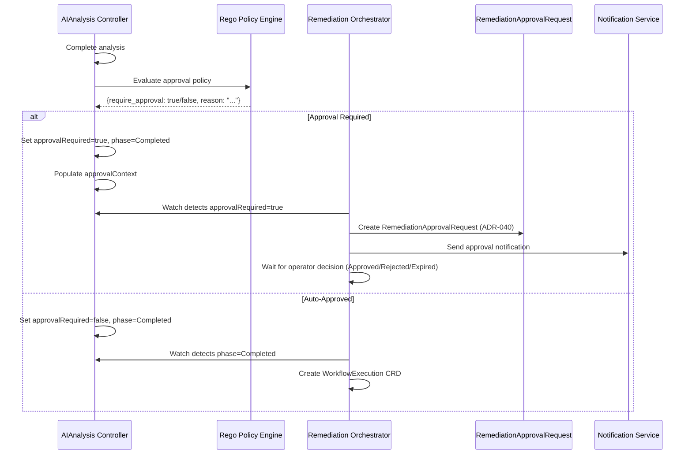

## CRD Schema Specification

> **📋 Changelog**
> | Version | Date | Changes | Reference |
> |---------|------|---------|-----------|
> | **v3.1** | 2026-08 | Replaced dead-schema `TimeoutConfig *AIAnalysisTimeoutConfig` (never populated by RO, never read by any handler) with `TimesOutAt *metav1.Time` — RO's creator now populates it from `Status.TimeoutConfig.Analyzing`, and `InvestigatingHandler.checkInvestigationTimeout` self-enforces it (taking precedence over the hardcoded `DefaultMaxInvestigationDuration` fallback) | [#2176](https://github.com/jordigilh/kubernaut/issues/2176), DD-TIMEOUT-002 |
> | **v3.0** | 2026-08 | **REWRITE** ([#1806](https://github.com/jordigilh/kubernaut/issues/1806)): Regenerated against `api/aianalysis/v1alpha1/aianalysis_types.go` as of this date. Corrected: client/API references from HolmesGPT-API to Kubernaut Agent (KA); `AffectedResource`→`RemediationTarget` on `RootCauseAnalysis`; removed `IsRecoveryAttempt`/`RecoveryAttemptNumber`/`PreviousExecutions` (never re-added after Issue #180 deprecation — recovery now flows through Gateway re-fire, not a dedicated AIAnalysis field); added `TimeoutConfig`, `ClusterID` to spec; added `SignalName` (was documented as `SignalType`), `SignalMode`, `SignalAnnotations`, `Cluster` to `SignalContextInput`; added `APIVersion` to `TargetResource`/`RemediationTarget`/`OwnerChainEntry`; corrected `EnrichmentResults` to the current lean shape (`KubernetesContext` + `BusinessClassification` only — no top-level `DetectedLabels`/`OwnerChain`/`CustomLabels`); documented `KASession` (async submit/poll), `InteractiveSession`, `PostRCAContext`, `AlignmentVerdict`, `Actionability`, `ObservedGeneration`, `SubReason` on status; corrected `SelectedWorkflow` to its current `sharedtypes.WorkflowSnapshot`-embedding shape (`ExecutionBundle`/`ExecutionBundleDigest` replacing `ContainerImage`/`ContainerDigest`); noted `RemediationApprovalRequest` (ADR-040) is implemented and used by RemediationOrchestrator today — the "no CRD until V1.1" framing is stale. See [What Changed](#what-changed-in-this-rewrite) for the full list. | [#1806](https://github.com/jordigilh/kubernaut/issues/1806) |
> | v2.7 | 2025-12-10 | Removed `TokensUsed` from status — LLM token tracking is KA's responsibility | DD-COST-001 |
> | v2.6 | 2025-12-09 | V1.0 compliance audit: identified API group / status-population gaps | `NOTICE_AIANALYSIS_V1_COMPLIANCE_GAPS.md` (docs/handoff/, deleted in the repo-wide non-authoritative docs purge) |
> | v2.5 | 2025-12-05 | Added `AlternativeWorkflows []AlternativeWorkflow` to status (context only, not for execution) | — |
> | v2.4 | 2025-12-03 | Removed `podSecurityLevel` from DetectedLabels (9→8 fields) | DD-WORKFLOW-001 v2.2 |
> | v2.3 | 2025-12-02 | Added `FailedDetections []string` to DetectedLabels | DD-WORKFLOW-001 v2.1 |
> | v2.2 | 2025-12-02 | Environment/BusinessPriority changed to free-text; removed RiskTolerance/BusinessCategory/EnrichmentQuality | — |
> | v2.1 | 2025-12-02 | Added `TargetInOwnerChain` and `Warnings` to status | — |
> | v2.0 | 2025-11-30 | Regenerated schema from Go types; V1.0 approval flow clarification | DD-WORKFLOW-001 v1.8, DD-RECOVERY-002 |
> | v1.0 | 2025-11-28 | Initial CRD schema | - |

**Source of Truth**: `api/aianalysis/v1alpha1/aianalysis_types.go`

**API Group**: `kubernaut.ai/v1alpha1` (single unified API group for all Kubernaut CRDs, DD-CRD-001)

---

## Key Design Decisions

| Document | Impact on CRD |
|----------|---------------|
| **ADR-001** | Spec immutability — `AIAnalysisSpec` carries a CEL `self == oldSelf` rule; re-analysis requires deleting and recreating the CRD |
| **DD-CONTRACT-002** | Self-contained CRD pattern — all analysis input data lives in `spec`, no cross-CRD reads during reconciliation |
| **ADR-056** | `DetectedLabels` computed by Kubernaut Agent (KA) *after* RCA, not supplied as input; stored in `status.postRCAContext` |
| **ADR-055** | `OwnerChain`/`CustomLabels` moved onto `EnrichmentResults.KubernetesContext`; the LLM's `RemediationTarget` (RCA output) replaced the old `target_in_owner_chain` boolean |
| **Issue #113** | `KubernetesContext` restructured to a lean, classification-focused shape (`Namespace`, `Workload`, `OwnerChain`, `CustomLabels`) — no more per-kind `PodDetails`/`DeploymentDetails` in the enrichment input |
| **Issue #1661 / DD-WORKFLOW-018** | `SelectedWorkflow` embeds `sharedtypes.WorkflowSnapshot` (the same type `WorkflowExecution.Spec.WorkflowRef` uses) so the two can never drift; write-once via CEL once `selectedAt` is set |
| **BR-AA-KA-064** | Async submit/poll/result session pattern with KA; `status.investigationSession` (Go type `KASession`) tracks it |
| **DD-INTERACTIVE-002** | Any RemediationRequest is takeover-capable; `status.interactiveSession` is observability-only |
| **ADR-040** | `RemediationApprovalRequest` (not `AIApprovalRequest`) is the CRD RemediationOrchestrator creates for manual approval — implemented today, not deferred |
| **Issue #180** | The `DD-RECOVERY-002` recovery-attempt fields (`isRecoveryAttempt`, `previousExecutions`, etc.) were removed from the spec entirely, not merely deprecated in place |

---

## V1.0 Scope Clarifications

| Feature | Status | Notes |
|---------|--------|-------|
| **LLM Provider** | Kubernaut Agent (KA) only | No `LLMProvider`/`LLMModel`/`Temperature` fields on the CRD — KA owns model selection |
| **Approval Flow** | `status.approvalRequired=true` → RO creates a `RemediationApprovalRequest` (ADR-040) | AIAnalysis itself never creates or references this CRD — it only sets `approvalRequired`/`approvalReason`/`approvalContext` |
| **Investigation Scope** | KA decides | No `investigationScope` field |
| **Business Context** | `BusinessClassification` (from SignalProcessing) + `CustomLabels` (Rego) | No hardcoded free-form `businessContext` struct |
| **Recovery** | Removed (Issue #180) | No `isRecoveryAttempt`/`previousExecutions` fields exist on the spec; an ineffective remediation re-fires through Gateway instead |

---

## CRD Definition

```go
// +kubebuilder:object:root=true
// +kubebuilder:subresource:status
// +kubebuilder:resource:shortName=aia
// +kubebuilder:selectablefield:JSONPath=.spec.remediationRequestRef.name
// +kubebuilder:printcolumn:name="Phase",type=string,JSONPath=`.status.phase`
// +kubebuilder:printcolumn:name="Confidence",type=number,JSONPath=`.status.selectedWorkflow.confidence`
// +kubebuilder:printcolumn:name="Approval Required",type=boolean,JSONPath=`.status.approvalRequired`
// +kubebuilder:printcolumn:name="Reason",type=string,JSONPath=`.status.conditions[?(@.type=="Ready")].reason`,priority=1
// +kubebuilder:printcolumn:name="Age",type=date,JSONPath=`.metadata.creationTimestamp`

// AIAnalysis is the Schema for the aianalyses API.
type AIAnalysis struct {
    metav1.TypeMeta   `json:",inline"`
    metav1.ObjectMeta `json:"metadata,omitempty"`

    Spec   AIAnalysisSpec   `json:"spec,omitempty"`
    Status AIAnalysisStatus `json:"status,omitempty"`
}
```

---

## Spec Fields

### AIAnalysisSpec

```go
// AIAnalysisSpec defines the desired state of AIAnalysis.
//
// ADR-001: Spec Immutability — represents an immutable event (an AI investigation).
// Once created by RemediationOrchestrator, spec cannot be modified. To re-analyze,
// delete and recreate the AIAnalysis CRD.
//
// +kubebuilder:validation:XValidation:rule="self == oldSelf",message="spec is immutable after creation (ADR-001)"
type AIAnalysisSpec struct {
    // Reference to parent RemediationRequest CRD for audit trail
    // +kubebuilder:validation:Required
    RemediationRequestRef corev1.ObjectReference `json:"remediationRequestRef"`

    // Remediation ID for audit correlation (DD-WORKFLOW-002 v2.2)
    // +kubebuilder:validation:Required
    // +kubebuilder:validation:MinLength=1
    RemediationID string `json:"remediationId"`

    // Complete analysis request with structured context (DD-CONTRACT-002)
    // +kubebuilder:validation:Required
    AnalysisRequest AnalysisRequest `json:"analysisRequest"`

    // Absolute deadline for this analysis, propagated verbatim by RO from
    // RemediationRequest.Status.TimeoutConfig.Analyzing at AIAnalysis creation
    // time (DD-TIMEOUT-002 / Issue #2176). The Investigating phase handler
    // self-enforces this deadline, taking precedence over the handler's own
    // hardcoded DefaultMaxInvestigationDuration fallback (25m) when set. Nil
    // when RO has no authoritative Analyzing timeout (defensive/back-compat).
    // +optional
    TimesOutAt *metav1.Time `json:"timesOutAt,omitempty"`

    // BR-FLEET-054: Remote cluster identifier for fleet-managed signals.
    // Propagated from RemediationRequest.Spec.ClusterID by the Remediation Orchestrator.
    // +optional
    ClusterID string `json:"clusterID,omitempty"`
}
```

> **Supersedes `TimeoutConfig`/`AIAnalysisTimeoutConfig`** (removed, DD-TIMEOUT-002 / Issue #2176):
> that field was never populated by RO's creator and never read by any handler — a dead-schema
> field replaced outright by `TimesOutAt`, a single absolute deadline uniformly referencable
> across AIAnalysis, SignalProcessing, and WorkflowExecution. See
> [DD-TIMEOUT-002](../../../architecture/decisions/DD-TIMEOUT-002-child-crd-timeout-self-enforcement.md).

### AnalysisType and AnalysisRequest

```go
// AnalysisType represents a type of analysis to perform.
// +kubebuilder:validation:Enum=Investigation;RootCause;WorkflowSelection
type AnalysisType string

const (
    AnalysisTypeInvestigation     AnalysisType = "Investigation"
    AnalysisTypeRootCause         AnalysisType = "RootCause"
    AnalysisTypeWorkflowSelection AnalysisType = "WorkflowSelection"
)

// AnalysisRequest contains the structured analysis request (DD-CONTRACT-002)
type AnalysisRequest struct {
    // Signal context from SignalProcessing enrichment
    // +kubebuilder:validation:Required
    SignalContext SignalContextInput `json:"signalContext"`

    // Analysis types to perform
    // +kubebuilder:validation:MinItems=1
    AnalysisTypes []AnalysisType `json:"analysisTypes"`
}
```

> `AnalysisTypes` is a typed `[]AnalysisType` enum slice (`Investigation`, `RootCause`,
> `WorkflowSelection`), not free-text strings like `"root-cause"`/`"workflow-selection"`.

### SignalContextInput

```go
// SignalContextInput contains enriched signal context from SignalProcessing
// DD-CONTRACT-002: Structured types replace map[string]string anti-pattern
type SignalContextInput struct {
    // Signal fingerprint for correlation
    // +kubebuilder:validation:Required
    // +kubebuilder:validation:MaxLength=64
    Fingerprint string `json:"fingerprint"`

    // Signal severity, normalized by SignalProcessing Rego (DD-SEVERITY-001 v1.1, ADR-066)
    // +kubebuilder:validation:Enum=critical;high;warning;info;unknown
    Severity string `json:"severity"`

    // Signal name (e.g., OOMKilled, CrashLoopBackOff).
    // Normalized by SignalProcessing: proactive names mapped to base names (BR-SP-106).
    // +kubebuilder:validation:Required
    SignalName string `json:"signalName"`

    // SignalMode indicates whether this is a reactive or proactive signal (BR-AI-084).
    // Used by KA to switch investigation prompt strategy (RCA vs. predict & prevent).
    // +kubebuilder:validation:Enum=reactive;proactive
    // +optional
    SignalMode string `json:"signalMode,omitempty"`

    // Environment classification (free-text — values defined by Rego policies)
    // Examples: "production", "staging", "development", "qa-eu", "canary"
    // +kubebuilder:validation:MinLength=1
    // +kubebuilder:validation:MaxLength=63
    Environment string `json:"environment"`

    // Business priority (free-text). Examples: P0 (critical), P1 (high), P2 (normal), P3 (low)
    // +kubebuilder:validation:MinLength=1
    // +kubebuilder:validation:MaxLength=63
    BusinessPriority string `json:"businessPriority"`

    // Target resource identification
    TargetResource TargetResource `json:"targetResource"`

    // Complete enrichment results from SignalProcessing (pkg/shared/types/enrichment.go)
    // +kubebuilder:validation:Required
    EnrichmentResults sharedtypes.EnrichmentResults `json:"enrichmentResults"`

    // SignalAnnotations from the original alert (e.g., description, summary from AlertManager).
    // Untrusted content — sanitized by KA's prompt builder before reaching the LLM.
    // +optional
    SignalAnnotations map[string]string `json:"signalAnnotations,omitempty"`

    // Cluster is the optional cluster business classification (e.g. "production",
    // "staging-eu") derived by SignalProcessing's Rego policy from fleet
    // cluster-registration labels (BR-FLEET-003, #1511). Empty when fleet mode is
    // disabled or unregistered — a normal outcome, unlike Severity.
    // +optional
    Cluster string `json:"cluster,omitempty"`
}

// TargetResource identifies the Kubernetes resource being remediated
type TargetResource struct {
    Kind string `json:"kind"`
    Name string `json:"name"`
    // Empty for cluster-scoped resources (e.g., Node, PersistentVolume).
    // +optional
    Namespace string `json:"namespace,omitempty"`
    // Disambiguates the resource's API group when the Kind exists in multiple
    // groups (e.g. Route in route.openshift.io vs serving.knative.dev). Issue #1040.
    // +optional
    APIVersion string `json:"apiVersion,omitempty"`
}
```

> **Removed fields (no longer exist)**: `RiskTolerance` and `BusinessCategory` were removed —
> use `EnrichmentResults.KubernetesContext.CustomLabels` (Rego-derived) instead.
> **Renamed field**: this was previously documented as `SignalType` — the Go field is
> `SignalName`.

---

## EnrichmentResults (DD-CONTRACT-002, pkg/shared/types/enrichment.go)

`pkg/shared/types/enrichment.go` is the single authoritative source for this shape — shared
verbatim by SignalProcessing (producer), AIAnalysis (pass-through), and KA (consumer).

```go
// EnrichmentResults contains all enrichment data from SignalProcessing.
// Issue #113: CustomLabels removed from this level — now on KubernetesContext.CustomLabels.
// ADR-056: DetectedLabels removed from this level entirely — now computed by KA
// post-RCA and returned in status.postRCAContext, not supplied as input.
type EnrichmentResults struct {
    // Kubernetes resource context (classification-focused: namespace, workload labels, owner chain)
    KubernetesContext *KubernetesContext `json:"kubernetesContext,omitempty"`

    // Business classification from SP categorization phase (BR-SP-002, BR-SP-080, BR-SP-081)
    BusinessClassification *BusinessClassification `json:"businessClassification,omitempty"`
}

// KubernetesContext contains lean, classification-focused Kubernetes resource context
// (Issue #113 — replaced per-type PodDetails/DeploymentDetails/etc. with generic WorkloadDetails;
// operational details like replicas/conditions/ports are fetched by the LLM on demand, not enriched here).
type KubernetesContext struct {
    // Empty string indicates the local hub cluster (BR-INTEGRATION-054)
    // +optional
    ClusterID string `json:"clusterID,omitempty"`
    // Fleet cluster-registration labels for the optional `cluster` Rego dimension (BR-FLEET-003)
    // +optional
    Cluster *ClusterContext `json:"cluster,omitempty"`
    // Nil for cluster-scoped resources (e.g., Node)
    Namespace *NamespaceContext `json:"namespace,omitempty"`
    // Target workload context (kind, name, labels, annotations)
    Workload *WorkloadDetails `json:"workload,omitempty"`
    // Owner chain from target to top-level controller (DD-WORKFLOW-001 v1.8)
    OwnerChain []OwnerChainEntry `json:"ownerChain,omitempty"`
    // Custom labels extracted via Rego policies (BR-SP-102); subdomain -> list of values
    CustomLabels map[string][]string `json:"customLabels,omitempty"`
    // True when context was built with partial data (DD-4: target resource not found)
    DegradedMode bool `json:"degradedMode,omitempty"`
}

// NamespaceContext holds namespace details for classification. Nil for cluster-scoped signals.
type NamespaceContext struct {
    Name        string            `json:"name"`
    Labels      map[string]string `json:"labels,omitempty"`
    Annotations map[string]string `json:"annotations,omitempty"`
}

// WorkloadDetails contains generic workload context for Rego classification
// (replaces the old per-type PodDetails/DeploymentDetails/StatefulSetDetails fields).
type WorkloadDetails struct {
    Kind        string            `json:"kind"`
    Name        string            `json:"name"`
    Labels      map[string]string `json:"labels,omitempty"`
    Annotations map[string]string `json:"annotations,omitempty"`
}

// ClusterContext holds cluster-registration labels for the optional `cluster` Rego
// dimension (BR-FLEET-003, #1511). Nil when unregistered or fleet mode is disabled.
type ClusterContext struct {
    Labels map[string]string `json:"labels,omitempty"`
}

// OwnerChainEntry represents a single entry in the K8s ownership chain.
type OwnerChainEntry struct {
    // Empty for cluster-scoped resources like Node
    Namespace string `json:"namespace,omitempty"`
    Kind      string `json:"kind"`
    Name      string `json:"name"`
    // APIVersion of the owner resource from OwnerReference (e.g. "apps/v1"). Issue #1040.
    APIVersion string `json:"api_version,omitempty"`
}

// BusinessClassification contains business context derived from SP categorization.
type BusinessClassification struct {
    BusinessUnit   string          `json:"businessUnit,omitempty"`
    ServiceOwner   string          `json:"serviceOwner,omitempty"`
    Criticality    Criticality     `json:"criticality,omitempty"`    // Critical;High;Medium;Low
    SLARequirement SLARequirement  `json:"slaRequirement,omitempty"` // Platinum;Gold;Silver;Bronze
}
```

> **No top-level `detectedLabels`, `ownerChain`, or `customLabels` on `EnrichmentResults` or on
> `AIAnalysis.spec`.** `OwnerChain` and `CustomLabels` live on `KubernetesContext`; `DetectedLabels`
> is not part of the *input* schema at all anymore — it only appears as an *output* on
> `status.postRCAContext.detectedLabels`, computed by KA after RCA (ADR-056; see
> [Status Fields](#status-fields) below).

### DetectedLabels (13 fields — status-only, see PostRCAContext)

```go
// DetectedLabels contains auto-detected cluster characteristics, computed by Kubernaut
// Agent (KA) at runtime during RCA and returned in the KA response for storage on
// status.postRCAContext. NOT part of the spec/input enrichment (ADR-056).
//
// All fields are plain bool (not *bool); FailedDetections tracks which fields had
// query failures (RBAC denied, timeout, network error) — a false value for a field
// listed in FailedDetections should be treated as unknown, not "resource absent".
type DetectedLabels struct {
    // Only accepts: gitOpsManaged, gitOpsTool, pdbProtected, hpaEnabled, stateful,
    // helmManaged, networkIsolated, serviceMesh, resourceQuotaConstrained,
    // virtualMachine, liveMigratable, cdiManaged, storageBackend
    FailedDetections []string `json:"failedDetections,omitempty"`

    GitOpsManaged bool   `json:"gitOpsManaged"`
    GitOpsTool    string `json:"gitOpsTool,omitempty"`    // argocd;flux;""

    PDBProtected bool `json:"pdbProtected"`
    HPAEnabled   bool `json:"hpaEnabled"`

    Stateful    bool `json:"stateful"`
    HelmManaged bool `json:"helmManaged"`

    NetworkIsolated bool   `json:"networkIsolated"`
    ServiceMesh     string `json:"serviceMesh,omitempty"` // istio;linkerd;""

    ResourceQuotaConstrained bool `json:"resourceQuotaConstrained"` // #366, DD-KA-018 v1.4

    // Virtualization — CNV/KubeVirt (#1378)
    VirtualMachine bool   `json:"virtualMachine"`
    LiveMigratable bool   `json:"liveMigratable"`
    CDIManaged     bool   `json:"cdiManaged"`
    StorageBackend string `json:"storageBackend,omitempty"` // odf-ceph;lvms;local;""
}
```

> **Field count changed again since v2.4**: the doc previously said "8 fields" (after removing
> `podSecurityLevel`). The current type has grown to **13 fields** with the addition of
> `resourceQuotaConstrained` and the four virtualization fields (`virtualMachine`,
> `liveMigratable`, `cdiManaged`, `storageBackend`). `FailedDetections` validates against all 13
> field names.

---

## Deprecated: Recovery Fields (Issue #180)

The v2.0–v2.7 versions of this document described `IsRecoveryAttempt`, `RecoveryAttemptNumber`,
`PreviousExecutions []PreviousExecution`, and `ExecutionFailure` (DD-RECOVERY-002/003) as live
`AIAnalysisSpec` fields. **These fields do not exist in the current type** — they were fully
removed, not merely deprecated-in-place. `AIAnalysisSpec` has no recovery-related fields at all
today (see [AIAnalysisSpec](#aianalysisspec) above).

Per BR-AA-KA-064.9: when a remediation is ineffective, the alert re-fires through the Gateway
as a new signal, and prior AI analysis / Effectiveness Assessment results are surfaced to KA as
prompt context — there is no dedicated "recovery AIAnalysis" spec shape in V1.0. If this changes,
DD-RECOVERY-002/003 will need to be revisited and this section updated with the real fields.

---

## Status Fields

### AIAnalysisStatus

```go
// AIAnalysisStatus defines the observed state of AIAnalysis.
type AIAnalysisStatus struct {
    // ObservedGeneration prevents duplicate reconciliations (DD-CONTROLLER-001)
    // +optional
    ObservedGeneration int64 `json:"observedGeneration,omitempty"`

    // Pending → Investigating → Analyzing → Completed/Failed (no separate "Approving"/"Recommending" phase)
    // +kubebuilder:validation:Enum=Pending;Investigating;Analyzing;Completed;Failed
    Phase   string `json:"phase"`
    Message string `json:"message,omitempty"`

    // Umbrella failure/completion reason
    // +kubebuilder:validation:Enum=AnalysisCompleted;WorkflowResolutionFailed;WorkflowNotNeeded;NoWorkflowSelected;RegoEvaluationError;TransientError;APIError;InteractiveCancelled;ParentCancelled
    // +optional
    Reason AIAnalysisReason `json:"reason,omitempty"`

    // Specific failure cause within the Reason category (BR-KA-197, BR-KA-200)
    // +kubebuilder:validation:Enum=WorkflowNotFound;ImageMismatch;ParameterValidationFailed;NoMatchingWorkflows;LowConfidence;LLMParsingError;ValidationError;TransientError;PermanentError;InvestigationInconclusive;ProblemResolved;NotActionable;MaxRetriesExceeded;SessionRegenerationExceeded;RcaIncomplete;InvestigationFailed;OperatorEscalation
    // +optional
    SubReason string `json:"subReason,omitempty"`

    StartedAt   *metav1.Time `json:"startedAt,omitempty"`
    CompletedAt *metav1.Time `json:"completedAt,omitempty"`

    RootCause         string             `json:"rootCause,omitempty"`
    RootCauseAnalysis *RootCauseAnalysis `json:"rootCauseAnalysis,omitempty"`

    // Populated when phase=Completed (DD-CONTRACT-002)
    SelectedWorkflow *SelectedWorkflow `json:"selectedWorkflow,omitempty"`

    // Considered but not selected. INFORMATIONAL ONLY — never auto-executed as a fallback.
    // +optional
    AlternativeWorkflows []AlternativeWorkflow `json:"alternativeWorkflows,omitempty"`

    // True if approval is required (confidence < threshold or policy requires)
    ApprovalRequired bool             `json:"approvalRequired"`
    ApprovalReason   string           `json:"approvalReason,omitempty"`
    ApprovalContext  *ApprovalContext `json:"approvalContext,omitempty"`

    // Set by KA when it cannot produce a reliable result (BR-KA-197, BR-496 v2)
    NeedsHumanReview bool `json:"needsHumanReview"`
    // BR-AI-601: alignment_check_failed added for shadow-agent verdicts
    // +kubebuilder:validation:Enum=workflow_not_found;image_mismatch;parameter_validation_failed;no_matching_workflows;low_confidence;llm_parsing_error;investigation_inconclusive;rca_incomplete;alignment_check_failed;operator_escalation
    // +optional
    HumanReviewReason string `json:"humanReviewReason,omitempty"`

    // Shadow agent alignment verdict (BR-AI-601, #1076)
    // +optional
    AlignmentVerdict *AlignmentVerdictStatus `json:"alignmentVerdict,omitempty"`

    // LLM's assessment of whether the alert warrants action (#388)
    // +kubebuilder:validation:Enum=Actionable;NotActionable
    // +optional
    Actionability string `json:"actionability,omitempty"`

    // KA investigation ID for correlation with KA's own kubernaut_agent_llm_token_usage_total metric
    // (TokensUsed was removed from this CRD — DD-COST-001, cost observability is KA's responsibility)
    // +kubebuilder:validation:MaxLength=253
    InvestigationID string `json:"investigationId,omitempty"`
    // Investigation duration in seconds
    // +kubebuilder:validation:Minimum=0
    InvestigationTime int64 `json:"investigationTime,omitempty"`

    Warnings []string `json:"warnings,omitempty"`
    // Full history of KA validation attempts (DD-KA-001 v1.4: up to 3 with LLM self-correction)
    // +optional
    ValidationAttemptsHistory []ValidationAttempt `json:"validationAttemptsHistory,omitempty"`

    DegradedMode      bool  `json:"degradedMode,omitempty"`
    TotalAnalysisTime int64 `json:"totalAnalysisTime,omitempty"` // milliseconds
    // BR-AI-009: reset to 0 on success, incremented on transient failure
    // +optional
    ConsecutiveFailures int32 `json:"consecutiveFailures,omitempty"`

    // Async KA submit/poll session tracking (BR-AA-KA-064)
    // +optional
    KASession *KASession `json:"investigationSession,omitempty"`

    // MCP interactive-mode dynamic-takeover tracking (DD-INTERACTIVE-002), observability-only
    // +optional
    InteractiveSession *InteractiveSessionInfo `json:"interactiveSession,omitempty"`

    // Data computed by KA after RCA (e.g. DetectedLabels). Immutable once setAt is populated (ADR-056).
    // +optional
    PostRCAContext *PostRCAContext `json:"postRCAContext,omitempty"`

    Conditions []metav1.Condition `json:"conditions,omitempty"`
}
```

### RootCauseAnalysis / RemediationTarget

```go
type RootCauseAnalysis struct {
    Summary string `json:"summary"`
    // Normalized per DD-SEVERITY-001 v1.1, ADR-066
    // +kubebuilder:validation:Enum=critical;high;warning;info;unknown
    // +optional
    Severity string `json:"severity,omitempty"`
    // Signal type determined by RCA (may differ from input)
    SignalType          string   `json:"signalType"`
    ContributingFactors []string `json:"contributingFactors,omitempty"`

    // RemediationTarget identifies the actual resource the LLM determined should be
    // remediated. BR-KA-212: the LLM may identify a higher-level resource (e.g. a
    // Deployment) rather than the Pod that generated the signal — prefer this over
    // the RR's TargetResource when available.
    // +optional
    RemediationTarget *RemediationTarget `json:"remediationTarget,omitempty"`
}

// RemediationTarget is the resource the LLM identified as the actual remediation
// target — may differ from the signal's source resource (e.g. signal from a Pod,
// but the owning Deployment should be patched).
type RemediationTarget struct {
    // +kubebuilder:validation:Required
    Kind string `json:"kind"`
    // +kubebuilder:validation:Required
    Name string `json:"name"`
    // +optional
    Namespace string `json:"namespace,omitempty"`
    // +optional
    APIVersion string `json:"apiVersion,omitempty"` // Issue #1040
}
```

> This field was previously (and incorrectly) documented as `AffectedResource`/`affectedResource`.
> The real field is **`RemediationTarget`** / `remediationTarget`, and it is populated from RCA
> output, not derived from a pre-computed owner-chain boolean (ADR-055 replaced
> `target_in_owner_chain` with this structured field).

### SelectedWorkflow (DD-CONTRACT-002, Issue #1661, DD-WORKFLOW-018)

```go
// SelectedWorkflow contains the AI-selected workflow for execution.
// Write-once via CEL once selectedAt is populated (mirrors PostRCAContext's ADR-056 guard).
// +kubebuilder:validation:XValidation:rule="!has(oldSelf.selectedAt) || self == oldSelf",message="selectedWorkflow is immutable once selectedAt is populated"
type SelectedWorkflow struct {
    // Inline-embedded catalog-resolved execution snapshot — the SAME type
    // WorkflowExecution.Spec.WorkflowRef embeds, so the two can never drift.
    sharedtypes.WorkflowSnapshot `json:",inline"`

    // +kubebuilder:validation:Minimum=0.0
    // +kubebuilder:validation:Maximum=1.0
    Confidence float64 `json:"confidence"`
    // UPPER_SNAKE_CASE keys per DD-WORKFLOW-003
    Parameters map[string]string `json:"parameters,omitempty"`
    Rationale  string            `json:"rationale"`

    // Once non-nil, the whole SelectedWorkflow is immutable (see XValidation above)
    // +optional
    SelectedAt *metav1.Time `json:"selectedAt,omitempty"`
}

// sharedtypes.WorkflowSnapshot (pkg/shared/types/workflow_snapshot.go) — the fields
// SelectedWorkflow inherits via inline embedding:
type WorkflowSnapshot struct {
    WorkflowID            string                          `json:"workflowId"`
    WorkflowName          string                          `json:"workflowName"`
    ActionType            string                          `json:"actionType"` // DD-WORKFLOW-016 taxonomy
    Version               string                          `json:"version"`
    // OCI execution bundle reference, digest-pinned
    ExecutionBundle       string                          `json:"executionBundle"`
    ExecutionBundleDigest string                          `json:"executionBundleDigest,omitempty"`
    // +kubebuilder:validation:Enum=tekton;job;ansible
    ExecutionEngine       string                          `json:"executionEngine,omitempty"`
    EngineConfig          *apiextensionsv1.JSON           `json:"engineConfig,omitempty"` // BR-WE-016
    ServiceAccountName    string                          `json:"serviceAccountName,omitempty"`
    Dependencies          *WorkflowDependencies           `json:"dependencies,omitempty"` // DD-WE-006
    Resources             *corev1.ResourceRequirements    `json:"resources,omitempty"`    // BR-WE-019/DD-WE-008
    DeclaredParameterNames map[string]bool                `json:"declaredParameterNames"` // #243 allowlist, not omitempty
}
```

> **`ContainerImage`/`ContainerDigest` no longer exist.** They were renamed to
> `ExecutionBundle`/`ExecutionBundleDigest` when `SelectedWorkflow` was restructured to embed
> `WorkflowSnapshot` (Issue #1661). `ExecutionEngine` may legitimately be empty on
> partial/degenerate selections (see the field's own doc comment in
> `pkg/shared/types/workflow_snapshot.go`).

### AlternativeWorkflow

```go
// INFORMATIONAL ONLY — helps operators understand AI reasoning during approval; never
// automatically executed as a fallback.
type AlternativeWorkflow struct {
    // +kubebuilder:validation:Required
    WorkflowID string `json:"workflowId"`
    // OCI reference, digest-pinned — NOT ContainerImage
    ExecutionBundle string `json:"executionBundle,omitempty"`
    // +kubebuilder:validation:Minimum=0.0
    // +kubebuilder:validation:Maximum=1.0
    Confidence float64 `json:"confidence"`
    Rationale  string  `json:"rationale"`
}
```

### ApprovalContext (BR-AI-059, BR-AI-076)

```go
type ApprovalContext struct {
    Reason string `json:"reason"`
    // +kubebuilder:validation:Minimum=0.0
    // +kubebuilder:validation:Maximum=1.0
    ConfidenceScore float64 `json:"confidenceScore"`
    // +kubebuilder:validation:Enum=low;medium;high
    ConfidenceLevel         string                `json:"confidenceLevel"`
    InvestigationSummary    string                `json:"investigationSummary"`
    EvidenceCollected       []string              `json:"evidenceCollected,omitempty"`
    RecommendedActions      []RecommendedAction   `json:"recommendedActions"`
    AlternativesConsidered  []AlternativeApproach `json:"alternativesConsidered,omitempty"`
    WhyApprovalRequired     string                `json:"whyApprovalRequired"`
    // Rego evaluation details (BR-AI-030)
    PolicyEvaluation *PolicyEvaluation `json:"policyEvaluation,omitempty"`
}

type PolicyEvaluation struct {
    PolicyName   string         `json:"policyName"`
    MatchedRules []string       `json:"matchedRules,omitempty"`
    // +kubebuilder:validation:Enum=Approved;ManualReviewRequired;Denied;DegradedMode
    Decision PolicyDecision `json:"decision"`
}

type RecommendedAction struct {
    WorkflowId string `json:"workflowId"`
    Rationale  string `json:"rationale"`
}

type AlternativeApproach struct {
    Approach string `json:"approach"`
    ProsCons string `json:"prosCons"`
}
```

### KASession, InteractiveSessionInfo, PostRCAContext

```go
// KASession tracks the async KA session lifecycle (BR-AA-KA-064.4/.5; the JSON tag is
// still "investigationSession" — renamed from InvestigationSession only at the Go type
// level to avoid colliding with the unrelated root InvestigationSession CRD).
type KASession struct {
    ID         string `json:"id,omitempty"`   // cleared on session loss
    Generation int32  `json:"generation"`      // incremented on 404 (session regeneration)
    // +optional
    Interactive bool `json:"interactive,omitempty"` // BR-INTERACTIVE-010
    // +optional
    LastPolled *metav1.Time `json:"lastPolled,omitempty"`
    // +optional
    CreatedAt *metav1.Time `json:"createdAt,omitempty"`
    // BR-AA-KA-064.8: constant 15s poll interval (configurable 1s–5m)
    // +optional
    PollCount int32 `json:"pollCount,omitempty"`
    // #1390: after 3 consecutive 409s the session is regenerated
    // +optional
    ConsecutiveGetResultErrors int32 `json:"consecutiveGetResultErrors,omitempty"`
}

// InteractiveSessionInfo tracks the MCP dynamic-takeover session (DD-INTERACTIVE-002),
// observability-only — operators see the current driver via kubectl.
type InteractiveSessionInfo struct {
    SessionID        string       `json:"sessionId,omitempty"`
    MCPSessionID     string       `json:"mcpSessionId,omitempty"`
    ActingUser       string       `json:"actingUser,omitempty"`
    ActingUserGroups []string     `json:"actingUserGroups,omitempty"` // BR-INTERACTIVE-001, #774
    StartedAt        *metav1.Time `json:"startedAt,omitempty"`
    CompletedAt      *metav1.Time `json:"completedAt,omitempty"`
}

// PostRCAContext holds data computed by KA after the RCA phase. Immutable once setAt
// is populated (CEL: !has(oldSelf.setAt) || self == oldSelf), ADR-056.
type PostRCAContext struct {
    // Computed by KA's LabelDetector during get_namespaced_resource_context /
    // get_cluster_resource_context tool invocations.
    // +optional
    DetectedLabels *DetectedLabels `json:"detectedLabels,omitempty"`
    // +optional
    SetAt *metav1.Time `json:"setAt,omitempty"`
}
```

### AlignmentVerdictStatus (BR-AI-601, #1076)

```go
// Produced by KA's InvestigatorWrapper (shadow agent), mapped onto the CRD by AA's
// ResponseProcessor. When CircuitBreakerActivated=true, the investigation was
// terminated early and RootCauseAnalysis/SelectedWorkflow may be incomplete —
// treat the shadow findings as the primary content in that case.
type AlignmentVerdictStatus struct {
    Result                  string                   `json:"result"` // "clean" | "suspicious"
    CircuitBreakerActivated bool                     `json:"circuitBreakerActivated"`
    Summary                 string                   `json:"summary,omitempty"`
    Flagged                 int                      `json:"flagged"`
    Total                   int                      `json:"total"`
    Findings                []AlignmentFindingStatus `json:"findings,omitempty"`
}

type AlignmentFindingStatus struct {
    StepIndex   int    `json:"stepIndex"`
    StepKind    string `json:"stepKind"` // llm_reasoning, tool_result, signal_input
    Tool        string `json:"tool,omitempty"`
    Explanation string `json:"explanation"`
}
```

### ValidationAttempt

```go
// DD-KA-001 v1.4: KA retries up to 3 times with LLM self-correction; each entry
// records one failed attempt for the operator-facing audit trail.
type ValidationAttempt struct {
    // +kubebuilder:validation:Minimum=1
    // +kubebuilder:validation:Maximum=3
    Attempt    int         `json:"attempt"`
    WorkflowID string      `json:"workflowId"`
    IsValid    bool        `json:"isValid"`
    Errors     []string    `json:"errors,omitempty"`
    Timestamp  metav1.Time `json:"timestamp"`
}
```

---

## V1.0 Approval Flow


```mermaid
sequenceDiagram
    participant AIA as AIAnalysis Controller
    participant Rego as Rego Policy Engine
    participant RO as Remediation Orchestrator
    participant ARQ as RemediationApprovalRequest
    participant Notif as Notification Service

    AIA->>AIA: Complete analysis
    AIA->>Rego: Evaluate approval policy
    Rego-->>AIA: {require_approval: true/false, reason: "..."}

    alt Approval Required
        AIA->>AIA: Set approvalRequired=true, phase=Completed
        AIA->>AIA: Populate approvalContext
        RO->>AIA: Watch detects approvalRequired=true
        RO->>ARQ: Create RemediationApprovalRequest (ADR-040)
        RO->>Notif: Send approval notification
        RO->>RO: Wait for operator decision (Approved/Rejected/Expired)
    else Auto-Approved
        AIA->>AIA: Set approvalRequired=false, phase=Completed
        RO->>AIA: Watch detects phase=Completed
        RO->>RO: Create WorkflowExecution CRD
    end
```

**Behavior**:
- `approvalRequired=true` → RemediationOrchestrator creates a `RemediationApprovalRequest`
  (`api/remediation/v1alpha1`, ADR-040 — modeled after Kubernetes `CertificateSigningRequest`)
  and a notification; AIAnalysis itself never creates, watches, or references this CRD.
- `approvalRequired=false` → RemediationOrchestrator creates `WorkflowExecution` directly.

> **Correction**: earlier versions of this document said "No `AIApprovalRequest` CRD (deferred to
> V1.1)". `AIApprovalRequest` was never the real name and — more importantly — the real CRD
> (`RemediationApprovalRequest`) is implemented and actively used by RemediationOrchestrator today
> (see `internal/controller/remediationorchestrator/remediation_approval_request.go`), not deferred.

---

## Example: Incident Analysis

```yaml
apiVersion: kubernaut.ai/v1alpha1
kind: AIAnalysis
metadata:
  name: aianalysis-abc123
  namespace: kubernaut-system
  ownerReferences:
  - apiVersion: kubernaut.ai/v1alpha1
    kind: RemediationRequest
    name: remediation-abc12345
    controller: true
spec:
  remediationRequestRef:
    apiVersion: kubernaut.ai/v1alpha1
    kind: RemediationRequest
    name: remediation-abc12345
    namespace: kubernaut-system
  remediationId: "abc12345"

  analysisRequest:
    signalContext:
      fingerprint: "sha256:abc123def456"
      severity: critical
      signalName: OOMKilled            # was documented as "signalType"
      signalMode: reactive
      environment: production          # free-text
      businessPriority: P0             # free-text
      targetResource:
        kind: Pod
        name: payment-api-7d8f9c6b5-x2k4m
        namespace: production
      enrichmentResults:
        kubernetesContext:
          namespace:
            name: production
          workload:
            kind: Pod
            name: payment-api-7d8f9c6b5-x2k4m
            labels:
              app: payment-api
          ownerChain:
          - namespace: production
            kind: ReplicaSet
            name: payment-api-7d8f9c6b5
          - namespace: production
            kind: Deployment
            name: payment-api
          customLabels:
            constraint:
            - cost-constrained
            team:
            - name=payments
        businessClassification:
          businessUnit: payments
          criticality: Critical
          slaRequirement: Gold
      # NOTE: no top-level "detectedLabels" here — DetectedLabels is an output
      # (status.postRCAContext.detectedLabels), computed by KA after RCA, not an input.
    analysisTypes:
    - Investigation
    - RootCause
    - WorkflowSelection

status:
  phase: Completed
  rootCause: "Memory limit exceeded due to traffic spike"
  rootCauseAnalysis:
    summary: "Memory limit exceeded due to traffic spike"
    severity: critical
    signalType: OOMKilled
    contributingFactors:
    - "Traffic spike"
    - "Insufficient memory limit"
    remediationTarget:               # was documented as "affectedResource"
      kind: Deployment
      name: payment-api
      namespace: production
  investigationSession:
    id: "sess-9f8e7d6c"
    generation: 0
    pollCount: 6
  postRCAContext:
    detectedLabels:
      gitOpsManaged: true
      gitOpsTool: argocd
      pdbProtected: true
      stateful: false
    setAt: "2026-08-01T10:15:30Z"
  selectedWorkflow:
    workflowId: oomkill-increase-memory
    workflowName: oomkill-increase-memory
    actionType: ScaleReplicas
    version: "1.0.0"
    executionBundle: quay.io/kubernaut/workflow-oomkill:v1.0.0     # was "containerImage"
    executionBundleDigest: "sha256:abc123..."                      # was "containerDigest"
    executionEngine: tekton
    confidence: 0.92
    parameters:
      NAMESPACE: production
      DEPLOYMENT_NAME: payment-api
      NEW_MEMORY_LIMIT: "1Gi"
    rationale: "OOMKilled signal with GitOps-managed deployment; conservative memory increase recommended"
    selectedAt: "2026-08-01T10:15:45Z"
  approvalRequired: false
  needsHumanReview: false
  actionability: Actionable
```

---

## What Changed in This Rewrite

| Previous claim (v2.x) | Current reality |
|---|---|
| Client calls `pkg/clients/holmesgpt/`, synchronous request/response | `pkg/agentclient` (ogen-generated), async submit → poll → result session pattern (`status.investigationSession`) |
| `AffectedResource`/`affectedResource` on RCA | `RemediationTarget`/`remediationTarget` (ADR-055) |
| `AIApprovalRequest` CRD, "deferred to V1.1" | `RemediationApprovalRequest` (ADR-040), implemented today, owned by RemediationOrchestrator |
| `EnrichmentResults` has top-level `detectedLabels`/`ownerChain`/`customLabels` | Only `KubernetesContext` + `BusinessClassification`; `OwnerChain`/`CustomLabels` moved onto `KubernetesContext`; `DetectedLabels` is an output-only field on `status.postRCAContext` (ADR-056) |
| `IsRecoveryAttempt`/`RecoveryAttemptNumber`/`PreviousExecutions` on spec | Removed entirely (Issue #180) — not present on `AIAnalysisSpec` |
| `SignalType` on `SignalContextInput` | `SignalName` |
| `SelectedWorkflow.containerImage`/`containerDigest` | `SelectedWorkflow.executionBundle`/`executionBundleDigest` (embeds `sharedtypes.WorkflowSnapshot`, Issue #1661) |
| `aianalysis_holmesgpt_*` metrics referenced elsewhere in the doc set | Removed — see `pkg/aianalysis/metrics/metrics.go`; only `aianalysis_rego_evaluations_total`, `aianalysis_approval_decisions_total`, `aianalysis_confidence_score_distribution`, `aianalysis_failures_total` exist |

---

## Related Documents

| Document | Purpose |
|----------|---------|
| [Integration Points](./integration-points.md) | KA async API contract, request/response shapes, error handling |
| [Security Configuration](./security-configuration.md) | RBAC, authentication to KA, secret handling |
| [DD-WORKFLOW-001](../../../architecture/decisions/DD-WORKFLOW-001-mandatory-label-schema.md) | DetectedLabels/CustomLabels/OwnerChain schema history |
| [ADR-056](../../../architecture/decisions/ADR-056-post-rca-label-computation.md) | DetectedLabels computed post-RCA by KA |
| [ADR-055](../../../architecture/decisions/ADR-055-llm-driven-context-enrichment.md) / [Addendum](../../../architecture/decisions/ADR-055-ADDENDUM-001-remediation-target-rename.md) | RemediationTarget replacing target_in_owner_chain |
| [ADR-040](../../../architecture/decisions/ADR-040-remediation-approval-request-architecture.md) | Approval orchestration owned by RO, RemediationApprovalRequest design |
| [DD-CONTRACT-002](../../../architecture/decisions/DD-CONTRACT-002-service-integration-contracts.md) | Service integration contracts |
| [REGO_POLICY_EXAMPLES.md](./REGO_POLICY_EXAMPLES.md) | Approval policy input schema |
| [BR_MAPPING.md](./BR_MAPPING.md) | Business requirements mapping |

---

**Document Maintainer**: Kubernaut Documentation Team
**Last Updated**: August 2026
