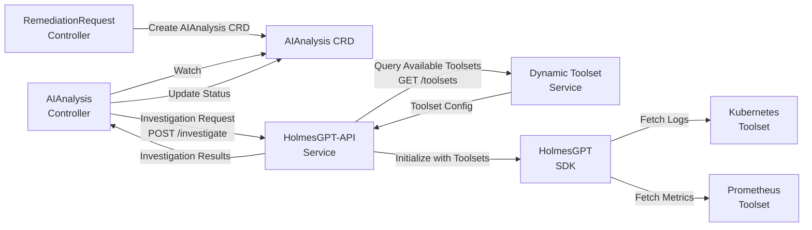
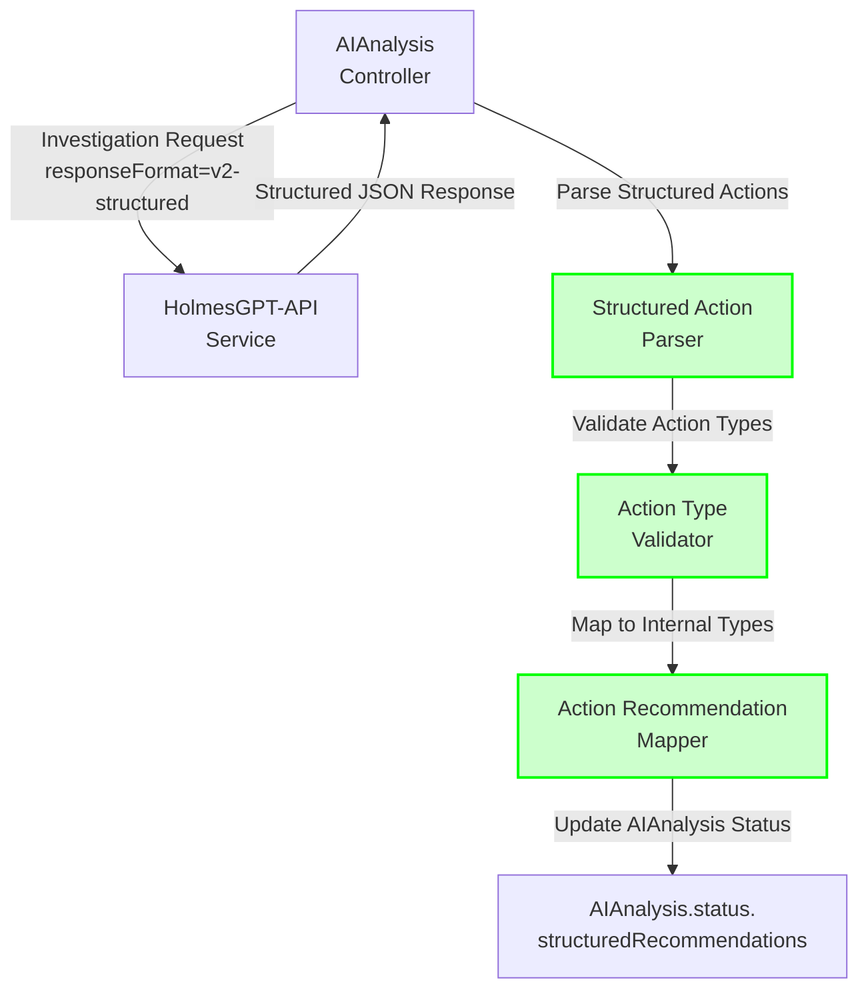

## Integration Points

### HolmesGPT Integration Architecture

**Architectural Principle**: AIAnalysis controller delegates HolmesGPT investigation to HolmesGPT-API service. Toolset configuration is managed by Dynamic Toolset Service (standalone service, like Context API).

**Structured Action Format Support**: AIAnalysis service MUST consume structured action responses from HolmesGPT API per BR-LLM-021 to BR-LLM-026. This eliminates natural language translation and enables type-safe action processing.

#### Service Integration Flow



#### Component Responsibilities

| Component | Responsibility | Namespace |
|-----------|---------------|-----------|
| **AIAnalysis Controller** | Create investigation requests, process results, update CRD status | `kubernaut-system` |
| **HolmesGPT-API Service** | REST API wrapper for HolmesGPT SDK, investigation orchestration | `kubernaut-system` |
| **Dynamic Toolset Service** | Discover cluster services, generate toolset configurations, manage toolset lifecycle | `kubernaut-system` |
| **Context API** | Provide historical patterns and organizational intelligence | `kubernaut-system` |

#### HolmesGPT Toolset Management

**Key Architectural Decision**: Toolsets are configured **per HolmesGPT instance** (system-wide), NOT per-investigation.

**Why System-Wide Configuration?**
- ✅ **Consistency**: All investigations use same toolset capabilities
- ✅ **Performance**: No toolset discovery per-investigation
- ✅ **Simplicity**: Single source of truth for available toolsets
- ✅ **Dynamic Updates**: Toolsets automatically updated when cluster services change

**Dynamic Toolset Service** (see `DYNAMIC_TOOLSET_CONFIGURATION_ARCHITECTURE.md`):
- Discovers cluster services (Prometheus, Grafana, Jaeger, Elasticsearch, custom)
- Generates HolmesGPT toolset configurations automatically
- Provides toolset configuration via REST API
- Updates toolset configuration when services added/removed

**HolmesGPT-API Integration**:
```python
# HolmesGPT-API queries Dynamic Toolset Service on startup
toolsets_response = requests.get("http://dynamic-toolset-service.kubernaut-system.svc.cluster.local:8095/toolsets")
available_toolsets = toolsets_response.json()["toolsets"]  # ["kubernetes", "prometheus", "grafana"]

# Initialize HolmesGPT SDK with dynamic toolsets
holmes_client = Client(
    api_key=llm_api_key,
    toolsets=available_toolsets  # From Dynamic Toolset Service
)
```

**AIAnalysis CRD Does NOT Configure Toolsets**:
- ❌ No `holmesGPTConfig` field in AIAnalysis.spec
- ❌ AIAnalysis controller does NOT manage toolset configuration
- ✅ AIAnalysis provides targeting data only (namespace, resourceKind, resourceName, kubernetesContext)
- ✅ HolmesGPT-API handles toolset initialization and configuration

#### Investigation Request Flow

**AIAnalysis Controller → HolmesGPT-API**:
```go
// In AIAnalysisReconciler.investigatePhase()
investigationRequest := HolmesGPTInvestigationRequest{
    AlertContext: AlertContext{
        Fingerprint:  aiAnalysis.Spec.AnalysisRequest.AlertContext.Fingerprint,
        Severity:     aiAnalysis.Spec.AnalysisRequest.AlertContext.Severity,
        Environment:  aiAnalysis.Spec.AnalysisRequest.AlertContext.Environment,

        // Targeting data for HolmesGPT toolsets
        Namespace:    aiAnalysis.Spec.AnalysisRequest.AlertContext.Namespace,
        ResourceKind: aiAnalysis.Spec.AnalysisRequest.AlertContext.ResourceKind,
        ResourceName: aiAnalysis.Spec.AnalysisRequest.AlertContext.ResourceName,

        // Kubernetes context (small metadata, <10KB)
        KubernetesContext: aiAnalysis.Spec.AnalysisRequest.AlertContext.KubernetesContext,
    },
    AnalysisTypes: aiAnalysis.Spec.AnalysisRequest.AnalysisTypes,
    InvestigationScope: aiAnalysis.Spec.AnalysisRequest.InvestigationScope,
}

// POST to HolmesGPT-API
response, err := r.holmesGPTClient.Investigate(ctx, investigationRequest)
if err != nil {
    return r.handleHolmesGPTError(ctx, aiAnalysis, err)
}

// Update AIAnalysis status with results
aiAnalysis.Status.InvestigationResult = response.InvestigationResult
```

**HolmesGPT-API Investigation Handler**:
```python
# In HolmesGPT-API (Python)
@app.post("/api/v1/investigate")
async def investigate(request: InvestigationRequest):
    # HolmesGPT SDK uses targeting data to fetch real-time logs/metrics
    result = await holmes_client.investigate(
        alert_name=request.alert_context.fingerprint,
        namespace=request.alert_context.namespace,        # Where to look
        resource_name=request.alert_context.resource_name,  # What to investigate
        # HolmesGPT toolsets automatically:
        # 1. kubectl logs -n {namespace} {resource_name} --tail 500
        # 2. kubectl describe pod {resource_name} -n {namespace}
        # 3. kubectl get events -n {namespace}
        # 4. promql: container_memory_usage_bytes{pod="{resource_name}"}
    )

    return InvestigationResponse(investigation_result=result)
```

#### Error Handling for HolmesGPT-API Failures

**AIAnalysis Controller Error Handling Strategy**:

```go
// In AIAnalysisReconciler
func (r *AIAnalysisReconciler) handleHolmesGPTError(
    ctx context.Context,
    aiAnalysis *aianalysisv1.AIAnalysis,
    err error,
) error {

    // Classify error type
    switch {
    case errors.Is(err, ErrHolmesGPTUnavailable):
        // Service unavailable (network, pod down, etc.)
        r.Log.Error(err, "HolmesGPT-API unavailable",
            "aiAnalysis", aiAnalysis.Name,
            "retryAttempt", aiAnalysis.Status.RetryCount,
        )

        // Retry with exponential backoff
        if aiAnalysis.Status.RetryCount < maxRetries {
            aiAnalysis.Status.RetryCount++
            return fmt.Errorf("HolmesGPT-API unavailable, retry %d/%d: %w",
                aiAnalysis.Status.RetryCount, maxRetries, err)
        }

        // Max retries exceeded - mark as failed
        aiAnalysis.Status.Phase = "failed"
        failureReason := fmt.Sprintf(
            "HolmesGPT-API unavailable after %d retries: %v",
            maxRetries, err,
        )
        aiAnalysis.Status.FailureReason = &failureReason

    case errors.Is(err, ErrHolmesGPTTimeout):
        // Investigation timeout
        r.Log.Error(err, "HolmesGPT investigation timeout",
            "aiAnalysis", aiAnalysis.Name,
            "timeout", investigationTimeout,
        )

        // Timeout is non-retryable - mark as failed
        aiAnalysis.Status.Phase = "failed"
        failureReason := fmt.Sprintf("HolmesGPT investigation timeout: %v", err)
        aiAnalysis.Status.FailureReason = &failureReason

    case errors.Is(err, ErrHolmesGPTInvalidResponse):
        // Invalid/malformed response (hallucination, schema mismatch)
        r.Log.Error(err, "HolmesGPT invalid response",
            "aiAnalysis", aiAnalysis.Name,
        )

        // Log for analysis, mark as failed
        aiAnalysis.Status.Phase = "failed"
        failureReason := fmt.Sprintf("HolmesGPT invalid response: %v", err)
        aiAnalysis.Status.FailureReason = &failureReason

    case errors.Is(err, ErrHolmesGPTRateLimited):
        // Rate limited by LLM provider
        r.Log.Warn("HolmesGPT rate limited, backing off",
            "aiAnalysis", aiAnalysis.Name,
        )

        // Exponential backoff, requeue
        return fmt.Errorf("HolmesGPT rate limited: %w", err)

    default:
        // Unknown error
        r.Log.Error(err, "HolmesGPT unknown error",
            "aiAnalysis", aiAnalysis.Name,
        )

        aiAnalysis.Status.Phase = "failed"
        failureReason := fmt.Sprintf("HolmesGPT unknown error: %v", err)
        aiAnalysis.Status.FailureReason = &failureReason
    }

    // Update status
    if err := r.Status().Update(ctx, aiAnalysis); err != nil {
        return err
    }

    return nil
}
```

**Error Metrics**:
```go
var (
    holmesGPTErrorTotal = prometheus.NewCounterVec(
        prometheus.CounterOpts{
            Name: "kubernaut_holmesgpt_error_total",
            Help: "Total HolmesGPT API errors by type",
        },
        []string{"error_type", "severity", "environment"},
    )

    holmesGPTRetryTotal = prometheus.NewCounter(
        prometheus.CounterOpts{
            Name: "kubernaut_holmesgpt_retry_total",
            Help: "Total HolmesGPT retry attempts",
        },
    )
)
```

---

### Structured Action Response Handling

**Business Requirements**: BR-LLM-021 to BR-LLM-026, BR-AI-011

**Purpose**: AI Analysis service MUST consume and process structured action responses from HolmesGPT API, eliminating the need for natural language translation and enabling type-safe action processing.

#### Structured Response Integration Flow



#### Go Type Definitions

**File**: `pkg/ai/holmesgpt/types.go`

```go
package holmesgpt

import "time"

// StructuredInvestigateResponse represents v2-structured format
// Business Requirement: BR-LLM-021, BR-LLM-026
type StructuredInvestigateResponse struct {
    InvestigationID   string                  `json:"investigation_id"`
    Status            InvestigationStatus     `json:"status"`
    StructuredActions []StructuredAction      `json:"structured_actions"`
    Metadata          StructuredResponseMeta  `json:"metadata"`
}

// InvestigationStatus represents investigation completion status
type InvestigationStatus string

const (
    InvestigationStatusCompleted InvestigationStatus = "completed"
    InvestigationStatusPartial   InvestigationStatus = "partial"
    InvestigationStatusFailed    InvestigationStatus = "failed"
)

// StructuredAction represents a single structured remediation action
type StructuredAction struct {
    ActionType  ActionType             `json:"action_type"`
    Parameters  map[string]interface{} `json:"parameters"`
    Priority    ActionPriority         `json:"priority"`
    Confidence  float64                `json:"confidence"`
    Reasoning   ActionReasoning        `json:"reasoning"`
    Monitoring  *ActionMonitoring      `json:"monitoring,omitempty"`
}

// ActionType represents one of 29 canonical predefined action types
// Source of Truth: docs/design/CANONICAL_ACTION_TYPES.md
type ActionType string

const (
    // Core Actions (P0) - 5 actions
    ActionScaleDeployment    ActionType = "scale_deployment"
    ActionRestartPod         ActionType = "restart_pod"
    ActionIncreaseResources  ActionType = "increase_resources"
    ActionRollbackDeployment ActionType = "rollback_deployment"
    ActionExpandPVC          ActionType = "expand_pvc"

    // Infrastructure Actions (P1) - 6 actions
    ActionDrainNode      ActionType = "drain_node"
    ActionCordonNode     ActionType = "cordon_node"
    ActionUncordonNode   ActionType = "uncordon_node"
    ActionTaintNode      ActionType = "taint_node"
    ActionUntaintNode    ActionType = "untaint_node"
    ActionQuarantinePod  ActionType = "quarantine_pod"

    // Storage & Persistence (P2) - 3 actions
    ActionCleanupStorage ActionType = "cleanup_storage"
    ActionBackupData     ActionType = "backup_data"
    ActionCompactStorage ActionType = "compact_storage"

    // Application Lifecycle (P1) - 3 actions
    ActionUpdateHPA          ActionType = "update_hpa"
    ActionRestartDaemonset   ActionType = "restart_daemonset"
    ActionScaleStatefulSet   ActionType = "scale_statefulset"

    // Security & Compliance (P2) - 3 actions
    ActionRotateSecrets       ActionType = "rotate_secrets"
    ActionAuditLogs           ActionType = "audit_logs"
    ActionUpdateNetworkPolicy ActionType = "update_network_policy"

    // Network & Connectivity (P2) - 2 actions
    ActionRestartNetwork    ActionType = "restart_network"
    ActionResetServiceMesh  ActionType = "reset_service_mesh"

    // Database & Stateful (P2) - 2 actions
    ActionFailoverDatabase ActionType = "failover_database"
    ActionRepairDatabase   ActionType = "repair_database"

    // Monitoring & Observability (P2) - 3 actions
    ActionEnableDebugMode     ActionType = "enable_debug_mode"
    ActionCreateHeapDump      ActionType = "create_heap_dump"
    ActionCollectDiagnostics  ActionType = "collect_diagnostics"

    // Resource Management (P1) - 2 actions
    ActionOptimizeResources ActionType = "optimize_resources"
    ActionMigrateWorkload   ActionType = "migrate_workload"

    // Fallback (P3) - 1 action
    ActionNotifyOnly ActionType = "notify_only"
)

// Total: 27 canonical action types

// ActionPriority represents action execution priority
type ActionPriority string

const (
    PriorityCritical ActionPriority = "critical"
    PriorityHigh     ActionPriority = "high"
    PriorityMedium   ActionPriority = "medium"
    PriorityLow      ActionPriority = "low"
)

// ActionReasoning provides context for the recommended action
type ActionReasoning struct {
    PrimaryReason    string        `json:"primary_reason"`
    RiskAssessment   RiskLevel     `json:"risk_assessment"`
    BusinessImpact   string        `json:"business_impact,omitempty"`
}

// RiskLevel represents risk assessment for action execution
type RiskLevel string

const (
    RiskLow    RiskLevel = "low"
    RiskMedium RiskLevel = "medium"
    RiskHigh   RiskLevel = "high"
)

// ActionMonitoring defines post-action monitoring criteria
type ActionMonitoring struct {
    SuccessCriteria    []string `json:"success_criteria"`
    ValidationInterval string   `json:"validation_interval"`
}

// StructuredResponseMeta contains response metadata
type StructuredResponseMeta struct {
    GeneratedAt     time.Time `json:"generated_at"`
    ModelVersion    string    `json:"model_version"`
    FormatVersion   string    `json:"format_version"`
    TokensUsed      int       `json:"tokens_used,omitempty"`
    DurationSeconds float64   `json:"duration_seconds,omitempty"`
}
```

#### HolmesGPT Client Update

**File**: `pkg/ai/holmesgpt/client.go`

```go
// InvestigateWithStructuredResponse performs investigation with structured format
// Business Requirement: BR-LLM-021, BR-LLM-026, BR-AI-011
func (c *ClientImpl) InvestigateWithStructuredResponse(
    ctx context.Context,
    req *InvestigateRequest,
) (*StructuredInvestigateResponse, error) {
    c.logger.WithFields(logrus.Fields{
        "alert_name": req.AlertName,
        "namespace":  req.Namespace,
    }).Info("Starting structured investigation")

    // Prepare request with structured format flag
    payload := map[string]interface{}{
        "alert_name":        req.AlertName,
        "namespace":         req.Namespace,
        "labels":            req.Labels,
        "annotations":       req.Annotations,
        "priority":          req.Priority,
        "response_format":   "v2-structured",          // Request structured format
        "toolsets":          []string{"kubernetes", "prometheus"},
        "enable_validation": true,
    }

    jsonPayload, err := json.Marshal(payload)
    if err != nil {
        return nil, fmt.Errorf("failed to marshal request: %w", err)
    }

    // Call HolmesGPT API
    httpReq, err := http.NewRequestWithContext(
        ctx,
        "POST",
        c.endpoint+"/api/v1/investigate",
        bytes.NewBuffer(jsonPayload),
    )
    if err != nil {
        return nil, fmt.Errorf("failed to create request: %w", err)
    }

    httpReq.Header.Set("Content-Type", "application/json")

    resp, err := c.httpClient.Do(httpReq)
    if err != nil {
        c.logger.WithError(err).Warn("HolmesGPT call failed, using fallback")
        return c.generateFallbackStructuredResponse(req), nil
    }
    defer resp.Body.Close()

    // Parse structured response
    var structuredResp StructuredInvestigateResponse
    if err := json.NewDecoder(resp.Body).Decode(&structuredResp); err != nil {
        c.logger.WithError(err).Warn("Failed to parse structured response, using fallback")
        return c.generateFallbackStructuredResponse(req), nil
    }

    c.logger.WithFields(logrus.Fields{
        "investigation_id": structuredResp.InvestigationID,
        "actions_count":    len(structuredResp.StructuredActions),
        "status":           structuredResp.Status,
    }).Info("Structured investigation completed")

    return &structuredResp, nil
}

// generateFallbackStructuredResponse creates fallback when HolmesGPT unavailable
func (c *ClientImpl) generateFallbackStructuredResponse(
    req *InvestigateRequest,
) *StructuredInvestigateResponse {
    return &StructuredInvestigateResponse{
        InvestigationID: fmt.Sprintf("fallback-%d", time.Now().Unix()),
        Status:          InvestigationStatusPartial,
        StructuredActions: []StructuredAction{
            {
                ActionType: ActionNotifyOnly,
                Parameters: map[string]interface{}{
                    "namespace": req.Namespace,
                    "message":   "HolmesGPT unavailable, manual review required",
                },
                Priority:   PriorityMedium,
                Confidence: 0.5,
                Reasoning: ActionReasoning{
                    PrimaryReason:  "Investigation service unavailable",
                    RiskAssessment: RiskLow,
                },
            },
        },
        Metadata: StructuredResponseMeta{
            GeneratedAt:   time.Now(),
            ModelVersion:  "fallback",
            FormatVersion: "v2-structured-fallback",
        },
    }
}
```

#### Action Type Validation

**File**: `pkg/ai/holmesgpt/validation.go`

```go
package holmesgpt

import (
    "fmt"
    "strings"
)

// ValidActionTypes is the complete set of 29 canonical action types
// Source of Truth: docs/design/CANONICAL_ACTION_TYPES.md
var ValidActionTypes = map[ActionType]bool{
    // Core Actions (P0) - 5 actions
    ActionScaleDeployment:     true,
    ActionRestartPod:          true,
    ActionIncreaseResources:   true,
    ActionRollbackDeployment:  true,
    ActionExpandPVC:           true,

    // Infrastructure Actions (P1) - 6 actions
    ActionDrainNode:      true,
    ActionCordonNode:     true,
    ActionUncordonNode:   true,
    ActionTaintNode:      true,
    ActionUntaintNode:    true,
    ActionQuarantinePod:  true,

    // Storage & Persistence (P2) - 3 actions
    ActionCleanupStorage: true,
    ActionBackupData:     true,
    ActionCompactStorage: true,

    // Application Lifecycle (P1) - 3 actions
    ActionUpdateHPA:          true,
    ActionRestartDaemonset:   true,
    ActionScaleStatefulSet:   true,

    // Security & Compliance (P2) - 3 actions
    ActionRotateSecrets:       true,
    ActionAuditLogs:           true,
    ActionUpdateNetworkPolicy: true,

    // Network & Connectivity (P2) - 2 actions
    ActionRestartNetwork:    true,
    ActionResetServiceMesh:  true,

    // Database & Stateful (P2) - 2 actions
    ActionFailoverDatabase: true,
    ActionRepairDatabase:   true,

    // Monitoring & Observability (P2) - 3 actions
    ActionEnableDebugMode:     true,
    ActionCreateHeapDump:      true,
    ActionCollectDiagnostics:  true,

    // Resource Management (P1) - 2 actions
    ActionOptimizeResources: true,
    ActionMigrateWorkload:   true,

    // Fallback (P3) - 1 action
    ActionNotifyOnly: true,
}

// Total: 27 canonical action types

// IsValidActionType checks if action type is valid
func IsValidActionType(actionType ActionType) bool {
    return ValidActionTypes[actionType]
}

// ValidateStructuredResponse validates structured response
// Business Requirement: BR-LLM-025
func ValidateStructuredResponse(resp *StructuredInvestigateResponse) error {
    if resp == nil {
        return fmt.Errorf("nil response")
    }

    if resp.InvestigationID == "" {
        return fmt.Errorf("missing investigation_id")
    }

    if len(resp.StructuredActions) == 0 {
        return fmt.Errorf("no actions in structured response")
    }

    for i, action := range resp.StructuredActions {
        if err := validateAction(action, i); err != nil {
            return fmt.Errorf("action %d invalid: %w", i, err)
        }
    }

    return nil
}

// validateAction validates individual action
func validateAction(action StructuredAction, index int) error {
    // Validate action type
    if !IsValidActionType(action.ActionType) {
        return fmt.Errorf("invalid action_type: %s", action.ActionType)
    }

    // Validate parameters
    if action.Parameters == nil {
        return fmt.Errorf("nil parameters")
    }

    namespace, ok := action.Parameters["namespace"].(string)
    if !ok || namespace == "" {
        return fmt.Errorf("missing or invalid namespace parameter")
    }

    // Validate confidence
    if action.Confidence < 0.0 || action.Confidence > 1.0 {
        return fmt.Errorf("confidence out of range [0.0, 1.0]: %f", action.Confidence)
    }

    // Validate priority
    validPriorities := map[ActionPriority]bool{
        PriorityCritical: true,
        PriorityHigh:     true,
        PriorityMedium:   true,
        PriorityLow:      true,
    }
    if !validPriorities[action.Priority] {
        return fmt.Errorf("invalid priority: %s", action.Priority)
    }

    // Validate reasoning
    if action.Reasoning.PrimaryReason == "" {
        return fmt.Errorf("missing primary_reason in reasoning")
    }

    return nil
}
```

#### Configuration Requirements

**File**: `internal/config/config.go`

```go
type AIConfig struct {
    // Existing fields...

    // Structured action format support (NEW)
    UseStructuredHolmesGPT  bool   `yaml:"use_structured_holmesgpt" envconfig:"USE_STRUCTURED_HOLMESGPT"`
    StructuredFormatVersion string `yaml:"structured_format_version" envconfig:"STRUCTURED_FORMAT_VERSION"`
    EnableFuzzyMatching     bool   `yaml:"enable_fuzzy_matching" envconfig:"ENABLE_FUZZY_MATCHING"`
    FallbackToLegacy        bool   `yaml:"fallback_to_legacy" envconfig:"FALLBACK_TO_LEGACY"`
}
```

**Configuration File** (`config/development.yaml`):

```yaml
ai:
  provider: "holmesgpt"
  endpoint: "http://holmesgpt-api.kubernaut-system.svc.cluster.local:8090"

  # Structured action format configuration (NEW)
  use_structured_holmesgpt: true
  structured_format_version: "v2-structured"
  enable_fuzzy_matching: true
  fallback_to_legacy: true  # Enable during transition period

  # Existing configuration...
  investigation_timeout: "5m"
  max_retries: 3
```

#### Feature Flag Control

**Environment Variables**:

```bash
# Enable structured format (feature flag)
USE_STRUCTURED_HOLMESGPT=true

# Structured format version
STRUCTURED_FORMAT_VERSION=v2-structured

# Enable fuzzy matching for unknown actions
ENABLE_FUZZY_MATCHING=true

# Fallback to legacy format if structured fails
FALLBACK_TO_LEGACY=true
```

#### Testing Requirements

**Unit Tests** (`pkg/ai/holmesgpt/validation_test.go`):

```go
var _ = Describe("Structured Action Validation", func() {
    Context("Valid structured response", func() {
        It("should validate successfully", func() {
            resp := &StructuredInvestigateResponse{
                InvestigationID: "inv-test-123",
                Status:          InvestigationStatusCompleted,
                StructuredActions: []StructuredAction{
                    {
                        ActionType: ActionRestartPod,
                        Parameters: map[string]interface{}{
                            "namespace":     "production",
                            "resource_type": "pod",
                            "resource_name": "app-xyz-123",
                        },
                        Priority:   PriorityHigh,
                        Confidence: 0.9,
                        Reasoning: ActionReasoning{
                            PrimaryReason:  "Memory leak detected",
                            RiskAssessment: RiskLow,
                        },
                    },
                },
            }

            err := ValidateStructuredResponse(resp)
            Expect(err).ToNot(HaveOccurred())
        })
    })

    Context("Invalid action type", func() {
        It("should return validation error", func() {
            resp := &StructuredInvestigateResponse{
                InvestigationID: "inv-test-456",
                Status:          InvestigationStatusCompleted,
                StructuredActions: []StructuredAction{
                    {
                        ActionType: ActionType("invalid_action"),
                        Parameters: map[string]interface{}{"namespace": "default"},
                    },
                },
            }

            err := ValidateStructuredResponse(resp)
            Expect(err).To(HaveOccurred())
            Expect(err.Error()).To(ContainSubstring("invalid action_type"))
        })
    })
})
```

**Integration Tests** (`test/integration/structured_actions/ai_analysis_test.go`):

```go
var _ = Describe("AIAnalysis Structured Action Integration", func() {
    var (
        holmesClient holmesgpt.Client
        ctx          context.Context
    )

    BeforeEach(func() {
        ctx = context.Background()
        holmesClient = createTestHolmesClient()
    })

    Context("When HolmesGPT returns structured actions", func() {
        It("should process without translation", func() {
            req := &holmesgpt.InvestigateRequest{
                AlertName: "HighMemoryUsage",
                Namespace: "production",
            }

            resp, err := holmesClient.InvestigateWithStructuredResponse(ctx, req)
            Expect(err).ToNot(HaveOccurred())
            Expect(resp.StructuredActions).ToNot(BeEmpty())

            // Verify all actions are valid
            for _, action := range resp.StructuredActions {
                Expect(holmesgpt.IsValidActionType(action.ActionType)).To(BeTrue())
                Expect(action.Parameters).ToNot(BeEmpty())
                Expect(action.Confidence).To(BeNumerically(">", 0.0))
            }
        })
    })
})
```

**Test Coverage Target**: >85%

#### Backward Compatibility

**BR-LLM-023**: MUST handle both structured and legacy formats

**Implementation Strategy**:

1. **Feature Flag Control**: Use `USE_STRUCTURED_HOLMESGPT` to enable/disable
2. **Automatic Fallback**: If structured parsing fails, attempt legacy format
3. **Gradual Migration**: Support both formats during transition period
4. **Monitoring**: Track format usage via metrics

**Compatibility Adapter**:

```go
func (c *ClientImpl) Investigate(
    ctx context.Context,
    req *InvestigateRequest,
) (*InvestigationResult, error) {
    // Check feature flag
    if c.config.UseStructuredHolmesGPT {
        structuredResp, err := c.InvestigateWithStructuredResponse(ctx, req)
        if err != nil && !c.config.FallbackToLegacy {
            return nil, err
        }

        if err == nil {
            // Convert structured to legacy format for backward compatibility
            return c.convertStructuredToLegacy(structuredResp), nil
        }

        // Fall through to legacy format if fallback enabled
    }

    // Legacy format investigation
    return c.InvestigateLegacy(ctx, req)
}
```

---

### **Alternative 2 Integration: RemediationProcessing as Primary Data Source**

> **📋 Design Decision: DD-001 - Alternative 2**
> **Pattern**: AIAnalysis reads complete enrichment from spec (NO API calls)
> **Status**: ✅ Approved Design | **Confidence**: 95%
> **See**: [DD-001](../../../architecture/DESIGN_DECISIONS.md#dd-001-recovery-context-enrichment-alternative-2)

**Reference**: [`PROPOSED_FAILURE_RECOVERY_SEQUENCE.md`](../../../architecture/PROPOSED_FAILURE_RECOVERY_SEQUENCE.md) (Version 1.2 - Alternative 2)
**Business Requirement**: BR-WF-RECOVERY-011

#### Overview

AIAnalysis CRD receives **complete enrichment data** from RemediationProcessing CRD, including:
- **Monitoring Context** (FRESH current cluster state)
- **Business Context** (FRESH ownership/runbooks)
- **Recovery Context** (Historical failures from Context API - ONLY for recovery attempts)

This data is **copied** into `AIAnalysis.spec.enrichmentData` by Remediation Orchestrator after RemediationProcessing completes.

#### Data Flow (Alternative 2)

```
RemediationProcessing Enrichment (4-7 seconds)
   ↓ (monitoring + business + recovery contexts)
RemediationProcessing.status.enrichmentResults
   ↓ (watch completion)
Remediation Orchestrator
   ↓ (copy enrichment data)
AIAnalysis.spec.enrichmentData
   ↓ (NO API CALLS NEEDED!)
AIAnalysis Controller reads from spec
   ↓
HolmesGPT receives ALL contexts in prompt
```

#### AIAnalysis Spec Structure (Alternative 2)

```go
// api/ai/v1/aianalysis_types.go
type AIAnalysisSpec struct {
    // Parent reference
    RemediationRequestRef corev1.LocalObjectReference `json:"remediationRequestRef"`

    // NEW: Reference to source RemediationProcessing CRD
    RemediationProcessingRef *corev1.LocalObjectReference `json:"remediationProcessingRef,omitempty"`

    // Recovery-specific fields
    IsRecoveryAttempt      bool                         `json:"isRecoveryAttempt,omitempty"`
    RecoveryAttemptNumber  int                          `json:"recoveryAttemptNumber,omitempty"`
    FailedWorkflowRef      *corev1.LocalObjectReference `json:"failedWorkflowRef,omitempty"`

    // NEW: Complete enrichment data (Alternative 2)
    // Copied from RemediationProcessing.status.enrichmentResults
    EnrichmentData *EnrichmentData `json:"enrichmentData,omitempty"`
}

// EnrichmentData contains ALL contexts from RemediationProcessing
type EnrichmentData struct {
    // FRESH monitoring context
    MonitoringContext *MonitoringContext `json:"monitoringContext,omitempty"`

    // FRESH business context
    BusinessContext *BusinessContext `json:"businessContext,omitempty"`

    // Recovery context (ONLY for recovery attempts)
    RecoveryContext *RecoveryContext `json:"recoveryContext,omitempty"`

    // Metadata
    EnrichedAt     metav1.Time `json:"enrichedAt"`
    ContextQuality string      `json:"contextQuality"`  // "complete", "partial", "degraded"
}
```

#### Remediation Orchestrator Integration (Alternative 2)

```go
// In RemediationRequestReconciler (Remediation Orchestrator)
func (r *RemediationRequestReconciler) createAIAnalysis(
    ctx context.Context,
    remediation *remediationv1.RemediationRequest,
    completedRP *processingv1.RemediationProcessing,
) error {

    log := ctrl.LoggerFrom(ctx)

    // Create AIAnalysis with enrichment data from RemediationProcessing
    aiAnalysis := &aianalysisv1.AIAnalysis{
        ObjectMeta: metav1.ObjectMeta{
            Name:      fmt.Sprintf("%s-analysis-%d", remediation.Name, remediation.Status.RecoveryAttempts + 1),
            Namespace: remediation.Namespace,
            OwnerReferences: []metav1.OwnerReference{
                *metav1.NewControllerRef(remediation, remediationv1.GroupVersion.WithKind("RemediationRequest")),
            },
        },
        Spec: aianalysisv1.AIAnalysisSpec{
            RemediationRequestRef:    corev1.LocalObjectReference{Name: remediation.Name},
            RemediationProcessingRef: &corev1.LocalObjectReference{Name: completedRP.Name},

            // Recovery fields (if applicable)
            IsRecoveryAttempt:     completedRP.Spec.IsRecoveryAttempt,
            RecoveryAttemptNumber: completedRP.Spec.RecoveryAttemptNumber,
            FailedWorkflowRef:     completedRP.Spec.FailedWorkflowRef,

            // COPY complete enrichment data from RemediationProcessing (Alternative 2)
            EnrichmentData: convertToEnrichmentData(completedRP.Status.EnrichmentResults),
        },
    }

    if completedRP.Spec.IsRecoveryAttempt {
        log.Info("Creating AIAnalysis for recovery attempt with ALL contexts",
            "aiAnalysis", aiAnalysis.Name,
            "attemptNumber", completedRP.Spec.RecoveryAttemptNumber,
            "contextQuality", completedRP.Status.EnrichmentResults.ContextQuality,
            "hasRecoveryContext", completedRP.Status.EnrichmentResults.RecoveryContext != nil)
    }

    return r.Create(ctx, aiAnalysis)
}

// Convert RemediationProcessing enrichment to AIAnalysis enrichment data
func convertToEnrichmentData(rpEnrichment *processingv1.EnrichmentResults) *aianalysisv1.EnrichmentData {
    return &aianalysisv1.EnrichmentData{
        MonitoringContext: convertMonitoringContext(rpEnrichment.KubernetesContext),
        BusinessContext:   convertBusinessContext(rpEnrichment.BusinessContext),
        RecoveryContext:   convertRecoveryContext(rpEnrichment.RecoveryContext),
        EnrichedAt:        metav1.Now(),
        ContextQuality:    rpEnrichment.ContextQuality,
    }
}
```

#### AIAnalysis Controller Usage (Alternative 2)

```go
// In AIAnalysisReconciler.investigatePhase()
func (p *InvestigatingPhase) Handle(
    ctx context.Context,
    aiAnalysis *aianalysisv1.AIAnalysis,
) (ctrl.Result, error) {

    log := ctrl.LoggerFrom(ctx)

    // Build investigation request with enrichment data
    req := buildInvestigationRequest(aiAnalysis)

    // Read enrichment data from spec (NO API CALLS!)
    if aiAnalysis.Spec.EnrichmentData != nil {
        log.Info("Using enrichment data from RemediationProcessing",
            "remediationProcessing", aiAnalysis.Spec.RemediationProcessingRef.Name,
            "contextQuality", aiAnalysis.Spec.EnrichmentData.ContextQuality,
            "isRecovery", aiAnalysis.Spec.IsRecoveryAttempt)

        // Add ALL contexts to investigation request
        req.MonitoringContext = aiAnalysis.Spec.EnrichmentData.MonitoringContext
        req.BusinessContext = aiAnalysis.Spec.EnrichmentData.BusinessContext

        // Recovery context only present for recovery attempts
        if aiAnalysis.Spec.IsRecoveryAttempt && aiAnalysis.Spec.EnrichmentData.RecoveryContext != nil {
            req.RecoveryContext = aiAnalysis.Spec.EnrichmentData.RecoveryContext
            req.IsRecoveryAttempt = true
        }
    }

    // Proceed with HolmesGPT investigation (with enriched prompt)
    result, err := p.Analyzer.Investigate(ctx, req)
    // ...
}
```

#### Key Benefits (Alternative 2)

| Aspect | Option B | Alternative 2 |
|--------|----------|---------------|
| **Monitoring Context** | From initial enrichment (stale) | **FRESH** from recovery enrichment ✅ |
| **Business Context** | From initial enrichment (stale) | **FRESH** from recovery enrichment ✅ |
| **Recovery Context** | Queried by RR | Queried by RP (temporal consistency) ✅ |
| **Temporal Consistency** | Mixed timestamps | All contexts same timestamp ✅ |
| **Audit Trail** | RR logic in recovery flow | Immutable RP CRDs ✅ |
| **Graceful Degradation** | In RR | In RP (unified enrichment) ✅ |
| **Architecture** | Split enrichment (RP + RR) | Unified enrichment (RP only) ✅ |

#### Integration Pattern Summary

1. **RemediationProcessing enriches** (monitoring + business + recovery)
2. **Remediation Orchestrator copies** enrichment to AIAnalysis spec
3. **AIAnalysis controller reads** from spec (NO API calls)
4. **HolmesGPT receives** complete enrichment in prompt

✅ **Result**: AIAnalysis has FRESH monitoring + business + recovery contexts, all captured at the same timestamp, with a clear audit trail.

---

### Dependencies (Data Snapshot)

#### RemediationRequest Creates AIAnalysis (No Watch Needed)
**Pattern**: Data snapshot at creation time (self-contained CRD)
**Trigger**: RemediationRequest watches RemediationProcessing completion → creates AIAnalysis with all data
**Data Copied**: Complete enrichment data from RemediationProcessing.status (Alternative 2)

**Why No Watch on RemediationProcessing?**
- ✅ **Self-Contained**: All targeting data copied into AIAnalysis.spec at creation
- ✅ **Performance**: No cross-CRD reads during reconciliation
- ✅ **Resilience**: Works even if RemediationProcessing deleted (24h retention)
- ✅ **Simplicity**: AIAnalysis doesn't depend on RemediationProcessing existence

**RemediationRequest (Remediation Coordinator) Creates AIAnalysis**:
```go
// In RemediationRequestReconciler (Remediation Coordinator)
func (r *RemediationRequestReconciler) reconcileRemediationProcessing(
    ctx context.Context,
    remediation *remediationv1.RemediationRequest,
    alertProcessing *processingv1.RemediationProcessing,
) error {

    // When RemediationProcessing completes, create AIAnalysis with ALL data
    if alertProcessing.Status.Phase == "completed" {
        aiAnalysis := &aianalysisv1.AIAnalysis{
            ObjectMeta: metav1.ObjectMeta{
                Name:      fmt.Sprintf("%s-analysis", remediation.Name),
                Namespace: remediation.Namespace,
                OwnerReferences: []metav1.OwnerReference{
                    *metav1.NewControllerRef(remediation, remediationv1.GroupVersion.WithKind("RemediationRequest")),
                },
            },
            Spec: aianalysisv1.AIAnalysisSpec{
                RemediationRequestRef: aianalysisv1.RemediationRequestReference{
                    Name:      remediation.Name,
                    Namespace: remediation.Namespace,
                },

                // COPY all enriched data (data snapshot pattern)
                AnalysisRequest: aianalysisv1.AnalysisRequest{
                    AlertContext: aianalysisv1.AlertContext{
                        Fingerprint:      alertProcessing.Status.EnrichedAlert.Fingerprint,
                        Severity:         alertProcessing.Status.EnrichedAlert.Severity,
                        Environment:      alertProcessing.Status.EnrichedAlert.Environment,
                        BusinessPriority: alertProcessing.Status.EnrichedAlert.BusinessPriority,

                        // Complete enriched payload snapshot
                        EnrichedPayload: alertProcessing.Status.EnrichedAlert.EnrichedPayload,
                    },
                    AnalysisTypes: []string{"investigation", "root-cause", "recovery-analysis"},

                    // Derive investigation scope from enriched alert context
                    InvestigationScope: aianalysisv1.InvestigationScope{
                        TimeWindow: "24h",
                        ResourceScope: []aianalysisv1.ResourceScopeItem{
                            {
                                Kind:      alertProcessing.Status.EnrichedAlert.ResourceKind,
                                Namespace: alertProcessing.Status.EnrichedAlert.Namespace,
                                Name:      alertProcessing.Status.EnrichedAlert.ResourceName,
                            },
                        },
                        CorrelationDepth: "detailed",
                        IncludeHistoricalPatterns: true,
                    },
                },

            // Note: HolmesGPT toolset configuration is managed by Dynamic Toolset Service
            // AIAnalysis CRD does NOT contain holmesGPTConfig field
            // Toolsets are system-wide, not per-investigation
            },
        }

        return r.Create(ctx, aiAnalysis)
    }

    return nil
}
```

#### RemediationRequest CRD → Parent Reference
**Purpose**: Lifecycle management and ownership
**Owner Reference**: AIAnalysis is owned by RemediationRequest
**Cleanup**: When RemediationRequest is deleted, AIAnalysis is cascaded

**Finalizer Logic**:
```go
const aiAnalysisFinalizer = "aianalysis.kubernaut.io/aianalysis-cleanup"

func (r *AIAnalysisReconciler) Reconcile(ctx context.Context, req ctrl.Request) (ctrl.Result, error) {
    var aiAnalysis aianalysisv1.AIAnalysis
    if err := r.Get(ctx, req.NamespacedName, &aiAnalysis); err != nil {
        return ctrl.Result{}, client.IgnoreNotFound(err)
    }

    // Handle deletion
    if !aiAnalysis.ObjectMeta.DeletionTimestamp.IsZero() {
        if controllerutil.ContainsFinalizer(&aiAnalysis, aiAnalysisFinalizer) {
            // Perform cleanup
            if err := r.cleanupAIAnalysisResources(ctx, &aiAnalysis); err != nil {
                return ctrl.Result{}, err
            }

            // Remove finalizer
            controllerutil.RemoveFinalizer(&aiAnalysis, aiAnalysisFinalizer)
            if err := r.Update(ctx, &aiAnalysis); err != nil {
                return ctrl.Result{}, err
            }
        }
        return ctrl.Result{}, nil
    }

    // Add finalizer if not present
    if !controllerutil.ContainsFinalizer(&aiAnalysis, aiAnalysisFinalizer) {
        controllerutil.AddFinalizer(&aiAnalysis, aiAnalysisFinalizer)
        if err := r.Update(ctx, &aiAnalysis); err != nil {
            return ctrl.Result{}, err
        }
    }

    // ... reconciliation logic
}
```

### Creates (Owner References)

#### WorkflowExecution CRD → Workflow Orchestration
**Trigger**: When `AIAnalysis.status.phase = "completed"`
**Purpose**: Execute top-ranked recommendation via workflow
**Owner Reference**: WorkflowExecution owned by AIAnalysis

**Creation Logic**:
```go
func (r *AIAnalysisReconciler) createWorkflowExecution(ctx context.Context, aiAnalysis *aianalysisv1.AIAnalysis) error {
    if len(aiAnalysis.Status.Recommendations) == 0 {
        return fmt.Errorf("no recommendations available")
    }

    topRecommendation := aiAnalysis.Status.Recommendations[0] // Highest ranked

    workflow := &workflowv1.WorkflowExecution{
        ObjectMeta: metav1.ObjectMeta{
            Name:      fmt.Sprintf("%s-workflow-%d", aiAnalysis.Name, time.Now().Unix()),
            Namespace: aiAnalysis.Namespace,
            OwnerReferences: []metav1.OwnerReference{
                *metav1.NewControllerRef(aiAnalysis, aianalysisv1.GroupVersion.WithKind("AIAnalysis")),
            },
        },
        Spec: workflowv1.WorkflowExecutionSpec{
            AIAnalysisRef: workflowv1.AIAnalysisReference{
                Name:      aiAnalysis.Name,
                Namespace: aiAnalysis.Namespace,
            },
            RecommendedAction: topRecommendation,
            // ... workflow configuration
        },
    }

    if err := r.Create(ctx, workflow); err != nil {
        return fmt.Errorf("failed to create WorkflowExecution: %w", err)
    }

    // Update AIAnalysis status with workflow reference
    aiAnalysis.Status.WorkflowExecutionRef = &aianalysisv1.WorkflowExecutionReference{
        Name:      workflow.Name,
        Namespace: workflow.Namespace,
    }

    return r.Status().Update(ctx, aiAnalysis)
}
```

### External Services (HTTP)

#### HolmesGPT-API Service (Port 8080)
**Purpose**: AI investigation, recovery analysis, safety analysis
**Endpoints**:
- `POST /api/v1/investigate` - Trigger investigation (BR-HAPI-INVESTIGATION-001)
- `POST /api/v1/recover` - Get recovery recommendations (BR-HAPI-RECOVERY-001)
- `POST /api/v1/safety-analysis` - Analyze action safety (BR-HAPI-SAFETY-001)
- `POST /api/v1/post-execution` - Post-execution learning (BR-HAPI-POSTEXEC-001)

**Client Integration**:
```go
// pkg/ai/analysis/integration/holmesgpt.go
package integration

import (
    "github.com/jordigilh/kubernaut/pkg/ai/holmesgpt"
)

type HolmesGPTClient struct {
    client holmesgpt.Client
}

func NewHolmesGPTClient(config *Config) *HolmesGPTClient {
    return &HolmesGPTClient{
        client: holmesgpt.NewClient(holmesgpt.ClientConfig{
            BaseURL: config.HolmesGPTURL, // http://holmesgpt-api:8080
            Timeout: 5 * time.Minute,
        }),
    }
}

func (h *HolmesGPTClient) Investigate(ctx context.Context, req InvestigationRequest) (*InvestigationResult, error) {
    // Wrap existing HolmesGPT client (pkg/ai/holmesgpt/client.go)
    result, err := h.client.Investigate(ctx, &holmesgpt.InvestigationRequest{
        AlertContext:     req.AlertContext,
        InvestigationScope: req.Scope,
        Toolsets:        req.Toolsets,
    })

    if err != nil {
        return nil, fmt.Errorf("holmesgpt investigation failed: %w", err)
    }

    return &InvestigationResult{
        RootCauseHypotheses: result.RootCauses,
        CorrelatedAlerts:    result.CorrelatedAlerts,
        Evidence:            result.Evidence,
    }, nil
}
```

#### Data Storage Service (Port 8085)
**Purpose**: Historical pattern lookup, success rate retrieval
**Endpoints**:
- `POST /api/v1/vector/search` - Similarity search for historical patterns (BR-AI-011)
- `GET /api/v1/audit/success-rate?action={action}` - Historical success rates (BR-AI-008)

**Client Integration**:
```go
// pkg/ai/analysis/integration/storage.go
package integration

type StorageClient struct {
    baseURL string
    client  *http.Client
}

func (s *StorageClient) GetHistoricalPatterns(ctx context.Context, fingerprint string) ([]HistoricalPattern, error) {
    req := VectorSearchRequest{
        Query:     fingerprint,
        TopK:      10,
        Threshold: 0.75,
    }

    resp, err := s.client.Post(
        fmt.Sprintf("%s/api/v1/vector/search", s.baseURL),
        "application/json",
        toJSON(req),
    )

    // ... handle response
}

func (s *StorageClient) GetSuccessRate(ctx context.Context, action string) (float64, error) {
    resp, err := s.client.Get(
        fmt.Sprintf("%s/api/v1/audit/success-rate?action=%s", s.baseURL, action),
    )

    // ... handle response, return success rate (BR-AI-008)
}
```

---

