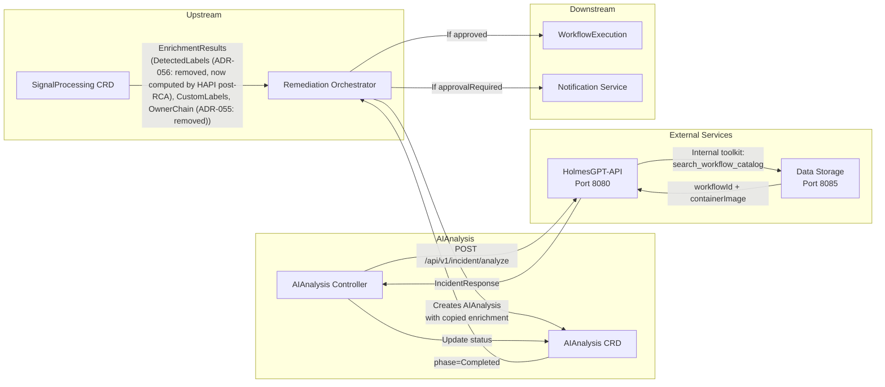

# AI Analysis Service - Integration Points

**Version**: v2.2
**Last Updated**: 2025-12-02
**Status**: ✅ V1.0 Scope Defined

---

## Changelog

| Version | Date | Changes | Reference |
|---------|------|---------|-----------|
| **v2.2** | 2025-12-02 | **SCHEMA UPDATE**: Added `failedDetections` to DetectedLabels data flow; HolmesGPT-API passes to Data Storage for filter skipping | [DD-WORKFLOW-001 v2.1](../../../architecture/decisions/DD-WORKFLOW-001-mandatory-label-schema.md) |
| v2.1 | 2025-12-02 | **CRITICAL FIXES**: Port 8090→8080; Endpoints corrected; MCP removed (toolkit-based); Request/response schemas updated; Added `target_in_owner_chain` and `warnings` | [AIANALYSIS_TO_HOLMESGPT_API_TEAM.md](../../../handoff/AIANALYSIS_TO_HOLMESGPT_API_TEAM.md) |
| v2.0 | 2025-11-30 | **REGENERATED**: Fixed RemediationProcessing→SignalProcessing; Added DetectedLabels/CustomLabels/OwnerChain flow; Updated HolmesGPT-API integration; Removed legacy enrichment patterns | DD-WORKFLOW-001 v1.8 |
| v1.1 | 2025-10-16 | Added structured action format | DD-CONTRACT-002 |
| v1.0 | 2025-10-15 | Initial specification | - |

---

## Integration Architecture (V1.0)

### Data Flow Overview



> **⚠️ IMPORTANT CORRECTION (Dec 2025)**: HolmesGPT-API does **NOT** expose an MCP server. The MCP workflow catalog approach was replaced with a **toolkit-based architecture** where HolmesGPT-API uses internal tools to query Data Storage directly. AIAnalysis calls HolmesGPT-API via REST endpoints.

---

## Upstream Integration

### SignalProcessing → AIAnalysis (via RO)

**Pattern**: Self-contained CRD - all data copied to AIAnalysis.spec at creation

**Source**: `SignalProcessing.status.enrichmentResults`
**Target**: `AIAnalysis.spec.enrichmentResults`

#### Data Copied

```yaml
# AIAnalysis.spec (created by RO from SignalProcessing)
spec:
  # Signal identification
  signalContext:
    signalType: "alert"
    fingerprint: "abc123"
    severity: "critical"
    namespace: "production"
    resourceKind: "Deployment"
    resourceName: "payment-api"

  # Enrichment data (copied from SignalProcessing.status)
  enrichmentResults:
    kubernetesContext:
      namespace: "production"
      podDetails:
        name: "payment-api-7d8f9c6b5-x2j4k"
        phase: "Running"
        containerStatuses:
          - name: "api"
            ready: true
            restartCount: 5
      deploymentDetails:
        name: "payment-api"
        replicas: 3
        availableReplicas: 2

    # Auto-detected labels (DD-WORKFLOW-001 v2.1) (ADR-056: removed from EnrichmentResults, now computed by HAPI post-RCA)
    detectedLabels:
      # Detection failures (DD-WORKFLOW-001 v2.1)
      # If a field is listed here, its value is unreliable (RBAC, timeout, etc.)
      # If empty/nil, all detections succeeded
      failedDetections: []  # or: ["pdbProtected"] if PDB query failed

      gitOpsTool: "argocd"
      pdbProtected: true
      statefulWorkload: false
      hpaEnabled: true
      resourceQuotaConstrained: false

    # Customer-defined labels (from SignalProcessing Rego)
    customLabels:
      constraint:
        - "cost-constrained"
        - "stateful-safe"
      team:
        - "name=payments"
      region:
        - "name=us-west-2"

    # K8s ownership chain (DD-WORKFLOW-001 v1.7) (ADR-055: removed from EnrichmentResults)
    ownerChain:
      - namespace: "production"
        kind: "ReplicaSet"
        name: "payment-api-7d8f9c6b5"
      - namespace: "production"
        kind: "Deployment"
        name: "payment-api"

    # NOTE: EnrichmentQuality REMOVED (Dec 2025)
    # SignalProcessing uses boolean `degradedMode` flag instead
    # RO checks phase completion, not quality scores
```

#### Why Self-Contained CRD?

| Benefit | Explanation |
|---------|-------------|
| **No API calls during reconciliation** | All data in spec, no external reads |
| **Resilient to upstream deletion** | Works even if SignalProcessing deleted |
| **Clear audit trail** | Enrichment data immutably recorded |
| **Decoupled architecture** | AIAnalysis doesn't depend on SignalProcessing availability |

---

## HolmesGPT-API Integration

### Endpoints (V1.0)

| Endpoint | Method | Purpose |
|----------|--------|---------|
| `http://holmesgpt-api:8080/api/v1/incident/analyze` | POST | Initial incident investigation |
| `http://holmesgpt-api:8080/api/v1/recovery/analyze` | POST | Recovery attempt analysis |
| `http://holmesgpt-api:8080/health` | GET | Health check for circuit breaker |

### Investigation Request (V1.0)

**Endpoint**: `POST http://holmesgpt-api:8080/api/v1/incident/analyze`

> **IMPORTANT**: HolmesGPT-API uses a **flat structure** - NOT nested `signalContext`.
>
> **DECISION**: Storm context (`is_storm`, `storm_signal_count`) is **NOT exposed** to the LLM. Use `occurrence_count` instead to convey persistence information. See [DD-AIANALYSIS-004](../../../architecture/decisions/DD-AIANALYSIS-004-storm-context-not-exposed.md) for rationale.

#### Request Structure (Corrected Dec 2025)

```json
{
  "incident_id": "alert-12345",
  "remediation_id": "req-2025-12-02-abc123",
  "signal_type": "OOMKilled",
  "severity": "critical",
  "signal_source": "prometheus",
  "resource_namespace": "default",
  "resource_kind": "Deployment",
  "resource_name": "nginx",
  "error_message": "Container exceeded memory limit",
  "environment": "production",
  "priority": "P0",
  "cluster_name": "prod-us-west-2",
  "enrichment_results": {
    "detectedLabels": {  // ADR-056: removed from EnrichmentResults, now computed by HAPI post-RCA
      "failedDetections": [],  // DD-WORKFLOW-001 v2.1: or ["pdbProtected"] if query failed
      "gitOpsManaged": true,
      "gitOpsTool": "argocd",
      "pdbProtected": true,
      "serviceMesh": "istio"
    },
    "ownerChain": [  // ADR-055: removed from EnrichmentResults
      {"namespace": "default", "kind": "ReplicaSet", "name": "nginx-7d8f9c6b5"},
      {"namespace": "default", "kind": "Deployment", "name": "nginx"}
    ],
    "customLabels": {
      "constraint": ["cost-constrained"],
      "team": ["name=payments"]
    }
  }
}
```

**Key Request Corrections**:
| Field | Old Schema | Correct Schema |
|-------|------------|----------------|
| Structure | Nested `signalContext` | Flat fields |
| `remediation_id` | Optional | **MANDATORY** (audit correlation) |
| DetectedLabels | Wrong fields | Use `pkg/shared/types/enrichment.go` (ADR-056: removed from EnrichmentResults) |
| `failedDetections` | Not present | **Added (DD-WORKFLOW-001 v2.1)** - list of fields where detection failed |

#### Label Usage by HolmesGPT-API

| Label Type | LLM Prompt | Workflow Filtering |
|------------|------------|-------------------|
| **DetectedLabels** (ADR-056: removed from EnrichmentResults) | ✅ Always included | ✅ Only if OwnerChain validates (`target_in_owner_chain=true`) |
| **CustomLabels** | ❌ NOT in LLM prompt | ✅ Always (auto-appended to search) |
| **FailedDetections** | ✅ Mentioned as caveats | ⚠️ Skip filter for affected fields |

> **CustomLabels are NOT visible to LLM** (per DD-HAPI-001): Labels are for filtering, not analysis. Prevents LLM forgetting to include them and reduces prompt size.

#### FailedDetections Handling (DD-WORKFLOW-001 v2.1)

When a detection query fails (RBAC, timeout, etc.), the field is added to `failedDetections`:

| Scenario | Field Value | `failedDetections` | Workflow Filtering Behavior |
|----------|-------------|-------------------|----------------------------|
| PDB exists | `pdbProtected=true` | `[]` | ✅ Filter by `pdb_protected=true` |
| No PDB | `pdbProtected=false` | `[]` | ✅ Filter by `pdb_protected=false` |
| Query failed | `pdbProtected=false` | `["pdbProtected"]` | ⚠️ Skip `pdb_protected` filter entirely |

**Data Storage SQL Pattern**:
```sql
-- If pdbProtected in failedDetections, skip the filter (treat as "no preference")
WHERE (
    'pdbProtected' = ANY($failedDetections)  -- Skip filter
    OR pdb_protected = $pdbProtected         -- Apply filter
)
```

**Key Distinction**: "Resource doesn't exist" ≠ detection failure. A successful detection that finds no PDB returns `pdbProtected=false` with empty `failedDetections`.

#### OwnerChain Validation (DD-WORKFLOW-001 v1.7) (ADR-055: OwnerChain removed from EnrichmentResults)

HolmesGPT-API validates DetectedLabels applicability when RCA identifies a different resource than the signal source:

```python
def validate_target_in_owner_chain(rca_resource, owner_chain):
    """
    DetectedLabels describe the ORIGINAL signal's resource.
    If RCA identifies a DIFFERENT resource, validate relationship.

    Returns:
        - True: RCA resource found in OwnerChain → DetectedLabels apply
        - False: RCA resource NOT in chain → DetectedLabels may not apply
    """
    if not owner_chain:
        return False  # No chain = orphan resource

    for entry in owner_chain:
        if (entry.namespace == rca_resource.namespace and
            entry.kind == rca_resource.kind and
            entry.name == rca_resource.name):
            return True

    return False
```

### Response Structure (Corrected Dec 2025)

```json
{
  "incident_id": "alert-12345",
  "analysis": "Natural language analysis from LLM...",
  "root_cause_analysis": {
    "summary": "Container exceeded memory limit due to memory leak",
    "severity": "critical",
    "contributing_factors": ["Memory leak", "Insufficient limits"]
  },
  "selected_workflow": {
    "workflow_id": "wf-memory-increase-001",
    "containerImage": "ghcr.io/kubernaut/workflows/memory-increase:v2.1.0",
    "containerDigest": "sha256:abc123def456...",
    "confidence": 0.90,
    "rationale": "Selected based on 90% semantic similarity for OOMKilled signal",
    "parameters": {
      "TARGET_NAMESPACE": "default",
      "TARGET_DEPLOYMENT": "nginx",
      "MEMORY_INCREASE_PERCENT": "50"
    }
  },
  "target_in_owner_chain": true,
  "warnings": [],
  "confidence": 0.90,
  "timestamp": "2025-12-02T10:30:00Z"
}
```

**Key Response Corrections**:
| Field | Old Schema | Correct Schema |
|-------|------------|----------------|
| `recommendations[]` | Array of recommendations | ❌ **REMOVED** - Use `selected_workflow` |
| `requiresApproval` | In response | ❌ **REMOVED** - AIAnalysis determines via Rego |
| `containerImage` | Missing | ✅ **REQUIRED** - Immutable workflow reference |
| `target_in_owner_chain` | Missing | ✅ **ADDED** - OwnerChain validation result |
| `warnings[]` | Missing | ✅ **ADDED** - Non-fatal warnings |

### Response Fields for AIAnalysis Status

| HAPI Field | AIAnalysis Status Field | Purpose |
|------------|-------------------------|---------|
| `selected_workflow` | `status.selectedWorkflow` | Workflow to execute |
| `selected_workflow.confidence` | `status.selectedWorkflow.confidence` | Rego policy input |
| `target_in_owner_chain` | `status.targetInOwnerChain` | Rego policy input, audit trail |
| `warnings[]` | `status.warnings` | K8s events, metrics, operator notifications |

### Error Handling

| Error | Retry | Backoff | Action |
|-------|-------|---------|--------|
| HolmesGPT-API unavailable | 3 attempts | Exponential (1s, 2s, 4s) | Mark as Failed |
| Timeout (30s recommended) | 3 attempts | Exponential | Mark as Failed |
| 4xx errors (400, 404, 422) | No | - | Mark as Failed (validation error) |
| 5xx errors (500, 502, 503, 504) | 3 attempts | Exponential | Mark as Failed if exhausted |

**Health Endpoint** (`GET /health`):
```json
{
  "status": "healthy",
  "llm_connected": true,
  "data_storage_connected": true,
  "version": "v3.2.0"
}
```

**Error Format**: RFC 7807 (`application/problem+json`)

---

## Data Storage Integration

### Workflow Catalog Search (Internal Toolkit)

**Note**: AIAnalysis does **NOT** call Data Storage directly. HolmesGPT-API handles this via internal toolkit (NOT MCP).

> **Architecture Clarification (Dec 2025)**: HolmesGPT-API uses a **toolkit-based architecture** where internal tools query Data Storage directly. There is no exposed MCP server.

#### Internal Tool: `search_workflow_catalog`

HolmesGPT-API internally calls Data Storage to search the workflow catalog. The tool:
1. Receives signal context from the investigation request
2. Queries Data Storage for matching workflows
3. Ranks workflows by semantic similarity and constraint matching
4. Returns the best match as `selected_workflow`

**Workflow Matching Criteria**:
| Criterion | Weight | Source |
|-----------|--------|--------|
| Signal type match | High | `signal_type` in request |
| DetectedLabels constraints (ADR-056: removed from EnrichmentResults) | Medium | Only if `target_in_owner_chain=true` |
| CustomLabels constraints | Medium | Always applied |
| Historical success rate | Low | Data Storage aggregation |

#### Example Workflow Catalog Entry

```json
{
  "workflow_id": "wf-memory-increase-v2",
  "container_image": "ghcr.io/kubernaut/workflows/memory-increase:v2.1.0",
  "container_digest": "sha256:abc123...",
  "title": "Memory Increase Workflow",
  "description": "Safely increases memory limits for OOM pods",
  "applicable_signals": ["OOMKilled", "MemoryPressure"],
  "constraints": {
    "requires": ["gitOpsManaged:true"],
    "excludes": ["stateful:true"]
  },
  "parameters": {
    "TARGET_NAMESPACE": {"required": true},
    "TARGET_DEPLOYMENT": {"required": true},
    "MEMORY_INCREASE_PERCENT": {"required": true, "default": "25"}
  }
}
```

---

## Downstream Integration

### AIAnalysis → Remediation Orchestrator

**Pattern**: CRD status watch

**Watch Trigger**: `AIAnalysis.status.phase == "Completed"`

#### Status Fields for RO

```yaml
status:
  phase: "Completed"
  completionTime: "2025-11-30T10:00:45Z"

  # Primary output - workflow to execute
  selectedWorkflow:
    workflowId: "wf-memory-increase-v2"
    containerImage: "ghcr.io/kubernaut/workflows/memory-increase:v2.1.0"
    parameters:
      targetDeployment: "payment-api"
      memoryIncrease: "512Mi"
      namespace: "production"
    confidence: 0.87
    reasoning: "Historical success rate 92% for similar OOM scenarios"

  # Approval decision
  approvalRequired: true
  approvalReason: "Production environment requires manual approval"

  # Operator context
  investigationSummary: "OOMKilled due to memory leak in payment processing"
```

### RO Actions Based on Status

| `approvalRequired` | RO Action |
|--------------------|-----------|
| `false` | Create `WorkflowExecution` CRD immediately |
| `true` | Create notification via Notification Service, wait for approval |

---

## Recovery Flow Integration [Deprecated - Issue #180]

**Status**: Recovery flow (DD-RECOVERY-002) removed. See Issue #180.

### RO Creates Recovery AIAnalysis (Deprecated)

When a `WorkflowExecution` fails, RO creates a new `AIAnalysis` with recovery context:

```yaml
apiVersion: kubernaut.ai/v1alpha1
kind: AIAnalysis
metadata:
  name: "remediation-123-analysis-2"
spec:
  isRecoveryAttempt: true
  recoveryAttemptNumber: 2

  # Original enrichment data (reused, not re-enriched)
  enrichmentResults:
    # ... same as original ...

  # Previous execution history (ALL attempts)
  previousExecutions:
    - workflowId: "wf-oom-restart-v1"
      containerImage: "ghcr.io/kubernaut/workflows/oom-restart:v1.2.0"
      failureReason: "Pod evicted during restart - node pressure"
      failurePhase: "execution"
      kubernetesReason: "Evicted"
      attemptNumber: 1
      executedAt: "2025-11-30T10:15:00Z"
```

### HolmesGPT-API Recovery Analysis

**Endpoint**: `POST /api/v1/recovery/analyze`

HolmesGPT-API:
1. Analyzes previous failure patterns
2. Avoids recommending same workflow if non-transient failure
3. May escalate to `notify_only` if options exhausted

---

## Rego Policy Integration

### Policy Loading

**ConfigMap**: `ai-approval-policies` in `kubernaut-system`

```yaml
apiVersion: v1
kind: ConfigMap
metadata:
  name: ai-approval-policies
  namespace: kubernaut-system
data:
  approval.rego: |
    package aianalysis.approval

    default decision = "MANUAL_APPROVAL_REQUIRED"

    # Auto-approve high confidence in non-production
    decision = "AUTO_APPROVE" {
        input.confidence >= 0.8
        input.environment != "production"
        input.target_in_owner_chain == true
    }

    # Require approval when labels may not match target
    decision = "MANUAL_APPROVAL_REQUIRED" {
        input.target_in_owner_chain == false
    }

    # Require approval if warnings present in production
    decision = "MANUAL_APPROVAL_REQUIRED" {
        input.environment == "production"
        count(input.warnings) > 0
    }
```

### Policy Input Schema (V1.0 - Updated Dec 2025)

```go
type ApprovalPolicyInput struct {
    // ========================================
    // INVESTIGATION RESULT
    // ========================================
    // Workflow confidence from HolmesGPT-API (0.0-1.0)
    Confidence float64 `json:"confidence"`
    // Selected action type (e.g., "scale", "restart", "patch")
    ActionType string  `json:"action_type"`

    // ========================================
    // SIGNAL CONTEXT
    // ========================================
    // Environment (free-text, e.g., "production", "staging", "qa-eu")
    Environment string `json:"environment"`
    // Severity level
    Severity    string `json:"severity"`

    // ========================================
    // LABELS (for advanced policies)
    // ========================================
    DetectedLabels *DetectedLabels       `json:"detected_labels,omitempty"`  // ADR-056: removed from EnrichmentResults
    CustomLabels   map[string][]string   `json:"custom_labels,omitempty"`

    // ========================================
    // HAPI RESPONSE METADATA (Dec 2025)
    // ========================================
    // Whether RCA-identified target was found in OwnerChain
    // If false, DetectedLabels may not apply to the actual affected resource
    TargetInOwnerChain bool     `json:"target_in_owner_chain"`
    // Non-fatal warnings from investigation (e.g., low confidence, OwnerChain issues)
    Warnings           []string `json:"warnings,omitempty"`

    // ========================================
    // RECOVERY CONTEXT
    // ========================================
    IsRecoveryAttempt     bool `json:"is_recovery_attempt"`
    RecoveryAttemptNumber int  `json:"recovery_attempt_number"`
}
```

### Example Rego Rules Using New Fields

```rego
# Require approval in production when labels might not match
require_approval {
    input.environment == "production"
    not input.target_in_owner_chain
}

# Require approval if there are warnings + risky action
require_approval {
    count(input.warnings) > 0
    input.action_type == "delete"
}

# Track as metric but don't block
label_scope_warning {
    not input.target_in_owner_chain
}
```

---

## Service Dependencies

### Required Services

| Service | Port | Purpose | Critical |
|---------|------|---------|----------|
| HolmesGPT-API | 8080 | AI investigation, workflow selection | ✅ Yes |
| Data Storage | 8085 | Workflow catalog (via HAPI internal toolkit) | ✅ Yes (indirect) |

### Optional Services

| Service | Port | Purpose |
|---------|------|---------|
| Notification | 8080 | Approval notifications (RO calls this) |

### Go Client

AIAnalysis uses a generated Go client for HolmesGPT-API:

```go
// Generated with ogen from OpenAPI 3.1.0 spec
import "github.com/jordigilh/kubernaut/pkg/clients/holmesgpt"
```

**Client Location**: `pkg/clients/holmesgpt/` (18 files, ~12,600 lines)
**Generation**: `ogen -package holmesgpt -target pkg/clients/holmesgpt holmesgpt-api/api/openapi.json`

---

## Kubernetes Integration

### RBAC Requirements

```yaml
apiVersion: rbac.authorization.k8s.io/v1
kind: ClusterRole
metadata:
  name: aianalysis-controller
rules:
  # AIAnalysis CRD management
  - apiGroups: ["aianalysis.kubernaut.io"]
    resources: ["aianalyses"]
    verbs: ["get", "list", "watch", "update", "patch"]
  - apiGroups: ["aianalysis.kubernaut.io"]
    resources: ["aianalyses/status"]
    verbs: ["get", "update", "patch"]

  # ConfigMap for Rego policies
  - apiGroups: [""]
    resources: ["configmaps"]
    verbs: ["get", "list", "watch"]

  # Events for operational visibility
  - apiGroups: [""]
    resources: ["events"]
    verbs: ["create", "patch"]
```

### Network Policies

```yaml
apiVersion: networking.k8s.io/v1
kind: NetworkPolicy
metadata:
  name: aianalysis-controller
  namespace: kubernaut-system
spec:
  podSelector:
    matchLabels:
      app: aianalysis-controller
  policyTypes:
    - Egress
  egress:
    # HolmesGPT-API
    - to:
        - podSelector:
            matchLabels:
              app: holmesgpt-api
      ports:
        - port: 8090
    # Kubernetes API
    - to:
        - namespaceSelector: {}
      ports:
        - port: 443
```

---

## Related Documents

| Document | Purpose |
|----------|---------|
| [Overview](./overview.md) | Service architecture |
| [CRD Schema](./crd-schema.md) | Type definitions |
| [DD-WORKFLOW-001](../../../architecture/decisions/DD-WORKFLOW-001-mandatory-label-schema.md) | Label schema (authoritative) |
| [DD-RECOVERY-002](../../../architecture/decisions/DD-RECOVERY-002-direct-aianalysis-recovery-flow.md) | Recovery flow design |
| [HANDOFF_REQUEST_HOLMESGPT_API_RECOVERY_PROMPT.md](./HANDOFF_REQUEST_HOLMESGPT_API_RECOVERY_PROMPT.md) | HolmesGPT-API team handoff |
