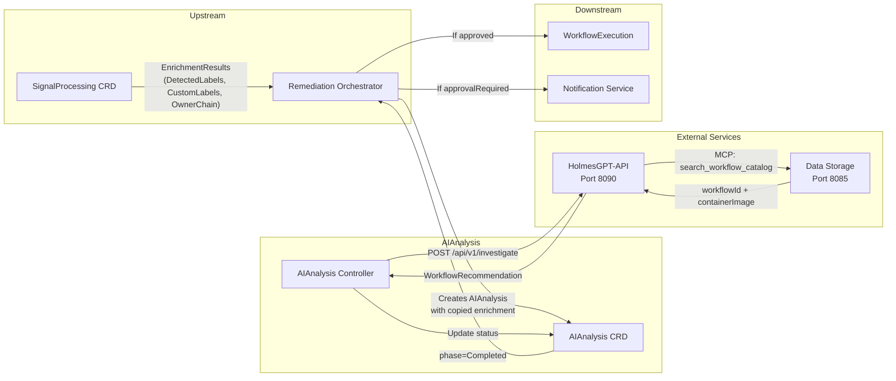

# AI Analysis Service - Integration Points

**Version**: v2.0
**Last Updated**: 2025-11-30
**Status**: ✅ V1.0 Scope Defined

---

## Changelog

| Version | Date | Changes | Reference |
|---------|------|---------|-----------|
| v2.0 | 2025-11-30 | **REGENERATED**: Fixed RemediationProcessing→SignalProcessing; Added DetectedLabels/CustomLabels/OwnerChain flow; Updated HolmesGPT-API integration; Removed legacy enrichment patterns | DD-WORKFLOW-001 v1.8 |
| v1.1 | 2025-10-16 | Added structured action format | BR-LLM-021 |
| v1.0 | 2025-10-15 | Initial specification | - |

---

## Integration Architecture (V1.0)

### Data Flow Overview



---

## Upstream Integration

### SignalProcessing → AIAnalysis (via RO)

**Pattern**: Self-contained CRD - all data copied to AIAnalysis.spec at creation

**Source**: `SignalProcessing.status.enrichmentResults`
**Target**: `AIAnalysis.spec.enrichmentResults`

#### Data Copied

```yaml
# AIAnalysis.spec (created by RO from SignalProcessing)
spec:
  # Signal identification
  signalContext:
    signalType: "alert"
    fingerprint: "abc123"
    severity: "critical"
    namespace: "production"
    resourceKind: "Deployment"
    resourceName: "payment-api"

  # Enrichment data (copied from SignalProcessing.status)
  enrichmentResults:
    kubernetesContext:
      namespace: "production"
      podDetails:
        name: "payment-api-7d8f9c6b5-x2j4k"
        phase: "Running"
        containerStatuses:
          - name: "api"
            ready: true
            restartCount: 5
      deploymentDetails:
        name: "payment-api"
        replicas: 3
        availableReplicas: 2

    # Auto-detected labels (DD-WORKFLOW-001 v1.8)
    detectedLabels:
      gitOpsTool: "argocd"
      pdbProtected: true
      statefulWorkload: false
      hpaEnabled: true
      resourceQuotaConstrained: false

    # Customer-defined labels (from SignalProcessing Rego)
    customLabels:
      constraint:
        - "cost-constrained"
        - "stateful-safe"
      team:
        - "name=payments"
      region:
        - "name=us-west-2"

    # K8s ownership chain (DD-WORKFLOW-001 v1.7)
    ownerChain:
      - namespace: "production"
        kind: "ReplicaSet"
        name: "payment-api-7d8f9c6b5"
      - namespace: "production"
        kind: "Deployment"
        name: "payment-api"

    # Enrichment quality (used by RO for degraded mode)
    enrichmentQuality: 0.95
```

#### Why Self-Contained CRD?

| Benefit | Explanation |
|---------|-------------|
| **No API calls during reconciliation** | All data in spec, no external reads |
| **Resilient to upstream deletion** | Works even if SignalProcessing deleted |
| **Clear audit trail** | Enrichment data immutably recorded |
| **Decoupled architecture** | AIAnalysis doesn't depend on SignalProcessing availability |

---

## HolmesGPT-API Integration

### Investigation Request (V1.0)

**Endpoint**: `POST http://holmesgpt-api:8090/api/v1/investigate`

#### Request Structure

```go
type InvestigationRequest struct {
    // Signal context
    SignalContext SignalContextInput `json:"signalContext"`

    // Kubernetes context from enrichment
    KubernetesContext *KubernetesContext `json:"kubernetesContext,omitempty"`

    // Labels for workflow filtering (DD-WORKFLOW-001 v1.8)
    DetectedLabels *DetectedLabels       `json:"detectedLabels,omitempty"`
    CustomLabels   map[string][]string   `json:"customLabels,omitempty"`

    // Owner chain for DetectedLabels validation
    OwnerChain []OwnerChainEntry `json:"ownerChain,omitempty"`

    // Recovery context (if applicable)
    IsRecoveryAttempt  bool                `json:"isRecoveryAttempt,omitempty"`
    PreviousExecutions []PreviousExecution `json:"previousExecutions,omitempty"`
}
```

#### Label Usage by HolmesGPT-API

| Label Type | LLM Prompt | Workflow Filtering |
|------------|------------|-------------------|
| **DetectedLabels** | ✅ Natural language context | ✅ Only if OwnerChain validates relationship |
| **CustomLabels** | ✅ Natural language context | ✅ Always (customer-defined) |
| **MandatoryLabels** | ✅ Always included | ✅ Required for all workflows |

#### OwnerChain Validation (DD-WORKFLOW-001 v1.7)

HolmesGPT-API validates DetectedLabels applicability:

```python
def should_include_detected_labels_for_filtering(rca_resource, owner_chain):
    """
    DetectedLabels describe the ORIGINAL signal's resource.
    If RCA identifies a DIFFERENT resource, we must validate relationship.

    Default: EXCLUDE from filtering (100% safe)
    Include: Only if RCA resource is in owner chain
    """
    if not owner_chain:
        return False  # No chain = orphan, exclude

    for entry in owner_chain:
        if resources_match(rca_resource, entry):
            return True  # RCA resource is an owner, include

    return False  # RCA resource not in chain, exclude
```

### Response Structure

```go
type InvestigationResponse struct {
    // Investigation metadata
    InvestigationID string `json:"investigationId"`
    Status          string `json:"status"`

    // Workflow recommendation (from MCP catalog search)
    WorkflowRecommendation *WorkflowRecommendation `json:"workflowRecommendation"`

    // Investigation summary (for operator context)
    InvestigationSummary string `json:"investigationSummary"`
    RootCauseAnalysis    string `json:"rootCauseAnalysis"`
}

type WorkflowRecommendation struct {
    WorkflowID     string            `json:"workflowId"`     // UUID from catalog
    ContainerImage string            `json:"containerImage"` // OCI reference
    Parameters     map[string]string `json:"parameters"`
    Confidence     float64           `json:"confidence"`     // 0.0-1.0
    Reasoning      string            `json:"reasoning"`
}
```

### Error Handling

| Error | Retry | Action |
|-------|-------|--------|
| HolmesGPT-API unavailable | 3 attempts | Exponential backoff (1s, 2s, 4s) |
| Timeout (60s) | No | Mark as Failed |
| Invalid response | No | Mark as Failed |
| No workflow found | No | Mark as Failed with reason |

---

## Data Storage Integration

### Workflow Catalog Search (via MCP)

**Note**: AIAnalysis does NOT call Data Storage directly. HolmesGPT-API handles this via MCP tool.

#### MCP Tool Call (by HolmesGPT-API)

```json
{
  "tool": "search_workflow_catalog",
  "parameters": {
    "signal_type": "OOMKilled",
    "severity": "critical",
    "environment": "production",
    "priority": 1,
    "detected_labels": {
      "git_ops_tool": "argocd",
      "pdb_protected": true
    },
    "custom_labels": {
      "constraint": ["cost-constrained"],
      "team": ["name=payments"]
    }
  }
}
```

#### MCP Tool Response

```json
{
  "workflows": [
    {
      "workflow_id": "wf-memory-increase-v2",
      "container_image": "ghcr.io/kubernaut/workflows/memory-increase:v2.1.0",
      "title": "Memory Increase Workflow",
      "description": "Safely increases memory limits for OOM pods",
      "confidence": 0.92,
      "match_score": 0.87
    }
  ]
}
```

---

## Downstream Integration

### AIAnalysis → Remediation Orchestrator

**Pattern**: CRD status watch

**Watch Trigger**: `AIAnalysis.status.phase == "Completed"`

#### Status Fields for RO

```yaml
status:
  phase: "Completed"
  completionTime: "2025-11-30T10:00:45Z"

  # Primary output - workflow to execute
  selectedWorkflow:
    workflowId: "wf-memory-increase-v2"
    containerImage: "ghcr.io/kubernaut/workflows/memory-increase:v2.1.0"
    parameters:
      targetDeployment: "payment-api"
      memoryIncrease: "512Mi"
      namespace: "production"
    confidence: 0.87
    reasoning: "Historical success rate 92% for similar OOM scenarios"

  # Approval decision
  approvalRequired: true
  approvalReason: "Production environment requires manual approval"

  # Operator context
  investigationSummary: "OOMKilled due to memory leak in payment processing"
```

### RO Actions Based on Status

| `approvalRequired` | RO Action |
|--------------------|-----------|
| `false` | Create `WorkflowExecution` CRD immediately |
| `true` | Create notification via Notification Service, wait for approval |

---

## Recovery Flow Integration

### RO Creates Recovery AIAnalysis

When a `WorkflowExecution` fails, RO creates a new `AIAnalysis` with recovery context:

```yaml
apiVersion: aianalysis.kubernaut.io/v1alpha1
kind: AIAnalysis
metadata:
  name: "remediation-123-analysis-2"
spec:
  isRecoveryAttempt: true
  recoveryAttemptNumber: 2

  # Original enrichment data (reused, not re-enriched)
  enrichmentResults:
    # ... same as original ...

  # Previous execution history (ALL attempts)
  previousExecutions:
    - workflowId: "wf-oom-restart-v1"
      containerImage: "ghcr.io/kubernaut/workflows/oom-restart:v1.2.0"
      failureReason: "Pod evicted during restart - node pressure"
      failurePhase: "execution"
      kubernetesReason: "Evicted"
      attemptNumber: 1
      executedAt: "2025-11-30T10:15:00Z"
```

### HolmesGPT-API Recovery Analysis

**Endpoint**: `POST /api/v1/recovery/analyze`

HolmesGPT-API:
1. Analyzes previous failure patterns
2. Avoids recommending same workflow if non-transient failure
3. May escalate to `notify_only` if options exhausted

---

## Rego Policy Integration

### Policy Loading

**ConfigMap**: `ai-approval-policies` in `kubernaut-system`

```yaml
apiVersion: v1
kind: ConfigMap
metadata:
  name: ai-approval-policies
  namespace: kubernaut-system
data:
  approval.rego: |
    package aianalysis.approval

    default decision = "MANUAL_APPROVAL_REQUIRED"

    decision = "AUTO_APPROVE" {
        input.confidence >= 0.8
        input.environment != "production"
    }
```

### Policy Input Schema

```go
type ApprovalPolicyInput struct {
    // Investigation result
    Confidence float64 `json:"confidence"`
    ActionType string  `json:"action_type"`

    // Signal context
    Environment string `json:"environment"`
    Severity    string `json:"severity"`

    // Labels (for advanced policies)
    DetectedLabels *DetectedLabels       `json:"detected_labels,omitempty"`
    CustomLabels   map[string][]string   `json:"custom_labels,omitempty"`

    // Recovery context
    IsRecoveryAttempt     bool `json:"is_recovery_attempt"`
    RecoveryAttemptNumber int  `json:"recovery_attempt_number"`
}
```

---

## Service Dependencies

### Required Services

| Service | Port | Purpose | Critical |
|---------|------|---------|----------|
| HolmesGPT-API | 8090 | AI investigation | ✅ Yes |
| Data Storage | 8085 | Workflow catalog (via MCP) | ✅ Yes (indirect) |

### Optional Services

| Service | Port | Purpose |
|---------|------|---------|
| Notification | 8080 | Approval notifications (RO calls this) |

---

## Kubernetes Integration

### RBAC Requirements

```yaml
apiVersion: rbac.authorization.k8s.io/v1
kind: ClusterRole
metadata:
  name: aianalysis-controller
rules:
  # AIAnalysis CRD management
  - apiGroups: ["aianalysis.kubernaut.io"]
    resources: ["aianalyses"]
    verbs: ["get", "list", "watch", "update", "patch"]
  - apiGroups: ["aianalysis.kubernaut.io"]
    resources: ["aianalyses/status"]
    verbs: ["get", "update", "patch"]

  # ConfigMap for Rego policies
  - apiGroups: [""]
    resources: ["configmaps"]
    verbs: ["get", "list", "watch"]

  # Events for operational visibility
  - apiGroups: [""]
    resources: ["events"]
    verbs: ["create", "patch"]
```

### Network Policies

```yaml
apiVersion: networking.k8s.io/v1
kind: NetworkPolicy
metadata:
  name: aianalysis-controller
  namespace: kubernaut-system
spec:
  podSelector:
    matchLabels:
      app: aianalysis-controller
  policyTypes:
    - Egress
  egress:
    # HolmesGPT-API
    - to:
        - podSelector:
            matchLabels:
              app: holmesgpt-api
      ports:
        - port: 8090
    # Kubernetes API
    - to:
        - namespaceSelector: {}
      ports:
        - port: 443
```

---

## Related Documents

| Document | Purpose |
|----------|---------|
| [Overview](./overview.md) | Service architecture |
| [CRD Schema](./crd-schema.md) | Type definitions |
| [DD-WORKFLOW-001](../../../architecture/decisions/DD-WORKFLOW-001-mandatory-label-schema.md) | Label schema (authoritative) |
| [DD-RECOVERY-002](../../../architecture/decisions/DD-RECOVERY-002-direct-aianalysis-recovery-flow.md) | Recovery flow design |
| [HANDOFF_REQUEST_HOLMESGPT_API_RECOVERY_PROMPT.md](./HANDOFF_REQUEST_HOLMESGPT_API_RECOVERY_PROMPT.md) | HolmesGPT-API team handoff |
