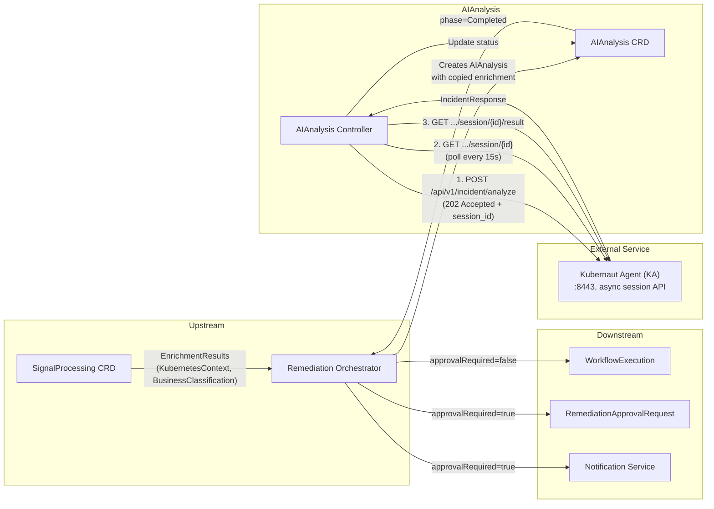
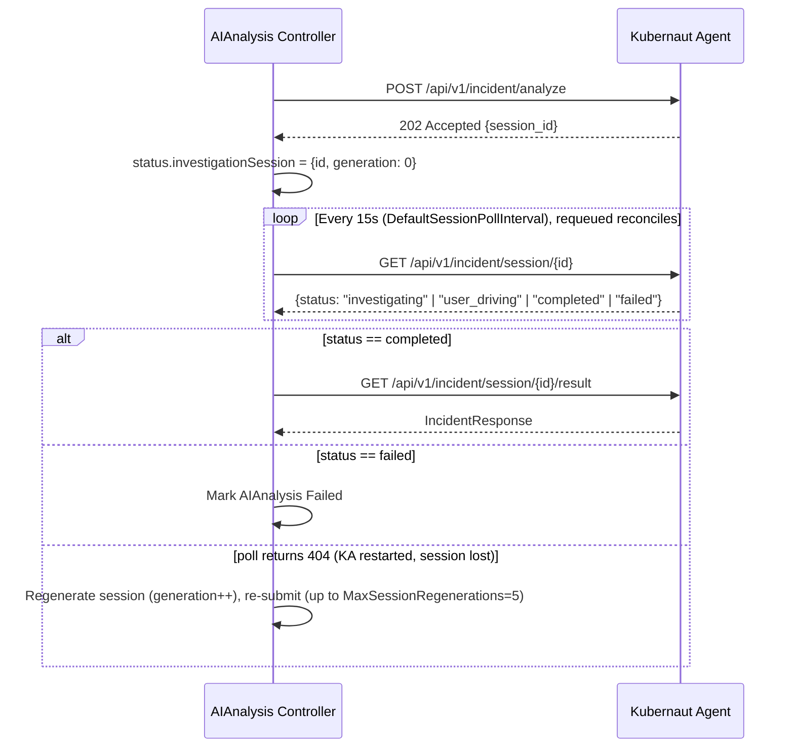

# AI Analysis Service - Integration Points

**Version**: v3.0 (Kubernaut Agent async session API)
**Last Updated**: August 2026
**Status**: ✅ Implemented and in production (V1.0)

> **Rewritten** ([#1806](https://github.com/jordigilh/kubernaut/issues/1806)): the previous version
> of this document (v2.2, dated December 2025) described a synchronous `POST /api/v1/incident/analyze`
> call to "HolmesGPT-API" on port 8080 with a flat JSON body, a `pkg/clients/holmesgpt/` Go client,
> and an internal `search_workflow_catalog` toolkit call to Data Storage — none of which reflect the
> current implementation. Kubernaut Agent (KA) is a native Go service (`internal/kubernautagent/`)
> with an **asynchronous, session-based** API; there is no Python HolmesGPT code left in this repo.
> See [What Changed](#what-changed-since-the-december-2025-version) at the end of this document.

---

## Table of Contents

1. [Integration Architecture](#integration-architecture)
2. [Upstream Integration: SignalProcessing → AIAnalysis](#upstream-integration-signalprocessing-aianalysis-via-ro)
3. [Kubernaut Agent Integration](#kubernaut-agent-integration)
4. [Downstream Integration: AIAnalysis → Remediation Orchestrator](#downstream-integration)
5. [Rego Policy Integration](#rego-policy-integration)
6. [Service Dependencies](#service-dependencies)
7. [Kubernetes Integration](#kubernetes-integration)
8. [What Changed Since the December 2025 Version](#what-changed-since-the-december-2025-version)
9. [Related Documents](#related-documents)

---

## Integration Architecture

### Data Flow Overview


```mermaid
graph LR
    subgraph "Upstream"
        SP[SignalProcessing CRD]
        RO[Remediation Orchestrator]
    end

    subgraph "AIAnalysis"
        AIA[AIAnalysis CRD]
        CTRL[AIAnalysis Controller]
    end

    subgraph "External Service"
        KA["Kubernaut Agent (KA)<br/>:8443, async session API"]
    end

    subgraph "Downstream"
        WE[WorkflowExecution]
        ARQ[RemediationApprovalRequest]
        NOT[Notification Service]
    end

    SP -->|"EnrichmentResults<br/>(KubernetesContext, BusinessClassification)"| RO
    RO -->|"Creates AIAnalysis<br/>with copied enrichment"| AIA
    CTRL -->|"1. POST /api/v1/incident/analyze<br/>(202 Accepted + session_id)"| KA
    CTRL -->|"2. GET .../session/{id}<br/>(poll every 15s)"| KA
    CTRL -->|"3. GET .../session/{id}/result"| KA
    KA -->|"IncidentResponse"| CTRL
    CTRL -->|"Update status"| AIA
    AIA -->|"phase=Completed"| RO
    RO -->|"approvalRequired=false"| WE
    RO -->|"approvalRequired=true"| ARQ
    RO -->|"approvalRequired=true"| NOT
```

KA does not expose a workflow-catalog MCP server or a "toolkit" that AIAnalysis calls into —
AIAnalysis's only contract with KA is the incident-analysis session API described below. Any
Data Storage workflow-catalog lookups happen inside KA's own process, which AIAnalysis has no
visibility into and does not call directly.

---

## Upstream Integration: SignalProcessing → AIAnalysis (via RO)

**Pattern**: Self-contained CRD (DD-CONTRACT-002) — all data copied into `AIAnalysis.spec` at
creation time by RemediationOrchestrator. AIAnalysis never reads `SignalProcessing` directly
during reconciliation.

**Source**: `SignalProcessing.status.enrichmentResults`
**Target**: `AIAnalysis.spec.analysisRequest.signalContext.enrichmentResults`

#### Data Copied

```yaml
# AIAnalysis.spec (created by RO from SignalProcessing)
spec:
  analysisRequest:
    signalContext:
      fingerprint: "sha256:abc123"
      severity: critical
      signalName: OOMKilled          # NOTE: field is signalName, not signalType
      environment: production
      businessPriority: P0
      targetResource:
        kind: Deployment
        name: payment-api
        namespace: production

      # Enrichment data (copied from SignalProcessing.status), pkg/shared/types/enrichment.go
      enrichmentResults:
        kubernetesContext:
          namespace:
            name: production
          workload:
            kind: Deployment
            name: payment-api
            labels:
              app: payment-api
          # K8s ownership chain (DD-WORKFLOW-001 v1.8) — lives ON kubernetesContext, not
          # as a top-level EnrichmentResults field
          ownerChain:
          - namespace: production
            kind: ReplicaSet
            name: payment-api-7d8f9c6b5
          - namespace: production
            kind: Deployment
            name: payment-api
          # Customer-defined labels from SignalProcessing Rego — also on kubernetesContext,
          # not top-level
          customLabels:
            constraint:
            - cost-constrained
            team:
            - name=payments
        businessClassification:
          businessUnit: payments
          criticality: Critical
          slaRequirement: Gold
```

> **No `detectedLabels` in this payload.** Per ADR-056, `DetectedLabels` is no longer supplied
> as *input* enrichment — KA computes it itself during RCA (via its `get_namespaced_resource_context`/
> `get_cluster_resource_context` tools) and returns it in the incident response, where AIAnalysis
> stores it as an *output* on `AIAnalysis.status.postRCAContext.detectedLabels`. See
> [CRD Schema](./crd-schema.md#detectedlabels-13-fields-status-only-see-postrcacontext).

#### Why Self-Contained CRD?

| Benefit | Explanation |
|---------|-------------|
| **No API calls during reconciliation** | All data in spec, no external reads |
| **Resilient to upstream deletion** | Works even if SignalProcessing is deleted |
| **Clear audit trail** | Enrichment data immutably recorded (ADR-001 spec immutability) |
| **Decoupled architecture** | AIAnalysis doesn't depend on SignalProcessing availability |

---

## Kubernaut Agent Integration

### Client

AIAnalysis calls Kubernaut Agent through a generated OpenAPI client, not a hand-written HTTP client:

```go
// pkg/agentclient — ogen-generated from internal/kubernautagent/api/openapi.json.
// NOT pkg/clients/holmesgpt/ (that package does not exist in this repository).
import "github.com/jordigilh/kubernaut/pkg/agentclient"
```

`pkg/aianalysis/handlers.AgentClientInterface` (`pkg/aianalysis/handlers/interfaces.go`) is the
interface the controller programs against:

```go
type AgentClientInterface interface {
    // Legacy synchronous method (being deprecated) — internally does submit→poll→result
    Investigate(ctx context.Context, req *agentclient.IncidentRequest) (*agentclient.IncidentResponse, error)

    // Async session methods (BR-AA-KA-064) — what the controller actually uses
    SubmitInvestigation(ctx context.Context, req *agentclient.IncidentRequest) (string, error)
    PollSession(ctx context.Context, sessionID string) (*agentclient.SessionStatusResult, error)
    GetSessionResult(ctx context.Context, sessionID string) (*agentclient.IncidentResponse, error)

    // BR-INTERACTIVE-010
    CancelSession(ctx context.Context, sessionID string) error
}
```

### Endpoints (async session API, BR-AA-KA-064)

| Endpoint | Method | Purpose |
|----------|--------|---------|
| `https://kubernaut-agent:8443/api/v1/incident/analyze` | POST | Submit an investigation; returns `202 Accepted` with a `session_id` (never a synchronous result) |
| `https://kubernaut-agent:8443/api/v1/incident/session/{session_id}` | GET | Poll session status: `pending` \| `investigating` \| `user_driving` \| `completed` \| `failed` |
| `https://kubernaut-agent:8443/api/v1/incident/session/{session_id}/result` | GET | Retrieve the `IncidentResponse` once status is `completed` (`409` if not yet done) |
| `https://kubernaut-agent:8443/api/v1/incident/session/{session_id}/cancel` | POST | Cancel a running session (BR-INTERACTIVE-010) |
| `https://kubernaut-agent:8443/health` | GET | Health check |

There is no `POST /api/v1/recovery/analyze` endpoint and no separate "recovery" request shape —
per BR-AA-KA-064.9, an ineffective remediation re-fires as a new signal through the Gateway
instead of triggering a dedicated recovery call.

### Async Submit → Poll → Result Flow

This is **not** a single synchronous HTTP call with a short timeout. The controller submits an
investigation, gets a session ID back immediately, and polls on subsequent reconciles until the
session reaches a terminal state:


```mermaid
sequenceDiagram
    participant CTRL as AIAnalysis Controller
    participant KA as Kubernaut Agent

    CTRL->>KA: POST /api/v1/incident/analyze
    KA-->>CTRL: 202 Accepted {session_id}
    CTRL->>CTRL: status.investigationSession = {id, generation: 0}

    loop Every 15s (DefaultSessionPollInterval), requeued reconciles
        CTRL->>KA: GET /api/v1/incident/session/{id}
        KA-->>CTRL: {status: "investigating" | "user_driving" | "completed" | "failed"}
    end

    alt status == completed
        CTRL->>KA: GET /api/v1/incident/session/{id}/result
        KA-->>CTRL: IncidentResponse
    else status == failed
        CTRL->>CTRL: Mark AIAnalysis Failed
    else poll returns 404 (KA restarted, session lost)
        CTRL->>CTRL: Regenerate session (generation++), re-submit (up to MaxSessionRegenerations=5)
    end
```

| Constant | Value | Source | Meaning |
|---|---|---|---|
| `DefaultSessionPollInterval` | 15s | `pkg/aianalysis/handlers/constants.go` | Fixed poll cadence — polling is not error recovery, KA is healthy and just not done yet |
| `DefaultMaxInvestigationDuration` | **25 minutes** | `pkg/aianalysis/handlers/constants.go` | Wall-clock cap on the *entire session* (checked via `checkInvestigationTimeout`), not a per-HTTP-call timeout. Exceeding it transitions the analysis to `Failed`/`TransientError` (#1078) |
| `MaxSessionRegenerations` | 5 | same | Cap on session regenerations after a 404 (KA pod restart) before giving up with `SessionRegenerationExceeded` |
| `MaxConsecutiveGetResultErrors` | 3 | same | Consecutive `409` responses from the result endpoint before the session is regenerated (#1390, breaks a stuck polling loop) |

> **Interactive/MCP takeover**: a human operator can take over an in-progress session (`status:
> "user_driving"`, DD-INTERACTIVE-002). `handleSessionPollUserDriving` still enforces the same
> `DefaultMaxInvestigationDuration` cap — user-driving does **not** bypass the timeout (AA-CRIT-1).
> AIAnalysis surfaces the driving user via `status.interactiveSession` for `kubectl` visibility.

### Request: `IncidentRequest`

Built by `pkg/aianalysis/handlers.RequestBuilder.BuildIncidentRequest` from the CRD spec:

```go
req := &agentclient.IncidentRequest{
    IncidentID:        analysis.Name,                     // CR name
    RemediationID:     correlationID,                     // RemediationRequestRef.Name (preferred) or Spec.RemediationID
    SignalName:        spec.SignalName,                   // NOT "signal_type"
    Severity:          agentclient.Severity(spec.Severity),
    SignalSource:      "kubernaut",
    ResourceNamespace: spec.TargetResource.Namespace,
    ResourceKind:      spec.TargetResource.Kind,
    ResourceName:      spec.TargetResource.Name,
    Environment:       spec.Environment,
    Priority:          spec.BusinessPriority,
    RiskTolerance:     /* from customLabels["risk_tolerance"], default "medium" */,
    BusinessCategory:  /* from customLabels["business_category"], default "standard" */,
    ClusterName:       /* Spec.ClusterID (fleet) or customLabels["cluster_name"], default "default" */,
    // Optional: EnrichmentResults, SignalMode (BR-AI-084), SignalAnnotations (#462), Cluster (BR-FLEET-003)
}
```

Field names on the wire follow the OpenAPI spec's `snake_case` JSON tags (`incident_id`,
`remediation_id`, `signal_name`, `resource_namespace`, etc.) — the Go struct fields above are the
generated client's `CamelCase` equivalents. There is no nested `signal_context` object; these are
top-level fields on `IncidentRequest`, matching the OpenAPI-generated shape (this part of the old
"flat structure" documentation was correct, only the field list was stale).

> Storm context (`is_storm`, `storm_signal_count`) is intentionally **not** exposed to the LLM —
> see [DD-AIANALYSIS-004](../../../architecture/decisions/DD-AIANALYSIS-004-storm-context-not-exposed.md).

### Response: `IncidentResponse`

Processed by `pkg/aianalysis/handlers.ResponseProcessor.ProcessIncidentResponse`. Fields the
processor reads and where they land on the CRD:

| KA response field | AIAnalysis status field | Notes |
|---|---|---|
| `confidence` | (used for threshold check + `RecordConfidenceScore` metric) | 0.7 confidence threshold is enforced by **AIAnalysis**, not KA (BR-KA-197 AC-4) |
| `needs_human_review` | `status.needsHumanReview` | Checked **first**, before any other classification logic |
| `human_review_reason` | `status.humanReviewReason` → mapped to `status.subReason` | |
| `is_actionable` / warning `"Alert not actionable"` | `status.actionability = "NotActionable"` | #388, #607 |
| `root_cause_analysis` (incl. `remediationTarget`) | `status.rootCause`, `status.rootCauseAnalysis` (incl. `status.rootCauseAnalysis.remediationTarget`) | KA emits the field as `remediationTarget` (camelCase) in JSON — not `affected_resource`/`target_in_owner_chain` |
| `selected_workflow` (`workflow_id`, `execution_bundle`, `execution_bundle_digest`, ...) | `status.selectedWorkflow` (embeds `sharedtypes.WorkflowSnapshot`) | Field is `execution_bundle`, not `container_image` |
| `alternative_workflows[]` | `status.alternativeWorkflows` | Informational only, never auto-executed |
| `detected_labels` | `status.postRCAContext.detectedLabels` (+ `setAt` timestamp) | ADR-056: computed by KA post-RCA, immutable once set |
| `alignment_verdict` | `status.alignmentVerdict` | BR-AI-601 shadow-agent verdict; when `circuit_breaker_activated=true`, RCA/workflow fields may be incomplete |
| `warnings[]` | `status.warnings` | Non-fatal; also inspected for outcome-classification signals (e.g. `"Problem self-resolved"`) |
| `validation_attempts_history[]` | `status.validationAttemptsHistory` | DD-KA-001 v1.4: up to 3 LLM self-correction attempts |
| `incident_id` | `status.investigationId` | For correlating with KA's own `kubernaut_agent_llm_token_usage_total` metric |

There is no `requiresApproval` field in the response — AIAnalysis determines approval itself via
Rego (see [Rego Policy Integration](#rego-policy-integration)), and no `recommendations[]` array —
use `selected_workflow`/`alternative_workflows` instead.

### Error Handling and Retry (`pkg/aianalysis/handlers/error_classifier.go`)

`ErrorClassifier.ClassifyError` maps KA call failures to a classification with a retry decision,
distinct from a fixed "3 attempts, 1s/2s/4s" table:

| HTTP status / condition | `ErrorType` | Retryable | Notes |
|---|---|---|---|
| `401` | `Authentication` | No | Alerts |
| `403` | `Authorization` | No | Alerts |
| `404` on poll | `SessionLost` (not `Configuration`) | Triggers session regeneration, not a standard retry | BR-AA-KA-064.5 |
| `404` elsewhere | `Configuration` | No | Alerts |
| `422` / `400` | `Permanent` | No | Alerts |
| `429` | `RateLimit` | Yes | 2× base delay, no alert |
| `500`/`502`/`503`/`504` | `Transient` | Yes | No alert |
| Timeout / `context.DeadlineExceeded` | `Timeout` | Yes | No alert |
| DNS / network error | `Network` | Yes | Alerts on DNS failure |
| `context.Canceled` | `Permanent` | No | No alert (caller-initiated) |

Backoff uses `pkg/shared/backoff` (DD-SHARED-001): base period 1s, multiplier 2.0, ±10% jitter,
capped at 5 minutes, up to `MaxRetries = 5` attempts (`pkg/aianalysis/handlers/constants.go` —
note this constant's own comment additionally documents an 8-minute (`480s`) cap used elsewhere
in the retry path, distinct from the classifier's 5-minute cap).

---

## Downstream Integration

### AIAnalysis → Remediation Orchestrator

**Pattern**: CRD status watch. **Watch Trigger**: `AIAnalysis.status.phase == "Completed"`.

#### Status Fields for RO

```yaml
status:
  phase: "Completed"
  selectedWorkflow:
    workflowId: "wf-memory-increase-v2"
    executionBundle: "quay.io/kubernaut/workflow-oomkill:v1.0.0"   # NOT containerImage
    confidence: 0.87
    parameters:
      NAMESPACE: production
      DEPLOYMENT_NAME: payment-api
    rationale: "Historical success rate 92% for similar OOM scenarios"

  approvalRequired: true
  approvalReason: "Production environment requires manual approval"
  approvalContext:
    investigationSummary: "OOMKilled due to memory leak in payment processing"
```

### RO Actions Based on Status

| `approvalRequired` | RO Action |
|--------------------|-----------|
| `false` | Create `WorkflowExecution` CRD immediately |
| `true` | Create a `RemediationApprovalRequest` (ADR-040) + notification via Notification Service; wait for operator decision |

---

## Rego Policy Integration

### Policy Loading

**ConfigMap**: `aianalysis-policies` in the release namespace, mounted at
`/etc/aianalysis/policies/approval.rego` (`charts/kubernaut/templates/aianalysis/aianalysis.yaml`).
Loaded with hot-reload (`pkg/shared/hotreload`) and cached as a compiled query (ADR-050) — not
re-read/recompiled per evaluation.

```rego
package aianalysis.approval

default confidence_threshold = 0.8

confidence_threshold = input.confidence_threshold {
    input.confidence_threshold
}

decision = "AUTO_APPROVE" {
    input.confidence >= confidence_threshold
    input.environment != "production"
}

decision = "MANUAL_APPROVAL_REQUIRED" {
    input.environment == "production"
    count(input.warnings) > 0
}
```

### Policy Input Schema (`pkg/aianalysis/rego/evaluator.go`, `PolicyInput`)

```go
type PolicyInput struct {
    SignalContext  SignalContextInput      `json:"signal_context"`  // signal_type, severity, environment, business_priority
    TargetResource TargetResourceInput     `json:"target_resource"` // kind, name, namespace
    Classification ClassificationInput     `json:"classification"`  // detected_labels, custom_labels, business_classification
    KAResponse     KAResponseInput         `json:"ka_response"`     // confidence, warnings, failed_detections

    // ADR-055: LLM-identified remediation target, replaces the old target_in_owner_chain boolean
    RemediationTarget   *RemediationTargetInput `json:"remediation_target,omitempty"`
    ConfidenceThreshold *float64                `json:"confidence_threshold,omitempty"` // #225
    Identity            *IdentityInput          `json:"identity,omitempty"`              // #774 interactive sessions
    ActionType           string                 `json:"action_type"`                     // #247, catalog-authoritative
}

type RemediationTargetInput struct {
    Kind      string `json:"kind"`
    Name      string `json:"name"`
    Namespace string `json:"namespace"`
}
```

> **`target_in_owner_chain` no longer exists as a Rego input field.** ADR-055 replaced it with the
> structured `remediation_target` object above, enabling per-kind approval policies (e.g. "always
> require approval when `remediation_target.kind == 'Node'`") instead of a single boolean.

---

## Service Dependencies

### Required Services

| Service | Port | Purpose | Critical |
|---------|------|---------|----------|
| Kubernaut Agent (KA) | 8443 (HTTPS) | AI investigation, workflow selection | ✅ Yes |
| Data Storage | 8080 (HTTP, in-cluster) | Audit event persistence (BR-AUDIT-005) — write-only, buffered/async | ✅ Yes (P0, `cmd/aianalysis/main.go` fails fast if unreachable at startup) |

AIAnalysis **does** call Data Storage directly, but only to emit audit events — it holds the
`aianalysis-controller-datastorage-access` RoleBinding to the shared `data-storage-client`
ClusterRole, and `cmd/aianalysis/main.go` wires an OpenAPI-generated Data Storage client
(`sharedaudit.NewOpenAPIClientAdapter`) into a buffered async audit store (`sharedaudit.NewBufferedStore`,
DD-AUDIT-003/ADR-030). There is no synchronous read path: AIAnalysis never queries Data Storage for
workflow-catalog lookups or anything else — the DataStorage workflow catalog is queried entirely
inside KA's own process, not by AIAnalysis. See
[Security Configuration](./security-configuration.md#authentication-to-kubernaut-agent-and-data-storage-dd-auth-014-dd-auth-005)
for the authentication pattern.

### Go Client

```go
// pkg/agentclient — ogen-generated from internal/kubernautagent/api/openapi.json
import "github.com/jordigilh/kubernaut/pkg/agentclient"
```

Regenerate with the project's standard ogen invocation against
`internal/kubernautagent/api/openapi.json` (see that file's own generation header for the exact
command — it is KA's own spec, not a separately versioned `kubernaut-agent/api/openapi.json`).

---

## Kubernetes Integration

### RBAC (from `internal/controller/aianalysis/aianalysis_controller.go` kubebuilder markers and
`charts/kubernaut/templates/aianalysis/aianalysis.yaml`)

```yaml
apiVersion: rbac.authorization.k8s.io/v1
kind: ClusterRole
metadata:
  name: aianalysis-controller
rules:
  - apiGroups: ["kubernaut.ai"]
    resources: ["aianalyses"]
    verbs: ["get", "list", "watch", "update", "patch"]
  - apiGroups: ["kubernaut.ai"]
    resources: ["aianalyses/status"]
    verbs: ["get", "update", "patch"]
  - apiGroups: ["kubernaut.ai"]
    resources: ["investigationsessions", "investigationsessions/status"]
    verbs: ["get", "list", "watch", "update", "patch"]
  - apiGroups: [""]
    resources: ["events"]
    verbs: ["create", "patch"]
  - apiGroups: ["coordination.k8s.io"]
    resources: ["leases"]
    verbs: ["get", "list", "watch", "create", "update", "patch", "delete"]
```

Two more RoleBindings on the same ServiceAccount grant client access to KA and Data Storage
respectively — `aianalysis-controller-kubernaut-agent-access` (→ `kubernaut-agent-client`
ClusterRole) and `aianalysis-controller-datastorage-access` (→ `data-storage-client` ClusterRole).
Both use a synthetic-resource SAR pattern (DD-AUTH-014), not real Kubernetes API calls. The Rego
policy ConfigMap is projected as a volume mount, not read via the Kubernetes API at runtime, so it
needs no separate `configmaps` RBAC rule. See
[Security Configuration](./security-configuration.md) for the full ServiceAccount/RBAC/auth
picture, including how AIAnalysis authenticates *to* KA and Data Storage.

### Network Policy

```yaml
apiVersion: networking.k8s.io/v1
kind: NetworkPolicy
metadata:
  name: aianalysis-controller
spec:
  podSelector:
    matchLabels:
      app: aianalysis-controller
  policyTypes:
    - Egress
  egress:
    # Kubernaut Agent
    - to:
        - podSelector:
            matchLabels:
              app: kubernaut-agent
      ports:
        - port: 8443
    # Data Storage (audit event writes, BR-AUDIT-005)
    - to:
        - podSelector:
            matchLabels:
              app: datastorage
      ports:
        - port: 8080
    # Kubernetes API
    - to:
        - namespaceSelector: {}
      ports:
        - port: 443
```

---

## What Changed Since the December 2025 Version

| Previous claim | Current reality |
|---|---|
| `pkg/clients/holmesgpt/` Go client, 18 files | `pkg/agentclient/`, ogen-generated from `internal/kubernautagent/api/openapi.json` |
| "HolmesGPT-API", port 8080/8090 | "Kubernaut Agent (KA)", port 8443 (HTTPS) |
| Single synchronous `POST /api/v1/incident/analyze` returning the full result, 30s timeout, 3 retries | Async: `POST` returns `202 Accepted` + `session_id`; poll `GET .../session/{id}` every 15s; fetch `GET .../session/{id}/result`. Wall-clock cap is 25 minutes (`DefaultMaxInvestigationDuration`), not a per-call timeout |
| "Toolkit-based architecture", internal `search_workflow_catalog` tool call to Data Storage | Not part of AIAnalysis's contract — that specific catalog-lookup call is internal to KA's own process, not made by AIAnalysis. (AIAnalysis *does* call Data Storage directly, but only to write audit events, DD-AUDIT-003 — see [Service Dependencies](#service-dependencies)) |
| `target_in_owner_chain` boolean in response/Rego input | `remediationTarget`/`remediation_target` structured object (ADR-055) |
| `detectedLabels`/`ownerChain`/`customLabels` as top-level `enrichment_results` fields sent *to* KA | `detectedLabels` is KA's **output**, not input (ADR-056); `ownerChain`/`customLabels` live on `enrichmentResults.kubernetesContext`, not top-level |
| `containerImage`/`containerDigest` on `selected_workflow` | `execution_bundle`/`execution_bundle_digest` |
| `AIApprovalRequest` CRD, mentioned as not-yet-implemented | Real CRD is `RemediationApprovalRequest` (ADR-040), implemented and used by RemediationOrchestrator today — AIAnalysis itself never touches it |
| Recovery flow (`isRecoveryAttempt`, `previousExecutions`) as a still-relevant deprecated feature | Fully removed from the spec (Issue #180); ineffective remediations re-fire through Gateway instead |

---

## Related Documents

| Document | Purpose |
|----------|---------|
| [Overview](./overview.md) | Service architecture |
| [CRD Schema](./crd-schema.md) | Type definitions |
| [Security Configuration](./security-configuration.md) | RBAC, KA authentication, secret handling |
| [DD-WORKFLOW-001](../../../architecture/decisions/DD-WORKFLOW-001-mandatory-label-schema.md) | Label schema history |
| [ADR-056](../../../architecture/decisions/ADR-056-post-rca-label-computation.md) | DetectedLabels computed post-RCA |
| [ADR-055](../../../architecture/decisions/ADR-055-llm-driven-context-enrichment.md) | RemediationTarget replacing target_in_owner_chain |
| [ADR-040](../../../architecture/decisions/ADR-040-remediation-approval-request-architecture.md) | RemediationApprovalRequest design |
| [DD-AIANALYSIS-004](../../../architecture/decisions/DD-AIANALYSIS-004-storm-context-not-exposed.md) | Storm context not exposed to LLM |

---

**Document Maintainer**: Kubernaut Documentation Team
**Last Updated**: August 2026
**Integration Status**: Implemented and in production (V1.0)
