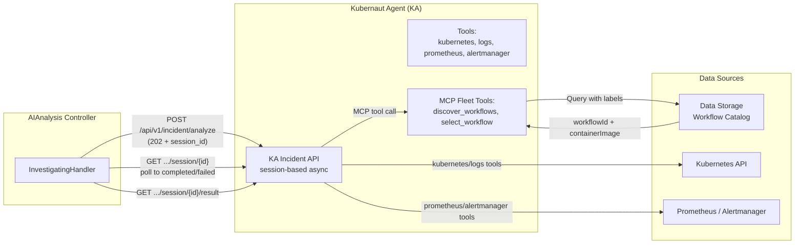

# AI Analysis Service - Kubernaut Agent (KA) Integration & Approval Policies

**Version**: v3.0
**Last Updated**: 2026-08-01
**Status**: ✅ Implemented (Go)

---

## Changelog

| Version | Date | Changes | Reference |
|---------|------|---------|-----------|
| v3.0 | 2026-08-01 | **Full rewrite against Go implementation** ([Issue #1806](https://github.com/jordigilh/kubernaut/issues/1806)): replaced the fictional synchronous `POST /api/v1/investigate` call with the actual async session-based API; corrected the Rego `PolicyInput`/`PolicyResult` schema to match `pkg/aianalysis/rego/evaluator.go`; corrected toolsets (kubernetes, logs, prometheus, alertmanager — not "grafana"); corrected `AIApprovalRequest` → `RemediationApprovalRequest` (implemented, not deferred); corrected metric names; removed HolmesGPT/HAPI terminology throughout |
| v2.0 | 2025-11-30 | REGENERATED: Fixed SignalProcessing naming; V1.0 approval signaling (no AIApprovalRequest CRD); Removed legacy phases; Reference to REGO_POLICY_EXAMPLES.md for input schema | DD-WORKFLOW-001 v1.8 |
| v1.1 | 2025-10-16 | Added toolset management | - |
| v1.0 | 2025-10-15 | Initial specification | - |

---

## Kubernaut Agent (KA) Integration

### Architecture Overview



### Key Integration Points

| Aspect | Implementation |
|--------|-----------------|
| **AI Provider** | KA only; KA itself supports multiple LLM providers/models under the hood (VertexAI, Anthropic, OpenAI, Ollama, etc.) — opaque to AIAnalysis |
| **API pattern** | Async, session-based (submit → poll → result), not a single synchronous call — see [ADR-045](../../../architecture/decisions/ADR-045-aianalysis-ka-service-contract.md) |
| **Workflow Selection** | MCP tools `discover_workflows` / `select_workflow` against the Data Storage workflow catalog |
| **Labels for Filtering** | `DetectedLabels` (computed by KA post-RCA per ADR-056) + `CustomLabels` returned in the KA response, consumed by Rego for approval decisions |
| **Toolsets** | Fixed set built into KA: `kubernetes` (cluster state), `logs` (pod log fetch), `prometheus`, `alertmanager` — **not** operator-configurable per-request, and there is no `grafana` toolset |
| **No LLM Config in CRD** | ❌ AIAnalysis.spec carries no per-request LLM provider/model override; KA's LLM config is service-level (with per-phase overrides configured in KA itself) |

### Investigation Request/Response (Actual Schema)

The request/response contract is the `IncidentRequest`/`IncidentResponse` pair defined in
`internal/kubernautagent/api/openapi.json` — see [ADR-045](../../../architecture/decisions/ADR-045-aianalysis-ka-service-contract.md)
for the authoritative field-by-field breakdown. Fields relevant to approval-policy evaluation:

```go
// Subset of IncidentResponse consumed for Rego evaluation
// (internal/kubernautagent/api/openapi.json → components.schemas.IncidentResponse)
type IncidentResponse struct {
    Confidence          float64  `json:"confidence"`            // LLM self-reported, per DD-KA-004
    Warnings            []string `json:"warnings,omitempty"`
    NeedsHumanReview    bool     `json:"needs_human_review"`
    HumanReviewReason   *string  `json:"human_review_reason,omitempty"`
    SelectedWorkflow    map[string]interface{} `json:"selected_workflow"` // workflow_id, execution_bundle, confidence, parameters
    AlternativeWorkflows []AlternativeWorkflow  `json:"alternative_workflows,omitempty"` // audit/context only
}
```

---

## KA Toolsets

### Toolset Architecture

**Architectural Principle** (unchanged from original design): KA fetches logs/metrics
**dynamically** using built-in tools. SignalProcessing provides **enrichment data** that
AIAnalysis passes through in the request; KA's tools then pull fresh, real-time data during
the investigation itself.

### Implemented Tools

| Package | Capabilities | Usage |
|---------|--------------|-------|
| `pkg/kubernautagent/tools/k8s` | Resource get/describe, node info, JQ-based filtering | PRIMARY — real-time cluster state |
| `pkg/kubernautagent/tools/logs` | Pod log fetch | PRIMARY — real-time log context |
| `pkg/kubernautagent/tools/prometheus` | PromQL queries | PRIMARY — metrics context |
| `pkg/kubernautagent/tools/alertmanager` | Alert/silence queries | Secondary — alert correlation |
| `pkg/kubernautagent/tools/mcp` | External MCP Gateway fleet tool discovery (multi-cluster) | Multi-cluster investigations only |

There is no `grafana` toolset in the Go implementation — dashboards/visualization were never
built as an LLM-callable tool.

### What AIAnalysis Provides (Targeting Data)

```yaml
# From spec.enrichmentResults (copied from SignalProcessing)
enrichmentResults:
  kubernetesContext:
    namespace: "production"
    podDetails:
      name: "payment-api-7d8f9c6b5-x2j4k"
      phase: "Running"
      restartCount: 5
    deploymentDetails:
      name: "payment-api"
      replicas: 3
```

### What KA's Tools Fetch (Real-Time, Go)

```go
// pkg/kubernautagent/tools/logs
fetchPodLogs(ctx, namespace: "production", pod: "payment-api-7d8f9c6b5-x2j4k",
    container: "api", tailLines: 500)

// pkg/kubernautagent/tools/prometheus
queryMetrics(ctx, query: `container_memory_usage_bytes{pod="payment-api-7d8f9c6b5-x2j4k"}`,
    timeRange: "1h")
```

---

## Rego Approval Policies (Implemented)

### Approval Flow

**Unchanged core principle from the original design**: AIAnalysis signals approval need via a
status field; it does not itself create the approval CRD.

```
AIAnalysis Controller (AnalyzingHandler)
    ↓
Evaluate Rego Policy (pkg/aianalysis/rego.Evaluator)
    ↓
Set status.approvalRequired = true/false  (PolicyResult.ApprovalRequired)
    ↓
Transition to Completed
    ↓
RemediationOrchestrator watches AIAnalysis.status.phase == "Completed"
    ↓
If approvalRequired:
    RO creates RemediationApprovalRequest (ADR-040) → operator reviews/approves
Else:
    RO creates WorkflowExecution directly
```

**Correction from the original design**: the original document described this as "V1.0
signaling only, no CRD" with `AIApprovalRequest` deferred to a hypothetical "V1.1". That CRD
was implemented — under the name `RemediationApprovalRequest`
([ADR-040](../../../architecture/decisions/ADR-040-remediation-approval-request-architecture.md)),
with its own controller (`pkg/remediationapprovalrequest/`) and admission webhook
(`pkg/authwebhook/remediationapprovalrequest_handler.go`). RO creates it
(`pkg/remediationorchestrator/creator/approval.go`) when `approvalRequired=true`.

### Rego Policy Storage

**ConfigMap**: `ai-approval-policies` in `kubernaut-system` (unchanged).

### Policy Input Schema (Actual Go Struct)

The real input struct is `rego.PolicyInput` (`pkg/aianalysis/rego/evaluator.go`) — grouped into
sub-structs to stay under the Go anti-pattern "God struct" field-count threshold. It flattens to
the same top-level Rego input keys (e.g. `input.confidence`, `input.environment`):

```go
type PolicyInput struct {
    SignalContext       SignalContextInput       `json:"signal_context"`       // signal_type, severity, environment, business_priority
    TargetResource      TargetResourceInput      `json:"target_resource"`      // kind, name, namespace
    Classification       ClassificationInput      `json:"classification"`       // detected_labels, custom_labels, business_classification
    KAResponse          KAResponseInput          `json:"ka_response"`          // confidence, warnings, failed_detections
    RemediationTarget   *RemediationTargetInput  `json:"remediation_target,omitempty"`   // ADR-055: LLM-identified target
    ConfidenceThreshold *float64                 `json:"confidence_threshold,omitempty"` // #225: operator override of the 0.8 default
    Identity            *IdentityInput           `json:"identity,omitempty"`   // interactive-mode acting user (BR-AI-085, #774)
    ActionType          string                   `json:"action_type"`          // DD-WORKFLOW-016 taxonomy
}

type PolicyResult struct {
    ApprovalRequired bool   // boolean gate, not a multi-value "decision" string
    Reason           string
    Degraded         bool   // true when evaluation fell back due to policy errors (BR-AI-014)
}
```

**Correction from the original design**: the original document proposed a flat
`ApprovalPolicyInput` struct with a string `decision` output (`"AUTO_APPROVE"` /
`"MANUAL_APPROVAL_REQUIRED"`). The actual implementation uses a nested input struct and a
boolean `ApprovalRequired` result — see [REGO_POLICY_EXAMPLES.md](./REGO_POLICY_EXAMPLES.md)
for the authoritative Rego-side (snake_case) input schema and worked policy examples.

### Controller Integration (Actual)

Policy evaluation happens in `AnalyzingHandler` (`pkg/aianalysis/handlers/analyzing.go`), not a
monolithic `AIAnalysisReconciler.evaluateApprovalPolicy` as originally sketched. The handler
builds a `rego.PolicyInput` from `AIAnalysis.Status` (populated by the preceding Investigating
phase) and calls `h.evaluator.Evaluate(ctx, input)`. On evaluator error, it degrades gracefully
to `ApprovalRequired=true` (BR-AI-014) rather than blocking the reconcile loop.

---

## Output (for RO Consumption)

### Status Fields

```yaml
status:
  phase: "Completed"

  selectedWorkflow:
    workflowId: "wf-memory-increase-v2"
    containerImage: "ghcr.io/kubernaut/workflows/memory-increase:v2.1.0"
    parameters:
      TARGET_DEPLOYMENT: "payment-api"
      MEMORY_INCREASE: "512Mi"
    confidence: 0.87

  # Signaling only — RO creates the RemediationApprovalRequest
  approvalRequired: true
  approvalReason: "Confidence below 80% threshold in production"
```

### RO Behavior

| `approvalRequired` | RO Action |
|--------------------|-----------|
| `false` | Create `WorkflowExecution` CRD immediately |
| `true` | Create `RemediationApprovalRequest` ([ADR-040](../../../architecture/decisions/ADR-040-remediation-approval-request-architecture.md)); wait for operator decision |

---

## Metrics (Actual)

Real metric names, defined in `pkg/aianalysis/metrics/metrics.go` — none carry a
`holmesgpt`/`kubernaut_` prefix as the original document proposed:

```go
const (
    MetricNameRegoEvaluationsTotal        = "aianalysis_rego_evaluations_total"
    MetricNameApprovalDecisionsTotal      = "aianalysis_approval_decisions_total"
    MetricNameConfidenceScoreDistribution = "aianalysis_confidence_score_distribution"
    MetricNameFailuresTotal               = "aianalysis_failures_total"
)
```

There is no separate per-environment confidence histogram or `approval_required_rate` gauge as
originally proposed — `aianalysis_confidence_score_distribution` and
`aianalysis_approval_decisions_total` (labeled by decision/environment where applicable) cover
this.

---

## Error Handling (Actual)

### KA Call Errors

See [ADR-045](../../../architecture/decisions/ADR-045-aianalysis-ka-service-contract.md) for the
full retry/timeout contract. Summary: `ErrorClassifier`
(`pkg/aianalysis/handlers/error_classifier.go`) classifies by HTTP status and retries
transient/rate-limited/timeout errors up to 5 attempts with exponential backoff (base 1s, max 5
minutes, ±10% jitter) via `ctrl.Result{RequeueAfter: ...}`. Permanent errors (401/403/404/422/400)
fail immediately. This replaces the original document's "3 attempts, 1s/2s/4s" table.

### Rego Policy Errors

| Error | Action |
|-------|--------|
| Policy file missing/invalid at startup | Reconciler manager fails to start (fail-fast validation, [ADR-050](../../../architecture/decisions/ADR-050-configuration-validation-strategy.md)) |
| Evaluation error at runtime | `PolicyResult.Degraded=true`, defaults to `ApprovalRequired=true` (BR-AI-014 graceful degradation) |

---

## Related Documents

| Document | Purpose |
|----------|---------|
| [REGO_POLICY_EXAMPLES.md](./REGO_POLICY_EXAMPLES.md) | **AUTHORITATIVE** — Rego-side (snake_case) policy input schema, worked examples |
| [Controller Implementation](./controller-implementation.md) | Reconciler logic |
| [Integration Points](./integration-points.md) | Service integration |
| [ADR-045](../../../architecture/decisions/ADR-045-aianalysis-ka-service-contract.md) | AIAnalysis ↔ KA service contract (API, retry, error handling) |
| [ADR-040](../../../architecture/decisions/ADR-040-remediation-approval-request-architecture.md) | `RemediationApprovalRequest` architecture |
| [DD-WORKFLOW-001](../../../architecture/decisions/DD-WORKFLOW-001-mandatory-label-schema.md) | Label schema |
| [DD-KA-004](../../../architecture/decisions/DD-KA-004-v1-confidence-scoring.md) | Confidence scoring methodology |
