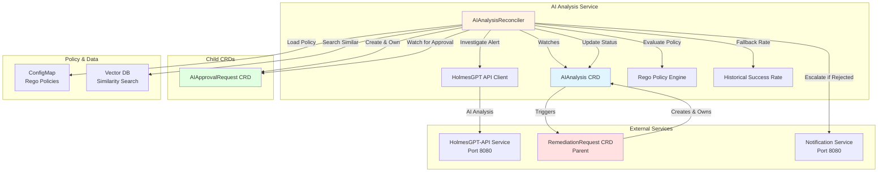
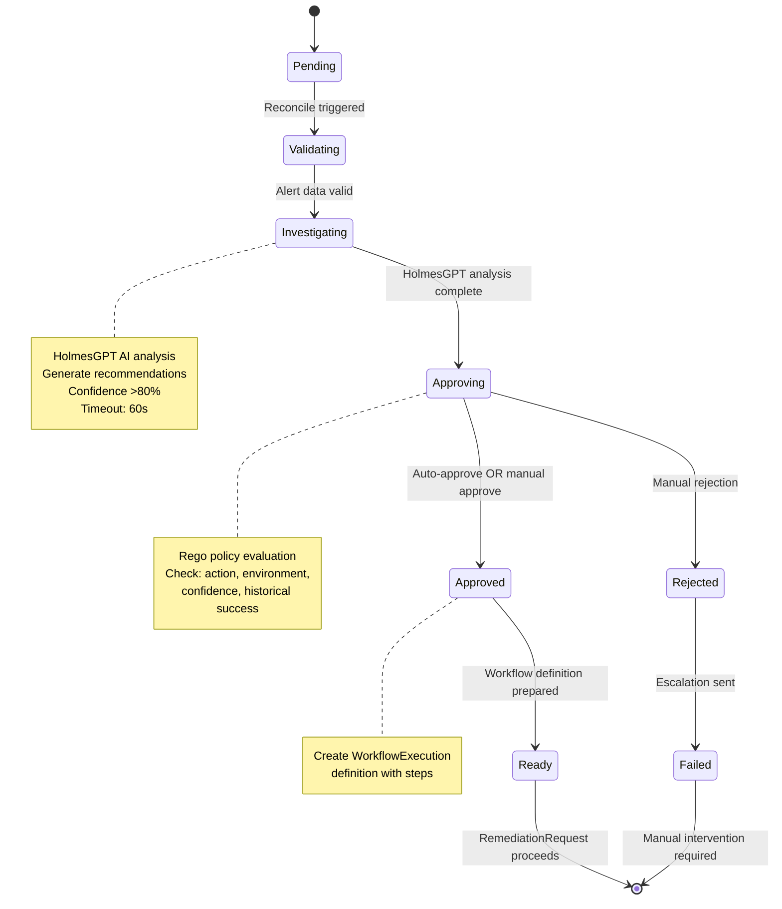

## Overview

**Purpose**: HolmesGPT-powered alert investigation, root cause analysis, and remediation recommendation generation.

**Core Responsibilities**:
1. Trigger HolmesGPT investigation for enriched alerts (BR-AI-011)
2. Perform contextual AI analysis of Kubernetes state (BR-AI-001)
3. Identify root cause candidates with supporting evidence (BR-AI-012)
4. Generate ranked remediation recommendations (BR-AI-006, BR-AI-007)
5. Validate AI responses and detect hallucinations (BR-AI-021, BR-AI-023)
6. Create WorkflowExecution CRD for approved recommendations


**V1 Scope - HolmesGPT Only**:
- Single AI provider: HolmesGPT (port 8080)
- No multi-model orchestration
- No LLM fallback chains
- Focus on investigation and recommendation

**Future V2 Enhancements** (Out of Scope):
- Multi-provider AI support (OpenAI, Anthropic, etc.)
- Ensemble decision-making across models
- Advanced provider routing and fallback

---

## 📊 Visual Architecture

### Architecture Diagram


### Sequence Diagram - Approval Workflow
```mermaid
sequenceDiagram
    participant AR as RemediationRequest
    participant AIA as AIAnalysis CRD
    participant Ctrl as AIAnalysis<br/>Reconciler
    participant HG as HolmesGPT-API
    participant Rego as Rego Engine
    participant App as AIApprovalRequest<br/>CRD
    participant Not as Notification<br/>Service

    AR->>AIA: Create AIAnalysis CRD
    activate AIA
    AIA-->>Ctrl: Watch triggers reconciliation
    activate Ctrl

    Note over Ctrl: Phase: Investigating
    Ctrl->>HG: POST /api/v1/investigate<br/>(alert + context)
    activate HG
    HG-->>Ctrl: Return analysis + recommendations<br/>(confidence >80%)
    deactivate HG

    Note over Ctrl: Phase: Approving
    Ctrl->>Rego: Evaluate approval policy<br/>(action, environment, confidence)

    alt Auto-Approve (non-production, high confidence)
        Rego-->>Ctrl: AUTO_APPROVE
        Ctrl->>AIA: Status.ApprovalStatus = "Approved"
        Note over AIA: Skip to Ready
    else Manual Approval Required
        Rego-->>Ctrl: MANUAL_APPROVAL_REQUIRED
        Ctrl->>App: Create AIApprovalRequest CRD
        activate App
        Ctrl-->>App: Watch for approval decision

        alt Approved by Operator
            App->>App: Status.Decision = "Approved"
            App-->>Ctrl: Watch triggers reconciliation
            Ctrl->>AIA: Status.ApprovalStatus = "Approved"
            deactivate App
        else Rejected by Operator
            App->>App: Status.Decision = "Rejected"
            App-->>Ctrl: Watch triggers reconciliation
            Ctrl->>Not: Send escalation notification
            Ctrl->>AIA: Status.ApprovalStatus = "Rejected"
            deactivate App
        end
    end

    Note over Ctrl: Phase: Ready
    Ctrl->>AIA: Status.Phase = "Ready"
    deactivate Ctrl
    AIA-->>AR: Status change triggers parent
    deactivate AIA

    Note over AR: Create WorkflowExecution CRD
```

### State Machine - Reconciliation Phases


---

## Owner Reference Architecture

**📚 Complete Architecture**: See [Owner Reference Architecture](../../../architecture/decisions/005-owner-reference-architecture.md) for comprehensive ownership hierarchy documentation.

### **AIAnalysis Ownership** (Centralized Orchestration)

**Owned By**: RemediationRequest (root CRD - central orchestrator)
**Creates**: Nothing (RemediationRequest creates next CRDs)

```
                RemediationRequest (root - central orchestrator)
                        │
        ┌───────────────┼───────────────┬───────────────┬───────────────┐
        │ (owns)        │ (owns)        │ (owns)        │ (owns)        │ (owns)
        ▼               ▼               ▼               ▼               ▼
  RemediationProcessing  AIAnalysis  WorkflowExecution  KubernetesExecution  AIApprovalRequest
   (Sibling 1)     (Sibling 2)    (Sibling 3)        (Sibling 4)       (Optional)
                       ▲
                       │
                  This service
```

### **Owner Reference Implementation**

```go
// AIAnalysis is created by RemediationRequest controller with owner reference
aiAnalysis := &aianalysisv1.AIAnalysis{
    ObjectMeta: metav1.ObjectMeta{
        Name:      fmt.Sprintf("%s-ai", remediation.Name),
        Namespace: remediation.Namespace,
        OwnerReferences: []metav1.OwnerReference{
            *metav1.NewControllerRef(remediation, remediationv1.GroupVersion.WithKind("RemediationRequest")),
        },
    },
    Spec: aianalysisv1.AIAnalysisSpec{
        // ... spec fields ...
    },
}
```

### **AIAnalysis Controller Responsibilities**

**What AIAnalysis Controller Does**:
- ✅ Process AI analysis using HolmesGPT
- ✅ Generate remediation recommendations
- ✅ Update status.phase to "completed"

**What AIAnalysis Controller Does NOT Do**:
- ❌ Create WorkflowExecution (RemediationRequest does this)
- ❌ Create AIApprovalRequest (RemediationRequest does this)
- ❌ Know about other services (decoupled design)

### **Cascade Deletion Behavior**

- ✅ **When RemediationRequest is deleted**: AIAnalysis is automatically deleted by Kubernetes (along with all sibling CRDs)
- ✅ **Parallel Deletion**: All service CRDs deleted simultaneously (flat hierarchy benefit)
- ✅ **No orphaned resources**: Simple 2-level ownership ensures complete cleanup

### **Key Architectural Points**

1. **All Service CRDs are Siblings**
   - RemediationProcessing, AIAnalysis, WorkflowExecution, KubernetesExecution, AIApprovalRequest
   - All owned by RemediationRequest (level 2)
   - No nested ownership chains

2. **Centralized Orchestration**
   - RemediationRequest watches AIAnalysis.status.phase
   - When "completed", RemediationRequest creates WorkflowExecution
   - AIAnalysis controller has NO knowledge of WorkflowExecution

3. **No Circular Dependencies** (Impossible with 2-Level Design)
   - RemediationRequest → AIAnalysis → (none) ✅
   - Maximum depth: 2 levels
   - Simple and predictable

4. **Finalizer for Cleanup**
   - AIAnalysis controller can implement finalizer for external resource cleanup (e.g., HolmesGPT session cleanup)
   - Finalizer runs before Kubernetes cascade deletion
   - See [Owner Reference Architecture](../../../architecture/decisions/005-owner-reference-architecture.md) for finalizer pattern

---

## Business Requirements Coverage

**AIAnalysis** implements AI-powered investigation and root cause analysis for Kubernetes alerts:

### V1 Scope: HolmesGPT Analysis (BR-AI-001 to BR-AI-050)

**Range**: BR-AI-001 to BR-AI-180
**V1 Active**: BR-AI-001 to BR-AI-050 (40+ BRs)
**V2 Reserved**: BR-AI-051 to BR-AI-180 (multi-provider AI, ensemble decision-making)

**V1 Business Requirements Breakdown**:

#### AI Investigation & Analysis (BR-AI-001 to BR-AI-025)
**Count**: ~25 BRs
**Focus**: HolmesGPT-powered alert investigation, root cause identification, and contextual analysis

**Primary Functions**:
- Trigger HolmesGPT investigation for enriched alerts (BR-AI-011)
- Perform contextual AI analysis of Kubernetes state (BR-AI-001)
- Identify root cause candidates with supporting evidence (BR-AI-012)
- AI response validation and hallucination detection (BR-AI-021, BR-AI-023)
- Evidence collection and correlation
- Historical pattern matching

#### Remediation Recommendations (BR-AI-026 to BR-AI-040)
**Count**: ~15 BRs
**Focus**: AI-generated remediation recommendations with ranking and validation

**Primary Functions**:
- Generate ranked remediation recommendations (BR-AI-006, BR-AI-007)
- Validate recommendation safety and feasibility
- Risk assessment for proposed actions
- Success probability estimation
- Historical success rate integration
- Recommendation prioritization

#### Approval & Workflow Creation (BR-AI-041 to BR-AI-050)
**Count**: ~5 BRs
**Focus**: Human-in-the-loop approval and WorkflowExecution CRD creation

**Primary Functions**:
- Create WorkflowExecution CRD for approved recommendations
- Handle approval workflows (auto-approval, manual approval, timeout)
- Rego policy evaluation for approval decisions
- Approval notification and escalation
- Workflow status tracking

### V2 Expansion (BR-AI-051 to BR-AI-180)

**Reserved for Future**:
- Multi-provider AI support (OpenAI, Anthropic, Claude, etc.)
- Ensemble decision-making across multiple AI models
- Advanced provider routing and fallback chains
- Model-specific optimization strategies
- Cross-model consensus building
- Adaptive model selection based on alert type

---

## Service Configuration

### Port Configuration
- **Port 9090**: Metrics endpoint
- **Port 8080**: Health probes (follows kube-apiserver pattern)
- **Endpoint**: `/metrics`
- **Format**: Prometheus text format
- **Authentication**: Kubernetes TokenReviewer API (validates ServiceAccount tokens)
  - **See**: [METRICS_AUTHENTICATION.md](../METRICS_AUTHENTICATION.md) for complete implementation examples

### ServiceAccount
- **Name**: `ai-analysis-sa`
- **Namespace**: `kubernaut-system`
- **Purpose**: Controller authentication and authorization

### Notes
- CRD controllers do not expose REST APIs
- Health checks (`/healthz`, `/readyz`) are for Kubernetes liveness/readiness probes
- Metrics endpoint requires valid Kubernetes ServiceAccount token

---

## Summary

**Service**: AI Analysis Service
**Package**: `pkg/ai/analysis/` (idiomatic Go, nested under existing AI ecosystem)
**CRD**: AIAnalysis (aianalysis.kubernaut.io/v1)
**Controller**: AIAnalysisReconciler
**Phases**: investigating → analyzing → recommending → completed
**Integration**: HolmesGPT-API (8080), Data Storage (8080)
**Testing**: Fake K8s client, 70% unit / 20% integration / 10% e2e
**Metrics**: Prometheus (investigation, analysis, recommendation metrics)
**Audit**: Dual system (CRD 24h + Database permanent)

**Migration**: 23,468 lines of existing AI code to reuse
**Effort**: 1 week implementation
**Priority**: P0 - HIGH (critical path for alert remediation)

