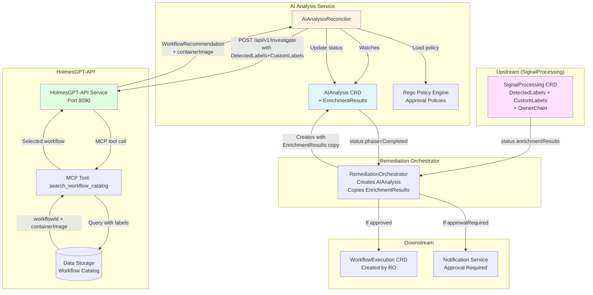

# AI Analysis Service - Overview

**Version**: v2.0
**Last Updated**: 2025-11-30
**Status**: ✅ Design Complete (V1.0 scope)

---

## Changelog

| Version | Date | Changes | Reference |
|---------|------|---------|-----------|
| v2.0 | 2025-11-30 | **REGENERATED**: Complete rewrite for V1.0 scope; Fixed RemediationProcessing→SignalProcessing; Added DetectedLabels/CustomLabels/OwnerChain; Removed "Approving" phase; Updated ports per DD-TEST-001 | DD-WORKFLOW-001 v1.8, DD-RECOVERY-002 |
| v1.1 | 2025-10-20 | Added V1.0 approval notification integration | ADR-018 |
| v1.0 | 2025-10-15 | Initial design specification | - |

---

## Purpose

**HolmesGPT-powered AI investigation, root cause analysis, and workflow selection** from the predefined workflow catalog.

**Core Responsibilities**:
1. **Receive enrichment data from SignalProcessing** (via Remediation Orchestrator)
2. **Call HolmesGPT-API** for investigation and workflow recommendation
3. **Evaluate Rego approval policies** for automated vs. manual approval
4. **Track recovery attempts** with historical context for learning
5. **Provide structured output** for WorkflowExecution creation

---

## V1.0 Scope

### What AIAnalysis DOES (V1.0)

| Capability | Description | Reference |
|------------|-------------|-----------|
| **HolmesGPT Integration** | Single AI provider via HolmesGPT-API service | BR-AI-001, BR-HAPI-001 |
| **Workflow Selection** | Select from predefined workflow catalog via MCP tool | BR-AI-075, BR-HAPI-250 |
| **Rego Approval Policies** | Auto-approve or flag for manual review | BR-AI-028 |
| **Recovery Flow** | Track previous execution attempts, pass failure context | BR-AI-080-083 |
| **DetectedLabels/CustomLabels** | Pass through to HolmesGPT-API for workflow filtering | DD-WORKFLOW-001 v1.8 |

### What AIAnalysis Does NOT Do (V1.0)

| Excluded Capability | Reason | Deferred To |
|---------------------|--------|-------------|
| Multi-provider AI (OpenAI, Anthropic) | HolmesGPT-API only for V1.0 | V2.0+ |
| Dynamic workflow generation | Predefined catalog selection only | V2.0+ |
| Circular dependency detection (Kahn's algorithm) | Not needed for predefined workflows | V2.0+ |
| "Approving" phase | RO handles approval notification in V1.0 | V1.1 (RemediationApprovalRequest CRD) |

---

## Architecture Diagram (V1.0)



---

## Phase Transitions (V1.0)

```
Pending → Investigating → Analyzing → Completed
    ↓          ↓              ↓            ↓
(initial)  (HolmesGPT)    (Rego eval)  (terminal)
```

### Phase Breakdown

| Phase | Duration | Actions | Transition Criteria |
|-------|----------|---------|---------------------|
| **Pending** | <1s | Validation, finalizer setup | Spec valid → Investigating |
| **Investigating** | ≤60s | Call HolmesGPT-API, receive workflow recommendation | Response received → Analyzing |
| **Analyzing** | ≤5s | Evaluate Rego approval policies, validate workflow exists | Policy evaluated → Completed |
| **Completed** | Terminal | Update status with selectedWorkflow, approvalRequired flag | RO watches for completion |

### V1.0 Approval Flow

**No "Approving" Phase in V1.0**: The AIAnalysis controller sets `status.approvalRequired = true` and immediately transitions to Completed. The Remediation Orchestrator (RO) is responsible for:
1. Watching `AIAnalysis.status.phase == "Completed"`
2. Checking `status.approvalRequired`
3. If `true`: Creating notification (Slack/Console) for operators
4. If `false`: Creating WorkflowExecution CRD

**V1.1 Enhancement**: `RemediationApprovalRequest` CRD will introduce explicit approval workflow.

---

## Input Contract (from SignalProcessing via RO)

### EnrichmentResults (Copied to AIAnalysis.spec)

```yaml
spec:
  enrichmentResults:
    kubernetesContext:
      namespace: "production"
      resourceKind: "Deployment"
      resourceName: "payment-api"
      # ... PodDetails, NodeDetails, etc.

    # Auto-detected labels (NO CONFIG NEEDED)
    detectedLabels:
      gitOpsTool: "argocd"       # or "flux", "" if none
      pdbProtected: true
      statefulWorkload: false
      hpaEnabled: true
      resourceQuotaConstrained: false

    # Customer-defined labels (via Rego policies in SignalProcessing)
    customLabels:
      constraint:
        - "cost-constrained"
        - "stateful-safe"
      team:
        - "name=payments"
      region:
        - "name=us-west-2"

    # K8s ownership chain (for DetectedLabels validation)
    ownerChain:
      - namespace: "production"
        kind: "ReplicaSet"
        name: "payment-api-7d8f9c6b5"
      - namespace: "production"
        kind: "Deployment"
        name: "payment-api"

    # NOTE: enrichmentQuality REMOVED (Dec 2025)
```

### Recovery Attempts (for Failed Workflow Recovery)

```yaml
spec:
  isRecoveryAttempt: true
  recoveryAttemptNumber: 2
  previousExecutions:
    - workflowId: "wf-oom-restart-v1"
      containerImage: "ghcr.io/kubernaut/workflows/oom-restart:v1.2.0"
      failureReason: "Pod evicted during restart - node pressure"
      failurePhase: "execution"
      kubernetesReason: "Evicted"
      attemptNumber: 1
      executedAt: "2025-11-30T10:15:00Z"
```

---

## Output Contract (to RO)

### Selected Workflow (status.selectedWorkflow)

```yaml
status:
  phase: "Completed"

  selectedWorkflow:
    workflowId: "wf-memory-increase-v2"
    containerImage: "ghcr.io/kubernaut/workflows/memory-increase:v2.1.0"
    parameters:
      targetDeployment: "payment-api"
      memoryIncrease: "512Mi"
      namespace: "production"
    confidence: 0.87
    reasoning: "Historical success rate 92% for similar OOM scenarios"

  # V1.0: RO handles notification, not AIAnalysis
  approvalRequired: true
  approvalReason: "Confidence below 80% threshold (87% < 80%)"

  investigationSummary: "OOMKilled due to memory leak in payment processing"
```

---

## Service Configuration

### Ports (per [DD-TEST-001](../../../architecture/decisions/DD-TEST-001-port-allocation-strategy.md))

| Port | Purpose | Endpoint | Auth |
|------|---------|----------|------|
| **8081** | Health probes | `/healthz`, `/readyz` | None (K8s probes) |
| **9090** | Prometheus metrics | `/metrics` | Network Policy |
| **8084** | Kind host port | extraPortMappings | E2E testing only |

### External Dependencies

| Service | Port | Purpose |
|---------|------|---------|
| HolmesGPT-API | 8090 | AI investigation, workflow selection |
| Data Storage | 8085 | Workflow catalog (via MCP) |

---

## Owner Reference Architecture

**Owned By**: RemediationRequest (via Remediation Orchestrator)
**Creates**: Nothing (RO creates WorkflowExecution)

```
RemediationRequest (root orchestrator)
        │
        ├── SignalProcessing (sibling 1)
        ├── AIAnalysis (sibling 2) ← This service
        └── WorkflowExecution (sibling 3, created after AIAnalysis completes)
```

### Cascade Deletion

- ✅ When RemediationRequest deleted → AIAnalysis auto-deleted
- ✅ Flat hierarchy (2 levels) → Simple cleanup
- ✅ No orphaned resources

---

## Business Requirements Coverage (V1.0)

**Total V1.0 BRs**: 31 (see [BR_MAPPING.md](./BR_MAPPING.md))

| Category | Count | Key BRs |
|----------|-------|---------|
| **Investigation & Analysis** | 12 | BR-AI-001 to BR-AI-023 |
| **Workflow Selection** | 2 | BR-AI-075, BR-AI-076 |
| **Approval Policies** | 4 | BR-AI-028 to BR-AI-030 |
| **Recovery Flow** | 4 | BR-AI-080 to BR-AI-083 |
| **HolmesGPT-API Integration** | 5 | BR-HAPI-250 to BR-HAPI-252 |
| **Validation & Hallucination** | 4 | BR-AI-023 (catalog validation) |

---

## Related Documents

| Document | Purpose |
|----------|---------|
| [CRD Schema](./crd-schema.md) | Type definitions, validation |
| [Controller Implementation](./controller-implementation.md) | Reconciler logic |
| [Reconciliation Phases](./reconciliation-phases.md) | Phase details |
| [Rego Policy Examples](./REGO_POLICY_EXAMPLES.md) | Approval policy input schema |
| [BR Mapping](./BR_MAPPING.md) | Business requirements |
| [DD-WORKFLOW-001](../../../architecture/decisions/DD-WORKFLOW-001-mandatory-label-schema.md) | Label schema (authoritative) |
| [DD-RECOVERY-002](../../../architecture/decisions/DD-RECOVERY-002-direct-aianalysis-recovery-flow.md) | Recovery flow design |

---

## Summary

| Aspect | Value |
|--------|-------|
| **Service** | AI Analysis Controller |
| **CRD** | `aianalysis.kubernaut.ai/v1alpha1` |
| **Package** | `internal/controller/aianalysis/` |
| **Phases** | Pending → Investigating → Analyzing → Completed |
| **Health Port** | 8081 (`/healthz`, `/readyz`) |
| **Metrics Port** | 9090 (`/metrics`) |
| **Testing** | 70% unit / 20% integration / 10% E2E |
| **Priority** | P0 - HIGH (critical path for remediation) |
