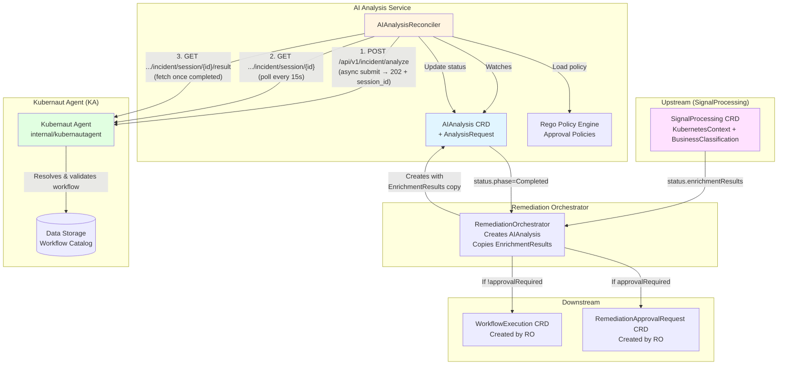

# AI Analysis Service - Overview

**Version**: v3.0
**Last Updated**: 2026-08-02
**Status**: ✅ Design Complete (V1.0 scope) — Corrected for [#1806](https://github.com/jordigilh/kubernaut/issues/1806)

---

## Changelog

| Version | Date | Changes | Reference |
|---------|------|---------|-----------|
| v3.0 | 2026-08-02 | **#1806 CORRECTION**: Full rewrite. Replaced the synchronous "single HTTP call to HolmesGPT-API" architecture with the real async submit/poll/result session model against Kubernaut Agent (KA); fixed the Go client package reference (`pkg/agentclient`, not `pkg/clients/holmesgpt/`); corrected the Input Contract (`DetectedLabels`/`CustomLabels`/`OwnerChain` are NOT part of `spec.analysisRequest` — `DetectedLabels` are KA-computed *after* RCA and returned as an output in `status.postRCAContext`, per ADR-056); removed the recovery-attempt input fields (`isRecoveryAttempt`/`previousExecutions` do not exist on the current CRD spec — recovery-via-resubmission was deprecated, Issue #180); corrected the Output Contract to match `RootCauseAnalysis`/`RemediationTarget`/`SelectedWorkflow` (`WorkflowSnapshot`-embedded, no bare `containerImage` field); replaced `AIApprovalRequest` (never implemented) with the real `RemediationApprovalRequest` CRD | #1806, ADR-056, BR-AA-KA-064 |
| v2.0 | 2025-11-30 | **REGENERATED**: Complete rewrite for V1.0 scope; Fixed RemediationProcessing→SignalProcessing; Added DetectedLabels/CustomLabels/OwnerChain; Removed "Approving" phase; Updated ports per DD-TEST-001 | DD-WORKFLOW-001 v1.8, DD-RECOVERY-002 |
| v1.1 | 2025-10-20 | Added V1.0 approval notification integration | ADR-018 |
| v1.0 | 2025-10-15 | Initial design specification | - |

---

## Purpose

**Kubernaut Agent (KA)-powered AI investigation, root cause analysis, and workflow selection** from the predefined workflow catalog.

**Core Responsibilities**:
1. **Receive enrichment data from SignalProcessing** (via Remediation Orchestrator)
2. **Submit an investigation to Kubernaut Agent (KA)** asynchronously, then poll the session until it completes (BR-AA-KA-064)
3. **Evaluate Rego approval policies** for automated vs. manual approval
4. **Provide structured output** for WorkflowExecution creation

---

## V1.0 Scope

### What AIAnalysis DOES (V1.0)

| Capability | Description | Reference |
|------------|-------------|-----------|
| **Kubernaut Agent (KA) Integration** | Single AI provider, accessed via an async submit/poll/result session (not a single synchronous call) | BR-AI-001, BR-AA-KA-064 |
| **Workflow Selection** | Select from predefined workflow catalog; catalog resolution happens inside KA | BR-AI-075, BR-KA-250 |
| **Rego Approval Policies** | Auto-approve or flag for manual review | BR-AI-028 |
| **Interactive Takeover** | A human operator can take over an in-progress session via MCP (`user_driving` state); the 25-minute session cap still applies | DD-INTERACTIVE-002, BR-INTERACTIVE-001 |

### What AIAnalysis Does NOT Do (V1.0)

| Excluded Capability | Reason | Deferred To |
|---------------------|--------|-------------|
| Multi-provider AI (OpenAI, Anthropic) | Kubernaut Agent (KA) only for V1.0 | V2.0+ |
| Dynamic workflow generation | Predefined catalog selection only | V2.0+ |
| Circular dependency detection (Kahn's algorithm) | Not needed for predefined workflows | V2.0+ |
| "Approving" phase | RO creates a `RemediationApprovalRequest` CRD directly from `AIAnalysis.status.approvalRequired` — there is no separate Approving phase inside AIAnalysis | N/A (already implemented via RO, not deferred) |
| Recovery-via-resubmission (`isRecoveryAttempt`/`previousExecutions` on the AIAnalysis spec) | Deprecated and removed from the CRD (Issue #180) | N/A |

---

## Architecture Diagram (V1.0)


```mermaid
graph TB
    subgraph "AI Analysis Service"
        AIA[AIAnalysis CRD<br/>+ AnalysisRequest]
        Controller[AIAnalysisReconciler]
        RegoEngine[Rego Policy Engine<br/>Approval Policies]
    end

    subgraph "Upstream (SignalProcessing)"
        SP[SignalProcessing CRD<br/>KubernetesContext + BusinessClassification]
    end

    subgraph "Remediation Orchestrator"
        RO[RemediationOrchestrator<br/>Creates AIAnalysis<br/>Copies EnrichmentResults]
    end

    subgraph "Kubernaut Agent (KA)"
        KA[Kubernaut Agent<br/>internal/kubernautagent]
        DataStorage[(Data Storage<br/>Workflow Catalog)]
    end

    subgraph "Downstream"
        WE[WorkflowExecution CRD<br/>Created by RO]
        ARQ[RemediationApprovalRequest CRD<br/>Created by RO]
    end

    SP -->|"status.enrichmentResults"| RO
    RO -->|"Creates with<br/>EnrichmentResults copy"| AIA
    Controller -->|Watches| AIA
    Controller -->|"1. POST /api/v1/incident/analyze<br/>(async submit → 202 + session_id)"| KA
    Controller -->|"2. GET .../incident/session/{id}<br/>(poll every 15s)"| KA
    Controller -->|"3. GET .../incident/session/{id}/result<br/>(fetch once completed)"| KA
    KA -->|"Resolves & validates workflow"| DataStorage
    Controller -->|"Load policy"| RegoEngine
    Controller -->|"Update status"| AIA
    AIA -->|"status.phase=Completed"| RO
    RO -->|"If !approvalRequired"| WE
    RO -->|"If approvalRequired"| ARQ

    style AIA fill:#e1f5ff
    style Controller fill:#fff4e1
    style SP fill:#ffe1ff
    style KA fill:#e1ffe1
```

---

## Phase Transitions (V1.0)

```
Pending → Investigating → Analyzing → Completed
    ↓          ↓              ↓            ↓
(initial)  (async KA session   (Rego eval)  (terminal)
            submit/poll/result;
            ≤25 min wall-clock cap)
```

### Phase Breakdown

| Phase | Duration | Actions | Transition Criteria |
|-------|----------|---------|---------------------|
| **Pending** | <1s | Validation, finalizer setup | Spec valid → Investigating |
| **Investigating** | Async; wall-clock cap 25 min (`DefaultMaxInvestigationDuration`) | Submit investigation to Kubernaut Agent (KA), poll session every 15s (`DefaultSessionPollInterval`), fetch result once the session completes | Session `completed` → Analyzing; session `failed`/cancelled or 25-min cap exceeded → Failed |
| **Analyzing** | ≤5s | Evaluate Rego approval policies, validate workflow exists | Policy evaluated → Completed |
| **Completed** | Terminal | Update status with `selectedWorkflow`, `approvalRequired` flag | RO watches for completion |

### V1.0 Approval Flow

**No "Approving" Phase in V1.0**: The AIAnalysis controller sets `status.approvalRequired = true` during the Analyzing phase and immediately transitions to Completed. The Remediation Orchestrator (RO) is responsible for:
1. Watching `AIAnalysis.status.phase == "Completed"`
2. Checking `status.approvalRequired`
3. If `true`: Creating a `RemediationApprovalRequest` CRD for operator approval
4. If `false`: Creating a `WorkflowExecution` CRD directly

`RemediationApprovalRequest` (`api/remediation/v1alpha1/remediationapprovalrequest_types.go`) is already implemented and created by the Remediation Orchestrator — it is not a deferred V1.1 feature, and `AIApprovalRequest` was never implemented under that name.

---

## Input Contract (from SignalProcessing via RO)

### AnalysisRequest (AIAnalysis.spec.analysisRequest)

```yaml
spec:
  analysisRequest:
    signalContext:
      fingerprint: "a1b2c3d4..."
      severity: "critical"          # critical|high|warning|info|unknown
      signalName: "OOMKilled"
      environment: "production"
      businessPriority: "P1"
      targetResource:
        kind: "Pod"
        name: "payment-api-7d8f9c6b5-abcde"
        namespace: "production"

      # Complete enrichment results from SignalProcessing
      enrichmentResults:
        kubernetesContext:
          namespace: "production"
          # ... PodDetails, NodeDetails, owner chain, etc.
        businessClassification:
          businessUnit: "payments"
          criticality: "Critical"
          slaRequirement: "Gold"

    analysisTypes:
      - Investigation
      - RootCause
      - WorkflowSelection
```

> **Corrected (#1806)**: `DetectedLabels`, `CustomLabels`, and `OwnerChain` are **not** part of `enrichmentResults` — `sharedtypes.EnrichmentResults` only has `KubernetesContext` and `BusinessClassification` (see `pkg/shared/types/enrichment.go`). `DetectedLabels` are computed by Kubernaut Agent's `LabelDetector` **after** root cause analysis and returned as part of the KA response; AIAnalysis stores them as an **output** in `status.postRCAContext.detectedLabels` (ADR-056), not as investigation input.

### Recovery Attempts

`spec.isRecoveryAttempt` / `spec.recoveryAttemptNumber` / `spec.previousExecutions` do **not** exist on the current `AIAnalysisSpec` (see `api/aianalysis/v1alpha1/aianalysis_types.go`). Recovery-via-resubmission with an explicit previous-execution history was deprecated (Issue #180) and removed from the CRD; do not reference this input shape in new integrations.

---

## Output Contract (to RO)

### Root Cause + Selected Workflow (status)

```yaml
status:
  phase: "Completed"
  reason: "AnalysisCompleted"

  rootCauseAnalysis:
    summary: "OOMKilled due to memory leak in payment processing"
    severity: "high"
    signalType: "OOMKilled"
    # RemediationTarget: the resource the LLM determined should actually be
    # remediated, which may differ from spec.analysisRequest.signalContext.targetResource
    # (e.g. signal from a Pod, but the owning Deployment should be patched). BR-KA-212.
    remediationTarget:
      kind: "Deployment"
      name: "payment-api"
      namespace: "production"

  selectedWorkflow:
    workflowId: "wf-memory-increase-v2"
    workflowName: "memory-increase"
    actionType: "ScaleReplicas"
    version: "2.1.0"
    executionBundle: "ghcr.io/kubernaut/workflows/memory-increase@sha256:abcd1234..."
    confidence: 0.72
    parameters:
      TARGET_DEPLOYMENT: "payment-api"
      MEMORY_INCREASE: "512Mi"
    rationale: "Historical success rate 92% for similar OOM scenarios"

  # V1.0: RO handles notification/approval-CRD creation, not AIAnalysis
  approvalRequired: true
  approvalReason: "Confidence below 80% threshold (72% < 80%)"

  # Async session tracking (BR-AA-KA-064)
  investigationSession:
    id: "sess-abc123"
    generation: 0
    pollCount: 8
```

> **Corrected (#1806)**: `SelectedWorkflow` embeds a catalog-resolved `WorkflowSnapshot` (`workflowId`, `workflowName`, `actionType`, `version`, `executionBundle`, ...) — there is no bare `containerImage` field; the OCI reference lives in `executionBundle` (digest-pinned). `RemediationTarget` is nested under `status.rootCauseAnalysis`, not a top-level `AffectedResource`.

---

## Service Configuration

### Ports (per [DD-TEST-001](../../../architecture/decisions/DD-TEST-001-port-allocation-strategy.md))

| Port | Purpose | Endpoint | Auth |
|------|---------|----------|------|
| **8081** | Health probes | `/healthz`, `/readyz` | None (K8s probes) |
| **9090** | Prometheus metrics | `/metrics` | Network Policy |
| **8084** | Kind host port | extraPortMappings | E2E testing only |

### External Dependencies

| Service | Port | Purpose |
|---------|------|---------|
| Kubernaut Agent (KA) | 8088 | AI investigation, root cause analysis, workflow selection (async submit/poll/result) |
| Data Storage | 8085 | Workflow catalog (resolved internally by KA) |

---

## Owner Reference Architecture

**Owned By**: RemediationRequest (via Remediation Orchestrator)
**Creates**: Nothing (RO creates WorkflowExecution / RemediationApprovalRequest)

```
RemediationRequest (root orchestrator)
        │
        ├── SignalProcessing (sibling 1)
        ├── AIAnalysis (sibling 2) ← This service
        └── WorkflowExecution (sibling 3, created after AIAnalysis completes)
```

### Cascade Deletion

- ✅ When RemediationRequest deleted → AIAnalysis auto-deleted
- ✅ Flat hierarchy (2 levels) → Simple cleanup
- ✅ No orphaned resources

---

## Business Requirements Coverage (V1.0)

**Total V1.0 BRs**: 31 (see [BR_MAPPING.md](./BR_MAPPING.md))

| Category | Count | Key BRs |
|----------|-------|---------|
| **Investigation & Analysis** | 12 | BR-AI-001 to BR-AI-023 |
| **Workflow Selection** | 2 | BR-AI-075, BR-AI-076 |
| **Approval Policies** | 4 | BR-AI-028 to BR-AI-030 |
| **Async Session Management** | 4 | BR-AA-KA-064 (submit/poll/result, session regeneration) |
| **Kubernaut Agent (KA) Integration** | 5 | BR-KA-250 to BR-HAPI-252 |
| **Validation & Hallucination** | 4 | BR-AI-023 (catalog validation) |

---

## Related Documents

| Document | Purpose |
|----------|---------|
| [CRD Schema](./crd-schema.md) | Type definitions, validation |
| [Controller Implementation](./controller-implementation.md) | Reconciler logic |
| [Reconciliation Phases](./reconciliation-phases.md) | Phase details |
| [Rego Policy Examples](./REGO_POLICY_EXAMPLES.md) | Approval policy input schema |
| [BR Mapping](./BR_MAPPING.md) | Business requirements |
| [DD-WORKFLOW-001](../../../architecture/decisions/DD-WORKFLOW-001-mandatory-label-schema.md) | Label schema (authoritative) |

---

## Summary

| Aspect | Value |
|--------|-------|
| **Service** | AI Analysis Controller |
| **CRD** | `kubernaut.ai/v1alpha1` |
| **Package** | `internal/controller/aianalysis/` (business logic in `pkg/aianalysis/`) |
| **Phases** | Pending → Investigating → Analyzing → Completed/Failed |
| **Health Port** | 8081 (`/healthz`, `/readyz`) |
| **Metrics Port** | 9090 (`/metrics`) |
| **Testing** | 70% unit / 20% integration / 10% E2E |
| **Priority** | P0 - HIGH (critical path for remediation) |
