## Testing Strategy

**Testing Framework Reference**: [.cursor/rules/03-testing-strategy.mdc](../../../.cursor/rules/03-testing-strategy.mdc)
**Summary Document**: [TESTING_STRATEGY_SUMMARY.md](../TESTING_STRATEGY_SUMMARY.md)

### Testing Pyramid

Following Kubernaut's defense-in-depth testing strategy:

| Test Type | Target Coverage | Focus | Confidence |
|-----------|----------------|-------|------------|
| **Unit Tests** | 70%+ | Controller logic, AI analysis phases, Rego policies | 85-90% |
| **Integration Tests** | >50% | CRD interactions, HolmesGPT API integration, approval workflows | 80-85% |
| **E2E Tests** | 10-15% | Complete investigation flow, real cluster scenarios | 90-95% |

**Rationale**: CRD controllers require high integration test coverage (>50%) to validate Kubernetes API interactions, CRD lifecycle management, HolmesGPT API integration, and watch-based coordination patterns that cannot be adequately tested in unit tests alone.

### Unit Tests (Primary Coverage Layer)

**Test Directory**: [test/unit/aianalysis/](../../../test/unit/aianalysis/)
**Coverage Target**: 72% (core AI/ML controller logic: Rego policies, confidence scoring, approval workflows, CRD reconciliation)
**Confidence**: 85-90%
**Execution**: `make test-unit-aianalysis`

**Testing Strategy**: Use fake K8s client for compile-time API safety. Mock ONLY HolmesGPT HTTP API. Use REAL business logic (Rego policy engine, approval workflow).

**AI/ML-Specific Test Patterns**:

```go
package aianalysis

import (
    . "github.com/onsi/ginkgo/v2"
    . "github.com/onsi/gomega"
    "context"
    "time"

    remediationv1 "github.com/jordigilh/kubernaut/api/remediation/v1"
    aianalysisv1 "github.com/jordigilh/kubernaut/api/aianalysis/v1"
    approvalv1 "github.com/jordigilh/kubernaut/api/approval/v1"
    "github.com/jordigilh/kubernaut/internal/controller"
    "github.com/jordigilh/kubernaut/pkg/ai/holmesgpt"
    "github.com/jordigilh/kubernaut/pkg/ai/rego"
    "github.com/jordigilh/kubernaut/pkg/testutil"
    "github.com/jordigilh/kubernaut/pkg/testutil/mocks"

    metav1 "k8s.io/apimachinery/pkg/apis/meta/v1"
    "k8s.io/apimachinery/pkg/runtime"
    "sigs.k8s.io/controller-runtime/pkg/client"
    "sigs.k8s.io/controller-runtime/pkg/client/fake"
)

var _ = Describe("BR-AI-010: AI Analysis Controller", func() {
    var (
        fakeK8sClient       client.Client
        scheme              *runtime.Scheme
        mockHolmesGPT       *mocks.MockHolmesGPT
        regoEngine          *rego.Engine      // REAL business logic
        reconciler          *controller.AIAnalysisReconciler
        ctx                 context.Context
    )

    BeforeEach(func() {
        ctx = context.Background()
        scheme = testutil.NewTestScheme()

        fakeK8sClient = fake.NewClientBuilder().
            WithScheme(scheme).
            WithStatusSubresource(&aianalysisv1.AIAnalysis{}).
            Build()

        // Mock ONLY external HolmesGPT API
        mockHolmesGPT = mocks.NewMockHolmesGPT()

        // Use REAL Rego policy engine
        regoEngine = rego.NewEngine(testutil.LoadTestRegoPolicy())

        reconciler = &controller.AIAnalysisReconciler{
            Client:       fakeK8sClient,
            Scheme:       scheme,
            HolmesGPT:    mockHolmesGPT,
            RegoEngine:   regoEngine,  // Real business logic
        }
    })

    Context("BR-AI-020: HolmesGPT Investigation Phase", func() {
        It("should investigate alert and generate recommendations with confidence scores", func() {
            // Setup test AIAnalysis CRD
            aia := &aianalysisv1.AIAnalysis{
                ObjectMeta: metav1.ObjectMeta{
                    Name:      "aia-test-oom",
                    Namespace: "default",
                },
                Spec: aianalysisv1.AIAnalysisSpec{
                    TargetingData: aianalysisv1.TargetingData{
                        Alert: aianalysisv1.Alert{
                            Fingerprint: "oom-webapp-prod",
                            Namespace:   "production",
                            Labels: map[string]string{
                                "alertname": "PodOOMKilled",
                            },
                        },
                    },
                    InvestigationTimeout: 60 * time.Second,
                },
            }

            Expect(fakeK8sClient.Create(ctx, aia)).To(Succeed())

            // Mock HolmesGPT response with deterministic AI recommendations
            mockHolmesGPT.On("Investigate", ctx, aia.Spec.TargetingData.Alert).Return(
                &holmesgpt.InvestigationResult{
                    RootCause: "Memory leak in webapp container due to unclosed database connections",
                    Recommendations: []holmesgpt.Recommendation{
                        {
                            Action:      "restart-pod",
                            Rationale:   "Immediate relief by restarting leaking pod",
                            Confidence:  0.92,
                            Priority:    1,
                        },
                        {
                            Action:      "increase-memory-limit",
                            Rationale:   "Prevent future OOMs while fixing leak",
                            Confidence:  0.85,
                            Priority:    2,
                        },
                        {
                            Action:      "gitops-pr-fix-leak",
                            Rationale:   "Long-term fix for database connection leak",
                            Confidence:  0.78,
                            Priority:    3,
                        },
                    },
                    ContextUsed: &holmesgpt.ContextMetadata{
                        TokensUsed:        1250,
                        ProcessingTime:    "3.2s",
                        ModelVersion:      "gpt-4o-2024-05-13",
                    },
                }, nil,
            )

            // Reconcile to trigger investigation
            result, err := reconciler.Reconcile(ctx, testutil.NewReconcileRequest(aia))
            Expect(err).ToNot(HaveOccurred())
            Expect(result.Requeue).To(BeFalse())

            // Verify AIAnalysis status updated with recommendations
            var updatedAIA aianalysisv1.AIAnalysis
            Expect(fakeK8sClient.Get(ctx, client.ObjectKeyFromObject(aia), &updatedAIA)).To(Succeed())

            Expect(updatedAIA.Status.Phase).To(Equal("Approving"))
            Expect(updatedAIA.Status.RootCause).To(ContainSubstring("Memory leak"))
            Expect(updatedAIA.Status.Recommendations).To(HaveLen(3))
            Expect(updatedAIA.Status.Recommendations[0].Confidence).To(BeNumerically(">", 0.90))
        })
    })

    Context("BR-AI-030: Rego Policy Evaluation for Auto-Approval", func() {
        DescribeTable("auto-approval policy decisions",
            func(environment string, action string, confidence float64, expectedDecision string) {
                // Create AIAnalysis with investigation complete
                aia := testutil.NewTestAIAnalysis("aia-policy-test")
                aia.Spec.TargetingData.Environment = environment
                aia.Status.Recommendations = []aianalysisv1.Recommendation{
                    {Action: action, Confidence: confidence},
                }
                Expect(fakeK8sClient.Create(ctx, aia)).To(Succeed())

                // Reconcile to trigger Rego policy evaluation
                result, err := reconciler.Reconcile(ctx, testutil.NewReconcileRequest(aia))
                Expect(err).ToNot(HaveOccurred())

                // Verify policy decision
                var updatedAIA aianalysisv1.AIAnalysis
                Expect(fakeK8sClient.Get(ctx, client.ObjectKeyFromObject(aia), &updatedAIA)).To(Succeed())
                Expect(updatedAIA.Status.ApprovalStatus).To(Equal(expectedDecision))
            },
            // Auto-approve cases
            Entry("non-prod + high confidence → auto-approve", "dev", "restart-pod", 0.92, "Approved"),
            Entry("non-prod + medium confidence → auto-approve", "staging", "scale-deployment", 0.85, "Approved"),

            // Manual approval cases
            Entry("prod + any action → manual", "production", "restart-pod", 0.95, "PendingApproval"),
            Entry("any env + low confidence → manual", "dev", "delete-pvc", 0.70, "PendingApproval"),
        )
    })

    Context("BR-AI-040: AIApprovalRequest CRD Creation for Manual Approval", func() {
        It("should create AIApprovalRequest CRD when manual approval required", func() {
            // Setup AIAnalysis requiring manual approval
            aia := testutil.NewTestAIAnalysis("aia-manual-approval")
            aia.Spec.TargetingData.Environment = "production"
            aia.Status.Phase = "Approving"
            aia.Status.Recommendations = []aianalysisv1.Recommendation{
                {Action: "restart-pod", Confidence: 0.92},
            }
            Expect(fakeK8sClient.Create(ctx, aia)).To(Succeed())

            // Reconcile to create AIApprovalRequest
            result, err := reconciler.Reconcile(ctx, testutil.NewReconcileRequest(aia))
            Expect(err).ToNot(HaveOccurred())

            // Verify AIApprovalRequest created with owner reference
            var approvalRequest approvalv1.AIApprovalRequest
            Expect(fakeK8sClient.Get(ctx, client.ObjectKey{
                Name:      "aia-manual-approval-approval",
                Namespace: "default",
            }, &approvalRequest)).To(Succeed())

            Expect(approvalRequest.OwnerReferences).To(HaveLen(1))
            Expect(approvalRequest.OwnerReferences[0].Name).To(Equal("aia-manual-approval"))
            Expect(approvalRequest.Spec.Recommendations).To(HaveLen(1))
        })
    })

    Context("BR-AI-050: AIApprovalRequest Watch for Approval Decision", func() {
        It("should transition to Ready when AIApprovalRequest approved", func() {
            // Create AIAnalysis + AIApprovalRequest
            aia := testutil.NewTestAIAnalysis("aia-watch-approval")
            aia.Status.Phase = "Approving"
            aia.Status.ApprovalStatus = "PendingApproval"
            Expect(fakeK8sClient.Create(ctx, aia)).To(Succeed())

            approvalRequest := &approvalv1.AIApprovalRequest{
                ObjectMeta: metav1.ObjectMeta{
                    Name:      "aia-watch-approval-approval",
                    Namespace: "default",
                    OwnerReferences: []metav1.OwnerReference{
                        {
                            APIVersion: aianalysisv1.GroupVersion.String(),
                            Kind:       "AIAnalysis",
                            Name:       "aia-watch-approval",
                            UID:        aia.UID,
                        },
                    },
                },
                Spec: approvalv1.AIApprovalRequestSpec{},
            }
            Expect(fakeK8sClient.Create(ctx, approvalRequest)).To(Succeed())

            // Simulate operator approval
            approvalRequest.Status.Decision = "Approved"
            approvalRequest.Status.ApprovedBy = "operator@example.com"
            approvalRequest.Status.ApprovedAt = metav1.Now()
            Expect(fakeK8sClient.Status().Update(ctx, approvalRequest)).To(Succeed())

            // Reconcile to process approval
            result, err := reconciler.Reconcile(ctx, testutil.NewReconcileRequest(aia))
            Expect(err).ToNot(HaveOccurred())

            // Verify AIAnalysis transitioned to Ready
            var updatedAIA aianalysisv1.AIAnalysis
            Expect(fakeK8sClient.Get(ctx, client.ObjectKeyFromObject(aia), &updatedAIA)).To(Succeed())
            Expect(updatedAIA.Status.Phase).To(Equal("Ready"))
            Expect(updatedAIA.Status.ApprovalStatus).To(Equal("Approved"))
        })
    })
})
```

---

### Integration Tests (Cross-Component Validation)

**Test Directory**: [test/integration/aianalysis/](../../../test/integration/aianalysis/)
**Coverage Target**: 20%
**Confidence**: 80-85%
**Execution**: `make test-integration-aianalysis`

**Focus Areas**:
- Real HolmesGPT API calls
- Rego ConfigMap loading from Kubernetes
- AIApprovalRequest CRD watch patterns

---

### E2E Tests (Complete Workflow Validation)

**Test Directory**: [test/e2e/scenarios/](../../../test/e2e/scenarios/)
**Coverage Target**: 10%
**Confidence**: 90-95%
**Execution**: `make test-e2e-aianalysis`

**Test Scenarios**:
1. Auto-approval flow: Investigation → auto-approve → WorkflowExecution creation
2. Manual approval flow: Investigation → pending → operator approval → WorkflowExecution
3. Rejection flow: Investigation → operator rejection → escalation notification

---

### Service-Specific Test Validation

**AI/ML Testing Challenges**:
- ✅ **Non-Deterministic AI**: Mock HolmesGPT with deterministic responses
- ✅ **Rego Policy Complexity**: Use real Rego engine with comprehensive test policies
- ✅ **Approval Workflow States**: Table-driven tests for state transitions
- ✅ **Confidence Thresholds**: Boundary testing (0.79, 0.80, 0.81)

**Unique Metrics to Validate**:
- Average recommendation confidence
- Auto-approval rate (target: 40-60%)
- HolmesGPT API latency (P95 <60s)

---

## 🎯 Test Level Selection: Maintainability First

**Principle**: Prioritize maintainability and simplicity when choosing between unit, integration, and e2e tests.

### Decision Framework

```mermaid
flowchart TD
    Start[New AI Test Scenario] --> Question1{Can test with<br/>simple mocks?<br/>&lt;20 lines setup}

    Question1 -->|Yes| Question2{Testing AI logic<br/>or infrastructure?}
    Question1 -->|No| Integration[Integration Test]

    Question2 -->|AI Logic| Question3{Test readable<br/>and maintainable?}
    Question2 -->|Infrastructure| Integration

    Question3 -->|Yes| Unit[Unit Test]
    Question3 -->|No| Integration

    Unit --> Validate1[✅ Use Unit Test]
    Integration --> Validate2{Complete AI<br/>workflow across<br/>services?}

    Validate2 -->|Yes| E2E[E2E Test]
    Validate2 -->|No| Validate3[✅ Use Integration Test]

    E2E --> Validate4[✅ Use E2E Test]

    style Unit fill:#90EE90
    style Integration fill:#87CEEB
    style E2E fill:#FFB6C1
```



### Test at Unit Level WHEN

- ✅ Scenario can be tested with **simple HolmesGPT mock** (deterministic AI responses)
- ✅ Focus is on **AI business logic** (Rego policy evaluation, confidence scoring, approval decisions)
- ✅ Setup is **straightforward** (< 20 lines of mock configuration)
- ✅ Test remains **readable and maintainable** with mocking

**AIAnalysis Unit Test Examples**:
- Rego policy evaluation (auto-approval vs manual-approval logic)
- Confidence score calculation and threshold enforcement
- Approval workflow state machine transitions
- HolmesGPT response parsing and validation
- Recommendation filtering and ranking

---

### Move to Integration Level WHEN

- ✅ Scenario requires **CRD watch-based coordination** (AIAnalysis → AIApprovalRequest creation)
- ✅ Validating **real HolmesGPT API behavior** (actual AI service integration)
- ✅ Unit test would require **excessive mocking** (>50 lines of approval workflow mocks)
- ✅ Integration test is **simpler to understand** and maintain
- ✅ Testing **real Rego policy engine** with complex policy files

**AIAnalysis Integration Test Examples**:
- Complete CRD reconciliation loop with real K8s API
- HolmesGPT API integration with real AI service (dev environment)
- **EnrichmentData consumption from RemediationProcessing (DD-001: Alternative 2 - BR-WF-RECOVERY-011)**:
  - 📋 **Design Decision**: [DD-001](../../../architecture/DESIGN_DECISIONS.md#dd-001-recovery-context-enrichment-alternative-2) - AIAnalysis reads from spec only
  - Verify AIAnalysis reads enrichment from `spec.enrichmentData` (NO API calls)
  - Validate all contexts available: monitoring + business + recovery (if recovery attempt)
  - Confirm fresh contexts for recovery attempts (not stale from initial attempt)
  - Test prompt enrichment with all available contexts
- Child CRD creation (AIAnalysis → AIApprovalRequest)
- Approval workflow coordination across multiple CRDs
- Status watch patterns and phase transitions in real cluster

---

### Move to E2E Level WHEN

- ✅ Testing **complete investigation-to-workflow journey** (Alert → AIAnalysis → WorkflowExecution)
- ✅ Validating **AI-driven remediation** with real HolmesGPT recommendations
- ✅ Lower-level tests **cannot reproduce AI behavior** (e.g., multi-turn AI conversations)

**AIAnalysis E2E Test Examples**:
- Complete AI investigation pipeline (end-to-end)
- AI-recommended workflow execution validation
- Manual approval escalation flows
- Production-like HolmesGPT failure scenarios (timeout → fallback → recovery)

---

## 🧭 Maintainability Decision Criteria

**Ask these 5 questions before implementing a unit test:**

### 1. Mock Complexity
**Question**: Will mock setup be >30 lines?
- ✅ **YES** → Consider integration test
- ❌ **NO** → Unit test acceptable

**AIAnalysis Example**:
```go
// ❌ COMPLEX: 60+ lines of approval workflow mock setup
mockApprovalWorkflow.On("CreateRequest", ...).Return(complexApprovalMock)
mockApprovalWorkflow.On("WatchStatus", ...).Return(complexWatchMock)
// ... 50+ more lines of state transition mocking
// BETTER: Integration test with real approval CRDs
```

---

### 2. Readability
**Question**: Would a new developer understand this test in 2 minutes?
- ✅ **YES** → Unit test is good
- ❌ **NO** → Consider higher test level

**AIAnalysis Example**:
```go
// ✅ READABLE: Clear AI policy test
It("should auto-approve high-confidence recommendations", func() {
    recommendations := []Recommendation{
        {Action: "restart-pod", Confidence: 0.95},
    }
    decision, err := regoEngine.Evaluate(recommendations)
    Expect(err).ToNot(HaveOccurred())
    Expect(decision.Outcome).To(Equal("auto-approve"))
})
```

---

### 3. Fragility
**Question**: Does test break when internal implementation changes?
- ✅ **YES** → Move to integration test (testing implementation, not behavior)
- ❌ **NO** → Unit test is appropriate

**AIAnalysis Example**:
```go
// ❌ FRAGILE: Breaks if we change internal AI call sequence
Expect(reconciler.holmesGPTCallCount).To(Equal(2))

// ✅ STABLE: Tests AI business behavior, not implementation
Expect(aia.Status.Phase).To(Equal("completed"))
Expect(aia.Status.Recommendations).To(HaveLen(3))
```

---

### 4. Real Value
**Question**: Is this testing AI logic or infrastructure interaction?
- **AI Logic** → Unit test
- **Infrastructure** → Integration test

**AIAnalysis Decision**:
- **Unit**: Rego policy evaluation, confidence scoring (AI logic)
- **Integration**: CRD approval workflow coordination (infrastructure)

---

### 5. Maintenance Cost
**Question**: How much effort to maintain this vs integration test?
- **Lower cost** → Choose that option

**AIAnalysis Example**:
- **Unit test with 80-line approval mock**: HIGH maintenance (breaks on workflow changes)
- **Integration test with real CRDs**: LOW maintenance (automatically adapts to CRD changes)

---

## 🎯 Realistic vs. Exhaustive Testing

**Principle**: Test realistic AI scenarios necessary to validate business requirements - not more, not less.

### AIAnalysis: Requirement-Driven Coverage

**Business Requirement Analysis** (BR-AI-010 to BR-AI-050):

| AI Dimension | Realistic Values | Test Strategy |
|---|---|---|
| **Recommendation Confidence** | 0.0-0.79, 0.80-0.89, 0.90-1.0 | Test distinct approval behaviors, not all decimals |
| **Action Types** | restart, scale, update, migrate | Test policy logic for each type |
| **Approval Decisions** | auto-approve, manual-approve, reject | Test Rego policy outcomes |
| **Investigation Depth** | quick, standard, deep | Test different HolmesGPT analysis levels |

**Total Possible Combinations**: 10 × 4 × 3 × 3 = 360 combinations
**Distinct Business Behaviors**: 15 behaviors (per BR-AI-010 to BR-AI-050)
**Tests Needed**: ~25 tests (covering 15 distinct behaviors with boundaries)

---

### ✅ DO: Test Distinct AI Behaviors Using DescribeTable

**BEST PRACTICE**: Use Ginkgo's `DescribeTable` for AI policy and confidence threshold testing.

```go
// ✅ GOOD: Tests distinct AI approval behaviors using data table
var _ = Describe("BR-AI-030: Rego Policy Evaluation", func() {
    DescribeTable("Approval decision based on confidence and action type",
        func(action string, confidence float64, environment string, expectedDecision string, expectedApproval string) {
            // Single test function handles all policy scenarios
            recommendations := []Recommendation{
                {Action: action, Confidence: confidence},
            }
            context := PolicyContext{Environment: environment}

            decision, err := regoEngine.Evaluate(recommendations, context)
            Expect(err).ToNot(HaveOccurred())
            Expect(decision.Outcome).To(Equal(expectedDecision))
            Expect(decision.ApprovalType).To(Equal(expectedApproval))
        },
        // BR-AI-030.1: High confidence + safe action + production → auto-approve
        Entry("high confidence restart in production → auto-approve",
            "restart-pod", 0.95, "production",
            "approved", "auto"),

        // BR-AI-030.2: High confidence + risky action + production → manual-approve
        Entry("high confidence migrate in production → manual-approve",
            "migrate-workload", 0.95, "production",
            "approved", "manual"),

        // BR-AI-030.3: Medium confidence + safe action + production → manual-approve
        Entry("medium confidence restart in production → manual-approve",
            "restart-pod", 0.85, "production",
            "approved", "manual"),

        // BR-AI-030.4: Low confidence + any action → reject
        Entry("low confidence recommendation → reject",
            "restart-pod", 0.75, "production",
            "rejected", "none"),

        // BR-AI-030.5: High confidence + any action + dev → auto-approve
        Entry("high confidence action in dev → auto-approve",
            "migrate-workload", 0.85, "dev",
            "approved", "auto"),

        // BR-AI-030.6: Boundary test at 0.80 confidence threshold
        Entry("confidence at threshold 0.80 → manual-approve",
            "restart-pod", 0.80, "production",
            "approved", "manual"),
    )
})
```

**Why DescribeTable is Better for AI Testing**:
- ✅ 6 policy scenarios in single function (vs. 6 separate It blocks)
- ✅ Change Rego policy logic once, all tests adapt
- ✅ Clear approval decision matrix visible
- ✅ Easy to add new action types or confidence thresholds
- ✅ Perfect for testing AI confidence boundaries

---

### ❌ DON'T: Test Redundant AI Combinations

```go
// ❌ BAD: Redundant confidence tests that validate SAME policy logic
It("should handle 0.90 confidence", func() {})
It("should handle 0.91 confidence", func() {})
It("should handle 0.92 confidence", func() {})
It("should handle 0.93 confidence", func() {})
It("should handle 0.94 confidence", func() {})
// All 5 tests validate SAME high-confidence approval logic
// BETTER: One test at boundary (0.90), one at typical (0.95)

// ❌ BAD: Exhaustive action type combinations
It("should handle restart-pod + production + 0.95 + auto", func() {})
It("should handle restart-pod + production + 0.95 + manual", func() {})
// ... 358 more combinations for every possible scenario
// These don't test DISTINCT Rego policy behaviors
```

---

### Decision Criteria: Is This AI Test Necessary?

Ask these 4 questions:

1. **Does this test validate a distinct Rego policy rule?**
   - ✅ YES: High confidence + safe action → auto-approve (BR-AI-030.1)
   - ❌ NO: Testing confidence 0.95 vs 0.96 (same policy outcome)

2. **Does this AI scenario actually occur in production?**
   - ✅ YES: HolmesGPT recommends restart-pod with 0.85 confidence
   - ❌ NO: Testing confidence value 0.73948572 (unrealistic precision)

3. **Would this test catch a Rego policy bug the other tests wouldn't?**
   - ✅ YES: Boundary test at exactly 0.80 confidence threshold
   - ❌ NO: Testing 20 different action types with same confidence

4. **Is this testing AI policy behavior or implementation variation?**
   - ✅ AI Policy: Confidence threshold enforcement affects approval decision
   - ❌ Implementation: Internal HolmesGPT API retry count

**If answer is "NO" to all 4 questions** → Skip the test, it adds maintenance cost without AI value

---

### AIAnalysis Test Coverage Example with DescribeTable

**BR-AI-030: Rego Policy Evaluation (10 distinct behaviors)**

```go
Describe("BR-AI-030: Rego Policy Approval Logic", func() {
    // ANALYSIS: 4 action types × 10 confidence levels × 3 environments = 120 combinations
    // REQUIREMENT ANALYSIS: Only 10 distinct Rego policy behaviors per BR-AI-030
    // TEST STRATEGY: Use DescribeTable for 10 behaviors + 2 boundary conditions

    DescribeTable("Rego policy approval decisions",
        func(action string, confidence float64, env string, alertSeverity string,
             expectedOutcome string, expectedApproval string, expectedReason string) {
            // Single test function for all Rego policy evaluation
            input := PolicyInput{
                Recommendation: Recommendation{Action: action, Confidence: confidence},
<<<<<<< HEAD
                Context:        PolicyContext{Environment: env, AlertSeverity: alertSeverity},
=======
                Context:        PolicyContext{Environment: env, SignalSeverity: signalSeverity},
>>>>>>> crd_implementation
            }

            result, err := regoEngine.Evaluate(input)
            Expect(err).ToNot(HaveOccurred())
            Expect(result.Outcome).To(Equal(expectedOutcome))
            Expect(result.ApprovalType).To(Equal(expectedApproval))
            Expect(result.Reason).To(ContainSubstring(expectedReason))
        },
        // Behavior 1: High confidence + safe + prod + critical → auto-approve
        Entry("critical alert with high confidence safe action → auto-approve",
            "restart-pod", 0.95, "production", "critical",
            "approved", "auto", "high confidence and safe action"),

        // Behavior 2: High confidence + risky + prod → manual-approve
        Entry("risky action requires manual approval despite high confidence",
            "migrate-workload", 0.95, "production", "high",
            "approved", "manual", "risky action requires manual review"),

        // Behavior 3: Medium confidence + safe + prod → manual-approve
        Entry("medium confidence requires manual approval",
            "restart-pod", 0.85, "production", "high",
            "approved", "manual", "confidence below auto-approval threshold"),

        // Behavior 4: Low confidence → reject
        Entry("low confidence recommendation rejected",
            "restart-pod", 0.75, "production", "warning",
            "rejected", "none", "confidence too low"),

        // Behavior 5: Dev environment → relaxed policy
        Entry("dev environment allows auto-approval for most actions",
            "update-config", 0.85, "dev", "warning",
            "approved", "auto", "dev environment allows experimentation"),

        // Behavior 6: Warning severity → stricter approval
        Entry("warning alerts require higher confidence",
            "scale-replicas", 0.85, "production", "warning",
            "approved", "manual", "warning severity requires caution"),

        // Behavior 7: Info severity → auto-approve with lower threshold
        Entry("info alerts can auto-approve with lower confidence",
            "adjust-limits", 0.82, "production", "info",
            "approved", "auto", "low-risk info alert"),

        // Behavior 8: Staging environment → moderate policy
        Entry("staging environment allows some auto-approvals",
            "restart-pod", 0.88, "staging", "high",
            "approved", "auto", "staging allows tested actions"),

        // Boundary 1: Exactly at 0.80 confidence threshold
        Entry("confidence at 0.80 threshold (manual-approve boundary)",
            "restart-pod", 0.80, "production", "high",
            "approved", "manual", "at confidence threshold"),

        // Boundary 2: Exactly at 0.90 auto-approval threshold
        Entry("confidence at 0.90 auto-approval threshold",
            "restart-pod", 0.90, "production", "critical",
            "approved", "auto", "meets auto-approval threshold"),
    )

    // Result: 10 Entry() lines cover 10 Rego policy behaviors
    // NOT testing all 120 combinations - only distinct policy rules
    // Coverage: 100% of Rego policy rules, not 100% of input combinations
    // Maintenance: Change Rego policy once, all tests adapt
})
```

**Benefits for AI/ML Testing**:
- ✅ **10 Rego policy rules tested in ~15 lines** (vs. ~200 lines with separate Its)
- ✅ **Single policy evaluation** - Rego changes apply to all tests
- ✅ **Clear AI decision matrix** - approval logic immediately visible
- ✅ **Easy to add AI behaviors** - new Entry for new Rego rules
- ✅ **90% less maintenance** for complex AI policy testing

---

## ⚠️ Anti-Patterns to AVOID

### ❌ OVER-EXTENDED UNIT TESTS (Forbidden)

**Problem**: Excessive mocking (>50 lines) makes AI tests unmaintainable

```go
// ❌ BAD: 80+ lines of approval workflow mock setup
var _ = Describe("Complex Approval Scenario", func() {
    BeforeEach(func() {
        // 80+ lines of complex approval CRD mocking
        mockApprovalCRD.On("Create", ...).Return(complexMock)
        mockApprovalCRD.On("Watch", ...).Return(watchMock)
        // ... 70+ more lines of approval state mocking
        // THIS SHOULD BE AN INTEGRATION TEST
    })
})
```

**Solution**: Move to integration test with real approval CRDs

```go
// ✅ GOOD: Integration test with real approval workflow
var _ = Describe("BR-INTEGRATION-AI-020: Approval Workflow", func() {
    It("should create and track AIApprovalRequest CRD", func() {
        // 15 lines with real K8s API - much clearer
        Expect(k8sClient.Create(ctx, aiApprovalRequest)).To(Succeed())

        Eventually(func() string {
            k8sClient.Get(ctx, approvalKey, aiApprovalRequest)
            return aiApprovalRequest.Status.State
        }).Should(Equal("approved"))
    })
})
```

**Threshold**: If mock setup >30 lines OR total test >50 lines → Consider integration test

---

### ❌ WRONG TEST LEVEL (Forbidden)

**Problem**: Testing HolmesGPT API behavior in unit tests

```go
// ❌ BAD: Testing real HolmesGPT API in unit test
It("should handle HolmesGPT API timeouts", func() {
    // Complex mocking of HTTP timeouts, retries, backoff
    // Real API behavior - belongs in integration test
})
```

**Solution**: Use integration test for real API behavior

```go
// ✅ GOOD: Integration test for HolmesGPT API
It("should handle HolmesGPT API timeouts gracefully", func() {
    // Test with real HolmesGPT API - validates actual timeout behavior
})
```

---

### ❌ REDUNDANT COVERAGE (Forbidden)

**Problem**: Testing same Rego policy at multiple levels

```go
// ❌ BAD: Testing exact same policy logic at all 3 levels
// Unit test: Rego policy auto-approval logic
// Integration test: Rego policy auto-approval logic (duplicate)
// E2E test: Rego policy auto-approval logic (duplicate)
// NO additional value from integration/e2e coverage
```

**Solution**: Test Rego policy in unit tests, test COORDINATION in integration tests

```go
// ✅ GOOD: Each level tests distinct aspect
// Unit test: Rego policy correctness (auto-approve vs manual-approve)
// Integration test: Rego policy + approval CRD creation coordination
// E2E test: Rego policy + approval + workflow execution (complete AI-driven flow)
// Each level adds unique AI workflow value
```

---
