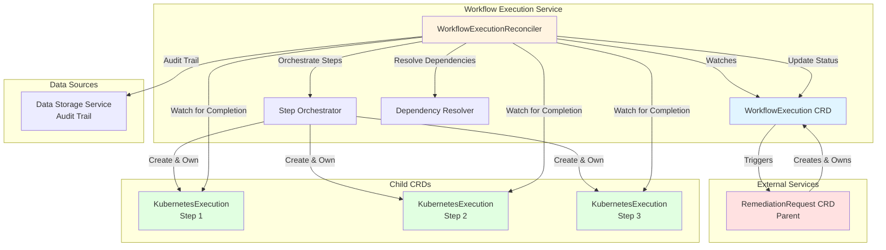
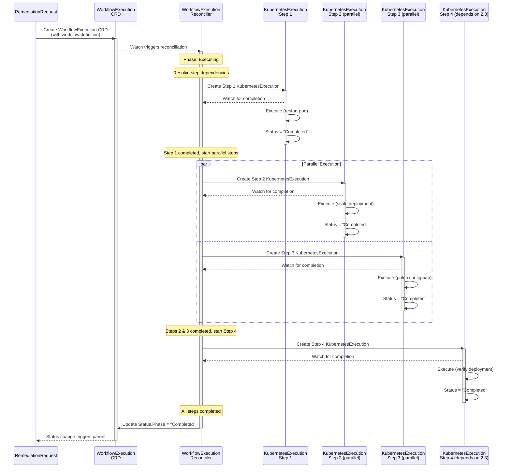
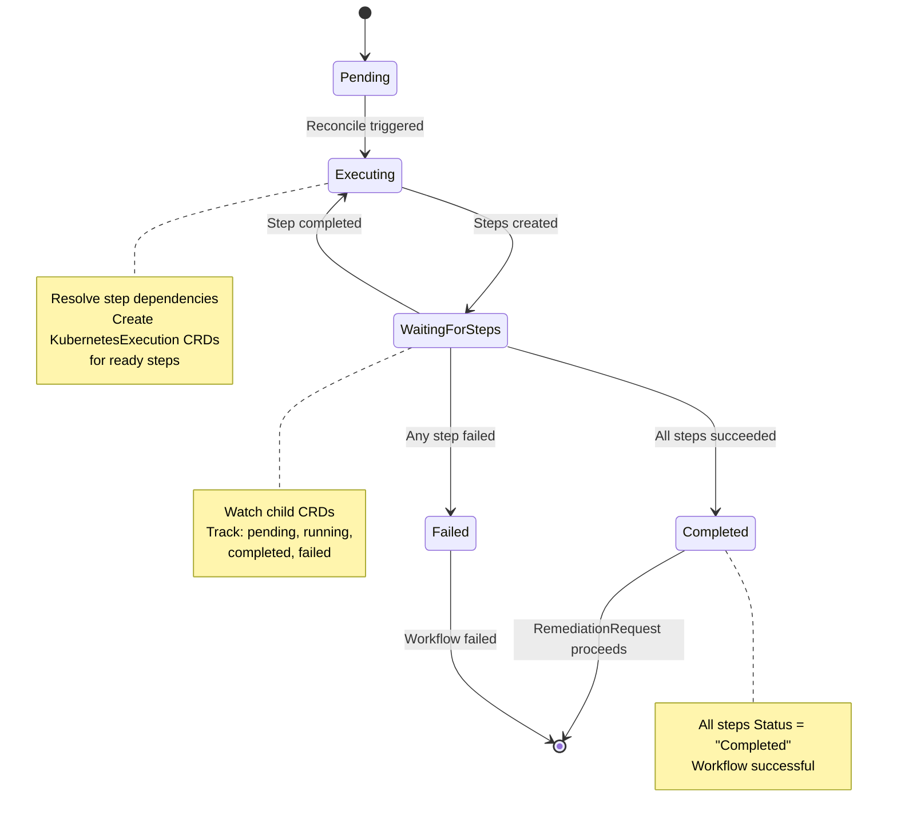

## Overview

**Purpose**: Orchestrates multi-step remediation workflows with adaptive execution, safety validation, and intelligent optimization.

**Core Responsibilities**:
1. Plan workflow execution based on AI recommendations (BR-WF-001, BR-WF-002)
2. Validate safety requirements and prerequisites (BR-WF-015, BR-WF-016)
3. Execute workflow steps with dependency resolution (BR-WF-010, BR-WF-011)
4. Monitor execution progress and health (BR-WF-030, BR-WF-031)
5. Handle failures with rollback and recovery (BR-WF-050, BR-WF-051)
6. Create KubernetesExecution CRDs for approved actions
7. Apply adaptive orchestration based on runtime conditions (BR-ORCHESTRATION-001)

**V1 Scope - Core Workflow Orchestration**:
- Single-workflow execution (sequential or parallel steps)
- Safety validation with dry-run capabilities
- Basic rollback strategies (manual and automatic)
- Step dependency resolution
- Real-time execution monitoring
- Kubernetes action delegation to Executor Service
- Workflow state persistence in CRD

**Future V2 Enhancements** (Out of Scope):
- Multi-workflow orchestration (compound workflows)
- Advanced machine learning for step optimization
- Cross-cluster workflow execution
- Workflow scheduling and batching
- Advanced canary and blue-green strategies

**Key Architectural Decisions**:
- **Multi-Phase State Machine**: Planning → Validating → Executing → Monitoring → Completed (5 phases)
- **Step-Based Execution**: Each step creates KubernetesExecution CRD for atomic operations
- **Adaptive Orchestration**: Runtime adjustment based on success/failure patterns
- **Safety-First Validation**: Mandatory validation phase before execution
- **Rollback Capability**: Automatic or manual rollback with state preservation
- **Watch-Based Coordination**: Monitors KubernetesExecution status for step completion
- **24-Hour Retention**: Aligned with RemediationRequest lifecycle
- **Does NOT execute K8s operations** (Executor Service responsibility)

---

## Service Configuration

### Port Configuration
- **Port 9090**: Metrics endpoint
- **Port 8080**: Health probes (follows kube-apiserver pattern)
- **Endpoint**: `/metrics`
- **Format**: Prometheus text format
- **Authentication**: Kubernetes TokenReviewer API (validates ServiceAccount tokens)
  - **See**: [METRICS_AUTHENTICATION.md](../METRICS_AUTHENTICATION.md) for complete implementation examples

### ServiceAccount
- **Name**: `workflow-execution-sa`
- **Namespace**: `kubernaut-system`
- **Purpose**: Controller authentication and authorization

### Notes
- CRD controllers do not expose REST APIs
- Health checks (`/healthz`, `/readyz`) are for Kubernetes liveness/readiness probes
- Metrics endpoint requires valid Kubernetes ServiceAccount token

---

## 📊 Visual Architecture

### Architecture Diagram


### Sequence Diagram - Step Orchestration


### State Machine - Step Orchestration


---

## Summary

**Workflow Execution Service - V1 Design Specification (90% Complete)**

### Core Purpose
Multi-step remediation workflow orchestration with adaptive execution, safety validation, and intelligent optimization.

### Key Architectural Decisions
1. **Multi-Phase State Machine** - Planning → Validating → Executing → Monitoring → Completed (5 phases)
2. **Safety-First Validation** - Mandatory validation phase with dry-run capabilities
3. **Step-Based Execution** - Each step creates KubernetesExecution CRD for atomic operations
4. **Watch-Based Coordination** - Monitors KubernetesExecution status for step completion
5. **Adaptive Orchestration** - Runtime optimization based on historical patterns

### Integration Model
```
RemediationRequest → WorkflowExecution (this service)
                         ↓
        WorkflowExecution creates KubernetesExecution per step
                         ↓
           WorkflowExecution watches step completion
                         ↓
        WorkflowExecution.status.phase = "completed"
```

### V1 Scope Boundaries
**Included**:
- Single-workflow execution (sequential or parallel steps)
- Safety validation with dry-run
- Basic rollback strategies
- Step dependency resolution
- Real-time execution monitoring

**Excluded** (V2):
- Multi-workflow orchestration
- Advanced ML optimization
- Cross-cluster execution
- Workflow scheduling

### Business Requirements Coverage

WorkflowExecution implements **4 distinct business domains** across multiple BR prefixes:

#### 1. Core Workflow Management (BR-WF-*)
**Range**: BR-WF-001 to BR-WF-180
**V1 Scope**: BR-WF-001 to BR-WF-021 (21 BRs)
**Focus**: Workflow planning, validation, lifecycle management, and execution coordination

**Primary Functions**:
- Workflow creation and planning from RemediationRequest
- Multi-phase state machine (Planning → Validating → Executing → Monitoring → Completed)
- Safety validation and dry-run execution
- Step dependency resolution and ordering
- Real-time execution monitoring
- Rollback and failure handling

#### 2. Orchestration Logic (BR-ORCHESTRATION-*)
**Range**: BR-ORCHESTRATION-001 to BR-ORCHESTRATION-100
**V1 Scope**: BR-ORCHESTRATION-001 to BR-ORCHESTRATION-010 (10 BRs)
**Focus**: Multi-step coordination, dependency resolution, and adaptive execution patterns

**⚠️ Clarification - Distinct from RemediationOrchestrator**:
- **WorkflowExecution (BR-ORCHESTRATION-*)**: Orchestrates workflow *steps* within a single workflow (step ordering, dependencies, parallel execution)
- **RemediationOrchestrator (BR-AR-*)**: Orchestrates CRD *lifecycle* across multiple services (RemediationRequest → AIAnalysis → WorkflowExecution)

**Primary Functions**:
- Step ordering based on dependencies
- Parallel vs sequential execution decisions
- Dynamic step injection based on runtime conditions
- Adaptive orchestration using historical patterns

#### 3. Automation Features (BR-AUTOMATION-*)
**Range**: BR-AUTOMATION-001 to BR-AUTOMATION-050
**V1 Scope**: BR-AUTOMATION-001 to BR-AUTOMATION-002 (2 BRs)
**Focus**: Intelligent automation patterns and runtime workflow adjustment

**Primary Functions**:
- Adaptive workflow modification based on execution results
- Intelligent retry strategies
- Context-aware workflow optimization

#### 4. Execution Monitoring (BR-EXECUTION-*)
**Range**: BR-EXECUTION-001 to BR-EXECUTION-050
**V1 Scope**: BR-EXECUTION-001 to BR-EXECUTION-002 (2 BRs)
**Focus**: Overall workflow execution progress tracking and health monitoring

**⚠️ Clarification - Distinct from KubernetesExecutor**:
- **WorkflowExecution (BR-EXECUTION-*)**: Monitors overall *workflow* execution progress (multi-step health, workflow-level status)
- **KubernetesExecutor (BR-EXEC-*)**: Executes individual *Kubernetes actions* (single K8s operations, V2: cloud provider actions)

**Primary Functions**:
- Workflow-level execution progress tracking
- Multi-step health monitoring
- Workflow timeout management
- Execution metrics collection

#### BR Prefix Ownership Summary

| Prefix | Total Range | V1 Active | V2 Reserved | Business Domain |
|--------|-------------|-----------|-------------|-----------------|
| BR-WF-* | 001-180 | 001-021 (21 BRs) | 022-180 | Core workflow management |
| BR-ORCHESTRATION-* | 001-100 | 001-010 (10 BRs) | 011-100 | Multi-step coordination |
| BR-AUTOMATION-* | 001-050 | 001-002 (2 BRs) | 003-050 | Intelligent automation |
| BR-EXECUTION-* | 001-050 | 001-002 (2 BRs) | 003-050 | Workflow execution monitoring |

**Total V1 BRs**: 35 (21 + 10 + 2 + 2)
**Total Reserved**: 300+ for V2 expansion

**Rationale for Multiple Prefixes**:
WorkflowExecution genuinely implements 4 distinct business domains, each with clear semantic boundaries. Multiple prefixes preserve this semantic clarity and align with the architectural reality of the service. Per the [Multiple BR Prefixes Policy](../CRD_BR_MULTIPLE_PREFIXES_POLICY.md), multiple prefixes are acceptable when:
1. ✅ They represent distinct business domains (workflow, orchestration, automation, monitoring)
2. ✅ Ownership is clearly documented (all owned by WorkflowExecution)
3. ✅ No naming conflicts exist with other services (clarification notes added)
4. ✅ No duplicate meanings exist (each prefix has unique function)

### Implementation Status
- **Existing Code**: Workflow engine components in `pkg/workflow/` to reuse
- **Migration Effort**: 10-12 days (2 weeks)
- **CRD Controller**: New implementation following controller-runtime patterns
- **Database Schema**: Workflow audit table design complete

### Next Steps
1. ✅ **Approved Design Specification** (90% complete)
2. **CRD Schema Definition**: WorkflowExecution API types
3. **Controller Implementation**: Multi-phase reconciliation logic
4. **Integration Testing**: With Executor Service and RemediationRequest

### Critical Success Factors
- Multi-phase execution with proper timeouts
- Safety validation before execution
- Watch-based step coordination
- Proper owner references for cascade deletion
- Audit trail completeness for learning

**Design Specification Status**: Production-Ready (90% Confidence)

