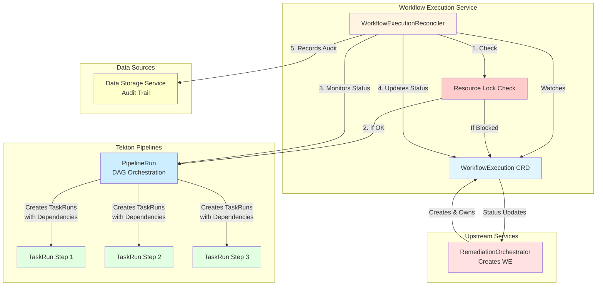
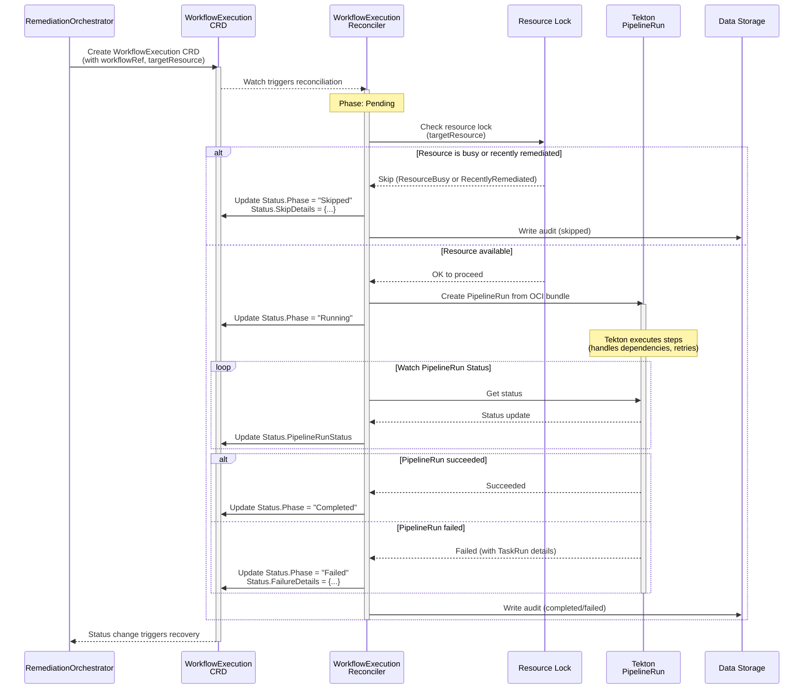
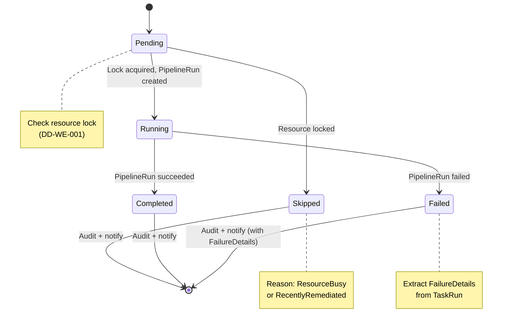

## Overview

**Version**: 4.2
**Last Updated**: 2025-12-03
**Status**: ✅ Updated for Lock Persistence (DD-WE-003)

---

## Changelog

### Version 4.2 (2025-12-03)
**Updates**:
- ✅ **Added**: Lock persistence via deterministic PipelineRun name (DD-WE-003)
- ✅ **Added**: Field index on `spec.targetResource` for O(1) lock check
- ✅ **Added**: Two-layer lock check (indexed query + atomic create)
- ✅ **Updated**: Race condition eliminated via Kubernetes object uniqueness

### Version 4.1 (2025-12-03)
**Updates**:
- ✅ **Added**: Dedicated execution namespace pattern (DD-WE-002)
- ✅ **Updated**: All PipelineRuns run in `kubernaut-workflows` namespace
- ✅ **Updated**: ServiceAccount with ClusterRoleBinding for cross-namespace operations

### Version 4.0 (2025-12-02)
**Updates**:
- ✅ **Simplified**: Documentation to focus on current architecture
- ✅ **Updated**: User-provided OCI bundles as workflow source

### Version 3.1 (2025-12-02)
**Updates**:
- ✅ **Updated**: API group from `.io` to `.ai` per DD-CRD-001
- ✅ **Updated**: BR prefix standardized to `BR-WE-*`
- ✅ **Updated**: Port from 8080 to 8081 per DD-TEST-001

### Version 3.0 (2025-12-01)
**Updates**:
- ✅ **Added**: Resource locking safety (DD-WE-001)
- ✅ **Added**: Enhanced failure details for recovery flow
- ✅ **Added**: `Skipped` phase for blocked executions
- ✅ **Added**: `targetResource` field for lock scope

### Version 2.0 (2025-11-28)
**Updates**:
- ✅ **Added**: Tekton PipelineRun execution model (ADR-044)
- ✅ **Added**: OCI bundle workflow references (ADR-043)

---

## Purpose

Orchestrates remediation workflows by creating Tekton PipelineRuns from OCI bundle references and monitoring their execution status.

**Architecture**: Uses Tekton Pipelines directly for workflow execution (see [ADR-044](../../../architecture/decisions/ADR-044-workflow-execution-engine-delegation.md))

**Core Responsibilities**:
1. **Create Tekton PipelineRun** from workflow OCI bundle reference
2. **Monitor PipelineRun status** and update WorkflowExecution phase
3. **Enforce resource locking** - prevent parallel workflows on same target (DD-WE-001)
4. **Extract failure details** from TaskRun for recovery flow
5. **Write audit trail** to Data Storage Service for compliance

**Tekton Handles**:
- Step orchestration, dependencies, and parallelism
- Retry logic (defined in Pipeline)
- Rollback via `finally` tasks (if defined in Pipeline)

---

## Service Configuration

### Port Configuration
- **Port 8081**: Health probes (`/health`, `/ready` - no auth required)
- **Port 9090**: Metrics endpoint (`/metrics` - with auth filter)
- **Authentication**: Kubernetes TokenReviewer API (validates ServiceAccount tokens)

### Startup Behavior (ADR-030)

| Dependency | Behavior | Reason |
|------------|----------|--------|
| **Tekton Pipelines** | Crash at startup | Core execution engine |
| **ConfigMap** | Use defaults if missing | All values have sane defaults |
| **ServiceAccount** | Fail execution (not crash) | Per-namespace, checked at runtime |

**Implementation**:
```go
func checkTektonAvailable(ctx context.Context, client client.Client) error {
    // Try to list Pipeline CRDs - if not found, Tekton not installed
    _, err := client.RESTMapper().RESTMapping(
        schema.GroupKind{Group: "tekton.dev", Kind: "Pipeline"})
    if err != nil {
        return fmt.Errorf("Tekton Pipelines not installed: %w", err)
    }
    return nil
}
```

### Configuration Defaults

| Setting | Default | ConfigMap Key | Environment Override |
|---------|---------|---------------|---------------------|
| **Cooldown Period** | 5 minutes | `resource_locking.cooldown_period` | `WE_COOLDOWN_PERIOD` |
| **Status Check Interval** | 10 seconds | `tekton.status_check_interval` | - |
| **Health Port** | 8081 | `health.listen_addr` | - |
| **Metrics Port** | 9090 | `metrics.listen_addr` | - |

**Reference**: [CONFIG_STANDARDS.md](../../../configuration/CONFIG_STANDARDS.md)

### Timeout Cascade

| Layer | Timeout | Purpose |
|-------|---------|---------|
| **Tekton Pipeline** | Defined in Pipeline YAML | Step/Task execution limits |
| **WorkflowExecution** | No override | Respects Pipeline-defined timeout |
| **RemediationOrchestrator** | 60 minutes | Outer boundary for entire remediation cycle |

**Behavior**: Tekton's Pipeline-defined timeout wins. If a PipelineRun exceeds its timeout, Tekton marks it `Failed` with reason `PipelineRunTimeout`. RO's 60-minute timeout is the maximum for the entire remediation (including analysis, approval, execution).

### Execution Namespace (DD-WE-002)

**All PipelineRuns run in `kubernaut-workflows` namespace** (industry standard pattern).

| Component | Namespace |
|-----------|-----------|
| WorkflowExecution CRD | `kubernaut-system` |
| WE Controller | `kubernaut-system` |
| PipelineRun | `kubernaut-workflows` |
| ServiceAccount | `kubernaut-workflows` |

**Benefits**:
- All remediation activity in one namespace (audit clarity)
- Single ServiceAccount with ClusterRoleBinding
- Easy PipelineRun cleanup and resource quota management

### ServiceAccount
- **Name**: `kubernaut-workflow-runner`
- **Namespace**: `kubernaut-workflows` (dedicated execution namespace)
- **RBAC**: ClusterRole + ClusterRoleBinding for cross-namespace operations
- **Failure**: If missing, execution fails with `ConfigurationError` reason

See: [DD-WE-002](../../../architecture/decisions/DD-WE-002-dedicated-execution-namespace.md)

### Notes
- CRD controllers do not expose REST APIs
- Health checks (`/healthz`, `/readyz`) are for Kubernetes liveness/readiness probes
- Metrics endpoint requires valid Kubernetes ServiceAccount token

---

## 📊 Visual Architecture

### Architecture Diagram (v3.0+)


### Sequence Diagram - Tekton Execution (v3.0+)


### State Machine (v3.0+)


---

## Key Architectural Decisions

| Decision | Choice | Document |
|----------|--------|----------|
| **Execution Engine** | Tekton PipelineRun delegation | [ADR-044](../../../architecture/decisions/ADR-044-workflow-execution-engine-delegation.md) |
| **Workflow Storage** | OCI bundle references | [ADR-043](../../../architecture/decisions/ADR-043-workflow-schema-definition-standard.md) |
| **Resource Locking** | Target-scoped, skip-not-queue | [DD-WE-001](../../../architecture/decisions/DD-WE-001-resource-locking-safety.md) |
| **Execution Namespace** | Dedicated `kubernaut-workflows` | [DD-WE-002](../../../architecture/decisions/DD-WE-002-dedicated-execution-namespace.md) |
| **Lock Persistence** | Deterministic PipelineRun name | [DD-WE-003](../../../architecture/decisions/DD-WE-003-resource-lock-persistence.md) |
| **API Group** | `workflowexecution.kubernaut.ai` | [DD-CRD-001](../../../architecture/decisions/DD-CRD-001-api-group-domain-selection.md) |
| **Contract Alignment** | Enhanced failure details | [DD-CONTRACT-001](../../../architecture/decisions/DD-CONTRACT-001-aianalysis-workflowexecution-alignment.md) |

---

## Business Requirements Coverage

WorkflowExecution uses the **BR-WE-*** prefix for all business requirements:

| Category | Range | Description |
|----------|-------|-------------|
| **Core Execution** | BR-WE-001 to BR-WE-008 | Tekton PipelineRun creation and status monitoring |
| **Resource Locking** | BR-WE-009 to BR-WE-011 | Safety features (parallel/sequential prevention) |
| **Failure Handling** | BR-WE-012 to BR-WE-015 | Rich failure details for recovery flow |

**V1.0 Focus**:
- BR-WE-009: Prevent parallel execution on same target
- BR-WE-010: Cooldown period for same workflow+target
- BR-WE-011: Target resource identification

See: [BR-WE-009-011-resource-locking.md](../../../requirements/BR-WE-009-011-resource-locking.md)

---

## V1 Scope

**Included**:
- Tekton PipelineRun execution from user-provided OCI bundles
- Resource locking (prevents parallel and redundant executions)
- Enhanced failure details for LLM recovery context
- Audit trail for all executions (including skipped)

**V2+ Roadmap**:
- Configurable per-workflow cooldown
- Lock groups for compatible workflows
- Queueing of blocked executions

---

## Integration Model

```
RemediationOrchestrator → WorkflowExecution CRD
                              ↓
          [Check Resource Lock - DD-WE-001]
                              ↓
              ┌───────────────┴───────────────┐
              ↓                               ↓
         [Lock OK]                    [Lock Blocked]
              ↓                               ↓
    Create Tekton PipelineRun        Phase = "Skipped"
              ↓                      SkipDetails populated
    Watch PipelineRun status                  ↓
              ↓                        Audit + Notify
    ┌─────────┴─────────┐
    ↓                   ↓
[Succeeded]        [Failed]
    ↓                   ↓
Phase="Completed"  Phase="Failed"
                   FailureDetails populated
    ↓                   ↓
        Audit + Notify
              ↓
    RO watches status change
```

---

## Critical Success Factors

- ✅ Resource locking prevents parallel workflow conflicts
- ✅ Rich failure details enable intelligent recovery
- ✅ Tekton delegation simplifies controller logic
- ✅ OCI bundle references ensure reproducibility
- ✅ Audit trail provides compliance and learning data

**Design Specification Status**: Production-Ready (98% Confidence)
