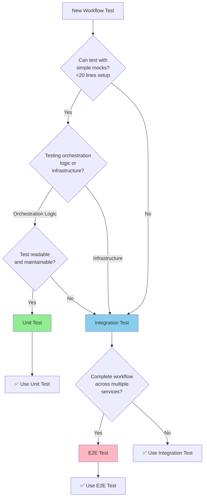

## Testing Strategy

**Testing Framework Reference**: [.cursor/rules/03-testing-strategy.mdc](../../../.cursor/rules/03-testing-strategy.mdc)
**Summary Document**: [TESTING_STRATEGY_SUMMARY.md](../TESTING_STRATEGY_SUMMARY.md)

### Testing Pyramid

Following Kubernaut's defense-in-depth testing strategy:

| Test Type | Target Coverage | Focus | Confidence |
|-----------|----------------|-------|------------|
| **Unit Tests** | 70%+ | Controller logic, workflow orchestration, step dependencies | 85-90% |
| **Integration Tests** | >50% | CRD interactions, KubernetesExecution coordination, watch patterns | 80-85% |
| **E2E Tests** | 10-15% | Complete multi-step workflow execution, real cluster scenarios | 90-95% |

**Rationale**: CRD controllers require high integration test coverage (>50%) to validate Kubernetes API interactions, CRD lifecycle management, watch-based step coordination, and child CRD creation patterns that cannot be adequately tested in unit tests alone.

### Unit Tests (Primary Coverage Layer)

**Test Directory**: [test/unit/workflowexecution/](../../../test/unit/workflowexecution/)
**Coverage Target**: 70% (orchestration logic: dependency resolution, parallel execution, step state machines, CRD reconciliation)
**Confidence**: 85-90%
**Execution**: `make test-unit-workflowexecution`

**Testing Strategy**: Use fake K8s client for compile-time API safety. Mock NO external services (all orchestration is internal logic).

**Orchestration-Specific Test Patterns**:

```go
package workflowexecution

import (
    . "github.com/onsi/ginkgo/v2"
    . "github.com/onsi/gomega"
    "context"
    "time"

    remediationv1 "github.com/jordigilh/kubernaut/api/remediation/v1"
    workflowexecutionv1 "github.com/jordigilh/kubernaut/api/workflowexecution/v1"
    kubernetesexecutionv1 "github.com/jordigilh/kubernaut/api/kubernetesexecution/v1"
    "github.com/jordigilh/kubernaut/internal/controller"
    "github.com/jordigilh/kubernaut/pkg/workflow/orchestrator"
    "github.com/jordigilh/kubernaut/pkg/testutil"

    metav1 "k8s.io/apimachinery/pkg/apis/meta/v1"
    "k8s.io/apimachinery/pkg/runtime"
    "sigs.k8s.io/controller-runtime/pkg/client"
    "sigs.k8s.io/controller-runtime/pkg/client/fake"
)

var _ = Describe("BR-WF-010: WorkflowExecution Controller", func() {
    var (
        fakeK8sClient    client.Client
        scheme           *runtime.Scheme
        orchestrator     *orchestrator.StepOrchestrator  // REAL business logic
        reconciler       *controller.WorkflowExecutionReconciler
        ctx              context.Context
    )

    BeforeEach(func() {
        ctx = context.Background()
        scheme = testutil.NewTestScheme()

        fakeK8sClient = fake.NewClientBuilder().
            WithScheme(scheme).
            WithStatusSubresource(&workflowexecutionv1.WorkflowExecution{}).
            Build()

        // Use REAL orchestrator business logic
        orchestrator = orchestrator.NewStepOrchestrator()

        reconciler = &controller.WorkflowExecutionReconciler{
            Client:       fakeK8sClient,
            Scheme:       scheme,
            Orchestrator: orchestrator,  // Real business logic
        }
    })

    Context("BR-WF-020: Dependency Resolution", func() {
        It("should resolve linear dependency chain", func() {
            // Setup workflow with linear dependencies: step1 → step2 → step3
            wf := &workflowexecutionv1.WorkflowExecution{
                ObjectMeta: metav1.ObjectMeta{
                    Name:      "wf-linear-test",
                    Namespace: "default",
                },
                Spec: workflowexecutionv1.WorkflowExecutionSpec{
                    WorkflowDefinition: workflowexecutionv1.WorkflowDefinition{
                        Steps: map[string]workflowexecutionv1.WorkflowStep{
                            "step1": {
                                Name:         "restart-pod",
                                Action:       "restart-pod",
                                Dependencies: []string{},
                            },
                            "step2": {
                                Name:         "scale-deployment",
                                Action:       "scale-deployment",
                                Dependencies: []string{"step1"},
                            },
                            "step3": {
                                Name:         "verify-deployment",
                                Action:       "verify-deployment",
                                Dependencies: []string{"step2"},
                            },
                        },
                    },
                },
            }
            Expect(fakeK8sClient.Create(ctx, wf)).To(Succeed())

            // Reconcile - should create only step1 (no dependencies)
            result, err := reconciler.Reconcile(ctx, testutil.NewReconcileRequest(wf))
            Expect(err).ToNot(HaveOccurred())

            // Verify only step1 KubernetesExecution created
            var keList kubernetesexecutionv1.KubernetesExecutionList
            Expect(fakeK8sClient.List(ctx, &keList)).To(Succeed())
            Expect(keList.Items).To(HaveLen(1))
            Expect(keList.Items[0].Spec.StepName).To(Equal("step1"))
        })

        It("should resolve parallel dependency graph", func() {
            // Setup workflow with parallel dependencies:
            //   step1 → step3
            //   step2 → step3
            wf := &workflowexecutionv1.WorkflowExecution{
                ObjectMeta: metav1.ObjectMeta{
                    Name:      "wf-parallel-test",
                    Namespace: "default",
                },
                Spec: workflowexecutionv1.WorkflowExecutionSpec{
                    WorkflowDefinition: workflowexecutionv1.WorkflowDefinition{
                        Steps: map[string]workflowexecutionv1.WorkflowStep{
                            "step1": {
                                Name:         "restart-pod-a",
                                Action:       "restart-pod",
                                Dependencies: []string{},
                            },
                            "step2": {
                                Name:         "restart-pod-b",
                                Action:       "restart-pod",
                                Dependencies: []string{},
                            },
                            "step3": {
                                Name:         "verify-deployment",
                                Action:       "verify-deployment",
                                Dependencies: []string{"step1", "step2"},
                            },
                        },
                    },
                },
            }
            Expect(fakeK8sClient.Create(ctx, wf)).To(Succeed())

            // Reconcile - should create step1 and step2 (both ready)
            result, err := reconciler.Reconcile(ctx, testutil.NewReconcileRequest(wf))
            Expect(err).ToNot(HaveOccurred())

            // Verify both parallel steps created
            var keList kubernetesexecutionv1.KubernetesExecutionList
            Expect(fakeK8sClient.List(ctx, &keList)).To(Succeed())
            Expect(keList.Items).To(HaveLen(2))

            // Verify parallel steps have correct names
            stepNames := []string{keList.Items[0].Spec.StepName, keList.Items[1].Spec.StepName}
            Expect(stepNames).To(ConsistOf("step1", "step2"))
        })
    })

    Context("BR-WF-030: Parallel Execution Efficiency", func() {
        It("should execute independent steps in parallel", func() {
            // Setup workflow with 3 independent steps
            wf := &workflowexecutionv1.WorkflowExecution{
                ObjectMeta: metav1.ObjectMeta{
                    Name:      "wf-efficiency-test",
                    Namespace: "default",
                },
                Spec: workflowexecutionv1.WorkflowExecutionSpec{
                    WorkflowDefinition: workflowexecutionv1.WorkflowDefinition{
                        Steps: map[string]workflowexecutionv1.WorkflowStep{
                            "step1": {Name: "action-1", Action: "restart-pod", Dependencies: []string{}},
                            "step2": {Name: "action-2", Action: "scale-deployment", Dependencies: []string{}},
                            "step3": {Name: "action-3", Action: "patch-configmap", Dependencies: []string{}},
                        },
                    },
                },
            }
            Expect(fakeK8sClient.Create(ctx, wf)).To(Succeed())

            startTime := time.Now()

            // Reconcile to create all parallel steps
            result, err := reconciler.Reconcile(ctx, testutil.NewReconcileRequest(wf))
            Expect(err).ToNot(HaveOccurred())

            duration := time.Since(startTime)

            // Verify all 3 steps created in single reconciliation
            var keList kubernetesexecutionv1.KubernetesExecutionList
            Expect(fakeK8sClient.List(ctx, &keList)).To(Succeed())
            Expect(keList.Items).To(HaveLen(3))

            // Verify creation was fast (<100ms for 3 steps)
            Expect(duration).To(BeNumerically("<", 100*time.Millisecond))

            // Calculate parallel execution efficiency
            var updatedWF workflowexecutionv1.WorkflowExecution
            Expect(fakeK8sClient.Get(ctx, client.ObjectKeyFromObject(wf), &updatedWF)).To(Succeed())
            Expect(updatedWF.Status.ParallelExecutionEfficiency).To(BeNumerically(">", 0.99))  // All 3 steps parallel
        })
    })

    Context("BR-WF-040: Child CRD Status Monitoring", func() {
        It("should transition to next step when previous step completes", func() {
            // Create workflow with linear dependencies
            wf := testutil.NewTestWorkflowExecution("wf-status-test")
            wf.Spec.WorkflowDefinition.Steps = map[string]workflowexecutionv1.WorkflowStep{
                "step1": {Name: "restart-pod", Action: "restart-pod", Dependencies: []string{}},
                "step2": {Name: "verify-deployment", Action: "verify-deployment", Dependencies: []string{"step1"}},
            }
            Expect(fakeK8sClient.Create(ctx, wf)).To(Succeed())

            // Reconcile to create step1
            result, err := reconciler.Reconcile(ctx, testutil.NewReconcileRequest(wf))
            Expect(err).ToNot(HaveOccurred())

            // Get created KubernetesExecution for step1
            var ke1 kubernetesexecutionv1.KubernetesExecution
            Expect(fakeK8sClient.Get(ctx, client.ObjectKey{
                Name:      "wf-status-test-step1",
                Namespace: "default",
            }, &ke1)).To(Succeed())

            // Simulate step1 completion
            ke1.Status.Phase = "Completed"
            Expect(fakeK8sClient.Status().Update(ctx, &ke1)).To(Succeed())

            // Reconcile again - should create step2
            result, err = reconciler.Reconcile(ctx, testutil.NewReconcileRequest(wf))
            Expect(err).ToNot(HaveOccurred())

            // Verify step2 created
            var ke2 kubernetesexecutionv1.KubernetesExecution
            Expect(fakeK8sClient.Get(ctx, client.ObjectKey{
                Name:      "wf-status-test-step2",
                Namespace: "default",
            }, &ke2)).To(Succeed())
        })
    })

    Context("BR-WF-050: Workflow Failure Handling", func() {
        It("should transition to Failed when step fails", func() {
            wf := testutil.NewTestWorkflowExecution("wf-failure-test")
            Expect(fakeK8sClient.Create(ctx, wf)).To(Succeed())

            // Reconcile to create step
            result, err := reconciler.Reconcile(ctx, testutil.NewReconcileRequest(wf))
            Expect(err).ToNot(HaveOccurred())

            // Simulate step failure
            var ke kubernetesexecutionv1.KubernetesExecution
            Expect(fakeK8sClient.Get(ctx, client.ObjectKey{
                Name:      "wf-failure-test-step1",
                Namespace: "default",
            }, &ke)).To(Succeed())
            ke.Status.Phase = "Failed"
            ke.Status.FailureReason = "kubectl command execution failed"
            Expect(fakeK8sClient.Status().Update(ctx, &ke)).To(Succeed())

            // Reconcile again - should mark workflow as failed
            result, err = reconciler.Reconcile(ctx, testutil.NewReconcileRequest(wf))
            Expect(err).To(HaveOccurred())

            // Verify workflow transitioned to Failed
            var updatedWF workflowexecutionv1.WorkflowExecution
            Expect(fakeK8sClient.Get(ctx, client.ObjectKeyFromObject(wf), &updatedWF)).To(Succeed())
            Expect(updatedWF.Status.Phase).To(Equal("Failed"))
            Expect(updatedWF.Status.FailedStep).To(Equal("step1"))
        })
    })
})
```

---

### Integration Tests (Cross-Component Validation)

**Test Directory**: [test/integration/workflowexecution/](../../../test/integration/workflowexecution/)
**Coverage Target**: 18%
**Confidence**: 80-85%
**Execution**: `make test-integration-workflowexecution`

**Focus Areas**:
- Real KubernetesExecution CRD creation & watch
- Multi-step workflow with real Kubernetes API
- Step failure & retry logic

---

### E2E Tests (Complete Workflow Validation)

**Test Directory**: [test/e2e/scenarios/](../../../test/e2e/scenarios/)
**Coverage Target**: 10%
**Confidence**: 90-95%
**Execution**: `make test-e2e-workflowexecution`

**Test Scenarios**:
1. Simple 3-step linear workflow
2. Complex 5-step workflow with parallel + sequential mix
3. Workflow failure → rollback → retry

---

### Service-Specific Test Validation

**Orchestration Testing Challenges**:
- ✅ **Dependency Graph Complexity**: Table-driven tests for various graph shapes
- ✅ **Parallel Execution Timing**: Use fake client for deterministic ordering
- ✅ **Step State Machine**: Comprehensive state transition tests
- ✅ **Failure Propagation**: Test failure at each step position

**Unique Metrics to Validate**:
- Parallel execution efficiency (target: ≥30%)
- Dependency resolution time (P95 <5s)
- Workflow success rate (target: ≥98%)

---

## 🎯 Test Level Selection: Maintainability First

**Principle**: Prioritize maintainability and simplicity when choosing between unit, integration, and e2e tests.

### Decision Framework



### Test at Unit Level WHEN

- ✅ Scenario can be tested with **simple step mocks** (no complex CRD coordination needed)
- ✅ Focus is on **orchestration logic** (dependency resolution, parallel execution, step ordering)
- ✅ Setup is **straightforward** (< 20 lines of mock configuration)
- ✅ Test remains **readable and maintainable** with mocking

**WorkflowExecution Unit Test Examples**:
- Dependency graph resolution (DAG analysis)
- Parallel vs sequential execution decision logic
- Step state machine transitions (pending → running → completed)
- Failure propagation through workflow graph
- Timeout detection and handling

---

### Move to Integration Level WHEN

- ✅ Scenario requires **CRD watch-based coordination** (WorkflowExecution → KubernetesExecution creation)
- ✅ Validating **real Kubernetes API behavior** (child CRD lifecycle, status updates)
- ✅ Unit test would require **excessive mocking** (>50 lines of step coordination mocks)
- ✅ Integration test is **simpler to understand** and maintain
- ✅ Testing **real multi-step workflow** with actual CRD creation

**WorkflowExecution Integration Test Examples**:
- Complete workflow reconciliation with real K8s API
- Child CRD creation and status watching (WorkflowExecution → KubernetesExecution)
- Multi-step parallel execution coordination
- Workflow pause/resume functionality
- Real step failure propagation through CRD status updates

---

### Move to E2E Level WHEN

- ✅ Testing **complete remediation workflow** (AIAnalysis → WorkflowExecution → KubernetesExecution → Actions)
- ✅ Validating **multi-step execution with real actions**
- ✅ Lower-level tests **cannot reproduce workflow complexity** (e.g., timing-dependent step ordering)

**WorkflowExecution E2E Test Examples**:
- Complete 5-step remediation workflow (investigation → validation → backup → action → verify)
- Multi-service workflow coordination
- Production-like failure scenarios (step timeout → retry → fallback)
- Workflow rollback on failure

---

## 🧭 Maintainability Decision Criteria

**Ask these 5 questions before implementing a unit test:**

### 1. Mock Complexity
**Question**: Will mock setup be >30 lines?
- ✅ **YES** → Consider integration test
- ❌ **NO** → Unit test acceptable

**WorkflowExecution Example**:
```go
// ❌ COMPLEX: 70+ lines of multi-step CRD mock setup
mockK8sClient.On("Create", step1CRD).Return(nil)
mockK8sClient.On("Watch", step1CRD).Return(watchMock1)
mockK8sClient.On("Create", step2CRD).Return(nil)
// ... 60+ more lines for 10-step workflow
// BETTER: Integration test with real CRD creation
```

---

### 2. Readability
**Question**: Would a new developer understand this test in 2 minutes?
- ✅ **YES** → Unit test is good
- ❌ **NO** → Consider higher test level

**WorkflowExecution Example**:
```go
// ✅ READABLE: Clear dependency resolution test
It("should execute independent steps in parallel", func() {
    workflow := testutil.NewWorkflow([]Step{
        {ID: "step1", Dependencies: []string{}},
        {ID: "step2", Dependencies: []string{}},
    })
    plan := orchestrator.ResolveDependencies(workflow)
    Expect(plan.ParallelSteps).To(HaveLen(2))
})
```

---

### 3. Fragility
**Question**: Does test break when internal implementation changes?
- ✅ **YES** → Move to integration test (testing implementation, not behavior)
- ❌ **NO** → Unit test is appropriate

**WorkflowExecution Example**:
```go
// ❌ FRAGILE: Breaks if we change internal step counter
Expect(orchestrator.internalStepCounter).To(Equal(5))

// ✅ STABLE: Tests workflow behavior, not implementation
Expect(we.Status.CompletedSteps).To(Equal(5))
Expect(we.Status.Phase).To(Equal("completed"))
```

---

### 4. Real Value
**Question**: Is this testing orchestration logic or infrastructure interaction?
- **Orchestration Logic** → Unit test
- **Infrastructure** → Integration test

**WorkflowExecution Decision**:
- **Unit**: Dependency graph resolution, parallel execution planning (orchestration logic)
- **Integration**: CRD creation and status watching (infrastructure)

---

### 5. Maintenance Cost
**Question**: How much effort to maintain this vs integration test?
- **Lower cost** → Choose that option

**WorkflowExecution Example**:
- **Unit test with 80-line step mock**: HIGH maintenance (breaks on step changes)
- **Integration test with real CRDs**: LOW maintenance (automatically adapts to CRD changes)

---

## 🎯 Realistic vs. Exhaustive Testing

**Principle**: Test realistic workflow scenarios necessary to validate business requirements - not more, not less.

### WorkflowExecution: Requirement-Driven Coverage

**Business Requirement Analysis** (BR-WF-010 to BR-WF-050):

| Workflow Dimension | Realistic Values | Test Strategy |
|---|---|---|
| **Step Count** | 1-3 steps, 5 steps, 10 steps | Test distinct orchestration behaviors, not all counts |
| **Dependency Patterns** | sequential, parallel, diamond, fork-join | Test graph resolution for each pattern |
| **Step Types** | kubernetes-action, validation, backup, verify | Test type-specific behavior |
| **Failure Modes** | timeout, error, dependency-failed | Test propagation logic |

**Total Possible Combinations**: 10 × 4 × 4 × 3 = 480 combinations
**Distinct Business Behaviors**: 18 behaviors (per BR-WF-010 to BR-WF-050)
**Tests Needed**: ~30 tests (covering 18 distinct behaviors with boundaries)

---

### ✅ DO: Test Distinct Workflow Behaviors Using DescribeTable

**BEST PRACTICE**: Use Ginkgo's `DescribeTable` for workflow orchestration patterns.

```go
// ✅ GOOD: Tests distinct orchestration patterns using data table
var _ = Describe("BR-WF-020: Dependency Resolution", func() {
    DescribeTable("Workflow execution plan generation",
        func(steps []Step, expectedParallel int, expectedSequential int, expectedBatches int) {
            // Single test function handles all dependency patterns
            workflow := testutil.NewWorkflowWithSteps(steps)
            plan, err := orchestrator.ResolveDependencies(workflow)

            Expect(err).ToNot(HaveOccurred())
            Expect(len(plan.ParallelGroups)).To(Equal(expectedParallel))
            Expect(len(plan.SequentialSteps)).To(Equal(expectedSequential))
            Expect(plan.TotalBatches).To(Equal(expectedBatches))
        },
        // BR-WF-020.1: Independent steps → full parallelization
        Entry("3 independent steps → 3 parallel, 1 batch",
            []Step{
                {ID: "step1", Dependencies: []string{}},
                {ID: "step2", Dependencies: []string{}},
                {ID: "step3", Dependencies: []string{}},
            }, 3, 0, 1),

        // BR-WF-020.2: Sequential chain → no parallelization
        Entry("3-step chain → 0 parallel, 3 sequential, 3 batches",
            []Step{
                {ID: "step1", Dependencies: []string{}},
                {ID: "step2", Dependencies: []string{"step1"}},
                {ID: "step3", Dependencies: []string{"step2"}},
            }, 0, 3, 3),

        // BR-WF-020.3: Diamond pattern → 2 batches with mixed
        Entry("diamond dependency → 2 parallel in batch 2, 4 total batches",
            []Step{
                {ID: "step1", Dependencies: []string{}},
                {ID: "step2", Dependencies: []string{"step1"}},
                {ID: "step3", Dependencies: []string{"step1"}},
                {ID: "step4", Dependencies: []string{"step2", "step3"}},
            }, 2, 2, 3),

        // BR-WF-020.4: Fork-join pattern → multiple parallel batches
        Entry("fork-join → 3 parallel in batch 2, 2 parallel in batch 3",
            []Step{
                {ID: "init", Dependencies: []string{}},
                {ID: "fork1", Dependencies: []string{"init"}},
                {ID: "fork2", Dependencies: []string{"init"}},
                {ID: "fork3", Dependencies: []string{"init"}},
                {ID: "join1", Dependencies: []string{"fork1", "fork2"}},
                {ID: "join2", Dependencies: []string{"fork2", "fork3"}},
            }, 5, 1, 3),
    )
})
```

**Why DescribeTable is Better for Workflow Testing**:
- ✅ 4 dependency patterns in single function (vs. 4 separate It blocks)
- ✅ Change orchestration logic once, all patterns tested
- ✅ Clear dependency graph matrix visible
- ✅ Easy to add new workflow patterns
- ✅ Perfect for testing graph resolution algorithms

---

### ❌ DON'T: Test Redundant Workflow Combinations

```go
// ❌ BAD: Redundant step count tests that validate SAME logic
It("should handle 5-step workflow", func() {})
It("should handle 6-step workflow", func() {})
It("should handle 7-step workflow", func() {})
It("should handle 8-step workflow", func() {})
// All 4 tests validate SAME orchestration logic
// BETTER: Test boundary (1 step), typical (5 steps), maximum (10 steps)

// ❌ BAD: Exhaustive dependency combinations
It("should handle A→B, B→C, C→D", func() {})
It("should handle A→B, B→C, C→D, D→E", func() {})
// ... 476 more combinations of every possible graph
// These don't test DISTINCT orchestration behaviors
```

---

### Decision Criteria: Is This Workflow Test Necessary?

Ask these 4 questions:

1. **Does this test validate a distinct workflow orchestration pattern?**
   - ✅ YES: Diamond dependency → tests join synchronization (BR-WF-020.3)
   - ❌ NO: Testing 7-step vs 8-step linear chain (same sequential logic)

2. **Does this workflow pattern actually occur in production?**
   - ✅ YES: Fork-join for parallel validation steps
   - ❌ NO: 50-step workflow with arbitrary dependencies

3. **Would this test catch an orchestration bug the other tests wouldn't?**
   - ✅ YES: Circular dependency detection
   - ❌ NO: Testing 20 variations of independent steps

4. **Is this testing workflow behavior or implementation variation?**
   - ✅ Workflow: Dependency resolution affects execution order
   - ❌ Implementation: Internal step counter increments

**If answer is "NO" to all 4 questions** → Skip the test, it adds maintenance cost without workflow value

---

### WorkflowExecution Test Coverage Example with DescribeTable

**BR-WF-030: Step State Machine (8 distinct behaviors)**

```go
Describe("BR-WF-030: Step State Transitions", func() {
    // ANALYSIS: 6 states × 8 transitions × 3 step types = 144 combinations
    // REQUIREMENT ANALYSIS: Only 8 distinct state transition behaviors per BR-WF-030
    // TEST STRATEGY: Use DescribeTable for 8 behaviors + 2 error conditions

    DescribeTable("Step state transition validation",
        func(initialState string, event string, expectedFinalState string, shouldSucceed bool) {
            step := &workflowexecutionv1.WorkflowStep{
                Status: workflowexecutionv1.StepStatus{State: initialState},
            }

            err := orchestrator.TransitionStep(step, event)

            if shouldSucceed {
                Expect(err).ToNot(HaveOccurred())
                Expect(step.Status.State).To(Equal(expectedFinalState))
            } else {
                Expect(err).To(HaveOccurred())
            }
        },
        // Behavior 1: Pending → Running on start event
        Entry("pending step starts execution",
            "pending", "start", "running", true),

        // Behavior 2: Running → Completed on success
        Entry("running step completes successfully",
            "running", "success", "completed", true),

        // Behavior 3: Running → Failed on error
        Entry("running step fails with error",
            "running", "error", "failed", true),

        // Behavior 4: Running → Timeout on timeout event
        Entry("running step times out",
            "running", "timeout", "timeout", true),

        // Behavior 5: Failed → Retrying on retry
        Entry("failed step retries",
            "failed", "retry", "retrying", true),

        // Behavior 6: Retrying → Running on start
        Entry("retrying step restarts",
            "retrying", "start", "running", true),

        // Behavior 7: Skipped state for dependent failure
        Entry("step skipped due to dependency failure",
            "pending", "skip", "skipped", true),

        // Behavior 8: Paused state for manual intervention
        Entry("step paused for approval",
            "running", "pause", "paused", true),

        // Error Condition 1: Invalid transition
        Entry("invalid transition rejected (completed → running)",
            "completed", "start", "completed", false),

        // Error Condition 2: Invalid state
        Entry("unknown state rejected",
            "unknown", "start", "unknown", false),
    )

    // Result: 10 Entry() lines cover 8 state transition behaviors + 2 error cases
    // NOT testing all 144 combinations - only distinct state machine rules
    // Coverage: 100% of state transition requirements
    // Maintenance: Change state machine once, all tests adapt
})
```

**Benefits for Workflow Testing**:
- ✅ **10 state transitions tested in ~12 lines** (vs. ~180 lines with separate Its)
- ✅ **Single state machine** - changes apply to all tests
- ✅ **Clear transition matrix** - state behavior immediately visible
- ✅ **Easy to add transitions** - new Entry for new states
- ✅ **90% less maintenance** for complex orchestration testing

---

## 🎯 **CRITICAL PRINCIPLE: Test Both Behavior AND Correctness**

### **The Pagination Bug Lesson** (Data Storage Service - 2025-11-02)

**Always test both:**
1. **Behavior**: Does the feature work? (functional testing)
2. **Correctness**: Are the outputs accurate? (data validation testing)

### Why This Matters

**Real Bug Example**: Data Storage pagination bug (handler.go:178)

#### What We Tested (Behavior Only) ❌
```go
// ✅ Tests validated pagination WORKS
It("should respect limit parameter", func() {
    resp := http.Get("/api/v1/incidents?limit=10")
    data := response["data"].([]interface{})
    Expect(data).To(HaveLen(10))  // ✅ Page size correct
})

It("should respect offset parameter", func() {
    page1 := getPage(limit=10, offset=0)
    page2 := getPage(limit=10, offset=10)
    Expect(page1[0].ID).ToNot(Equal(page2[0].ID))  // ✅ Different pages
})

// ❌ BUT: We never validated pagination.total was ACCURATE
```

**Bug**: `pagination.total` returned `len(incidents)` (page size = 10) instead of database `COUNT(*)` (actual = 10,000)

**Impact**: Pagination UI showed "Page 1 of 10" when it should show "Page 1 of 1,000"

#### What We Should Have Tested (Behavior + Correctness) ✅
```go
// ✅ Test BEHAVIOR: Does pagination work?
It("should respect limit parameter", func() {
    resp := http.Get("/api/v1/incidents?limit=10")
    data := response["data"].([]interface{})
    Expect(data).To(HaveLen(10))  // ✅ Page size correct
})

// ✅ Test CORRECTNESS: Is pagination metadata accurate?
It("should return accurate total count in pagination metadata", func() {
    // Known dataset: 25 records in database
    resp := http.Get("/api/v1/incidents?limit=10")
    pagination := response["pagination"].(map[string]interface{})

    // ⭐⭐ CRITICAL ASSERTION - This catches the bug
    Expect(pagination["total"]).To(Equal(float64(25)),
        "pagination.total MUST equal database count (25), not page size (10)")
})
```

### Decision Framework: Behavior vs Correctness

| Aspect | Behavior Testing | Correctness Testing |
|--------|-----------------|---------------------|
| **Question** | Does it work? | Is it accurate? |
| **Pagination** | Page size correct? Offset works? | Total count = database count? |
| **Sorting** | Results sorted? | Sort order matches spec? |
| **Filtering** | Filter applied? | Filtered count accurate? |
| **Calculations** | Calculation returns value? | Calculated value is correct? |
| **Aggregations** | Aggregation returns data? | Aggregated totals match source? |

### Examples Across Different Features

#### Example 1: Workflow Parallel Execution

**Behavior Testing** ❌ (Incomplete):
```go
It("should execute independent steps in parallel", func() {
    workflow := NewWorkflow([]Step{step1, step2, step3})
    orchestrator.Execute(workflow)

    // ✅ Tests behavior: Steps executed
    Expect(workflow.Status.CompletedSteps).To(Equal(3))
})
```

**Behavior + Correctness Testing** ✅ (Complete):
```go
It("should execute independent steps in parallel", func() {
    workflow := NewWorkflow([]Step{step1, step2, step3})
    orchestrator.Execute(workflow)

    // ✅ Tests behavior: Steps executed
    Expect(workflow.Status.CompletedSteps).To(Equal(3))

    // ⭐ Tests correctness: Parallel execution efficiency accurate
    Expect(workflow.Status.ParallelExecutionEfficiency).To(BeNumerically(">", 0.99),
        "3 independent steps should execute in parallel (efficiency ≈ 1.0)")
})
```

#### Example 2: Database Query Results

**Behavior Testing** ❌ (Incomplete):
```go
It("should return incidents for namespace", func() {
    incidents := db.Query(filters{"namespace": "prod"})

    // ✅ Tests behavior: Query returns data
    Expect(incidents).ToNot(BeEmpty())
})
```

**Behavior + Correctness Testing** ✅ (Complete):
```go
It("should return incidents for namespace", func() {
    // Known dataset: 5 prod incidents, 3 dev incidents
    incidents := db.Query(filters{"namespace": "prod"})

    // ✅ Tests behavior: Query returns data
    Expect(incidents).ToNot(BeEmpty())

    // ⭐ Tests correctness: Returns exact count
    Expect(incidents).To(HaveLen(5),
        "Should return exactly 5 prod incidents, not dev incidents")

    // ⭐ Tests correctness: All results match filter
    for _, inc := range incidents {
        Expect(inc.Namespace).To(Equal("prod"))
    }
})
```

#### Example 3: Step State Machine

**Behavior Testing** ❌ (Incomplete):
```go
It("should transition from pending to running", func() {
    step := &Step{Status: "pending"}
    orchestrator.TransitionStep(step, "start")

    // ✅ Tests behavior: Transition happens
    Expect(step.Status).To(Equal("running"))
})
```

**Behavior + Correctness Testing** ✅ (Complete):
```go
It("should transition from pending to running", func() {
    step := &Step{
        Status:      "pending",
        StartTime:   nil,
        Transitions: []string{},
    }

    beforeTime := time.Now()
    orchestrator.TransitionStep(step, "start")
    afterTime := time.Now()

    // ✅ Tests behavior: Transition happens
    Expect(step.Status).To(Equal("running"))

    // ⭐ Tests correctness: Transition recorded
    Expect(step.Transitions).To(ContainElement("pending→running"))

    // ⭐ Tests correctness: Timestamp accurate
    Expect(step.StartTime).ToNot(BeNil())
    Expect(*step.StartTime).To(BeTemporally(">=", beforeTime))
    Expect(*step.StartTime).To(BeTemporally("<=", afterTime))
})
```

### Checklist: Have You Tested Correctness?

Before marking a test complete, ask:

1. **Counts & Totals**: Are aggregated counts validated against actual data?
   - ❌ `Expect(results).ToNot(BeEmpty())` (weak)
   - ✅ `Expect(results).To(HaveLen(expectedCount))` (strong)

2. **Calculations**: Are calculated values verified for accuracy?
   - ❌ `Expect(efficiency).To(BeNumerically(">", 0))` (weak)
   - ✅ `Expect(efficiency).To(BeNumerically("~", 0.99, 0.01))` (strong)

3. **Metadata**: Are metadata fields validated against source data?
   - ❌ `Expect(pagination).To(HaveKey("total"))` (weak)
   - ✅ `Expect(pagination["total"]).To(Equal(actualDatabaseCount))` (strong)

4. **Transformations**: Are transformed values verified for correctness?
   - ❌ `Expect(transformedData).ToNot(BeNil())` (weak)
   - ✅ `Expect(transformedData).To(Equal(expectedTransformation))` (strong)

5. **Edge Cases**: Are boundary conditions tested with exact values?
   - ❌ `Expect(result).To(BeTrue())` (weak)
   - ✅ `Expect(result).To(Equal(expectedBehaviorAtBoundary))` (strong)

### When Correctness Testing is CRITICAL

**High-Risk Areas** (Always test correctness):
- ✅ **Pagination metadata** (total count, page count)
- ✅ **Aggregations** (sums, counts, averages)
- ✅ **Calculated metrics** (efficiency, utilization, success rates)
- ✅ **Data transformations** (format conversions, mappings)
- ✅ **Filtered results** (count matches filter criteria)
- ✅ **State transitions** (history recorded accurately)
- ✅ **Timestamps** (within expected ranges)
- ✅ **Resource calculations** (CPU, memory, cost estimates)

### Summary: The Golden Rule

**🎯 GOLDEN RULE**:
```
If your test can pass when the output is WRONG,
you're only testing behavior, not correctness.
```

**Example**:
```go
// ❌ Passes even when total is wrong
Expect(pagination["total"]).To(BeNumerically(">", 0))

// ✅ Only passes when total is correct
Expect(pagination["total"]).To(Equal(actualDatabaseCount))
```

---

## ⚠️ Anti-Patterns to AVOID

### ❌ OVER-EXTENDED UNIT TESTS (Forbidden)

**Problem**: Excessive mocking (>50 lines) makes workflow tests unmaintainable

```go
// ❌ BAD: 90+ lines of multi-step CRD mock setup
var _ = Describe("Complex 10-Step Workflow", func() {
    BeforeEach(func() {
        // 90+ lines of CRD creation and watch mocking for 10 steps
        mockK8sClient.On("Create", step1).Return(nil)
        mockK8sClient.On("Watch", step1).Return(watchMock1)
        // ... 80+ more lines
        // THIS SHOULD BE AN INTEGRATION TEST
    })
})
```

**Solution**: Move to integration test with real CRDs

```go
// ✅ GOOD: Integration test with real workflow execution
var _ = Describe("BR-INTEGRATION-WF-010: Multi-Step Workflow", func() {
    It("should execute 10-step workflow with real CRDs", func() {
        // 20 lines with real K8s API - much clearer
        workflow := testutil.New10StepWorkflow()
        Expect(k8sClient.Create(ctx, workflow)).To(Succeed())

        Eventually(func() string {
            k8sClient.Get(ctx, workflowKey, workflow)
            return workflow.Status.Phase
        }).Should(Equal("completed"))
        Expect(workflow.Status.CompletedSteps).To(Equal(10))
    })
})
```

---

### ❌ WRONG TEST LEVEL (Forbidden)

**Problem**: Testing CRD coordination in unit tests

```go
// ❌ BAD: Testing child CRD creation in unit test
It("should create KubernetesExecution CRDs for each step", func() {
    // Complex mocking of CRD creation and status watching
    // Infrastructure behavior - belongs in integration test
})
```

**Solution**: Use integration test for CRD infrastructure

```go
// ✅ GOOD: Integration test for CRD creation
It("should create and track KubernetesExecution CRDs", func() {
    // Test with real K8s API - validates actual CRD coordination
})
```

---

### ❌ REDUNDANT COVERAGE (Forbidden)

**Problem**: Testing same orchestration logic at multiple levels

```go
// ❌ BAD: Testing exact same dependency resolution at all 3 levels
// Unit test: dependency graph resolution
// Integration test: dependency graph resolution (duplicate)
// E2E test: dependency graph resolution (duplicate)
// NO additional value
```

**Solution**: Test orchestration logic in unit tests, test COORDINATION in integration

```go
// ✅ GOOD: Each level tests distinct aspect
// Unit test: Dependency resolution algorithm correctness
// Integration test: Dependency resolution + CRD creation coordination
// E2E test: Complete workflow + action execution + verification
// Each level adds unique workflow value
```

---
